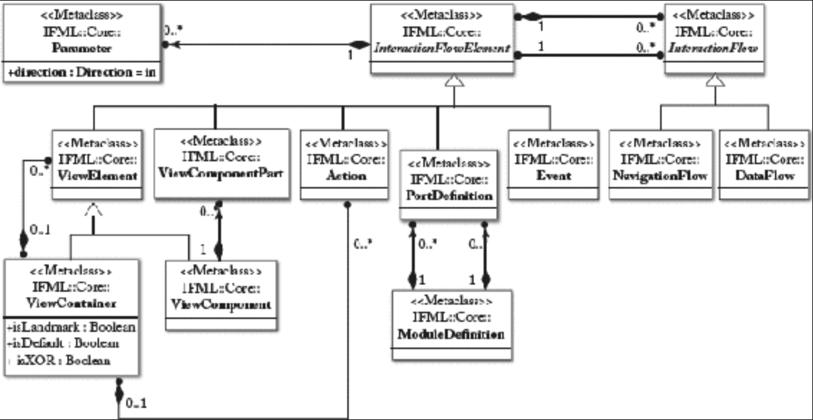
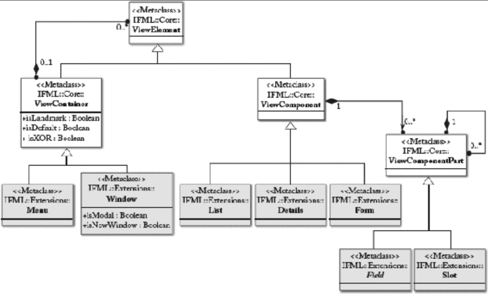
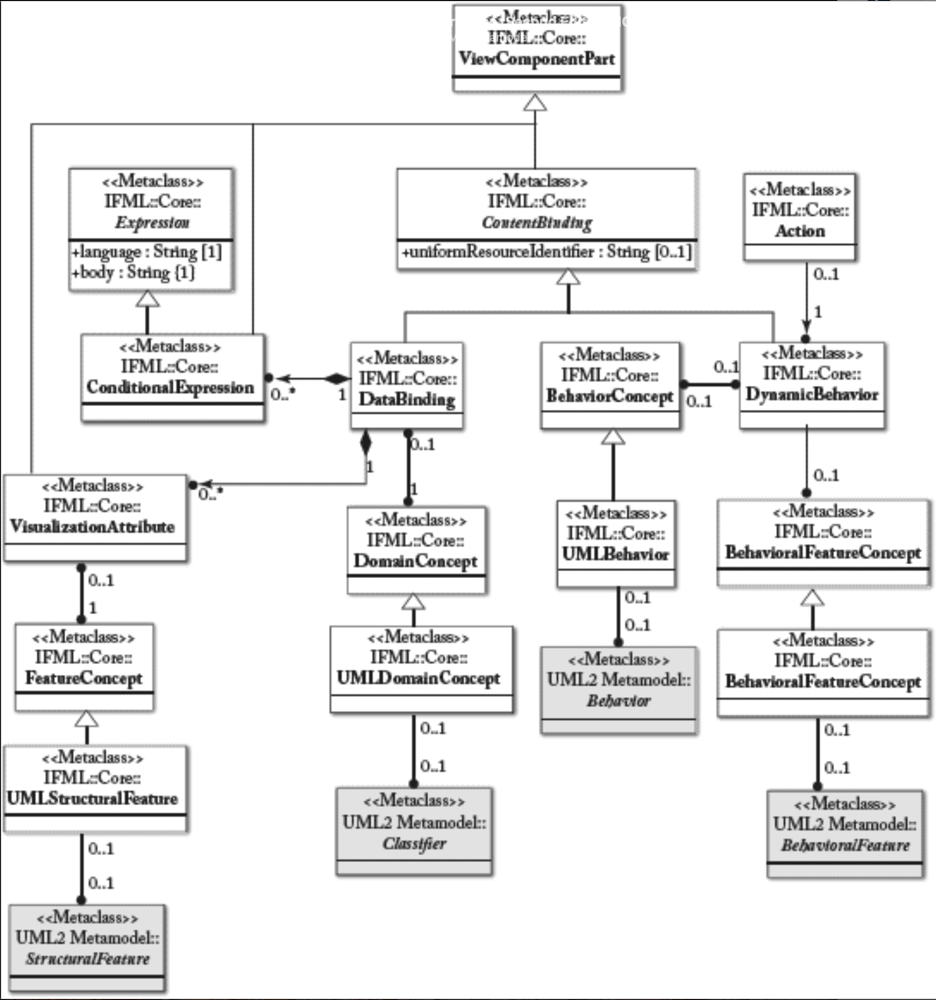
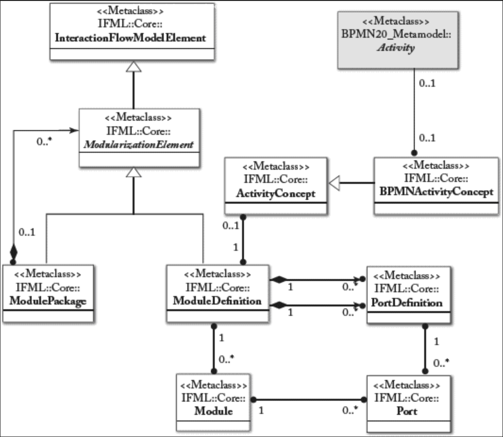

## 7.5 真实世界案例：IFML

#### ▶[上一节](4.md)

为更深入理解在实际场景中定义建模语言的意义，超越此前讨论的简单示例，本文将呈现一个真实世界的建模语言定义案例。<ins>具体而言，我们将探讨交互流程建模语言（Interaction Flow Modeling Language, IFML），该语言于 2014 年被对象管理组织（OMG）采纳为标准。</ins>

IFML 支持应用程序前端的规范，且独立于其实现的技术细节。因此相较于此前介绍的 sWML，它可视为更丰富的（超集）建模语言。相较于 sWML，IFML 适用于任何类型的软件前端建模，涵盖：(i) 视图的组合，以构成界面的可视化单元为基础；(ii) 视图的内容，即向用户展示的信息； (iii) 用户界面支持的命令与交互事件；(iv) 动作，即由事件触发的业务逻辑；(v) 参数绑定，定义用户界面元素间传递的数据项。

### 7.5.1 要求
<ins>定义一种旨在广泛应用和普及的语言时，需满足四大核心要求：</ins>
- **基于标准建模框架** 定义语言；
- 在 **满足领域** 需求的同时，兼顾普及所需的 **易用性与简洁性** 来定义语言特性；
- 具备 **与其他建模视角集成** 的能力，通常通过允许引用其他语言定义的建模元素或整个图；
- 通过合理且有限的扩展点实现 **语言可扩展性** ，以满足特定领域或企业需求，而不扭曲语言本质；
- 支持建模元素 **复用** ，从而最大限度减少模型冗余。

### 7.5.2 在 IFML 中满足要求

上述要求已在 IFML 语言定义中通过以下方式实现：

- **标准化** ：IFML 定义基于 OMG 标准，即 OMG 模型驱动架构（Model Driven Architecture, MDA）框架。具体而言，该规范包含五大核心技术成果 (artifacts)。*IFML 元模型* 及其描述规定了 IFML 构造的结构与基本语义。*IFML UML profile* 定义了基于 UML 的语法以表达 IFML 模型，IFML UML profile 是基于 UML 组件（含基础组件与封装组件）、类及其他 UML 核心概念的运用。*IFML visual syntax* 则提供了模型的具体可视化呈现。*IFML serialization* 提供标准模型交换格式以确保工具互操作性。所有部分 (parts) 均遵循 OMG 标准制定：元模型通过 MOF 元建模语言定义（同时提供等效的 Ecore 定义）；UML 配置文件 (profile) 依据 UML 2.4 配置规则 (profiling rules) 定义；可视化语法 (visual syntax) 则通过图定义（Diagram Definition, DD）与图交换（Diagram Interchange, DI）标准实现。模型序列化与交换格式基于 XMI。 *（译注：原文中说有5个成果，但数了半天只有4个）*
- **简洁性** ：IFML 采用可视化建模语言表达用户交互建模需求，该语言经多年实践验证（其变体已广泛应用），并继承了 WebML [14](../bibliography.md#14) 等 “祖先” 语言的优势。这使我们得以精简语言结构，剔除冗余复杂性。IFML 的设计尽可能遵循以下 “黄金法则”：简洁性，即用最少图示类型和概念表达关键界面与交互设计决策；模型推理 (inference from the model)，即当某些内容可从模型现有部分推导出来时，建模层面的推理规则可应用默认建模模式与细节，避免建模者重复指定冗余信息。主要简化因素之一在于 IFML 的可视化语法基于单一 (unique) 图示类型提供具体化表达。这将用户界面的所有方面整合为一体，而其他方法，如 MobML [26](../bibliography.md#26) 或 UML（参见 UML 配置文件 WAE [18](../bibliography.md#18) ）则需结合类图、状态机图、序列图、活动图、复合结构图及自定义图才能描述用户界面。这种单图表示法的简化使 IFML 成为一种易于学习、使用便捷且工具供应商易于实现的建模语言。
- **集成** ：有时语言设计中最艰难的选择往往在于取舍。这种决策通常基于两种动机：(i) 某些方面与语言使用无关，故不应纳入考虑；(ii) 某些方面并非语言的核心贡献，即使与语言关注领域相关，也应交由专注于这些方面的其他现有语言处理。在后一种情况下，最好的选择是在语言中直接覆盖核心方面，再连接（如通过引用）其他语言处理剩余问题。例如，IFML 刻意忽略呈现方面，因呈现与抽象相悖（图形设计中每个像素都至关重要），且没有为这方面专门对接任何建模语言。另一方面，它将某些虽与用户界面相关却不属于其组成部分的方面，委托给外部模型处理，例如：数据持久化、控件同步以及业务逻辑定义。
- 可扩展性：IFML 基于一套精炼的核心概念抓住 (capture) 交互本质：界面（容器）、刺激（事件）、内容（组件与数据绑定）、动态（流程与动作）。这些概念的设计初衷就是为适应技术与设备演进而扩展。因此 IFML 内置标准机制，允许将新概念定义为核心语言概念的特殊化形式。例如，设计师可针对特定领域或设备，研究新型组件类型（代表特定控件）或新型事件类型。
- 可复用性：IFML 通过定义专门的模型元素 *Modules* ，帮助语言使用者定义可复用且模块化的模型。这些模块专为支持通用（及参数化）交互组件的定义而设计，可在设计任意部分进行引用。

### 7.5.3 元建模原则
IFML 元模型遵循语言定义的最佳实践进行定义，包括抽象化和模块化。

<ins>**抽象化** 。在不同抽象层级定义语言概念是良好实践，可将更抽象和通用的概念与低级具体概念分离。核心概念通过具体概念扩展以满足更精确的行为需求。可设计多层抽象结构，其中更精确或详细的概念继承自通用概念。</ins>

<ins>**模块化** 。所谓模块化，是指将语言定义拆分为具有一致性和凝聚力的模块（的实践）。这对语言的可理解性至关重要。在语言中实现模块化的典型方式，是将元类聚合为一致的包</ins>。IFML 元模型分为三个包：*Core* 包、*Extension* 包和 *DataTypes* 包。

*Core* 包包含构建语言基础设施的概念，包括 InteractionFlowElements, InteractionFlows, 和 Parameters。

*Extension* 包包含具体概念，这些概念遵循抽象原则，对 *Core* 包概念进行细化，以满足更精确的行为需求。

*DataTypes* 包包含 IFML 定义的自定义数据类型。IFML 元模型复用 UML 元模型的基本数据类型，并专门化若干 UML 元类作为 IFML 元类的基础。此外，它假定领域模型通过 UML 类图或等效记法表示。

### 7.5.4 IFML 元模型
虽然完整语言规范的讨论超出本书范围（可参阅 OMG 规范文档 [29](0.md#29) ），但下文仍摘录部分规范内容，以便读者领略设计精髓，理解相关原则与要求在实践中的具体体现。[Fig 7.15](#fig-715) 展示了描述语言核心元素的规范节选。<ins>此处的主要设计理念在于实现多层次抽象：通用的 *InteractionFlowElement* 作为抽象元类在模型中从不实例化，进一步的细化由其具体子类完成</ins> *ViewElement*、*ViewComponentPart*、*Action*、*PortDefinition* 及 *Event* 。*InteractionFlow* 抽象元类同样遵循此原则，实际应用中仅以 *NavigationFlow* 或 *DataFlow* 形式存在于模型中。需注意 *InteractionFlow* 是两个 *InteractionFlowElement* 之间的有向连接，而 *InteractionFlowElement* 本身可携带参数。[Fig 7.16](#fig-716) 展示了 *ViewElement* 的详细层次结构，该元素实际实例化为 *ViewContainer* 或 *ViewComponent*： *ViewContainer* 在 Extension 包中进一步扩展为 UI 容器示例，如菜单 (Menu) 和窗口 (Window)（其他示例包括屏幕、网页、面板等）。 *ViewComponent* 则扩展为可放入 *ViewContainer* 的典型控件，如 *列表 (List
)* 、 *表单 (Form)* 、 *详情 (Details)* 等。<ins>需注意这里采用了 *组合 (composite)* 设计模式以最优方式描述包含关系，*ViewComponentPart* 的定义亦采用类似方案</ins>。

#### Fig 7.15

*Fig 7.15: IFML 元模型节选：InteractionFlow 和 InteractionFlowElement*

#### Fig 7.16

*Fig 7.16: IFML 元模型节选：ViewElement 及其层次结构（含包含关系）*

[Fig 7.17](#fig-717) 中的元模型片段展示了与其他模型（及建模语言）的集成定义。<ins>具体而言，它描述了 IFML 如何连接 UML 以定义内容模型（确定用户界面需包含的数据）及业务逻辑规范</ins>。再次采用多层抽象机制：*ContentBinding* 的抽象概念（用于连接 *ViewComponent* 与外部数据源或业务逻辑）通过实际可用的绑定机制进行扩展： *DataBinding* （为组件定义 *DomainConcept* 的引用及 *VisualizationAttributes* ）和 *DynamicBehavior* 。通过多层抽象机制，每种替代方案最终引用 UML 元模型的特定元素：*Classifier* 、 *StructureFeature*（即 UML 属性或关联端）、*BehavioralFeature* （UML method）或 *Behavior* （UML 动态模型，如序列图或活动图）。

#### Fig 7.17

*Fig 7.17: IFML 元模型节选：ContentBinding 及关联结构*

<ins>最后，[Fig 7.18](#fig-718) 阐述了 IFML 中模块化与复用的定义方式</ins>。通过组合模式 (composite pattern) ，可复用模块被定义为 *ModuleDefinitions* ，并可聚合于包的分层结构中。模块定义具备输入输出端口以支持参数传递。可选地，它们也可连接至 BPMN 活动，这意味着指定的用户界面模块，必须被解释为（业务流程模型中定义的）特定业务活动的实现。模块定义完成后，可通过 *Module* 元类及其关联的 *Port* 元类在模型中多次实例化。

#### Fig 7.18

*Fig 7.18: IFML 元模型节选：模块化*

### 7.5.5 IFML 具体语法
为最大化接受度与可读性，IFML 采用了特定的符号表示法 (notation) 。该符号表示法尽可能借鉴现有主流建模语言，以确保不同符号表示法间符号与含义的一致性。

例如，事件符号采用圆形表示，这符合多种语言的惯例（如 UML 活动图、BPMN 或有限状态机）。容器以方形框表示，组件则用圆角框表示。IFML 模型的可视化示例如第 [6](../ch6/0.md) 章 [Fig 6.13b](../ch6/6.md#fig-613) 所示。

#### ▶[下一节](../ch8/0.md)
