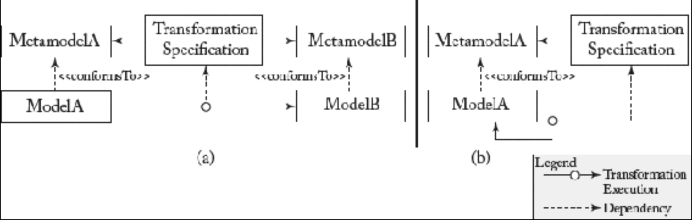

## 8.1 模型转换及其分类

#### ▶[上一节](0.md)

自首批编译为汇编语言的高级编程语言问世以来，转换技术便成为软件工程的核心手段之一。毫不意外，模型转换在 MDE 中同样至关重要，其多样化的形式可解决不同任务[19](../bibliography.md#19)，[49](../bibliography.md#49)。

广义而言，M2M 转换是接收一个或多个模型作为输入，并生成一个或多个模型作为输出的程序。多数情况下，仅需 *一对一 (one-to-one)* 转换，即一个输入模型对应一个输出模型，即可满足需求。例如，将类图转换为关系模型。但某些场景需要 *一对多 (one-tomay)* 、*多对一 (many-to-one)* 甚至 *多对多 (many-tomany)* 转换，例如，模型合并场景中需将多个类图整合为统一视图。

除依据输入输出模型数量分类外，另一维度在于：<ins>转换是否发生在两种不同语言的模型之间，称为 *外生 (exogenous)* 转换，或发生在同种语言编写的模型内部，称为 *内生 (endogenous)* 转换</ins> [49](../bibliography.md#49)。外生转换的示例是 MDA 典型场景：将平台无关模型（如 UML 模型）转换为平台特定模型（如 Java 模型）。内生转换的著名案例则是模型重构。类似于代码重构，模型同样需要质量提升，这可通过转换实现模型结构重组。

此外，<ins>外生模型转换不仅适用于 *垂直 (vertical)* 转换，如前述 UML 转 Java 场景，其中输入输出模型的抽象层次不同，还可用于 *水平 (horizontal)* 转换，即输入输出模型保持大致相同抽象层次的场景</ins>。例如，水平外生转换常用于实现不同建模工具间的模型交换，如将 UML 类图转换为 ER 图。

过去十年间，模型转换领域涌现出两种核心执行范式，参见 [Fig 8.1](#fig-81) 比较。其一是 *异位 (out-place)* 转换，即从零 *生成 (generating)* 输出模型（参见 [Fig 8.1a](#fig-81) ），此类转换尤其适用于外生转换。其次是 *原位 (in-place)* 转换，通过在输入模型中创建、删除和更新元素来 *重写 (rewriting)* 模型（参见 [Fig 8.1b](#fig-81) ）。该范式显然完美契合重构等内生转换场景。

#### Fig 8.1

*Fig 8.1: 不同类型的模型转换：（a）外生异位转换 vs. （b）内生原位转换*

后续章节将阐述如何使用ATL将外生转换指定为移位转换，以及如何使用图转换语言将内生转换指定为就地转换。

#### ▶[下一节](2.md)
