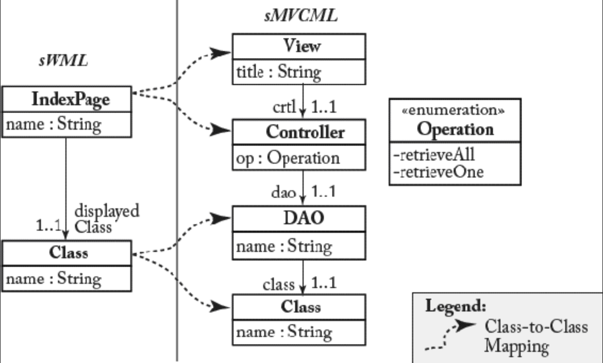
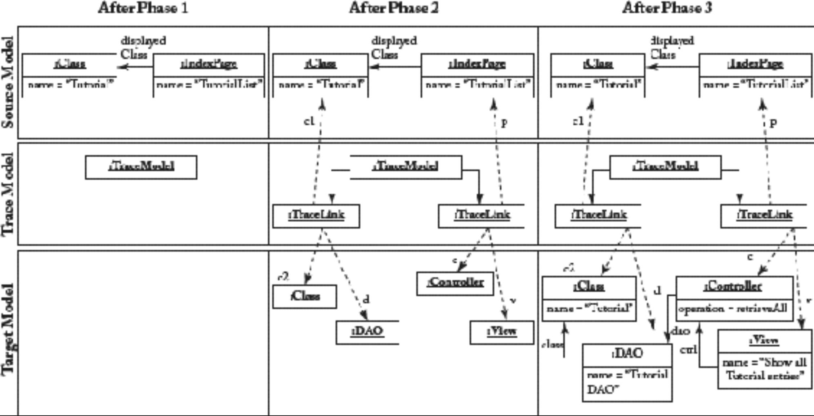

## 8.2 外生异位转换

#### ▶[上一节](1.md)

ATLAS 转换语言（ATLAS Transformation Language, ATL）[41](../bibliography.md#41) 被选作开发外生性异位转换的示例性转换语言，因其在学术界与工业界均属应用最广泛的转换语言之一，且具备成熟的工具支持 <sup>[1](0.md#1)</sup> 。ATL 是一种基于规则的语言，在 OCL 基础上进行了深度扩展，同时为模型转换提供了 OCL 所缺失的专用语言特性，例如，模型元素的创建（需注意 OCL 是无副作用的）。

ATL 作为混合型模型转换语言，融合了声明式与命令式构造。ATL 转换具有 *单向性 (uni-directional)* ，即若需实现从语言 A 到语言 B 的转换，反之亦然，则需分别开发两个转换。ATL 转换作用于 *只读 (read-only)* 源模型，并生成 *只写 (write-only)* 目标模型。请注意：对于异位转换，通常使用 *源模型 (source model)* 替代 *输入模型 (input model)* ，使用 *目标模型 (target model)* 替代 *输出模型 (output model)* 。因此，``本文中这两个术语可互换使用。

回到 ATL 转换的操作模式：执行转换时，源模型可被查询但禁止修改；目标模型元素虽被创建，但转换过程中不得直接查询 <sup>[2](0.md#2)</sup> 。这两项限制的根本原因在于：若无此约束，源模型与目标模型的查询结果可能因转换执行状态而变化，这将违背 ATL 声明式部分的本质。

### 转换示例
为介绍 ATL 的基础，我们沿用前面章节的运行示例。假设需开发基于模型-视图-控制器（MVC）模式的从 sWML 模型到 PSM 的转换片段。为表达 PSM，采用一种用于建模 MVC 架构 Web 应用的语言 —— 即简化 MVC 建模语言（sMVCML）。[Fig 8.2](#fig-82) 展示了该转换过程中源元模型与目标元模型的两个局部片段。

#### Fig 8.2


*Fig 8.2: sWML 与 sMVCML 元模型的节选*

假设针对给定元模型片段，从 sWML 到 sMVCML 的转换需满足以下两项基本需求。这些需求在 [Fig 8.2](#fig-82) 中以元模型片段间的类对应关系以图形化展现。虽然类对应关系只是作为模型转换的粗粒度规范，但下文将通过自然语言给出更细粒度的规范，其中也包含值对应关系。

- *需求 1* ：对于 sWML 模型中的每个 *Class* 实例，sMVCML 模型中必须创建一个 *Class* 实例和一个 *DAO* <sup>[3](0.md#3)</sup> 实例。sWML 类的名称应作为 sMVCML 类的名称，DAO 的名称则由 sWML 类名加上 “DAO.” 构成。最终，该 DAO 必须包含指向 sMVCML 类的链接。


- *需求 2* ：对于 sWML 模型中的每个 *IndexPage* 实例，sMVCML 模型中必须生成：一个分配了 *showAll* 操作的 *Controller* 实例，以及一个包含必要 UI 元素的 *View* 实例（为简洁起见，下文未展示）。*View* 实例需与 *Controller* 实例建立关联。此外，*Controller* 实例还需与为 sWML *Class* 实例生成的 *DAO* 实例建立关联，该关联通过 *IndexPage* 实例的 *displayedClass* 引用实现。*（译注：最后一句话的翻译需要仔细推敲）*

[List 8.1](#list-81) 展示了在 ATL 中上述两项需求的转换实现。本列表将作为示例，用于阐释 ATL 语言特性。

#### List 8.1
```
module SWML2MVC;
create OUT : sMVCML from IN : sWML;
-- implementation of requirement 1
rule Class2Class_DAO {
  from
    c1 : sWML!Class
  to
    c2 : sMVCML!Class (
      name <- c1.name
    ),
    d : sMVCML!DAO (
      name <- c1.name + 'DAO ',
      class <- c2
    )
}
-- implementation of requirement 2
rule IndexPage2Controller_View {
  from
    p : sWML!IndexPage
  to
    c : sMVCML! Controller (
      op <- #retrieveAll ,
      dao <- thisModule.resolveTemp(p.displayedClass , 'd')
    ),
    v : sMVCML!View(
      title <- p.title ,
      ctrl <- c
    )
}
helper context sWML!IndexPage def : title : String =
  'Show all ' + self.displayedClass.name + ' entries ';
```
*List 8.1：ATL 转换示例*

### ATL 转换的剖析
ATL 中定义的转换以 *module* 表示，*module* 被分为 *header* 与 *body* 两部分。头部声明转换模块的名称，并通过元模型类型，声明源模型与目标模型。单个 ATL 转换可包含多个输入模型和输出模型。

在 [List 8.1](#list-81) 中，定义了一个类型为 sWML 的输入模型（参见 *from* 关键字）和一个类型为 sMVCML 的输出模型（参见 *create* 关键字）。因此，该场景属于典型的 *一对一 (one-to-one)* 模型转换。

ATL 转换的主体由 *rules* 和 *helpers* 组成，它们在头部之后，以任意顺序声明。

- *规则 (Rules)* ：每条规则描述如何从源模型的（部分）生成目标模型的（部分）。ATL 中存在两种声明式规则 <sup>[4](0.md#4)</sup> ：*匹配 (matched)* 规则与 *延迟 (lazy)* 规则。前者由 ATL 执行引擎自动匹配输入模型，后者则需由其他规则显式调用，从而赋予转换开发者对转换执行的更多控制权。

  规则主要由 *输入 (input)* 模式和 *输出 (output)* 模式构成。输入模式通过定义一个或多个输入模式元素 (input pattern elements) ，筛选涉及的源模型元素子集。具体而言，每个输入模式元素必须声明强制类型（对应源元模型中定义的元类名称）及可选过滤条件（以 OCL 表达式表示）。类型和过滤条件共同限定规则适用的模型元素范围。输出模式则详细规定如何从输入生成目标模型元素。每个输出模式元素可包含多个 *绑定 (bindings)* ，用于初始化目标模型元素的特征。绑定中赋值的数值由 OCL 表达式计算得出。
- *辅助器 (helpers)* ：辅助器是辅助功能，可实现将 ATL 代码分解，在转换的不同地点使用。辅助器分为两类。首先，辅助器可模拟一个派生属性，该属性需在整个转换过程中保持可访问性。其次，辅助器可表示一项操作，该操作针对给定的上下文对象和输入参数计算出一个值。与规则不同，辅助器无法生成目标模型元素，它们只能返回值，这些值将在规则中进一步处理

在 [List 8.1](#list-81) 中，我们定义了两条匹配规则以实现上述需求。第一条规则负责将 `sWML!Class` 实例转换为 `sMVCML!Class` 和 `sMVCML!DAO` 实例。因此该规则采用简单输入模式（参见 *from* 关键字），匹配所有 `sWML!Class` 元类实例。该规则的输出模式（参见 *to* 关键字）通过使用两个对应的输出模式元素，为每个匹配项创建 `sMVCML!Class` 实例和 `sMVCML!DAO` 实例。输出模式元素的绑定关系很直接。输入模式元素的名称（如 `c1` ）用于在输出模式元素的绑定中访问输入模式元素，从而获取构建输出模型所需的输入模型信息。由此可将输入模型中的类名称转移至输出模型（ `name <- c1.name` ）。此外，通过在绑定中再次使用输出模式元素名称，在输出模式中，输出模式元素可直接关联，例如：`class <- c2` 。

为将 *IndexPages* 实例转换为 *Controller* 和 *View* 实例，引入第二条规则。该规则同样采用仅含单元素的简单输入模式，输出模式仍包含两个元素。除 *Controller.dao* 的引用绑定外，输出模式元素的绑定关系均较为直接。该绑定更为复杂的原因在于：*Controller* 实例需引用由其他规则创建的 *DAO* 实例。因此，我们无法直接指向目标元素，就像之前链接 *DAO* 和 *Class* 实例时那样，那时两者都在第一条规则中创建。要链接到由不同规则创建的目标元素，我们必须为给定的源元素解析目标元素。为此，ATL 提供了一个名为 *resolveTemp* 的特定操作，能够为给定的源元素检索生成的目标元素。因此，在将 *Controller* 与 *DAO* 关联时，我们利用该操作获取由 *IndexPage* 关联的 *Class* 实例所生成的 *DAO* 实例。请注意，在简单场景下无需显式调用 *resolveTemp* 操作，在这种场景下，会自动获取首个输出模式元素生成的（目标）元素。关于 *resolveTemp* 操作的更多细节将在后续章节中阐述，其描述了 ATL 的执行阶段。这些阶段对目标元素实际解析的时机具有重大影响。相比之下，由同一规则生成的实例之间的关联则简单得多。只需将输出模式元素的变量作为绑定值使用（例如 `crtl <- c` ）。请注意，在计算 *View* 实例标题时，引入了专用辅助函数，该函数在设置 *title* 属性的绑定中调用。此辅助函数可视为 *IndexPage* 类的派生属性。

### ATL 转换的执行阶段
ATL 是一种强大的语言，允许我们使用简洁的语法定义转换。为阐明 ATL 语法背后的细节，我们将带大家看看 ATL 虚拟机的实际转换执行。ATL 转换的执行分为三个顺序阶段，下文将结合具体转换运行实例的节选（参见 [Fig 8.3](#fig-83) ）进行说明，该实例摘自 [List 8.1](#list-81) 所示的 ATL 转换。

#### Fig 8.3


*Fig 8.2: ATL 转换执行阶段示例*

- *阶段一：模块初始化* 。首阶段将初始化用于存储源/目标元素间 *追踪链接 (trace links)* 的 *追踪模型 (trace model)* 。后续阶段二中，每次匹配规则的执行都会存储于该追踪模型中，通过创建指向匹配输入元素与生成输出元素的追踪链接。如后续将阐述，追踪模型是外生转换的关键概念：(i) 用于终止转换执行；(ii) 基于源元素值为目标元素分配特征。

  *示例* ：在本例中，该阶段仅初始化追踪模型，如 [Fig 8.3](#fig-83) 左侧所示。

- *阶段二：目标元素分配* 。在阶段二，ATL 转换引擎通过寻找源模型元素的有效配置，来匹配已匹配规则的源模式。当源模型元素的配置满足某条已匹配规则的匹配条件（所有输入模式元素均已绑定且过滤条件有效）时，ATL 转换引擎将根据声明的目标模式元素分配 (allocates) 对应的目标模型元素集。请注意：此时仅创建元素，其特征尚未设置。此外，每次匹配都会生成一条追踪链接，用于连接匹配的源元素与生成的目标元素。

  *示例* ：如 [Fig 8.3](#fig-83) 中部所示，本例中两条规则各存在一次匹配。目标元素在目标模型中完成分配，追踪链接生成后附加至追踪模型。

- *阶段三：目标元素初始化* 。在阶段三，通过执行针对目标模式元素定义的绑定，对每个分配的目标模型元素进行初始化。绑定中常调用 *resolveTemp* 操作。该操作可引用第二执行阶段为特定源模型元素生成的任意目标模型元素，其签名如下：`resolveTemp(srcObj:OclAny,targetPatternElementVar:String)` 。第一个参数代表源模型元素，目标模型元素需基于该元素进行解析。第二个参数是待检索目标模式元素的变量名。第二个参数是必需的，因为在单条规则中使用多个目标模式元素时，可能为一个源元素生成多个目标元素 —— 正如本例所示。因此，当解析源模型元素时，必须指定生成该目标元素的目标模式元素变量。

  *示例* ：在本例中，部分绑定较为简单，即仅链接单条规则内生成的目标模型元素，或匹配的源模型元素直接包含设置目标模型元素特征所需的信息（如属性值）。但有一个绑定使用了 *resolveTemp* 操作（`resolveTemp(p.displayedClass,‘d’)`）。在执行 *resolveTemp* 操作前，通过评估该操作的首个参数，查询匹配页面的显示类。随后通过执行 *resolveTemp* 操作，自动获取显示类的跟踪链接，最终利用输出模式元素的变量名，从跟踪链接的链接目标元素集合（`{‘c2’,'d'}`）中检索实际请求的目标元素（由操作的第二个参数指定）。你可以将输出元素的检索过程理解为：通过使用输出模式元素变量作为引用名称，从追踪链接导航至输出元素。

### 内部与外部追踪模型
上述展示的追踪模型属于 ATL 转换引擎的内部机制。它既是便捷设置目标元素特征的关键，也是终止规则执行的核心——ATL 执行引擎仅在匹配时才会执行规则，如果该匹配（即匹配到的输入元素集合）尚未被现有追踪链接覆盖时。*（译注：这句话超级拗口，读的时候小心一些，请参考原文）*

若因外部可追溯性原因，需要持久化追踪模型，如观察源模型变更对目标模型的潜在影响，则可将此内部追踪模型（默认仅为临时数据）作为模型转换的独立输出模型进行持久化存储 [40](../bibliography.md#40), [72](../bibliography.md#72)。

### ATL替代方案
除 ATL 外，还有其他用于外生异位转换的专用转换方法。

**QVT** 。OMG 的查询-视图-转换（Query-View-Transformation, QVT）标准涵盖三种模型转换开发语言。首先，QVT 关系 (Relational) 语言采用声明式方法定义元模型间的对应关系。但与 ATL 不同，这些对应关系不限定转换方向，可双向解释。这使得能够推导双向转换规则，同时检查两个模型的一致性，甚至在模型不一致时实现同步（相关术语详见 [8.4.4](4.md) 小节）。其次，QVT 操作 (Operational) 语言采用命令式方法实现单向模型转换。该语言虽提供开箱即用的追踪支持，但转换规则的调度需由用户定义，类似于 ATL 中延迟规则的用法。第三，QVT 核心 (Core) 语言是低级语言，其被设计为 QVT 关系语言编译器的目标。因此其不试图在 QVT 核心 Core 中直接编写转换。Eclipse 中有为声明性语言（QVT Relations 和 QVT Core）<sup>[5](0.md#5)</sup> 以及 QVT Operational <sup>[6](0.md#6)</sup> 语言提供支持的工具。

**TGG** 。三重图语法（Triple Graph Grammars）[60](../bibliography.md#60) 是定义元模型间对应图 (correspondence graph) 的专用方法，可实现双向模型转换。此外，该对应图可用于模型同步及一致性验证。因此 TGG 针对与 QVT 关系 (Relations) 语言相似的场景，但具备更坚实的理论基础。在 MOFLON <sup>[7](0.md#7)</sup> 中有 TGG 的工具支持，在 Eclipse 中有 TGG Interpreter <sup>[8](0.md#8)</sup> 提供的工具，以及 MDElab <sup>[9](0.md#9)</sup> 提供的TGG 工具⁹。

**ETL** 。在 Epsilon 项目中，开发了多种用于模型管理的语言。Epsilon 转换语言（Epsilon Transformation Language, ETL）<sup>[10](0.md#10)</sup> ) 支持类似 ATL 的外生、异位模型转换，同时提供额外功能，例如在转换过程中修改输入模型元素的能力。

#### ▶[下一节](3.md)
