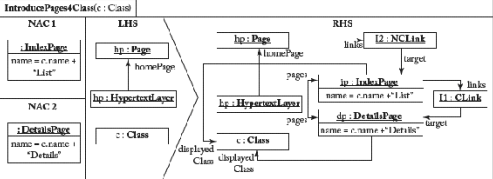
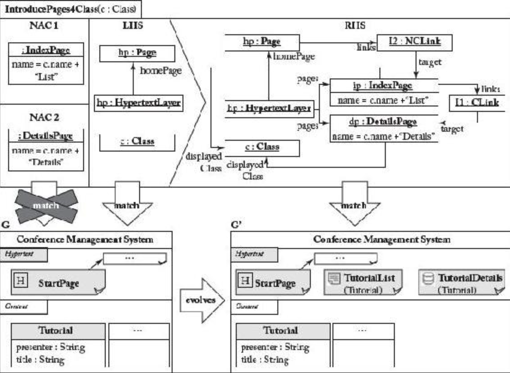
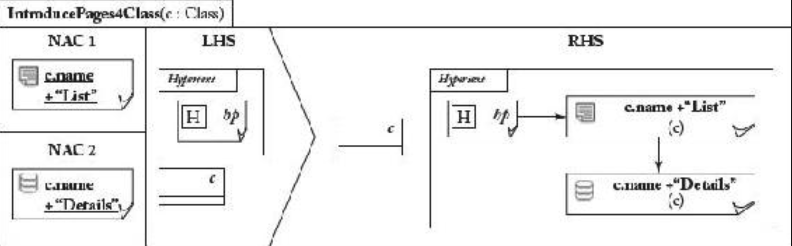

## 8.3 内生原位转换

#### ▶[上一节](2.md)

迄今为止，模型均通过在建模编辑器中的手工进行修改，例如添加或删除模型元素、更新其值等。然而在众多场景中，模型修改应当或必须实现自动化。需注意：异位 (out-place) 转换要求从零开始构建输出模型。若采用异位转换引入模型修改，则需将完整源模型复制到目标模型，除了待删除或修改的元素。因此，存在更适合此类转换场景的替代执行模式。例如，*原位（in-place）* 转换可在不复制模型静态部分（即不受转换影响的元素）的情况下实现模型变更。因此仅需处理动态部分（即变更内容）的转换规则（无需复制未修改元素的规则）。

*图转换 (Graph trnasformation)* [21](../bibliography.md#21) 是实现原位模型转换的优雅方案。因此，被选取来演示原位模型转换的开发与应用。

### 图转换基础
图转换是一种声明式的，基于规则的技术，通过将模型与元模型表示为图结构（带类型和属性的节点与边），实现原位模型转换。由此，模型可通过图转换技术进行操作。

图转换特别适用于定义原位转换，以支持模型仿真、优化、执行、演化及重构等操作。然而其通用性极强，通过将源模型、目标模型及追踪模型作为一个整合的图结构，图转换也可用来构建异位 (out-place) 转换。

图转换因其可视化形式（使规则直观易懂）和形式化特性（便于规则分析）而广受欢迎。例如，图转换可用于描述建模语言的操作语义以实现模型执行引擎，其优势在于能利用建模语言的抽象语法（有时甚至具体语法）定义转换规则，从而使规则对设计者非常直观。

<ins>*图语法 (graph grammar)* 由一组图转换规则及初始图（常称 *宿主图 (host graph)* ）构成，规则将作用于该初始图</ins>。规则核心包含左侧图（left-hand side, LHS）与右侧图（right-hand side, RHS）：LHS 表达规则适用的先决条件，RHS 则包含规则的后置条件。规则执行的操作由两侧隐式定义。更精确地说，转换规则的执行会产生以下效果：(i) 仅存在于 LHS 的所有元素被删除；(ii) 仅存在于 RHS 的所有元素被添加；(iii) 同时存在于两侧的所有元素被保留。为标记 RHS 侧元素与 LHS 侧元素的等价关系，两者必须被赋予相同的标识符。

为将规则应用于初始图，需在图中找到 LHS 侧的 *形态 (morphism)*（常称为 *occurence* 或 *match*）。若存在多个匹配项，则随机选取其中一个。随后规则被应用于所选的匹配项（通过将匹配项替换为 RHS ）。语法执行以非确定性顺序应用规则，直至无可用规则。还有其他形式的图转换系统，允许更精细地控制实际转换执行，本节后续将详细介绍这些形式。

图转换引擎尽可能以任意顺序全自动执行转换规则。但某些场景需要交互式执行模式。假设需对特定模型元素进行重构，则用户需手动选定该元素，此元素将成为转换规则的重要输入参数，这就实现了重构。因此，某些图转换方法允许通过显式输入参数预先绑定 LHS 侧元素，用户可在执行转换规则前设置这些参数。此外，在转换规则执行过程中可能需要额外用户输入，例如为无法从当前模型状态推导出的模型元素特征设置值。因此，某些方法允许我们在转换执行期间查询用户输入。

### 转换示例
为说明图转换的使用，我们采用以下转换示例。为加速 sWML 模型的开发，应提供一种模型补全支持，使我们能够即时为内容层中选定类在超文本层引入若干元素。具体而言，需创建一个 *IndexPage* （可从 Web 应用主页访问），用于展示该类所有实例的列表。此外，该页面需链接至显示选定实例详情的 *DetailsPage* 。此类模型补全操作正是原位转换的典型应用场景。针对特定类创建前述页面的转换规则如 [Fig 8.4](#fig-84) 所示。

#### Fig 8.4

*Fig 8.4: 图转换规则示例：为选定类引入内容页*

规则 LHS 侧声明必须存在一个类（该类需由用户通过设置转换规则的输入参数来选择），同时还需包含一个已内置主页的超文本层。超文本层用于容纳待生成的页面，这些页面仅在规则 RHS 侧声明，意味着它们由规则执行过程动态创建。请注意该规则不是元素删除，因此 LHS 侧完全包含于 RHS 侧。新页面的属性值通过表达式计算生成，这些表达式可借助变量名访问其他元素的属性（例如 `name = c.name + “List”` ）。通常这些表达式采用 OCL 或脚本语言定义。

一个主要关注点在于控制规则的应用。规则 LHS 侧规定了图中必须存在哪些元素才能执行该规则。然而，在应用规则时，通常需要描述图中不应存在的内容。为此，图转换引入了负面应用条件（Negative Application Conditions, NAC）。NAC 是描述初始图中禁止子图结构的图，即必须确保特定节点和边不存在。当 LHS 侧匹配成功且该匹配不满足 NAC 时，包含 NAC 的图转换规则即被执行。一条规则不仅可附加一个NAC，也可附加多个。在本例中，使用了两个 NAC 以避免重复引入已存在的 *IndexPages* 和 *DetailsPages* 。请注意：此示例必须使用两个 NAC 而非单个。当 *IndexPage* 和 *DetailsPage* 同时存在时，若仅使用一个 NAC 会禁止应用规则，而当仅存在其中一个时则不会触发禁止。

为演示图转换规则的执行过程，请参见 [Fig 8.5](#fig-85) 。用户选定 *Tutorial* 类后，该转换规则在图 *G* 上执行。由于存在包含主页的超文本模型，且假设该类不存在 *IndexPage* 和 *DetailsPage* ，故规则前置条件成立。因此，规则 RHS 侧重写了图 *G* ，具体而言在超文本模型中，创建了两个正确关联的页面（ *TutorialIndex、TutorialDetails* ）。请注意，在生成的图 *G* 中，转换规则的 RHS 侧可被完全匹配。

#### Fig 8.5

*Fig 8.5: [Fig 8.4](#fig-8-4) 中应用图转换规则*

### 高级图转换技术
存在多种用于定义、执行和分析图转换的高级技术。

**替代表示法** 。迄今为止，转换规则均采用建模语言的抽象语法定义。若使用建模语言的具体语法定义转换规则（如 [Fig 8.6](#fig-86) 的图转换规则示例），或许可以获得更高的可读性。但目前仅有少数图转换工具支持此功能。此外，某些方法采用压缩图形符号表示法：将 NACs、LHS 和 RHS 合并为单一图结构，并通过某些注释来标记被禁止、保留、删除或创建的元素。最后还有方法采用文本化的具体语法定义图转换规则。本节末尾将讨论这些不同范畴的主要代表。

#### Fig 8.6

*Fig 8.6: [Fig 8.4](#fig-8-4) 中图转换规则的具体语法表示*

**规则调度**。图转换系统由一组不同的图转换规则构成。此时需要确定规则的执行顺序。若未作其他规定，则默认采用非确定性的规则选择机制，直至不再有规则匹配 —— 正如我们在图语法讨论中所阐述的那样。当存在不同的规则执行序列时，理论上可能产生多种不同的输出模型。然而在某些情况下，确定性的图转换系统执行更受青睐。为支持此类场景，引入了两种扩展方案。首先，是基础方法，为规则定义 *优先级 (priorities)* ，即当多个规则在任意时刻均可能匹配时，执行优先级最高/最低（具体取决于不同方法中优先级的排序规则）的规则。其次，更高级的方法是通过类似编程的控制结构（常称为图转换单元）实现强大的图转换规则的 *编排 (orchestration)* 能力，例如，定义循环、条件分支等。这些方法统称为 *可编程图转换 (programmable graph transformations)* [66](../bibliography.md#66) 。

**分析**。由于图转换属于声明式方法且具有坚实的理论基础，有多种分析方法可用于图转换系统。首先，当采用非确定性图转换系统时，存在这样一个问题：当规则以任意可能的顺序应用时，最终是否总会产生相同的唯一模型。对于这种情况，此可计算规则间的关键对 (critical pairs) [32](../bibliography.md#32)。关键（规则）对被定义为两条互斥规则，即规则 1 的应用会阻碍或启用规则 2 的应用。最后，某些图转换方法允许我们推导图转换系统的终止条件。

### 工具支持
目前有多个 Eclipse 项目专门致力于为 EMF 提供图转换技术。但除共同目标外，不同项目在图转换的实现与执行上支持不同的功能特性。因此，具体应选用何种图转换工具需根据实际转换问题逐案决定。

**Henshin** [11](0.md#11) 作为 EMF Tiger 的继任者，致力于引入可编程图转换等高级特性，及模型检查支持等分析功能。此外，其与 AG [12](0.md#12) 的集成使我们能够运用计算转换规则间关键对等先进技术。

**Fujaba** [13](0.md#13) 是可编程图变换方法的代表。特别是，故事图（类似于 UML 活动图）用于协调图转换规则。在图变换规则内部，Java 语言用于定义 LHS 侧应用条件及 RHS 侧的赋值。

**e-Motions** [14](0.md#14) 是一款 Eclipse 插件，通过使用建模语言的图形化符号表示法所展示的图转换规则，以图形化方式指定建模语言的行为。e-Motions 的一个独特功能是能够为规则指定时间相关属性，例如持续时间或周期性。在 e-Motions 中定义建模语言的行为后，可通过将模型及模型其转换（规则）翻译为 Maude [15](0.md#15)15 （Maude 是一个基于重写逻辑的编程框架）来对模型进行仿真与分析。

**ATL refining** 。*ATL Refining* [68](../bibliography.md#68) 为 ATL 新增了专为内生原位转换设计的执行模式。只需在 ATL 转换的头部将 *from* 关键字替换为 *refining* 关键字即可激活该模式。原位转换规则在语法上仍采用标准异位规则形式，包含输入模式与输出模式。但其执行机制存在差异。若输出模式元素已被定义为输入模式元素（通过共享相同变量名），则该元素将通过绑定进行更新，但不会被创建。新引入的输出模式元素（在输入模式中无对应项）将由规则生成。删除元素时，可为输出模式元素添加特殊标注词 *drop* ，表示该元素及该元素的包含物（containees, 即直接或间接包含于该元素的所有元素）将被删除。总而言之，ATL Refining 是一种采用文本语法的就地转换语言。

#### ▶[下一节](4.md)
