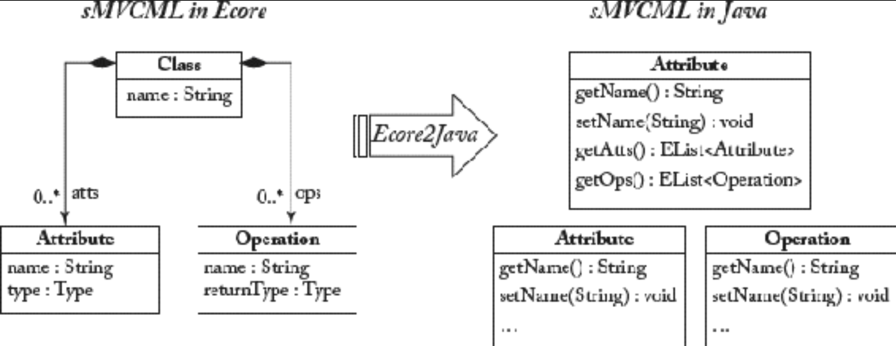

## 9.2 通过编程语言实现代码生成

#### ▶[上一节](1.md)

总体而言，代码生成器的实现既可以基于 MDE 原理，也可以采用更传统的编程方法。采用后者时，代码生成器可作为一个程序实现：这个程序使用元模型自动生成的模型 API 处理输入模型，并将代码语句输出至文件，使用编程语言 API 提供的标准流写入器 (stream writer)，编程语言用于实现代码生成器。

在 EMF 中模型 API 是通过自身实现的 M2T 转换来实现的，该转换读取基于 Ecore 的元模型，并为每个 Ecore 类生成对应的 Java 类。[Fig 9.1](#fig-91) 左侧展示了 sMVCML 元模型的片段，右侧则呈现了对应的 Java 类。Ecore 到 Java 的映射基本直观 —— 这正是 Ecore 的设计目标之一。对于元类的每个特征，都会在 Java 端生成对应的 *getter* 和 *setter* 方法。这意味着，通过使用这些生成的 Java 代码而非建模编辑器，即可读取、修改模型，甚至从零创建模型。关于如何使用生成的模型 API 及强大的 EMF API 的详细信息，请参阅 [64](../bibliography.md#64)。

#### Fig 9.1


*Fig 9.1: 源自 sMVCML 元模型片段生成的模型 API*

在第 [9.3](3.md) 节深入探讨具体 M2T 转换语言之前，我们将展示如何运用 GPL 开发代码生成器。通过此过程，我们将阐明：(i) 如何利用从元模型生成的模型 API 来处理模型；(ii) 实现代码生成器所需的特性。

如 [Fig 9.2](#fig-92) 所示，代码生成器需支持以下阶段：

#### Fig 9.2


*Fig 9.2: 通过编程语言生成代码：Java 代码生成 Java 代码*

1. **加载模型** ：需将模型从 XMI 表示形式反序列化为内存中的对象图。为此，现有元建模框架 API 为此提供了特定操作。
2. **生成代码** ：通过使用模型 API 处理模型，收集生成代码所需的模型信息。通常从模型的根元素开始遍历对象图直至叶元素。
3. **写入代码**：代码存储于字符串变量中，最终通过流（的方式）持久化到文件。

### 代码生成示例

在前面的章节，我们展示了 sWML 模型是如何转换为 sMVCML 模型。sMVCML 模型需进一步转换为代码才能生成可执行的 Web 应用。节选该 M2T 转换过程的片段，以说明代码生成器的实现原理。[Fig 9.3](#fig-93) 展示了运行示例中某 sMVCML 类（参见左侧，请注意 sMVCML 复用了 UML 类图符号）向对应 Java 代码（参见右侧） 的转换过程。如图所示，该转换过程虽简单直接，却足以说明实现代码生成器所需的核心概念。sMVCML 类被转换为实现 *Serializable* 接口的 Java 类，sMVCML 属性被转换为带 *getter/setter* 方法（以供访问/修改变量）的私有变量，sMVCML 操作则被转换为 Java 方法。然而，关于后者，仅能从 sMVCML 模型中推导出方法签名。方法的实现被推迟到代码层面。因此采用了一种部分代码生成方法。关键要求是处理自动生成代码中手工添加的代码，以支持迭代的模型驱动开发过程。

#### Fig 9.3


*Fig 9.3: sMVCML 模型片段及其对应代码*

从 sMVCML 语言生成上述 Java 代码的 Java 程序见 [List 9.1](#list-91) 。第一阶段，模型加载采用 EMF API，该 API 提供类用于加载资源，本例为 sMVCML 模型至内存。第二阶段，从输入模型查询所有模型元素并进行迭代处理。若模型元素为类（通过 *instanceof* 类型检查），则初始化名为 *code* 的字符串变量，并以 Java 语句作为字符串值填充该变量。第三阶段，定义一个流指向文件名为所处理类名的 Java 文件，并将 *code* 变量的值持久化至该文件。当然，可通过访问者 (Visitor) 模式 [27](../bibliography.md#27) 等设计模式开发更复杂的 GPL 代码生成器，但下文所述的缺陷同样适用于此类方案。

#### List 9.1
```java
// PHASE 1: load the sMVCML model using the EMF API
ResourceSet resourceSet = new ResourceSetImpl ();
Resource resource =
resourceSet.getResource(URI.create("model.smvcml"));

// PHASE 2: collect the code statements in variable
// traverse the complete model using the EMF API
TreeIterator allElementsIter = resource.getAllContents ();
while (allElementsIter.hasNext()) {
  Object object = allElementsIter.next();
  if (!object instanceof Class) continue;
  Class cl = (Class) object;

  // String variable for collecting code statements
  String code = "package entities;\n\n",
  code += "import java.io.Serializable;\n\n";
  code += "public class " + cl.getName() + "implements Serializable{\n";

  // generate Attributes:
  Iterator <Attribute > attIter = cl.getAtts(); ... code += ...

  // generate Methods:
  Iterator <Operation > opIter = cl.getOps(); ... code += ...

  code += "}";

  // PHASE 3: print code to file
  try {
    FileOutputStream fos = new FileOutputStream(cl.getName() +".java");
    fos.write(code.getBytes ());
    fos.close();
  } catch (Exception e) {.}
}
```
*List 9.1：基于 Java 的代码生成*

此方法的优势在于无需额外编程技能。只需掌握生成器开发所选的编程语言，并熟悉模型 API 即可。此外，设计时和运行时均无需额外工具。然而，采用此方法也存在若干弊端。

- **静态/动态代码交织 (Intermingled static/dynamic code)** ：无法区分 *静态代码 (static code)* （即针对每个模型元素以完全相同方式生成的代码，如包定义、导入语句等）与 *动态代码 (dynamic code)* （基于模型信息生成的代码，如类名、变量名）。
- **难以把握的输出结构 (Non-graspable output structure)** ：代码生成器规范中难以直观理解输出结构。问题在于生成的 (produced) 代码被嵌入到生成 (producing) 代码中，导致代码生成器的控制结构显而易见，但输出格式却不明确。此问题同样存在于其他基于 GPL 的生成器方法中，例如：Java Servlets <sup>[1](0.md#1)</sup> 通过在生成代码中嵌入语句来生成 HTML 代码。
- **缺失声明式查询语言 (Missing declarative query language)** ：缺乏访问模型信息的声明式查询语言。这导致大量迭代器、循环、条件语句及类型转换，从而导致没有必要地代码膨胀。还有，要注意所需的生成模型 API 的知识要求。例如，访问模型元素特征时，必须使用 *getter* 方法，而非直接查询特征值（通过使用元模型中定义的特征名称）。
- **可复用基础功能缺失 (Missing reusable base functionality)** ：必须为每个代码生成器反复开发用于读取输入模型和持久化输出代码的程序。

为消除上述缺陷，开发了用于从模型生成文本的 DSL，并由此催生了 OMG 标准 —— *MOF 模型到文本转换语言 <sup>[2](0.md#2)</sup> （MOF Model to Text Transformation Language, MOFM2T）*。下文将展示如何用专用的 M2T 转换语言重新实现 基于 Java 的代码生成器，并探讨此方案的优势。

#### ▶[下一节](3.md)
