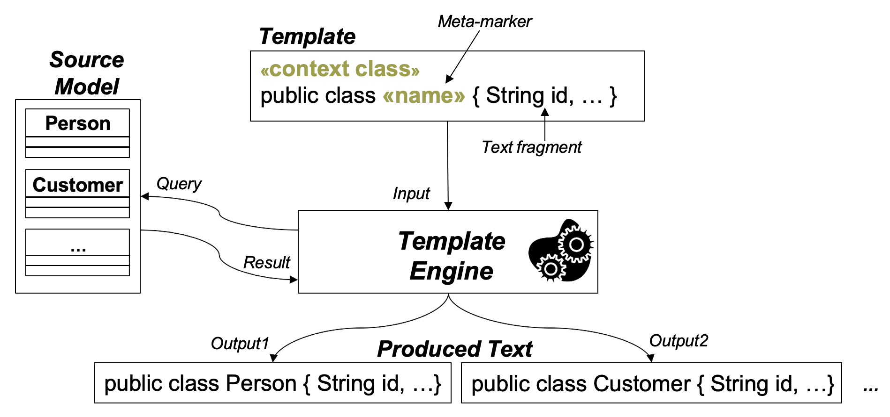

## 9.3  通过 M2T 转换语言的代码生成

#### ▶[上一节](2.md)

本节阐述 M2T 转换语言如何简化代码生成器的开发流程，概述现有主流方案，并演示如何运用其中一种为我们的运行案例实现代码生成器。

### 9.3.1 M2T 转换语言的优势

前文通过基于 Java 的代码生成器展示了如何使用 GPL 实现所需功能。M2T 转换语言旨在通过解决前述基于 GPL 的代码生成器存在的缺陷，提升代码生成器的开发效率。

**静态/动态代码分离** 。M2T 转换语言采用基于模板  *(template)* 的方法开发 M2T 转换，从而实现静态与动态代码的分离。模板 <sup>[3](0.md#3)</sup> 可被视为一种蓝图，既定义所有构件共享的静态文本元素，也包含需填充特定场景信息的动态部分。因此模板包含静态部分的简单文本片段，和动态部分的 *元标记 (meta-markers)* 。 元标记作为占位符，需由 *模板引擎 (template engine)* 解析处理，该引擎处理模板，同时会查询附加数据源以生成动态部分。显然，在 M2T 转换中，这些附加数据源即为模型。[Fig 9.4](#fig-94) 概括性地展示了基于模板的文本生成核心原理。

#### Fig 9.4


*Fig 9.4: 用于生成文本的模板、模板引擎和源模型*

**显式输出结构** 。    模板机制使我们能够在模板中显式呈现输出文本的结构。其实现方式是将生成动态部分的代码（输出）嵌入到表示静态部分的文本中 —— 这恰恰与之前的 Java 代码生成器相反。此机制与 Java Server Pages <sup>[4](0.md#4)</sup> (JSP) 相同，允许显式表示 HTML 页面结构并嵌入 Java 代码 —— 这与 Java Servlet 形成对比。在模板中显式表示输出结构，相比仅使用字符串变量存储输出文本，能生成更易读易懂的代码生成规范。模板还简化了代码生成器的开发。例如，开发者只需在模板中添加示例代码，并将动态代码部分替换为元标记即可完成模板开发。由此：(i) 从具体代码示例抽象出模板规范的过程直观明了；(ii) 模板与待生成的代码具有相似的结构和格式，使我们能够追溯模板对代码层面的影响。

**声明式查询语言** 。在元标记内部，我们需要访问模型中存储的信息。如前所述，在多数 M2M 转换语言中，OCL 是完成此任务的首选方案。因此当前 M2T 转换语言同样支持使用 OCL（或 OCL 方言）来定义元标记。其他未专门针对模型设计但支持各类数据源的模板语言，采用 Java 等标准编程语言来定义元标记。

**可复用基础功能** 。当前的 M2T 转换语言配备了工具支持，使我们能够直接读取模型，并仅通过定义配置文件即可将文本序列化为文件。因此，无需手动开发繁琐的模型加载和文本序列化重新定义过程。

### 9.3.2 基于模板的转换语言：概述
存在多种基于模板的语言，可用于从模型生成文本。

- **XSLT** ：模型的 XMI 序列化可通过 XSLT <sup>[5](0.md#5)</sup> 处理，该技术是将 XML 文档转换为任意文本文档的 W3C 的标准。然而，在此情况下，代码生成脚本必须基于 XMI 序列化实现，这需要额外了解模型如何实际编码为 XML 文件。因此直接操作模型层面的方案更具优势。
- **JET** ：Java Emitter Template（JET）<sup>[6](0.md#6)</sup> 项目是首批针对 EMF 模型开发代码生成的方案之一。但 JET 不仅限于 EMF 模型，原则上任何 Java 对象均可通过 JET 转换为文本。JET 提供类似 JSP 的语法，专为编写 M2T 转换模板而设计。与 JSP 类似，JET 模板可嵌入任意 Java 表达式。此外，JET 模板最终会被转换为纯 Java 代码以供执行。但需要注意的是，JET 中并没有为模型提供专用查询语言。
- **Xtend** ：Xtend <sup>[7](0.md#7)</sup> 是一种现代编程语言，主要基于 Java 但提供了若干额外语言特性。例如，它通过模板表达式形式专门支持代码生成。此外，它支持函数式编程，这对查询模型尤为有用（特别是 OCL 中许多基于迭代器的操作可直接使用）。
- **MOFScript** ：<sup>[8](0.md#8)</sup> 该项目提供另一种 M2T 转换语言，具备与 Xtend 类似的功能。MOFScript 作为 OMG 标准化工作的候选提案开发，旨在为 M2T 转换提供标准化语言。MOFScript 以 Eclipse 插件形式提供，支持基于 EMF 的模型。
- **Acceleo**: <up>[9](0.md#9)</up> 该项目旨在为基于 EMF 的模型提供 OMG M2T 转换标准的实用版本。该语言提供完整的 OCL 模型查询支持及成熟的工具支持，已在工业实践中证明其价值。

### 9.3.3 Acceleo：M2T 转换标准的实现

鉴于其实用价值与成熟的工具支持，Acceleo 被选为后续 M2T 转换语言演示的核心案例。请注意，Acceleo 的语言特性大多由其他 M2T 转换语言（如 Xtend 或 MOFScript）支持。

Acceleo 提供基于模板的语言用于定义代码生成模板。该语言配备了强大的 API，不仅支持 OCL，还提供了处理文本类文档的额外操作功能，如用于字符串操作的高级函数。Acceleo 自带功能强大的工具集，包括带语法高亮的编辑器、错误检测、代码补全、重构、调试器、性能分析器，以及可追溯 API，该 API 支持在模型元素与生成的代码间双向追溯。

在 Acceleo 定义模板前，需先创建作为模板容器的模块。该模块同时导入模板定义所基于的元模型定义，使模板能够理解可作为类型使用（在模版中）的元模型类。Acceleo 中的模板始终针对特定元模型类进行定义。除模型元素类型外，还可定义类似于 ATL 过滤条件的预设条件，例如，将模板仅应用于同时满足特定类型与特定值要求的模型元素。

Acceleo 模板语言提供多种元标记，在 Acceleo 中称为标签，这些标记在其他 M2T 转换语言中也普遍存在：

- *文件* ：生成代码时，需像之前基于 Java 的代码生成器那样打开、填充并关闭文件。Acceleo 提供专用 `tag` 标签，用于输出生成的内容，这些内容位于指定文件的开始 `tag` 标签和停止 `tag` 标签之间。文件路径与名称均通过标签属性定义。
- **控制结构** ：提供用于定义控制结构的标签，例如循环标签（ `for` 标签）用于遍历元素集合（尤其适用于处理导航返回的集合型元素的多值引用），以及条件分支标签（`if` 标签）。
- **查询**：可定义 OCL 查询（`query` 标签），其功能类似于 ATL 中的 *helper* 。这些查询可在整个模板中调用，用于提取重复代码。
- **表达式** ：提供通用表达式用于计算值，以生成输出文本的动态部分。表达式也可用于调用其他模板，将被调用模板生成的代码包含在调用模板生成的代码中。此调用机制类似于 Java 中的方法调用。
- **受保护区域** ：M2T 语言的一个重要特性在于支持仅能部分生成代码的项目。尤其需要特殊机制保护手动添加的代码，免受后续代码生成器运行时的文件修改。为此，名为 "受保护区域 (protected area)" 的特殊概念已被证明非常有用，该概念通过 `protected` 标签在 Acceleo 中得到支持。受保护区域用于标记生成的代码中不应被后续生成器运行再次覆盖的部分。这些部分通常包含手工编写的代码。

**代码生成示例**。以下代码片段展示了一个 Acceleo 模板，其功能等同于先前介绍的基于 Java 的代码生成器（参见第 [9.1](1.md) 节，第 [146](1.md) 页）。首行定义了名为 *generateJavaClass* 的模块，其中包含对 sMVCML 元模型的导入。该模块本身由一个主模板（参见模板 javaClass）构成，旨在为 sMVCML 类生成代码。该模板将属性与操作的代码生成（任务）委托给其他特定模板。

代码片段中使用了多种标签： `Query` 标签用于生成访问/修改属性所需的 *getter* 和 *setter* 方法签名，同时根据返回类型计算默认返回语句，以确保生成可编译代码。`file` 标签用于打开和关闭（输出 Java 类代码的）文件。`for` 标签用于遍历处理类中的属性和操作，以调用特定模板。

表达式被多次使用。例如，`[cl.name/]`  将类名打印到文本流中。其他表达式用于调用模板，如 `[javaAttribute(att)/]` 用于调用生成属性代码的模板，而 `[att.getter()/]` 用于调用查询以生成 *getter* 方法的名称。
#### List 9.2
```java
[module generateJavaClass('http://smvcml /1.0')]
[query public getter(att : Attribute) : String = 'get '+att.name.toUpperFirst() /]
[query public returnStatement(type: String) : String = if type = 'Boolean' then 'return true;' else '...' endif /]
[template public javaClass(aClass : Class)]
[file (aClass.name.toUpperFirst ()+'.java', false, 'UTF-8')]

package entities;

import java.io.Serializable;

public class [aClass.name/] implements Serializable {
  [for (att : Attribute | aClass.atts) separator ('\n')]
  [javaAttribute(att)/]
  [/for]

  [for (op : Operation | aClass.ops) separator ('\n')]
  [javaMethod(op)/]
  [/for]

}
[/file]
[/template]

[template public javaAttribute(att : Attribute)]
  private [att.type/] [att.name/];

  public [att.type/] [att.getter ()/]() {
    return [att.name/];
  }
...
[/template]

[template public javaMethod(op : Operation)]
  public [op.type/] [op.name/]() {
    // [protected (op.name)]
    // Fill in the operation implementation here!
    [returnStatement(op.type)/]
    // [/ protected]
  }
[/ template]
```
列表 9.2：基于 Acceleo 的代码生成

在 `javaMethod` 模板中，保护区用于定义包含操作实现的空间。该模板生成的输出如 [List 9.3](#list-93) 所示。请注意，在生成器的首次运行中，生成的受保护区域仅包含模板中给定的标准注释和默认返回值，作为实际方法实现的占位符。后续所有生成器运行中，该区域保持不变，这意味着用户可实现方法，且手工添加的代码不会在后续生成器运行中丢失。

#### List 9.3
```java
public boolean checkAvailability(){
  // Start of user code checkAvailability
  // Fill in the operation implementation here!
  return true;
  // End of user code
}
```
*List 9.3：保护区域的效果*

#### ▶[下一节](4.md)
