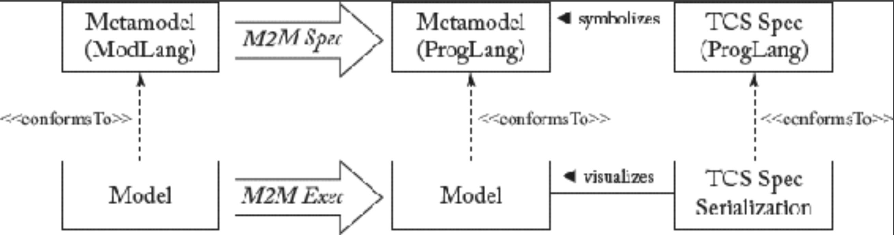

## 9.5 附记：通过 M2M 转换与 TCS 实现代码生成

#### ▶[上一节](4.md)

若 M2T 转换的目标语言已由元模型和 TCS 支持，从而能够将文本解析为模型或将模型序列化为文本，则该 M2T 转换可通过采用 M2M 转换来实现。[Fig 9.5](#fig-95) 展示了采用此方法的转换流程：首先，将建模语言的元模型转换为基于文本语言的元模型，随后根据抽象语法与 TCS 的映射关系，将生成的目标模型序列化为文本。

#### Fig 9.5

*Fig 9.5: 使用 TCS 的代码生成*

该方法初看颇具优势：(i) 重用文本具体语法定义可确保生成有效文本产出物；(ii) 文本语言的显式元模型有助于更清晰地阐释语言概念及建模语言到文本语言的映射关系； (iii) 可基于元模型验证转换规则；(iv) 代表文本构件的输出模型可参照目标元模型进行验证；(v) 目标语言的具体语法变更独立于两种语言之间的转换，无需额外维护代码生成器。

然而该方法目前也存在局限性。现有的编程语言元模型大多缺乏 TCS 定义，更严重的是，某些语言根本不存在元模型，或其元模型未能完整定义。另一缺陷在于文本型语言仅通过其 TCS 定义呈现。因此在抽象语法层面对语言概念进行推理可能需要学习成本，而使用代码生成模板时则无需此过程。该方法无法像 M2T 转换那样，通过复制代码并替换元标记，实现从参考代码到转换定义的抽象化。此外，部分代码生成场景所需的功能（如受保护区域）未被涵盖。最后，代码生成器可能仅需目标语言的有限子集，采用 M2T 转换语言实现此需求远比推导完整目标语言定义更为简便。

综上所述，尽管将 M2T 转换简化为 M2M 转换存在某些优势，但从实用角度看，采用 M2T 转换语言构建代码生成器更为便捷 —— 尤其当目标语言缺乏元模型和 TCS 定义时。因此，仅当目标语言已具备元模型与 TCS 支持，且采用完整代码生成方案时，才应考虑采用 M2M/TCS 方法进行代码生成。

#### ▶[下一节](../ch10/0.md)
