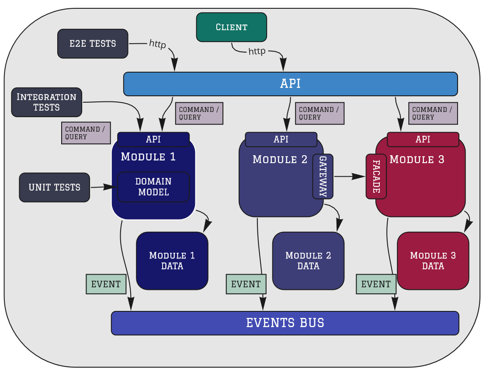
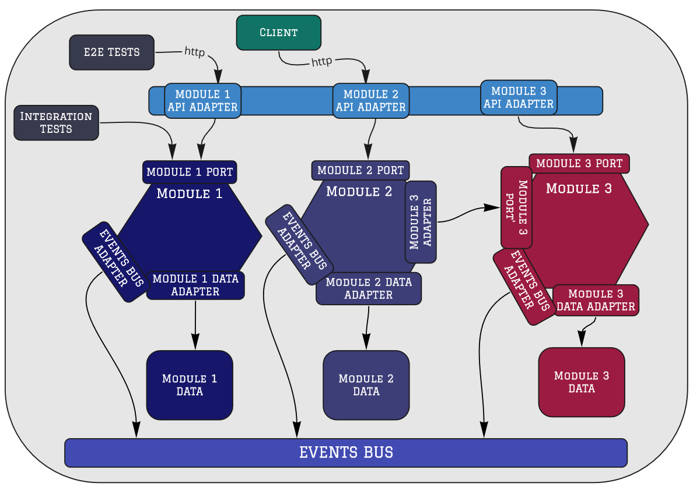
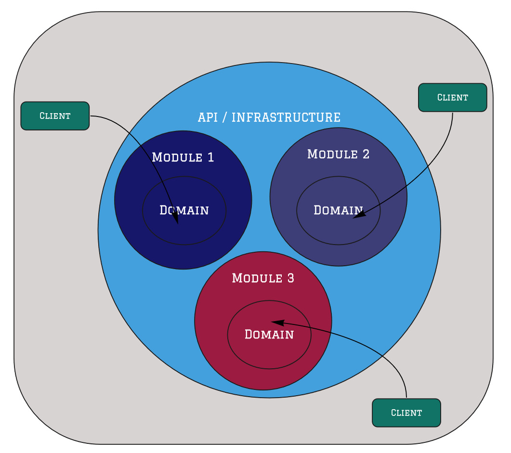
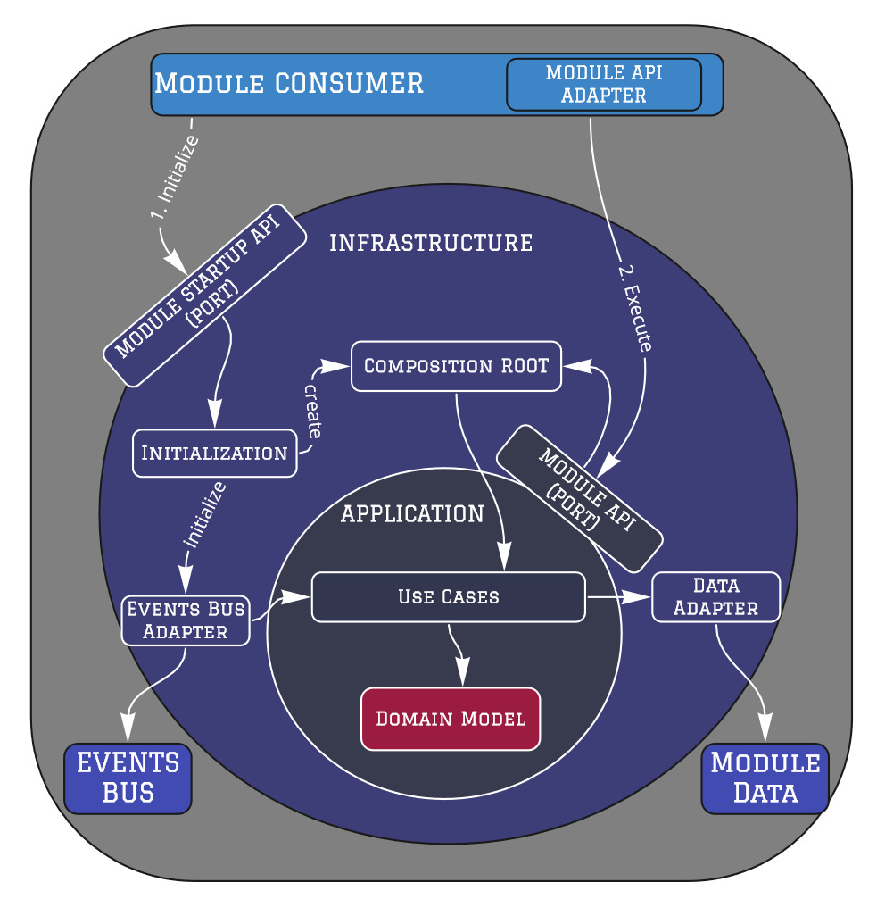
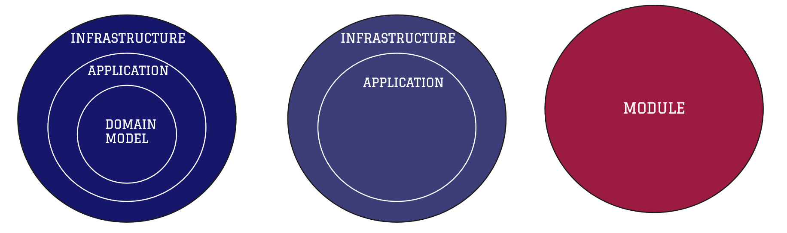

# 模块化单体：以领域为中心的设计

2020-11-30 📂 架构和设计 📂 模块化单体 [原文](https://www.kamilgrzybek.com/blog/posts/modular-monolith-domain-centric-design)

 

---
## 引言

在本系列的前几篇文章中，我介绍了什么是模块化单体、它的架构是什么样的，以及如何实施这种架构。
然后，我描述了这种架构的架构驱动因素以及模块之间的集成风格。

在这篇文章中，我想更进一步 —— 深入一个层次，描述如何设计这样的架构。
我们暂时还不会实现这个架构 —— 我们将专注于其与技术无关的设计。

---

## 以领域为中心的设计

正如模块化单体架构的名称所示，我们的架构设计必须面向高 [模块化](https://en.wikipedia.org/wiki/Modularity) 。
由此可知，系统必须具有能够提供 **完整业务功能** 的 **自包含** 模块。
这就是为什么以领域为中心的架构和设计在这种情况下是自然的选择。

此外，我们知道，模块必须具有 **定义良好的接口**。
模块之间的所有通信应仅通过这些接口进行，这意味着每个模块必须高度 **封装**。

让我们从 [高层视角](https://en.wikipedia.org/wiki/High-level_design) 来看看这样的架构可能是什么样子：

 
*模块化单体：以领域为中心的设计*

从高层视角来看，这与以领域为中心的架构有相似之处。
确实如此 —— 无论从整个系统的架构（ [系统架构](https://en.wikipedia.org/wiki/Systems_architecture) ）还是从稍后描述的各个模块的架构（ [应用架构](https://en.wikipedia.org/wiki/Applications_architecture) ）来看，都是如此。

观察与 [六边形架构](https://alistair.cockburn.us/hexagonal-architecture/) 的相似之处，我们有以下对应关系：

- API：主要适配器（Primary Adapters）
- 模块 API：主要端口（Primary Ports）
- 次要端口（Secondary Ports）及其适配器（用于与数据库、事件总线、其他模块通信）

 
*模块化单体：六边形架构视角*

如果我们仔细观察，这种架构与 [洋葱架构](https://jeffreypalermo.com/2008/07/the-onion-architecture-part-1) 和 [整洁架构](https://blog.cleancoder.com/uncle-bob/2012/08/13/the-clean-architecture.html) 并无不同。
最重要的是，我们的领域位于 *内部* ，并且遵循 *依赖规则 (Dependency Rule)*：

> 源代码依赖关系必须只能指向内层，即指向更高层的策略。

 
*模块化单体：整洁/洋葱架构视角*

让我们尝试逐一描述所有元素。

### API

API 是我们系统的入口点。
主要实现为 Web 服务（SOAP/REST/GraphQL），接受 HTTP 请求并返回 HTTP 响应。

API 的主要且唯一的职责是将请求转发给适当的模块。
它相当于微服务架构中的 [API 网关](https://docs.microsoft.com/en-us/dotnet/architecture/microservices/architect-microservice-container-applications/direct-client-to-microservice-communication-versus-the-api-gateway-pattern)，只不过不是通过网络调用服务，而是进行 *内存中的模块调用* 。

API 应该非常薄。
其中不应包含任何逻辑 —— 无论是应用逻辑还是业务逻辑。
我们放在那里的所有内容都应仅与处理 HTTP 请求和路由相关。

### 模块

**每个模块都应被视为一个独立的应用**。
换句话说，它是我们系统的一个子系统。
通过这种方式，它将拥有自治性。
它将与其他模块（子系统）松散耦合，甚至不耦合。
这意味着每个模块可以由独立的团队开发。
这与微服务架构中的 [架构驱动因素](https://www.informit.com/articles/article.aspx?p=2738304&seqNum=4) 相同。

此外，我们将能够轻松地将特定模块提取到单独的运行时组件中（单体拆分）。
当然，这仅在必要时才进行 —— 这不是我们架构的目标，只是模块化带来的一个很好的副作用。

由于模块应该是面向领域的（参见 DDD 战略模式集合中的 [限界上下文](https://martinfowler.com/bliki/BoundedContext.html) 概念），
我们可以再次使用以领域为中心的架构 —— 这次是在模块本身的层面上。

模块架构如下：

 
*模块架构*

### Module Startup API

*Module Startup API* 是一个 port/interface，通过它，给定模块可以被初始化。
由于给定模块必须是自包含的，它应该能够初始化自身，只获取其操作所需的适当配置参数。
这意味着我们 **不在** API（或其他模块宿主）中配置给定模块。
我们只在启动时触发其初始化。

### Composition Root

支持模块自治也意味着给定模块必须能够 *自己创建对象依赖图*，即它应该有自己的 [组合根 (Composition Root)](https://blog.ploeh.dk/2011/07/28/CompositionRoot/) 。

这通常意味着它将拥有自己的 [IoC](https://en.wikipedia.org/wiki/Inversion_of_control) 容器。
这是非常重要的一点。
不幸的是，最常见的方法是整个运行时组件定义一个 IoC 容器。
这对于小型系统来说是好的方法，但对于更复杂和模块化的系统则不然。

### Module API

Module API 是与给定模块通信（初始化除外 —— 请参阅 [Module Startup API](#module-startup-api) ）的接口（ primary port ）。
这样的模块 API 可以通过两种方式创建：

- 传统方法：一系列方法（`CustomerService.GetCustomer`、`OrderService.AddOrder`）
- CQRS 风格方法：一组要发送的查询和命令（`GetCustomerQuery`、`AddOrderCommand`）

我绝对是第二种 CQRS 风格方法的粉丝，但在我看来，第一种方法也是可以接受的。

根据 [模块化的关键属性](https://en.wikipedia.org/wiki/Modular_programming) ，这个模块 API 应该尽可能小 —— 只暴露所需的内容（不多不少）。
这将使其更加 [稳定](https://wiki.c2.com/?StableDependenciesPrinciple) 。

### 基础设施 —— 次要适配器 (Secondary Adapters)

这里是次要适配器的实现位置（来自端口与适配器架构的术语）。
次要适配器负责与外部依赖项（进程内和进程外）通信：数据库、事件总线、其他模块。

### 应用 (Application)

这里你应该找到与模块相关的用例实现。
这是 *六边形 (Hexagon)* 边界（来自端口与适配器架构视角）、*应用核心 (Application Core)* 边界（来自洋葱架构视角）或 *用例 (Use cases)* 层（来自整洁架构视角）。

无论你遵循哪种以领域为中心的架构，原则都是相同的。
在这个位置，我们不再处理技术和基础设施问题。
在这里，我们只专注于实现应用和业务需求。

然而，有时领域并非微不足道，因此我们希望明确地将其分离出来，
称这一层为 *领域 (Domain)* 。

### 领域 (Domain)

即使是最不复杂的模块也有一个领域。
而领域在这里是最重要的，它是所有以领域为中心的架构的核心，对于模块化单体架构也是如此。
得益于以领域为中心的架构，它与框架和基础设施解耦。

这个领域的模型（[领域模型](https://martinfowler.com/eaaCatalog/domainModel.html) ）仅在限界上下文（边界）内适用。
其中只有与我们的领域相关的概念和所谓的 *企业业务规则 (enterprise business rules)* 。

领域模型应该具有 [持久化无关性](https://www.kamilgrzybek.com/blog/posts/domain-model-encapsulation-ef) 。
它使用 [通用语言](https://martinfowler.com/bliki/UbiquitousLanguage.html) 编写，并且完全是可测试的。
我们在这里投入最多的精力，其余部分只是为了让我们更容易地工作。

### 有多少层？

关于应用层，互联网上有很多讨论。
有些人喜欢有非常清晰的层次划分（例如使用单独的库/包或其他语言技术）。
另一些人则喜欢将所有内容放在一起，而不进行逻辑分解。

首先，请注意每个模块都是不同的。
一个模块可能有更复杂的领域，而另一个模块可能只实现 CRUD 操作。
在这种情况下，这些模块的应用架构将是不同的。

此外，**即使在同一个模块内，也可能同时存在更复杂和不太复杂的功能**。
在这种情况下，我们也应该分别对待每个功能。

<ins>总之，层的应用不应是给定模块的全局决策 —— 每个用例都应该被单独考虑</ins>。
这种方法接近于 [垂直切片](https://jimmybogard.com/vertical-slice-architecture) 架构，在模块级别应用，而不是在整个应用程序级别。

有人说以领域为中心的架构和垂直切片是对立的。
这远非事实 —— 在我看来，它们完美互补。

 
*模块应用架构风格*

### 模块数据

每个模块必须拥有自己的状态，这意味着其数据必须是私有的。
我们不希望使用 [共享数据库模式](https://www.enterpriseintegrationpatterns.com/patterns/messaging/SharedDataBaseIntegration.html) 。
这是实现模块自治和模块化的关键属性。
如果我们想了解模块的状态或更改它 —— 我们必须通过其接口来进行。
没有捷径。

然而，有时我们出于报表目的希望共享一些数据。
在这种情况下，我们可以使用单独的 [报表数据库](https://martinfowler.com/bliki/ReportingDatabase.html) ，
并以单独视图的形式在模块数据库上提供数据，采用特殊的集成方案 —— 仅适用于这种集成类型。
通过这种方式，我们在数据库层面创建了 API 的概念 —— 这是一件好事。

### 模块集成

我在上一篇文章中详细介绍了模块集成。
如你所见，*模块化单体 (Modular Monolith)* 架构设计假设了两种通信形式：

1. 通过事件进行异步通信（ [事件驱动架构](https://en.wikipedia.org/wiki/Event-driven_architecture) ）。
每个模块通过 *事件总线 (Events Bus)* 发送或订阅特定事件。
这个事件总线可以是内存机制，也可以是进程外组件 —— 取决于需求。

2. 通过内存调用进行同步通信。
这里，与模块的 API 通信一样，可以通过传统方法或 CQRS 风格（命令/查询）来实现。
这里重要的是，**这样的集成应该是显式的** —— 通过在消费者端创建一个 [网关](https://martinfowler.com/eaaCatalog/gateway.html)（adapter），
在提供者端创建一个 [Facade](https://en.wikipedia.org/wiki/Facade_pattern)（port 及其实现）。

### 测试

如果你想要模块化你的系统，这意味着它并不简单（或者将来也不会简单）。
这意味着自动化测试是必须的。
然而，应该编写特定类型测试的百分比取决于给定的系统、其复杂程度、集成数量和其他因素。

测试是一个广泛的话题，超出了本文的范围，肯定值得单独写一篇文章。
在这里，我只想强调应该考虑哪些测试。

#### 端到端测试

端到端测试测试你的整个系统 —— 从 API 到基础设施再返回。
通常，它们检查我们系统的整个片段，因此它们具有最大的测试代码覆盖率。

然而，它们也经常将系统与 GUI 一起测试。
因此，它们是最慢、最脆弱且难以维护的。

#### 集成测试

集成测试是一个广义术语，有不同的理解方式。
在所提出的架构中，这些是对给定模块（或模块之间的交互）的综合测试，但不包括 API 层。
这些类型的集成测试是我们模块的第二消费者（只是另一个 adapter）。
由于 API 层非常薄，它们实际上覆盖了我们几乎整个应用程序，并且不操作低层抽象对象（JSON、HTTP）。

#### 单元测试

单元测试将主要用于测试 *领域模型* —— 业务逻辑。
由于在模块内使用了以领域为中心的架构，领域模型与基础设施分离，可以很容易地在内存中进行测试。

---
## 总结

如你所见，使我们的系统模块化需要纪律，以遵循正确设计的规则和原则。
整个系统被不断地分解为更小的片段。
每个拼图块都很重要。
让我们总结一下这种架构最重要的属性：

- 在多个层面上以领域为中心
- 明确定义的集成点（接口）
- 自包含、封装的模块
- 可测试性 —— 使应用层和领域层独立于框架和基础设施
- 可演化 —— 易于开发和维护（添加新模块或适配器）

如果你不需要分布式系统（而且大多数人不需要），并且你的系统不简单 —— 也许以领域为中心的模块化单体设计适合你。
但请记住，这一切都取决于你的项目所处的上下文，所以请有意识地做出决策。

图片来源：[Magnasoma](https://magnasoma.com/)

---

## 系列更多文章

本是 [模块化单体](../modular-monolith.md) 系列的一部分：

1. [模块化单体：入门指南](primer.md)
2. [模块化单体：架构驱动因素](drivers.md)
3. [模块化单体：架构实施](enforcement.md)
4. [模块化单体：集成风格](integration.md)
5. [模块化单体：以领域为中心的设计（本文）](ddd.md)
