# 模块化单体：架构驱动因素

[原文](https://www.kamilgrzybek.com/blog/posts/modular-monolith-architectural-drivers) 📂 架构和设计 📂 模块化单体  2019-12-26

 

## 引言

在 [第一篇](./primer.md) 关于模块化单体架构的文章中，我重点介绍了该架构的定义和模块化的描述。
提醒一下，*模块化单体 (Modular Monolith)*：

- 是一个恰好只有一个部署单元的系统
- 是对以模块化方式设计的单体系统的明确命名
- 模块化意味着模块：
  - 必须独立、自治
  - 拥有提供所需功能的一切（按业务领域分离）
  - 被封装并具有定义良好的接口/契约

在这篇文章中，我想讨论一些在我看来最为常见的 *架构驱动因素 (Architectural Drivers)* ，它们可能导向 *模块化单体 (Modular Monolith)* 或 *微服务 (Microservices)* 架构。

但 *架构驱动因素 (Architectural Drivers)* 到底是什么？

## 架构驱动因素

一般来说，你不能说 X 架构比另一种更好。
你不能说单体比微服务更好，[整洁架构 (Clean Architecture)](https://blog.cleancoder.com/uncle-bob/2012/08/13/the-clean-architecture.html) 比 [分层架构](https://www.oreilly.com/library/view/software-architecture-patterns/9781491971437/ch01.html) 更好，
3 层比 4 层更好或更差，等等。

同样的规则也适用于其他考量，例如 ORM vs 原生 SQL、
“*当前状态 (Current State)*” 持久化 vs [事件溯源 (Event Sourcing)](https://martinfowler.com/eaaDev/EventSourcing.html)、
[贫血领域模型 (Anemic Domain Model)](https://www.martinfowler.com/bliki/AnemicDomainModel.html) vs 富领域模型、
面向对象设计 vs 函数式编程……以及更多。

那么，如果（不幸的是）没有 “最好” 的存在，我们该如何选择架构/方法/范式/工具/库呢？

### 上下文为王

我们的 **每一个决策都是在特定的上下文** 中做出的。
每个项目都是不同的（这源于项目的定义），因此每个上下文也是不同的。
这意味着<ins>在一种上下文中做出的相同决策可能带来极好的结果，而在另一种上下文中则可能导致毁灭性的失败</ins>。
因此，不加批判地使用他人/其他公司的方法，可能会导致大量痛苦、金钱浪费，并最终导致项目的终结。

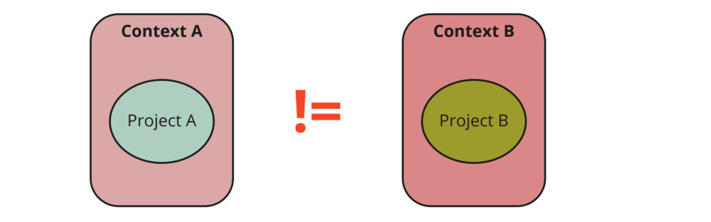 
*每个项目都是不同的，并具有不同的上下文*

然而，上下文是一个过于宽泛的概念，我们需要更具体的东西来付诸实践。
这就是 *架构驱动因素 (Architectural Drivers)* 概念被定义的原因。
Michael Keeling 在他的 [博客文章](https://www.neverletdown.net/2014/10/architectural-drivers.html) 中这样描述它们：

> 架构驱动因素被正式定义为对架构具有重大影响的需求集合。

Simon Brown 在 [Software Architecture for Developers](https://softwarearchitecturefordevelopers.com/) 一书中对 *架构驱动因素 (Architectural Drivers)* 也有类似的描述：

> 无论你遵循什么过程（传统且计划驱动的 vs. 轻量级且自适应的），
都存在一组常见的事物，它们真正驱动、影响并塑造最终的软件架构。

*架构驱动因素 (Architectural Drivers)* 有自己的分类。
主要类别包括：

- **功能需求（Functional Requirements）** —— 系统解决什么问题以及如何解决
- **质量属性（Quality Attributes）** —— 决定架构质量的一组属性，如可维护性、可扩展性等
- **技术约束（Technical Constraints）** —— 技术标准、工具限制、团队经验
- **业务约束（Business Constraints）** —— 预算、硬性截止日期

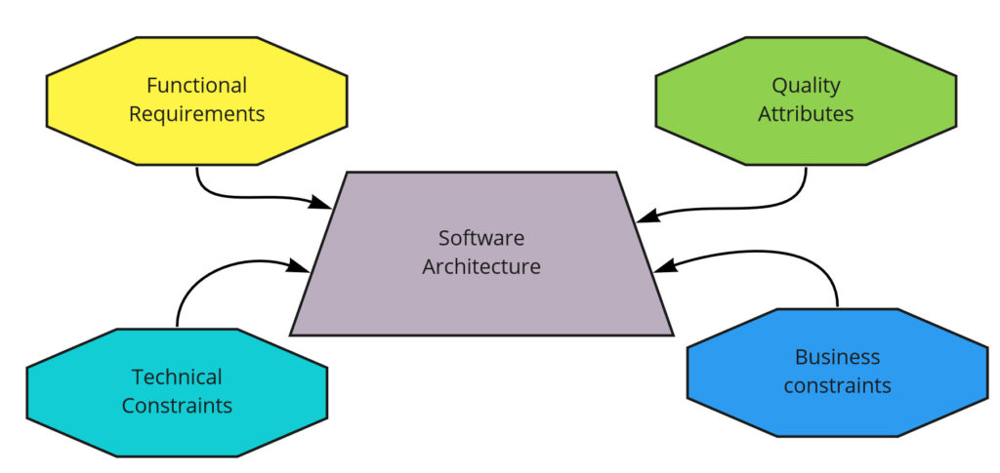 
*架构驱动因素*

最重要的是，所有 *架构驱动因素 (Architectural Drivers)* 都是相互关联的，
并且往往聚焦于一个方面会导致另一个方面的损失（不幸的是，权衡无处不在）。
让我们考虑这个例子。

你有一个服务，它在 3 秒内（ *质量属性——性能* ）计算某个重要内容（ *功能需求* ）。
一个新的需求出现了，计算变得更加复杂，现在需要 5 秒（ *性能下降* ）。
为了回到 3 秒，可以使用另一种技术，但没有时间这样做（ *业务约束 —— 硬性截止日期* ），而且公司里还没有人使用过它（ *技术约束 —— 团队经验* ）。
提高性能的唯一选择是将计算移到存储过程中，但这会降低可维护性和可读性（ *质量属性* ）。

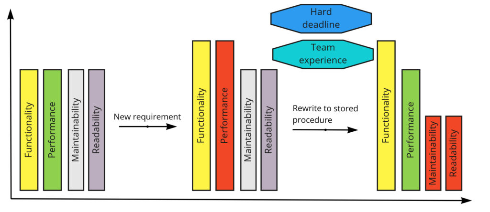 
*架构驱动因素示例*

如你所见，<ins>软件架构是</ins>在一个驱动因素与另一个驱动因素之间<ins>持续做出选择</ins>。
不存在一个 “正确” 的解决方案。
[没有银弹](https://en.wikipedia.org/wiki/No_Silver_Bullet) 。

带这这些思考，让我们看看在讨论 *模块化单体 (Modular Monolith)* 和 *微服务 (Microservices)* 架构时，一些常见的架构驱动因素及其属性。

## 复杂度水平

首先，让我们考虑 *模块化单体 (Modular Monolith)* 与分布式架构相比最大的优势之一 —— *复杂度* 。
[维基百科](https://en.wikipedia.org/wiki/Complexity) 上对复杂度的定义如下：

> 复杂度表征了系统或模型的行为，其组件以多种方式交互并遵循局部规则，这意味着没有合理的高级指令来定义各种可能的交互。
该术语通常用于描述具有许多部分的事物，这些部分以多种方式相互交互，最终产生高于其各部分之和的涌现性。

如上所述，复杂度关乎组件及其交互。
在 *模块化单体 (Modular Monolith)* 架构中，模块之间的交互是简单的，因为每个模块都位于同一个进程中。
这意味着想要与另一个模块交互的模块：

- 知道请求将要发往的确切地址，并且确信该地址不会改变
- 请求只是一个方法调用，不需要网络
- 目标模块始终可用
- 安全问题无需担心

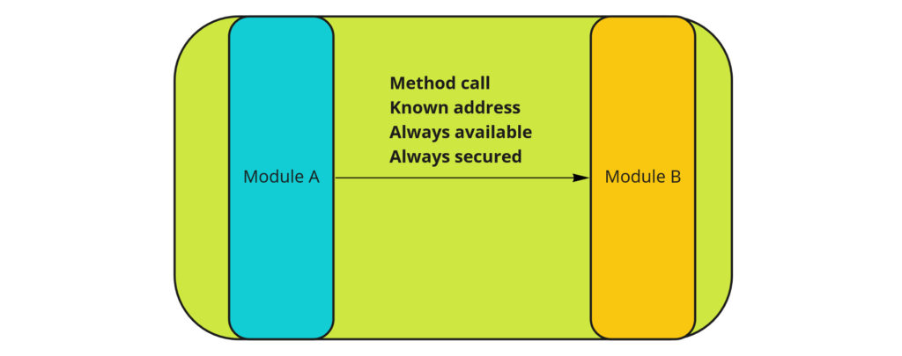 
*模块化单体复杂度*

另一方面，考虑分布式系统架构。
在这种架构中，模块/服务位于其他服务器上，并通过网络进行通信。
这意味着当一个服务想要与另一个服务通信时，它必须处理以下问题：

- 需要以某种方式获取目标模块的地址，因为它可能会发生变化
- 通信通过网络进行，这需要使用特殊协议（如 HTTP）和序列化
- 网络可能不可用（ [CAP 定理](https://en.wikipedia.org/wiki/CAP_theorem) ）
- 必须确保模块之间的安全通信

当然，你可以为这些问题找到解决方案。
例如，为了解决寻址问题，你可以添加 [服务注册](https://microservices.io/patterns/service-registry.html) 并实现 [服务发现模式](https://microservices.io/patterns/server-side-discovery.html) 。 
然而，这意味着要向系统中添加更多组件和算法，因此复杂度会迅速增加。

为了意识到微服务架构所产生问题的规模，我建议你熟悉用于解决这些问题的 [模式](https://microservices.io/patterns/index.html) 。
这个列表很长，而且其中大部分在单体架构中根本不需要。

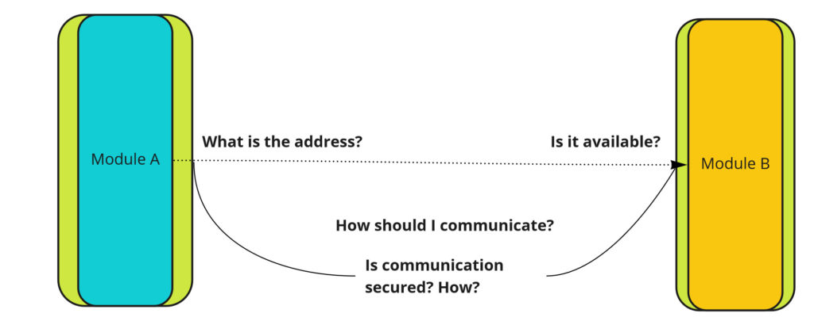 
*复杂度 —— 分布式系统*

总而言之，*模块化单体 (Modular Monolith)* 架构的复杂度明显低于分布式系统。
高复杂度会降低可维护性、可读性和可观测性。
它需要有经验的团队、先进的基础设施、特定的组织文化等等。
如果简单性是你的关键架构驱动因素，那么请考虑 [单体优先](https://martinfowler.com/bliki/MonolithFirst.html) 。

## 生产力

团队交付变更的生产力可以从两个维度来衡量：在整个系统的上下文中和单个模块的上下文中。

在整个系统的上下文中，事情很清楚。
*模块化单体 (Modular Monolith)* 架构的复杂度更低 => 复杂度越低越容易理解 => 生产力越高。

从运行整个系统的易用性角度来看，*模块化单体 (Modular Monolith)* 将生产力保持在最高水平 —— 只需下载代码并在本地机器上运行即可。
在分布式架构中，尽管有技术和工具（如 Docker 和 Kubernetes）来促进这一过程，但事情并不那么简单。

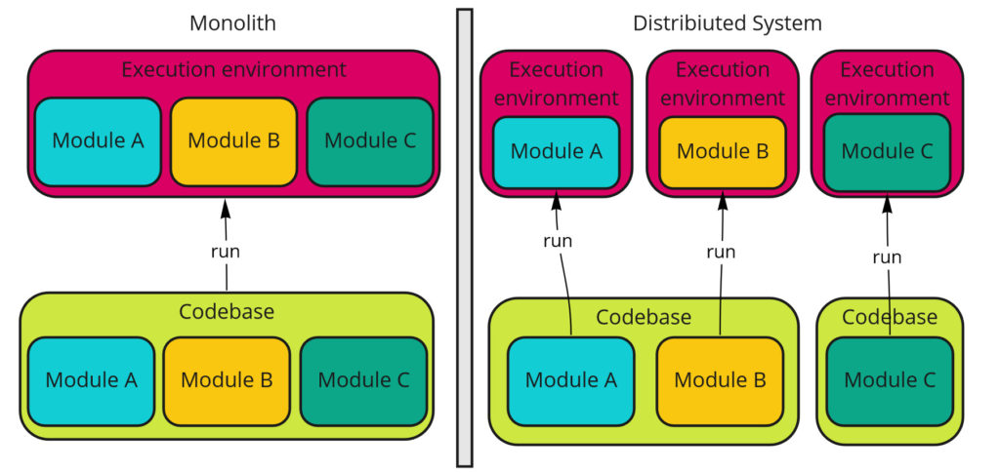 
*运行整个系统 —— 单体 vs 分布式*

另一方面，我们还有与单个模块开发相关的生产力。
在这种情况下，微服务架构会更好，因为我们不必运行整个系统来测试一个特定模块。

那么，哪种架构更能支持团队的生产力呢？
在我看来，对于大多数系统来说，答案是*模块化单体 (Modular Monolith)* ；
但对于真正大型的项目（数十或数百个模块），则是微服务。
如果你的架构驱动因素是开发速度，并且系统规模不大，那么更好的选择将是 *模块化单体 (Modular Monolith)* ；
而在系统扩展的情况下，也许过渡到微服务将是正确的举措。

## 可部署性

软件系统的可部署性是指将其从开发环境带到生产环境的难易程度。
然而，我们必须考虑两种情况：整个系统的部署和单个模块的部署。

在整个系统的上下文中，部署一个应用程序比部署多个应用程序更容易吗？
当然，一个应用程序更容易部署，所以看起来 *模块化单体 (Modular Monolith)* 是更好的选择。

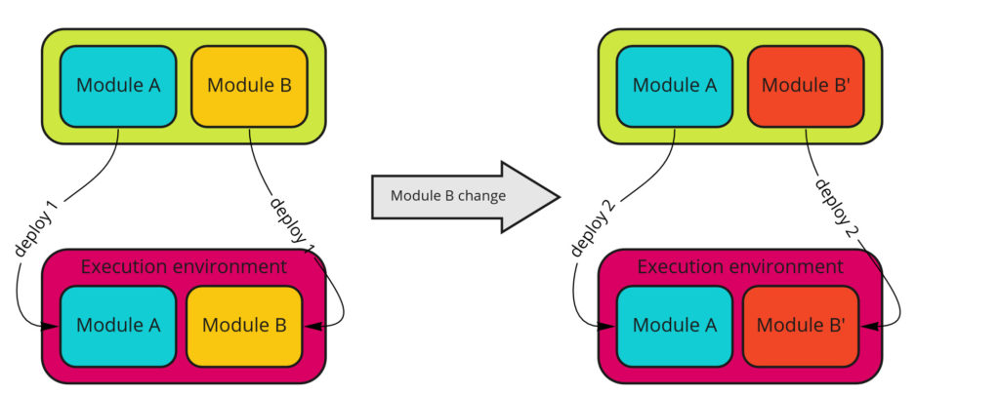 
*部署 —— 模块化单体*

另一方面，在 *模块化单体 (Modular Monolith)* 中，我们总是必须部署整个系统。
我们无法单独部署某个特定模块，这是其最重要的缺点之一。
在这种架构中，我们没有部署自治性，因此部署过程必须协调，可能更加困难。

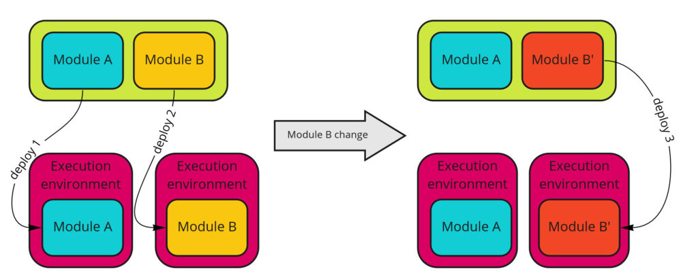 
*可部署性——分布式系统*

总而言之，如果你不介意部署整个系统，并且不关心部署的自治性，那么这就是选择 *模块化单体 (Modular Monolith)* 的理由。
否则，请考虑分布式架构。

## 性能

性能是指某事物运行有多快，通常表现为响应时间、处理时长或延迟。

假设所有请求都以顺序方式处理的场景，单体架构将始终比分布式系统更高效。
所有模块都在同一进程中运行，因此它们之间没有通信开销。

分布式系统则存在由网络通信带来的开销 —— 序列化与反序列化、加密以及数据包传输速度。

即使在现实场景中，*单体架构在 (Modular Monolith)* 一段时间内也会更加高效。
但随着用户、请求、数据和计算复杂度的增加，性能可能会下降。
这时，我们就触及了微服务架构的主要驱动因素之一：可扩展性。

## 可扩展性

什么是可扩展性？
[维基百科](https://en.wikipedia.org/wiki/Scalability) 说：

> 可扩展性是系统通过向系统添加资源来处理不断增长的工作量的属性。

换句话说，可扩展性是指软件处理更多请求或数据的能力。

最好通过示例来说明。
假设我们的一个模块现在必须处理比我们最初假设更多的请求。
为此，我们必须增加负责该模块操作的资源。

我们始终可以通过两种方式做到这一点：增加节点计算能力（称为 *垂直扩展 (Vertical Scaling)* ）或添加新节点（称为 *水平扩展 (Horizontal Scaling)* ）。
让我们从单体架构和微服务架构的角度来看看：

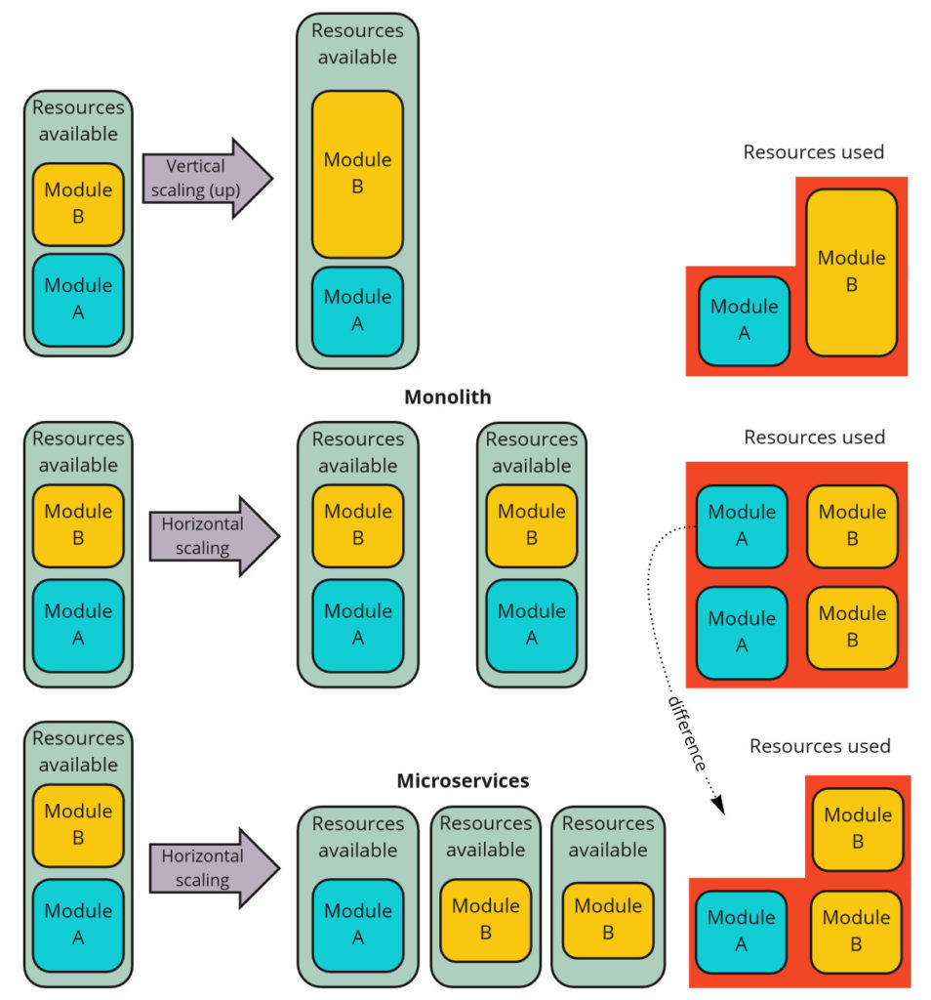 
*扩展*

如上图所示，两种架构都可以进行扩展。
单体也可以扩展。
垂直扩展是相同的，但区别在于水平扩展。
使用这种方法，我们只能将模块化单体作为一个整体进行扩展，这会导致资源利用效率低下。
而在微服务架构中， **我们只扩展那些需要扩展的模块** ，从而实现更好的资源利用。
这就是主要的区别。

需要运行的模块实例越多，差异就越显著。
另一方面，如果你不需要大规模扩展，也许你最好接受资源利用效率较低的现实，保留单体架构并享受它的其他优势？
在这种情况下，这是一个我们应该问自己的好问题。

## 故障影响

有时，我们的架构驱动因素可能是限制故障的影响范围。
假设我们有一个非常不稳定的模块，偶尔会导致整个进程崩溃。

在模块化单体的情况下，由于整个系统运行在一个进程中，整个系统会突然停止工作，我们的可用性就会降低。

在微服务架构的情况下，可以将 “有风险的” 模块移到一个单独的进程中，如果它停止了，系统的其余部分将继续正常工作。

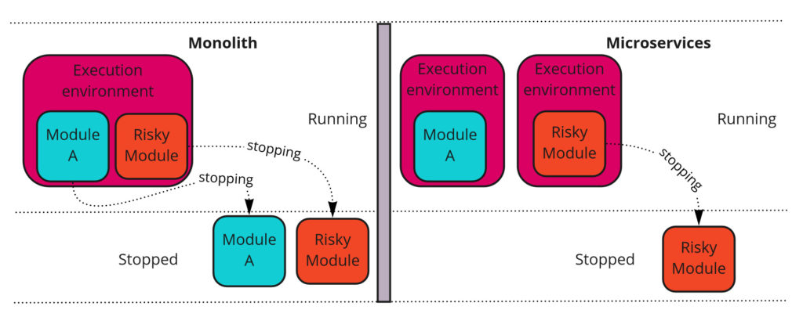 
*故障影响*

为了提高模块化单体的可用性，你可以增加节点数量，但如同可扩展性一样，与微服务架构相比，资源利用率不会处于最高水平。

## 技术异构性

*模块化单体 (Modular Monolith)* 一个无法绕过的属性是无法使用 **异构技术 (heterogeneous technology)**。
整个系统运行在同一个进程中，这意味着它必须运行在相同的运行时环境中。
这并不意味着它必须用同一种语言编写，因为一些平台支持多种语言（例如 .NET CLR 或 Java JVM）。
然而，使用完全不同的技术是不可能的。

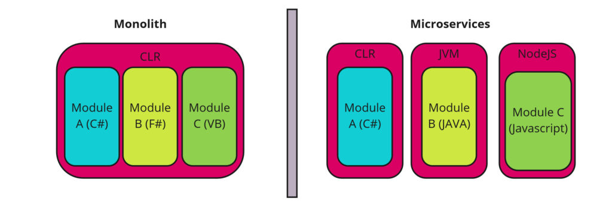 
*技术异构性*

技术异构性这一特性可能是转向微服务架构的决定性因素，但并非必然如此。
通常，公司使用一种技术栈，甚至没有人会考虑用不同技术来实现组件，因为团队能力或软件许可不允许这样做。

另一方面，大型公司和项目更常使用异构技术，通过量身定制的工具来解决特定问题，从而最大化生产力。

与异构技术相关的一个常见场景是遗留系统的维护和开发。
遗留系统通常使用旧技术编写（而且往往以非常糟糕的方式）。
为了使用新技术，通常会创建一个新的服务/系统来实现新功能，而旧系统只是将请求委托给新系统。
这样，遗留系统的开发可以更快，并且更容易找到愿意使用它的人。
这里的缺点是，由于存在两个系统而不是一个 ——整个系统变成了分布式—— 并带有该架构的所有缺点。

## 总结

本文并非旨在描述支持 *模块化单体 (Modular Monolith)* 或微服务的所有架构驱动因素。
这个话题足以写成一本专著。

在这篇文章中，我想描述在我看来最常被讨论的架构驱动因素，
并明确表明：**系统架构的形状受到许多因素的影响，一切都取决于我们的上下文**。

**总结如下：**

- 没有更好或更差的架构 —— 一切都取决于上下文和架构驱动因素
- 架构驱动因素有其分类 —— 功能需求、质量属性、技术约束、业务约束
- 单体架构的复杂度低于分布式系统。微服务架构需要更多的工具、库、组件、团队经验、基础设施管理等
- 在开始时，单体实现的生产力更高（单体优先方法）。
之后，可考虑迁移到微服务架构，但前提是存在支持该迁移的架构驱动因素
- 单体的部署更简单，但不支持自主部署
- 两种架构都支持可扩展性，但微服务在资源利用方面效率高得多
- 单体在需要扩展之前性能优于微服务 —— 之后则取决于扩展的可能性
- 在单体中故障影响更大，因为所有内容都在同一进程中运行。
风险可以通过复制来缓解，但成本高于微服务架构
- 单体从定义上不支持异构技术

## 补充资源

1. [架构驱动因素 —— 摘自《设计软件架构：实用方法》一书 —— Humberto Cervantes, Rick Kazman](http://www.informit.com/articles/article.aspx?p=2738304&seqNum=4)
2. [《开发人员的软件架构》 —— Simon Brown](https://softwarearchitecturefordevelopers.com/)
3. [《设计它！》 —— Michael Keeling](https://www.oreilly.com/library/view/design-it/9781680502923/)
4. [关于单体与微服务架构的文章合集 —— 《当微服务失败时……》](https://docs.google.com/spreadsheets/d/1vjnjAII_8TZBv2XhFHra7kEQzQpOHSZpFIWDjynYYf0/edit#gid=0)
5. [模块化单体与 DDD —— GitHub 仓库](https://github.com/kgrzybek/modular-monolith-with-ddd)

## 系列更多文章

本是 [模块化单体](../modular-monolith.md) 系列的一部分：

1. [模块化单体：入门指南](primer.md)
2. [模块化单体：架构驱动因素](drivers.md)
3. [模块化单体：架构实施](#todo)
4. [模块化单体：集成风格](#todo)
5. [模块化单体：以领域为中心的设计](#todo)
