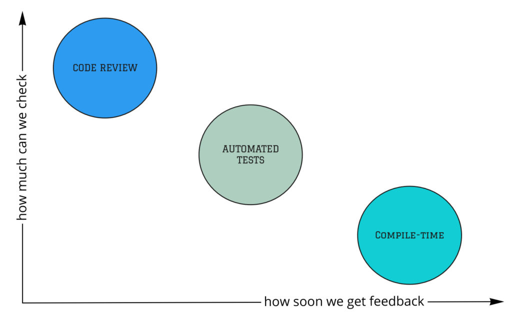
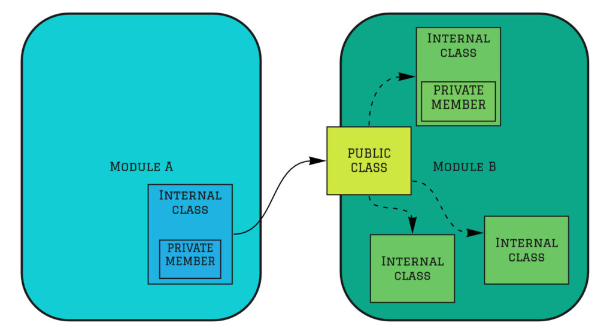
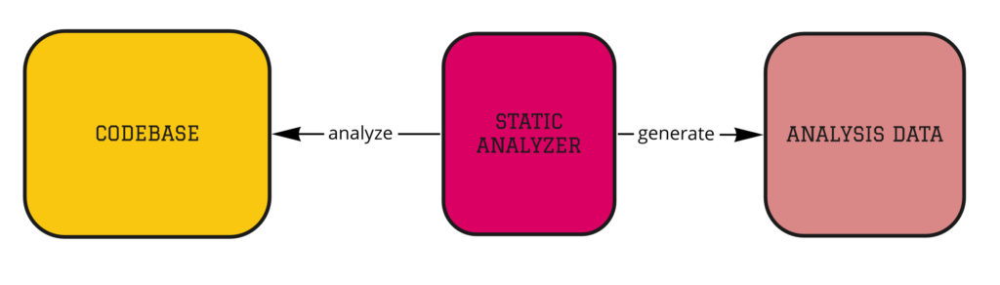
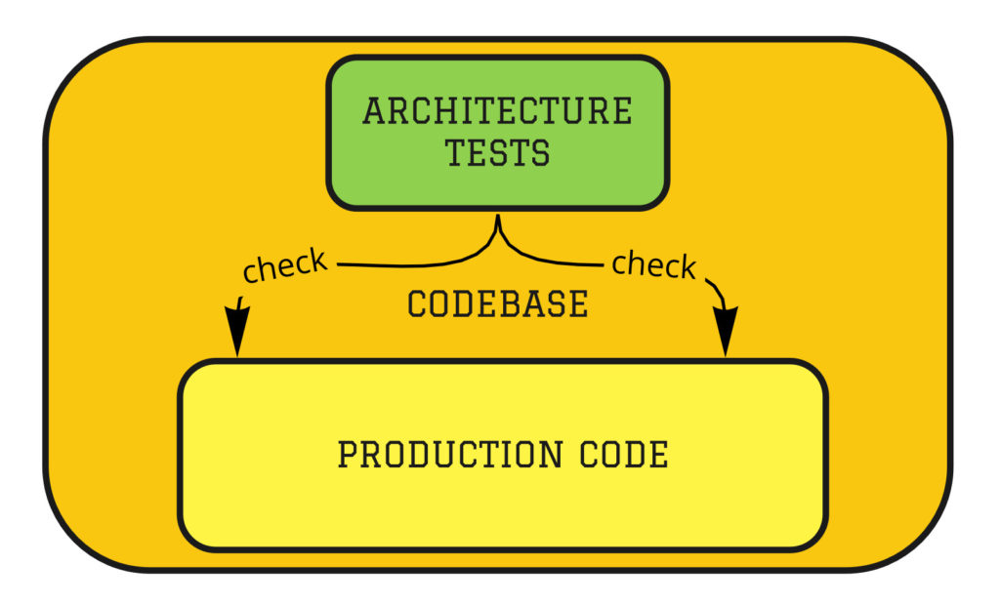

# 模块化单体：架构实施

[原文](https://www.kamilgrzybek.com/blog/posts/modular-monolith-architecture-enforcement) 📂 模块化单体 2020-03-22

<br/>

## 引言

在之前的文章中，我们讨论了什么是 *模块化单体 (Modular Monolith)* 架构，以及可能影响其选择的架构驱动因素。
在这篇文章中，我想重点讨论强制实施所选架构的方法。

下面描述的方法不仅适用于模块化单体架构，可以说它们是通用的。
然而，由于单体的本质 ——代码库的规模和易于变更的特性—— 它们在强制执行架构方面显得尤为重要。

## 模型-代码差距

假设基于当前的架构驱动因素，你决定采用 *模块化单体 (Modular Monolith)* 架构。
再假设你已经预定义了模块边界和解决方案架构。
你选择了技术、方法、模块间通信方式以及持久化方式。

一切都已经以解决方案架构文档/描述（ [SAD](https://en.wikipedia.org/wiki/Software_architecture_description) ）的形式记录下来，
或者你只是画了几个图（使用 UML、C4 模型，或者仅仅是箭头和方框）。
你已完成了足够的前期设计，可以开始最初的迭代实现了。

起初，一切都很简单。
功能不多，代码量少，易于维护，且与建模的架构保持一致。
时间充裕，即使出了问题，也容易重构。
到目前为止，一切顺利。

然而，在某个时刻，事情不再那么容易了。
功能和代码不断增加，需求变更开始出现，截止日期紧追不舍。
我们开始走捷径，我们的实现开始与设计出现显著偏差。
在 *模块化单体 (Modular Monolith)* 架构的情况下，我们最容易以这种方式失去模块化和独立性，一切都开始与一切通信。
又一个 [一团乱麻 (Big Ball Of Mud)](https://en.wikipedia.org/wiki/Big_ball_of_mud) 诞生了：


> 它本该前所未有，结局却一如既往。

George Fairbanks 在他的著作 [Just Enough Software Architecture: A Risk-Driven Approach](https://www.amazon.com/Just-Enough-Software-Architecture-Risk-Driven/dp/0984618104) 中将上述现象定义如下：

> 你的架构模型和源代码不会显示相同的内容。它们之间的差异就是模型-代码差距。

随后他写道：

> 无论你是从源代码开始构建模型，还是反过来，你都必须管理解决方案的两种表示形式。
起初，代码和模型可能完美对应，但随着时间的推移，它们往往会偏离。
代码随着功能的添加和错误的修复而演变。
模型则因应挑战或规划需求而演变。
当其中一方或另一方的演变产生不一致时，分歧就会发生。

从长远来看，我们是否注定以这样的结局收场？
嗯，并非如此。
这当然需要我们自身具备大量的纪律性，但纪律并非全部。
我们需要应用适当的实践和方法来保持架构的可控性。
那么，这些方法是什么呢？

## 架构实施

在描述用于检查我们的实现是否与既定设计一致的工具有哪些时，我们必须考虑两个方面。

第一个方面是工具赋予我们的能力。
我们知道，架构是一组不同抽象层次的规则，有时很难定义，更不用说去检查它们了。

第二个方面是我们获得反馈的速度。
当然，越快越好，因为我们能够更早地修复问题。
我们越早修复，这个错误对后期架构的影响就越小。

考虑到这些假设，在架构实施方面，我们可以在三个不同的层面上进行：通过编译器、自动化测试和代码审查。

<br/>
*架构实施方法*

## 编译时

**编译器是你最好的朋友**。
它能够快速为你检查许多事情，这些事情如果由你来做会花费很长时间。
此外，编译器不会出错，而人会。
既然如此，为什么我们很少利用编译器来负责遵守我们所选择的架构呢？
为什么我们不想最大限度地利用它的能力呢？

第一个主要的罪过是 “一切都是 public” 原则。
根据模块化的定义，模块应该通过定义良好的接口进行通信，这意味着它们应该被封装。
如果一切都是 public，就没有封装。

不幸的是，编程社区通过以下方式助长了这种现象：

- 教程
- 示例项目
- IDE（默认创建 public 类）

我们绝对应该将方法改为 **“默认 private”**。
如果某些东西不能是 private，那么让它能在模块范围内访问，但仍然对其他模块不可见。

如何做到这一点？
不幸的是，在 .NET 中我们的选择有限。
我们唯一能做的就是将模块分离到一个单独的程序集中，并使用 `internal` 访问修饰符。
在所有代码放在一个项目（程序集）中和支持拆分到多个项目的支持者之间，几乎有一场战争。

前者认为程序集是一个实现单元。
是的，但既然我们没有其他方法来封装我们的模块，将项目拆分似乎是一个合理的解决方案。
此外，通过检查引用，添加不正确的依赖关系（例如从领域层到基础设施层）将变得困难甚至不可能。

缺乏封装是我看到的最常见的错误之一，但不是唯一的错误。
其他例子还包括不使用不可变性（不必要的 setter）或强类型（基本类型偏执）。

总的来说，我们应该使用我们的编程语言，让编译器能够为我们捕获尽可能多的错误。
这是强制实施系统架构的最高效的方法。

<br/>
*架构实施 —— 编译时*

## 自动化测试

并非所有事情都可以使用编译器来检查。
然而，这并不意味着我们必须手动检查。
恰恰相反，计算机仍然可以为我们完成这项工作。
在这种情况下，我们可以使用两种机制 —— 静态代码分析和自动化测试。

### 静态代码分析

我将从一种更为熟悉和常见的方法开始 —— 静态代码分析器。
当然，大多数人都听说过像 SonarQube 或 NDepend 这样的工具。
这些工具会自动对代码进行静态分析，并根据分析结果提供可能对我们非常有用的度量信息。
当然，我们可以将静态代码分析器连接到 CI 流程中，并定期获得反馈。

<br/>
*架构实施——静态分析*

### 架构测试

架构测试是另一种方式，知名度较低但越来越受欢迎。
它们是单元测试，但不是测试业务功能，而是在架构的上下文中测试我们的代码库。
大多数情况下，这类测试是基于专用于此类型测试的库编写的。这样的测试可能如下所示：

```csharp
// Architecture test - value object should be immutable
[Test]
public void ValueObject_Should_Be_Immutable()
{
	var types = Types.InAssembly(DomainAssembly)
		.That()
		.Inherit(typeof(ValueObject))
		.GetTypes();

	AssertAreImmutable(types);
}
```

```csharp
// Architecture test - domain layer does not have dependency to infrastructure
[Test]
public void DomainLayer_DoesNotHaveDependency_ToInfrastructureLayer()
{
	var result = Types.InAssembly(DomainAssembly)
		.Should()
		.NotHaveDependencyOn(ApplicationAssembly.GetName().Name)
		.GetResult();

	AssertArchTestResult(result);
}
```

我们可以通过这些测试检查很多事情。
用于此目的的库（例如 [NetArchTests](https://github.com/BenMorris/NetArchTest) 或 [ArchUnit](https://www.archunit.org/) ）功能强大，编写其他测试也不是一项困难的任务。
使用此类测试的完整示例可以在 [这里](https://github.com/kgrzybek/modular-monolith-with-ddd/tree/master/src/Modules/Meetings/Tests/ArchTests) 找到。

<br/>
*架构实施 —— 架构测试*

## 代码审查

如果我们无法通过计算机（编译器、自动化测试）来检查解决方案与所选架构的一致性，那么我们还有最后一个工具 ——代码审查。
通过代码审查，我们可以检查计算机无法为我们完成的所有事情，但它也有一些缺点。

第一个缺点是人可能会犯错，因此遗漏违背架构决策设计规范问题的可能性相对较高。

第二个缺点当然是我们需要花费大量时间进行代码审查。
当然，这不是浪费时间，我们不能放弃它，但它必须始终包含在项目的估算中。

结论显而易见 —— 为了实施架构，我们应尽可能多地使用计算机，并将代码审查视为最后一道防线。
问题是，如何加强这道防线，即在代码审查期间减少时间并降低遗漏某些内容的概率？
我们可以使用 *架构决策记录（Architecture Decisions Records, ADR）* 。

### 架构决策记录（ADR）

什么是架构决策记录 (Architecture Decisions Records) ？
让我引用与此主题相关的最流行的 [GitHub 仓库](https://github.com/joelparkerhenderson/architecture_decision_record) 中的一个定义：

> 架构决策记录（ADR）是一份文档，它记录了一个重要的架构决策及其上下文和后果。

这样的文档通常存储在版本控制系统中，这也被 ThoughtWorks 公司的流行 [技术雷达](https://www.thoughtworks.com/radar/techniques/lightweight-architecture-decision-records)（作为方法本身）所推荐。

我的建议是，尽快以尽可能简单的方式开始描述你的决策。
无需多余的仪式，选择一个简单的模板（例如 [Michael Nygard 提出的那个](https://github.com/joelparkerhenderson/architecture-decision-record/blob/main/templates/decision-record-template-by-michael-nygard/index.md) ），
其中包含最重要的元素 ——上下文、决策和后果。
但这与前面讨论的代码审查有什么关系呢？

首先，所有决策都变得公开，每个人都可以访问并被描述过。
不会有人说 “我不知道” 这样的情况。
既然这些决策从定义上就是重要的， **每个人必须了解它们并遵循它们** 。

第二点是它加快了代码审查过程，因为你可以直接粘贴相关 ADR 的链接，而无需解释为什么要这样做，决策是什么，何时以及在什么上下文中做出的。

## 总结

每个系统都有某种架构。
问题是：你将主动塑造系统的架构，还是让它自行演变？
显然，第一个选项更好，因为第二个选项可能使我们面临重大失败。

架构实施是每个团队成员的责任（不仅仅是架构师），这就是我们实施它的方式如此重要的原因。
这是一个需要承诺的过程。
我提到的这些技术可以极大地简化和改进架构实施的过程，同时将系统的质量保持在适当的水平。

## 补充资源

1. [使用 ArchUnit 对架构进行单元测试 —— Jonas Havers，文章](https://blogs.oracle.com/javamagazine/unit-test-your-architecture-with-archunit)
2. [实践中的架构决策记录 —— Michael Keeling, Joe Runde，演讲](https://resources.sei.cmu.edu/asset_files/Presentation/2017_017_001_497746.pdf)
3. [《设计它！》 —— Michael Keeling](https://www.oreilly.com/library/view/design-it/9781680502923/)
4. [模块化单体与 DDD —— GitHub 仓库](https://github.com/kgrzybek/modular-monolith-with-ddd)
5. [模块化单体 —— Simon Brown，视频](https://www.youtube.com/watch?v=5OjqD-ow8GE)

图片来源：[nanibystudio](https://magnasoma.com/)

## 系列更多文章

本是 [模块化单体](../modular-monolith.md) 系列的一部分：

1. [模块化单体：入门指南](primer.md)
2. [模块化单体：架构驱动因素](drivers.md)
3. [模块化单体：架构实施（本文）](enforcement.md)
4. [模块化单体：集成风格](#todo)
5. [模块化单体：以领域为中心的设计](#todo)
