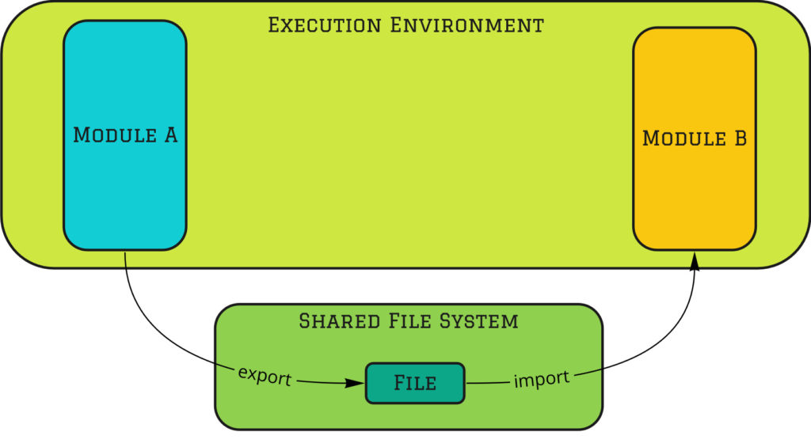
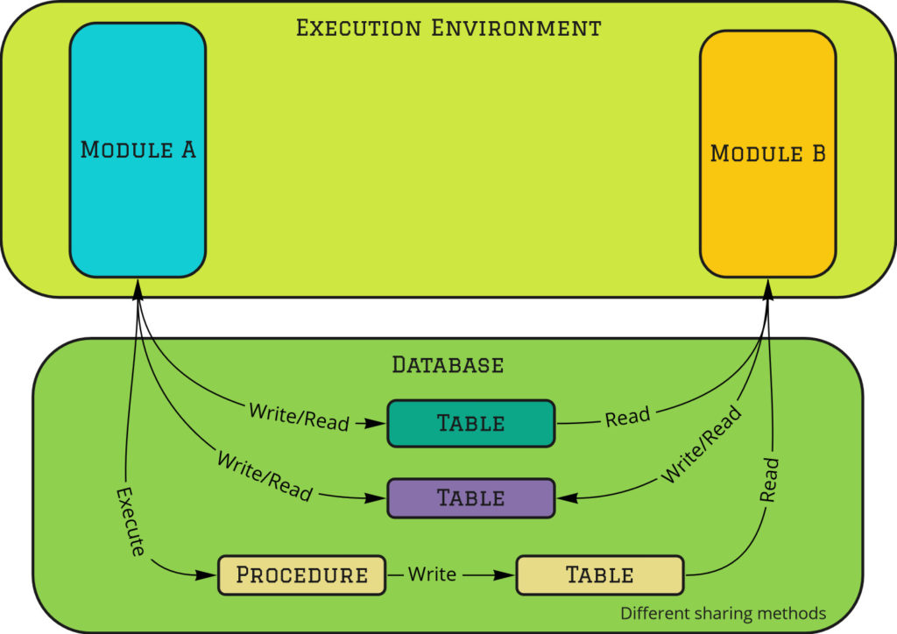
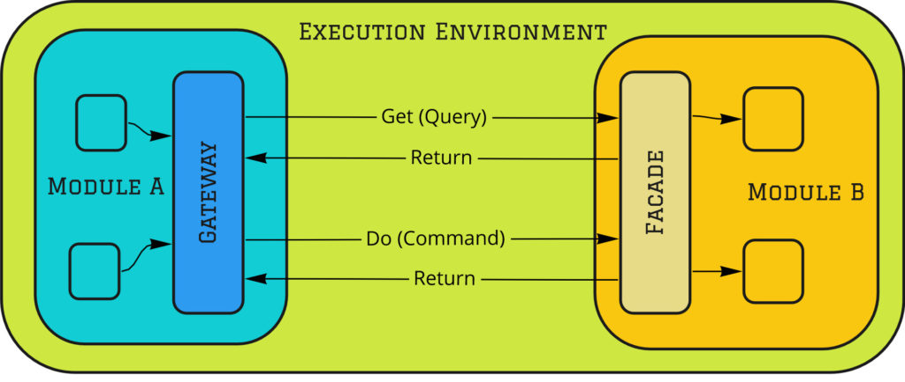
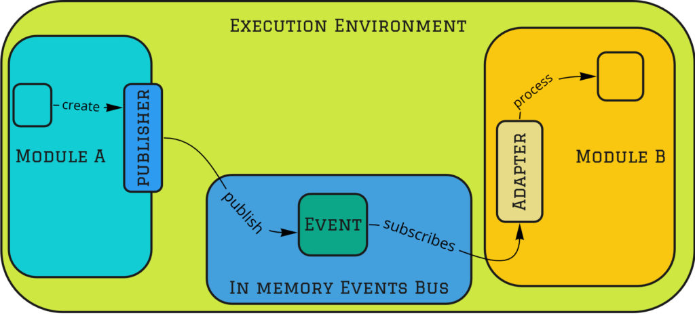
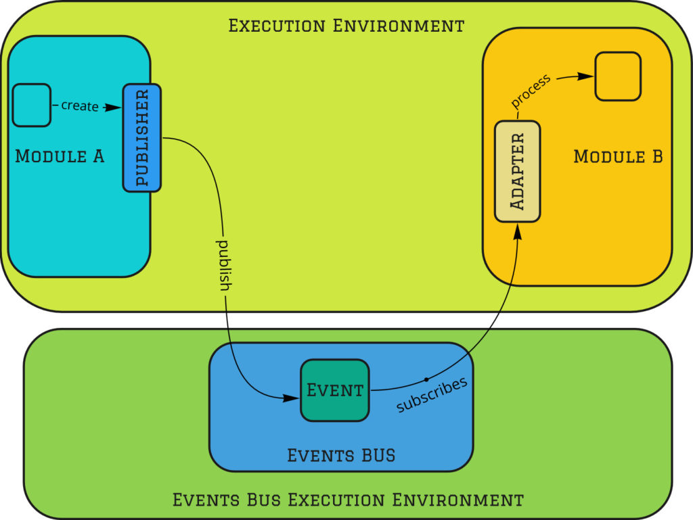
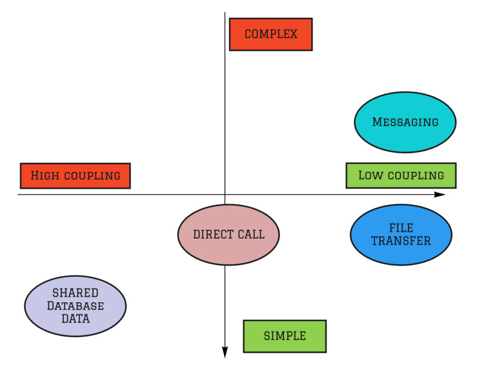
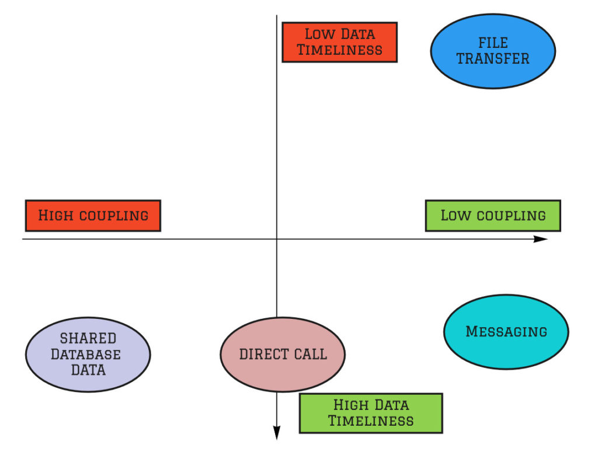

# 模块化单体：集成风格

2020-07-26 📂 架构和设计 📂 模块化单体 [原文](https://www.kamilgrzybek.com/blog/posts/modular-monolith-integration-styles)

 

## 引言

在大型系统中，没有任何模块或应用程序能够在 100% 隔离的状态下工作。
为了交付业务价值，各个元素必须以某种方式相互集成。
请允许我引用 [系统思维：入门](https://www.amazon.com/Thinking-Systems-Donella-H-Meadows/dp/1603580557) 一书中的一段话，Donella H. Meadows 在其中对系统概念进行了概括性定义：

> 系统是由相互关联的元素组成的集合，这些元素以连贯的方式组织起来，以实现某种目标。
如果你仔细审视这个定义片刻，你会发现一个系统必须包含三种事物：**元素、相互连接，以及一个功能或目的**。

系统集成的概念定义如下（ [维基百科](https://en.wikipedia.org/wiki/System_integration) ）：

> ……将不同的计算系统和软件应用在物理上或功能上连接起来，以作为一个协调的整体运行的过程。

从上述定义可以看出，为了提供一个能实现其目的的系统，我们必须将元素集成起来以形成一个整体。
在本系列的前几篇文章中，我们讨论了这些元素的属性 —— 在我们的术语中，它们被称为 *模块 (modules)* 。

在这篇文章中，我只想讨论缺失的部分 —— *模块化单体 (Modular Monolith)* 架构中模块的 *集成风格 (Integration Styles)* 。

## 《Enterprise Integration Patterns》一书

这篇文章的标题并非偶然。
它与 Gregor Hohpe 和 Bobby Wolf 的巨著 [Enterprise Integration Patterns](https://www.amazon.com/o/asin/0321200683) 第二章的标题完全相同。
这本书被认为是关于系统集成和消息传递信息的 “圣经”。
本文从该章节中汲取了一些知识，并将其与单体架构和模块化架构联系起来。

无论如何，对于对集成话题感兴趣的每一位读者，我邀请大家阅读这本书，或在 https://www.enterpriseintegrationpatterns.com/ 网站上查阅相关资料。

## 集成风格

### 集成标准

就像自然界中的一切事物一样，每种集成风格都有其优缺点。
因此，我们必须定义一些标准，以便基于这些标准来比较所有风格。
然后，根据这些标准，我们将在未来决定集成的具体方法。

我们可以区分出以下标准：耦合、复杂度、数据时效性。

#### 1. 耦合

耦合是衡量两个模块相互依赖程度的指标（ [维基百科](https://en.wikipedia.org/wiki/Coupling_(computer_programming)) ）：

> 耦合是软件模块之间相互依赖的程度；衡量两个例程或模块之间紧密连接的程度；模块之间关系的强度。

如果你读过本系列的之前文章，你已经知道 **模块化设计最重要的属性之一就是独立性**。
因此，很容易猜到，在集成风格方面，耦合是较为重要的标准之一。

#### 2. 复杂度

评估集成风格的第二个标准是其 **复杂度水平**。
一些集成方法很简单 —— 所需工作少，易于理解和使用。
然而，另一些则更复杂，需要更多的投入、知识和纪律。

#### 3. 数据时效性

最后一个标准是时间长度，即从一个模块决定共享某些数据到其他模块拥有该数据之间的时间。
这意味着在给定模块发生状态变更后，其余相关模块需要多久才能将该变更考虑在内。
当然，这个时间越短越好。

现在我们已经了解了所有最重要的标准，让我们继续探讨集成我们模块的方法。
我们将讨论 *四种集成风格* ： *文件传输、共享数据库数据、直接调用和消息传递* 。

### 文件传输

第一种选择是使用 **常规文件** 来集成我们的模块。
这样的文件必须从源模块 **导出** ，并 **导入** 到目标模块。
这可以通过 3 种方式发生：

- 手动方式，用户手动导入/导出
- 自动方式，系统自动导入和导出文件
- 混合方式，文件在一侧自动导入/导出，在另一侧则相反

 
*模块化单体集成风格 —— 文件传输*

这种集成类型的主要任务之一是确定给定 **文件的格式**。
重要的是，这是以这种方式集成的两个模块所拥有的唯一依赖关系。
你可以将它视为一个由文件系统承载的真正巨大的消息。
因此，可以认为在这种情况下 **耦合非常低**。

就这种方法的复杂度而言，可以评价为中等。
一方面，在当今时代，生成特定格式的文件并不困难。
另一方面，上传到共享资源、管理文件、处理重复数据等则更加复杂和耗时。

从数据时效性的角度来看，**通过文件进行模块集成是慢的**（更不用说手动导出/导入）。
它通常以较大的批次在某个时间间隔（即所谓的批处理）中执行，通常是在夜间。
因此，延迟可能是一天、一周或更长时间。

说实话，我曾在系统之间多次看到文件共享集成，但在单体中可能从未见过 —— 这是可以理解的。
为了本主题的完整性，我描述了这种集成风格。
单体中最流行的集成方法是 *共享数据库数据* 。

### 共享数据库数据

在 EIP 一书中，这种集成方法被称为 “共享数据库”，但我认为这个名称并不十分准确。
**共享数据库并不总是意味着共享数据** ，因为模块可以将其数据存储在不同的表中（最常见的是通过数据库 schemas 来实现）。
因此，在我看来， *共享数据库数据* 是一个更好的术语。

 
*模块化单体集成风格 —— 共享数据*

在 *共享数据库数据* 方式中，**模块在数据库中共享一组特定的数据** 。
通过这种方式，数据始终是集成且相互一致的，因为一般来说，它们是相同的数据。
如果模块 A 将数据写入表 X，模块 B 可以在数据库事务完成后立即读取该数据。

这种解决方案的复杂度非常低。
如今，每个应用程序/模块都需要一个数据库，因此采用这种方法无需添加任何额外的东西。

这个解决方案乍一看似乎完美。
然而，它最大的缺点是 **非常高的耦合**。
通过共享数据，*模块共享了它们的状态*，从而将它们耦合在一起。
高耦合意味着模块没有自治性。
此外，对数据库结构甚至数据本身的一个小改动，都可能在毫无预警的情况下破坏另一个模块。
这意味着对数据库的每一次更改都必须经过协商和协调。
这样一来，数据库就成了变更的瓶颈。
整个解决方案不再具有 *演化能力*。

共享状态还有另一个显著的缺点 —— **创建一个统一的**、能够确保满足所有模块需求的 **数据模型** 非常困难，甚至不可能。
统一化的尝试通常以得到一个非常薄弱、模糊的模型而告终，该模型难以理解、开发和维护。

为了在保持相同数据时效性水平的同时降低耦合，我们可以使用 *直接调用* 。

### 直接调用

第三种选择是 **直接调用** 与之集成的模块的 **方法**。
在这种情况下，我们使用了[封装](https://en.wikipedia.org/wiki/Encapsulation_(computer_programming)) 机制。
*模块只暴露所需的内容*。
所有行为都被封装在一个方法中。
这样，我们的模块状态不会像共享数据库数据方法那样暴露给外部。
因此，调用方无法从外部破坏任何东西。

 
*模块化单体集成风格 —— 直接调用*

不共享数据意味着每个模块都有自己的数据集。
这可以是按模式拆分的同一个数据库，或者每个模块甚至可以拥有一个使用不同技术创建的独立数据库。
*在共用单个数据库的场景中，重要的是要真正保持数据的隔离*。
这意味着不同模块的表之间没有约束，并且它们之间没有事务。

调用方和被调用方都应将彼此视为外部系统。
两个模块将使用不同的 [语言 (ubiquitous language)](https://martinfowler.com/bliki/UbiquitousLanguage.html)，并具有不同的概念模型。
因此，应该应用 [Anti-Corruption Layer (ACL)](https://docs.microsoft.com/en-us/azure/architecture/patterns/anti-corruption-layer) 。
在调用方一侧，它可以只是一个 [网关](https://martinfowler.com/eaaCatalog/gateway.html)；
在被调用方一侧，则是一个 [Facade](https://en.wikipedia.org/wiki/Facade_pattern)。
通过这种方式，模块的封装得以保持。

在分布式系统中，*直接调用* 被称为 [远程过程调用（RPI/RPC）](https://en.wikipedia.org/wiki/Remote_procedure_call) 。
不幸的是，这种技术在微服务架构中非常常用，
并可能导致所谓的 [分布式单体 (Distributed Monolith)](https://www.simplethread.com/youre-not-actually-building-microservices/) 反模式架构。
由于调用始终是同步的，我们面临着 *时间耦合 (temporal coupling)* 。
调用方和被调用方必须同时可用。
在单体中，这不是问题，因为这是其本质；而在微服务中，情况要糟糕得多 —— 它会降低架构质量属性，如自治开发和部署。
有关更多细节，请阅读本系列中关于架构驱动因素的其他文章。

在集成我们的模块时，*直接调用* 集成风格似乎是一个非常好的选择，但它也有一些缺点。
首先，调用是同步的，因此调用方必须等待结果。
其次，调用模块需要了解它正在调用的模块，它必须具有 **直接的依赖**。
此外，它必须知道它想要做什么的意图。
耦合度低于共享数据库数据，但仍然存在。
如果我们想避免这些缺点，可以使用最后一种集成风格：*消息传递*。

### 消息传递

文件传输集成风格有一个巨大的优势 —— 它不会在模块之间创建依赖关系。
然而，它也有一个很大的缺点 —— 在大多数情况下，数据时效性是不可接受的。
消息传递则没有这个缺点。
数据时效性虽然不如直接调用那么好，因为它是异步通信，但可以安全地说，它在大多数情况下都是非常好的且可以接受的。

 
*集成风格 —— 消息传递（内存中）*

 
*集成风格 —— 消息传递（独立进程）*

恰当地使用 *消息传递* 来实现 [事件驱动架构](https://en.wikipedia.org/wiki/Event-driven_architecture)，不会在模块之间产生依赖关系。
模块通过事件进行集成。
然而，这些不是 [领域事件](https://martinfowler.com/eaaDev/DomainEvent.html) ，
因为领域事件是本地的，并且应该封装在给定的 [限界上下文](https://martinfowler.com/bliki/BoundedContext.html) 中。
集成事件只包含所需的最少信息，以避免所谓的 [胖事件](https://verraes.net/2019/05/patterns-for-decoupling-distsys-fat-event/) 。
集成事件应尽可能小，因为它们是给定模块提供的契约的一部分。
如你所知，契约越小，它就越稳定 -> 其他模块需要变更的频率就越低。

此外，异步处理虽然导致了 [最终一致性](https://en.wikipedia.org/wiki/Eventual_consistency) ，
但另一方面也带来了性能优势，扩展性更好，并且更可靠。

*消息传递* 的缺点是什么？
首先，由于异步的性质，**我们整个系统的状态可能是最终一致的**，如上所述。
这就是为什么明确定义模块边界如此重要的原因。
这与微服务架构中的重要性几乎相同，但 *模块化单体 (Modular Monolith)* 架构的优势在于改变这些边界要容易得多。

*消息传递* 的第二个缺点是更复杂。
为了提供异步处理和事件驱动架构，我们需要某种事件总线。
它可以是一个内存中的代理，也可以是一个独立的组件（例如 [RabbitMQ](https://www.rabbitmq.com/) ）。
此外，我们还需要用于内部处理的任务处理机制 —— 发件箱、收件箱、内部命令消息。
需要编写一些这样的基础设施代码。
幸运的是，这是一个通用问题 —— 我们只做一次，而且有很多库和框架支持它。

### 比较

下面我根据三个标准 ——耦合、数据时效性和复杂度—— 对所有 3 种集成风格进行比较。

 
*比较 —— 耦合 vs 复杂度*

 
*比较 —— 耦合 vs 数据时效性*

从这些图中我们可以推断出什么？
首先，没有一种完美无缺的风格。
幸运的是，我们可以看到一些启发式方法：

1. 如果系统非常、非常简单（ [本质复杂度 (essential complexity)](https://wiki.c2.com/?EssentialComplexity) 低），
并且你不关心模块化：选择简单性，使用 *共享数据库数据* 风格。

2. 如果系统复杂（本质复杂度高），**你必须关心模块化**。
可选方案有：
  - 如果你更看重最高级别的自治性，并且模块之间的最终一致性是可以接受的，选择 *消息传递*
  - 如果你非常关心性能、可靠性、可扩展性，选择 *消息传递*
  - 如果你必须具有强一致性，不需要最大程度的模块自治，或者数据时效性是首要因素，选择 *直接调用*

此外，你还可以 **混合使用不同的风格**。
通常，当我们在谈论模块化架构时，最好将 *直接调用* 和 *消息传递* 结合使用。
一些模块可以根据需要同步通信，而另一些则可以异步通信。

## 总结

正如我在开头提到的，没有哪个模块、组件或系统是生活在完全孤立之中的。
我们必须遵循 “分而治之” 的原则，将我们的解决方案划分为更小的部分，但最终 —— 我们必须将这些部分集成在一起以创建一个系统。

让我们再次总结所有 4 种风格：

- *文件传输* —— 提供低耦合，但数据时效性几乎总是不可接受，因此在单体中不实用
- *共享数据库数据* —— 最简单、快速，但将模块耦合在一起
- *直接调用* —— 提供比共享数据库数据更低的耦合，封装模块，相对简单
- *消息传递* —— 确保最低的耦合、模块化和自治性，但代价是复杂度增加

应该选择哪种集成风格？
一切，一如既往，“视情况而定”。
然而，我希望我至少在一定程度上解释了它取决于什么。
[没有银弹](https://en.wikipedia.org/wiki/No_Silver_Bullet) ，再次强调。

## 系列更多文章

本是 [模块化单体](../modular-monolith.md) 系列的一部分：

1. [模块化单体：入门指南](primer.md)
2. [模块化单体：架构驱动因素](drivers.md)
3. [模块化单体：架构实施](enforcement.md)
4. [模块化单体：集成风格（本文）](integration.md)
5. [模块化单体：以领域为中心的设计](ddd.md)
