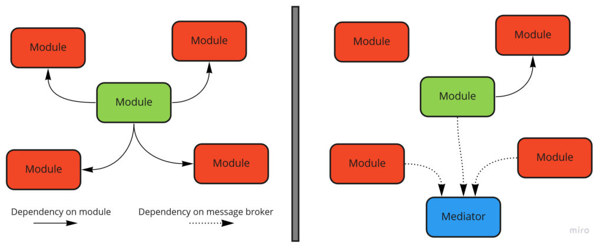
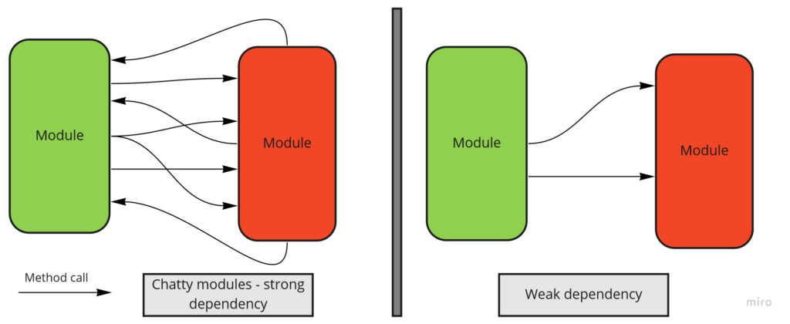
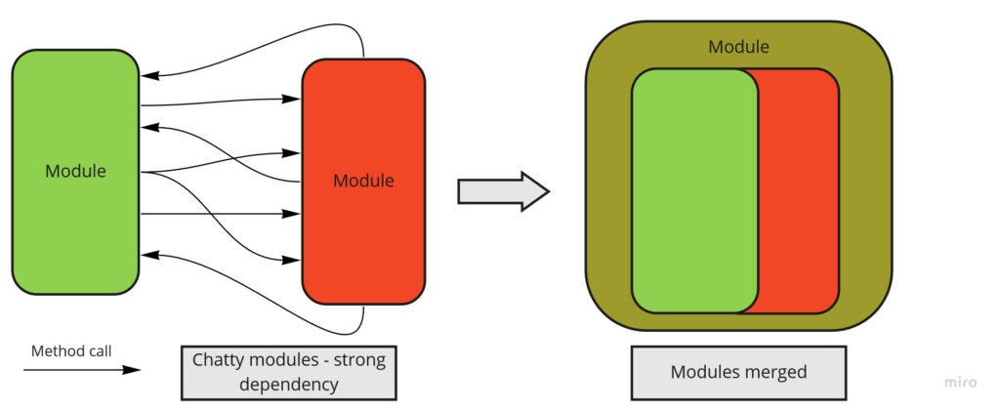
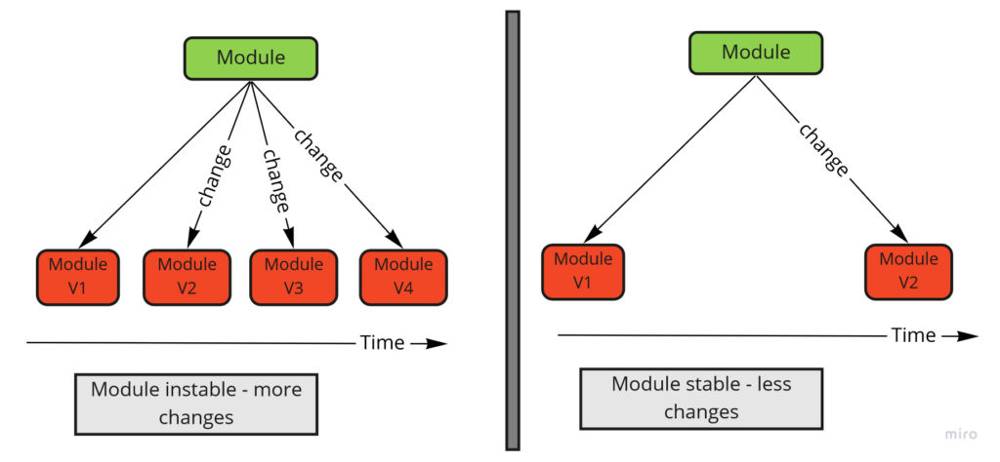
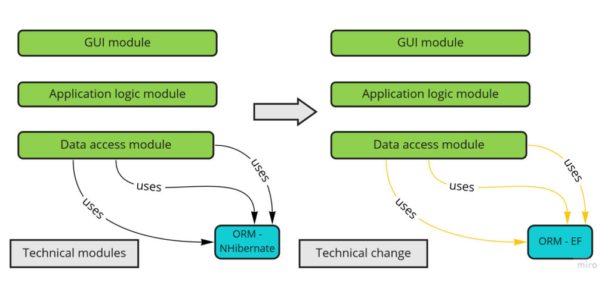
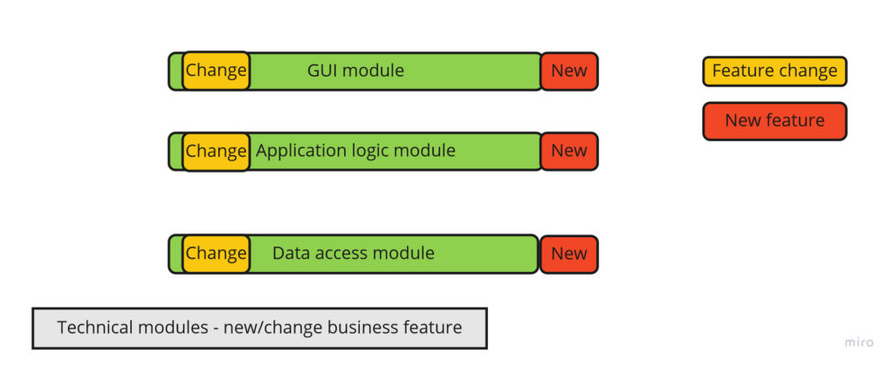
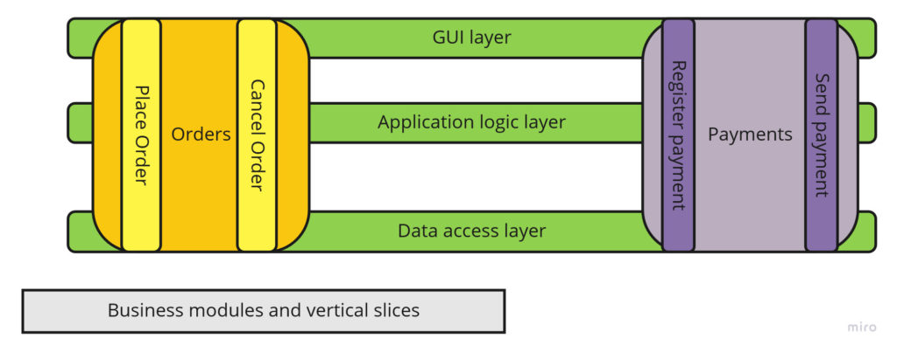
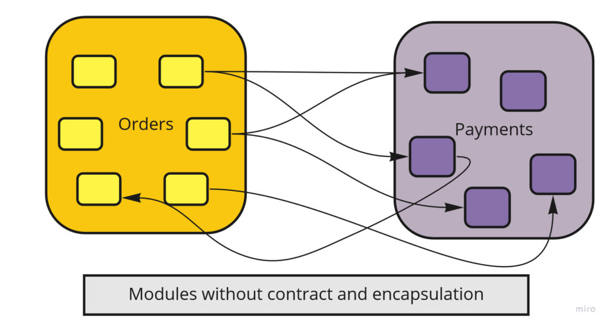
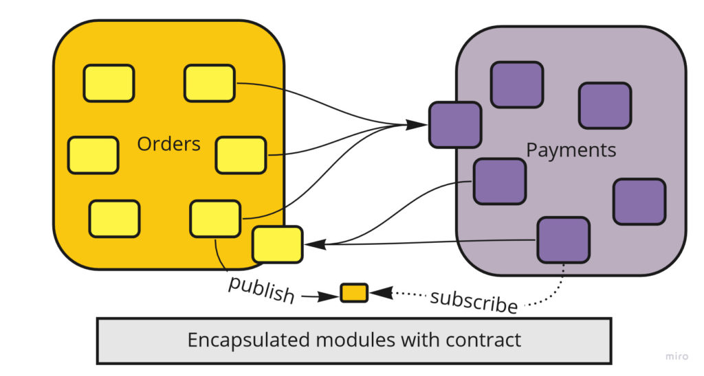

# 模块化单体：入门指南

2019-12-02 📂 架构和设计 📂 模块化单体 [原文](https://www.kamilgrzybek.com/blog/posts/modular-monolith-primer)

 

## 引言

自微服务架构兴起以来，许多年已经过去，它仍然是系统架构背景下讨论的主要话题之一。
云解决方案、容器化以及支持分布式系统开发和维护的先进工具（如 Kubernetes）的普及，进一步促进了这一现象。

观察社区、公司中正在发生的事情，以及与程序员的对话，可以得出结论：大多数新项目都在使用微服务架构来实现。
此外，一些遗留系统也在向这种方法迁移。

好的，这篇帖子的主题是 *模块化单体 (Modular Monolith)* ，而我却在讨论微服务，为什么呢？
因为我认为，我们 IT 行业在过度采用微服务架构方面已经犯了一个错误的起点。
我们没有 **专注于架构驱动因素**，而是相信微服务是单体应用中所有问题的灵丹妙药。
如果你曾参与开发一个包含多个部署单元的系统，你已经知道事实并非如此。
每种架构都有其优缺点 —— 微服务也不例外。
它们解决了一些问题，但也由此产生了另一些问题。

通过这篇文章，我想开启一个关于 *模块化单体* 架构的系列文章。
我这样做有几个原因。

首先，我想驳斥一个迷思：即单体架构无法构建出高水准的系统。
其次，我想澄清关于这种架构的定义及其外观的疑虑 —— 许多人对它有不同解读。
第三，我将这一系列文章视为对我几个月前在 GitHub 上分享的、广受好评的 [模块化单体与 DDD 架构](https://github.com/kgrzybek/modular-monolith-with-ddd) 实现的扩展和补充（发布一个月后获得 1k star）。

在这篇介绍性文章中，我将重点讨论 *模块化单体* 架构的定义。

## 什么是模块化单体？

在谈论或撰写技术和业务问题时，我总是尽量做到准确，尤其是在涉及架构时。
我相信清晰连贯的表达非常重要。
这就是为什么我想明确定义 *模块化单体* 架构对我意味着什么，以及我是如何理解它的。

让我们从更简单的概念开始：什么是 *单体* ？

### 单体

[维基百科](https://en.wikipedia.org/wiki/Monolithic_architecture) 对 *单体建筑 (monolithic architecture)* 的描述是从建筑工程而非计算机科学的角度出发的，如下所示：

> 单体建筑是指从单块材料中雕刻、浇铸或挖掘出来的建筑，历史上通常指从岩石中开凿而成。

在计算机科学中，建筑（building）就是系统，而材料就是我们的可执行代码。
因此，在单体架构中，我们的系统 **恰好由一块可执行代码组成，仅此而已** 。

让我们看两个技术定义：第一个关于 [单体系统 (Monolith System)](https://en.wikipedia.org/wiki/Monolithic_system) ：

> 如果一个软件系统具有单体架构，其中功能上可区分的方面（例如数据输入输出、数据处理、错误处理和用户界面）都相互交织在一起，
而不是包含架构上独立的组件，则该系统被称为 “单体” 系统。

第二个关于 [单体架构 (Monolith Architecture)](https://whatis.techtarget.com/definition/monolithic-architecture) 的定义：

> 单体架构是设计软件程序的一种传统统一模型。
在此上下文中，“单体” 意味着全部组合成一个整体。
单体软件被设计为自包含的；
程序的组件相互连接且相互依赖，而不是像模块化软件程序那样松散耦合。

上述两个定义（Google 搜索结果中的前几条）有两个共同的假设。

**第一**，它们认为这种架构假定系统的所有部分形成一个部署单元 —— 这一点我同意。
**第二**个共同假设是，它们假定这种架构中缺乏模块化 —— 这一点我绝对不同意。
*"相互交织，而不是包含架构上独立的组件"* 和 *"程序的组件相互连接且相互依赖，而不是松散耦合"* 这些说法，对这种架构的描述非常负面，认为其中所有内容都是混杂在一起的。
情况可能如此，但 <ins>并非必然如此</ins>。
这不是单体的本质属性。

总而言之，单体无非就是一个 **恰好只有一个部署单元的系统**。
不多也不少。

### 模块化

我已经定义了 “单体” 的含义，现在让我们来看第二个方面：*模块化 (Modularity)* 。

根据 [英语词典](https://dictionary.cambridge.org/dictionary/english/modular)，某些东西是模块意味着什么？

> <ins>由独立的部分</ins>组成，当这些部分组合在一起时，形成一个完整的整体 / 由一组独立的部分制成，这些部分可以 <ins>连接在一起形成一个更大的对象</ins>。

而 *模块化 (Modularization)* 本身：

> 以独立部分进行的设计或生产。

由于这是一个通用定义，对于编程世界来说还不够。
让我们使用一个更具体的、关于 [模块化编程 (Modular programming)](https://en.wikipedia.org/wiki/Modular_programming) 的技术定义：

> 模块化编程是一种软件设计技术，它强调将程序的功能分离为 <ins>独立的、可互换的模块</ins>，使得每个模块<ins>都包含执行所需功能的仅一个方面所必需的一切</ins>。
模块<ins>接口</ins>表达了该模块提供和需要的元素。
接口中定义的元素可被其他模块检测到。
实现包含与接口中声明的元素相对应的工作代码。

这里提出了几个重要问题。
为了拥有模块化架构，你必须有模块，而这些模块必须：

- a) 必须独立且可互换  
- b) 必须拥有一切必要的东西来提供所需的功能  
- c) 必须具有已定义的接口

让我们看看这些假设意味着什么。

#### 模块必须独立且可互换

要使模块满足这些假设，顾名思义，它应该是独立的。
当然，它完全独立是不可能的，因为那意味着它不与其他模块集成。
模块总会依赖于某些东西，但依赖关系应该保持在最低限度。
遵循原则：[松耦合，强内聚](http://www.kamilgrzybek.com/design/grasp-explained/) 。

在下图左侧，我们有一个具有大量依赖关系的模块，你肯定不能说它是独立的。
另一方面，在右侧，情况正好相反 —— 该模块包含最少的依赖关系，并且它们更松散，它最终更加独立：

 
*模块独立性*

然而，依赖关系的数量只是衡量我们模块独立程度的一个指标。
第二个衡量标准是依赖关系的强度。
换句话说，我们是频繁地使用多个方法来调用它，还是偶尔使用一个或几个方法来调用它？

 
*强依赖 / 弱依赖*

在第一种情况下，可能是我们错误地定义了模块的边界，**如果两个模块紧密相关，我们应该将它们合并** ：

 
*模块合并*

影响模块独立性的最后一个属性是 **它所依赖的模块的变化频率**。
正如你可能猜到的 —— 这些依赖模块变化越少，该模块就越独立。
另一方面，如果变化频繁 —— 我们就必须经常更改自己的模块，它就会失去独立性：

 
*模块稳定性*

总而言之，模块的独立性由三个主要因素决定：

- 依赖关系的数量
- 依赖关系的强度
- 模块所依赖的模块的稳定性

#### 模块必须拥有一切必要的东西来提供所需的功能

“模块” 这个词非常重载 (overloaded)，可以在许多上下文中使用，含义不同。
这里一个常见的情况是将逻辑层称为模块，例如 GUI 模块、应用程序逻辑模块、数据库访问模块。
是的，在这种上下文中，这些也是模块，但它们提供的是 **技术性而非业务性的功能** 。

在技术上下文中考虑模块时，只有技术性更改才会导致恰好一个模块发生更改：

 
*技术模块与技术变更*

添加或更改业务功能通常会贯穿所有层，**导致每个技术模块都发生更改** ：

 
*技术模块——新增/变更业务功能*

我们必须问自己的问题是：我们更频繁地进行与系统技术部分相关的更改，还是业务功能的更改？
在我看来 —— 肯定是后者更频繁。
我们很少更换数据库访问层、日志库或 GUI 框架。
因此，在模块化单体中，模块是一个业务模块，**能够完全提供一组所需的功能** 。
这种设计被称为 *垂直切片 (Vertical Slices)* ，我们将这些切片分组到模块中：

 

通过这种方式，频繁的变更 **只影响一个模块** —— 它变得更加独立、自治，并且能够独立提供功能。

#### 模块必须有已定义的接口

模块化的最后一个属性是 **定义良好的接口** 。
如果我们的模块没有 *契约（Contract）* ，我们就无法谈论模块化架构：

 
*没有契约（接口）的模块*

*契约（Contract）* 是我们向外部提供的内容，因此非常重要。
它是我们模块的 “入口点 (entrypoint)”。
良好的契约应该明确无误，并且仅包含给定契约 (given contract) 的客户端所需要的内容。
我们应该保持它的稳定（以免破坏我们的客户端），并将其背后的一切隐藏起来（ [封装](https://en.wikipedia.org/wiki/Encapsulation_(computer_programming)) ）：

 
*带有契约的模块*

正如上图所示，我们模块的契约可以采取不同的形式。
有时它是用于同步调用的某种 [facade](https://en.wikipedia.org/wiki/Facade_pattern)（例如公共方法或 REST 服务），
有时它可以是用于异步通信的已发布事件。
在任何情况下，我们向外部共享的所有内容都 **成为模块的公共 API** 。
因此，**封装是模块化不可分割的元素** 。

**总结**

- 单体 (Monolith) 是一个恰好只有一个部署单元的系统。

- 单体架构 (Monolith architecture) 并不意味着系统设计不良、缺乏模块化或糟糕。
它并不说明任何关于质量的事情。

- 模块化单体架构 (Modular Monolith architecture) 是对以模块化方式设计的单体系统的明确命名。

- 为了实现高水平的模块化，每个模块必须独立，拥有提供所需功能的一切（按业务领域分离），被封装，并具有定义良好的接口/契约 。

在下一篇文章中，我将讨论模块化单体架构与微服务架构相比的优缺点。

## 补充资源

1. [模块化单体视频 —— Simon Brown](https://www.youtube.com/watch?v=5OjqD-ow8GE)
2. [宏伟的模块化单体 —— Axel Fontaine](https://www.youtube.com/watch?v=BOvxJaklcr0)
3. [模块化编程 —— Wikipedia](https://en.wikipedia.org/wiki/Modular_programming)
4. [单体应用 —— Wikipedia](https://en.wikipedia.org/wiki/Monolithic_application)
5. [模块化单体与 DDD —— GitHub 仓库](https://github.com/kgrzybek/modular-monolith-with-ddd)
6. [垂直切片架构 —— Jimmy Bogard](https://jimmybogard.com/vertical-slice-architecture/)

图片来源：[Magnasoma](https://magnasoma.com/)

## 系列更多文章

本是 [模块化单体](../modular-monolith.md) 系列的一部分：

1. [模块化单体：入门指南（本文）](primer.md)
2. [模块化单体：架构驱动因素](drivers.md)
3. [模块化单体：架构实施](enforcement.md)
4. [模块化单体：集成风格](integration.md)
5. [模块化单体：以领域为中心的设计](#todo)
