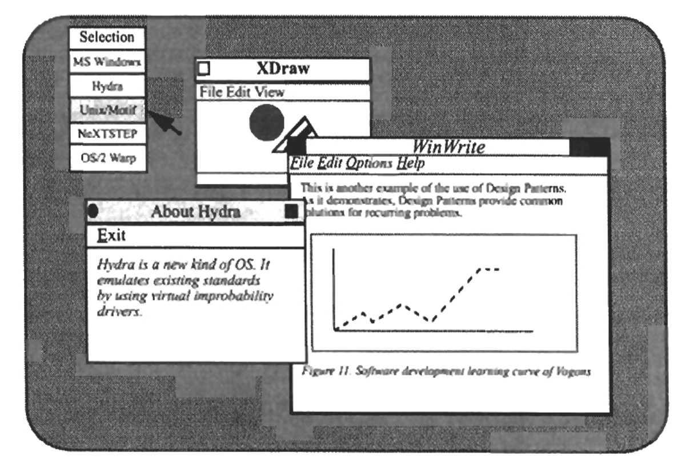
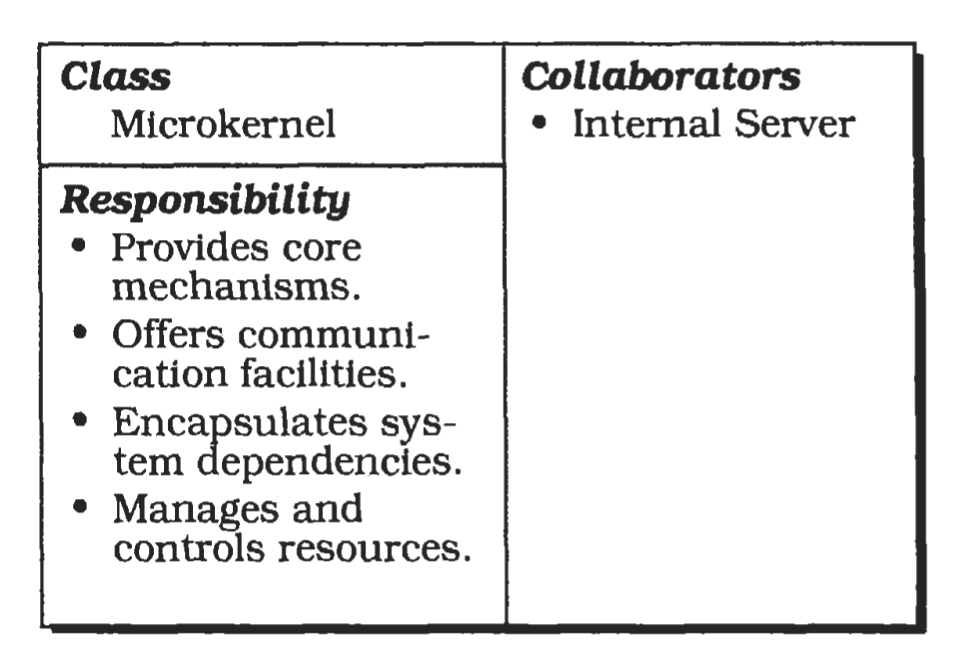
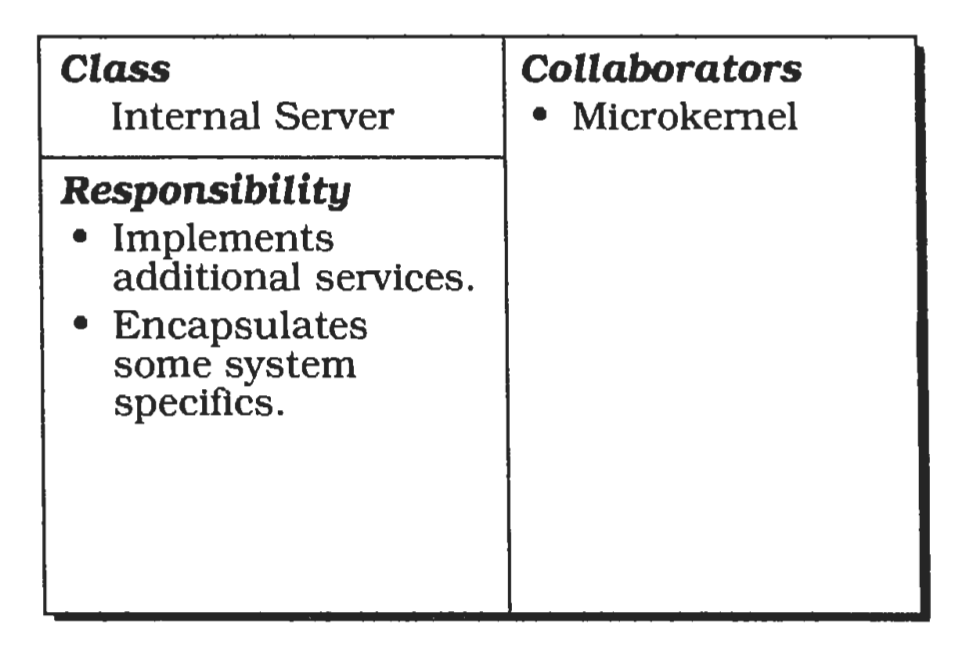
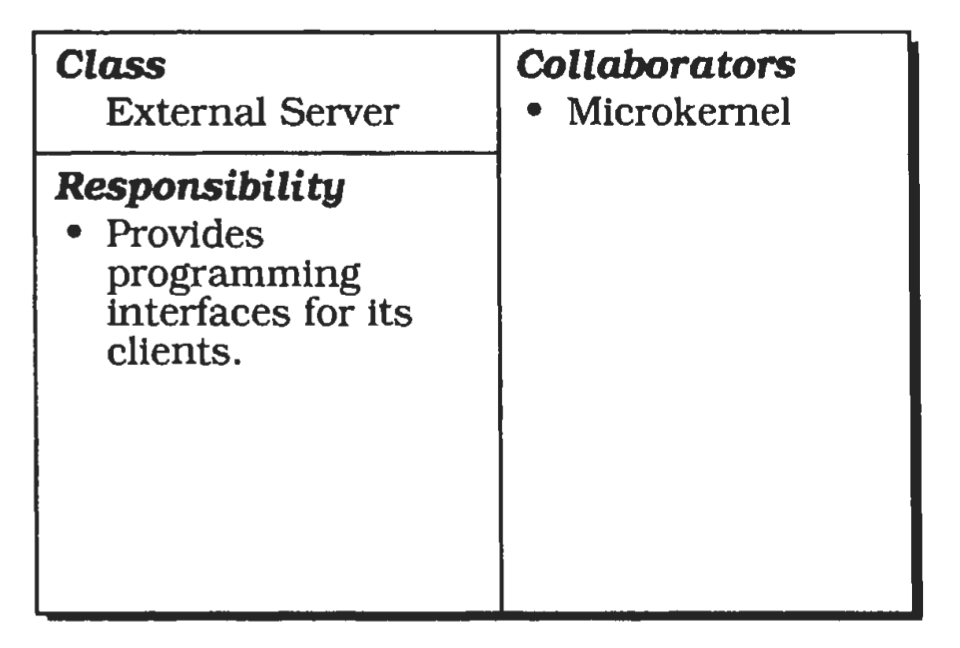
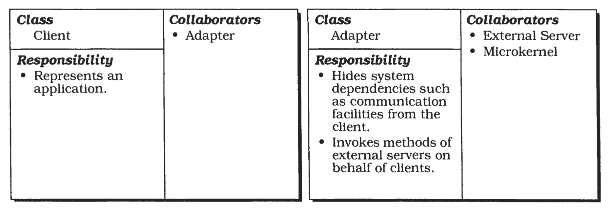
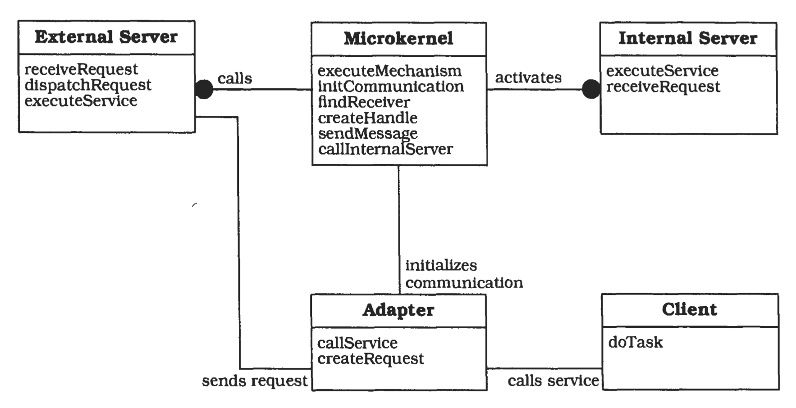
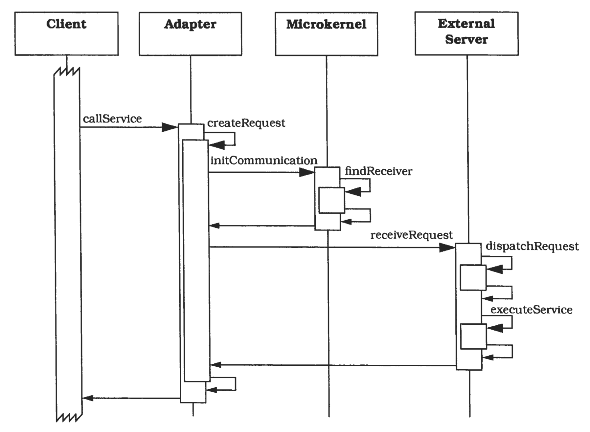
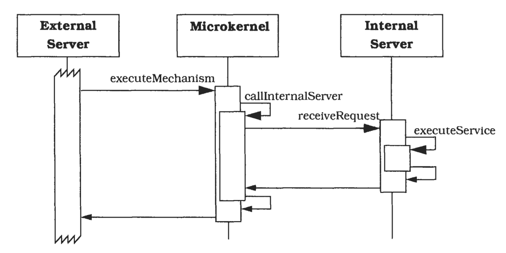

# 微内核 (Microkernel)

---
微内核架构模式适用于必须能够适应不断变化的系统需求的软件系统。
它将最小功能核心与扩展功能和客户特定部分分离开来。
微内核还充当一个插槽 (socket)，用于插接这些扩展组件并协调它们之间的协作。

---

## 示例 (Example)

假设我们打算为桌面计算机开发一款名为 Hydra 的全新操作系统。
我们的开发团队为此制定了一系列设计目标。
其中一项需求是，这款创新操作系统必须能轻松移植到相关硬件平台，并且能够便捷地适配未来的发展。
它还必须能够运行为其他主流操作系统编写的应用程序，例如 NeXTSTEP、微软 Windows 以及 UNIX System V。
用户应能在启动应用程序前，通过弹出菜单选择想要使用的操作系统。
Hydra 会在其主窗口中显示当前正在运行的所有应用程序。

 

为模拟所有这些操作系统，Hydra 将集成专用服务器，这些服务器会实现 Hydra 功能核心的特定视图。
视图指的是建立在核心功能之上的一层抽象接口。
由一个服务器进程模拟微软 Windows 就是这类视图的一个实例。
由于多媒体、笔式计算以及万维网等多项新技术的重要性很可能不断提升，Hydra 系统在设计上应便于这些技术的集成，同时也支持整体功能的适配、演进与增强。

## 上下文 (Context)
开发使用构建于同一核心功能之上的相似编程接口的若干应用程序。

## 问题 (Problem)

为某个需要应对广泛同类标准与技术的应用领域开发软件，是一项艰巨的任务。
典型例子包括操作系统、图形用户界面等应用平台 [20](#20) 。
这类系统通常生命周期较长，有时可达十年甚至更久。
在如此长的周期内，新技术会不断涌现，旧技术则会发生变化。
因此在设计此类系统时，需要特别考虑以下影响因素：

- 应用平台必须能够应对硬件与软件的持续演进。

- 应用平台应具备可移植性、可扩展性和适应性，以便轻松集成新兴技术。

这类应用平台的成功还取决于它们能否运行为现有标准编写的应用程序。
为支持广泛的应用，需要为底层应用平台的功能提供多种不同视图。
换句话说，像操作系统或数据库这样的应用平台，还应当能够模拟属于同一应用领域的其他应用平台。

↘️例如，Hydra 操作系统旨在运行为微软 Windows、OS/2 Warp 等主流操作系统原生开发的应用程序。

这便产生了以下影响因素：

- 你所在领域的应用程序需要支持不同但相似的应用平台。

- 应用程序可划分为多个类别，它们以不同方式使用同一功能核心，这就要求底层应用平台能够模拟现有标准。

提供某一领域功能核心的应用平台，对其使用者而言是一种独占性资源。
为避免性能问题并保证可扩展性，你的解决方案必须考虑另一项约束：

- 应用平台的功能核心应拆分为一个内存占用最小化的组件，以及尽可能少消耗处理能力的服务。

## 解决方案 (Solution)
将应用平台的基础服务封装在一个微内核组件中。
微内核包含的功能可让运行在独立进程中的其他组件彼此通信。
它同时负责维护文件、进程等系统级资源。
此外，微内核还提供接口，使其他组件能够访问其功能。

若某些核心功能在微内核中实现，会导致其体积或复杂度不必要地增加，则应将其分离到 *内部服务器 (internal servers)* 中。

*外部服务器* 基于底层微内核实现各自的视图。
为构建该视图，它们会通过微内核提供的接口，使用相应机制。
每个外部服务器都是独立进程，其本身即代表一个应用平台。
因此，微内核系统可被视为一个集成了其他应用平台的应用平台。

客户端通过微内核提供的通信机制与外部服务器进行交互。

## 结构 (Structure)
微内核模式定义了五种参与组件：

- 内部服务器
- 外部服务器
- 适配器
- 客户端
- 微内核

*微内核* 是该模式的核心组件，实现通信机制、资源管理等核心服务。
其他组件基于这些基础服务的全部或部分构建。
他们通过使用一个或多个接口间接地完成这一点，这些接口组成了微内核所公开的功能。

许多与特定系统相关的依赖关系都被封装在微内核内部。
例如，大多数与硬件相关的部分对其他组件而言是不可见的。
微内核的客户端只能看到底层应用领域和平台特性的特定视图。

微内核还负责维护进程、文件等系统资源，并控制和协调对这些资源的访问。

总之，微内核实现的是 *原子服务 (atomic services)* ，我们将这类服务称为 *机制 (mechanisms)* 。
这些机制构成了基础，更复杂的功能，称为 *策略 (policies)* ，便构建于此基础之上。

 

↘️在 Hydra 操作系统中，我们希望支持 UNIX System V、OS/2 Warp 以及其他多种操作系统。
在实现 Hydra 的进程模型时，我们遇到了一个问题。
在 UNIX 系统中，创建新子进程这类系统调用是通过克隆现有进程、复制整个地址空间来实现的。
而 OS/2 Warp 处理进程创建的方式完全不同，它不会复制父进程的地址空间。
换言之，OS/2 Warp 与 UNIX 提供了不同的进程管理策略。
因此，Hydra 在设计时提供了各类基础服务，既包含创建进程的机制，也包含克隆现有进程地址空间的机制。
通过对这些机制的多种组合方式，便可分别实现 UNIX System V 的进程模型与 OS/2 Warp 的进程模型。

*内部服务器* ，也称为 *子系统 (subsystem)* ，扩展了微内核提供的功能。
它是一个独立的组件，提供额外的功能。
微内核通过服务请求调用内部服务器的功能。
因此，内部服务器可以封装对底层硬件或软件系统的部分依赖关系。
例如，支持特定显卡的设备驱动程序就非常适合作为内部服务器。

 

设计目标之一应是尽可能缩小微内核体积，以降低内存需求。
另一个目标是提供执行高效的机制，以减少服务执行时间。
因此，额外的、更复杂的服务由内部服务器实现，微内核仅在需要时才激活或加载这些服务器。
你可以将内部服务器视为微内核的扩展。
请注意，内部服务器仅允许微内核组件访问。

外部服务器，也称为 *个性化 (personality)* ，是一种利用微内核，为底层应用领域实现其专属视图的组件。
如前所述，视图是指在微内核提供的原子服务之上构建的一层抽象。
不同的外部服务器为特定应用领域实现不同的策略。

外部服务器与微内核本身一样，通过导出接口来暴露其功能。
每个此类外部服务器都运行在独立的进程中。
它借助微内核提供的通信机制接收来自客户端应用程序的服务请求，对这些请求进行解析，执行相应的服务，并将结果返回给客户端。
服务的实现依赖于微内核的各种机制，因此外部服务器需要访问微内核的编程接口。

 

↘️在 Hydra 系统中，我们计划实现一个 OS/2 Warp 外部服务器和一个 UNIX System V 外部服务器。
这两类服务器均借助底层微内核的各类机制，来实现完整的 OS/2 Warp 与 UNIX System V 系统调用。

客户端是仅与唯一一个外部服务器关联的应用程序，它只访问该外部服务器提供的编程接口。

如果客户端需要直接访问其所属外部服务器的接口，就会出现问题。
每个客户端都必须使用现有的通信机制与外部服务器进行交互。
因此，客户端代码中必须硬编码与外部服务器的每一次通信。
然而，客户端与服务器之间如此紧密的耦合会带来诸多弊端：

- 此类系统对可变更性的支持不佳。
- 如果外部服务器模拟现有应用平台，那么为这些平台开发的客户端应用程序不经修改将无法运行。

因此，我们在客户端与其外部服务器之间引入接口，以避免客户端产生直接依赖。
*适配器 (Adapters)* ，也称为 *仿真器 (emulators)* 代表客户端与外部服务器之间的这类接口，使客户端能够以可移植的方式访问其外部服务器的服务。
适配器属于客户端地址空间的一部分。
如果外部服务器实现了某个现有应用平台，对应的适配器便会模拟该平台的编程接口。
如此一来，为被仿真平台编写的客户端无需修改即可编译并运行。
适配器同时也能屏蔽微内核的具体实现细节，对客户端起到保护作用。

每当客户端向外部服务器请求服务时，适配器负责将该调用转发至对应的服务器。
为此，适配器会使用微内核提供的通信服务。

 

↘️由于适配器的封装作用，与 OS/2 Warp 外部服务器关联的 Hydra 客户端无法知晓自身是运行在原生 OS/2 Warp 系统上，还是运行在提供了 OS/2 Warp 外部服务器的微内核系统上。
客户端只需像往常一样使用 OS/2 系统调用即可，底层的实际运行逻辑均由适配器进行屏蔽。

下面这张 OMT 图展示了微内核系统的静态结构。
其核心组件，微内核与外部服务器、内部服务器以及适配器相互协作。
每个客户端都与一个适配器相关联，该适配器充当客户端与其对应外部服务器之间的桥梁。
内部服务器仅允许微内核组件访问。

 

## 动态 (Dynamics)
微内核系统的动态行为取决于其为进程间通信提供的功能。
在以下场景中，我们假定支持远程过程调用。
第一种场景还假设外部服务器不访问微内核接口——后一种情况将在第二种场景中说明。

### 场景一
演示客户端调用其所属外部服务器服务时的行为：

- 在客户端控制流的某个时刻，客户端通过调用适配器向外部服务器请求服务。
- 适配器构造一个请求，并向微内核申请与该外部服务器建立通信链路。
- 微内核确定外部服务器的物理地址，并将其返回给适配器。
- 获取该信息后，适配器与外部服务器建立直接通信链路。
- 适配器通过远程过程调用将请求发送至外部服务器。
- 外部服务器接收请求，对消息进行解包，并将任务委派给自身的某个方法。
完成所请求的服务后，外部服务器将所有结果与状态信息返回给适配器。
- 适配器将结果返回给客户端，客户端继而继续执行其控制流程。

 

### 场景二
下图展示了在微内核架构中，当外部服务器请求由内部服务器提供服务时的系统行为。
在该场景中，我们假设内部服务器被实现为一个独立的进程。
它也可以被实现为一个与微内核动态链接的共享库。

- 外部服务器向微内核发送服务请求。
- 调用微内核编程接口中的一个程序来处理该服务请求。
在方法执行期间，微内核向内部服务器发送请求。
- 内部服务器接收到请求后，执行所请求的服务，并将所有结果返回给微内核。
- 微内核将结果返回给外部服务器。
- 最后，外部服务器接收结果并继续执行其控制流程。

 

## 实现 (Implementation)

---
#### 20 
在现有文献中，微内核系统的描述主要与操作系统的设计相关。
尽管如此，我们认为该模式同样适用于其他多个领域，例如金融应用或数据库系统领域 [Woo96](../../ref.md#woo96) 。
由于人们对使用微内核实现操作系统有着广泛的认知，我们的示例将聚焦于这一特定领域。
