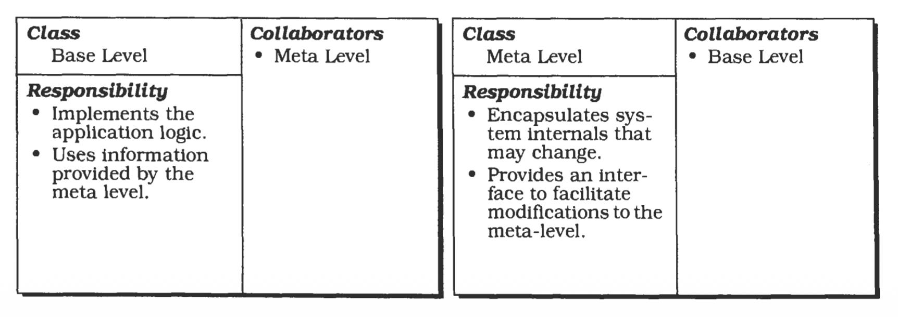
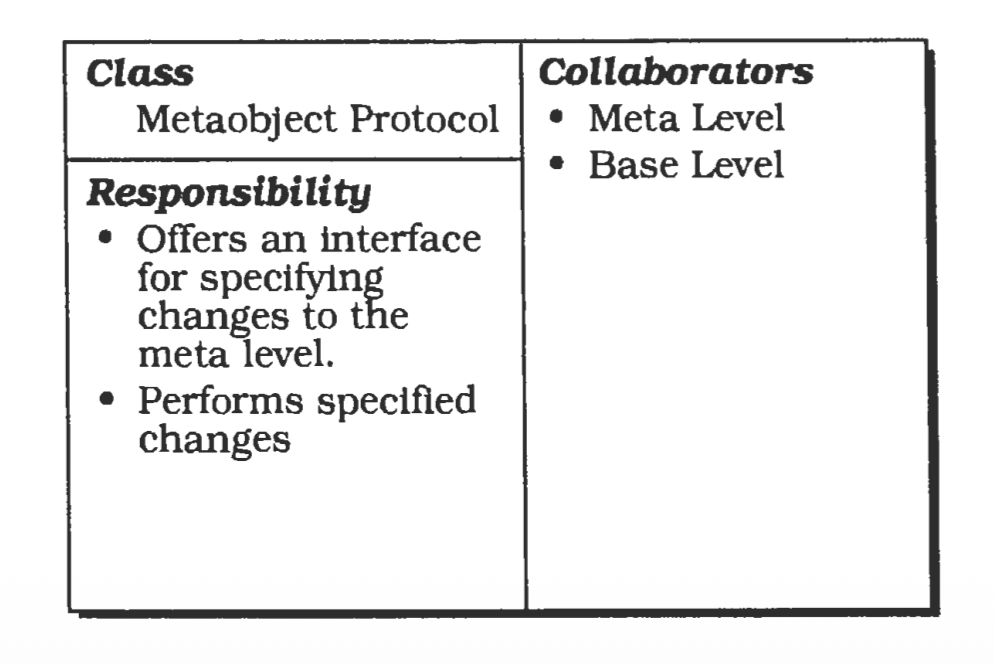
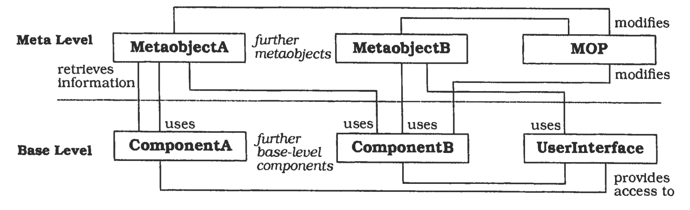
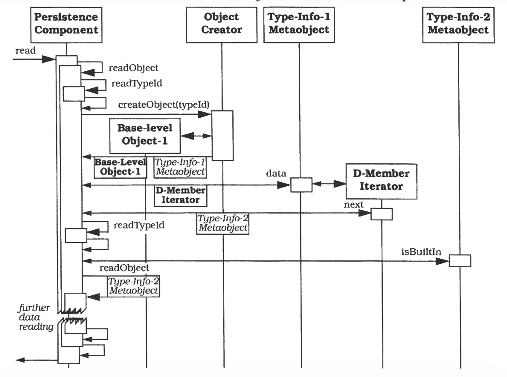
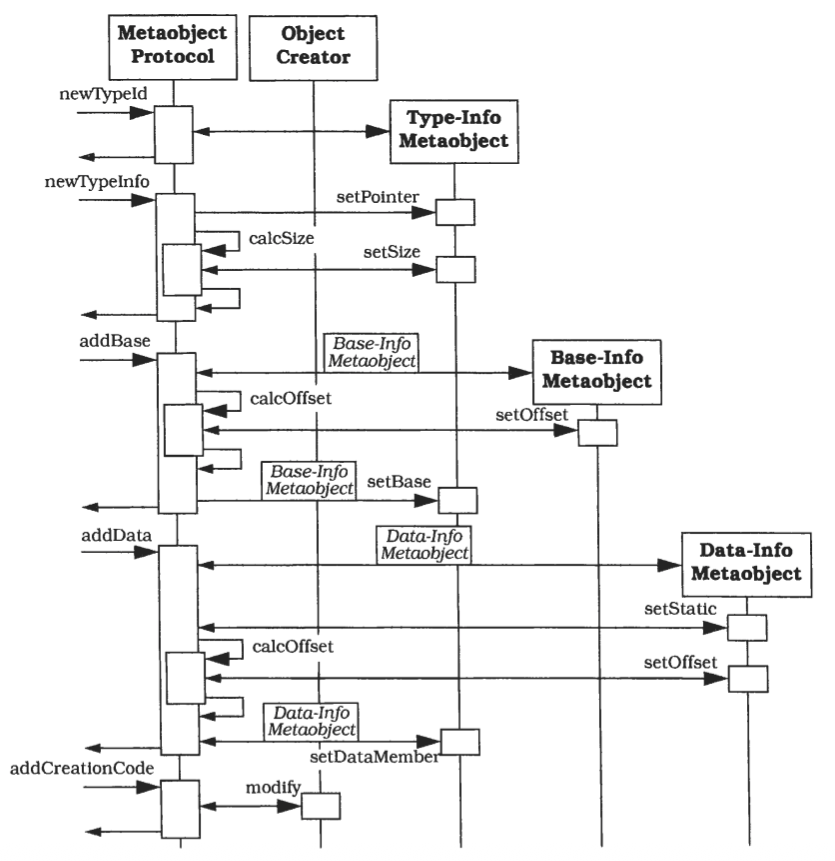

# 反射 (Reflection)

---
反射架构模式提供了一种动态改变软件系统结构与行为的机制。
它支持对基础层面的修改，例如类型结构和函数调用机制。
在该模式中，应用程序被划分为两部分：
**元层（meta level）**：提供有关选定系统属性的信息，使软件具备自我感知能力。
**基础层（base level）**：包含应用逻辑，其实现构建在元层之上。
对元层中所保存信息的修改，会影响后续基础层的行为。

---

## 也被称为 (Also Known As)
开放实现 (Open Implementation)、元层架构 (Meta-Level Architecture)

## 示例 (Example)
设想一个需要将对象写入磁盘并再次读取的 C++ 应用程序。
由于持久化并非 C++ 的内置特性，我们必须明确指定应用中每一种数据类型的存储与读取方式。
针对该问题的许多解决方案（例如实现特定类型的存储和读取方法）不仅成本高昂，而且容易出错。
举例来说，每当我们修改应用程序的类结构时，都必须同步修改这些方法。

</br>

针对持久化缺失问题的其他解决方案也会带来新的问题。
例如，我们可以为持久化对象提供一个特殊基类，应用程序类从该基类派生，并覆写继承的存储和读取方法。
类结构的变更要求我们修改现有应用程序类中的这些方法。
持久化与应用程序功能紧密耦合。

相反，我们希望开发一个独立于特定类型结构的持久化组件。
然而，若要存储和读取任意 C++ 对象，我们需要动态访问它们的内部结构。

## 上下文 (Context)
构建先天支持自身修改的系统

## 问题 (Problem)
软件系统会随时间不断演进。
它们必须能够接受修改，以适应不断变化的技术与需求。
预先设计一个能满足各种不同需求的系统可能是一项极为艰巨的任务。
更好的解决方案是定义一种易于修改和扩展的架构。
由此构建的系统可以按需适配不断变化的需求。
换言之，我们希望面向变化与演进进行设计。
该问题涉及多个驱动因素：

- 修改软件是一项枯燥乏味、容易出错且成本高昂的工作。
大范围的修改通常会涉及多个组件，即便只是对单个组件进行局部修改，也可能影响系统的其他部分。
每一处变更都必须谨慎实施并进行测试。
能够主动支持并管控自身修改的软件，其变更过程会更高效、更安全。

- 可适配的软件系统通常具有复杂的内部结构。
易发生变化的方面被封装在独立的组件中。
应用服务的实现分布在许多具有不同相互关系的小型组件之上 [GHJV95]。
为了保持此类系统的可维护性，我们倾向于向系统维护人员隐藏这种复杂性。

- 维持系统可变性所需的技术越多，例如参数化、子类化、混入 (mix-ins)，甚至是复制粘贴，其修改过程就会变得越笨拙、越复杂。
一种适用于所有类型变更的统一机制会更易于使用和理解。

- 变更可以是任何规模的，从为常用命令提供快捷方式，到为特定客户适配应用程序框架不等。

- 即便是软件系统的基本 (fundamental) 层面也可能发生变化，例如组件之间的通信机制。

## 解决方案 (Solution)
让软件具备自我感知能力，并使其结构和行为中选定的部分可被适配与修改。
这会形成一种分为两大主要部分的架构：元层 (meta level) 与基础层 (base level)。

元层提供软件的自我表示，使其具备关于自身结构和行为的认知，它由所谓的元对象 (metaobjects) 构成。
元对象封装并表示关于软件的信息，例如类型结构、算法，甚至函数调用机制。

基础层定义应用逻辑。
其实现通过使用元对象，来保持与那些可能发生变化的方面相互独立。
例如，基础层组件之间可以仅通过一个元对象进行通信，该元对象实现了特定的用户自定义函数调用机制。
修改此元对象即可改变基础层组件的通信方式，而无需修改基础层代码。

需要为操作元对象指定一种接口。
该接口被称为元对象协议（metaobject protocol, MOP），它允许客户端指定特定的变更，例如修改上文提到的函数调用机制元对象。
元对象协议本身负责检查变更规范的正确性，并执行变更。
通过元对象协议对元对象执行的任何操作，都会影响后续基础层的行为，正如函数调用机制示例中所展示的那样。

对于位于示例应用基础层的持久化组件，我们指定了提供运行时类型信息的元对象。
例如，要存储一个对象，我们必须知道其内部结构以及所有数据成员的布局。
借助这些可用信息，我们可以递归遍历任意给定的对象结构，将其分解为一系列内置类型。
持久化组件 “知道” 如何存储这些类型。
如果我们修改运行时类型信息，也就同时修改了存储方法的行为。
例如，不再具备持久化属性的类的对象将不再被存储。
对每个方法采用类似的策略，我们就可以构建一个能够读取和存储任意数据结构的持久化组件。

## 结构 (Structure)
元层由一组元对象构成。
每个元对象都封装了关于基础层的结构、行为或状态中某一选定方面的信息。这类信息有三个来源：

- 它可以由系统的运行时环境提供，例如 C++ 类型标识对象（DWP95）。
- 它可以是用户自定义的，例如上一节中的函数调用机制。
- 它可以在运行时从基础层获取，例如关于当前计算状态的信息。

<ins>所有元对象共同构成了应用程序的自表示（self-representation）。
元对象将那些原本仅隐式存在的信息变为显式可访问且可修改的内容</ins>。
几乎所有系统内部要素都可以通过这种方式来描述。
例如，在分布式系统中，可以存在用于提供基础层组件物理位置信息的元对象。
其他基础层组件可以利用这些元对象来判断其通信伙伴是本地的还是远程的，
并可以选择最高效的函数调用机制与之通信。
函数调用机制本身也可以由其他元对象提供。
更多示例包括类型结构、实时约束、进程间通信机制以及事务协议 (transaction protocols)。

然而，使用元对象所表示的内容取决于需要具备适应性的部分。
只有那些可能发生变化或因客户而异的系统细节才应由元对象进行封装。
在应用程序整个生命周期中预期保持稳定的系统方面则不应如此。「只应针对部分内容使用元对象」

元对象的接口允许基础层访问其维护的信息或提供的服务。
例如，提供分布式组件位置信息的元对象会提供相应函数，用于访问组件的名称与标识符、组件所在进程的信息，以及进程运行所在主机的信息。
实现函数调用机制的元对象会提供一种激活特定目标对象的特定函数的方法，包括输入与输出参数的传递。
元对象不允许基础层修改其内部状态，仅能通过元对象协议或其自身的计算来进行操作。

基础层使用元对象提供的信息和服务，例如组件的位置信息以及函数调用机制。
这使得基础层能够保持灵活性 —— 其代码独立于那些可能发生变更和适配的方面。
通过使用元对象的服务，基础层组件无需对通信伙伴的具体位置信息进行硬编码，它们会查询相应的元对象来获取此类信息。

基础层组件要么直接连接到其所依赖的元对象，要么通过专门的检索函数向这些元对象提交请求。
这些函数也属于元层的一部分。
如果基础层与元对象之间的关系相对静态，则优先采用第一种连接方式 (???)。
基础层组件始终查询同一个元对象，例如当某个对象需要自身的类型信息时。
如果基础层所使用的元对象会动态变化，则采用第二种连接方式，比如我们持久化组件中的存储过程场景。

</br>

元对象协议（MOP）作为元层的外部接口，使反射系统的实现以一种定义好的方式可访问。
元对象协议的客户可以是基础层组件、其他应用程序或有特权的用户，他们可以使用基础层指定对元对象或其关系的修改。
元对象协议本身负责执行这些更改。
这为反射应用提供了对自身修改的显式控制。

继续我们上面的例子，用户可以指定一种新的函数调用机制，用于基础层组件之间的通信。
第一步，用户向元对象协议提供这种新函数调用机制的代码。
随后，元对象协议执行变更。
例如，它可以通过生成一个合适的元对象（其中包含用户为新机制定义的代码）、编译所生成的元对象、将其与应用程序动态链接，并将所有对 “旧” 元对象的引用更新为 “新” 元对象来完成这一过程。

元对象协议（MOP）通常被设计为一个独立的组件。
这有助于实现可操作多个元对象的功能。
例如，修改封装了分布式组件位置信息的元对象，最终需要更新对应的函数调用机制元对象。
如果将此类变更的职责委托给元对象自身，就很难维持它们之间的一致性 (???)。
元对象协议能够更好地控制所执行的每一次修改，因为它是独立于元对象实现的。

</br>

为执行变更，元对象协议需要访问元对象的内部结构。
如果它还被授权修改基础层对象与元对象之间的连接，那么它也需要访问基础层组件。
提供这种访问权限的一种方式是允许元对象协议直接操作它们的内部状态。
另一种更安全但效率较低的方式是，元对象和基础层组件为自身的操作提供专门的接口，且仅允许元对象协议访问该接口。

由于基础层的实现明确建立在元对象所提供的信息和服务之上，因此对元对象的修改会对基础层后续的行为产生直接影响。
在我们的示例中，我们改变了基础层组件之间的通信方式。
然而，与传统的修改方式不同，此次系统变更并未修改基础层代码。

反射架构的整体结构与分层系统（31）非常相似。
元层和基础层是两个层次，各自提供自身的接口。
基础层定义了用于使用应用功能的用户接口，元层则定义了用于修改元对象的元对象协议。

</br>

然而，与分层架构不同的是，这两层之间存在相互依赖关系。
基础层构建于元层之上，反之亦然。
后者的一个例子是，当异常发生时元对象实现的行为被执行。
必须执行的异常处理过程类型通常取决于当前的计算状态。
元层从基础层获取该信息，且通常是从与提供被中断服务不同的组件中获取。
在纯分层架构中，层与层之间的这种双向依赖是不允许的，每一层仅依赖于其下方的层。

以我们的持久化组件示例为例，我们指定了元对象，这些元对象提供对应用类型结构的自省访问 (introspective) —— 也就是说，它们可以访问有关应用结构或行为的信息，但不能对其进行修改。
我们可以获取给定类型或对象的名称、大小、数据成员以及父类信息。
另一个元对象指定了一个函数，该函数允许客户端实例化任意类型的对象。
例如，当从数据文件中恢复对象结构时，我们会使用此函数。
元对象协议包含用于添加新的运行时类型信息以及修改现有运行时类型信息的函数。

持久化组件的主体与应用程序的具体类型结构无关。
例如，存储过程仅实现通用算法，用于将给定的对象结构递归分解为一系列内置类型。
如果需要有关用户自定义类型内部结构的信息，它会查询元层。
具有内置类型的数据成员会被直接存储，所有其他数据成员则会被进一步分解。

## 动态 (Dynamics)
通常几乎不可能一般性地描述反射系统的动态行为。
因此，我们基于持久化组件示例给出两种场景。
有关所涉及的元对象协议和元对象的详细信息，请参见实现部分。

**场景一** 展示了从磁盘文件中读取已存储对象时，基础层与元层之间的协作过程。
所有数据按合适的顺序存储，每个对象前都带有一个类型标识符 (type identifier)。
该场景进一步对特殊情况进行了抽象，例如读取字符串、静态成员以及恢复对象结构中的循环引用等。
本场景分为六个阶段：

- 用户希望读取已存储的对象。
该请求被转发至持久化组件的 `read()` 过程，并附带存储对象的数据文件名称。

- `read()` 过程打开数据文件，并调用内部的 `readobject()` 过程，该过程读取第一个类型标识符。

- `readObject()` 过程调用负责对象创建的元对象。
该 “对象创建器 (creator)” 元对象对先前确定的类型实例化一个 “空” 对象，
并返回该对象的句柄以及对应运行时类型信息（RTTI）元对象的句柄。

- `readObject()` 过程向其对应的元对象请求一个迭代器，用于遍历待读取对象的数据成员。
该过程遍历对象的所有数据成员。

- `readObject()` 过程读取下一个数据成员的类型标识符。
如果该类型标识符表示内置类型（此情况不作示例说明），`readObject()` 过程会根据数据成员在对象中的大小和偏移量，直接将文件中的下一个数据项赋值给该数据成员。
否则，将递归调用 `readObject()`。
如果该数据成员是指针，递归会从创建一个 “空” 对象开始；
如果不是指针，则递归调用的 `readObject()` 会在包含该数据成员的现有对象布局上进行操作。

- 读取数据后，`read()` 过程关闭数据文件，并将新对象返回给发出请求的客户端。

</br>

**场景二** 展示了在向元层添加类型信息时元对象协议的使用方法。
假设应用程序所使用的类库更新到了包含新类型的新版本。
为了能够存储和读取这些类型，我们必须通过新增元对象来扩展元层。
添加此类信息可由用户执行，或通过工具自动完成。
为简化起见，我们将实现部分中规定的 `type-info` 类与 `extTypeInfo` 类合并。
本场景分为六个阶段，针对每个新类型依次执行：

- 客户端调用元对象协议，为应用程序中的新类型指定运行时类型信息。
类型名称作为参数传入。

- 元对象协议为此类型创建一个 `type-info` 类的元对象，该元对象同时也作为类型标识符。

- 客户端调用元对象协议以添加扩展类型信息。
这包括设置该类型的大小、是否为指针类型，以及它与其他类型的继承关系。
为处理继承关系，元对象协议会创建 `baseInfo` 类的元对象。
这些元对象维护着指向特定基类的 `type-info` 对象的句柄，以及该基类在新类型中的偏移量。

- 下一步，客户端指定新类型的内部结构。
元对象协议获取每个数据成员的名称和类型。
元对象协议为每个数据成员创建一个 `dataInfo` 类的对象。
该对象维护着指向成员类型的 `type-info` 对象的句柄、其名称，以及该成员是否为静态数据成员。
如果是静态数据成员，`dataInfo` 对象还保存其绝对地址；
否则保存该成员在新类型中的偏移量。

- 客户端调用元对象协议，对那些将新类型作为数据成员的现有类型进行修改。
并为每个类型添加相应的数据成员信息。
由于该步骤与上一步骤非常相似，因此我们不在后续的对象消息序列图中对此进行展示。

- 最后，客户端调用元对象协议来适配 “对象创建器” 元对象。
持久化组件在读取持久化数据时必须能够实例化该新类型的对象。
元对象协议基于此前添加的类型信息，自动生成用于创建新类型对象的代码。
它还将新生成的代码与 “对象创建器” 元对象的现有实现进行整合，编译修改后的实现，并将其与应用程序进行链接。

</br>

## 实现 (Implementation)

以下准则有助于实现反射架构。
如有必要，可遍历任意子序列 (???)。

### 1. 定义应用程序模型
分析问题领域并将其分解为合适的软件结构。 回答以下问题：

- 软件应提供哪些服务？
- 哪些组件可以实现这些服务？
- 组件之间存在哪些关系？
- 组件之间如何协作？
- 组件操作哪些数据？
- 用户将如何与软件交互？

在指定模型时应采用合适的分析方法。

我们 C++磁盘存储示例中的持久化组件是仓库管理应用程序的一部分 [Coad95]。
我们识别出表示物理存储的组件，如仓库、通道和仓位。
我们还识别出订单和物品相关的组件。
系统要求在崩溃后能够以有效状态恢复计算。
因此，仓库的物理结构及其当前物品存储情况都必须实现持久化。
我们需要两个组件来实现这一点：
持久化组件提供对象的存储和读取功能；
文件处理器 (handler) 负责文件的锁定、打开、关闭、解锁、删除以及数据的读写操作。

### 2. 识别可变行为
分析上一步构建的模型，确定应用服务中哪些可能发生变化、哪些保持稳定。
目前没有通用规则来界定系统中哪些部分可以变更。
某个方面是否可变取决于诸多因素，例如应用领域、应用运行环境及其客户与用户。
在一个系统中可能变化的方面，在其他系统中可能保持稳定。
以下是通常会发生变化的系统方面示例：

- 实时约束 [HT92]，如截止时间 (deadlines)、时间栅栏 (time-fence) 协议以及用于检测截止时间错过的算法。
- 事务协议 [SW95]，例如会计系统中的乐观与悲观事务控制。
- 进程间通信机制 [CM93]，如远程过程调用和共享内存。
- 异常情况下的行为 [EKM+94]、[HT92]，例如实时系统中对截止时间错过的处理。
- 应用服务算法 [EKM+94]，如特定国家的增值税 (VAT) 计算。

开放实现分析与设计方法 (The Open Implementation Analysis and Design Method) [mLM95] 有助于此步骤。

为简化持久化组件示例，我们不考虑对应用行为进行适配。

### 3. 识别系统的结构
识别系统的结构方面，这些方面在发生变化时不应影响基础层的实现。
例如包括应用程序的类型结构 (type structure) [BKSP92]、其底层对象模型 [McA95]，或是在异构网络中组件的分布 [McA95]。

我们对持久化组件的实现必须独立于特定于应用的类型。
这就要求能够访问运行时类型信息，例如每种类型的名称、大小、继承关系和内部布局，以及其数据成员的类型、顺序和名称。

### 4. 识别系统服务 
识别能够同时支持 [步骤 2](#2-识别可变行为) 中确定的应用服务可变性，以及 [步骤 3](3-识别系统的结构) 中确定的结构细节独立性。
例如，在 C++ 中实现可恢复异常需要显式访问语言的异常处理机制。
其他基础 (basic) 系统服务示例包括：

- 资源分配
- 垃圾回收
- 页面交换
- 对象创建

持久化组件在读取持久化对象时，必须能够实例化任意类。

### 5. 定义元对象
针对前面三个步骤所确定的每个方面，定义合适的元对象。
若干与领域无关的设计模式可支持行为封装，例如对象化模式（Objectifier）[Zim94]、策略模式（Strategy）、桥接模式（Bridge）、访问者模式（Visitor）以及抽象工厂模式（Abstract Factory）[GHJV95]。
例如，函数调用机制的元对象可作为策略对象实现，而组件的多种实现可采用桥接模式实现。
访问者模式允许在不修改现有结构的前提下集成新功能。
有时你还可以找到合适的领域特定模式来支持此步骤，例如用于开发分布式系统的接收器模式（Acceptor）与连接器模式（Connector）[Sch95]。
另一个例子是可分离检查器模式（Detachable Inspector）[SC95a]，它支持添加调试器和检查器等运行时工具。
可分离检查器模式（Detachable Inspector）基于访问者模式（Visitor）构建。
对象化模式（Objectifier）[Zim94]和状态模式（State）[GHJV95]等设计模式可支持结构与状态信息的封装。「喔，这么多模式可用于定义元对象」

为我们的持久化组件提供运行时类型信息的元对象，其组织方式如下：

C++ 标准库类 `type-info` 用于标识类型 [DWP95]。
其接口提供了用于访问类型名称、比较两种类型，以及确定它们在系统内部排序的函数。
应用程序中的每一种类型都由 `type-info` 类的一个实例来表示。

```cpp
class type_info {
  //...
private:
  type_info (const type_info& rhs) ;
  type_info& operator(const type_info& rhs);
public:
  virtual   ~type_info();
  int       operator==(const type_info& rhs) const;
  int       operator!=(const type_info& rhs) const;
  int       before(const type_info& rhs) const;
  const char* name() const;
}:
```

运行时类型信息系统的其他类均不属于 C++ 标准的一部分。

`extTypeInfo` 类提供对类的大小、父类以及数据成员信息的访问。
客户端还可以判断该类型是内置类型还是指针类型。

```cpp
class extTypeInfo {
  // ...
public:
  const bool    isBuiltIn () const ;
  const bool    isPointer() const;
  const size_t  size() const;
  baseIter*     bases(int direct = 0) const;
  dataIter*     data(int direct = 0) const;
};
```

方法 `bases()` 返回一个 `baseIter` 类的对象，该迭代器可用于遍历指定类型的所有基类，或仅遍历其直接基类。
如果该类型是内置类型 (built-in)，则此方法返回一个空迭代器 (NULL iterator)。
与此类似，方法 `data()` 返回一个 `dataIter` 类的对象。
该迭代器可用于遍历指定类型的所有数据成员（包含继承而来的成员），或仅遍历专门为该类型声明的数据成员。
如果该类型是内置类型 (built-in)，则此方法返回一个空迭代器 (NULL iterator)。

`BaseInfo` 类提供用于访问某个类的基类的类型信息，以及确定该基类在类布局中的偏移量的函数。

```cpp
class BaseInfo {
  // ...
public:
  const type_info*  type() const;
  const long        offset() const;
};
```

`DataInfo` 类包含用于返回数据成员名称、其偏移量以及关联的 `type_info` 对象的函数。

```cpp
class DataInfo {
  // ...
public:
  const char*       name() cons t ;
  const type_info*  type() const;
  const bool        isStatic() const;
  const long        offset() const;
  const long        address() const;
};
```

### 6 定义元对象协议
支持对元层进行明确且可控的修改与扩展，同时也支持对基础层组件与元对象之间关系的修改。

实现元对象协议有两种方案：
- 将其与元对象集成。每个元对象提供作用于自身的元对象协议功能。
- 将元对象协议作为独立组件实现。

后一种方案的优势在于，对反射应用的所有修改控制都集中在一个中心点。
对多个元对象进行操作的函数更容易实现。
此外，如果独立组件的实现遵循外观模式（Facade）[GHJV95] 或整体-部分模式（Whole-Part）(225)等模式，该组件还可以保护元对象免受未授权访问和修改。
单例惯用法（Singleton idiom）[GHJV95] 有助于确保元对象协议只能被实例化一次。

如果作为独立组件实现，元对象协议通常不会作为定义元对象的类的基类 —— 它仅对这些元对象进行操作。
只有当元对象协议适用于所有元对象时，将其指定为派生具体元对象类的基类才有意义。

我们提供一个 `MOP` 类，它为我们持久化组件示例中的元层定义了元对象协议。
该类以单例模式实现，并直接操作上一步中声明的所有类的内部结构。

类型信息可通过两个函数访问。

```cpp
const type_info* getInfo(char* typeName) const;
const extTypeInfo* getExtInfo(char* typeName) const;
```

第一个函数允许客户端访问对象的标准类型信息。
第二个函数访问我们专门为运行时类型信息系统定义的扩展类型信息。
我们需要这个函数，因为标准类 `type_info` 的对象不提供对用户定义信息的访问。
所有其他类型信息（例如关于基类的信息）都可通过 `extTypeInfo` 对象访问。

可以通过两个函数初始化新的类型信息元对象，一个用于实例化 `type_info` 对象，另一个用于创建 `extTypeInfo` 对象。

```cpp
void newTypeId (char* typeName);
void newTypeInfo (char* typeName, bool builtIn, bool pointer);
```

`newTypeInfo()` 函数还会计算并设置一个类型的大小。
`deleteTypeInfo()` 函数会删除某个类型的所有可用信息，但仅当系统中没有其他类持有对该类型对象的引用时才会执行删除操作。

```cpp
void deleteInfo(char* typeName);
```

我们定义了四个函数用于添加新的类型信息或修改已有的类型信息。
函数 `addBase()` 和 `deleteBase()` 分别用于添加和移除基类信息，而函数 `addData()` 和 `deleteData()` 分别用于添加和删除数据成员信息。

```cpp
void addBase(char* typeName, char* baseName); 
void addData(char* typeName, char* memberType,char* memberName);
void deleteBase(char* typeName, char* baseName);
void deleteData (char* typeName, char* memberName) ;
```

在执行修改之前，所有函数都会进行一致性检查。
例如，要设置基类信息，对应的 `type_info` 和 `extTypeInfo` 对象必须存在。

有两个函数支持对 “对象创建器” 元对象进行修改。

```cpp
void addCreationCode(char* typeName);
void deleteCreationCode(char* typeName);
```

在内部，元对象协议需要一些函数来计算类型大小、基类偏移量以及数据成员偏移量。
这些函数与编译器相关，因此在使用不同编译器时必须进行修改。
策略模式（Strategy）[GHJV95] 提供了一种支持修改这些函数的方法。
为了维护 `type_info` 和 `extTypeInfo` 对象，元对象协议维护了两个映射表 (maps)：`tMap` 和 `eMap`。
这些映射表 (maps) 提供了添加、移除和查找元素的函数。

元对象协议的大多数函数都可以直接实现。
计算偏移量和大小，以及操作 “对象创建器” 元对象需要投入更多的实现工作量。
以下代码定义了 `addBase()` 函数。

```cpp
void MOP::addBase(char* typeName, char* baseName) {
  BaseInfo* base;
  // Is extended type information for type typeName
  // and type information for type baseName available?
  if (( !eMap.element(typeName)) ||
                          (!tMap.element(baseName)))
      // errorhandling ...
  // Instantiate the baseInfo object for type baseName
  base = new BaseInfo(tMap[baseName]) ;
  // Calculate the offset of the base class.
  base->baseoffset = calc0ffset(typeName, baseName);
  // Add the new baseInfo object to the list of
  // bases within the extTypeInfo object for 
  // type typeName
  eMap [typeName]->baseList.add (base);
}
```

实现元对象协议时，健壮性 (robustness) 是一个主要关注点。
应尽可能检测变更规范中的错误，变更也应具备可靠性。
例如，上述元对象协议在添加新的基类和数据成员信息时，会检查相应类型信息元对象是否可用；
在删除其类型信息之前，还会检查某个类型是否被用作基类或数据成员。

健壮性 (robustness) 还意味着保持一致性。
例如，如果我们为某个特定类型添加数据成员，就必须重新计算所有将该变更类型作为基类或数据成员的类型的大小。
此外，任何修改都应只影响系统中需要变更的部分。
最后，元对象协议的客户端不应承担将变更集成到元层的责任。
理想情况下，客户端只需指定变更，而元对象协议负责其集成工作。
这避免了对源代码的直接操作。

### 7 定义基础层级
根据 [步骤 1](#1-定义应用程序模型) 所建立的分析模型，实现系统的功能核心与用户界面。

使用元对象来保持基础层的可扩展性与适应性。
将每个基础层组件与元对象相连，元对象提供它们所依赖的系统信息（如类型信息），或提供它们所需的服务（如持久化组件中的对象创建）。
为处理 (handle) 系统服务，可采用设计模式，如策略模式（Strategy）、访问者模式（Visitor）、抽象工厂模式（Abstract Factory）和桥接模式（Bridge）[GHJV95] ，或诸如信封-字母（Envelope-Letter）[Cope92] 之类的惯用技法。
例如，策略模式（Strategy）中的上下文类组件代表基础层组件，而策略类层次结构则对应元对象。
应用访问者模式（Visitor）时，元对象即为访问者，对象结构则代表基础层组件。

为基础层组件提供用于维护其与关联元对象之间关系的功能。
元对象协议必须能够修改基础层与元层之间的每一种关系。
例如，当用新元对象替换某一元对象时，元对象协议必须更新对被替换元对象的所有引用。
元对象协议既可直接操作基础层组件的内部数据结构，也可使用基础层组件提供的专用接口。

如果待使用的元对象无法预先获知，则为元层或元对象协议提供合适的检索函数，例如持久化组件示例中的 `getInfo()` 和 `getExtInfo()` 函数。

元对象通常需要有关当前计算状态的信息。
例如，我们持久化组件示例中的 “对象创建器” 必须知道它应实例化的类型。
此类信息既可以作为参数传递给元对象，也可以由元对象从其他元对象中获取，或者由元对象从相应的基础层组件中获取。

对元对象的修改会影响与其相连的基础层组件的后续行为。
改变基础层与元层之间的某一关系，仅会影响维护该被修改关系的特定基础层组件。

我们持久化组件的 `read()` 方法实现遵循 [动态部分](#动态-dynamics) 所描述的第一种场景。
该方法实现了一个通用递归算法，用于从数据文件中读取对象。
方法会查询元层以获取如何读取用户自定义类型的信息。
读取内置类型或字符串的逻辑在其实现中采用硬编码方式。
为获取类型相关信息，`read()` 会调用元对象协议中的 `getInfo()` 和 `getExtInfo()` 函数。
为创建任意类型的对象，`read()` 直接与 “对象创建器” 元对象相连。

`store()` 方法的结构与 `read()` 方法相似。
它首先打开待写入的数据文件，随后调用内部的 `storeObject()` 方法来存储对象结构。
最后，`store()` 方法关闭该数据文件。

实现 `store()` 方法最具挑战性的部分，是检测待存储对象结构中的循环引用 —— 必须避免重复存储对象和陷入无限递归。
为实现这一点，该方法会在存储对象前，用一个唯一标识符标记对象结构，同时将该标识符一并存储。
如果再次访问到已被标记的对象，只需存储它的标识符即可。

下面是**标准简体中文翻译**（专业技术文档风格）：

下面的简化代码展示了 `storeObject()` 方法的结构。
该代码省略了若干实现细节，例如静态数据成员的存储。

```cpp
void Persistence::storeObject (void* object, char* typeName) {
  type_info*    objectId;
  extTypeInfo*  objectInfo;
  baseIter*     iterator;
  
  // Get type information about the object to be stored
  objectId    = mop->getInfo(typeName);
  objectInfo  = mop->getExtInfo(typeName);
  iterator    = objectInfo->data(); 

  // Mark the object to avoid storing duplicates
  markobject (object);

  // Object is of built-in type?
  if (objectInfo->isBuiltIn())
      storeBuiltIn (object, objectId) ;

  // Object is of type char*?
  else if (!strcrnp("char*", objectId->name()))
      storeString(object);

  // Object is a pointer ! = NULL?
  // *(char**)object means that we interpret the
  // generic pointer object as a pointer to an address
  else if ((objectInfo->isPointer()) &&
                          (!(*(char**)object))) 
      // Dereference the pointer
      storeObject(*(char**)object, iterator->curr()->type()->name());

  // Object is a user-defined type with data members
  else while (!iterator->atEnd()) {
      // If not marked, store the data member, 
      // else store the marker
      if (!marked((char*)object + iterator->currO->offset()))
          storeObject((char*)object +
              iterator->curr()->offset(),
              iterator->curr()->type()->name()) ;
      else
          storeMarker ((char*)object +
              iterator->cur()->offset()) ;

      iterator->next();
  };
  delete iterator;
};
```

## 示例解析 (Example Resolved)
在前面的章节中，我们讲解了持久化组件示例的反射架构。
但我们如何提供运行时类型信息，这仍然是一个有待解决的问题。

与 CLOS (Common Lisp Object System)、Smalltalk 这类语言不同，C++ 对反射的支持并不完善 —— 只有标准的 `type_info` 类提供了反射能力：
我们仅能识别和对比类型。
一种提供扩展类型信息的解决方案是在编译流程中加入一个专用步骤。
通过该步骤，我们从应用程序的源文件中收集类型信息，生成用于实例化元对象的代码，并将这段代码与应用程序进行链接。
同理，“对象创建器” 元对象也是通过这种方式生成的。
用户需要为每种类型编写实例化 “空对象” 的代码，工具包则会生成元对象的对应代码。
系统的部分模块依赖于具体编译器，例如偏移量和大小的计算。

如代码示例所示，我们使用指针与地址运算、偏移量，以及类型和数据成员的大小来读取和存储对象。
由于这些特性被认为存在风险（例如可能引发覆盖目标代码的危险），因此必须非常谨慎地实现和测试该持久化组件。

## 变体 (Variants)
*具有多个元层级的反射*。
元对象之间有时存在依赖关系。
例如以持久化组件为例，修改某一特定类型的运行时类型信息时，需要更新 “对象创建器” 元对象。
为协调此类变更，你可以引入独立的元对象，并在概念上为元层增设一个元层，换言之，即元元层。
理论上，这会形成无限的反射层级塔 (tower of reflection)。
这类软件系统拥有无限数量的元层，其中每个元层都由更高层级的元层控制，且每个元层都具备自身的元对象协议。
而在实际应用中，大多数现有的反射软件仅包含一层或两层元层。

一种具有多个元层的编程语言示例是 RbCl [IMY92]。
RbCl 是一门解释型语言。
RbCl 的基础层对象由多个元层对象表示。
这些对象由位于 RbCl 元元层的解释器进行解释执行。
RbCl 的元对象协议允许用户修改表示 RbCl 基础层对象的元对象，而元元层的元对象协议则控制 RbCl 元对象解释器的行为。

## 已知应用 (Known Uses)

### CLOS
这是反射式编程语言的经典范例 [Kee89]。
在CLOS中，为对象定义的操作被称为 *泛化函数 (generic functions)，其处理过程称为 *泛化函数调用*。
泛化函数调用分为三个阶段：

- 系统首先确定适用于给定调用的方法。

- 随后按照优先级从高到低对适用方法进行排序。

- 最后，系统对适用方法列表进行执行排序。
注意，在 CLOS 中，针对一次给定的调用可以执行多个方法。

泛化函数调用的过程在 CLOS 的元对象协议中定义 [KRB91]。
从根本上说，它执行一系列特定顺序的元层泛化函数。
通过 CLOS 元对象协议，用户可以通过修改这些泛化函数或它们所调用的元对象的泛化函数，来改变应用程序的行为。

### MIP
MIP [BKSP92] 是面向 C++ 的运行时类型信息系统。
它主要用于对应用程序的类型系统进行自省式访问。
C++ 软件系统中的每一种类型都由一组元对象表示，这些元对象提供该类型的通用信息、它与其他类型的关系及其内部结构。
所有信息在运行时均可访问。
MIP 的功能被划分为四个层次：

- 第一层包含支持软件识别和比较类型的信息与功能。
该层对应 C++ 的标准运行时类型识别机制 [SL92]。

- 第二层提供关于应用程序类型系统的更详细信息。
例如，客户端可以获取类的继承关系信息，或是其数据成员与函数成员的信息。
这些信息可用于浏览类型结构。

- 第三层提供数据成员的相对地址信息，并提供用于创建用户自定义类型的 “空对象” 的函数。
结合第二层，该层支持对象的输入输出 (I/O)。

- 第四层提供完整的类型信息，例如类的友元、数据成员的访问权限，以及成员函数的参数类型和返回类型等。
该层支持开发灵活的进程间通信机制，或开发诸如检视器这类需要应用程序类型结构详细信息的工具。

MIP 的元对象协议允许你指定和修改提供运行时类型信息的元对象。
它为 MIP 功能的每一层都提供了相应的函数。

MIP 以一组库类的形式实现。
它还包含一个工具集，用于收集应用程序的类型信息，并生成用于实例化对应元对象的代码。
该代码会链接到使用 MIP 的应用程序中，并在主 (main) 程序开始时执行。
该工具集可以与 C++ 应用程序的 “标准” 编译过程集成。
一个专用接口允许用户为每个单独的类或类型调整可用的类型信息粒度。

### PGen
PGen [THP94] 是一个基于 MIP 的 C++ 持久化组件。
它允许应用程序存储和读取任意的 C++ 对象结构。

用于解释反射模式的示例主要基于 MIP 和 PGen。
尽管经过简化，但对持久化组件、元对象的类声明以及元对象协议的描述，在很大程度上反映了 MIP 和 PGen 的原始结构。

### NEDIS
汽车经销商系统 NEDIS（Ste95）利用反射来支持其适配客户与国家特定需求的能力。
NEDIS 包含一个名为 *运行时数据字典 (run-time data dictionary)* 的元层。它提供以下服务与系统信息：

- 类的特定属性的特性，例如其允许的取值范围。

- 用于检查属性值是否符合其必需属性的函数。
NEDIS 使用这些函数来评估用户输入，例如验证日期是否合法。

- 类属性的默认值，用于初始化新对象。

- 指定系统在发生错误时行为的函数，例如输入无效或属性出现意外的`null`值。

- 特定国家的功能，例如用于税费计算。

- 关于软件 “观感” 的信息，例如输入掩码的布局或用户界面中使用的语言。

运行时数据字典以持久化数据库的形式实现。
一个专用接口允许用户修改它所提供的任何信息或服务。
每当运行时数据字典发生变更时，专用工具会检查并最终恢复其一致性。
运行时数据字典在软件启动时加载。
出于安全考虑，在 NEDIS 运行期间无法对其进行修改。

### OLE 2.0
OLE (Object Linking and Embedding) 2.0 [Bro94] 提供了用于暴露和访问 OLE 对象及其接口的类型信息的功能。
该信息可用于动态访问 OLE 对象的结构信息，并创建对 OLE 接口的调用。
例如，Visual Basic [Mic95] 的运行时环境在动态调用对象之前会检查方法调用的正确性。
CORBA [OMG92] 中也规定了类似的概念。

其他采用反射架构的语言与系统实例还包括 Open C++ [CM93]、RbCl [IMY92]、AL-1/D [OIT92]、R2 [IHT92]、Apertos [Kok92] 以及 CodA [McA95]。
更多实例可参见 [IMSA92]，但需要注意的是，尽管所有这些实例都提供了反射功能，但并非全部都真正实现了本模式所描述的反射架构。

## 效果 (Consequences)
反射架构具有以下 **优点** ：

*无需显式修改源代码*。
在对反射系统进行修改时，你无需改动现有代码。
取而代之的是，通过调用元对象协议的函数来指定变更。
在扩展软件时，你将新代码作为元对象协议的参数传递给元层。
元对象协议本身负责整合你的变更请求：
它对元层代码进行修改和扩展，并在必要时重新编译已变更部分，且在应用程序运行过程中将其链接到应用中。

*软件系统的修改变得简便* 。
元对象协议为软件修改提供了安全且统一的机制。
它向用户隐藏了所有特定技术，例如访问者模式、工厂模式和策略模式的使用。
它还隐藏了可变更应用程序的内部复杂性。
用户无需接触封装特定系统方面的众多元对象。
元对象协议还会管控每一次修改。
设计良好且健壮的元对象协议，有助于避免对应用程序基本语义造成非预期的修改 [Kic92]。

*支持多种类型的修改* 。
元对象可以封装系统行为、状态和结构的各个方面。
因此，基于反射模式的架构潜在地支持几乎任何类型或规模的修改。
甚至系统的基础层面也可以被修改，例如函数调用机制或类型结构。
借助反射技术，还可以使软件适配环境的特定需求，或集成客户定制化的需求。

然而，反射架构也存在一些显著的 **缺陷** ：

*元层的修改可能会造成破坏* 。
即使是最安全的元对象协议，也无法阻止用户指定不正确的修改。
此类修改可能会对软件或其环境造成严重破坏。
危险修改的示例包括：在不暂停应用程序中使用数据库 schema 对象的执行的情况下更改数据库 schema，或者向元对象协议传入包含语义错误的代码。
同样，指针运算中的错误也可能导致目标代码被覆盖。

因此，元对象协议的健壮性至关重要 [Kic92]。
变更规范中潜在的错误应在执行变更前被检测出来。
每次变更对软件其他部分的影响都应是有限的。

*组件数量增加* 。
反射软件系统中可能出现元对象数量多于基础层组件的情况。
在元层封装的系统方面越多，元对象的数量也就越多。

*效率降低*。
反射软件系统通常比非反射系统运行更慢。
这是由基础层与元层之间复杂的关联关系导致的。
每当基础层无法确定如何继续执行计算时，它都会向元层请求协助。
这种反射能力需要额外的处理开销：信息检索、元对象修改、一致性检查，以及两层之间的通信，都会降低系统的整体性能。
你可以通过优化技术在一定程度上减少这种性能损耗，例如在编译系统时将元层代码直接注入到基础层中。

*并非所有对软件的潜在修改都能得到支持* 。
尽管反射架构有助于开发可变更的软件，但它仅支持通过元对象协议执行的修改。
因此，无法轻松集成对应用程序的所有未预见变更，例如对基础层代码的修改或扩展。

*并非所有语言都支持反射* 。
反射架构在某些语言中难以实现，例如 C++，它对反射几乎不提供支持或完全不支持。
C++ 仅提供类型识别功能。
C++ 中的反射应用程序通常依托指针运算等语言构造来处理任意对象，并且需要工具支持以动态修改元层代码。
然而，这一过程繁琐且容易出错。
在这类语言中，也无法充分发挥反射的全部能力，例如动态为类添加新方法。
不过，即使在不具备反射能力的语言中，也可以构建可修改、可扩展的反射系统，例如 C++ 系统 NEDIS [EKM+94]、MIP [BKSP92] 和 Open C++ [CM93]。

## 参见 (See Also)
微内核架构模式（171）通过提供一种机制来支持适配与变更，该机制可利用附加功能或客户特定功能对软件进行扩展。
此架构的核心组件 ——微内核—— 充当插槽 (socket) 的角色，用于插入此类扩展并协调它们之间的协作。
可通过替换这些 “可插拔 (pluggable)” 部件来实现修改。

该模式的早期版本发表于 [PLoP95]。

## 致谢 (Credits)
关于反射的早期研究成果之一是 Brian Cantwell Smith 的博士论文 [Smi82]，该论文在过程式语言的背景下阐述了反射理论。
反射概念的综述可参阅 [Mae87]。

感谢 PLoP'95 第一工作组 (PloP'95 Working Group 1) 的成员，他们为本模式早期版本提出了宝贵的批评意见与改进建议，尤其感谢 Douglas C. Schmidt 与 Aarnod Sane 。
同时特别致谢 AG Communication Systems 的 Linda Rising 、David E. DeLano，以及 University of Illinois at Urbana Champaign 的 Brian Foote 与 Ralph Johnson 。
他们对本模式早期版本的细致评审，助力形成了最终的描述内容。
