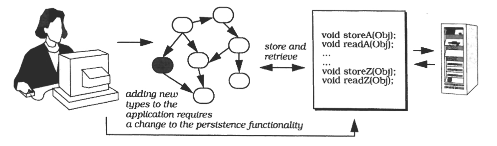

# 反射 (Reflection)

---
反射架构模式提供了一种动态改变软件系统结构与行为的机制。
它支持对基础层面的修改，例如类型结构和函数调用机制。
在该模式中，应用程序被划分为两部分：
**元层（meta level）**：提供有关选定系统属性的信息，使软件具备自我感知能力。
**基础层（base level）**：包含应用逻辑，其实现构建在元层之上。
对元层中所保存信息的修改，会影响后续基础层的行为。

---

## 也被称为 (Also Known As)
开放实现 (Open Implementation)、元层架构 (Meta-Level Architecture)

## 示例 (Example)
设想一个需要将对象写入磁盘并再次读取的 C++ 应用程序。
由于持久化并非 C++ 的内置特性，我们必须明确指定应用中每一种数据类型的存储与读取方式。
针对该问题的许多解决方案（例如实现特定类型的存储和读取方法）不仅成本高昂，而且容易出错。
举例来说，每当我们修改应用程序的类结构时，都必须同步修改这些方法。

 

针对持久化缺失问题的其他解决方案也会带来新的问题。
例如，我们可以为持久化对象提供一个特殊基类，应用程序类从该基类派生，并覆写继承的存储和读取方法。
类结构的变更要求我们修改现有应用程序类中的这些方法。
持久化与应用程序功能紧密耦合。

相反，我们希望开发一个独立于特定类型结构的持久化组件。
然而，若要存储和读取任意 C++ 对象，我们需要动态访问它们的内部结构。

## 上下文 (Context)
构建先天支持自身修改的系统

## 问题 (Problem)
软件系统会随时间不断演进。
它们必须能够接受修改，以适应不断变化的技术与需求。
预先设计一个能满足各种不同需求的系统可能是一项极为艰巨的任务。
更好的解决方案是定义一种易于修改和扩展的架构。
由此构建的系统可以按需适配不断变化的需求。
换言之，我们希望面向变化与演进进行设计。
该问题涉及多个驱动因素：

