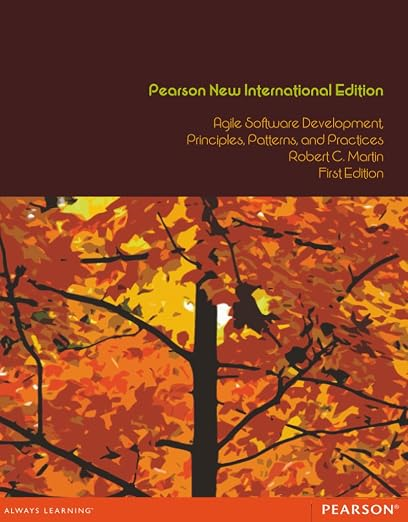

# 敏捷软件开发：原则、模式与实践

 

## 目录

* [第 1 部分 敏捷开发](section1.md)
  - [1 敏捷实践](ch1/0.md)
  - [2 极限编程概述](ch2/0.md)
  - [3 规划](ch3/0.md)
  - [4 测试](ch4/0.md)
  - [5 重构](ch5/0.md)
* [第 2 部分 敏捷设计](section2.md)
  - [7 什么是敏捷设计？](ch7/0.md)
  - [8 SRP：单一职责原则](ch8/0.md)
  - [9 OCP：开闭原则](ch9/0.md)
  - [10 LSP：里氏替换原则](ch10/0.md)
  - [11 DIP：依赖反转原则](ch11/0.md)
  - [12 ISP：接口隔离原则](ch12/0.md)
* [第 3 部分 薪资案例研究](section3.md)
  - [13 COMMAND 与 ACTIVE OBJECT](ch13/0.md)
  - [14 TEMPLATE METHOD & STRATEGY: 继承与委托](ch14/0.md)
