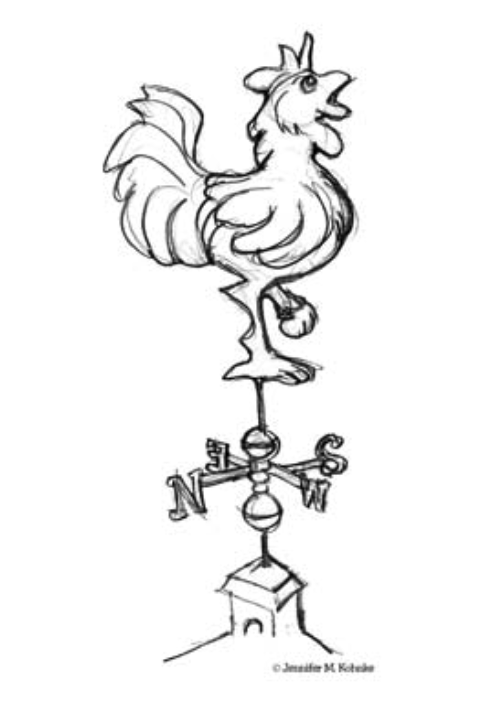

# 1 敏捷实践

<center></center><br/>

> 教堂尖顶上的风向标，虽然是铁制的，但如果它不懂得向每一阵风转动的崇高艺术，很快就会被暴风折断。
> <p align="right">——Heinrich Heine

我们中的许多人都经历过一个没有实践指导的项目的噩梦。
缺乏有效的实践会导致不可预测性、重复错误和浪费精力。
客户对进度延迟、预算增长和质量低劣感到失望。
开发人员因工作时间越来越长、产出越来越差的软件而灰心。

一旦我们经历过这样的惨败，我们就会害怕重蹈覆辙。
我们的恐惧驱使我们创建一个过程来约束我们的活动，并要求特定的输出和工件。
我们从过去的经验中提取这些约束和输出，选择那些在以前项目中似乎效果好的东西。
我们希望它们能再次发挥作用，并消除我们的恐惧。

然而，项目并不那么简单，一些约束和工件就能可靠地防止错误。
随着错误不断发生，我们诊断这些错误，并建立更多的约束和工件，以防止将来再次发生这些错误。
在许多项目之后，我们可能会发现自己被一个庞大而繁琐的过程所累，这极大地阻碍了我们完成任何工作的能力。

一个庞大而繁琐的过程可能会制造它本应防止的问题。
它可能使团队慢到进度延迟和预算膨胀。
它可能降低团队的响应能力，以至于他们总是创建错误的产品。
不幸的是，这导致许多团队认为他们没有足够的过程。
因此，在一种失控的过程膨胀中，他们使自己的过程变得更大。

失控的过程膨胀是对公元 2000 年左右许多软件公司状况的恰当描述。
尽管仍然有许多团队在没有过程的情况下运作，但采用非常大、重量级过程的情况正在迅速增长，尤其是在大公司中。
（见 [附录 C](appendix-c.md) 。）

## 敏捷联盟

2001 年初，由于观察到许多公司的软件团队陷入日益增长的过程泥潭，一群行业专家开会概述了使软件团队能够快速工作并响应变化的价值观和原则。
他们称自己为敏捷联盟。¹
在接下来的几个月中，他们努力创建了一份价值观声明。
结果就是《敏捷联盟宣言》。

¹ agilealliance.org

### 敏捷联盟宣言

> **敏捷软件开发宣言**
>
> 我们正在通过实践并帮助他人实践，揭示更好的软件开发方法。
> 通过这项工作，我们开始重视：
>
> - 个体和互动 高于 流程和工具
> - 可工作的软件 高于 详尽的文档
> - 客户合作 高于 合同谈判
> - 响应变化 高于 遵循计划
>
> 也就是说，尽管右项有其价值，但我们更重视左项的价值。

```
Kent Beck         Mike Beedle         Arie van Bennekum     Alistair Cockburn
Ward Cunningham   Martin Fowler       James Grenning        Jim Highsmith
Andrew Hunt       Ron Jeffries        Jon Kern              Brian Marick
Robert C. Martin  Steve Mellor        Ken Schwaber          Jeff Sutherland
Dave Thomas
```

**个体和互动高于流程和工具**。
人是成功最重要的因素。
如果团队没有强大的成员，一个好的流程也无法挽救项目免于失败，但一个糟糕的流程甚至可以使最强大的成员变得低效。
即使是一群强大的成员，如果他们不能作为一个团队工作，也可能惨遭失败。

一个强大的成员不一定是一个王牌程序员。
一个强大的成员可能是一个普通的程序员，但一个能与他人良好合作的人。与他人良好合作、沟通和互动，比单纯的编程天赋更重要。
一个由善于沟通的普通程序员组成的团队，比一群不能作为团队互动的超级明星更有可能成功。

正确的工具对成功非常重要。
编译器、IDE、源代码控制系统等都对开发人员团队的正常运作至关重要。
然而，工具也可能被过度强调。
大量庞大、笨重的工具与缺乏工具一样糟糕。

我的建议是从小处着手。
在你尝试了一个工具并发现无法使用它之前，不要假设你已经不需要它了。
与其购买顶级、极其昂贵的源代码控制系统，不如找一个免费的使用它，直到你能证明你已经不需要它了。
在你为最好的 CASE 工具购买团队许可之前，使用白板和方格纸，直到你能合理地说明你需要更多。
在你承诺使用顶级的庞然大物数据库系统之前，尝试平面文件。
不要假设更大更好的工具会自动帮助你做得更好。
它们通常阻碍多于帮助。

记住，建立团队比建立环境更重要。
许多团队和经理犯了一个错误，先建立环境，然后期望团队自动凝聚。
相反，努力创建团队，然后让团队根据需求配置环境。

**可工作的软件高于详尽的文档**。
没有文档的软件是一场灾难。
代码不是传达系统原理和结构的理想媒介。
相反，团队需要生成人类可读的文档来描述系统及其设计决策的原理。

然而，过多的文档比过少更糟糕。
庞大的软件文档需要花费大量时间来生成，甚至更多时间来保持与代码同步。
如果它们没有保持同步，它们就会变成巨大、复杂的谎言，并成为误导的重要来源。

团队编写和维护一份原理和结构文档总是一个好主意，但那份文档需要简短和精要。
所谓 “简短”，我的意思是最多一二十页。
所谓 “精要”，我的意思是它应该讨论整体设计原理和系统中最高层的结构。

如果我们只有一份简短的精要文档，我们如何培训新团队成员在系统上工作？
我们与他们紧密合作。
我们通过坐在他们旁边并帮助他们来传递我们的知识。
我们通过紧密的培训和互动使他们成为团队的一部分。

传递信息给新团队成员的最佳两个文档是代码和团队本身。
代码不会说谎它做什么。
从代码中提取原理和意图可能很困难，但代码是唯一明确的信息来源。
团队成员在脑海中保存着系统不断变化的路标。
没有比人与人之间的互动更快、更有效的方式将路标传递给他人了。

许多团队在追求文档而不是软件的过程中陷入了困境。
这通常是一个致命的缺陷。
有一条简单的规则叫做 “马丁文档第一定律” 可以防止这种情况：

> 除非需求是即时且重要的，否则不要生成任何文档。

**客户合作高于合同谈判**。
软件不能像商品一样被订购。
你不能写一份你想要软件的描述，然后让某人在固定时间以固定价格开发它。
一次又一次，试图以这种方式对待软件项目的尝试都失败了。
有时失败是惊人的。

公司的管理者很容易告诉他们的开发人员他们的需求是什么，然后期望那些开发人员离开一段时间，带着一个满足那些需求的系统回来。
然而，这种运作模式会导致质量低劣和失败。

成功的项目涉及客户定期和频繁的反馈。
软件的客户不是依赖于合同或工作说明书，而是与开发团队紧密合作，对他们的工作提供频繁的反馈。

一个指定需求、进度和成本的合同从根本上是有缺陷的。
在大多数情况下，它指定的条款在项目完成之前很久就变得毫无意义了。²
最好的合同是那些管理开发团队和客户将如何一起工作的合同。

² 有时甚至在合同签署之前很久！

作为一个成功合同的例子，看看我在 1994 年为一个大项目谈判的一份为期多年、五十万行代码的项目。
我们开发团队获得相对较低的月薪。
当我们交付了某些大型功能块时，我们会获得大额付款。
那些功能块并没有在合同中被详细指定。
相反，合同规定，当一个功能块通过客户的验收测试时，就会为该功能块支付款项。
那些验收测试的细节并没有在合同中指定。

在这个项目的过程中，我们与客户紧密合作。
我们几乎每个周五都向他发布软件。
到下周的周一或周二，他会有一份要求我们加入软件的更改列表。
我们会一起确定那些更改的优先级，然后安排到随后的几周中。
客户与我们合作如此紧密，以至于验收测试从来都不是问题。
他知道一个功能块什么时候满足了他的需求，因为他每周都在观察它的演变。

这个项目的需求处于不断变化的状态。
重大变更并不少见。
有整个功能块被移除，也有其他功能块被插入。
然而，合同和项目都幸存下来并成功了。
成功的关键是与客户的紧密合作以及一份管理那种合作而不是试图为固定成本指定范围和进度细节的合同。

**响应变化高于遵循计划**。
响应变化的能力往往决定了一个软件项目的成败。
当我们制定计划时，我们需要确保我们的计划是灵活的，并准备好适应业务和技术的变化。

一个软件项目的进程不能规划到很远的将来。
首先，商业环境很可能发生变化，导致需求发生转变。
其次，一旦客户看到系统开始运作，他们很可能会改变需求。
最后，即使我们知道需求，并且确信它们不会改变，我们也不擅长估算开发它们需要多长时间。

新手管理者很容易绘制一个漂亮的整个项目的 PERT 或甘特图，并把它贴在墙上。
他们可能觉得这张图表让他们控制住了项目。
他们可以跟踪各个任务，并在它们完成时从图表上划掉。
他们可以将实际日期与图表上的计划日期进行比较，并对任何差异做出反应。

实际发生的是图表的结构会退化。
随着团队对系统获得更多了解，以及客户对他们的需求获得更多了解，图表上的某些任务变得不必要。
其他任务将被发现并需要被添加。
简而言之，计划将经历形状的变化，而不仅仅是日期的变化。

一个更好的规划策略是：为接下来的两周制定详细的计划，为接下来的三个月制定非常粗略的计划，在那之后只制定极其粗略的计划。
我们应该知道我们在接下来的两周内将要处理的任务。
我们应该粗略地知道我们在接下来的三个月内将要处理的需求。
我们应该只对系统在一年后会做什么有一个模糊的概念。

这种计划分辨率的降低意味着我们只对那些即时的任务投资于详细的计划。
一旦详细计划制定出来，它很难改变，因为团队将有很大的动力和承诺。
然而，由于那个计划只管理几周的时间，计划的其余部分保持灵活。

## 原则

上述价值观启发了以下 12 条原则，这些原则是区分一组敏捷实践与重量级过程的特征：

- *我们的最高优先级是通过尽早和持续地交付有价值的软件来满足客户*。

  《MIT 斯隆管理评论》发表了一项关于帮助公司构建高质量产品的软件开发实践的分析。³ 
  该文章发现了一些对最终系统质量有显著影响的实践。
  其中一项实践是质量与早期交付一个部分功能系统之间的强相关性。
  该文章报告说， *初始交付的功能越少，最终交付的质量越高* 。

  该文章的另一个发现是最终质量与频繁交付递增功能之间的强相关性。
  *交付越频繁，最终质量越高*。

  一套敏捷实践尽早且频繁地交付。
  我们努力在项目开始后的最初几周内交付一个基础系统。
  然后，我们努力每两周继续交付功能递增的系统。

  如果客户认为这些系统功能足够，他们可以选择将这些系统投入生产。
  或者他们可以选择只审查现有功能，并报告他们希望进行的更改。

³ 有效的产品开发实践：互联网公司如何构建软件，《MIT 斯隆管理评论》，2001 年冬季，重印号 4226 。

- *欢迎需求变更，即使在开发后期。敏捷过程利用变更来为客户创造竞争优势。*

  这是一种态度声明。
  敏捷过程的参与者不害怕变化。
  他们将需求变更视为好事，因为那些变更意味着团队已经更多地了解了满足市场需要什么。

  一个敏捷团队非常努力地保持其软件结构的灵活性，以便当需求变化时，对系统的影响最小。
  在本书后面，我们将学习面向对象设计的原则和模式，它们帮助我们保持这种灵活性。

- *频繁交付可工作的软件，从几周到几个月不等，倾向于更短的时间尺度。*

  我们交付可工作的软件，并且我们尽早交付（在最初几周之后）并频繁交付（此后每隔几周）。
  我们不满足于交付文档或计划的捆绑包。
  我们不认为那些是真正的交付。
  我们的目光集中在交付满足客户需求的软件这一目标上。

- *业务人员和开发人员必须在项目期间每天一起工作。*

  为了使项目具有敏捷性，客户、开发人员和利益相关者之间必须有重要和频繁的互动。
  一个软件项目不像 “发射后不管” 的武器。
  一个软件项目必须被持续引导。

- *围绕有动力的个体构建项目。给予他们所需的环境和支持，并信任他们能够完成工作。*

  一个敏捷项目是将人视为最重要成功因素的项目。
  所有其他因素 ——过程、环境、管理等—— 都被认为是次要因素，如果它们对人们产生不利影响，它们是可以改变的。

  例如，如果办公环境对团队来说是障碍，那么办公环境必须被改变。
  如果某些过程步骤对团队来说是障碍，那么这些过程步骤必须被改变。

- *向开发团队传达信息以及在团队内部传达信息的最有效和最有效率的方法是面对面的交谈。*

  在敏捷项目中，人们相互交谈。
  沟通的主要方式是对话。
  可能会创建文档，但不会试图将所有项目信息以书面形式捕获。
  一个敏捷项目团队不要求书面规范、书面计划或书面设计。
  如果团队成员认为有即时和重要的需求，他们可以创建它们，但它们不是默认的。
  默认是对话。

- *可工作的软件是衡量进度的主要标准。*

  敏捷项目通过衡量当前满足客户需求的软件数量来衡量进度。
  他们不根据他们所处的阶段，或已生成文档的数量，或已创建的基础设施代码量来衡量进度。
  当 30% 的必要功能工作时，他们就是 30% 完成了。

- *敏捷过程促进可持续的开发。赞助人、开发者和用户应该能够无限期地保持恒定的节奏。*

  一个敏捷项目不像 50 码短跑那样进行；它像马拉松一样进行。
  团队不会以全速冲刺并试图在整个过程中保持那种速度。
  相反，他们以快速但可持续的速度奔跑。

  跑得太快会导致倦怠、走捷径和崩溃。
  敏捷团队保持自己的节奏。
  他们不允许自己太累。
  他们不会借用明天的精力来今天多做一点。
  他们以允许他们在项目期间保持最高质量标准的速度工作。

- *持续关注技术卓越和良好的设计会增强敏捷性。*

  高质量是高速的关键。
  快速前进的方法是尽可能保持软件的整洁和健壮。
  因此，所有敏捷团队成员都致力于只生产他们能生产的最高质量的代码。
  他们不会制造混乱，然后告诉自己等有更多时间时再清理。
  如果他们制造了混乱，他们会在一天结束前清理干净。

- *简单性 ——最大化未完成工作量的艺术—— 是必不可少的。*

  敏捷团队不会试图建造天空中的宏伟系统。
  相反，他们总是采取与目标一致的最简单路径。
  他们不把太多的重点放在预测明天的问题上，也不试图在今天防范所有问题。
  相反，他们今天做最简单和最高质量的工作，相信如果明天的问题出现，更改将很容易。

- *最好的架构、需求和设计来自自组织团队。*

  一个敏捷团队是一个自组织团队。
  职责不是从外部交给个别的团队成员。
  职责作为一个整体传达给团队，团队决定完成它们的最佳方式。

  敏捷团队成员在项目的所有方面一起工作。
  每个人都有权对整个项目提出意见。
  没有单个团队成员对架构、需求或测试负责。
  团队分担这些责任，每个团队成员对它们都有影响力。

- *团队定期反思如何变得更有效，然后相应地调整其行为。*

  一个敏捷团队不断调整其组织、规则、惯例、关系等。
  一个敏捷团队知道其环境在持续变化，并知道他们必须随着环境的变化而变化以保持敏捷。

## 结论

每个软件开发人员和每个开发团队的专业目标是向其雇主和客户交付尽可能高的价值。
然而，我们的项目失败，或未能交付价值，其频率令人沮丧。
尽管初衷良好，但过程膨胀的上升螺旋至少对其中一些失败负有责任。
敏捷软件开发的原则和价值观是为了帮助团队打破过程膨胀的循环，并专注于实现目标的简单技术而制定的。

在撰写本文时，有许多敏捷过程可供选择。
这些包括 SCRUM、⁴ Crystal、⁵ 功能驱动开发 (Feature Driven Development)、⁶ 自适应软件开发 (ADP)，⁷ 以及最重要的 极限编程 (Extreme Programming)。⁸

⁴ www.controlchaos.com<br/>
⁵ crystalmethodologies.org<br/>
⁶ 《Java Modeling In Color With UML: Enterprise Components and Process》，Peter Coad、Eric Lefebvre,and Jeff De Luca，Prentice Hall，1999。<br/>
⁷ [Highsmith2000]。<br/>
⁸ [Beck1999]，[Newkirk2001]。<br/>

## 参考书目

1. Beck, Kent. *Extreme Programming Explained: Embracing Change*. Reading, MA: Addison–Wesley, 1999.
2. Newkirk, James, and Robert C. Martin. *Extreme Programming in Practice*. Upper Saddle River, NJ: Addison–Wesley, 2001.
3. Highsmith, James A. *Adaptive Software Development: A Collaborative Approach to Managing Complex Systems*. New York, NY: Dorset House, 2000.
