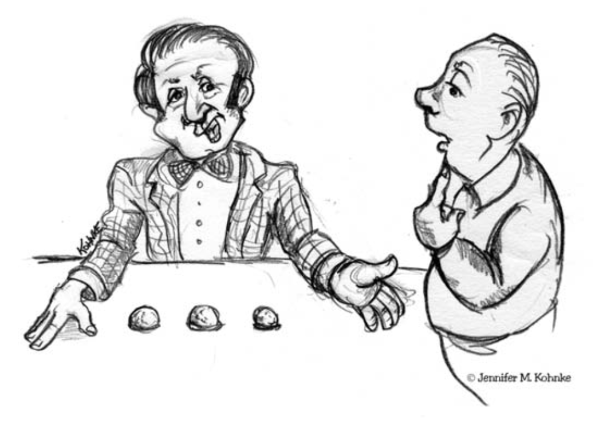
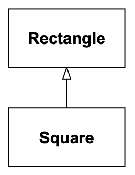
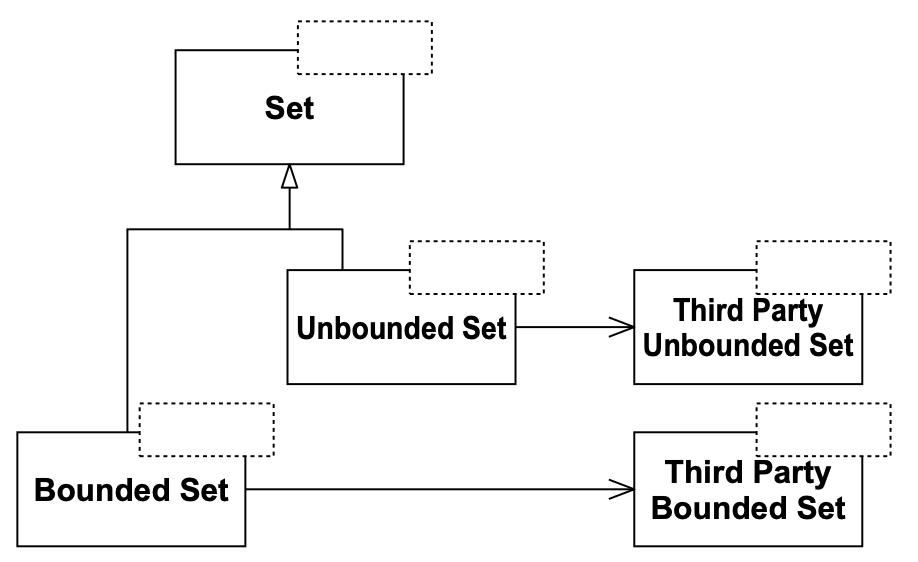
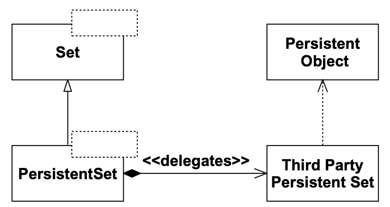
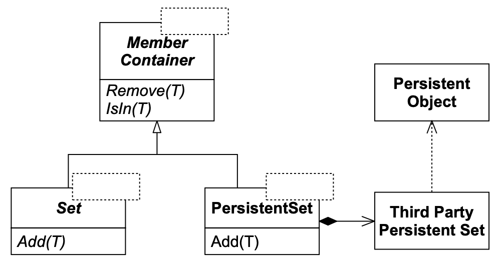

# 10 LSP：里氏替换原则

<center></center><br/>

OCP 背后的主要机制是抽象和多态。
在像 C++ 和 Java 这样的静态类型语言中，支持抽象和多态的关键机制之一是继承。
正是通过使用继承，我们才能创建派生类来实现基类中的抽象方法。

管理这种特定继承使用的设计规则是什么？
最佳继承层次结构的特征是什么？
哪些陷阱会导致我们创建不符合 OCP 的层次结构？
这些是 *里氏替换原则（LSP）* 所要解决的问题。

## LSP：里氏替换原则

LSP 可以转述如下：

> 子类型必须能够替换其基类型。

Barbara Liskov 在1988年首次提出了这一原则。¹ 
她说，

> 这里需要的是类似下面的替换性质：如果对于类型 S 的每一个对象 o1，都存在一个类型 T 的对象 o2，使得对于所有以 T 方式定义的程序 P，当 o1 替换掉 o2 时，P 的行为保持不变，那么 S 就是 T 的子类型。

¹ [Liskov88]。

当你考虑违反这一原则的后果时，它的重要性就变得显而易见了。
假设我们有一个函数 `f`，它接受一个指向某个基类 `B` 的指针或引用作为参数。
再假设有一个 `B` 的派生类 `D`，当它以 `B` 的身份传递给 `f` 时，会导致 `f` 行为异常。
那么 `D` 就违反了 LSP。显然，在 `f` 面前，`D` 是 *脆弱的* 。

`f` 的作者会忍不住加入某种针对 `D` 的测试，以便当 `D` 被传递给它时，`f` 能够正常运行。
这种测试违反了 OCP，因为现在 `f` 对 `B` 的所有派生类不再封闭了。
这种测试是一种代码坏味，是由缺乏经验的开发者（或者更糟糕的是，匆忙的开发者）对 LSP 违规做出反应的结果。

## 一个简单的 LSP 违规示例

<ins>违反 LSP 通常会导致以严重违反 OCP 的方式使用运行时类型信息（RTTI）。
通常，会使用显式的 `if` 语句或 `if/else` 链来确定对象的类型，以便选择适合该类型的行为</ins>。
考虑 Listing 10-1 。

Listing 10-1 违反 LSP 导致违反 OCP。

```cpp
struct Point {double x,y;};

struct Shape {
    enum ShapeType {square, circle} itsType;
    Shape(ShapeType t) : itsType(t) {}
};

struct Circle : public Shape
{
    Circle() : Shape(circle) {};
    void Draw() const;
    Point itsCenter;
    double itsRadius;
};

struct Square : public Shape
{
    Square() : Shape(square) {};
    void Draw() const;
    Point itsTopLeft;
    double itsSide;
};

void DrawShape(const Shape& s)
{
    if (s.itsType == Shape::square)
        static_cast<const Square&>(s).Draw();
    else if (s.itsType == Shape::circle)
        static_cast<const Circle&>(s).Draw();
}
```

显然，Listing 10-1 中的 `DrawShape` 函数违反了 OCP。
它必须知道 `Shape` 类的每一个可能的派生类，并且每当创建新的 `Shape` 派生类时，它都必须被更改。
实际上，许多人正确地认为这个函数的结构是对良好设计的诅咒。
是什么驱使程序员编写这样的函数？

考虑工程师 Joe。
Joe 研究了面向对象技术，并得出结论：多态的开销太高了。²
因此，他定义了没有虚函数的 `Shape` 类。
`Square` 和 `Circle` 类（结构体）派生自 `Shape`，并且有 `Draw()` 函数，但它们没有覆盖 `Shape` 中的函数。
由于 `Circle` 和 `Square` 不能替换 `Shape`，`DrawShape` 必须检查传入的 `Shape`，确定其类型，然后调用适当的 `Draw` 函数。

² 在一台相当快的机器上，这种开销大约每次方法调用 1 纳秒，所以很难理解 Joe 的观点。

`Square` 和 `Circle` 不能替换 `Shape` 这一事实违反了 LSP。
这种违规迫使 `DrawShape` 违反了 OCP。
因此，LSP 的违规是 OCP 的潜在违规。

## 正方形和矩形，一个更微妙的违规

当然，还有其他更微妙的违反 LSP 的方式。
考虑一个使用 Listing 10-2 中描述的 `Rectangle` 类的应用程序。

Listing 10-2 Rectangle 类

```cpp
class Rectangle
{
public:
    void SetWidth(double w) {itsWidth=w;}
    void SetHeight(double h) {itsHeight=w;}
    double GetHeight() const {return itsHeight;}
    double GetWidth() const {return itsWidth;}
private:
    Point itsTopLeft;
    double itsWidth;
    double itsHeight;
};
```

想象一下，这个应用程序运行良好，并安装在许多站点。
就像所有成功的软件一样，它的用户时不时会要求变化。
有一天，用户要求除了矩形之外，还能操作正方形。

人们常说继承是 “IS-A” 关系。
换句话说，如果一种新对象可以被称为与旧对象满足 “IS-A” 关系，那么新对象的类应该从旧对象的类派生。

就所有正常意图和目的而言，正方形是矩形。
因此，将 `Square` 类视为从 `Rectangle` 类派生是合乎逻辑的。（见 Fig 10-1 。）

*「在 2000 年代，这种信念仍然存在。
对多态开销的恐惧是一个挥之不去的误解。
现在它主要出现在嵌入式实时社区中。
这被夸大了，因为编译器足够聪明，可以内联许多虚函数，而执行成本非常小，可以忽略不计。
然而，这种恐惧仍然不时出现。
许多电路板设计师会告诉你，多态不适合他们的项目，然而，在芯片开发中，有一个名为 “可合成” 的新概念……嗯，不深入了。
总之，不要害怕使用虚函数。」*

<br/>
*Fig 10-1 Square 继承自 Rectangle*

这种对 IS-A 关系的使用有时被认为是面向对象分析的基本技术之一：³
正方形是矩形，因此 `Square` 类应该从 `Rectangle` 类派生。
然而，这种想法可能会导致一些微妙但重要的问题。
通常，这些问题直到我们在代码中看到它们时才会被预见。

³ 一个经常使用但很少被定义的术语。

我们可能遇到麻烦的第一个线索是，`Square` 实际上并不需要 `itsHeight` 和 `itsWidth` 这两个成员变量，但它会从 `Rectangle` 继承它们。
显然，这是浪费。
在许多情况下，这种浪费是微不足道的。
但如果我们必须创建数十万个 `Square` 对象（例如，在一个 CAD/CAE 程序中，
复杂电路的每个组件的每个引脚都被绘制成一个正方形），这种浪费可能会很显著。

让我们暂时假设我们不太关心内存效率。
从 `Rectangle` 派生 `Square` 还会带来其他问题。
`Square` 将继承 `SetWidth` 和 `SetHeight` 函数。
这些函数对于 `Square` 是不合适的，因为正方形的宽度和高度是相同的。
这是一个强烈的问题信号。
然而，有一种方法可以规避这个问题。我们可以像下面这样覆盖 `SetWidth` 和 `SetHeight`：

```cpp
void Square::SetWidth(double w)
{
    Rectangle::SetWidth(w);
    Rectangle::SetHeight(w);
}

void Square::SetHeight(double h)
{
    Rectangle::SetHeight(h);
    Rectangle::SetWidth(h);
}
```

现在，当有人设置 `Square` 对象的宽度时，其高度也会相应改变。
当有人设置其高度时，其宽度也会随之改变。
因此，`Square` 的不变量 ⁴ 保持不变。
`Square` 对象将始终保持数学上正确的正方形。

⁴ 那些无论状态如何都必须始终为真的属性。

```cpp
Square s;
s.SetWidth(1); // 幸运的是，也将高度设置为1。
s.SetHeight(2); // 将宽度和高度都设置为2。好极了。
```

但考虑以下函数：

```cpp
void f(Rectangle& r)
{
    r.SetWidth(32); // 调用 Rectangle::SetWidth
}
```

如果我们向这个函数传递一个对 `Square` 对象的引用，`Square` 对象将被破坏，因为高度不会被改变。
这明显违反了 LSP。
`f` 函数对其参数的派生类不起作用。
失败的原因是 `SetWidth` 和 `SetHeight` 在 `Rectangle` 中没有被声明为 `virtual`；因此，它们不是多态的。

我们可以很容易地修复这个问题。
<ins>然而，当派生类的创建迫使我们更改基类时，通常意味着设计有缺陷</ins>。
当然，这违反了 OCP。
我们可能会反驳说，忘记将 `SetWidth` 和 `SetHeight` 设为 `virtual` 才是真正的设计缺陷，我们现在只是在修复它。
然而，这很难辩解，因为设置矩形的宽度和高度是极其原始的操作。
如果我们没有预见到 `Square` 的存在，我们有什么理由将它们设为 `virtual` 呢？

尽管如此，让我们假设我们接受这个论点并修复这些类。
我们最终得到 Listing 10-3 中的代码。

Listing 10-3 自洽的 Rectangle 和 Square。

```cpp
class Rectangle
{
public:
    virtual void SetWidth(double w) {itsWidth=w;}
    virtual void SetHeight(double h) {itsHeight=h;}
    double GetHeight() const {return itsHeight;}
    double GetWidth() const {return itsWidth;}
private:
    Point itsTopLeft;
    double itsHeight;
    double itsWidth;
};

class Square : public Rectangle
{
public:
    virtual void SetWidth(double w);
    virtual void SetHeight(double h);
};

void Square::SetWidth(double w)
{
    Rectangle::SetWidth(w);
    Rectangle::SetHeight(w);
}

void Square::SetHeight(double h)
{
    Rectangle::SetHeight(h);
    Rectangle::SetWidth(h);
}
```

### 真正的问题

`Square` 和 `Rectangle` 现在似乎可以工作了。
无论你对 `Square` 对象做什么，它都将保持与数学正方形一致。
无论你对 `Rectangle` 对象做什么，它都将保持一个数学矩形。
此外，你可以将一个 `Square` 传递给一个接受指向 `Rectangle` 的指针或引用的函数，
而 `Square` 仍然会像一个正方形一样行事，并保持一致性。

因此，我们可能会得出结论，设计现在是自洽和正确的。
然而，这个结论是错误的。
一个自洽的设计不一定与其所有用户都一致！
考虑以下函数 `g`：

```cpp
void g(Rectangle& r)
{
    r.SetWidth(5);
    r.SetHeight(4);
    assert(r.Area() == 20);
}
```

这个函数调用了它认为是 `Rectangle` 的 `SetWidth` 和 `SetHeight` 成员。
这个函数对 `Rectangle` 工作得很好，但如果传递一个 `Square`，它会触发一个断言错误。
所以这才是真正的问题：`g` 的作者假设改变矩形的宽度不会影响其高度。

显然，假设改变矩形的宽度不影响其高度是合理的！
然而，并非所有可以作为 `Rectangle` 传递的对象都满足那个假设。
如果你将一个 `Square` 实例传递给像 `g` 这样的函数，而 `g` 的作者做出了那个假设，那么该函数将发生故障。
函数 `g` 对 `Square/Rectangle` 层次结构是 *脆弱的* 。

函数 `g` 表明存在一些函数，它们接受指向 `Rectangle` 对象的指针或引用，但无法在 `Square` 对象上正常运行。
由于对于这些函数，`Square` 不能替换 `Rectangle`，`Square` 和 `Rectangle` 之间的关系违反了 LSP。

有人可能会争辩说，问题出在函数 `g` 上 —— 作者无权假设宽度和高度是独立的。
`g` 的作者会不同意。
函数 `g` 接受一个 `Rectangle` 作为其参数。
有一些不变量，即真理陈述，显然适用于一个名为 `Rectangle` 的类，其中一个不变量是高度和宽度是独立的。
`g` 的作者完全有权断言这个不变量。
是 `Square` 的作者违反了不变量。

有趣的是，`Square` 的作者并没有违反 `Square` 的不变量。
通过从 `Rectangle` 派生 `Square`，`Square` 的作者违反了 `Rectangle` 的不变量！

### 有效性不是内在的

<br/>

<ins>LSP 引出了一个非常重要的结论：一个模型，孤立地来看，不能被有意义地验证。
模型的有效性只能根据其客户端来表达</ins>。
例如，当我们孤立地检查 `Square` 和 `Rectangle` 类的最终版本时，我们发现它们是自洽和有效的。
然而，当我们从对基类做出合理假设的程序员的角度来看它们时，模型就崩溃了。

当考虑一个特定设计是否合适时，不能简单孤立地看待解决方案。
必须根据该设计的用户所做的合理假设来看待它。⁵

⁵ 在 [Meyer97] 中，Bertrand Meyer 讨论了 “契约设计” 的概念，该概念从语言上定义了客户端和作者之间的假设与义务。
参见 [第 15 章](../ch15/0.md) 。

谁知道设计的用户会做出什么样的合理假设？
大多数这样的假设不容易被预见。
实际上，如果我们试图预见所有假设，我们很可能会让我们的系统带有不必要的复杂性。
因此，像所有其他原则一样，通常最好推迟除了最明显的 LSP 违规之外的所有违规，直到相关的脆弱性被闻到。

### ISA 是关于行为的

那么发生了什么？
为什么看似合理的 `Square` 和 `Rectangle` 模型会出问题？
毕竟，正方形不是矩形吗？
IS-A 关系不成立吗？

就 `g` 的作者而言，不成立！
正方形可能是矩形，但从 `g` 的角度来看，一个 `Square` 对象肯定不是一个 `Rectangle` 对象。
为什么？
因为 `Square` 对象的行为与 `g` 对 `Rectangle` 对象行为的期望不一致。
从行为上讲，正方形不是矩形，而行为才是软件真正关心的。
<ins>LSP 清楚地表明，在 OOD 中，IS-A 关系涉及的是可以合理假设且客户端所依赖的行为</ins>。

### 契约设计

许多开发者可能对 “合理假设” 的行为概念感到不安。
你怎么知道你的客户端真正会期望什么？
有一种技术可以使那些合理假设变得明确，从而强制执行 LSP。
这种技术被称为 *契约设计（DBC）* ，由 Bertrand Meyer 阐述。⁶

⁶ [Meyer97]，第 11 章，第 331 页。

<ins>使用 DBC，类的作者明确陈述该类的契约。
该契约告知任何客户端代码的作者哪些行为是可以依赖的。
契约通过为每个方法声明前置条件和后置条件来指定。
前置条件必须为真，方法才能执行。
完成后，方法保证后置条件为真</ins>。

我们可以将 `Rectangle::SetWidth(double w)` 的后置条件视为：

```cpp
assert((itsWidth == w) && (itsHeight == old.itsHeight));
```

在这个例子中，`old` 是在调用 `SetWidth` 之前 `Rectangle` 的值。
现在，Meyer 所述的派生类的前置条件和后置条件规则是：

> [派生类中的] 例程重新声明只能用相等或更弱的前置条件替换原始前置条件，用相等或更强的后置条件替换原始后置条件。⁷

⁷ [Meyer97]，第 573 页，断言重声明规则（1）。

换句话说，当通过其基类接口使用一个对象时，用户只知道基类的前置条件和后置条件。
因此，派生对象不能期望这样的用户遵守比基类要求的更强的前置条件。
也就是说，它们必须接受基类能接受的任何东西。
此外，派生类必须符合基类的所有后置条件。
也就是说，它们的行为和输出不得违反为基类建立的任何约束。
基类的用户不得被派生类的输出所混淆。

显然，`Square::SetWidth(double w)` 的后置条件比 `Rectangle::SetWidth(double w)` 的后置条件 *更弱* ⁸，因为它没有强制执行约束 `(itsHeight == old.itsHeight)`。
因此，`Square` 的 `SetWidth` 方法违反了基类的契约。

⁸ “更弱” 这个术语可能令人困惑。
如果 X 没有强制执行 Y 的所有约束，则 X 比 Y 更弱。
X 强制执行多少新约束并不重要。

某些语言，如 Eiffel，直接支持前置条件和后置条件。
你可以声明它们，并让运行时系统为你验证它们。
C++ 和 Java 都没有这样的功能。
在这些语言中，我们必须手动考虑每个方法的前置条件和后置条件，并确保 Meyer 的规则不被违反。
此外，在注释中记录这些前置条件和后置条件可能非常有帮助。

### 在单元测试中指定契约

<ins>契约也可以通过编写单元测试来指定。
通过彻底测试类的行为，单元测试使类的行为清晰。
客户端代码的作者会想要查看单元测试，以便他们知道对他们正在使用的类可以合理地假设什么</ins>。

## 一个真实的例子

正方形和矩形的例子够了！
LSP 对真实软件有影响吗？
让我们看一个来自我几年前参与的一个项目的案例研究。

### 动机

在 20 世纪 90 年代初，我购买了一个第三方类库，其中包含一些容器类。
这些容器大致与 Smalltalk 的 Bag 和 Set 相关。
有两种 Set 变体和两种类似的 Bag 变体。
第一种变体称为 “有界的”，基于数组。
第二种称为 “无界的”，基于链表。

`BoundedSet` 的构造函数指定了该集合可以容纳的最大元素数。
这些元素的空间在 `BoundedSet` 内部被预分配为一个数组。
因此，如果 `BoundedSet` 的创建成功，我们可以确信它有足够的内存。
由于它基于数组，它非常快。
在正常操作期间没有进行内存分配。
而且由于内存是预分配的，我们可以确信操作 `BoundedSet` 不会耗尽堆内存。
另一方面，它浪费内存，因为它很少完全利用它预分配的所有空间。

另一方面，`UnboundedSet` 对其可以容纳的元素数量没有声明限制。
只要有堆内存可用，`UnboundedSet` 就会继续接受元素。
因此，它非常灵活。
它也很经济，因为它只使用容纳当前包含的元素所需的内存。
它也很慢，因为它在正常操作中必须分配和释放内存。
最后，存在其正常操作可能耗尽堆内存的危险。

我对这些第三方类的接口不满意。
我不想让我的应用程序代码依赖于它们，因为我觉得我以后会用更好的类来替换它们。
因此，我将第三方容器包装在我自己的抽象接口中，如 Fig 10-2 所示。

<br/>
*Fig 10-2 容器类适配器层*

我创建了一个名为 `Set` 的抽象类，它呈现了纯虚的 `Add`、`Delete` 和 `IsMember` 函数，如 Listing 10-4 所示。
这个结构统一了两种第三方 Set 的有界和无界变体，并允许通过一个公共接口访问它们。
因此，某个客户端可以接受一个类型为 `Set<T>&` 的参数，并且不会关心它实际操作的 `Set` 是有界还是无界变体。
（参见 Listing 10-5 中的 `PrintSet` 函数。）

Listing 10-4 抽象 Set 类

```cpp
template <class T>
class Set
{
public:
    virtual void Add(const T&) = 0;
    virtual void Delete(const T&) = 0;
    virtual bool IsMember(const T&) const = 0;
};
```

Listing 10-5 PrintSet

```cpp
template <class T>
void PrintSet(const Set<T>& s)
{
    for (Iterator<T> i(s); i; i++)
        cout << (*i) << endl;
}
```

不必知道或关心你正在使用的是哪种 `Set` 是一个很大的优势。
这意味着程序员可以在每个特定实例中决定需要哪种 `Set`，并且任何客户端函数都不会受到那个决定的影响。
程序员可以在内存紧张且速度不关键时选择 `UnboundedSet`，或者在内存充足且速度关键时选择 `BoundedSet`。
客户端函数将通过基类 `Set` 的接口操作这些对象，因此不会知道或关心它们正在使用哪种 `Set`。

### 问题

我想向这个层次结构添加一个 `PersistentSet`。
一个持久化集合是一个可以写入流，然后在之后（可能由不同的应用程序）读回的集合。
不幸的是，我唯一能访问的也提供持久化的第三方容器不是模板类。
相反，它接受从抽象基类 `PersistentObject` 派生的对象。
我创建了 Fig 10-3 所示的层次结构。

<br/>
*Fig 10-3 持久化 Set 层次结构*

注意，`PersistentSet` 包含一个第三方持久化集合的实例，它将其所有方法委托给该实例。
因此，如果你在 `PersistentSet` 上调用 `Add`，它只是将该调用委托给所包含的第三方持久化集合的适当方法。

从表面上看，这似乎没问题。
<ins>然而，有一个丑陋的含义。
添加到第三方持久化集合的元素必须从 `PersistentObject` 派生。
由于 `PersistentSet` 只是委托给第三方持久化集合，
  添加到 `PersistentSet` 的任何元素因此必须从 `PersistentObject` 派生。
然而，`Set` 的接口没有这样的约束</ins>。

当客户端向基类 `Set` 添加成员时，该客户端不能确定该 `Set` 是否实际上可能是一个 `PersistentSet`。
因此，客户端无法知道它添加的元素是否应该从 `PersistentObject` 派生。

考虑 Listing 10-6 中的 `PersistentSet::Add()` 代码。

Listing 10-6

```cpp
template <typename T>
void PersistentSet::Add(const T& t)
{
    PersistentObject& p =
        dynamic_cast<PersistentObject&>(t);
    itsThirdPartyPersistentSet.Add(p);
}
```

这段代码清楚地表明，如果有任何客户端试图将一个不是从 `PersistentObject` 类派生的对象添加到我的 `PersistentSet` 中，将会导致运行时错误。
`dynamic_cast` 将抛出 `bad_cast`。
抽象基类 `Set` 的现有客户端都不期望 `Add` 会抛出异常。
由于这些函数会被 `Set` 的派生类弄糊涂，这种对层次结构的更改违反了 LSP。

这是一个问题吗？
当然是。
以前在传递 `Set` 的派生类时从未失败的函数，现在在传递 `PersistentSet` 时可能会导致运行时错误。
调试这类问题相对困难，因为运行时错误发生在离实际逻辑缺陷很远的地方。
逻辑缺陷要么是决定将一个 `PersistentSet` 传递给一个函数，要么是决定将一个不是从 `PersistentObject` 派生的对象添加到 `PersistentSet`。
无论哪种情况，实际的决定可能距离 `Add` 方法的实际调用有数百万条指令。
找到它可能很麻烦。修复它可能更糟。

### 一个不符合 LSP 的解决方案

我们如何解决这个问题？
几年前，我通过约定解决了它。
也就是说，我没有在源代码中解决它。
相反，我建立了一个约定，即 `PersistentSet` 和 `PersistentObject` 对整个应用程序是不可见的。
它们只对一个特定的模块可见。
该模块负责将所有容器读写到持久存储。
当一个容器需要被写入时，其内容被复制到适当的 `PersistentObject` 派生类中，然后添加到 `PersistentSet` 中，然后保存在流上。
当一个容器需要从流中读取时，过程被反转。
从流中读取一个 `PersistentSet`，然后从 `PersistentSet` 中移除 `PersistentObject`，复制到普通的（非持久化的）对象中，然后添加到普通的 `Set` 中。

这个解决方案可能看起来过于限制，但这是我能想到的防止 `PersistentSet` 对象出现在那些想要向其中添加非持久化对象的函数接口中的唯一方法。
此外，它打破了应用程序其余部分对整个持久化概念的依赖。

这个解决方案有效吗？
实际上并没有。
这个约定被应用程序的几个部分违反了，因为开发人员不理解它的必要性。
这就是约定的问题 —— 它们必须不断地向每个开发人员重新推销。
如果开发人员没有学习过约定，或者不同意它，那么约定就会被违反。
而一次违规就可能危及整个结构。

### 一个符合 LSP 的解决方案

我现在会如何解决这个问题？
我会承认 `PersistentSet` 与 `Set` 没有 IS-A 关系，它不是 `Set` 的恰当派生类。
因此，我会分离这些层次结构，但不是完全分离。
`Set` 和 `PersistentSet` 有一些共同的特征。
实际上，只有 `Add` 方法导致了 LSP 的困难。
因此，我会创建一个层次结构，其中 `Set` 和 `PersistentSet` 都是在一个允许成员资格测试、迭代等的抽象接口之下的兄弟类。
（见 Fig 10-4 。）这将允许 `PersistentSet` 对象被迭代和测试成员资格等。
但它不会提供将不是从 `PersistentObject` 派生的对象添加到 `PersistentSet` 的能力。

<br/>
*Fig 10-4 一个符合 LSP 的解决方案*

## 重构而非派生

另一个有趣且令人困惑的继承案例是 `Line` 和 `LineSegment` 的情况。⁹
考虑 Listing 10-7 和 10-8 。
乍一看，这两个类似乎是公共继承的自然候选者。
`LineSegment` 需要 `Line` 中声明的每个成员变量和每个成员函数。
此外，`LineSegment` 添加了自己的新成员函数 `GetLength`，并覆盖了 `IsOn` 函数的含义。
然而，这两个类以一种微妙的方式违反了 LSP。

⁹ 尽管这个例子与 Square/Rectangle 例子有相似之处，但它来自一个真实的应用程序，并且确实遇到了所讨论的问题。

Listing 10-7 geometry/line.h

```cpp
#ifndef GEOMETRY_LINE_H
#define GEOMETRY_LINE_H

#include "geometry/point.h"

class Line
{
public:
    Line(const Point& p1, const Point& p2);
    double GetSlope() const;
    double GetIntercept() const; // Y Intercept
    Point GetP1() const {return itsP1;};
    Point GetP2() const {return itsP2;};
    virtual bool IsOn(const Point&) const;
private:
    Point itsP1;
    Point itsP2;
};

#endif
```

Listing 10-8 geometry/lineseg.h

```cpp
#ifndef GEOMETRY_LINESEGMENT_H
#define GEOMETRY_LINESEGMENT_H

class LineSegment : public Line
{
public:
    LineSegment(const Point& p1, const Point& p2);
    double GetLength() const;
    virtual bool IsOn(const Point&) const;
};

#endif
```

`Line` 的用户有权期望所有与它共线的点都在它上面。
例如，`Intercept` 函数返回的点是直线与 y 轴的交点。
由于这个点与直线共线，`Line` 的用户有权期望 `IsOn(Intercept()) == true`。
然而，在许多 `LineSegment` 的实例中，这个陈述会失败。

为什么这是一个重要的问题？
为什么不简单地从 `Line` 派生 `LineSegment` 并忍受这些微妙的问题呢？
这是一个判断。
很少有情况下，接受多态行为中的微妙缺陷比试图将设计操纵到完全符合 LSP 更可取。
接受妥协而不是追求完美是一种工程权衡。
一个好的工程师知道什么时候妥协比完美更有利。
然而，不应轻易放弃对 LSP 的符合。
保证子类在其基类被使用的任何地方都能工作是一种管理复杂性的强大方式。
一旦放弃，我们必须单独考虑每个子类。

在 `Line` 和 `LineSegment` 的情况下，有一个简单的解决方案，它说明了 OOD 的一个重要工具。
如果我们能访问 `Line` 和 `LineSegment` 类，那么我们可以将两者的共同元素重构到一个抽象基类中。
Listing 10-9 到 10-11 展示了将 `Line` 和 `LineSegment` 重构到基类 `LinearObject` 中。

Listing 10-9 geometry/linearobj.h

```cpp
#ifndef GEOMETRY_LINEAR_OBJECT_H
#define GEOMETRY_LINEAR_OBJECT_H

#include "geometry/point.h"

class LinearObject
{
public:
    LinearObject(const Point& p1, const Point& p2);
    double GetSlope() const;
    double GetIntercept() const;
    Point GetP1() const {return itsP1;};
    Point GetP2() const {return itsP2;};
    virtual int IsOn(const Point&) const = 0; // abstract.
private:
    Point itsP1;
    Point itsP2;
};

#endif
```

Listing 10-10 geometry/line.h

```cpp
#ifndef GEOMETRY_LINE_H
#define GEOMETRY_LINE_H

#include "geometry/linearobj.h"

class Line : public LinearObject
{
public:
    Line(const Point& p1, const Point& p2);
    virtual bool IsOn(const Point&) const;
};

#endif
```

清单10-11
geometry/lineseg.h
```cpp
#ifndef GEOMETRY_LINESEGMENT_H
#define GEOMETRY_LINESEGMENT_H

#include "geometry/linearobj.h"

class LineSegment : public LinearObject
{
public:
    LineSegment(const Point& p1, const Point& p2);
    double GetLength() const;
    virtual bool IsOn(const Point&) const;
};

#endif
```

`LinearObject` 同时代表 `Line` 和 `LineSegment`。它为两个子类提供了大部分的功能和数据成员，除了 `IsOn` 方法是纯虚的。
`LinearObject` 的用户不被允许假设他们理解他们正在使用的对象的范围。
因此，他们可以毫无问题地接受 `Line` 或 `LineSegment`。
此外，`Line` 的用户永远不会需要处理 `LineSegment`。

重构是一种最好在编写大量代码之前应用的设计工具。
当然，如果 Listing 10-7 中 `Line` 类有几十个客户端，我们重构出 `LinearObject` 类就不会那么容易。
然而，当重构可能时，它是一个强大的工具。
如果能够从两个子类中重构出共同点，那么很可能以后会出现其他也需要这些共同点的类。

关于重构，Rebecca Wirfs-Brock、Brian Wilkerson 和 Lauren Wiener 说：

> 我们可以说，如果一组类都支持一个共同的职责，那么它们应该从一个共同的超类继承那个职责。
>
> 如果一个共同的超类还不存在，就创建一个，并将共同的职责移到它那里。
毕竟，这样的类显然是有用的 —— 你已经表明这些职责将被一些类继承。
难道不可想象，你系统的后续扩展可能会添加一个新的子类，以新的方式支持那些相同的职责吗？
这个新的超类很可能是一个抽象类。¹⁰

¹⁰ [WirfsBrock90]，第 113 页。

Listing 10-12 展示了 `LinearObject` 的属性如何被一个未预见的类 `Ray` 使用。
`Ray` 可以替换 `LinearObject`，并且 `LinearObject` 的任何用户都不会有问题地处理它。

Listing 10-12 geometry/ray.h

```cpp
#ifndef GEOMETRY_RAY_H
#define GEOMETRY_RAY_H

class Ray : public LinearObject
{
public:
    Ray(const Point& p1, const Point& p2);
    virtual bool IsOn(const Point&) const;
};

#endif
```

## 启发法和约定

有一些简单的启发法可以给你一些关于 LSP 违规的线索。
<ins>它们都与派生类以某种方式从其基类中移除功能有关。
一个做得比其基类少的派生类通常不能替换其基类，因此违反了 LSP</ins>。

### 派生类中的退化函数

考虑 Listing 10-13。
`Base` 中的 `f` 函数被实现了。
然而，在 `Derived` 中它是退化的。
大概，`Derived` 的作者发现函数 `f` 在 `Derived` 中没有有用的目的。
不幸的是，`Base` 的用户不知道他们不应该调用 `f`，所以存在替换违规。

Listing 10-13 派生类中的退化函数

```java
public class Base
{
    public void f() {/*some code*/}
}

public class Derived extends Base
{
    public void f() {}
}
```

派生类中退化函数的存在并不总是表明 LSP 违规，但当它们出现时值得关注。

### 从派生类中抛出异常

<ins>另一种违规形式是在派生类的方法中添加异常，而其基类的方法不抛出这些异常。
如果基类的用户不期望异常，那么将它们添加到派生类的方法中是不可替换的。
要么必须改变用户的期望，要么派生类不应该抛出这些异常</ins>。

## 结论

OCP 是许多面向对象设计所声称的优势的核心。
当这一原则生效时，应用程序更易于维护、复用和健壮。
LSP 是 OCP 的主要促成者之一。
正是子类型的可替换性使得一个以基类类型表示的模块能够在不修改的情况下被扩展。
这种可替换性必须是开发人员能够隐含依赖的东西。
因此，基类的契约必须被良好且显著地理解，即使不是由代码显式强制执行。

“IS-A” 这个术语过于宽泛，不能作为子类型的定义。
子类型的真正定义是 “可替换的”，其中可替换性由显式或隐式的契约定义。

## 参考书目

1. Meyer, Bertrand. Object-Oriented Software Construction, 2d ed. Upper Saddle River, NJ: Prentice Hall, 1997.
2. Wirfs–Brock, Rebecca, et al. Designing Object-Oriented Software. Englewood Cliffs, NJ: Prentice Hall, 1990.
3. Liskov, Barbara. Data Abstraction and Hierarchy. SIGPLAN Notices, 23,5 (May 1988).

