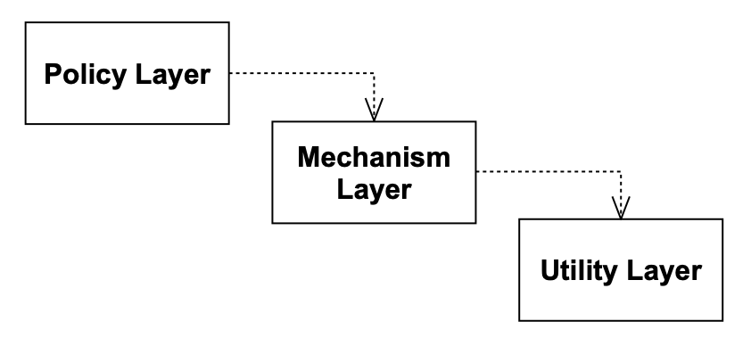
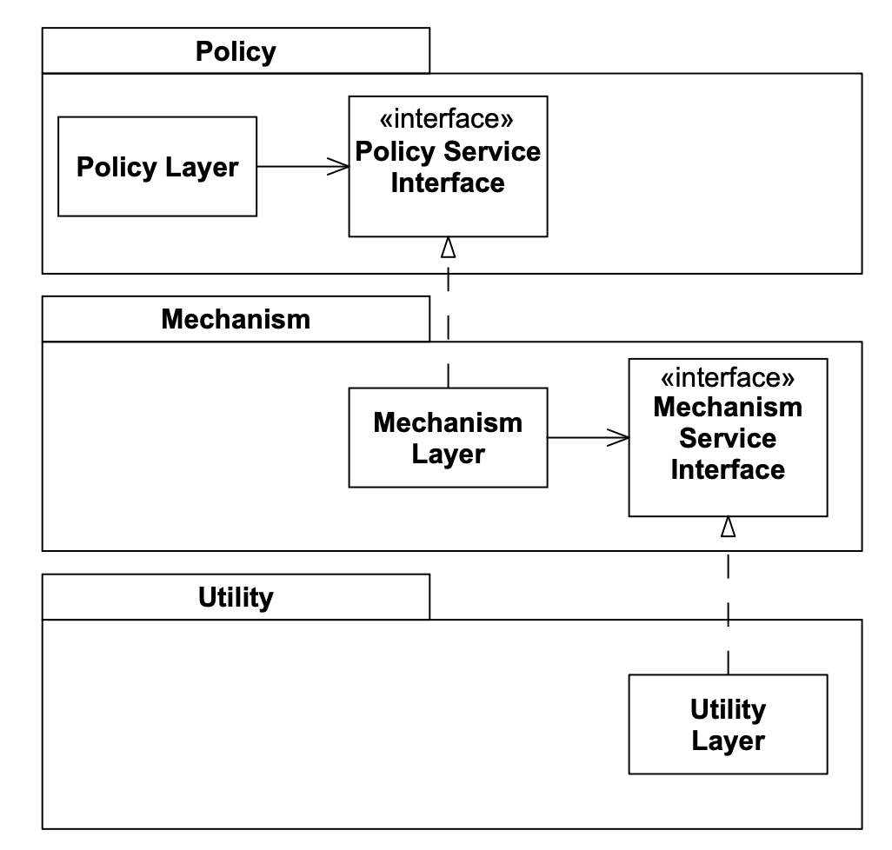
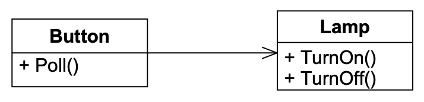
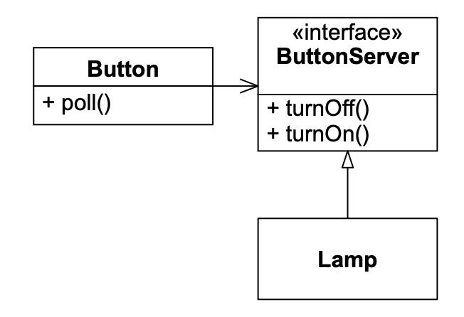
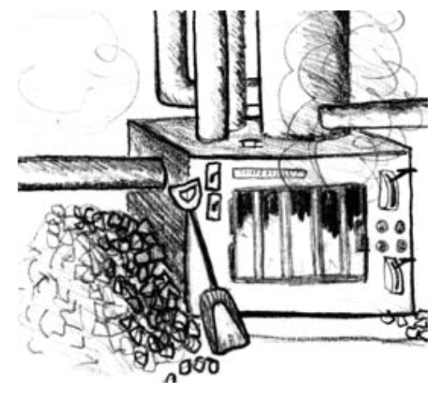
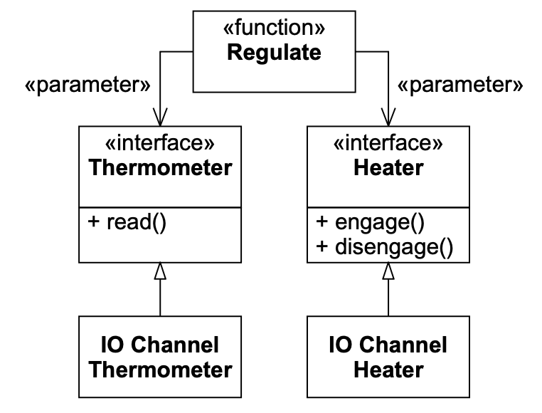

# 11 DIP：依赖反转原则

<center></center><br/>

> 永远不要
>
> 让国家的伟大利益取决于
>
> 可能动摇人类脆弱的
>
> 千百种偶然机会
> <p align="right">——Thomas Noon Talfourd 爵士（1795–1854）</p>

## DIP：依赖反转原则

> a. 高层模块不应依赖于低层模块。两者都应依赖于抽象。
>
> b. 抽象不应依赖于细节。细节应依赖于抽象。

多年来，许多人质疑为什么我在这个原则的名字中使用 “反转” 这个词。
这是因为更传统的软件开发方法，如结构化分析和设计，往往创建高层模块依赖于低层模块、策略依赖于细节的软件结构。
事实上，这些方法的目标之一是定义描述高层模块如何调用低层模块的子程序层次结构。
第 90 页 Fig 7-1中 `Copy` 程序的初始设计就是这样一个层次结构的好例子。
一个设计良好的面向对象程序的依赖结构，相对于传统过程式方法通常产生的依赖结构是 “反转” 的。

考虑高层模块依赖于低层模块的含义。
高层模块包含应用程序的重要策略决策和业务模型。
这些模块包含应用程序的身份。
然而，当这些模块依赖于低层模块时，对低层模块的更改可能会直接影响高层模块，并反过来迫使它们更改。

这种困境是荒谬的！
应该是制定策略的高层模块影响低层的详细模块。
包含高层业务规则的模块应该优先于并独立于包含实现细节的模块。
高层模块绝不应该以任何方式依赖于低层模块。

此外，我们希望能够复用制定策略的高层模块。
我们已经非常擅长以子程序库的形式复用低层模块。
当高层模块依赖于低层模块时，在不同上下文中复用那些高层模块就变得非常困难。
然而，当高层模块独立于低层模块时，高层模块就可以非常简单地被复用。
这个原则是框架设计的核心。

## 分层

根据 Booch 的说法，
“……所有结构良好的面向对象架构都有清晰定义的层，每一层通过定义良好和受控的接口提供一些连贯的服务集。” ¹
对这种说法的一种天真的解释可能会导致设计者产生类似于 Fig 11-1 的结构。
在这个图中，高层的 `Policy` 层使用较低层的 `Mechanism` 层，而 `Mechanism` 层又使用细节层的 `Utility` 层。
虽然这看起来可能合适，但它有一个潜在的特性，即 `Policy` 层对一直到 `Utility` 层的更改都很敏感。
依赖关系是可传递的。
`Policy` 层依赖于某个依赖于 `Utility` 层的东西；因此，`Policy` 层传递性地依赖于 `Utility` 层。

这是非常不幸的。

¹ [Booch96]，第 54 页。

<br/>
*Fig 11-1 天真的分层方案*

Fig 11-2 显示了一个更合适的模型。
每个上层为其需要的服务声明一个抽象接口。
然后从这些抽象接口实现较低层。
每个高层类通过抽象接口使用次低层。
因此，上层不依赖于下层。
相反，下层依赖于上层声明的抽象服务接口。
不仅 `PolicyLayer` 对 `UtilityLayer` 的传递依赖被打破了，而且 `PolicyLayer` 对 `MechanismLayer` 的直接依赖也被打破了。

### 所有权的反转

注意这里的反转不仅是依赖关系的反转，也是接口所有权的反转。
我们通常认为工具库拥有它们自己的接口。
但应用 DIP 时，我们发现客户端倾向于拥有抽象接口，而它们的服务器派生自它们。

<br/>
*Fig 11-2 反转的层*

这有时被称为好莱坞原则：“不要给我们打电话，我们会给你打电话。” ² 
低层模块为在上层模块中声明并调用的接口提供实现。

² [Sweet85]。

通过这种所有权的反转，`PolicyLayer` 不受 `MechanismLayer` 或 `UtilityLayer` 的任何更改的影响。
而且，`PolicyLayer` 可以在任何定义了符合 `PolicyServiceInterface` 的低层模块的上下文中被复用。
因此，通过反转依赖关系，我们创建了一个同时更灵活、更持久和更可移动的结构。

### 依赖抽象

对 DIP 的一种更天真但仍然非常强大的解释是简单的启发法：“依赖抽象。”
简单地说，这个启发法建议你不应该依赖于一个具体的类 —— 程序中的所有关系都应该终止于一个抽象类或接口。

根据这个启发法，
- 任何变量都不应该持有指向具体类的指针或引用。
- 任何类都不应该从具体类派生。
- 任何方法都不应该覆盖其任何基类中已实现的方法。

当然，这个启发法在每一个程序中通常至少会被违反一次。
必须有人创建具体类的实例，而无论哪个模块做这件事都会依赖于它们。³ 而且，对于具体但非易变的类，似乎没有理由遵循这个启发法。
如果一个具体类不会经常变化，并且不会创建其他类似的派生类，那么依赖它就不会造成什么伤害。

³ 实际上，如果你可以使用字符串来创建类，就有办法绕过这一点。
Java 允许这样做。
其他几种语言也允许。
在这种语言中，具体类的名称可以作为配置数据传入程序。

例如，在大多数系统中，描述字符串的类是具体的。
在 Java 中，例如，它是具体的 `String` 类。
这个类不是易变的。
也就是说，它不会经常变化。
因此直接依赖它是无害的。

然而，我们作为应用程序的一部分编写的大多数具体类都是易变的。
正是那些我们不想直接依赖的具体类。
它们的易变性可以通过将它们放在抽象接口后面来隔离。

这不是一个完整的解决方案。
有时，一个易变类的接口必须改变，而这种改变必须传播到代表该类的抽象接口。
这种改变会突破抽象接口的隔离。

这就是为什么这个启发法有点天真的原因。
另一方面，如果我们采取更长远的观点，即客户端类声明它们需要的服务接口，那么接口只有在客户端需要更改时才会更改。
实现抽象接口的类的更改不会影响客户端。

### 一个简单的例子

依赖反转可以在一个类向另一个类发送消息的任何地方应用。
例如，考虑 `Button` 对象和 `Lamp` 对象的情况。

`Button` 对象感知外部环境。
在收到 `Poll` 消息时，它确定用户是否 “按下” 了它。
感知机制是什么并不重要。
它可以是 GUI 上的一个按钮图标，被人的手指按下的物理按钮，甚至是家庭安全系统中的运动检测器。
`Button` 对象检测到用户已经激活或停用了它。

`Lamp` 对象影响外部环境。
在收到 `TurnOn` 消息时，它照亮某种灯。
在收到 `TurnOff` 消息时，它熄灭那盏灯。
物理机制不重要。
它可以是计算机控制台上的 LED，停车场里的汞蒸气灯，甚至是激光打印机中的激光。

我们如何设计一个系统，使 `Button` 对象控制 `Lamp` 对象？
Fig 11-3 显示了一个天真的设计。
`Button` 对象接收 `Poll` 消息，确定按钮是否被按下，然后简单地发送 `TurnOn` 或 `TurnOff` 消息给 `Lamp`。

<br/>
*Fig 11-3 Button 和 Lamp 的天真模型*

为什么这是天真的？
考虑这个模型所隐含的 Java 代码（Listing 11-1）。
注意 `Button` 类直接依赖于 `Lamp` 类。
这种依赖意味着 `Button` 将受到 `Lamp` 变化的影响。
而且，不可能复用 `Button` 来控制一个 `Motor` 对象。
在这个设计中，`Button` 对象控制 `Lamp` 对象，并且只控制 `Lamp` 对象。

Listing 11-1 Button.java

```java
public class Button
{
    private Lamp itsLamp;

    public void poll()
    {
        if (/*some condition*/)
            itsLamp.turnOn();
    }
}
```

这个解决方案违反了 DIP。
应用程序的高层策略没有与低层实现分离。
抽象没有与细节分离。
没有这种分离，高层策略自动依赖于低层模块，抽象自动依赖于细节。

### 找到底层抽象

什么是高层策略？
它是应用程序底层的抽象，是当细节改变时不会改变的真理。
它是系统内部的系统 —— 它是隐喻。
在 Button/Lamp 示例中，底层抽象是检测用户的开关手势并将其传递给目标对象。
检测用户手势使用什么机制？
无关紧要！
目标对象是什么？
无关紧要！
这些都是不影响抽象的细节。

Fig 11-3 中的设计可以通过反转对 Lamp 对象的依赖来改进。
在 Fig 11-4 中，我们看到 `Button` 现在持有一个对称为 `ButtonServer` 的东西的关联。
`ButtonServer` 提供了 `Button` 可以用来打开或关闭某些东西的抽象方法。
`Lamp` 实现了 `ButtonServer` 接口。
因此，`Lamp` 现在是在依赖，而不是被依赖。

<br/>
*Fig 11-4 对 Lamp 应用依赖反转*

Fig 11-4 中的设计允许 `Button` 控制任何愿意实现 `ButtonServer` 接口的设备。
这给了我们很大的灵活性。
这也意味着 `Button` 对象将能够控制尚未被发明的对象。

然而，这个解决方案也对任何需要被 `Button` 控制的对象施加了一个约束。
这样的对象必须实现 `ButtonServer` 接口。
这是不幸的，因为这些对象可能也想被一个 `Switch` 对象或 `Button` 以外的某个对象控制。

通过反转依赖的方向并使 `Lamp` 做依赖而不是被依赖，我们使 `Lamp` 依赖于一个不同的细节 —— `Button`。
或者我们有吗？

`Lamp` 当然依赖于 `ButtonServer`，但 `ButtonServer` 不依赖于 `Button`。
任何知道如何操作 `ButtonServer` 接口的对象都将能够控制 `Lamp`。
因此，依赖关系只是在名称上。
我们可以通过将 `ButtonServer` 的名称改为更通用的名称如 `SwitchableDevice` 来解决这个问题。
我们还可以确保 `Button` 和 `SwitchableDevice` 被保存在不同的库中，这样使用 `SwitchableDevice` 并不意味着使用 `Button`。

在这种情况下，没有人拥有接口。
我们有一个有趣的情况，即接口可以被许多不同的客户端使用，并由许多不同的服务器实现。
因此，接口需要独立存在，不属于任何一方。
在 C++ 中，我们会将它放在一个单独的命名空间和库中。
在 Java 中，我们会将它放在一个单独的包中。⁴

⁴ 在像 Smalltalk、Python 或 Ruby 这样的动态语言中，接口根本不会作为显式的源代码实体存在。

## 炉子示例

<br/>

让我们看一个更有趣的例子。
考虑可能控制炉子调节器的软件。
软件可以从一个 IO 通道读取当前温度，并通过向不同的 IO 通道发送命令来指示炉子打开或关闭。
算法的结构可能类似于 Listing 11-2 。

Listing 11-2 恒温器的简单算法

```cpp
#define TERMOMETER 0x86
#define FURNACE 0x87
#define ENGAGE 1
#define DISENGAGE 0

void Regulate(double minTemp, double maxTemp)
{
    for(;;)
    {
        while (in(THERMOMETER) > minTemp)
            wait(1);
        out(FURNACE, ENGAGE);
        while (in(THERMOMETER) < maxTemp)
            wait(1);
        out(FURNACE, DISENGAGE);
    }
}
```

算法的高层意图是清晰的，但代码被大量低层细节所充斥。
这段代码永远不能在不同的控制硬件上复用。

这可能不是什么损失，因为代码非常小。
但即便如此，让算法丢失而无法复用也是一种遗憾。
我们更愿意反转依赖关系，看到类似 Fig 11-5 的东西。

<br/>
*Fig 11-5 通用调节器*

这表明 `regulate` 函数接受两个参数，这两个参数都是接口。
`Thermometer` 接口可以被读取，`Heater` 接口可以被打开和关闭。
这就是 `Regulate` 算法所需要的全部。
现在它可以像 Listing 11-3 中那样编写。

Listing 11-3 通用调节器

```cpp
void Regulate(Thermometer& t, Heater& h,
              double minTemp, double maxTemp)
{
    for(;;)
    {
        while (t.Read() > minTemp)
            wait(1);
        h.Engage();
        while (t.Read() < maxTemp)
            wait(1);
        h.Disengage();
    }
}
```

这反转了依赖关系，使得高层调节策略不依赖于温度计或炉子的任何具体细节。
该算法可以很好地复用。

### 动态与静态多态

我们通过使用动态多态（即抽象类或接口）实现了依赖关系的反转，并使 `Regulate` 通用化。
然而，还有另一种方法。
我们可以使用 C++ 模板提供的静态多态形式。
考虑 Listing 11-4 。

Listing 11-4

```cpp
template <typename THERMOMETER, typename HEATER>
void Regulate(THERMOMETER& t, HEATER& h,
              double minTemp, double maxTemp)
{
    for(;;)
    {
        while (t.Read() > minTemp)
            wait(1);
        h.Engage();
        while (t.Read() < maxTemp)
            wait(1);
        h.Disengage();
    }
}
```

这实现了相同的依赖反转，而没有动态多态的开销（或灵活性）。
在 C++ 中，`Read`、`Engage` 和 `Disengage` 方法都可以是非虚的。
而且，任何声明了这些方法的类都可以被模板使用。
它们不必从公共基类继承。

作为一个模板，`Regulate` 不依赖于这些函数的任何特定实现。
所需要的只是替换 `HEATER` 的类有一个 `Engage` 和一个 `Disengage` 方法，替换 `THERMOMETER` 的类有一个 `Read` 函数。
因此，那些类必须实现由模板定义的接口。
换句话说，`Regulate` 和 `Regulate` 使用的类都必须同意相同的接口，并且它们都依赖于那个协议。

静态多态很好地打破了源代码依赖关系，但它解决的问题不如动态多态多。
模板方法的缺点是（1）`HEATER` 和 `THERMOMETER` 的类型不能在运行时改变；（2）使用新的 `HEATER` 或 `THERMOMETER` 将强制重新编译和重新部署。
因此，除非你对速度有极其严格的要求，否则应该优先选择动态多态。

## 结论

传统的过程式编程创建了一种策略依赖于细节的依赖结构。
这是不幸的，因为策略容易受到细节变化的影响。
面向对象编程反转了那种依赖结构，使得细节和策略都依赖于抽象，并且服务接口通常由其客户端拥有。

实际上，正是这种依赖反转是良好面向对象设计的标志。
程序用什么语言编写并不重要。
如果它的依赖关系是反转的，它就有 OO 设计。
如果它的依赖关系没有反转，它就有过程式设计。

依赖反转原则是面向对象技术声称的许多好处背后的基本低层机制。
它的正确应用对于创建可复用的框架是必要的。
它对于构建能够抵抗变化的代码也至关重要。
由于抽象和细节都彼此隔离，代码更容易维护。

## 参考书目

1. Booch, Grady. Object Solutions. Menlo Park, CA: Addison–Wesley, 1996.
2. Gamma, et al. Design Patterns. Reading, MA: Addison–Wesley, 1995.
3. Sweet. Richard E. The Mesa Programming Environment. SIGPLAN Notices, 20(7) (July 1985): 216–229.
