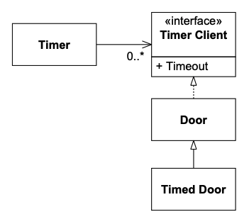
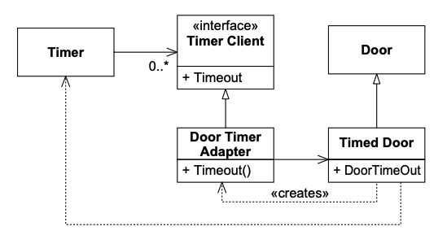
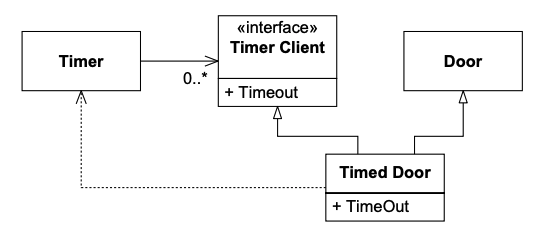
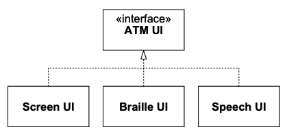
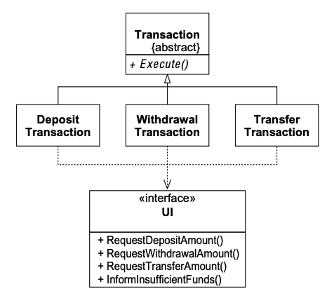
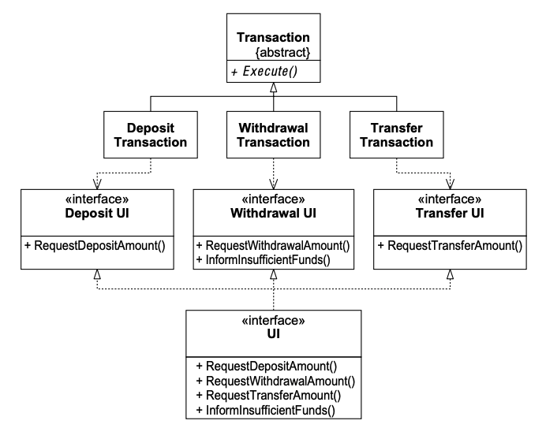

# 12 ISP：接口隔离原则

这一原则处理 “胖” 接口的缺点。
具有 “胖” 接口的类是其接口不具有内聚性的类。
换句话说，类的接口可以被分解成方法组。
每个组服务于不同的客户端集。
因此，一些客户端使用一组成员函数，而其他客户端使用其他组。

ISP 承认存在需要非内聚接口的对象；然而，它建议客户端不应该将它们作为一个单一的类来了解。
相反，客户端应该了解具有内聚接口的抽象基类。

## 接口污染

考虑一个安全系统。
在这个系统中，有可以锁定和解锁的 `Door` 对象，并且它们知道自己是打开还是关闭的。
（见 Listing 12-1 。）

Listing 12-1 安全门

```cpp
class Door
{
public:
    virtual void Lock() = 0;
    virtual void Unlock() = 0;
    virtual bool IsDoorOpen() = 0;
};
```

这个类是抽象的，这样客户端可以使用符合 `Door` 接口的对象，而不必依赖于 `Door` 的特定实现。

现在考虑一个这样的实现，`TimedDoor`，当门打开时间过长时需要发出警报。
为了做到这一点，`TimedDoor` 对象与另一个称为 `Timer` 的对象通信。
（见 Listing 12-2 。）

清单12-2
```cpp
class Timer
{
public:
    void Register(int timeout, TimerClient* client);
};

class TimerClient
{
public:
    virtual void TimeOut() = 0;
};
```

当一个对象希望被告知超时时，它调用 `Timer` 的 `Register` 函数。
该函数的参数是超时时间，以及一个指向 `TimerClient` 对象的指针，该对象的 `TimeOut` 函数将在超时到期时被调用。

我们如何让 `TimerClient` 类与 `TimedDoor` 类通信，以便 `TimedDoor` 中的代码可以被通知超时？
有几种替代方案。
Fig 12-1 显示了一个粗浅的 (naive) 解决方案。
我们强迫 `Door`，因此 `TimedDoor`，继承自 `TimerClient`。
这确保了 `TimerClient` 可以向 `Timer` 注册自身并接收 `TimeOut` 消息。

<br/>
*Fig 12-1 层次结构顶部的 Timer Client*

虽然这种解决方案很常见，但它并非没有缺点。
其中最主要的是 `Door` 类现在依赖于 `TimerClient`。
并非所有种类的 `Door` 都需要计时。
实际上，原始的 `Door` 抽象与计时没有任何关系。
如果创建了不需要计时的 `Door` 的派生类，那些派生类将必须为 `TimeOut` 方法提供退化实现 —— 这可能是对 LSP 的潜在违反。
而且，使用那些派生类的应用程序将不得不导入 `TimerClient` 类的定义，即使它没有被使用。
这闻起来像不必要的复杂性和不必要的冗余。

这是接口污染的一个例子，这是在像 C++ 和 Java 这样的静态类型语言中常见的综合征。
`Door` 的接口被一个它不需要的方法污染了。
它被强制加入这个方法仅仅是为了它一个子类的好处。
如果继续这种做法，那么每次派生类需要一个新方法时，该方法将被添加到基类。
这将进一步污染基类的接口，使其变得 “胖”。

而且，每次向基类添加一个新方法时，该方法必须在派生类中实现（或允许默认）。
实际上，一种相关的做法是向基类添加这些接口，并给它们退化实现，这样派生类不必承担实现它们的负担。
正如我们之前学到的，这种做法可能违反 LSP，导致维护和复用问题。

## 分离的客户端意味着分离的接口

`Door` 和 `TimerClient` 代表由完全不同的客户端使用的接口。
`Timer` 使用 `TimerClient`，而操作门的类使用 `Door`。
由于客户端是分离的，接口也应该保持分离。
为什么？
因为客户端对它们使用的接口施加力。

### 客户端对接口施加的反向力

当我们想到导致软件变化的力时，我们通常认为接口的变化将如何影响它们的用户。
例如，我们会担心如果 `TimerClient` 接口改变，所有 `TimerClient` 用户的变化。
然而，有一种力在另一个方向起作用。
有时是用户迫使接口发生变化。

例如，一些 `Timer` 的用户会注册多个超时请求。
考虑 `TimedDoor`。
当它检测到门被打开时，它向 `Timer` 发送 `Register` 消息，请求一个超时。
然而，在该超时到期之前，门关闭，保持关闭一段时间，然后再次打开。
这导致我们在旧超时到期之前注册一个新的超时请求。
最后，第一个超时请求到期，`TimedDoor` 的 `TimeOut` 函数被调用。
门错误地报警了。

我们可以通过使用 Listing 12-3 中的约定来纠正这种情况。
我们在每次超时注册中包含一个唯一的 `timeOutId` 代码，并在向 `TimerClient` 的 `TimeOut` 调用中重复该代码。
这使得 `TimerClient` 的每个派生类都知道正在响应哪个超时请求。

Listing 12-3 带 ID 的 Timer

```cpp
class Timer
{
public:
    void Register(int timeout,
                  int timeOutId,
                  TimerClient* client);
};

class TimerClient
{
public:
    virtual void TimeOut(int timeOutId) = 0;
};
```

显然，这个更改将影响所有 `TimerClient` 的用户。
我们接受这一点，因为缺少 `timeOutId` 是一个需要纠正的疏忽。
然而，Fig 12-1 中的设计也将导致 `Door` 以及 `Door` 的所有客户端受到此修复的影响！
这闻起来像僵化性和粘滞性。
为什么 `TimerClient` 中的一个错误应该对不需要计时的 `Door` 派生类的客户端产生任何影响？
当程序的一部分的更改影响程序中其他完全无关的部分时，变更的成本和影响变得不可预测，
变更产生附带影响的风险急剧增加。

## ISP：接口隔离原则

> 客户端不应该被强制依赖它们不使用的方法。

当客户端被强制依赖它们不使用的方法时，那些客户端就会受到这些方法变化的影响。
这导致所有客户端之间产生一种不经意的耦合。
换句话说，当一个客户端依赖于一个包含该客户端不使用但其他客户端使用的方法的类时，
那么该客户端将受到那些其他客户端强制对该类进行的更改的影响。
我们希望在可能的情况下避免这种耦合，因此我们想要分离接口。

## 类接口 vs 对象接口

再次考虑 `TimedDoor`。
这是一个具有两个独立接口的对象，由两个独立的客户端 ——`Timer` 和 `Door` 的用户—— 使用。
这两个接口必须在同一个对象中实现，因为这两个接口的实现，操作的是相同的数据。
那么我们如何符合 ISP 呢？
当接口必须保持在一起时，我们如何分离它们？

<ins>答案在于，对象的客户端不需要通过对象的接口来访问它。
相反，它们可以通过委托或通过对象的基类来访问它</ins>。

### 通过委托分离

一种解决方案是创建一个从 `TimerClient` 派生并委托给 `TimedDoor` 的对象。
Fig 12-2 显示了这种解决方案。

当 `TimedDoor` 想要向 `Timer` 注册一个超时请求时，它创建一个 `DoorTimerAdapter` 并向 `Timer` 注册它。
当 `Timer` 向 `DoorTimerAdapter` 发送 `TimeOut` 消息时，`DoorTimerAdapter` 将消息委托回 `TimedDoor`。

<br/>
*Fig 12-2 Door Timer Adapter*

这个解决方案符合 ISP，并防止了 `Door` 客户端与 `Timer` 的耦合。
即使进行 Listing 12-3 中所示的 `Timer` 更改，`Door` 的用户也不会受到影响。
而且，`TimedDoor` 不必与 `TimerClient` 具有完全相同的接口。
`DoorTimerAdapter` 可以将 `TimerClient` 接口转换为 `TimedDoor` 接口。
因此，这是一个非常通用的解决方案。
（见 Listing 12-4 。）

Listing 12-4 TimedDoor.cpp

```cpp
class TimedDoor : public Door
{
public:
    virtual void DoorTimeOut(int timeOutId);
};

class DoorTimerAdapter : public TimerClient
{
public:
    DoorTimerAdapter(TimedDoor& theDoor)
        : itsTimedDoor(theDoor)
    {}
    virtual void TimeOut(int timeOutId)
        {itsTimedDoor.DoorTimeOut(timeOutId);}
private:
    TimedDoor& itsTimedDoor;
};
```

然而，这种解决方案也有点不优雅。
每次我们想注册超时时，它都需要创建一个新对象。
而且，委托需要非常小但仍非零的运行时间和内存开销。
有一些应用领域，如嵌入式实时控制系统，运行时间和内存稀缺到足以使这成为一个问题。

### 通过多重继承分离

Fig 12-3 和 Listing 12-5 展示了如何使用多重继承来实现 ISP。
在这个模型中，`TimedDoor` 同时继承自 `Door` 和 `TimerClient`。
虽然两个基类的客户端都可以使用 `TimedDoor`，但实际上两者都不依赖于 `TimedDoor` 类。
因此，它们通过分离的接口使用同一个对象。

<br/>
*Fig 12-3 多重继承的 Timed Door*

Listing 12-5 TimedDoor.cpp

```cpp
class TimedDoor : public Door, public TimerClient
{
public:
    virtual void TimeOut(int timeOutId);
};
```

这个解决方案是我通常的偏好。
我只有在 `DoorTimerAdapter` 对象执行的转换是必要的，或者在不同时间需要不同转换时，才会选择 Fig 12-2 中的解决方案而不是 Fig 12-3 。

## ATM 用户界面示例

<br/>

现在让我们考虑一个稍微重要一点的例子。
传统的自动柜员机（ATM）问题。
ATM 机的用户界面需要非常灵活。
输出可能需要翻译成多种不同的语言。
它可能需要在屏幕上显示，或在盲文板上显示，或通过语音合成器说出。
显然，这可以通过创建一个抽象基类来实现，该基类具有界面需要呈现的所有不同消息的抽象方法。

<br/>
*Fig 12-4*

还要考虑 ATM 可以执行的每个不同交易都被封装为 `Transaction` 类的派生类。
因此，我们可能有 `DepositTransaction`、`WithdrawalTransaction` 和 `TransferTransaction` 等类。
每个类都调用 UI 的方法。
例如，为了要求用户输入他想要存入的金额，`DepositTransaction` 对象调用 `UI` 类的 `RequestDepositAmount` 方法。
同样，为了要求用户想要在账户之间转账多少，`TransferTransaction` 对象调用 `UI` 的 `RequestTransferAmount` 方法。
这对应于 Fig 12-5 中的图表。

<br/>
*Fig 12-5 ATM 交易层次结构*

注意，这正是 ISP 告诉我们要避免的情况。
每个交易都在使用其他类不使用的 UI 方法。
这创造了一种可能性，即对一个 `Transaction` 派生类的更改将迫使对 `UI` 进行相应的更改，从而影响所有其他 `Transaction` 派生类以及每个依赖于 `UI` 接口的类。
这里闻起来像僵化性和脆弱性。

例如，如果我们添加一个 `PayGasBillTransaction`，我们将不得不向 `UI` 添加新方法，以处理该交易想要显示的独特消息。
不幸的是，由于 `DepositTransaction`、`WithdrawalTransaction` 和 `TransferTransaction` 都依赖于 `UI` 接口，它们都必须被重新编译。
更糟糕的是，如果所有交易都被部署为独立 DLL 或共享库中的组件，那么那些组件将不得不被重新部署，即使它们的逻辑都没有改变。
你能闻到粘滞性吗？

这种不幸的耦合可以通过将 UI 接口隔离成单独的接口来避免，例如 `DepositUI`、`WithdrawUI` 和 `TransferUI`。然后可以将这些分离的接口多重继承到最终的 `UI` 接口中。
Fig 12-6 和 Listing 12-6 显示了这种模型。

<br/>
*Fig 12-6 隔离的 ATM UI 接口*

每当创建 `Transaction` 类的新派生类时，将需要一个相应的抽象 UI 接口基类，
因此 `UI` 接口及其所有派生类都必须更改。
然而，这些类没有被广泛使用。
实际上，它们可能只被 `main` 或任何启动系统并创建具体 `UI` 实例的进程使用。
因此，添加新的 UI 基类的影响被最小化了。

Listing 12-6 隔离的 ATM UI 接口

```cpp
class DepositUI
{
public:
    virtual void RequestDepositAmount() = 0;
};

class DepositTransaction : public Transaction
{
public:
    DepositTransaction(DepositUI& ui)
        : itsDepositUI(ui)
    {}
    virtual void Execute()
    {
        ...
        itsDepositUI.RequestDepositAmount();
        ...
    }
private:
    DepositUI& itsDepositUI;
};

class WithdrawalUI
{
public:
    virtual void RequestWithdrawalAmount() = 0;
};

class WithdrawalTransaction : public Transaction
{
public:
    WithdrawalTransaction(WithdrawalUI& ui)
        : itsWithdrawalUI(ui)
    {}
    virtual void Execute()
    {
        ...
        itsWithdrawalUI.RequestWithdrawalAmount();
        ...
    }
private:
    WithdrawalUI& itsWithdrawalUI;
};

class TransferUI
{
public:
    virtual void RequestTransferAmount() = 0;
};

class TransferTransaction : public Transaction
{
public:
    TransferTransaction(TransferUI& ui)
        : itsTransferUI(ui)
    {}
    virtual void Execute()
    {
        ...
        itsTransferUI.RequestTransferAmount();
        ...
    }
private:
    TransferUI& itsTransferUI;
};

class UI : public DepositUI
        , public WithdrawalUI
        , public TransferUI
{
public:
    virtual void RequestDepositAmount();
    virtual void RequestWithdrawalAmount();
    virtual void RequestTransferAmount();
};
```

仔细检查 Listing 12-6，会发现 ISP 符合性的一个问题，但在 `TimedDoor` 示例中并不明显。
注意每个交易必须以某种方式知道其特定版本的 UI。
`DepositTransaction` 必须知道 `DepositUI`，`WithdrawTransaction` 必须知道 `WithdrawUI`，等等。
在 Listing 12-6 中，我通过强制每个交易使用对其特定 UI 的引用来构造来解决这个问题。
注意这允许我使用 Listing 12-7 中的惯用法。

Listing 12-7 接口初始化惯用法

```cpp
UI Gui; // global object;

void f()
{
    DepositTransaction dt(Gui);
}
```

这很方便，但它也迫使每个交易包含一个指向其 UI 的引用成员。
解决这个问题的另一种方法是创建一组全局常量，如 Listing 12-8 所示。
全局变量并不总是糟糕设计的症状。
在这种情况下，它们提供了易于访问的明显优势。
由于它们是引用，无法以任何方式更改它们。
因此，它们不能被以一种会让其他用户惊讶的方式操作。

Listing 12-8 分离的全局指针

```cpp
// in some module that gets linked in
// to the rest of the app.
static UI Lui; // non-global object;
DepositUI& GdepositUI = Lui;
WithdrawalUI& GwithdrawalUI = Lui;
TransferUI& GtransferUI = Lui;

// In the depositTransaction.h module
class WithdrawalTransaction : public Transaction
{
public:
    virtual void Execute()
    {
        GwithdrawalUI.RequestWithdrawalAmount();
        ...
    }
};
```

在 C++ 中，可能会倾向于将 Listing 12-8 中的所有全局变量放入一个单一的类中，以防止污染全局命名空间。
Listing 12-9 显示了这样一种方法。
然而，这有一个不幸的效果。
为了使用 `UIGlobals`，你必须 `#include ui_globals.h`。
这反过来又 `#include depositUI.h`、`withdrawUI.h` 和 `transferUI.h`。
这意味着任何想要使用任何 UI 接口的模块都传递性地依赖于它们全部 —— 这正是 ISP 警告我们要避免的情况。
如果对任何 UI 接口进行了更改，所有 `#include "ui_globals.h"` 的模块都被强制重新编译。
`UIGlobals` 类重新组合了我们努力分离的接口！

Listing 12-9 将全局变量包装在一个类中

```cpp
// in ui_globals.h
#include "depositUI.h"
#include "withdrawalUI.h"
#include "transferUI.h"

class UIGlobals
{
public:
    static WithdrawalUI& withdrawal;
    static DepositUI& deposit;
    static TransferUI& transfer
};

// in ui_globals.cc
static UI Lui; // non-global object;
DepositUI& UIGlobals::deposit = Lui;
WithdrawalUI& UIGlobals::withdrawal = Lui;
TransferUI& UIGlobals::transfer = Lui;
```

### 多参数 vs 单参数

考虑一个函数 `g`，它需要同时访问 `DepositUI` 和 `TransferUI`。
再考虑我们希望将 UI 传递给这个函数。
我们应该这样写函数原型吗？

```cpp
void g(DepositUI&, TransferUI&);
```

还是应该这样写？

```cpp
void g(UI&);
```

采用后一种（单参数）形式的诱惑很强。
毕竟，我们知道在前一种（多参数）形式中，两个参数都将引用同一个对象。
而且，如果我们使用多参数形式，它的调用可能看起来像这样：

```cpp
g(ui, ui);
```

不知怎的，这似乎有些反常。

<ins>不管是否反常，多参数形式通常比单参数形式更可取</ins>。
单参数形式迫使 `g` 依赖于 `UI` 中包含的每个接口。
因此，当 `WithdrawUI` 改变时，`g` 和 `g` 的所有客户端都可能受到影响。
这比 `g(ui, ui)` 更反常！
而且，我们不能确定 `g` 的两个参数是否总是引用同一个对象。
将来，接口对象可能因为某种原因被分离。
所有接口被组合成一个单一对象这一事实是 `g` 不需要知道的信息。
因此，对于这类函数，我更喜欢多参数形式。

**分组客户端**。
<ins>客户端通常可以按它们调用的服务方法进行分组。
这样的分组允许为每个组而不是每个客户端创建隔离的接口。
这大大减少了服务必须实现的接口数量，也防止了服务依赖于每个客户端类型</ins>。

有时，不同客户端组调用的方法会重叠。
如果重叠很小，那么组的接口应该保持分离。
公共函数应该在所有重叠的接口中声明。
服务器类将从每个接口继承公共函数，但它只实现一次。

**改变接口**。
<ins>当维护面向对象的应用程序时，现有类和组件的接口经常变化。
有时这些变化会产生巨大影响，迫使系统很大一部分重新编译和重新部署。
这种影响可以通过向现有对象添加新接口而不是改变现有接口来缓解。
希望访问新接口方法的旧接口客户端可以向对象查询该接口，如 Listing 12-10 所示</ins>。

Listing 12-10

```cpp
void Client(Service* s)
{
    if (NewService* ns = dynamic_cast<NewService*>(s))
    {
        // use the new service interface
    }
}
```

与所有原则一样，必须注意不要过火。
一个类有数百个不同接口，一些按客户端隔离，另一些按版本隔离，这样的景象确实令人恐惧。

## 结论

胖类会导致其客户端之间奇怪而有害的耦合。
当一个客户端强制对胖类进行更改时，所有其他客户端都会受到影响。
因此，客户端应该只依赖于它们实际调用的方法。
这可以通过将胖类的接口分解成许多特定于客户端的接口来实现。
每个特定于客户端的接口只声明其特定客户端或客户端组调用的那些函数。
然后胖类可以继承所有特定于客户端的接口并实现它们。
这打破了客户端对它们不调用的方法的依赖，并允许客户端彼此独立。

## 参考书目

1. Gamma, et al. Design Patterns. Reading, MA: Addison–Wesley, 1995.
