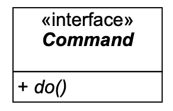
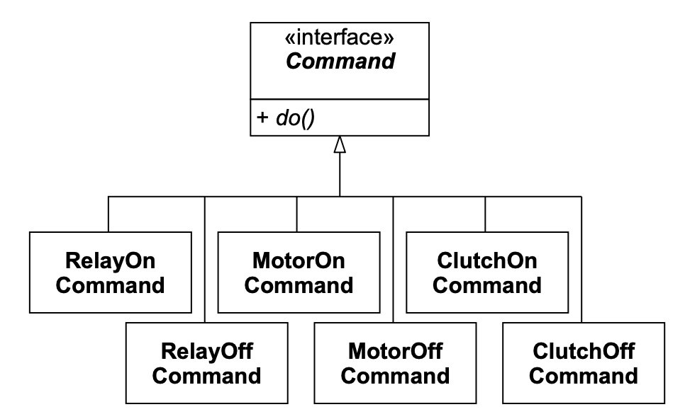
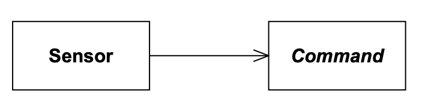
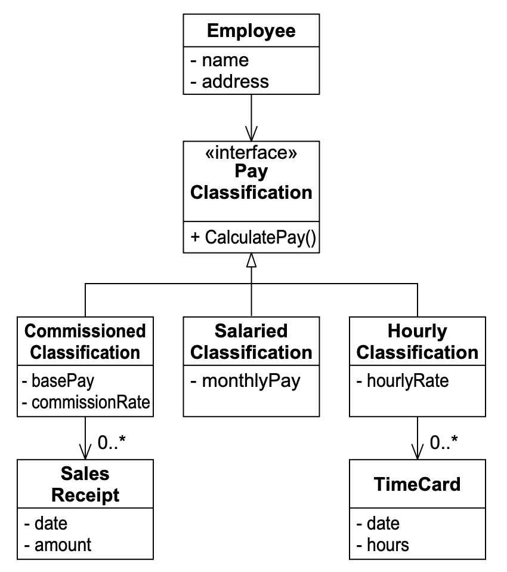
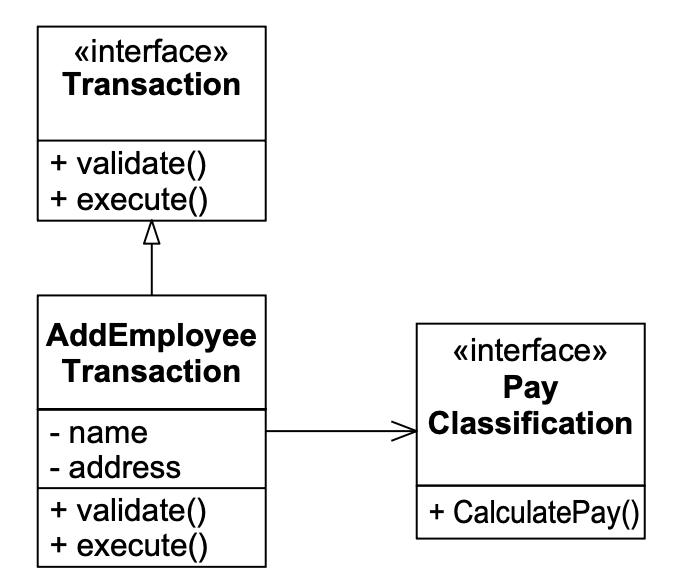
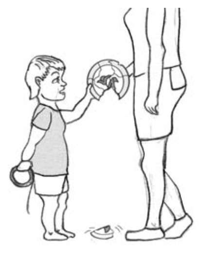
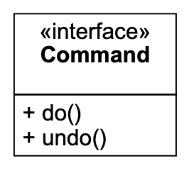

# 13 COMMAND 与 ACTIVE OBJECT

<center></center><br/>

> 没有人从大自然获得命令他人的权利。
> <p align="right">——Denis Diderot（1713–1784）</p>

这些年来被描述过的所有设计模式中，COMMAND 模式给我的印象是最简单、最优雅的之一。
正如我们将看到的，这种简单性具有欺骗性。COMMAND 的用途范围可能是无限的。

COMMAND 的简单性，如 Fig 13-1 所示，几乎令人发笑。
Listing 13-1 也没能减轻这种轻松感。
一个仅仅包含一个方法的接口就能构成一个模式，这似乎有些荒谬。

<br/>
*Fig 13-1 COMMAND 模式*

Listing 13-1 Command.java

```java
public interface Command
{
    public void do();
}
```

但实际上，这个模式跨越了一条非常有趣的界线。
而正是在跨越这条界线的过程中，所有有趣的复杂性才得以显现。
大多数类都会将一组方法与一组相应的变量关联起来。
<ins>COMMAND 模式则不然，它封装了一个没有任何变量的函数</ins>。

从严格的面向对象术语来看，这是不可接受的 —— 它带有函数分解的味道。
它将函数的角色提升到了类的高度。
这是异端！
然而，正是在这两种范式交汇的边界上，有趣的事情开始发生。

## 简单命令

几年前，我曾为一家制造复印机的大公司提供咨询。
我帮助他们其中一个开发团队设计并实现驱动新复印机内部运作的嵌入式实时软件。
我们偶然想到了使用 COMMAND 模式来控制硬件设备。
我们创建了一个如 Fig 13-2 所示的层次结构。

<br/>
*Fig 13-2 复印机软件中的一些简单 Command*

这些类的作用应该是显而易见的。
当你在 `RelayOnCommand` 上调用 `do()` 时，它会打开某个继电器。
当你在 `MotorOffCommand` 上调用 `do()` 时，它会关闭某个电机。
电机或继电器的地址作为构造函数的参数传入对象。

有了这样的结构，我们现在可以在系统中传递 Command 对象，并在不知道它们具体表示哪种 Command 的情况下调用 `do()`。
这带来了一些有趣的简化。

该系统是事件驱动的。
基于系统中发生的某些事件，继电器会打开或关闭，电机启动或停止，离合器接合或脱开。
其中许多事件是由传感器检测到的。
例如，当光学传感器检测到一张纸已到达纸路中的某个点时，我们需要接合某个离合器。
我们通过简单地将适当的 `ClutchOnCommand` 绑定到控制该特定光学传感器的对象来实现这一点（见 Fig 13-3 ）。

<br/>
*Fig 13-3 由传感器驱动的 Command*

这种简单的结构具有巨大的优势。
Sensor 完全不知道自己在做什么。
每当它检测到一个事件时，它只是调用它所绑定的 Command上 的 `do()` 方法。
这意味着 Sensor 不需要了解各个离合器或继电器，也不需要了解纸路的机械结构。
它们的功能变得非常简单。

确定当某些传感器声明事件时关闭哪些继电器的复杂性，已被转移到了初始化函数中。
在系统初始化的某个时刻，每个 Sensor 都被绑定到一个适当的 Command上。
这将所有的 “布线 (wiring)” ¹ 集中在一个地方，并将其从系统的主体中移除。
实际上，可以创建一个简单的文本文件来描述哪些 Sensor 绑定到哪些 Command。
初始化程序可以读取该文件并适当地构建系统。
因此，系统的 “布线” 可以完全在程序外部确定，并且可以在不重新编译的情况下进行调整。

¹ 传感器与命令之间的逻辑互连。

<ins>通过对命令这一概念 (notion) 进行封装，该模式使我们能够将系统的逻辑互连与正在连接的设备解耦。
这是一个巨大的好处</ins>。

## 事务

COMMAND 模式的另一个常见用途 ——也是我们在薪资问题中会发现有用的—— 是在事务的创建和执行中。
例如，假设我们正在编写维护员工数据库的软件（见 Fig 13-4 ）。
用户可以对数据库应用多种操作。
他们可以新增员工、删除现有员工或更改现有员工的属性。

<br/>
*Fig 13-4 员工数据库*

当用户决定新增员工时，该用户必须指定成功创建员工记录所需的所有信息。
在根据这些信息采取行动之前，系统需要验证这些信息在语法上和语义上是否正确。
COMMAND 模式可以帮助完成这项工作。
`command` 对象充当未验证数据的存储库，实现验证方法，并实现最终执行事务的方法。

例如，考虑 Fig 13-5 。
`AddEmployeeTransaction` 包含与 `Employee` 相同的字段。
它还持有一个指向 `PayClassification` 对象的指针。
这些字段和对象是根据用户在指示系统新增员工时指定的数据创建的。

`validate` 方法会检查所有数据并确保其合理。
它检查数据的语法和语义正确性。
它甚至可能检查以确保事务中的数据与数据库的现有状态一致。
例如，它可能会确保该员工不存在。

<br/>
*Fig 13-5 新增员工事务*

`execute` 方法使用验证后的数据更新数据库。
在我们的简单示例中，将创建一个新的 `Employee` 对象，并使用 `AddEmployeeTransaction` 对象中的字段加载它。
`PayClassification` 对象将被移动或复制到 `Employee` 中。

### 物理解耦与时间解耦

<ins>这带来的好处在于，从用户处获取数据的代码、验证和操作数据的代码以及业务对象本身之间实现了显著的解耦</ins>。
例如，人们可能期望新增员工的数据来自某个 GUI 中的对话框。如果 GUI 代码包含事务的验证和执行算法，那将是一件憾事。
这种耦合会阻止该验证和执行代码与其他接口一起使用。
通过将验证和执行代码分离到 `AddEmployeeTransaction` 类中，我们已将这些代码与获取接口物理解耦。
更重要的是，我们将知道如何操作数据库逻辑的代码与业务实体本身分离开来。

### 时间解耦

<ins>我们还以不同的方式将验证和执行代码解耦</ins>。
一旦数据被获取，就没有理由必须立即调用验证和执行方法。
事务对象可以被保存在一个列表中，并在很久之后进行验证和执行。

假设我们有一个数据库，白天必须保持不变。
更改只能在午夜到凌晨 1 点之间进行。
如果必须等到午夜，然后赶在凌晨 1 点之前匆忙输入所有命令，那将是一件遗憾的事。
更方便的做法是输入所有命令，当场进行验证，然后在午夜之后执行。
COMMAND 模式为我们提供了这种能力。

## 撤销（UNDO）
<br/>

<ins>Fig 13-6 在 COMMAND 模式中添加了 `undo()` 方法</ins>。
可以合理推断，如果某个 Command 派生类的 `do()` 方法能够被实现为记住其执行操作的细节，
那么 `undo()` 方法就可以被实现为撤销该操作并将系统恢复到原始状态。

<br/>
*Fig 13-6 COMMAND 模式的撤销变体*

例如，假设有一个应用程序允许用户在屏幕上绘制几何形状。
工具栏上有按钮允许用户绘制圆形、正方形、矩形等。
假设用户单击了 “绘制圆形” 按钮。
系统创建一个 `DrawCircleCommand`，然后调用该命令的 `do()` 方法。
`DrawCircleCommand` 对象跟踪用户鼠标，等待在绘图窗口中的单击。
收到该单击后，它将单击点设置为圆心，并以该圆心为基准绘制一个半径随当前鼠标位置变化的动画圆。
当用户再次单击时，`DrawCircleCommand` 停止动画圆，并将适当的圆形对象添加到当前画布上显示的形状列表中。
它还将新圆形的 ID 存储在自己的某个私有变量中。
然后它从 `do()` 方法返回。
系统随后将执行完毕的 `DrawCircleCommand` 压入已完成命令的栈中。

稍后，用户单击工具栏上的 “撤销” 按钮。
系统弹出已完成命令栈，并在得到的 Command 对象上调用 `undo()`。
收到 `undo()` 消息后，`DrawCircleCommand` 对象从当前画布上显示的对象列表中删除与保存的 ID 匹配的圆形。

<ins>使用这种技术，你几乎可以在任何应用程序中轻松实现撤销命令。
知道如何撤销命令的代码总是紧挨着知道如何执行该命令的代码</ins>。

## ACTIVE OBJECT

我最喜欢的 COMMAND 模式用途之一是 ACTIVE OBJECT 模式。²
这是一种非常古老的技术，用于实现多线程控制。
它以一种或另一种形式被用于为数千个工业系统提供简单的多任务核心。

² [Lavender96] 。

其思想非常简单。考虑 Listing 13-2 和 13-3。
`ActiveObjectEngine` 对象维护一个 Command 对象的链表。
用户可以向引擎添加新命令，或者调用 `run()`。`run()` 函数简单地遍历链表，执行并移除每个命令。

Listing 13-2 ActiveObjectEngine.java

```java
import java.util.LinkedList;
import java.util.Iterator;

public class ActiveObjectEngine
{
    LinkedList itsCommands = new LinkedList();

    public void addCommand(Command c)
    {
        itsCommands.add(c);
    }

    public void run()
    {
        while (!itsCommands.isEmpty())
        {
            Command c = (Command) itsCommands.getFirst();
            itsCommands.removeFirst();
            c.execute();
        }
    }
}
```

Listing 13-3 Command.java

```java
public interface Command
{
    public void execute() throws Exception;
}
```

<ins>这看起来可能并不令人印象深刻。
但想象一下，如果链表中的某个 Command 对象克隆了自身，然后将克隆体放回链表中，会发生什么。
链表将永远不会为空，`run()` 函数也将永远不会返回</ins>。

考虑 Listing 13-4 中的测试用例。
它创建了一个名为 `SleepCommand` 的东西。
其中，它向 `SleepCommand` 的构造函数传递了一个 1000 毫秒的延迟。
然后它将 `SleepCommand` 放入 `ActiveObjectEngine` 中。
调用 `run()` 之后，测试预期已经过去了指定的若干毫秒。

Listing 13-4 TestSleepCommand.java

```java
import junit.framework.*;
import junit.swingui.TestRunner;

public class TestSleepCommand extends TestCase
{
    public static void main(String[] args)
    {
        TestRunner.main(new String[]{"TestSleepCommand"});
    }

    public TestSleepCommand(String name)
    {
        super(name);
    }

    private boolean commandExecuted = false;

    public void testSleep() throws Exception
    {
        Command wakeup = new Command()
        {
            public void execute() {commandExecuted = true;}
        };
        ActiveObjectEngine e = new ActiveObjectEngine();
        SleepCommand c = new SleepCommand(1000,e,wakeup);
        e.addCommand(c);
        long start = System.currentTimeMillis();
        e.run();
        long stop = System.currentTimeMillis();
        long sleepTime = (stop-start);
        assert("SleepTime " + sleepTime + " expected > 1000",
            sleepTime > 1000);
        assert("SleepTime " + sleepTime + " expected < 1100",
            sleepTime < 1100);
        assert("Command Executed", commandExecuted);
    }
}
```

让我们更仔细地看看这个测试用例。
`SleepCommand` 的构造函数包含三个参数。
第一个是延迟时间（以毫秒为单位）。
第二个是命令将在其中运行的 `ActiveObjectEngine`。
最后，还有另一个名为 `wakeup` 的命令对象。
其意图是 `SleepCommand` 将等待指定的毫秒数，然后执行 `wakeup` 命令。

Listing 13-5 显示了 `SleepCommand` 的实现。
在执行时，`SleepCommand` 会检查它之前是否已被执行过。
如果没有，则记录开始时间。如果延迟时间尚未过去，它会将自己重新放入 `ActiveObjectEngine`。
如果延迟时间已过，它会将 `wakeup` 命令放入 `ActiveObjectEngine`。

Listing 13-5 SleepCommand.java

```java
public class SleepCommand implements Command
{
    private Command wakeupCommand = null;
    private ActiveObjectEngine engine = null;
    private long sleepTime = 0;
    private long startTime = 0;
    private boolean started = false;

    public SleepCommand(long milliseconds, ActiveObjectEngine e,
                        Command wakeupCommand)
    {
        sleepTime = milliseconds;
        engine = e;
        this.wakeupCommand = wakeupCommand;
    }

    public void execute() throws Exception
    {
        long currentTime = System.currentTimeMillis();
        if (!started)
        {
            started = true;
            startTime = currentTime;
            engine.addCommand(this);
        }
        else if ((currentTime - startTime) < sleepTime)
        {
            engine.addCommand(this);
        }
        else
        {
            engine.addCommand(wakeupCommand);
        }
    }
}
```

我们可以将这个程序与等待事件的多线程程序进行类比。
在多线程程序中，当一个线程等待事件时，它通常会调用某个操作系统调用来阻塞该线程，直到事件发生。
而 Listing 13-5 中的程序不会阻塞。
相反，如果它等待的事件（`(currentTime - startTime) < sleepTime`）尚未发生，它只是将自己重新放入 `ActiveObjectEngine` 中。

<ins>运用该技术的各类变体来构建多线程系统，过去一直是、未来也仍会是一种十分普遍的实践。
这种线程被称为 *运行至完成任务（RTC，Run-to-Completion）* ，因为每个 Command 实例在下一个 Command 实例可以运行之前都会运行至完成。
RTC 这个名字暗示了 Command 实例不会阻塞</ins>。

Command 实例全都运行至完成这一事实，给 RTC 线程带来了一个有趣的优势：它们共享同一个运行时栈 (run-time stack)。
与传统的多线程系统中的线程不同，不必为每个 RTC 线程定义或分配单独的运行时栈。
这在内存受限且线程众多的系统中可能是一个强大的优势。

继续我们的示例，Listing 13-6 显示了一个使用 `SleepCommand` 并表现出多线程行为的简单程序。
这个程序被称为 `DelayedTyper`。

Listing 13-6 DelayedTyper.java

```java
public class DelayedTyper implements Command
{
    private long itsDelay;
    private char itsChar;
    private static ActiveObjectEngine engine =
        new ActiveObjectEngine();
    private static boolean stop = false;

    public static void main(String args[])
    {
        engine.addCommand(new DelayedTyper(100,'1'));
        engine.addCommand(new DelayedTyper(300,'3'));
        engine.addCommand(new DelayedTyper(500,'5'));
        engine.addCommand(new DelayedTyper(700,'7'));

        Command stopCommand = new Command()
        {
            public void execute() {stop=true;}
        };
        engine.addCommand(
            new SleepCommand(20000,engine,stopCommand));
        engine.run();
    }

    public DelayedTyper(long delay, char c)
    {
        itsDelay = delay;
        itsChar = c;
    }

    public void execute() throws Exception
    {
        System.out.print(itsChar);
        if (!stop)
            delayAndRepeat();
    }

    private void delayAndRepeat() throws Exception
    {
        engine.addCommand(new SleepCommand(itsDelay,engine,this));
    }
}
```

注意，`DelayedTyper` 实现了 `Command`。
`execute` 方法简单地打印在构造时传入的字符，检查 `stop` 标志，如果未设置，则调用 `delayAndRepeat`。
`delayAndRepeat` 方法使用在构造时传入的延迟时间构造一个 `SleepCommand`。
然后它将 `SleepCommand` 插入到 `ActiveObjectEngine` 中。

这个 `Command` 的行为很容易预测。
实际上，它在一个循环中反复打印指定的字符并等待指定的延迟。
当 `stop` 标志被设置时，它退出循环。

`DelayedTyper` 的 `main` 程序在 `ActiveObjectEngine` 中启动几个 `DelayedTyper` 实例，每个都有自己的字符和延迟。
然后它调用一个 `SleepCommand`，该命令将在一段时间后设置 `stop` 标志。
运行这个程序会产生一个由 1、3、5 和 7 组成的简单字符串。
再次运行会生成一个相似但不同的字符串。以下是两次典型的运行结果：

```
135711311511371113151131715131113151731111351113711531111357...
135711131513171131511311713511131151731113151131711351113117...
```

<ins>这些字符串不同，因为 CPU 时钟和实时时钟并非完美同步。
这种不确定性行为是多线程系统的标志</ins>。

不确定性行为也是许多痛苦和烦恼的根源。
正如任何从事嵌入式实时系统工作的人所知，调试不确定性行为是很困难的。

## 结论

COMMAND 模式的简洁性掩盖了其多功能性。
COMMAND 可以有各种各样的用途，从数据库事务到设备控制，再到多线程核心，以及 GUI 的 do/undo 管理。

有人提出 COMMAND 模式打破了 OO 范式，因为它强调函数而非类。
这可能是真的，但在软件开发人员的现实世界中，COMMAND 模式可能非常有用。

## 参考文献

1. Gamma, et al. *Design Patterns*. Reading, MA: Addison–Wesley, 1995.
2. Lavender, R. G., and D. C. Schmidt. *Active Object: An Object Behavioral Pattern for Concurrent Programming*, in "Pattern Languages of Program Design" (J. O. Coplien, J. Vlissides, and N. Kerth, eds.). Reading, MA: Addison–Wesley, 1996.
