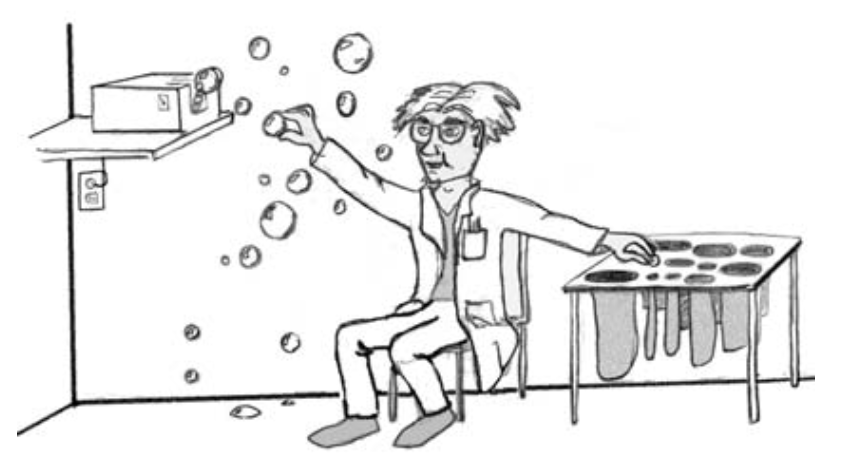
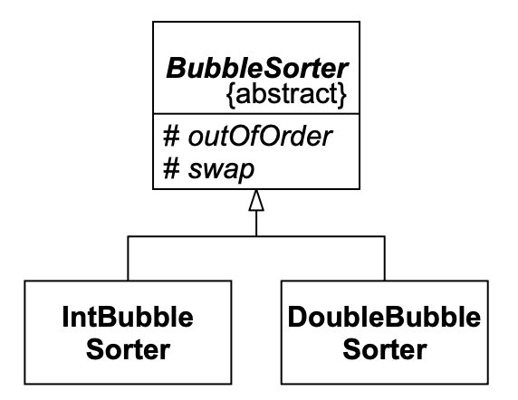
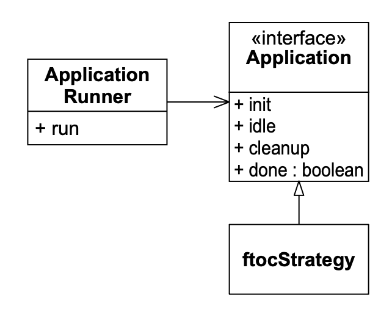

# 14 TEMPLATE METHOD & STRATEGY: 继承与委托

<center></center><br/>

> “生活中最好的策略是勤奋。”
> <p align="righ">——中国谚语</p>

早在 90 年代初 ——OO的早期—— 我们都对继承的概念非常着迷。
这种关系的含义是深远的。
通过继承，我们可以按差异编程！
也就是说，给定某个对我们几乎有用的类，我们可以创建一个子类，只改变我们不喜欢的那部分。
我们可以通过简单地继承来复用代码！
我们可以建立软件结构的完整分类体系，每一层都复用其上层的代码。
这是一个美丽的新世界。

像大多数美丽的新世界一样，这个结果变得有点过于理想化了。
到 1995 年，很明显继承非常容易被过度使用，而过度使用继承的代价是非常高昂的。
Gamma、Helm、Johnson 和 Vlissides 甚至强调：“优先使用对象组合而非类继承。” ¹
因此我们减少了对继承的使用，通常用组合或委托来代替它。

¹ [GOF95]，第 20 页。

本章讲述的是两个模式的故事，它们体现了继承与委托之间的区别。
TEMPLATE METHOD 和 STRATEGY 解决类似的问题，并且通常可以互换使用。
然而，TEMPLATE METHOD 使用继承来解决问题，而 STRATEGY 则使用委托。

<ins>TEMPLATE METHOD 和 STRATEGY 都解决了将通用算法与详细上下文分离的问题。
我们在软件设计中经常看到这种需求。
我们有一个普遍适用的算法。
为了符合依赖倒置原则（DIP），我们希望确保通用算法不依赖于详细实现。
相反，我们希望通用算法和详细实现都依赖于抽象</ins>。

## TEMPLATE METHOD

想一想你写过的所有程序。其中许多可能都有这种基本的**主循环**结构：

```
Initialize();
while (!done()) // main loop
{
    Idle(); // do something useful.
}
Cleanup();
```

首先我们初始化应用程序。
然后我们进入主循环。
在主循环中，我们做程序需要做的事情。
我们可能处理 GUI 事件，或者处理数据库记录。
最后，一旦完成，我们退出主循环并在退出前进行清理。

这种结构如此常见，以至于我们可以将其捕获在一个名为 `Application` 的类中。
然后我们可以为每个想要编写的新程序复用该类。
想想看！我们再也不用写那个循环了！²

² 我这里也有一座桥想卖给你。

例如，考虑 Listing 14-1。
这里我们看到标准程序的所有元素。
`InputStreamReader` 和 `BufferedReader` 被初始化。
有一个主循环从 `BufferedReader` 读取华氏温度读数并打印出摄氏温度转换。
最后，打印退出消息。

Listing 14-1 ftoc raw

```java
import java.io.*;

public class ftocraw
{
    public static void main(String[] args) throws Exception
    {
        InputStreamReader isr = new InputStreamReader(System.in);
        BufferedReader br = new BufferedReader(isr);
        boolean done = false;
        while (!done)
        {
            String fahrString = br.readLine();
            if (fahrString == null || fahrString.length() == 0)
                done = true;
            else
            {
                double fahr = Double.parseDouble(fahrString);
                double celcius = 5.0/9.0*(fahr-32);
                System.out.println("F=" + fahr + ", C=" + celcius);
            }
        }
        System.out.println("ftoc exit");
    }
}
```

这个程序具有主循环结构的所有元素。
它做一些初始化，在主循环中完成工作，然后清理并退出。

我们可以通过应用 TEMPLATE METHOD 模式，将这个基本结构与 ftoc 程序分离。
该模式将所有通用代码放入抽象基类的一个已实现方法中。
这个已实现方法捕获通用算法，但将所有细节延迟到基类的抽象方法中。

因此，例如，我们可以将主循环结构捕获到一个名为 `Application` 的抽象基类中（见 Listing 14-2）。

Listing 14-2 Application.java

```java
public abstract class Application
{
    private boolean isDone = false;

    protected abstract void init();
    protected abstract void idle();
    protected abstract void cleanup();

    protected void setDone() { isDone = true; }
    protected boolean done() { return isDone; }

    public void run()
    {
        init();
        while (!done())
            idle();
        cleanup();
    }
}
```

这个类描述了一个通用的主循环应用程序。
我们可以在已实现的 `run` 函数中看到主循环。
我们也可以看到所有工作都被延迟到抽象方法 `init`、`idle` 和 `cleanup` 中。
`init` 方法处理我们需要的任何初始化。
`idle` 方法完成程序的主要工作，并将被重复调用，直到调用 `setDone` 为止。
`cleanup` 方法在我们退出之前处理任何需要做的事情。

我们可以通过继承 `Application` 并只填充抽象方法来重写 `ftoc` 类。
Listing 14-3 显示了它的样子。

Listing 14-3 ftocTemplateMethod.java

```java
import java.io.*;

public class ftocTemplateMethod extends Application
{
    private InputStreamReader isr;
    private BufferedReader br;

    public static void main(String[] args) throws Exception
    {
        (new ftocTemplateMethod()).run();
    }

    protected void init()
    {
        isr = new InputStreamReader(System.in);
        br = new BufferedReader(isr);
    }

    protected void idle()
    {
        String fahrString = readLineAndReturnNullIfError();
        if (fahrString == null || fahrString.length() == 0)
            setDone();
        else
        {
            double fahr = Double.parseDouble(fahrString);
            double celcius = 5.0/9.0*(fahr-32);
            System.out.println("F=" + fahr + ", C=" + celcius);
        }
    }

    protected void cleanup()
    {
        System.out.println("ftoc exit");
    }

    private String readLineAndReturnNullIfError()
    {
        String s;
        try
        {
            s = br.readLine();
        }
        catch(IOException e)
        {
            s = null;
        }
        return s;
    }
}
```

处理异常使代码稍微变长了一些，但很容易看出原来的 ftoc 应用程序是如何被适配到 TEMPLATE METHOD 模式中的。

### 模式滥用

此时你应该在想：<i>“他是认真的吗？他真的期望我所有的应用程序都使用这个 `Application` 类吗？
它没有给我带来任何好处，反而使问题过于复杂了。”</i>

我选择这个例子是因为它简单，并且为展示 TEMPLATE METHOD 的机制提供了一个好的平台。
另一方面，我并不真正推荐像这样构建 ftoc。

这是一个模式滥用的好例子。
对这个特定的应用程序使用 TEMPLATE METHOD 是荒谬的。
它使程序复杂化并变得更大。
封装宇宙中每个应用程序的主循环在我们开始时听起来很美妙，但在实际应用中，在这种情况下是徒劳的。

设计模式是美好的事物。
它们可以帮助你解决许多设计问题。
但它们的存在并不意味着它们应该总是被使用。
在这种情况下，虽然 TEMPLATE METHOD 适用于该问题，但使用它并不可取。
模式成本高于其产生的好处。

因此，让我们看一个更有用的例子（见 Listing 14-4 ）。

### 冒泡排序 ³

<br/>

³ 就像 Application 一样，没有人会真的在实际中使用冒泡排序，如果有大量排序要做的话。
有更好的算法。冒泡排序易于理解，因此是一个有用的教学工具。

Listing 14-4 BubbleSorter.java

```java
public class BubbleSorter
{
    static int operations = 0;

    public static int sort(int [] array)
    {
        operations = 0;
        if (array.length <= 1)
            return operations;

        for (int nextToLast = array.length-2;
            nextToLast >= 0; nextToLast--)
            for (int index = 0; index <= nextToLast; index++)
                compareAndSwap(array, index);

        return operations;
    }

    private static void swap(int[] array, int index)
    {
        int temp = array[index];
        array[index] = array[index+1];
        array[index+1] = temp;
    }

    private static void compareAndSwap(int[] array, int index)
    {
        if (array[index] > array[index+1])
            swap(array, index);
        operations++;
    }
}
```

`BubbleSorter` 类知道如何使用冒泡排序算法对整数数组进行排序。
`BubbleSorter` 的 `sort` 方法包含知道如何执行冒泡排序的算法。
两个辅助方法 `swap` 和 `compareAndSwap` 处理整数和数组的细节，并处理排序算法所需的机制。

使用 TEMPLATE METHOD 模式，我们可以将冒泡排序算法分离到一个名为 `BubbleSorter` 的抽象基类中。
`BubbleSorter` 包含 `sort` 函数的一个实现，该函数调用一个名为 `outOfOrder` 的抽象方法和另一个名为 `swap` 的方法。
`outOfOrder` 方法比较数组中两个相邻元素，如果元素顺序不对则返回 true。
`swap` 方法交换数组中两个相邻单元。

`sort` 方法不知道数组，也不关心数组中存储的是哪种对象。
它只是为数组中的各种索引调用 `outOfOrder`，并确定这些索引是否应该被交换。
（见 Listing 14-5 。）

Listing 14-5 BubbleSorter.java

```java
public abstract class BubbleSorter
{
    private int operations = 0;
    protected int length = 0;

    protected int doSort()
    {
        operations = 0;
        if (length <= 1)
            return operations;

        for (int nextToLast = length-2;
            nextToLast >= 0; nextToLast--)
            for (int index = 0; index <= nextToLast; index++)
            {
                if (outOfOrder(index))
                    swap(index);
                operations++;
            }
        return operations;
    }

    protected abstract void swap(int index);
    protected abstract boolean outOfOrder(int index);
}
```

有了 `BubbleSorter`，我们现在可以创建简单的派生类来排序任何不同类型的对象。
例如，我们可以创建 `IntBubbleSorter`（排序整数数组）和 `DoubleBubbleSorter`（排序双精度数组）。
（见 Fig 14-1、Listing 14-6 和 Listing 14-7。）

<br/>
*Fig 14-1 BubbleSorter 结构*

Listing 14-6 IntBubbleSorter.java

```java
public class IntBubbleSorter extends BubbleSorter
{
    private int[] array = null;

    public int sort(int [] theArray)
    {
        array = theArray;
        length = array.length;
        return doSort();
    }

    protected void swap(int index)
    {
        int temp = array[index];
        array[index] = array[index+1];
        array[index+1] = temp;
    }

    protected boolean outOfOrder(int index)
    {
        return (array[index] > array[index+1]);
    }
}
```

Listing 14-7 DoubleBubbleSorter.java

```java
public class DoubleBubbleSorter extends BubbleSorter
{
    private double[] array = null;

    public int sort(double [] theArray)
    {
        array = theArray;
        length = array.length;
        return doSort();
    }

    protected void swap(int index)
    {
        double temp = array[index];
        array[index] = array[index+1];
        array[index+1] = temp;
    }

    protected boolean outOfOrder(int index)
    {
        return (array[index] > array[index+1]);
    }
}
```

TEMPLATE METHOD 模式展示了面向对象编程中经典的复用形式之一。
通用算法被放置在基类中，并被继承到不同的详细上下文中。
但这种技术并非没有代价。
继承是一种非常强的关联关系。
派生类与其基类密不可分地绑定在一起。

例如，`IntBubbleSorter` 的 `outOfOrder` 和 `swap` 函数正是其他排序算法所需要的。
然而，没有办法在其他排序算法中复用 `outOfOrder` 和 `swap`。
通过继承 `BubbleSorter`，我们使 `IntBubbleSorter` 永远绑定于 `BubbleSorter`。

STRATEGY 模式提供了另一种选择。

## STRATEGY

STRATEGY 模式以一种非常不同的方式解决了通用算法与详细实现之间的依赖倒置问题。
再次考虑模式滥用的 Application 问题。

我们不是将通用应用程序算法放入抽象基类，而是将其放入一个名为 `ApplicationRunner` 的具体类中。
我们定义一个接口 `Application`，其中包含通用算法必须调用的抽象方法。
我们从该接口派生 `ftocStrategy`，并将其传入 `ApplicationRunner`。
然后 `ApplicationRunner` 委托给该接口。
（见 Fig 14-2，以及 Listing 14-8 到 14-10。）

<br/>
*Fig 14-2 Application 算法的 Strategy 结构*

Listing 14-8 ApplicationRunner.java

```java
public class ApplicationRunner
{
    private Application itsApplication = null;

    public ApplicationRunner(Application app)
    {
        itsApplication = app;
    }

    public void run()
    {
        itsApplication.init();
        while (!itsApplication.done())
            itsApplication.idle();
        itsApplication.cleanup();
    }
}
```

Listing 14-9 Application.java

```java
public interface Application
{
    public void init();
    public void idle();
    public void cleanup();
    public boolean done();
}
```

Listing 14-10 ftocStrategy.java

```java
import java.io.*;

public class ftocStrategy implements Application
{
    private InputStreamReader isr;
    private BufferedReader br;
    private boolean isDone = false;

    public static void main(String[] args) throws Exception
    {
        (new ApplicationRunner(new ftocStrategy())).run();
    }

    public void init()
    {
        isr = new InputStreamReader(System.in);
        br = new BufferedReader(isr);
    }

    public void idle()
    {
        String fahrString = readLineAndReturnNullIfError();
        if (fahrString == null || fahrString.length() == 0)
            isDone = true;
        else
        {
            double fahr = Double.parseDouble(fahrString);
            double celcius = 5.0/9.0*(fahr-32);
            System.out.println("F=" + fahr + ", C=" + celcius);
        }
    }

    public void cleanup()
    {
        System.out.println("ftoc exit");
    }

    public boolean done()
    {
        return isDone;
    }

    private String readLineAndReturnNullIfError()
    {
        String s;
        try
        {
            s = br.readLine();
        }
        catch(IOException e)
        {
            s = null;
        }
        return s;
    }
}
```

应该清楚的是，这种结构与 TEMPLATE METHOD 结构相比，既有好处也有代价。
STRATEGY 涉及更多的总类和更多的间接层。
`ApplicationRunner` 中的委托指针在运行时和数据空间方面比继承略高一些。
另一方面，如果我们有许多不同的应用程序要运行，我们可以重用 `ApplicationRunner` 实例，
并传入许多不同的 `Application` 实现，从而减少通用算法与其控制的细节之间的耦合。

这些成本与收益都不是压倒性的。
在大多数情况下，它们都不重要。
在典型情况下，最令人担忧的是 STRATEGY 模式需要的额外类。
然而，还有更多需要考虑。

### 再次讨论排序

考虑使用 STRATEGY 模式实现冒泡排序（见 Listing 14-11 至 14-13）。

Listing 14-11 BubbleSorter.java

```java
public class BubbleSorter
{
    private int operations = 0;
    private int length = 0;
    private SortHandle itsSortHandle = null;

    public BubbleSorter(SortHandle handle)
    {
        itsSortHandle = handle;
    }

    public int sort(Object array)
    {
        itsSortHandle.setArray(array);
        length = itsSortHandle.length();
        operations = 0;
        if (length <= 1)
            return operations;

        for (int nextToLast = length-2;
            nextToLast >= 0; nextToLast--)
            for (int index = 0; index <= nextToLast; index++)
            {
                if (itsSortHandle.outOfOrder(index))
                    itsSortHandle.swap(index);
                operations++;
            }
        return operations;
    }
}
```

Listing 14-12 SortHandle.java

```java
public interface SortHandle
{
    public void swap(int index);
    public boolean outOfOrder(int index);
    public int length();
    public void setArray(Object array);
}
```

Listing 14-13 IntSortHandle.java

```java
public class IntSortHandle implements SortHandle
{
    private int[] array = null;

    public void swap(int index)
    {
        int temp = array[index];
        array[index] = array[index+1];
        array[index+1] = temp;
    }

    public void setArray(Object array)
    {
        this.array = (int[])array;
    }

    public int length()
    {
        return array.length;
    }

    public boolean outOfOrder(int index)
    {
        return (array[index] > array[index+1]);
    }
}
```

注意，`IntSortHandle` 类对 `BubbleSorter` 一无所知。
它对冒泡排序的实现没有任何依赖。
而 TEMPLATE METHOD 模式并非如此。
回顾 Listing 14-6，你可以看到 `IntBubbleSorter` 直接依赖于 `BubbleSorter` —— 包含冒泡排序算法的类。

TEMPLATE METHOD 方法通过使 `swap` 和 `outOfOrder` 方法直接依赖于冒泡排序算法，部分违反了 DIP。
STRATEGY 方法不包含这种依赖。
因此，我们可以将 `IntSortHandle` 与 `BubbleSorter` 之外的其他 Sorter 实现一起使用。

例如，我们可以创建一个冒泡排序的变体，如果一次遍历发现数组已经有序，则提前终止（见 Listing 14-14）。
`QuickBubbleSorter` 也可以使用 `IntSortHandle` 或任何其他从 `SortHandle` 派生的类。

Listing 14-14 QuickBubbleSorter.java

```java
public class QuickBubbleSorter
{
    private int operations = 0;
    private int length = 0;
    private SortHandle itsSortHandle = null;

    public QuickBubbleSorter(SortHandle handle)
    {
        itsSortHandle = handle;
    }

    public int sort(Object array)
    {
        itsSortHandle.setArray(array);
        length = itsSortHandle.length();
        operations = 0;
        if (length <= 1)
            return operations;

        boolean thisPassInOrder = false;
        for (int nextToLast = length-2; nextToLast >= 0 && !thisPassInOrder; nextToLast--)
        {
            thisPassInOrder = true; // 可能有序
            for (int index = 0; index <= nextToLast; index++)
            {
                if (itsSortHandle.outOfOrder(index))
                {
                    itsSortHandle.swap(index);
                    thisPassInOrder = false;
                }
                operations++;
            }
        }
        return operations;
    }
}
```

因此，STRATEGY 模式比 TEMPLATE METHOD 模式多提供了一个好处。
TEMPLATE METHOD 模式允许一个通用算法操作许多可能的详细实现，而 STRATEGY 模式通过完全遵循 DIP，允许每个详细实现被许多不同的通用算法操作。

## 结论

<ins>TEMPLATE METHOD 和 STRATEGY 都允许你将高层算法与低层细节分离。
两者都允许高层算法独立于细节进行复用。
以多一点点复杂性、内存和运行时为代价，STRATEGY 还允许细节独立于高层算法进行复用</ins>。

## 参考文献

1. Gamma, et al. *Design Patterns*. Reading, MA: Addison–Wesley, 1995.
2. Martin, Robert C., et al. *Pattern Languages of Program Design 3*. Reading, MA: Addison–Wesley, 1998.
