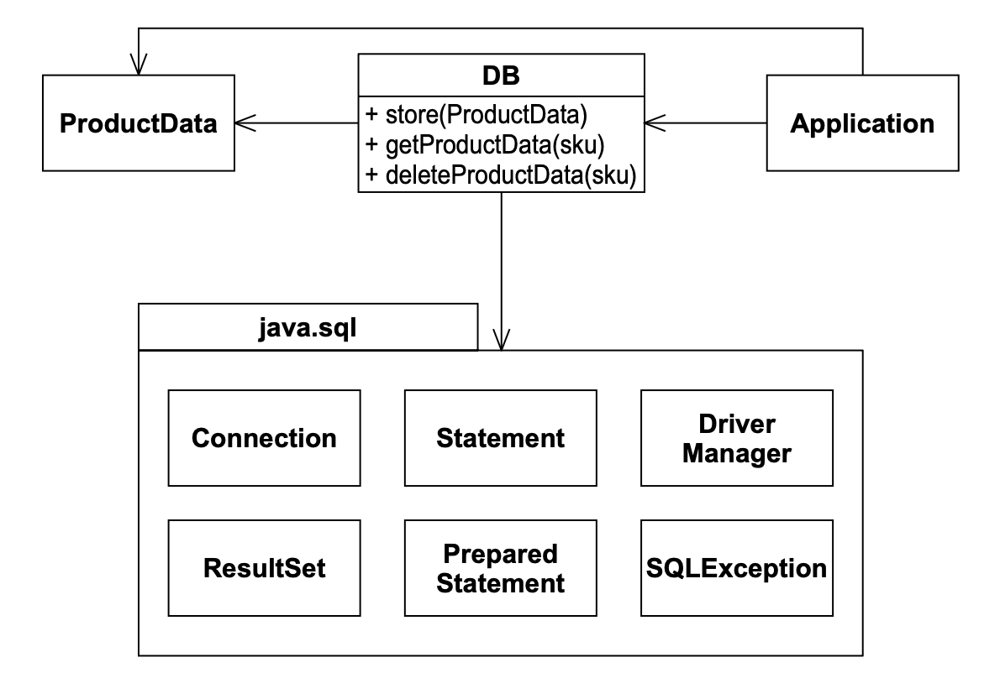
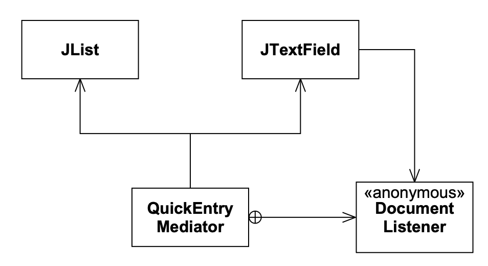

# 15 FACADE 和 MEDIATOR

<center></center><br/>

> 象征主义竖起尊重的门面，以隐藏梦想的不雅。
> <p align="right">——Mason Cooley</p>

本章讨论的两个模式有着共同的目的。
两者都对另一组对象施加某种策略。
FACADE 从上方施加策略，而 MEDIATOR 从下方施加策略。
FACADE 的使用是可见且约束性的，而 MEDIATOR 的使用是不可见且赋能性的。

## FACADE

<ins>当你想要为一组具有复杂通用接口的对象提供一个简单且特定的接口时，可以使用 FACADE 模式</ins>。
例如，考虑第 333 页 Listing 26-9 中的 DB.java。
该类在 java.sql 包中类的复杂通用接口之上，施加了一个非常简单的、特定于 ProductData 的接口。
Fig 15-1 显示了该结构。

注意，DB 类保护了 Application，使其无需了解 java.sql 包的内部细节。
它将 java.sql 的所有通用性和复杂性隐藏在一个非常简单且特定的接口之后。

像 DB 这样的 FACADE 对 java.sql 包的使用施加了许多策略。
它知道如何初始化和关闭数据库连接。
它知道如何将 ProductData 的成员翻译成数据库字段并转换回来。
它知道如何构建适当的查询和命令来操作数据库。
它将这些复杂性全部隐藏在其使用者面前。
从 Application 的角度来看，java.sql 并不存在；它被隐藏在 FACADE 之后。

<br/>
*Fig 15-1 DB FACADE*

FACADE 模式的使用意味着开发人员已采用所有数据库调用必须通过 DB 的约定。
如果 Application 代码的任何部分直接访问 java.sql 而不是通过 FACADE，则该约定被违反。
因此，FACADE 将其策略强加于应用程序。
通过约定，DB 已成为 java.sql 设施的唯一代理。

## MEDIATOR

<ins>MEDIATOR 模式也施加策略。然而，FACADE 以可见且约束性的方式施加其策略，而 MEDIATOR 以隐藏且无约束的方式施加其策略</ins>。
例如，Listing 15-1 中的 `QuickEntryMediator` 类是一个安静地工作在幕后、将文本输入字段绑定到列表的类。
当你在文本输入字段中键入时，列表中与你键入内容匹配的第一个元素会被高亮。
这让你可以键入缩写并快速选择列表项。

Listing 15-1 QuickEntryMediator.java

```java
package utility;

import javax.swing.*;
import javax.swing.event.*;

/**
QuickEntryMediator. This class takes a JTextField and a JList.
It assumes that the user will type characters into the
JTextField that are prefixes of entries in the JList. It
automatically selects the first item in the JList that matches
the current prefix in the JTextField.

If the JTextField is null, or the prefix does not match any
element in the JList, then the JList selection is cleared.
There are no methods to call for this object. You simply
create it, and forget it. (But don't let it be garbage
collected...)

Example:

JTextField t = new JTextField();
JList l = new JList();

QuickEntryMediator qem = new QuickEntryMediator(t, l);

// that's all folks.

@author Robert C. Martin, Robert S. Koss
@date 30 Jun, 1999 2113 (SLAC)
*/
public class QuickEntryMediator {
    public QuickEntryMediator(JTextField t, JList l) {
        itsTextField = t;
        itsList = l;
        itsTextField.getDocument().addDocumentListener(
            new DocumentListener() {
                public void changedUpdate(DocumentEvent e) {
                    textFieldChanged();
                }
                public void insertUpdate(DocumentEvent e) {
                    textFieldChanged();
                }
                public void removeUpdate(DocumentEvent e) {
                    textFieldChanged();
                }
            } // new DocumentListener
        ); // addDocumentListener
    } // QuickEntryMediator()

    private void textFieldChanged() {
        String prefix = itsTextField.getText();
        if (prefix.length() == 0) {
            itsList.clearSelection();
            return;
        }
        ListModel m = itsList.getModel();
        boolean found = false;
        for (int i = 0; found == false && i < m.getSize(); i++) {
            Object o = m.getElementAt(i);
            String s = o.toString();
            if (s.startsWith(prefix)) {
                itsList.setSelectedValue(o, true);
                found = true;
            }
        }
        if (!found) {
            itsList.clearSelection();
        }
    } // textFieldChanged

    private JTextField itsTextField;
    private JList itsList;
} // class QuickEntryMediator
```

`QuickEntryMediator` 的结构如 Fig 15-2 所示。
`QuickEntryMediator` 的实例使用 `JList` 和 `JTextField` 构造。
`QuickEntryMediator` 向 `JTextField` 注册一个匿名 `DocumentListener`。
每当文本发生变化时，该监听器调用 `textFieldChanged` 方法。
然后该方法找到 `JList` 中以该文本为前缀的元素并选中它。

<br/>
*Fig 15-2 QuickEntryMediator 结构*

JList 和 JTextField 的使用者完全不知道这个 MEDIATOR 的存在。
它安静地坐在那里，在那些对象未经许可或不知情的情况下，将它的策略施加于它们。

## 结论

如果需要宏大且可见的策略，可以从上方使用 FACADE 来施加。
另一方面，如果需要微妙和谨慎，MEDIATOR 可能是更合适的选择。
Facade 通常是某种约定的焦点 —— 每个人都同意使用 facade 而不是其底层的对象。
而 Mediator 则对使用者隐藏，它的策略是既成事实，而非约定。

## 参考文献

1. Gamma, et al. *Design Patterns*. Reading, MA: Addison–Wesley, 1995.
