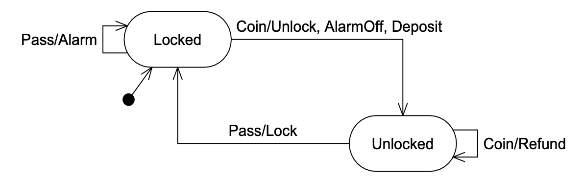

# 16 SINGLETON 和 MONOSTATE

<center></center><br/>

> “存在的无限祝福！它存在；此外别无他物。”
> <p align="right">The point. Flatland, Edwin A. Abbott</p>

通常情况下，类和实例之间是一对多的关系。
你可以创建大多数类的许多实例。
实例在需要时被创建，在有用性结束时被销毁。
它们在内存分配和释放的流动中来去。

然而，有些类应该只有一个实例。
该实例应该看起来是在程序启动时出现，并且仅在程序结束时才被销毁。
这样的对象有时是应用程序的根。
从根出发，你可以找到通往系统中许多其他对象的路径。
有时它们是工厂，你可以用它们来创建系统中的其他对象。
有时这些对象是管理者，负责跟踪某些其他对象并驱动它们完成其工作。

无论这些对象是什么，如果创建了多于一个的实例，都是一个严重的逻辑错误。
如果创建了多个根，则对应用程序中对象的访问可能取决于所选的根。
程序员在不知道存在多个根的情况下，可能会发现自己正在查看应用程序对象的子集而不自知。
如果存在多个工厂，则对已创建对象的行政控制可能会受到损害。
如果存在多个管理者，本意是串行的活动可能变成并发的。

## SINGLETON ¹

SINGLETON 是一个非常简单的模式。
Listing 16-1 中的测试用例展示了它应该如何工作。
第一个测试函数显示 Singleton 实例通过公共静态方法 `Instance` 访问。
它还显示，如果多次调用 `Instance`，每次都会返回对完全相同实例的引用。
第二个测试用例显示 Singleton 类没有公共构造函数，因此除了使用 `Instance` 方法之外，没有人能够创建实例。

¹ [GOF95]，第 127 页。

Listing 16-1 Singleton 测试用例

```java
import junit.framework.*;
import java.lang.reflect.Constructor;

public class TestSimpleSingleton extends TestCase
{
    public TestSimpleSingleton(String name)
    {
        super(name);
    }

    public void testCreateSingleton()
    {
        Singleton s = Singleton.Instance();
        Singleton s2 = Singleton.Instance();
        assertSame(s, s2);
    }

    public void testNoPublicConstructors() throws Exception
    {
        Class singleton = Class.forName("Singleton");
        Constructor[] constructors = singleton.getConstructors();
        assertEquals("public constructors.",
            0, constructors.length);
    }
}
```

该测试用例是 SINGLETON 模式的规范。
它直接导致 Listing 16-2 中显示的代码。
通过检查此代码，应该清楚在静态变量 `Singleton.theInstance` 的作用域内，
永远不可能有超过一个 `Singleton` 类的实例。

Listing 16-2 Singleton 实现

```java
public class Singleton
{
    private static Singleton theInstance = null;
    private Singleton() {}
    public static Singleton Instance()
    {
        if (theInstance == null)
            theInstance = new Singleton();
        return theInstance;
    }
}
```

### SINGLETON 的优点

- **跨平台**。
使用适当的中间件（如 RMI），SINGLETON 可以扩展到跨多个 JVM 和多台计算机。

- **适用于任何类**。
只需将构造函数设为私有，并添加适当的静态函数和变量，你就可以将任何类改为 SINGLETON。

- **可以通过派生创建**。
给定一个类，你可以创建一个子类，使其成为 SINGLETON。

- **惰性求值**。
如果 SINGLETON 从未被使用，它就不会被创建。

### SINGLETON 的缺点

- **销毁未定义**。
没有好的方法来销毁或废弃 SINGLETON。
如果你添加一个将 `theInstance` 置空的废弃方法，系统中的其他模块可能仍然持有对 SINGLETON 实例的引用。
随后对 `Instance` 的调用将导致创建另一个实例，从而出现两个并发实例并存。
这个问题在 C++ 中尤其严重，因为实例可能被销毁，导致可能对已销毁对象的解引用。

- **不可继承**。
从 SINGLETON 派生的类不是单例。
如果它需要是 SINGLETON，则需要为其添加静态函数和变量。

- **效率**。
每次调用 `Instance` 都会执行 `if` 语句。
对于大多数调用，`if` 语句是无用的。

- **非透明**。
SINGLETON 的使用者知道他们在使用 SINGLETON，因为他们必须调用 `Instance` 方法。

### SINGLETON 的应用

假设我们有一个基于 Web 的系统，允许用户登录到 Web 服务器的安全区域。
这样的系统将有一个包含用户名、密码和其他用户属性的数据库。
进一步假设数据库是通过第三方 API 访问的。
我们可以直接在需要读写用户的每个模块中访问数据库。
但这会使第三方 API 的使用分散在整个代码中，并且没有地方来强制执行访问或结构约定。

更好的解决方案是使用 FACADE 模式，创建一个 `UserDatabase` 类，提供读写 `User` 对象的方法。
这些方法访问数据库的第三方 API，在 `User` 对象与数据库的表和行之间进行转换。
在 `UserDatabase` 内部，我们可以强制执行结构和访问约定。
例如，我们可以保证除非有非空用户名，否则不写入任何 `User` 记录。
或者我们可以序列化对 `User` 记录的访问，确保两个模块不能同时读写它。

Listing 16-3 UserDatabase 接口

```java
public interface UserDatabase
{
    User readUser(String userName);
    void writeUser(User user);
}
```

Listing 16-4 UserDatabaseSource Singleton

```java
public class UserDatabaseSource implements UserDatabase
{
    private static UserDatabase theInstance =
        new UserDatabaseSource();

    public static UserDatabase instance()
    {
        return theInstance;
    }

    private UserDatabaseSource() {}

    public User readUser(String userName)
    {
        // Some Implementation
        return null; // just to make it compile.
    }

    public void writeUser(User user)
    {
        // Some Implementation
    }
}
```

这是 SINGLETON 模式的一种极其常见的用法。
它确保所有数据库访问都通过 `UserDatabaseSource` 的单个实例进行。
这使得在 `UserDatabaseSource` 中放置检查、计数器和锁变得容易，从而强制执行前面提到的访问和结构约定。

## MONOSTATE ²

MONOSTATE 模式是实现单一性 (singularity) 的另一种方式。
它通过一种完全不同的机制工作。
我们可以通过研究 Listing 16-5 中的 MONOSTATE 测试用例来了解该机制的工作原理。

² [BALL2000] 。

第一个测试函数简单地描述了一个对象，其 `x` 变量可以被设置和检索。
但第二个测试用例显示，同一类的两个实例表现得像是一个实例。如果你在一个实例上将 `x` 变量设置为某个特定值，你可以通过获取另一个实例的 `x` 变量来检索该值。就好像这两个实例只是同一个对象的不同名称。

Listing 16-5 Monostate 测试用例

```java
import junit.framework.*;

public class TestMonostate extends TestCase
{
    public TestMonostate(String name)
    {
        super(name);
    }

    public void testInstance()
    {
        Monostate m = new Monostate();
        for (int x = 0; x<10; x++)
        {
            m.setX(x);
            assertEquals(x, m.getX());
        }
    }

    public void testInstancesBehaveAsOne()
    {
        Monostate m1 = new Monostate();
        Monostate m2 = new Monostate();
        for (int x = 0; x<10; x++)
        {
            m1.setX(x);
            assertEquals(x, m2.getX());
        }
    }
}
```

如果我们把 Singleton 类放到这个测试用例中，并将所有 `new Monostate()` 语句替换为对 `Singleton.Instance()` 的调用，测试用例应该仍然通过。
<ins>因此，这个测试用例描述了 Singleton 的行为，但没有施加单个实例的约束</ins>！

<ins>两个实例怎么能表现得像同一个对象一样？
很简单，这意味着这两个对象必须共享相同的变量。
这很容易通过将所有变量设为静态来实现</ins>。
Listing 16-6 显示了通过上述测试用例的 Monostate 实现。
注意 `itsX` 变量是静态的。
还要注意，没有任何方法是静态的。
这一点很重要，我们稍后会看到。

Listing 16-6 Monostate 实现

```java
public class Monostate
{
    private static int itsX = 0;

    public Monostate() {}

    public void setX(int x)
    {
        itsX = x;
    }

    public int getX()
    {
        return itsX;
    }
}
```

我发现这是一个令人愉快的扭曲模式。
无论你创建多少个 `Monostate` 实例，它们都表现得像是同一个对象。
你甚至可以销毁或废弃所有当前实例而不会丢失数据。

<ins>注意，这两个模式之间的区别是行为与结构的区别。
SINGLETON 模式强制实行单一性的结构 —— 它防止创建多于一个实例。
而 MONOSTATE 在不施加结构约束的情况下强制实行单一性的行为。
为了强调这种差异，考虑 MONOSTATE 测试用例对 Singleton 类是有效的，
但 SINGLETON 测试用例对 Monostate 类甚至远非有效</ins>。

### MONOSTATE 的优点

- **透明性**。
MONOSTATE 的使用者与普通对象的使用者行为无异。
使用者不需要知道该对象是 MONOSTATE。

- **可派生性**。
MONOSTATE 的派生类也是 MONOSTATE。
实际上，MONOSTATE 的所有派生类都是同一 MONOSTATE 的一部分 —— 它们都共享相同的静态变量。

- **多态性**。
由于 MONOSTATE 的方法不是静态的，
它们可以在派生类中被重写。
因此，不同的派生类可以在同一组静态变量上提供不同的行为。

- **明确定义的创建和销毁**。
MONOSTATE 的变量是静态的，因此具有明确定义的创建和销毁时间。

### MONOSTATE 的缺点

- **无法转换**。
普通类不能通过派生转换为 MONOSTATE 类。

- **效率**。
MONOSTATE 可能会经历多次创建和销毁，因为它是真正的对象。这些操作通常代价较高。

- **存在性**。
即使 MONOSTATE 从未被使用，其变量也占用空间。

- **平台局限**。
你不能让 MONOSTATE 在多个 JVM 实例或多个平台上工作。

### MONOSTATE 的应用

考虑为地铁闸机实现一个简单的有限状态机，如 Fig 16-1 所示。
闸机从 `Locked` 状态开始其生命周期。
如果投入硬币，它转换到 `Unlocked` 状态，解锁闸门，重置可能存在的任何警报状态，并将硬币存入其收集箱。
如果此时用户通过闸门，闸机转换回 `Locked` 状态并锁住闸门。

有两种异常情况。如果用户在通过闸门前投入两枚或更多硬币，硬币将被退还，闸门保持解锁状态。
如果用户未经付费通过，则警报响起，闸门保持锁定状态。

描述此操作的测试程序如 Listing 16-7 所示。
注意，测试方法假设 `Turnstile` 是 Monostate。
它期望能够从不同的实例发送事件和收集查询。
如果永远不会有多于一个 `Turnstile` 的实例，这是合理的。

<br/>
*Fig 16-1 地铁闸机有限状态机*

Listing 16-7 TestTurnstile

```java
import junit.framework.*;

public class TestTurnstile extends TestCase
{
    public TestTurnstile(String name)
    {
        super(name);
    }

    public void setUp()
    {
        Turnstile t = new Turnstile();
        t.reset();
    }

    public void testInit()
    {
        Turnstile t = new Turnstile();
        assert(t.locked());
        assert(!t.alarm());
    }

    public void testCoin()
    {
        Turnstile t = new Turnstile();
        t.coin();
        Turnstile t1 = new Turnstile();
        assert(!t1.locked());
        assert(!t1.alarm());
        assertEquals(1, t1.coins());
    }

    public void testCoinAndPass()
    {
        Turnstile t = new Turnstile();
        t.coin();
        t.pass();
        Turnstile t1 = new Turnstile();
        assert(t1.locked());
        assert(!t1.alarm());
        assertEquals("coins", 1, t1.coins());
    }

    public void testTwoCoins()
    {
        Turnstile t = new Turnstile();
        t.coin();
        t.coin();
        Turnstile t1 = new Turnstile();
        assert("unlocked", !t1.locked());
        assertEquals("coins",1, t1.coins());
        assertEquals("refunds", 1, t1.refunds());
        assert(!t1.alarm());
    }

    public void testPass()
    {
        Turnstile t = new Turnstile();
        t.pass();
        Turnstile t1 = new Turnstile();
        assert("alarm", t1.alarm());
        assert("locked", t1.locked());
    }

    public void testCancelAlarm()
    {
        Turnstile t = new Turnstile();
        t.pass();
        t.coin();
        Turnstile t1 = new Turnstile();
        assert("alarm", !t1.alarm());
        assert("locked", !t1.locked());
        assertEquals("coin", 1, t1.coins());
        assertEquals("refund", 0, t1.refunds());
    }

    public void testTwoOperations()
    {
        Turnstile t = new Turnstile();
        t.coin();
        t.pass();
        t.coin();
        assert("unlocked", !t.locked());
        assertEquals("coins", 2, t.coins());
        t.pass();
        assert("locked", t.locked());
    }
}
```

Monostate `Turnstile` 的实现如 Listing 16-8 所示。
基类 `Turnstile` 将两个事件函数（`coin` 和 `pass`）委托给代表有限状态机状态的 `Turnstile` 的两个派生类（`Locked` 和 `Unlocked`）。

Listing 16-8 Turnstile

```java
public class Turnstile
{
    private static boolean isLocked = true;
    private static boolean isAlarming = false;
    private static int itsCoins = 0;
    private static int itsRefunds = 0;

    protected final static Turnstile LOCKED = new Locked();
    protected final static Turnstile UNLOCKED = new Unlocked();
    protected static Turnstile itsState = LOCKED;

    public void reset()
    {
        lock(true);
        alarm(false);
        itsCoins = 0;
        itsRefunds = 0;
        itsState = LOCKED;
    }

    public boolean locked()
    {
        return isLocked;
    }

    public boolean alarm()
    {
        return isAlarming;
    }

    public void coin()
    {
        itsState.coin();
    }

    public void pass()
    {
        itsState.pass();
    }

    protected void lock(boolean shouldLock)
    {
        isLocked = shouldLock;
    }

    protected void alarm(boolean shouldAlarm)
    {
        isAlarming = shouldAlarm;
    }

    public int coins()
    {
        return itsCoins;
    }

    public int refunds()
    {
        return itsRefunds;
    }

    protected void addCoins(int c)
    {
        itsCoins += c;
    }

    protected void addRefunds(int r)
    {
        itsRefunds += r;
    }

    public int refunds()
    {
        return itsRefunds;
    }

    public void deposit()
    {
        itsCoins++;
    }

    public void refund()
    {
        itsRefunds++;
    }
}

class Locked extends Turnstile
{
    public void coin()
    {
        itsState = UNLOCKED;
        lock(false);
        alarm(false);
        deposit();
    }

    public void pass()
    {
        alarm(true);
    }
}

class Unlocked extends Turnstile
{
    public void coin()
    {
        refund();
    }

    public void pass()
    {
        lock(true);
        itsState = LOCKED;
    }
}
```

这个例子展示了 MONOSTATE 模式的一些有用特性。
它利用了 MONOSTATE 派生类可以是多态的，以及 MONOSTATE 派生类本身也是 MONOSTATE 这一事实。
这个例子也展示了有时将 MONOSTATE 转换为普通类是多么困难。
该解决方案的结构强烈依赖于 `Turnstile` 的 MONOSTATE 性质。
如果我们需要用这个有限状态机控制多个闸机，则代码将需要一些重要的重构。

<ins>也许你对这个例子中继承的非常规使用感到担忧。
`Unlocked` 和 `Locked` 从 `Turnstile` 派生，这似乎违反了正常的 OO 原则。
然而，由于 `Turnstile` 是 MONOSTATE，它没有单独的实例。
因此，`Unlocked` 和 `Locked` 并不是真正独立的对象。
相反，它们是 `Turnstile` 抽象的一部分。
`Unlocked` 和 `Locked` 可以访问与 `Turnstile` 相同的变量和方法</ins>。

<i>「译注：
 回到章节开头的动机，需要 "单一性" 的对象包括：

 - 应用根对象（application root）—— 从它出发能找到系统其他对象的路径；
 - 工厂（factory）—— 用来创建系统中的其他对象；
 - 管理者（manager）—— 跟踪并驱动其他对象完成工作。

 这些和 SINGLETON 的用途是同一批。
 MONOSTATE 是 "行为上强制单一" 的另一种实现手段，只要满足以下任一需求就适合：

 1. 单一性对使用者透明（使用者像用普通对象一样 new，无需知道是单例）；
 2. 需要对单一对象做多态派生（SINGLETON 做不到这点，MONOSTATE 可以）。

 典型例子：共享配置、全局日志、计数器、缓存、服务定位器等。」</i>

## 结论

通常需要强制执行某个特定对象只有单一实例的约束。
本章展示了两种非常不同的技术。
SINGLETON 使用私有构造函数、静态变量和静态函数来控制并限制实例化。
MONOSTATE 简单地将对象的所有变量设为静态。

当你有一个现有的类，希望通过派生来约束它，并且不介意每个人都必须调用 `instance()` 方法来访问时，SINGLETON 是最佳选择。
当你希望类的单一性质对用户透明，或者当你希望使用单对象的多态派生类时，MONOSTATE 是最佳选择。

## 参考文献

1. Gamma, et al. *Design Patterns*. Reading, MA: Addison–Wesley, 1995.
2. Martin, Robert C., et al. *Pattern Languages of Program Design 3*. Reading, MA: Addison–Wesley, 1998.
3. Ball, Steve, and John Crawford. *Monostate Classes: The Power of One*. Published in *More C++ Gems*, compiled by Robert C. Martin. Cambridge, UK: Cambridge University Press, 2000, p. 223.
