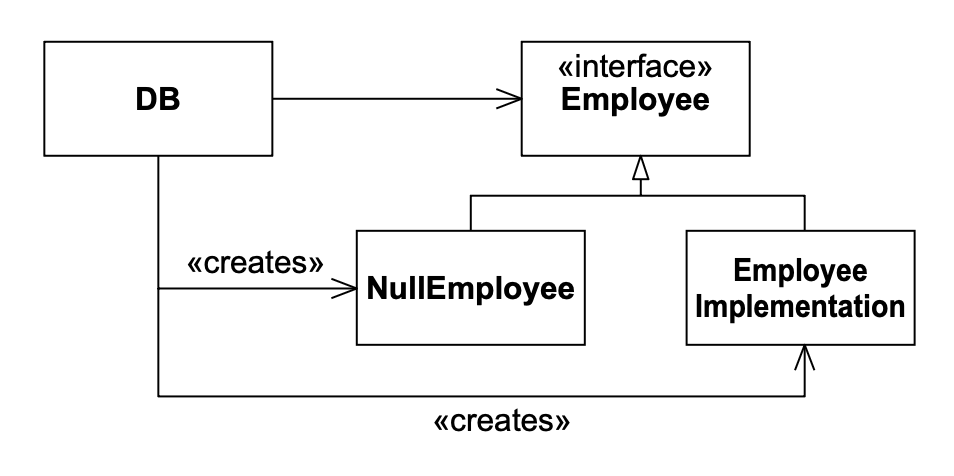

# 17 NULL OBJECT

<center></center><br/>

> “有瑕疵而无瑕，冰冷而规整，辉煌地虚无，完美的死寂，不再有更多。”
> <p align="right">——Alfred Tennyson (1809–1892)</p>

考虑以下代码：

```java
Employee e = DB.getEmployee("Bob");
if (e != null && e.isTimeToPay(today))
    e.pay();
```

我们向数据库请求一个名为 “Bob” 的 `Employee` 对象。
如果不存在这样的对象，`DB` 对象返回 `null`。
否则，它返回所请求的 `Employee` 实例。
如果该员工存在，并且到了支付时间，则调用 `pay` 方法。

我们以前都写过这样的代码。
这个习惯用法很常见，因为在基于 C 的语言中，`&&` 的第一个表达式首先被求值，仅当第一个为真时才求值第二个。
我们大多数人也曾因忘记检查 `null` 而吃过亏。
尽管这个习惯用法很常见，但它很丑陋且容易出错。

我们可以通过让 `DB.getEmployee` 抛出异常而不是返回 `null` 来减轻出错的倾向。
然而，`try/catch` 块可能比检查 `null` 更丑陋。
更糟糕的是，使用异常迫使我们将其声明在 `throws` 子句中，这使得在现有应用程序中改造异常变得困难。

我们可以通过使用 NULL OBJECT 模式 ¹ 来解决这些问题。
该模式通常消除了检查 `null` 的需要，并有助于简化代码。

¹ [PLOPD3]，第 5 页。这篇由 Bobby Woolf 撰写的令人愉快的文章充满机智、讽刺和实用建议。

Fig 17-1 显示了该结构。
`Employee` 成为一个接口，具有两个实现。
`EmployeeImplementation` 是正常实现 —— 它包含你期望 `Employee` 对象拥有的所有方法和变量。
当 `DB.getEmployee` 在数据库中找到员工时，它返回 `EmployeeImplementation` 的一个实例。
只有当 `DB.getEmployee` 找不到员工时，才返回 `NullEmployee`。

<br/>
*Fig 17-1 NULL OBJECT 模式*

`NullEmployee` 将所有 `Employee` 的方法实现为执行 “空操作”。
什么是 “空操作” 取决于方法。
例如，人们期望 `isTimeToPay` 被实现为返回 `false`，因为支付 `NullEmployee` 的时机永远不会到来。

使用此模式，我们可以将原始代码更改为：

```java
Employee e = DB.getEmployee("Bob");
if (e.isTimeToPay(today))
    e.pay();
```

这既不容易出错也不丑陋。
它具有良好的一致性。
`DB.getEmployee` 总是返回一个 `Employee` 实例。
无论是否找到员工，该实例都被保证表现适当。

当然，在很多情况下，我们仍然想知道 `DB.getEmployee` 是否未能找到员工。
这可以通过在 `Employee` 中创建一个保存 `NullEmployee` 的唯一实例的 `static final` 变量来实现。

Listing 17-1 显示了 `NullEmployee` 的测试用例。
在这种情况下，“Bob” 在数据库中不存在。
注意，测试用例期望 `isTimeToPay` 返回 `false`。
还注意，它期望 `DB.getEmployee` 返回的员工是 `Employee.NULL`。

Listing 17-1 TestEmployee.java（部分）

```java
public void testNull() throws Exception
{
    Employee e = DB.getEmployee("Bob");
    if (e.isTimeToPay(new Date()))
        fail();
    assertEquals(Employee.NULL, e);
}
```

`DB` 类如 Listing 17-2 所示。
注意，出于测试目的，`getEmployee` 方法只是返回 `Employee.NULL`。

Listing 17-2 DB.java

```java
public class DB
{
    public static Employee getEmployee(String name)
    {
        return Employee.NULL;
    }
}
```

`Employee` 接口如 Listing 17-3 所示。
注意，它有一个名为 `NULL` 的静态变量，持有 `Employee` 的一个匿名实现。
该匿名实现是空员工的唯一实例。
它将 `isTimeToPay` 实现为返回 `false`，将 `pay` 实现为空操作。

Listing 17-3 Employee.java

```java
import java.util.Date;

public interface Employee
{
    public boolean isTimeToPay(Date payDate);
    public void pay();

    public static final Employee NULL = new Employee()
    {
        public boolean isTimeToPay(Date payDate)
        {
            return false;
        }

        public void pay()
        {
        }
    };
}
```

将空员工设为匿名内部类是一种确保只有一个实例的方法。
并没有 `NullEmployee` 类本身。
没有其他人可以创建空员工的其他实例。
这是一件好事，因为我们希望能够写出类似：

```java
if (e == Employee.NULL)
```

如果有可能创建多个空员工实例，这将是不可靠的。

## 结论

我们这些长期使用基于 C 的语言的人，已经习惯于函数在某种失败情况下返回 `null` 或 `0`。
我们假定这类函数的返回值需要被检查。
NULL OBJECT 模式改变了这一点。
通过使用此模式，我们可以确保函数即使失败也总是返回有效的对象。
那些代表失败的对象执行 “空操作”。

## 参考文献

1. Martin, Robert, Dirk Riehle, and Frank Buschmann. *Pattern Languages of Program Design 3*. Reading, MA: Addison–Wesley, 1998.
