# 18 薪资案例研究：第一次迭代开始

<center></center><br/>

> “一切以任何方式美丽的事物，其本身即是美丽的，并止于自身，不以赞美作为其自身的一部分。”
> <p align="right">——Marcus Aureliu，约公元 170 年</p>

### 引言

以下案例研究描述了一个简单的批量薪资 (batch payroll) 系统开发中的第一次迭代。
你会发现本案例研究中的用户故事非常简单。
例如，税收根本没有被提及。
这是早期迭代的典型特征。
它只提供客户所需商业价值的一小部分。

在本章中，我们将进行快速分析和设计会议，这种会议通常在正常迭代开始时进行。
客户已经为这次迭代选择了故事，现在我们必须弄清楚我们将如何实现它们。
这样的设计会议简短而粗略，就像本章一样。
你在这里看到的 UML 图不过是白板上匆忙的草图。
真正的设计工作将在下一章进行，届时我们将完成单元测试和实现。

### 规范

以下是我们与客户就第一次迭代所选故事进行交谈时记录的一些笔记：

- 部分员工按小时计酬。
他们的员工记录中有一个字段记录小时工资率。
他们提交每日考勤卡，记录日期和工作小时数。
如果他们每天工作超过 8 小时，超出部分按正常工资率的 1.5 倍支付。
他们每周五发薪。

- 部分员工领取固定月薪。
他们在每个月的最后一个工作日发薪。
月薪是员工记录中的一个字段。

- 部分月薪员工还根据销售额获得佣金。
他们提交销售凭条，记录日期和销售额。
佣金率是员工记录中的一个字段。
他们每隔一周的周五发薪。

- 员工可以选择付款方式。
他们可以将工资支票邮寄到指定的邮政地址；也可以将支票留在财务处待领取；或者要求将工资直接存入指定的银行账户。

- 部分员工属于工会。
他们的员工记录中有一个字段记录每周会费。
会费必须从工资中扣除。
此外，工会可能会不时向个别工会会员收取服务费。
这些服务费由工会每周提交，必须从相应员工的下次工资中扣除。

- 薪资应用程序将在每个工作日运行一次，并在当天向符合条件的员工支付工资。
系统将被告知员工工资结算到哪个日期为止，因此它会计算从员工上次发薪日起到指定日期为止的应付工资。

我们可以首先生成数据库 schema。
显然，这个问题可以使用某种关系数据库，需求让我们非常清楚表和字段可能是什么。
设计一个可行的 schema 然后开始构建一些查询很容易。
然而，这种方法将生成一个以数据库为核心关注点的应用程序。

<ins>*数据库是实现细节！*
考虑数据库应尽可能推迟。
太多的应用程序与它们的数据库密不可分，因为它们从一开始就考虑数据库进行设计。
记住抽象的定义： *强化本质，消除无关* </ins>。
数据库在项目的这个阶段是无关的；它只是用于存储和访问数据的一种技术，仅此而已。

## 用例分析

<ins>与其从系统的数据开始，不如让我们从考虑系统的行为开始</ins>。
毕竟，我们被雇来创建的正是系统的行为。

捕获和分析系统行为的一种方法是创建用例。
用例，正如 Jacobson 最初所描述的，与 XP 中的用户故事概念非常相似。
用例就像一个用户故事，但被补充了更多细节。
一旦用户故事被选中在当前迭代中实现，这样的补充是合适的。

当我们进行用例分析时，我们查看用户故事和验收测试，以找出系统用户提供的各种刺激。
然后我们试图弄清楚系统如何响应这些刺激。

例如，以下是客户为下一次迭代选择的用户故事：
1. 新增员工
2. 删除员工
3. 登记考勤卡
4. 登记销售凭条
5. 登记工会服务费
6. 修改员工详细信息（例如，小时工资率、会费）
7. 运行当日薪资发放

让我们将每个用户故事转化为详细的用例。
我们不需要深入太多细节 —— 只要能帮助我们思考实现每个故事的代码设计即可。

### 新增员工

用例 1：新增员工

```
通过接收一个 AddEmp 事务来添加新员工。该事务包含员工姓名、地址和分配的员工编号。事务有三种形式：

AddEmp <员工ID> "<姓名>" "<地址>" H <小时工资率>
AddEmp <员工ID> "<姓名>" "<地址>" S <月薪>
AddEmp <员工ID> "<姓名>" "<地址>" C <月薪> <佣金率>

员工记录被创建，其各个字段被适当赋值。

备选流程1：事务结构错误
如果事务结构不正确，则打印错误信息，不采取任何操作。
```

用例 1 提示了一个抽象。
AddEmp 事务有三种形式，但三种形式都共享 <员工ID>、<姓名> 和 <地址> 字段。
我们可以使用 COMMAND 模式创建一个 AddEmployeeTransaction 抽象基类，包含三个派生类：AddHourlyEmployeeTransaction、AddSalariedEmployeeTransaction 和 AddCommissionedEmployeeTransaction。
（见 Fig 18-1 。）

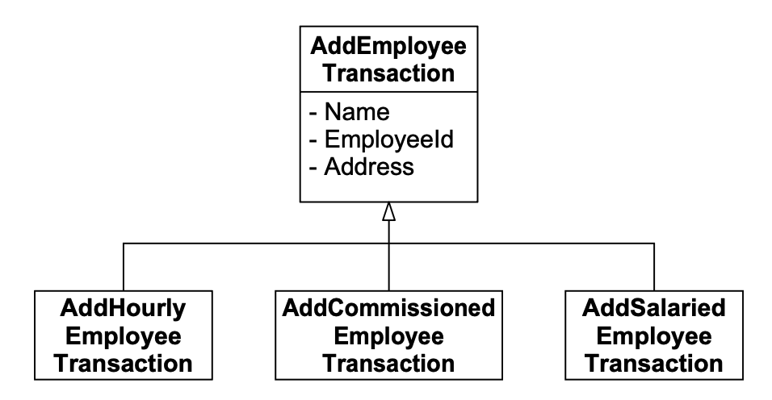<br/>
*Fig 18-1 AddEmployeeTransaction 类层次结构*

这种结构通过将每个工作拆分到各自的类中，很好地符合了单一职责原则（SRP）。
另一种选择是将所有这些工作放在一个模块中。
虽然这可能会减少系统中的类数量，从而使系统更简单，但它也会将所有事务处理代码集中在一个地方，从而创建一个庞大且可能容易出错的模块。

用例 1 特别提到了员工记录，这意味着某种数据库。
<ins>我们对数据库的倾向可能再次诱惑我们考虑关系数据库表中的记录布局或字段结构，但我们应该抵制这些冲动</ins>。
用例真正要求我们做的是创建一个员工。
员工的对象模型是什么？
更好的问题可能是，这三种不同的事务创建了什么？
在我看来，它们创建了三种不同类型的员工对象，模仿了三种不同类型的 AddEmp 事务。
Fig 18-2 显示了一个可能的结构。

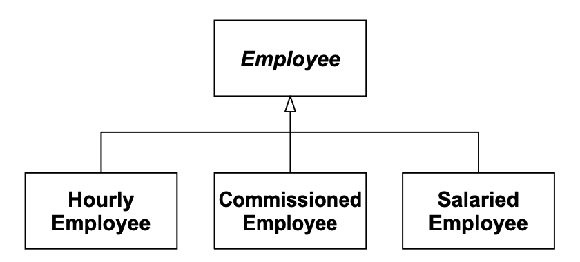<br/>
*Fig 18-2 可能的员工类层次结构*

### 删除员工

用例 2：删除员工

```
当收到 DelEmp 事务时，删除员工。该事务格式如下：

DelEmp <员工ID>

收到此事务时，相应的员工记录将被删除。

备选流程1：无效或未知的员工ID
如果 <员工ID> 字段格式不正确，或者它未指向有效的员工记录，则打印该事务并附带错误信息，不采取其他操作。
```

这个用例目前没有给我任何设计上的启发，所以让我们看下一个。

### 登记考勤卡

用例 3：登记考勤卡

```
收到 TimeCard 事务后，系统将创建一条考勤卡记录，并将其关联到相应的员工记录。
TimeCard <员工ID> <日期> <小时数>

备选流程1：所选员工不是按小时计酬
系统将打印适当的错误信息，不采取进一步操作。

备选流程2：事务结构错误
系统将打印适当的错误信息，不采取进一步操作。
```

这个用例指出，某些事务只适用于特定类型的员工，这加强了不同员工类型应由不同类表示的想法。
在这种情况下，考勤卡与小时工之间也存在隐含的关联。
Fig 18-3 显示了此关联的一个可能静态模型。

<br/>
*Fig 18-3 HourlyEmployee 与 TimeCard 之间的关联*

### 登记销售凭条

用例 4：登记销售凭条

```
收到 SalesReceipt 事务后，系统将创建一条新的销售凭条记录，并将其关联到相应的佣金制员工。

SalesReceipt <员工ID> <日期> <金额>

备选流程 1：所选员工不是佣金制
系统将打印适当的错误信息，不采取进一步操作。

备选流程 2：事务结构错误
系统将打印适当的错误信息，不采取进一步操作。
```

这个用例与用例 3 非常相似。
它暗示了 Fig 18-4 所示的结构。

<br/>
*Fig 18-4 佣金制员工与销售凭条*

### 登记工会服务费

用例 5：登记工会服务费

```
收到此事务后，系统将创建一条服务费记录，并将其关联到相应的工会会员。

ServiceCharge <会员ID> <金额>

备选流程 1：格式错误的事务
如果事务格式不正确，或者 <会员ID> 未指向现有工会会员，则打印该事务并附带适当的错误信息。
```

这个用例表明工会会员不是通过员工 ID 访问的。
工会维护自己针对工会会员的标识编号方案。
因此，系统必须能够关联工会会员和员工。
有多种不同的方式可以提供这种关联，为了避免武断，让我们将这一决定推迟到以后再做。
也许系统其他部分的约束会以某种方式迫使我们的决定。

有一点是确定的。
工会会员与其服务费之间存在直接关联。
Fig 18-5 显示了此关联的一个可能静态模型。

<br/>
*Fig 18-5 工会会员与服务费*

### 修改员工详细信息

用例 6：修改员工详细信息

```
收到此事务后，系统将修改相应员工记录中的某一项详细信息。该事务有若干种可能的变化形式。

- ChgEmp <员工ID> Name <姓名> —— 修改员工姓名
- ChgEmp <员工ID> Address <地址> —— 修改员工地址
- ChgEmp <员工ID> Hourly <小时工资率> —— 改为按小时计酬
- ChgEmp <员工ID> Salaried <月薪> —— 改为固定月薪
- ChgEmp <员工ID> Commissioned <月薪> <佣金率> —— 改为佣金制
- ChgEmp <员工ID> Hold —— 支票暂存待领
- ChgEmp <员工ID> Direct <银行> <账户> —— 直接存款
- ChgEmp <员工ID> Mail <地址> —— 邮寄支票
- ChgEmp <员工ID> Member <会员ID> Dues <会费> —— 加入工会
- ChgEmp <员工ID> NoMember —— 退出工会

备选流程1：事务错误
如果事务结构不正确，或<员工ID>未指向真实员工，或<会员ID>已指向某位会员，则打印适当的错误信息，不采取进一步操作。
```

这个用例非常有启发性。
它告诉了我们员工所有必须可变的方面。
我们可以将员工从小时工改为固定月薪工，这一事实意味着 Fig 18-2 中的图景肯定是无效的。
相反，使用 STRATEGY 模式来计算薪资可能更合适。
Employee 类可以持有一个名为 PaymentClassification 的策略类，如 Fig 18-6 所示。
这是一个优势，因为我们可以更改 PaymentClassification 对象而不改变 Employee 对象的任何其他部分。
当小时工改为固定月薪工时，相应 Employee 对象的 HourlyClassification 被替换为 SalariedClassification 对象。

PaymentClassification 对象有三种变体。
HourlyClassification 对象维护小时工资率和 TimeCard 对象列表。
SalariedClassification 对象维护月薪金额。
CommissionedClassification 对象维护月薪、佣金率和 SalesReceipt 对象列表。
在这些情况下我使用了组合关系，因为我认为当员工被销毁时，TimeCard 和 SalesReceipt 也应被销毁。

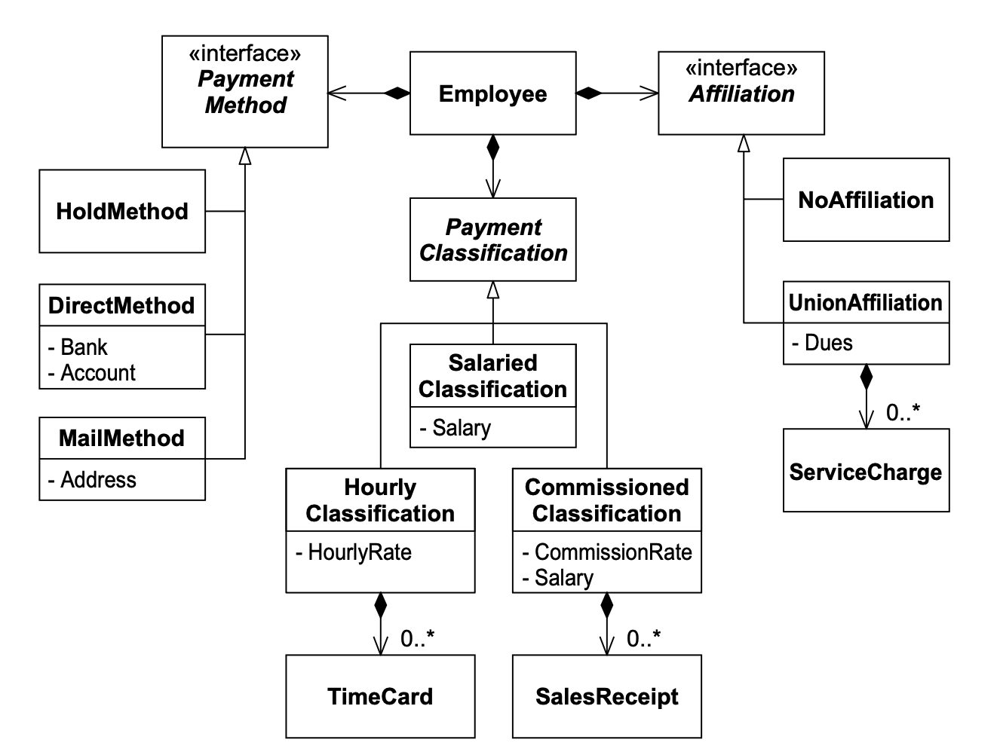<br/>
*Fig 18-6 修订后的薪资类图 —— 核心模型*

支付方式也必须是可变的。
Fig 18-6 通过使用 STRATEGY 模式并派生三种不同类型的 PaymentMethod 类来实现这一想法。
如果 Employee 对象包含 MailMethod 对象，则相应员工将收到邮寄的工资支票。
支票邮寄的地址记录在 MailMethod 对象中。
如果 Employee 对象包含 DirectMethod 对象，则他的工资将直接存入 DirectMethod 对象中记录的银行账户。
如果 Employee 包含 HoldMethod对象，则他的工资支票将被送到财务处保管待领。

最后，Fig 18-6 将 NULL OBJECT 模式应用于工会会员资格。
每个 Employee 对象包含一个 Affiliation 对象，有两种形式。
如果 Employee 包含 NoAffiliation 对象，则他的工资不受雇主以外的任何组织的调整。
然而，如果 Employee 对象包含 UnionAffiliation 对象，则该员工必须支付该 UnionAffiliation 对象中记录的会费和服务费。

这些模式的使用使该系统很好地符合开闭原则（OCP）。
Employee 类对支付方式、支付分类和工会会员资格的变更是封闭的。
新的方法、分类和会员资格可以添加到系统中而不影响 Employee。

Fig 18-6 正在成为我们的核心模型或架构。
它处于薪资系统所做一切的核心。
薪资应用程序中将有许多其他类和其他设计，但相对于这个基础结构，它们都是次要的。
当然，这个结构并非一成不变：它将与其他一切共同演进。

### 发薪日

用例 7：运行当日薪资发放

```
收到 Payday事务后，系统查找所有应在指定日期获得薪资的员工。
然后系统计算应付金额，并根据所选付款方式支付薪资。

Payday <日期>
```

尽管这个用例的意图很容易理解，但要确定它对 Fig 18-6 静态结构的影响并不那么简单。
我们需要回答几个问题。

首先，Employee 对象如何知道计算自己的薪资？
当然，如果员工是小时工，系统必须汇总他的考勤卡并乘以小时工资率。
如果员工是佣金制，系统必须汇总他的销售凭条，乘以佣金率，并加上基本工资。
但这一切在哪里完成？
理想的位置似乎在 PaymentClassification 派生类中。
这些对象维护计算薪资所需的记录，因此它们可能应该有确定薪资的方法。
Fig 18-7 显示了一个协作图，描述了这可能如何工作。

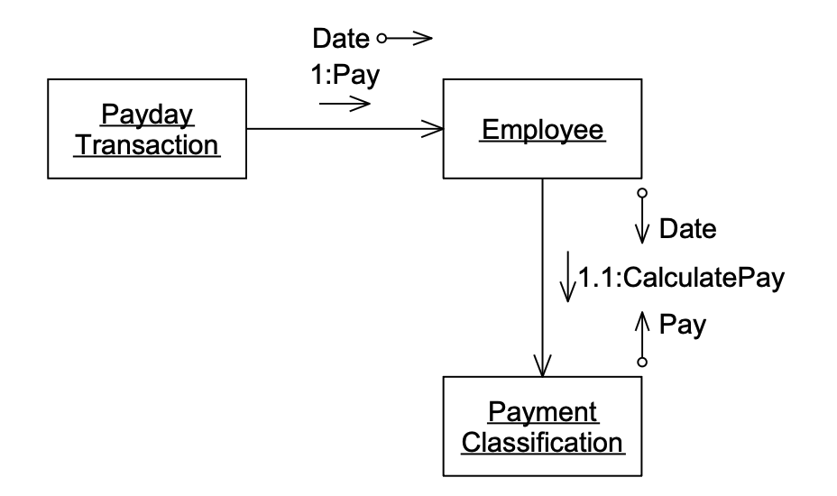<br/>
*Fig 18-7 计算员工薪资*

当 Employee 对象被要求计算薪资时，它将此请求转发给其 PaymentClassification 对象。
实际使用的算法取决于 Employee 对象包含的 PaymentClassification 类型。
Fig 18-8 到 Fig 18-10 显示了三种可能的情况。

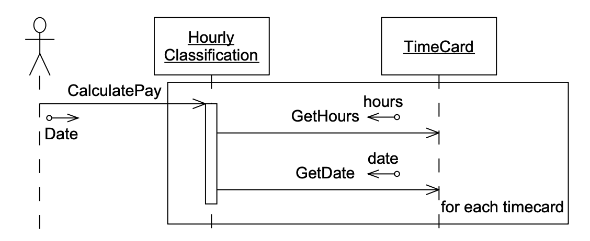<br/>
*Fig 18-8 计算小时工的薪资*

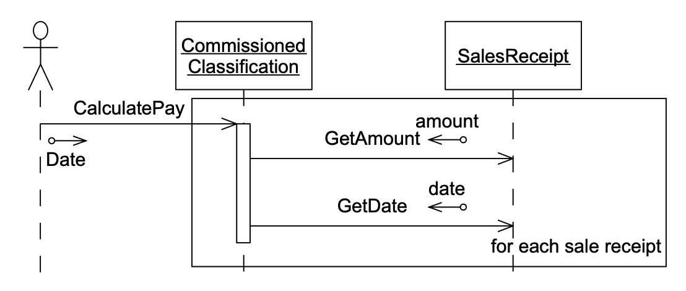<br/>
*Fig 18-9 计算佣金制员工的薪资*

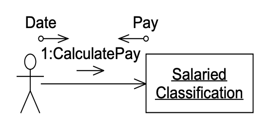<br/>
*Fig 18-10 计算固定月薪员工的薪资*

## 反思：我们学到了什么？

<br/>

<ins>我们已经了解到，简单的用例分析可以提供大量信息和洞察，帮助我们设计系统。
Fig 18-6 到 Fig 18-10 正是通过思考用例 ——即思考行为—— 而产生的</ins>。

## 寻找底层抽象

为了有效使用 OCP，我们必须寻找抽象，并找到构成应用程序基础的抽象。
通常，这些抽象并非由需求甚至用例明确陈述或暗示。
需求和用例可能过于深入细节，而无法表达底层抽象的一般性。

薪资应用程序的底层抽象是什么？
让我们再看一下需求。
我们看到诸如 “部分员工按小时计酬”、“部分员工领取固定月薪” 和 “部分...员工领取佣金” 的陈述。
这暗示了以下一般化：“所有员工都获得报酬，但通过不同的方案获得报酬。”
这里的抽象是 “所有员工都获得报酬”。
我们在 Fig 18-7到 Fig 18-10 中的 PaymentClassification 模型很好地表达了这一抽象。
因此，通过非常简单的用例分析，这一抽象已经在我们的用户故事中被发现了。

### 调度抽象

寻找其他抽象，我们发现 “他们每周五发薪”、“他们在每个月的最后一个工作日发薪” 和 “他们每隔一周的周五发薪”。
这引导我们得出另一个一般性：“所有员工都根据某种调度获得报酬。”
这里的抽象是 *调度 (schedule)* 的概念。
应该能够询问 Employee 对象某个特定日期是否是它的发薪日。
用例几乎没有提到这一点。
需求将员工的调度与其支付分类联系起来。
具体来说，小时工每周发薪，固定月薪员工每月发薪，佣金制员工每隔一周发薪；然而，这种关联是必要的吗？
是否有一天政策会改变，使得员工可以选择特定调度，或者属于不同部门或不同分部的员工可以有不同调度？
调度政策是否可能独立于支付政策而变化？
当然，这似乎是有可能的。

如果按照需求的暗示，我们将调度问题委托给 PaymentClassification 类，那么我们的类就不能对调度变更问题保持封闭。
当我们改变支付政策时，我们也必须测试调度。
当我们改变调度时，我们也必须测试支付政策。
OCP 和 SRP 都将被违反。

调度和支付政策之间的关联可能导致缺陷，即对特定支付政策的更改会导致某些员工的调度不正确。
这种缺陷对程序员来说可能可以理解，但它们会在管理人员和用户心中引起恐惧。
他们 ——而且有理由—— 担心，如果支付政策的更改可能破坏调度，那么任何地方的任何更改都可能在系统中任何其他不相关的部分引起问题。
他们担心无法预测变更的影响。
当影响无法预测时，信心就会丧失，程序在管理人员和用户心目中就会获得 “危险和不稳定” 的地位。

尽管调度抽象具有本质性，但我们的用例分析未能给我们任何关于其存在的直接线索。
要识别出它，需要仔细研判需求，同时还要洞察用户群体的复杂实际情况。
过度依赖工具与流程，而轻视人的判断力与经验，终将酿成问题。

Fig 18-11 和 Fig 18-12 显示了调度抽象的静态和动态模型。
如你所见，我们再次使用了 STRATEGY 模式。
Employee 类包含抽象的 PaymentSchedule 类。
PaymentSchedule有三种变体，对应于员工发薪的三种已知调度。

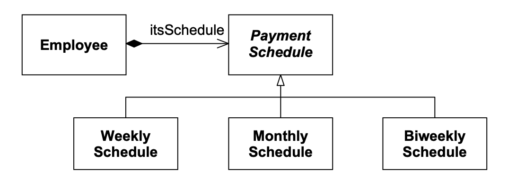<br/>
*Fig 18-11 调度抽象的静态模型*

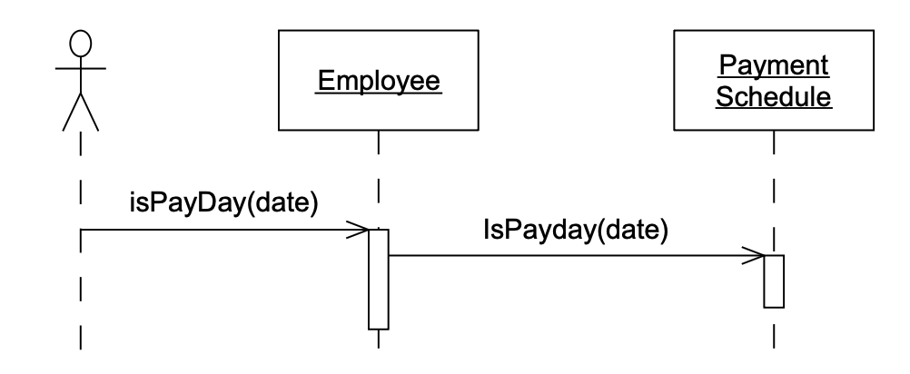<br/>
*Fig 18-12 调度抽象的动态模型*

### 支付方式

我们可以从需求中得出的另一个一般性是 “所有员工通过某种方式获得报酬”。
抽象是 PaymentMethod 类。
有趣的是，这一抽象已经在 Fig 18-6 中表达了。

### 会员资格

需求暗示员工可能与工会有会员资格；然而，工会可能不是唯一有权从员工工资中扣除费用的组织。
员工可能希望向某些慈善机构自动捐款，或自动支付专业协会的会费。
因此，一般性变为 “员工可能隶属于许多组织，这些组织应自动从员工的工资中扣除费用。”

相应的抽象是 Fig 18-6 中所示的 Affiliation 类。
然而，该图并未显示 Employee 包含多个 Affiliation，并且显示了 NoAffiliation 类的存在。
这种设计并不完全符合我们现在认为需要的抽象。
Fig 18-13 和 Fig 18-14 显示了代表 Affiliation 抽象的静态和动态模型。

Affiliation 对象列表消除了对未加入工会员工使用 NULL OBJECT 模式的需要。
现在，如果员工没有会员资格，其会员资格列表将为空。

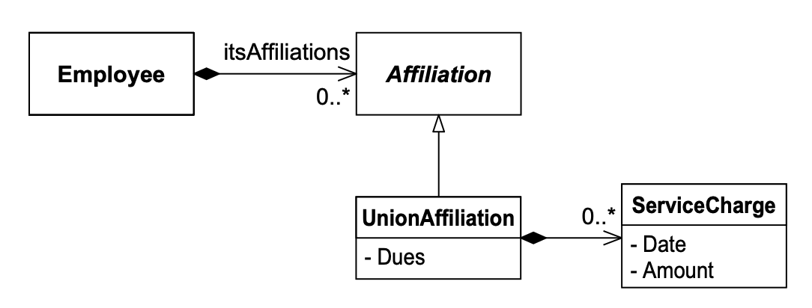<br/>
*Fig 18-13 Affiliation抽象的静态结构*

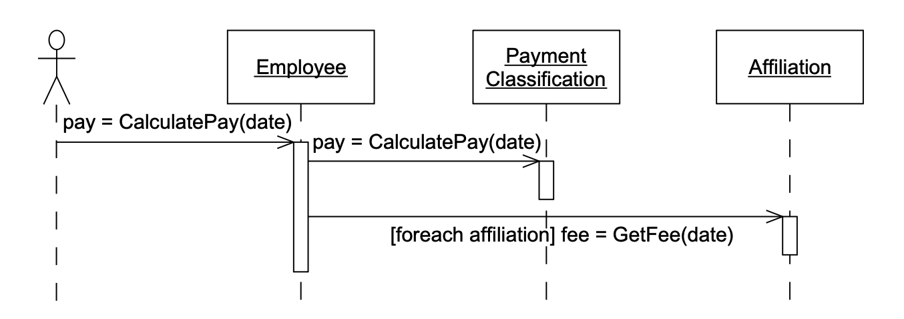<br/>
*Fig 18-14 Affiliation抽象的动态结构*

## 结论

在迭代开始时，团队聚集在白板前，一起推理该迭代所选用户故事的设计，这种情况并不少见。
这样的快速设计会议通常持续不到一个小时。
产生的 UML 图（如果有的话）可能会留在白板上，或者被擦掉。
它们通常不会被记录在纸上。
会议的目的是启动思考过程，并给开发人员一个共同的思维模型来工作。
目标不是确定设计。

本章就是这样一个快速设计会议的文本等效物。

## 参考文献

1. Jacobson, Ivar. *Object-Oriented Software Engineering, A Use-Case-Driven Approach*. Wokingham, England: Addison–Wesley, 1992.
