# 19 薪资案例研究：实现

<center></center><br/>

早该开始编写代码来支持和验证我们一直构建的设计了。
我将以非常小的增量步骤创建代码，但只在文本中方便的点向你展示。
不要让你只看到完整成型的代码快照这一事实误导你，以为我是以那种形式编写的。
事实上，在你看到的每一批代码之间，都会有几十次编辑、编译和测试用例，每一次都对代码进行了微小的演进更改。

你还会看到相当多的 UML。
把这种 UML 看作我在白板上快速绘制的图表，向你 ——我的结对伙伴—— 展示我的想法。
UML 为你我之间的沟通提供了一种便捷的媒介。

Fig 19-1 显示我们将事务表示为一个名为 Transaction 的抽象基类，它有一个名为 Execute() 的实例方法。
这当然是 COMMAND 模式。
Transaction 类的实现如清单 Listing 19-1 所示。

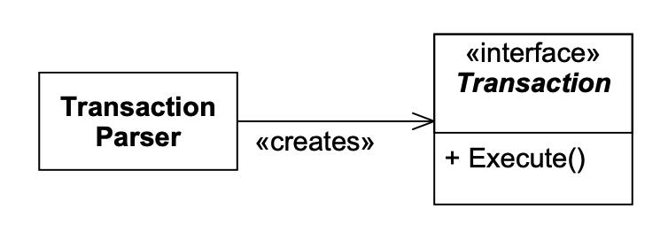<br/>
*Fig 19-1 Transaction 接口*

Listing 19-1 Transaction.h

```cpp
#ifndef TRANSACTION_H
#define TRANSACTION_H

class Transaction
{
public:
    virtual ~Transaction();
    virtual void Execute() = 0;
};

#endif
```

## 新增员工

Fig 19-2 显示了新增员工事务的可能结构。
注意，在这些事务中，员工的支付调度与他们的支付分类相关联。
这是适当的，因为事务是人为构造的，而不是核心模型的一部分。
因此，核心模型不知道这种关联；该关联只是人为构造的一部分，可以随时更改。
例如，我们可以轻松添加一个事务，允许我们更改员工调度。

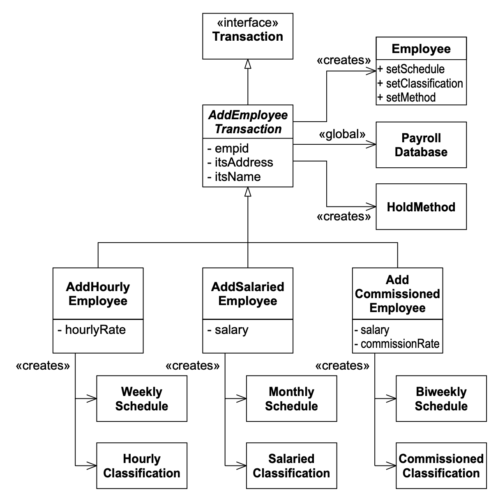<br/>
*Fig 19-2 AddEmployeeTransaction 的静态模型*

还要注意，默认支付方式是将工资支票交给财务处保管。
如果员工想要不同的支付方式，必须通过适当的 ChgEmp 事务进行更改。

像往常一样，我们编写代码时首先编写测试。
Listing 19-2 是一个测试用例，表明 AddSalariedTransaction 工作正常。
后续代码将使该测试用例通过。

Listing 19-2 PayrollTest::TestAddSalariedEmployee

```cpp
void PayrollTest::TestAddSalariedEmployee()
{
    int empId = 1;
    AddSalariedEmployee t(empId, "Bob", "Home", 1000.00);
    t.Execute();

    Employee* e = GpayrollDatabase.GetEmployee(empId);
    assert("Bob" == e->GetName());

    PaymentClassification* pc = e->GetClassification();
    SalariedClassification* sc = dynamic_cast<SalariedClassification*>(pc);
    assert(sc);
    assertEquals(1000.00, sc->GetSalary(), .001);

    PaymentSchedule* ps = e->GetSchedule();
    MonthlySchedule* ms = dynamic_cast<MonthlySchedule*>(ps);
    assert(ms);

    PaymentMethod* pm = e->GetMethod();
    HoldMethod* hm = dynamic_cast<HoldMethod*>(pm);
    assert(hm);
}
```

**薪资数据库**

AddEmployeeTransaction 类使用一个名为 PayrollDatabase 的类。
该类在一个以 empID 为键的字典中维护所有现有的 Employee 对象。
它还维护一个将工会会员 ID 映射到 empID 的字典。
该类的结构如 Fig 19-3 所示。
PayrollDatabase 是 FACADE 模式的一个示例（ [第 173 页](../ch15/0.md) ）。

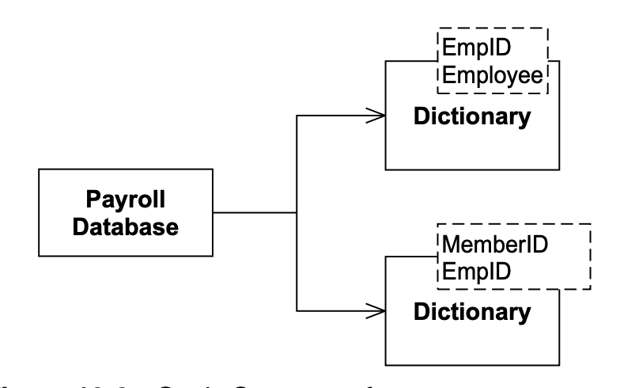<br/>
*Fig 19-3 PayrollDatabase 的静态结构*

Listing 19-3 和 19-4 显示了 PayrollDatabase 的一个基本实现。
这个实现旨在帮助我们完成初步的测试用例。
它尚未包含将会员 ID 映射到 Employee 实例的字典。

Listing 19-3 PayrollDatabase.h

```cpp
#ifndef PAYROLLDATABASE_H
#define PAYROLLDATABASE_H

#include <map>

class Employee;

class PayrollDatabase
{
public:
    virtual ~PayrollDatabase();
    Employee* GetEmployee(int empId);
    void AddEmployee(int empid, Employee*);
    void clear() { itsEmployees.clear(); }

private:
    map<int, Employee*> itsEmployees;
};

#endif
```

Listing 19-4 PayrollDatabase.cpp

```cpp
#include "PayrollDatabase.h"
#include "Employee.h"

PayrollDatabase GpayrollDatabase;

PayrollDatabase::~PayrollDatabase()
{
}

Employee* PayrollDatabase::GetEmployee(int empid)
{
    return itsEmployees[empid];
}

void PayrollDatabase::AddEmployee(int empid, Employee* e)
{
    itsEmployees[empid] = e;
}
```

总的来说，我认为数据库实现是细节。
关于这些细节的决定应尽可能推迟。
这个特定数据库是用 RDBMS、平面文件还是 OODBMS实现，在这一点上无关紧要。
现在，我只是对创建向应用程序其余部分提供数据库服务的 API 感兴趣。
我将在以后为数据库找到适当的实现。

推迟关于数据库的细节是一种不常见但非常有价值的实践。
数据库决策通常可以等到我们对软件及其需求有更多了解时再做。
通过等待，我们避免了在数据库中放入过多基础设施的问题。
相反，我们只实现足够满足应用程序需求的数据库功能。

### 使用 TEMPLATE METHOD 新增员工

Fig 19-4 显示了新增员工的动态模型。
注意，AddEmployeeTransaction 对象向自身发送消息以获取适当的 PaymentClassification 和 PaymentSchedule 对象。
这些消息在 AddEmployeeTransaction 类的派生类中实现。
这是 TEMPLATE METHOD 模式的一个应用。

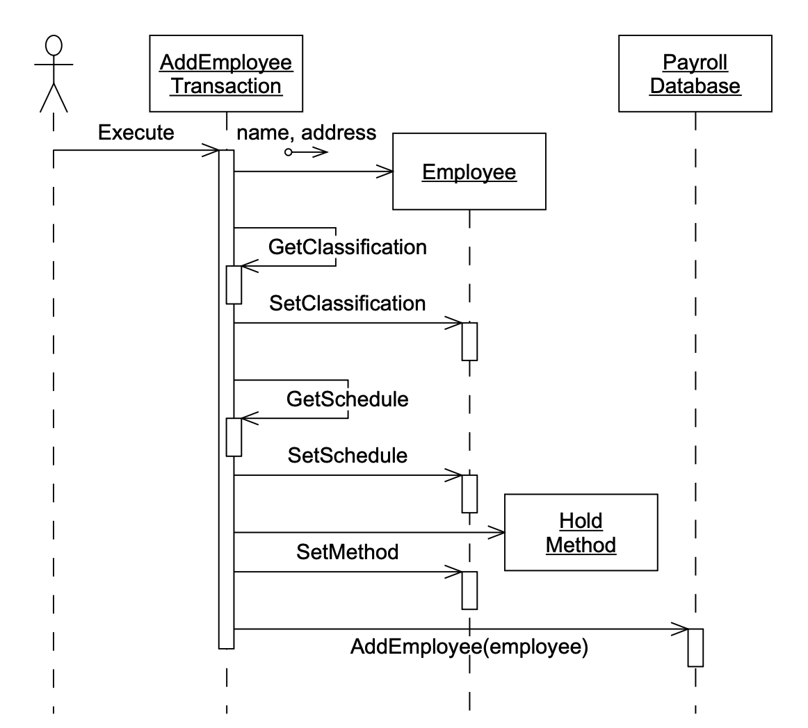<br/>
*Fig 19-4 新增员工的动态模型*

Listing 19-5 和 19-6 显示了AddEmployeeTransaction 类中 TEMPLATE METHOD 模式的实现。
该类实现了 Execute() 方法，调用两个将由派生类实现的纯虚函数。
这些函数 GetSchedule() 和 GetClassification() 返回新创建的 Employee 所需的 PaymentSchedule 和 PaymentClassification 对象。
然 后Execute()方法将这些对象绑定到 Employee，并将 Employee 保存到 PayrollDatabase 中。

Listing 19-5 AddEmployeeTransaction.h

```cpp
#ifndef ADDEMPLOYEETRANSACTION_H
#define ADDEMPLOYEETRANSACTION_H

#include "Transaction.h"
#include <string>

class PaymentClassification;
class PaymentSchedule;

class AddEmployeeTransaction : public Transaction
{
public:
    virtual ~AddEmployeeTransaction();
    AddEmployeeTransaction(int empid, string name, string address);

    virtual PaymentClassification* GetClassification() const = 0;
    virtual PaymentSchedule* GetSchedule() const = 0;

    virtual void Execute();

private:
    int itsEmpid;
    string itsName;
    string itsAddress;
};

#endif
```

Listing 19-6 AddEmployeeTransaction.cpp

```cpp
#include "AddEmployeeTransaction.h"
#include "HoldMethod.h"
#include "Employee.h"
#include "PayrollDatabase.h"

class PaymentMethod;
class PaymentSchedule;
class PaymentClassification;

extern PayrollDatabase GpayrollDatabase;

AddEmployeeTransaction::~AddEmployeeTransaction()
{
}

AddEmployeeTransaction::
AddEmployeeTransaction(int empid, string name, string address)
    : itsEmpid(empid)
    , itsName(name)
    , itsAddress(address)
{
}

void AddEmployeeTransaction::Execute()
{
    PaymentClassification* pc = GetClassification();
    PaymentSchedule* ps = GetSchedule();
    PaymentMethod* pm = new HoldMethod();

    Employee* e = new Employee(itsEmpid, itsName, itsAddress);
    e->SetClassification(pc);
    e->SetSchedule(ps);
    e->SetMethod(pm);

    GpayrollDatabase.AddEmployee(itsEmpid, e);
}
```

Listing 19-7 和 19-8 显示了 AddSalariedEmployee 类的实现。
该类派生自 AddEmployeeTransaction，并实现了 GetSchedule() 和 GetClassification() 方法，以将适当的对象传回给 AddEmployeeTransaction::Execute()。

Listing 19-7 AddSalariedEmployee.h

```cpp
#ifndef ADDSALARIEDEMPLOYEE_H
#define ADDSALARIEDEMPLOYEE_H

#include "AddEmployeeTransaction.h"

class AddSalariedEmployee : public AddEmployeeTransaction
{
public:
    virtual ~AddSalariedEmployee();
    AddSalariedEmployee(int empid, string name,
                        string address, double salary);

    PaymentClassification* GetClassification() const;
    PaymentSchedule* GetSchedule() const;

private:
    double itsSalary;
};

#endif
```

Listing 19-8 AddSalariedEmployee.cpp

```cpp
#include "AddSalariedEmployee.h"
#include "SalariedClassification.h"
#include "MonthlySchedule.h"

AddSalariedEmployee::~AddSalariedEmployee()
{
}

AddSalariedEmployee::
AddSalariedEmployee(int empid, string name,
                    string address, double salary)
    : AddEmployeeTransaction(empid, name, address)
    , itsSalary(salary)
{
}

PaymentClassification*
AddSalariedEmployee::GetClassification() const
{
    return new SalariedClassification(itsSalary);
}

PaymentSchedule* AddSalariedEmployee::GetSchedule() const
{
    return new MonthlySchedule();
}
```

我将 AddHourlyEmployee 和 AddCommissionedEmployee 作为读者的练习。
记住先编写测试用例。

## 删除员工

Fig 19-5 和 Fig 19-6 展示了删除员工事务的静态和动态模型。

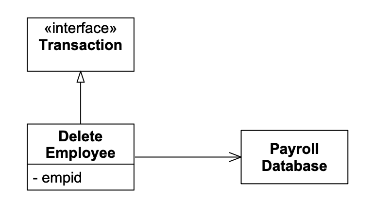<br/>
*Fig 19-5 DeleteEmployeeTransaction 的静态模型*

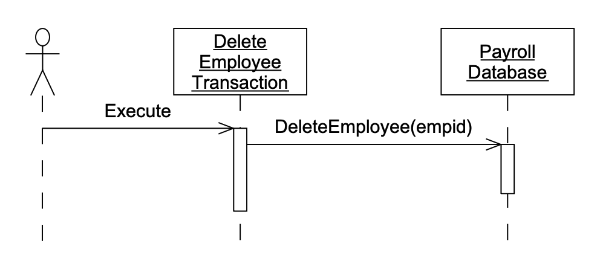<br/>
*Fig 19-6 DeleteEmployeeTransaction 的动态模型*

Listing 19-9 显示了删除员工的测试用例。
Listing 19-10 和19-11 显示了 DeleteEmployeeTransaction 的实现。
这是 COMMAND 模式的一个非常典型的实现。
构造函数存储 Execute() 方法最终操作的数据。

Listing 19-9 PayrollTest::TestDeleteEmployee()

```cpp
void PayrollTest::TestDeleteEmployee()
{
    cerr << "TestDeleteEmployee" << endl;
    int empId = 3;
    AddCommissionedEmployee t(empId, "Lance", "Home", 2500, 3.2);
    t.Execute();
    {
        Employee* e = GpayrollDatabase.GetEmployee(empId);
        assert(e);
    }

    DeleteEmployeeTransaction dt(empId);
    dt.Execute();
    {
        Employee* e = GpayrollDatabase.GetEmployee(empId);
        assert(e == 0);
    }
}
```

Listing 19-10 DeleteEmployeeTransaction.h

```cpp
#ifndef DELETEEMPLOYEETRANSACTION_H
#define DELETEEMPLOYEETRANSACTION_H

#include "Transaction.h"

class DeleteEmployeeTransaction : public Transaction
{
public:
    virtual ~DeleteEmployeeTransaction();
    DeleteEmployeeTransaction(int empid);
    virtual void Execute();

private:
    int itsEmpid;
};

#endif
```

Listing 19-11 DeleteEmployeeTransaction.cpp

```cpp
#include "DeleteEmployeeTransaction.h"
#include "PayrollDatabase.h"

extern PayrollDatabase GpayrollDatabase;

DeleteEmployeeTransaction::~DeleteEmployeeTransaction()
{
}

DeleteEmployeeTransaction::DeleteEmployeeTransaction(int empid)
    : itsEmpid(empid)
{
}

void DeleteEmployeeTransaction::Execute()
{
    GpayrollDatabase.DeleteEmployee(itsEmpid);
}
```

### 全局变量

到目前为止，你已经注意到了 `GpayrollDatabase` 这个全局变量。
几十年来，教科书和老师一直有充分理由反对使用全局变量。
尽管如此，全局变量本身并非邪恶或有害。
这个特定情况是使用全局变量的理想选择。
`PayrollDatabase` 类只可能有一个实例，并且它需要被非常广泛的受众知晓。

你可能认为使用 SINGLETON 或 MONOSTATE 模式可以更好地实现这一点。
确实，它们可以满足目的。
然而，它们本身也是通过全局变量来实现的。
SINGLETON 或 MONOSTATE 根据定义就是全局实体。
在这种情况下，我觉得使用 SINGLETON 或 MONOSTATE 会显得过度设计。
简单地在一个全局变量中保存数据库实例更容易。

## 考勤卡、销售凭条和服务费

Fig 19-7 显示了向员工登记考勤卡的事务的静态结构。
Fig 19-8 显示了动态模型。
基本思想是，事务从 PayrollDatabase 获取 Employee 对象，向 Employee 请求其 PaymentClassification 对象，然后创建 TimeCard 对象并将其添加到该 PaymentClassification中。

注意，我们不能向一般的 PaymentClassification 对象添加 TimeCard 对象；只能向 HourlyClassification 对象添加。
这意味着我们必须将从 Employee 对象接收的 PaymentClassification 对象向下转型为 HourlyClassification 对象。
这是 C++ 中 dynamic_cast 运算符的一个良好用途，如后面的 Listing 19-15 所示。

Listing 19-12 显示了一个测试用例，验证考勤卡可以添加到小时工。
该测试代码简单地创建一个小时工并将其添加到数据库。
然后创建一个 TimeCardTransaction 并调用 Execute()。
然后检查员工，看 HourlyClassification 是否包含适当的 TimeCard。

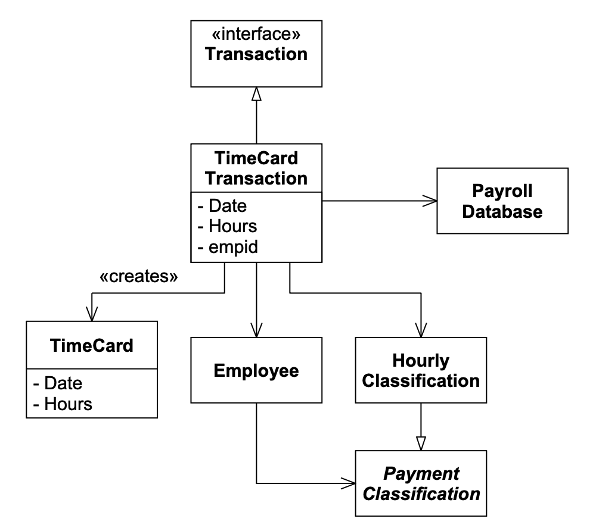<br/>
*Fig 19-7 TimeCardTransaction 的静态结构*

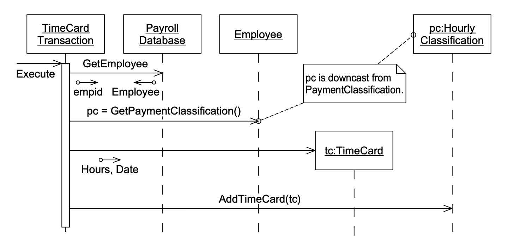<br/>
*FIg 19-8 登记考勤卡的动态模型*

Listing 19-12 PayrollTest::TestTimeCardTransaction()

```cpp
void PayrollTest::TestTimeCardTransaction()
{
    cerr << "TestTimeCardTransaction" << endl;
    int empId = 2;
    AddHourlyEmployee t(empId, "Bill", "Home", 15.25);
    t.Execute();

    TimeCardTransaction tct(20011031, 8.0, empId);
    tct.Execute();

    Employee* e = GpayrollDatabase.GetEmployee(empId);
    assert(e);
    PaymentClassification* pc = e->GetClassification();
    HourlyClassification* hc =
        dynamic_cast<HourlyClassification*>(pc);
    assert(hc);
    TimeCard* tc = hc->GetTimeCard(20011031);
    assert(tc);
    assertEquals(8.0, tc->GetHours());
}
```

Listing 19-13 显示了 TimeCard 类的实现。
目前这个类没有太多内容。
它只是一个数据类。
注意，我使用 long 整数来表示日期。
这样做是因为我没有方便的 Date 类。
我可能很快就会需要一个，但现在还不需要。
我不想从手头的任务中分心，即让当前的测试用例正常工作。
最终我会编写一个需要真正 Date 类的测试用例。
到那时，我会返回去将其改造到 TimeCard 中。

Listing 19-13 TimeCard.h

```cpp
#ifndef TIMECARD_H
#define TIMECARD_H

class TimeCard
{
public:
    virtual ~TimeCard();
    TimeCard(long date, double hours);
    long GetDate() { return itsDate; }
    double GetHours() { return itsHours; }

private:
    long itsDate;
    double itsHours;
};

#endif
```

Listing 19-14 和 19-15 显示了 TimeCardTransaction 类的实现。
注意使用了简单的字符串异常。
这不是长期良好的做法，但在开发初期已经足够。
当我们对异常应该是什么有了更多了解后，可以回来创建有意义的异常类。
还要注意，只有当我们确定不会抛出异常时才创建 TimeCard 实例，因此抛出异常不会导致内存泄漏。
在抛出异常时，很容易创建泄漏内存或资源的代码，所以要小心。¹

¹ 而且，要跑去买 Herb Sutter 的《Exceptional C++》和《More Exceptional C++》。
这两本书将为你省去在 C++ 中处理异常的许多痛苦和烦恼。

Listing 19-14 TimeCardTransaction.h

```cpp
#ifndef TIMECARDTRANSACTION_H
#define TIMECARDTRANSACTION_H

#include "Transaction.h"

class TimeCardTransaction : public Transaction
{
public:
    virtual ~TimeCardTransaction();
    TimeCardTransaction(long date, double hours, int empid);
    virtual void Execute();

private:
    int itsEmpid;
    long itsDate;
    double itsHours;
};

#endif
```

Listing 19-15 TimeCardTransaction.cpp

```cpp
#include "TimeCardTransaction.h"
#include "Employee.h"
#include "PayrollDatabase.h"
#include "HourlyClassification.h"
#include "TimeCard.h"

extern PayrollDatabase GpayrollDatabase;

TimeCardTransaction::~TimeCardTransaction()
{
}

TimeCardTransaction::TimeCardTransaction(long date,
                                         double hours,
                                         int empid)
    : itsDate(date)
    , itsHours(hours)
    , itsEmpid(empid)
{
}

void TimeCardTransaction::Execute()
{
    Employee* e = GpayrollDatabase.GetEmployee(itsEmpid);
    if (e) {
        PaymentClassification* pc = e->GetClassification();
        if (HourlyClassification* hc = dynamic_cast<HourlyClassification*>(pc)) {
            hc->AddTimeCard(new TimeCard(itsDate, itsHours));
        } else
            throw("Tried to add timecard to non-hourly employee");
    } else
        throw("No such employee.");
}
```

Fig 19-9 和 Fig 19-10 显示了登记销售凭条给佣金制员工的事务的类似设计。
我把这些类的实现留作练习。

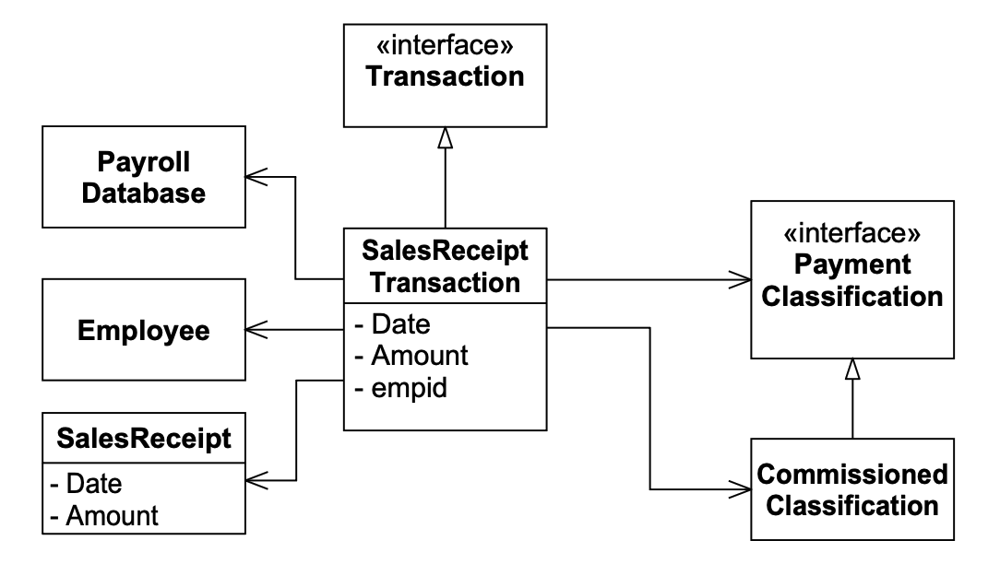<br/>
*Fig 19-9 SalesReceiptTransaction 的静态模型*

<br/>
*Fig 19-10 SalesReceiptTransaction 的动态模型*

Fig 19-11 和 Fig 19-12 显示了向工会会员登记服务费的事务的设计。

这些设计指出了事务模型与我们创建的核心模型之间的不匹配。
我们的核心 Employee 对象可以隶属于许多不同的组织，但事务模型假设任何会员资格都必须是工会会员资格。
因此，事务模型没有提供识别特定类型会员资格的方法。
相反，它只是假设如果我们正在登记服务费，那么该员工有工会会员资格。

动态模型通过搜索 Employee 对象包含的 Affiliation 对象集合中的 UnionAffiliation 对象来解决这个困境。
然后它将 ServiceCharge 对象添加到该 UnionAffiliation 中。

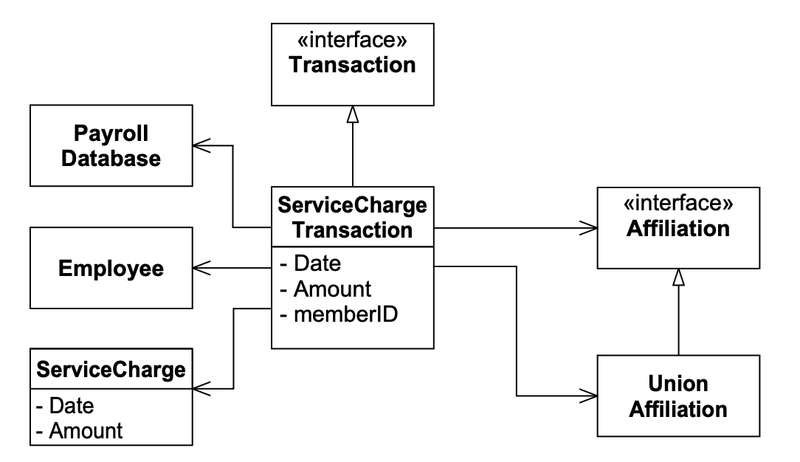<br/>
*Fig 19-11 ServiceChargeTransaction的静态模型*

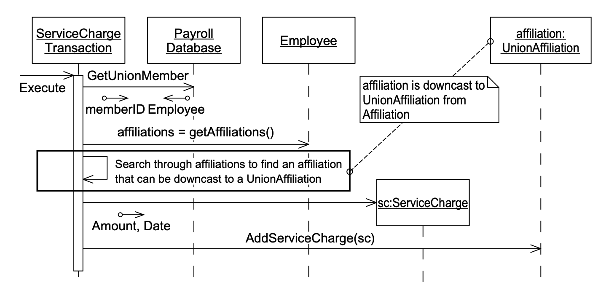<br/>
*Fig 19-12 ServiceChargeTransaction的动态模型*

Listing 19-16 显示了 ServiceChargeTransaction 的测试用例。
它简单地创建了一个小时工，并添加了一个 UnionAffiliation。
它还确保适当的会员 ID 已向 PayrollDatabase 注册。
然后创建一个 ServiceChargeTransaction 并执行它。
最后，确保适当的 ServiceCharge 确实已添加到 Employee 的 UnionAffiliation 中。

Listing 19-16 PayrollTest::TestAddServiceCharge()

```cpp
void PayrollTest::TestAddServiceCharge()
{
    cerr << "TestAddServiceCharge" << endl;
    int empId = 2;
    AddHourlyEmployee t(empId, "Bill", "Home", 15.25);
    t.Execute();

    Employee* e = GpayrollDatabase.GetEmployee(empId);
    assert(e);
    UnionAffiliation* af = new UnionAffiliation(12.5);
    e->SetAffiliation(af);

    int memberId = 86; // Maxwell Smart
    GpayrollDatabase.AddUnionMember(memberId, e);

    ServiceChargeTransaction sct(memberId, 20011101, 12.95);
    sct.Execute();

    ServiceCharge* sc = af->GetServiceCharge(20011101);
    assert(sc);
    assertEquals(12.95, sc->GetAmount(), .001);
}
```

**代码 v. UML。**
当我在 Fig 19-12 中绘制 UML 时，我认为用 Affiliation 列表替换 NoAffiliation 是一个更好的设计。
我认为它更灵活，更不复杂。
毕竟，我可以随时添加新的会员资格，而且不必创建 NoAffiliation 类。
然而，在编写 Listing 19-16 中的测试用例时，我意识到在 Employee 上调用 SetAffiliation 比调用 AddAffiliation 更好。
毕竟，需求并没有要求员工有多个 Affiliation，因此没有必要使用 dynamic_cast 在许多可能的类型之间进行选择。
这样做会不必要的复杂。

这是一个例子，说明了为什么在代码中验证之前做太多 UML 可能是危险的。
代码可以告诉你 UML 无法告诉你的关于设计的事情。
在这里，我在 UML 中放置了不需要的结构。
也许有一天它们会派上用场，但在这之前它们需要被维护。
这种维护的成本可能不值得。

在这种情况下，即使维护 dynamic_cast 的成本相对较小，我也不打算使用它。
不使用 Affiliation 对象的列表实现起来要简单得多。
所以我将保留 NULL OBJECT 模式，使用 NoAffiliation 类。

Listing 19-17 和 19-18 显示了 ServiceChargeTransaction 的实现。
没有查找 UnionAffiliation 对象的循环，它确实简单得多。
它只是从数据库中获取 Employee，将其 Affiliation 向下转型为 UnionAffiliation，并向其添加 ServiceCharge。

Listing 19-17 ServiceChargeTransaction.h

```cpp
#ifndef SERVICECHARGETRANSACTION_H
#define SERVICECHARGETRANSACTION_H

#include "Transaction.h"

class ServiceChargeTransaction : public Transaction
{
public:
    virtual ~ServiceChargeTransaction();
    ServiceChargeTransaction(int memberId, long date, double charge);
    virtual void Execute();

private:
    int itsMemberId;
    long itsDate;
    double itsCharge;
};

#endif
```

Listing 19-18 ServiceChargeTransaction.cpp

```cpp
#include "ServiceChargeTransaction.h"
#include "Employee.h"
#include "ServiceCharge.h"
#include "PayrollDatabase.h"
#include "UnionAffiliation.h"

extern PayrollDatabase GpayrollDatabase;

ServiceChargeTransaction::~ServiceChargeTransaction()
{
}

ServiceChargeTransaction::
ServiceChargeTransaction(int memberId, long date, double charge)
    : itsMemberId(memberId)
    , itsDate(date)
    , itsCharge(charge)
{
}

void ServiceChargeTransaction::Execute()
{
    Employee* e = GpayrollDatabase.GetUnionMember(itsMemberId);
    Affiliation* af = e->GetAffiliation();
    if (UnionAffiliation* uaf = dynamic_cast<UnionAffiliation*>(af)) {
        uaf->AddServiceCharge(itsDate, itsCharge);
    }
}
```

## 修改员工信息

<br/>

Fig 19-13 和 Fig 19-14 展示了修改员工属性的事务的静态结构。
该结构很容易从用例 6 推导出来。
所有事务都接受一个 EmpID 参数，因此我们可以创建一个名为 ChangeEmployeeTransaction 的顶级基类。
在这个基类之下是修改单个属性的类，例如 ChangeNameTransaction 和 ChangeAddressTransaction。
修改分类的事务有共同的目的，因为它们都修改 Employee 对象的同一字段。
因此，它们可以归在抽象基类 ChangeClassificationTransaction 下。
修改支付方式和会员资格的事务也是如此，这可以从 ChangeMethodTransaction 和 ChangeAffiliationTransaction 的结构中看出。

图19-15展示了所有修改事务的动态模型。我们再次看到TEMPLATE METHOD模式的使用。在每种情况下，都必须从PayrollDatabase中检索与EmpID对应的Employee对象。因此，ChangeEmployeeTransaction的Execute函数实现了这一行为，然后向自身发送Change消息。该方法将被声明为虚函数，并在派生类中实现，如图19-16和图19-17所示。

**清单19-19** 展示了 `ChangeNameTransaction` 的测试用例。这个测试用例非常简单。它使用 `AddHourlyEmployee` 事务创建了一个名为 Bill 的小时工。然后创建并执行一个 `ChangeNameTransaction`，将员工姓名改为 Bob。最后，它从 `PayrollDatabase` 中获取 `Employee` 实例，并验证姓名已被更改。

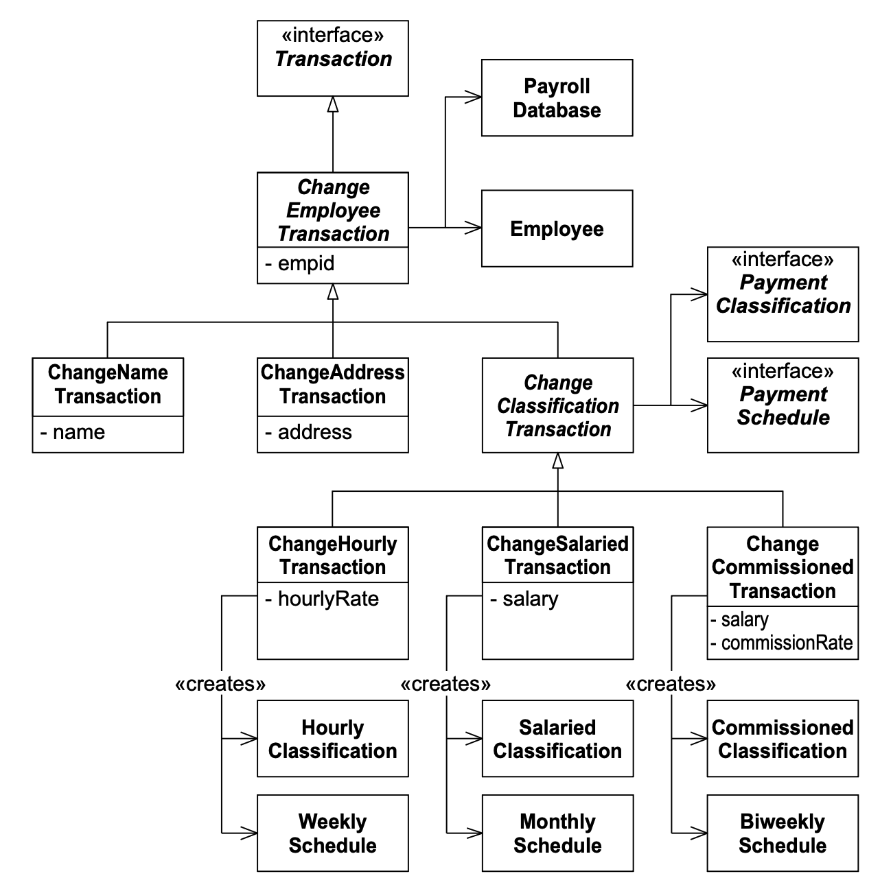<br/>
*Fig 19-13 ChangeEmployeeTransaction 的静态模型*

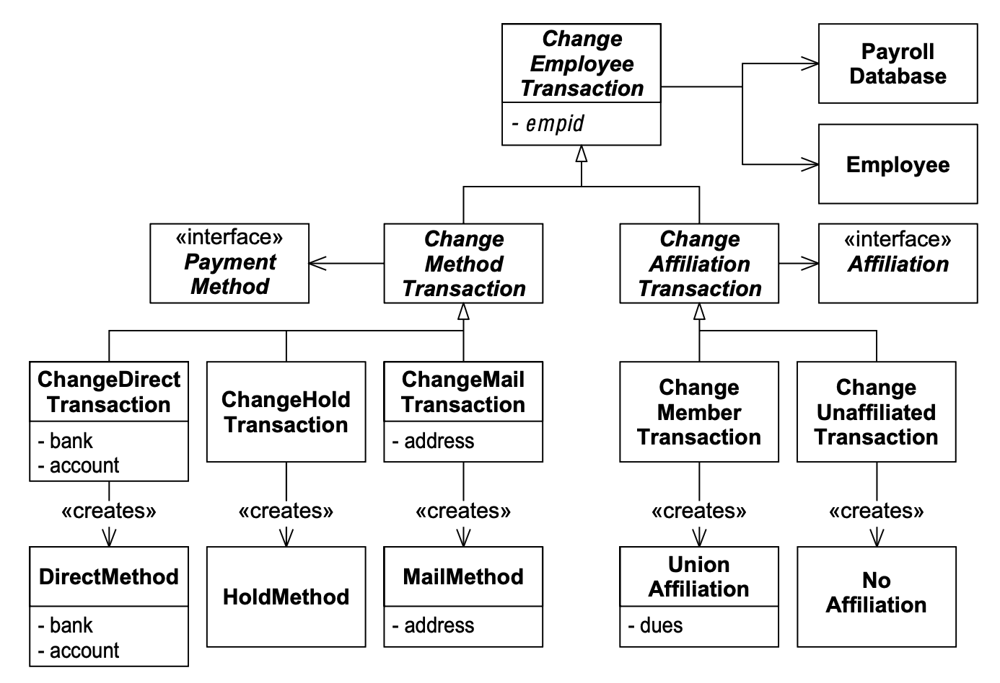<br/>
*Fig 19-14 ChangeEmployeeTransaction 的静态模型（续）*

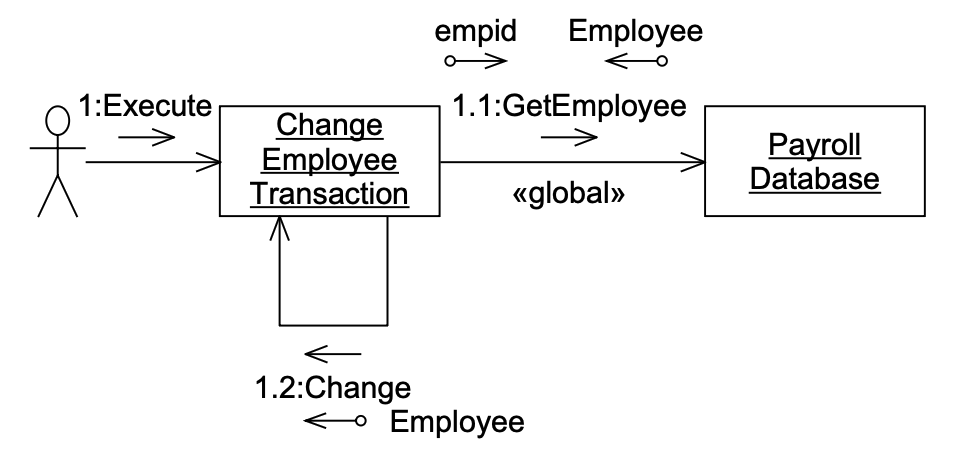<br/>
*Fig 19-15 ChangeEmployeeTransaction 的动态模型*

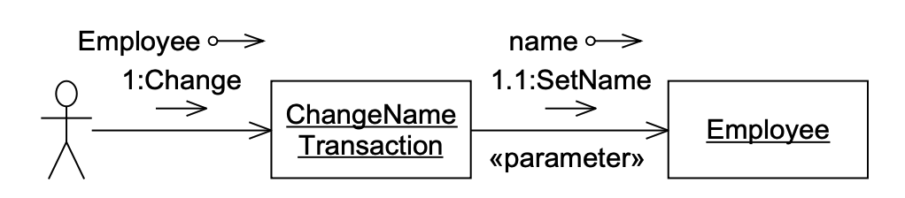<br/>
*Fig 19-16 ChangeNameTransaction 的动态模型*

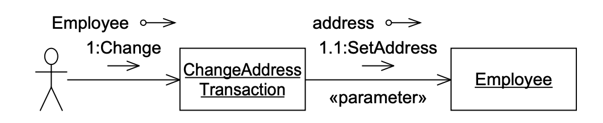<br/>
*Fig 19-17 ChangeAddressTransaction 的动态模型*

Listing 19-19 PayrollTest::TestChangeNameTransaction()

```cpp
void PayrollTest::TestChangeNameTransaction()
{
    cerr << "TestChangeNameTransaction" << endl;
    int empId = 2;
    AddHourlyEmployee t(empId, "Bill", "Home", 15.25);
    t.Execute();

    ChangeNameTransaction cnt(empId, "Bob");
    cnt.Execute();

    Employee* e = GpayrollDatabase.GetEmployee(empId);
    assert(e);
    assert("Bob" == e->GetName());
}
```

Listing 19-20 和 19-21 展示了抽象基类 `ChangeEmployeeTransaction` 的实现。
TEMPLATE METHOD 模式的结构清晰可见。
`Execute()` 方法只是从 `PayrollDatabase` 中读取相应的 `Employee` 实例，如果成功，则调用纯虚函数 `Change()`。

Listing 19-20 ChangeEmployeeTransaction.h

```cpp
#ifndef CHANGEEMPLOYEETRANSACTION_H
#define CHANGEEMPLOYEETRANSACTION_H

#include "Transaction.h"
#include "Employee.h"

class ChangeEmployeeTransaction : public Transaction
{
public:
    ChangeEmployeeTransaction(int empid);
    virtual ~ChangeEmployeeTransaction();
    virtual void Execute();
    virtual void Change(Employee&) = 0;

private:
    int itsEmpId;
};

#endif
```

Listing 19-21 ChangeEmployeeTransaction.cpp

```cpp
#include "ChangeEmployeeTransaction.h"
#include "Employee.h"
#include "PayrollDatabase.h"

extern PayrollDatabase GpayrollDatabase;

ChangeEmployeeTransaction::~ChangeEmployeeTransaction()
{
}

ChangeEmployeeTransaction::ChangeEmployeeTransaction(int empid)
    : itsEmpId(empid)
{
}

void ChangeEmployeeTransaction::Execute()
{
    Employee* e = GpayrollDatabase.GetEmployee(itsEmpId);
    if (e != 0)
        Change(*e);
}
```

Listing 19-22 和 19-23 展示了 `ChangeNameTransaction` 的实现。
TEMPLATE METHOD 的后半部分很容易看到。
`Change()` 方法被实现为更改 `Employee` 参数的名称。
`ChangeAddressTransaction` 的结构非常相似，留作练习。

Listing 19-22 ChangeNameTransaction.h

```cpp
#ifndef CHANGENAMETRANSACTION_H
#define CHANGENAMETRANSACTION_H

#include "ChangeEmployeeTransaction.h"
#include <string>

class ChangeNameTransaction : public ChangeEmployeeTransaction
{
public:
    virtual ~ChangeNameTransaction();
    ChangeNameTransaction(int empid, string name);
    virtual void Change(Employee&);

private:
    string itsName;
};

#endif
```

Listing 19-23 ChangeNameTransaction.cpp

```cpp
#include "ChangeNameTransaction.h"

ChangeNameTransaction::~ChangeNameTransaction()
{
}

ChangeNameTransaction::ChangeNameTransaction(int empid,
                                              string name)
    : ChangeEmployeeTransaction(empid)
    , itsName(name)
{
}

void ChangeNameTransaction::Change(Employee& e)
{
    e.SetName(itsName);
}
```

### 修改分类

Fig 19-18 展示了 ChangeClassificationTransaction 的动态行为设想。
再次使用了 TEMPLATE METHOD 模式。
事务必须创建一个新的 PaymentClassification 对象，然后将其交给 Employee 对象。
这是通过向自身发送 GetClassification 消息来实现的。
这个抽象方法在 ChangeClassificationTransaction 的每个派生类中实现，如 Fig 19-19 至 19-21 所示。

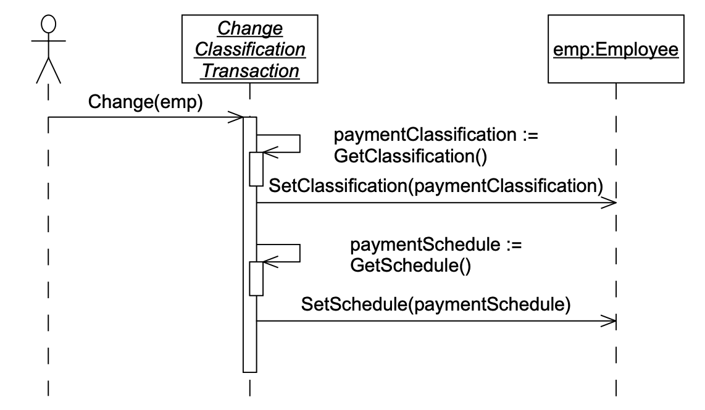<br/>
*Fig 19-18 ChangeClassificationTransaction 的动态模型*

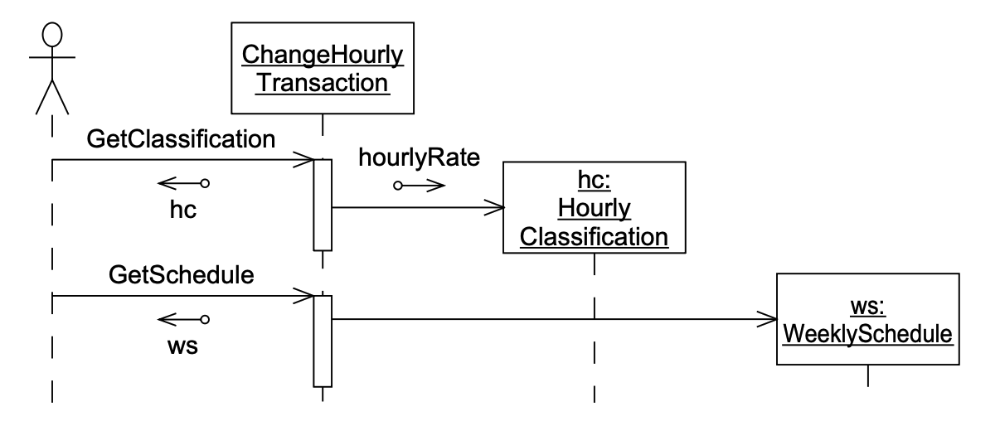<br/>
*Fig 19-19 ChangeHourlyTransaction 的动态模型*

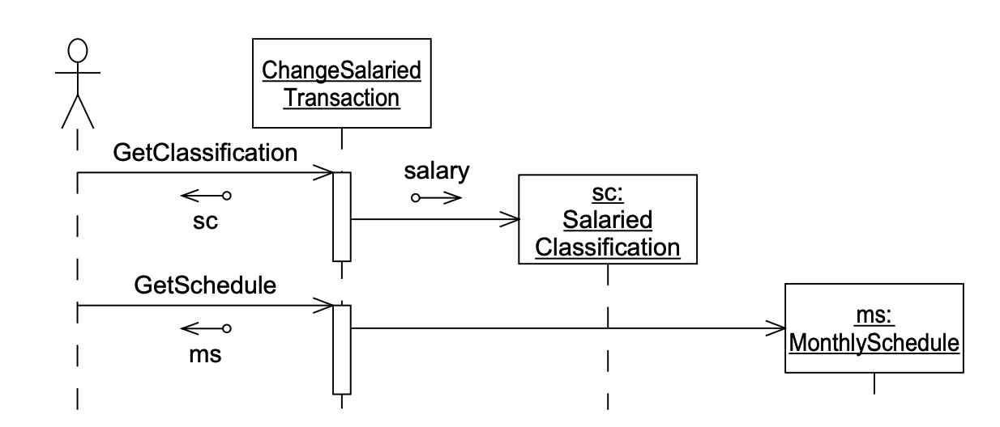<br/>
*Fig 19-20 ChangeSalariedTransaction 的动态模型*

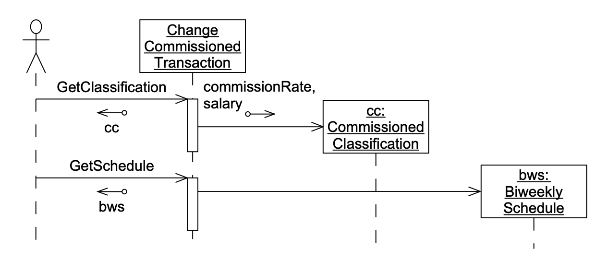<br/>
*Fig 19-21 ChangeCommissionedTransaction 的动态模型*

Listing 19-24 PayrollTest::TestChangeHourlyTransaction()

```cpp
void PayrollTest::TestChangeHourlyTransaction()
{
    cerr << "TestChangeHourlyTransaction" << endl;
    int empId = 3;
    AddCommissionedEmployee t(empId, "Lance", "Home", 2500, 3.2);
    t.Execute();

    ChangeHourlyTransaction cht(empId, 27.52);
    cht.Execute();

    Employee* e = GpayrollDatabase.GetEmployee(empId);
    assert(e);
    PaymentClassification* pc = e->GetClassification();
    assert(pc);
    HourlyClassification* hc =
        dynamic_cast<HourlyClassification*>(pc);
    assert(hc);
    assertEquals(27.52, hc->GetRate(), .001);
    PaymentSchedule* ps = e->GetSchedule();
    WeeklySchedule* ws = dynamic_cast<WeeklySchedule*>(ps);
    assert(ws);
}
```

Listing 19-25 和 19-26 展示了抽象基类 `ChangeClassificationTransaction` 的实现。
再次，TEMPLATE METHOD 模式很容易识别。
`Change()` 方法调用了两个纯虚函数 `GetClassification()` 和 `GetSchedule()`。
它使用这些函数的返回值来设置 `Employee` 的分类和调度。

Listing 19-25 ChangeClassificationTransaction.h

```cpp
#ifndef CHANGECLASSIFICATIONTRANSACTION_H
#define CHANGECLASSIFICATIONTRANSACTION_H

#include "ChangeEmployeeTransaction.h"

class PaymentClassification;
class PaymentSchedule;

class ChangeClassificationTransaction : public ChangeEmployeeTransaction
{
public:
    virtual ~ChangeClassificationTransaction();
    ChangeClassificationTransaction(int empid);

    virtual void Change(Employee&);
    virtual PaymentClassification* GetClassification() const = 0;
    virtual PaymentSchedule* GetSchedule() const = 0;
};

#endif
```

Listing 19-26 ChangeClassificationTransaction.cpp

```cpp
#include "ChangeClassificationTransaction.h"

ChangeClassificationTransaction::~ChangeClassificationTransaction()
{
}

ChangeClassificationTransaction::ChangeClassificationTransaction(int empid)
    : ChangeEmployeeTransaction(empid)
{
}

void ChangeClassificationTransaction::Change(Employee& e)
{
    e.SetClassification(GetClassification());
    e.SetSchedule(GetSchedule());
}
```

Listing 19-27 和 19-28 展示了 `ChangeHourlyTransaction` 类的实现。
该类通过实现从 `ChangeClassificationTransaction` 继承的 `GetClassification()` 和 `GetSchedule()` 方法，完成了 TEMPLATE METHOD模式。
它实现 `GetClassification()` 返回一个新创建的 `HourlyClassification`。
它实现 `GetSchedule()` 返回一个新创建的 `WeeklySchedule`。

Listing 19-27 ChangeHourlyTransaction.h

```cpp
#ifndef CHANGEHOURLYTRANSACTION_H
#define CHANGEHOURLYTRANSACTION_H

#include "ChangeClassificationTransaction.h"

class ChangeHourlyTransaction : public ChangeClassificationTransaction
{
public:
    virtual ~ChangeHourlyTransaction();
    ChangeHourlyTransaction(int empid, double hourlyRate);

    virtual PaymentSchedule* GetSchedule() const;
    virtual PaymentClassification* GetClassification() const;

private:
    double itsHourlyRate;
};

#endif
```

Listing 19-28 ChangeHourlyTransaction.cpp

```cpp
#include "ChangeHourlyTransaction.h"
#include "WeeklySchedule.h"
#include "HourlyClassification.h"

ChangeHourlyTransaction::~ChangeHourlyTransaction()
{
}

ChangeHourlyTransaction::ChangeHourlyTransaction(int empid, double hourlyRate)
    : ChangeClassificationTransaction(empid)
    , itsHourlyRate(hourlyRate)
{
}

PaymentSchedule* ChangeHourlyTransaction::GetSchedule() const
{
    return new WeeklySchedule();
}

PaymentClassification* ChangeHourlyTransaction::GetClassification() const
{
    return new HourlyClassification(itsHourlyRate);
}
```

一如既往，`ChangeSalariedTransaction` 和 `ChangeCommissionedTransaction` 留作读者的练习。

对于 `ChangeMethodTransaction` 的实现，采用了类似的机制。
抽象方法 `GetMethod` 用于选择适当的 `PaymentMethod` 派生类，然后将其交给 `Employee` 对象。
（见 Fig 19-22 至 19-25。）

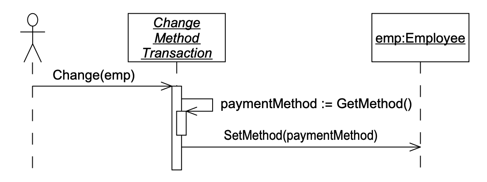<br/>
*Fig 19-22 ChangeMethodTransaction 的动态模型*

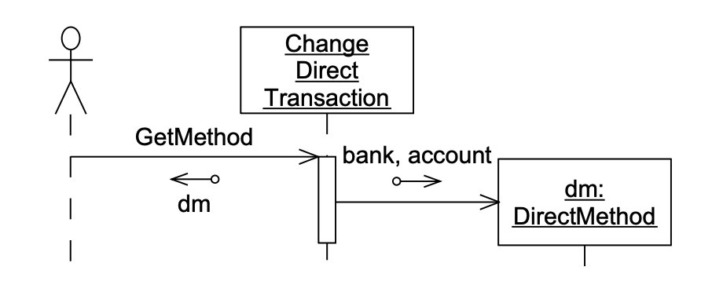<br/>
*Fig 19-23 ChangeDirectTransaction 的动态模型*

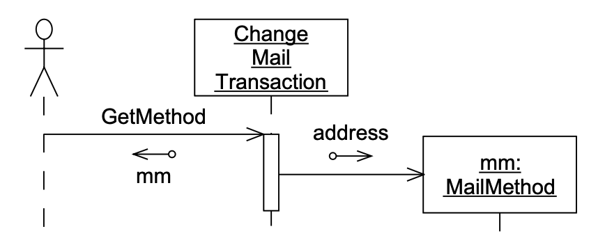<br/>
*Fig 19-24 ChangeMailTransaction 的动态模型*

<br/>
*Fig 19-25 ChangeHoldTransaction的动态模型*

这些类的实现结果直接且不出所料。它们也留作练习。

Fig 19-26 展示了 ChangeAffiliationTransaction 的实现。
我们再次使用 TEMPLATE METHOD 模式来选择应交给 Employee 对象的 Affiliation 派生类。
（见 Fig 19-27 至 19-29。）

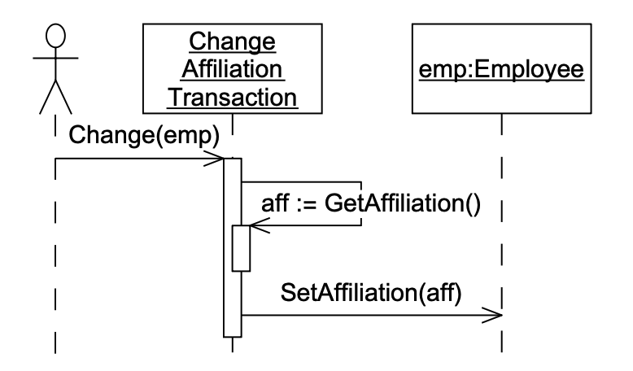<br/>
*Fig 19-26 ChangeAffiliationTransaction 的动态模型*

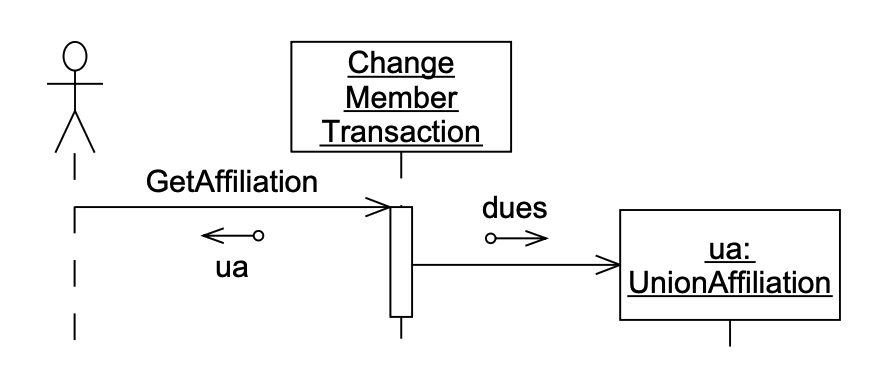<br/>
*Fig 19-27 ChangeMemberTransaction 的动态模型*

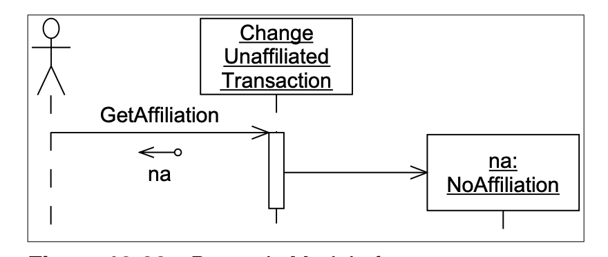<br/>
*Fig 19-28 ChangeUnaffiliatedTransaction 的动态模型*

### 我当时在想什么？

当我去实现这个设计时，我感到非常惊讶。
仔细看看会员资格事务的动态图。
你能发现问题吗？

我像往常一样，从编写 ChangeMemberTransaction 的测试用例开始实现。
你可以在 Listing 19-29 中看到这个测试用例。
测试用例一开始足够直接。
它创建了一个名为 Bill 的小时工，然后创建并执行一个 ChangeMemberTransaction，让 Bill 加入工会。
然后它检查 Bill 是否绑定了一个 UnionAffiliation，并且 UnionAffiliation 的会费是否正确。

Listing 19-29 PayrollTest::TestChangeMemberTransaction()

```cpp
void PayrollTest::TestChangeMemberTransaction()
{
    cerr << "TestChangeMemberTransaction" << endl;
    int empId = 2;
    int memberId = 7734;
    AddHourlyEmployee t(empId, "Bill", "Home", 15.25);
    t.Execute();

    ChangeMemberTransaction cmt(empId, memberId, 99.42);
    cmt.Execute();

    Employee* e = GpayrollDatabase.GetEmployee(empId);
    assert(e);
    Affiliation* af = e->GetAffiliation();
    assert(af);
    UnionAffiliation* uf = dynamic_cast<UnionAffiliation*>(af);
    assert(uf);
    assertEquals(99.42, uf->GetDues(), .001);

    Employee* member = GpayrollDatabase.GetUnionMember(memberId);
    assert(member);
    assert(e == member);
}
```

惊喜隐藏在测试用例的最后几行。
这些行确保 PayrollDatabase 已记录 Bill 的工会会员资格。
现有的 UML 图中没有任何内容确保这一点。
UML 只关心适当的 Affiliation 派生类被绑定到 Employee。
我完全没有注意到这个缺陷。
你呢？

我愉快地按照图表编写事务代码，然后看着单元测试失败。
一旦失败发生，我忽略了什么是显而易见的。
但问题的解决方案并不明显。
我如何让 ChangeMemberTransaction 记录会员资格，而让 ChangeUnaffiliatedTransaction 擦除它？

答案是向 ChangeAffiliationTransaction 添加另一个纯虚函数，名为 RecordMembership(Employee*)。
这个函数在 ChangeMemberTransaction 中实现为将 memberId 绑定到 Employee 实例。
在 ChangeUnaffiliatedTransaction 中实现为擦除会员记录。

Listing 19-30 和 19-31 显示了最终的抽象基类 ChangeAffiliationTransaction 的实现。
再次，TEMPLATE METHOD 模式的使用是显而易见的。

Listing19-30 ChangeAffiliationTransaction.h

```cpp
#ifndef CHANGEAFFILIATIONTRANSACTION_H
#define CHANGEAFFILIATIONTRANSACTION_H

#include "ChangeEmployeeTransaction.h"

class ChangeAffiliationTransaction : public ChangeEmployeeTransaction
{
public:
    virtual ~ChangeAffiliationTransaction();
    ChangeAffiliationTransaction(int empid);

    virtual Affiliation* GetAffiliation() const = 0;
    virtual void RecordMembership(Employee*) = 0;
    virtual void Change(Employee&);
};

#endif
```

Listing 19-31 ChangeAffiliationTransaction.cpp

```cpp
#include "ChangeAffiliationTransaction.h"

ChangeAffiliationTransaction::~ChangeAffiliationTransaction()
{
}

ChangeAffiliationTransaction::ChangeAffiliationTransaction(int empid)
    : ChangeEmployeeTransaction(empid)
{
}

void ChangeAffiliationTransaction::Change(Employee& e)
{
    RecordMembership(&e);
    e.SetAffiliation(GetAffiliation());
}
```

Listing 19-32 和 Listing 19-33 显示了 ChangeMemberTransaction 的实现。
这并不特别复杂或有趣。
另一方面，Listing 19-34 和 Listing 19-35 中 ChangeUnaffiliatedTransaction 的实现则更为实质。
RecordMembership 函数必须决定当前员工是否是工会会员。
如果是，则从 UnionAffiliation 获取 memberId 并擦除会员记录。

Listing 19-32 ChangeMemberTransaction.h

```cpp
#ifndef CHANGEMEMBERTRANSACTION_H
#define CHANGEMEMBERTRANSACTION_H

#include "ChangeAffiliationTransaction.h"

class ChangeMemberTransaction : public ChangeAffiliationTransaction
{
public:
    virtual ~ChangeMemberTransaction();
    ChangeMemberTransaction(int empid, int memberid, double dues);

    virtual Affiliation* GetAffiliation() const;
    virtual void RecordMembership(Employee*);

private:
    int itsMemberId;
    double itsDues;
};

#endif
```

Listing 19-33 ChangeMemberTransaction.cpp

```cpp
#include "ChangeMemberTransaction.h"
#include "UnionAffiliation.h"
#include "PayrollDatabase.h"

extern PayrollDatabase GpayrollDatabase;

ChangeMemberTransaction::~ChangeMemberTransaction()
{
}

ChangeMemberTransaction::
ChangeMemberTransaction(int empid, int memberid, double dues)
    : ChangeAffiliationTransaction(empid)
    , itsMemberId(memberid)
    , itsDues(dues)
{
}

Affiliation* ChangeMemberTransaction::GetAffiliation() const
{
    return new UnionAffiliation(itsMemberId, itsDues);
}

void ChangeMemberTransaction::RecordMembership(Employee* e)
{
    GpayrollDatabase.AddUnionMember(itsMemberId, e);
}
```

Listing 19-34 ChangeUnaffiliatedTransaction.h

```cpp
#ifndef CHANGEUNAFFILIATEDTRANSACTION_H
#define CHANGEUNAFFILIATEDTRANSACTION_H

#include "ChangeAffiliationTransaction.h"

class ChangeUnaffiliatedTransaction : public ChangeAffiliationTransaction
{
public:
    virtual ~ChangeUnaffiliatedTransaction();
    ChangeUnaffiliatedTransaction(int empId);

    virtual Affiliation* GetAffiliation() const;
    virtual void RecordMembership(Employee*);
};

#endif
```

Listing 19-35 ChangeUnaffiliatedTransaction.cpp

```cpp
#include "ChangeUnaffiliatedTransaction.h"
#include "NoAffiliation.h"
#include "UnionAffiliation.h"
#include "PayrollDatabase.h"

extern PayrollDatabase GpayrollDatabase;

ChangeUnaffiliatedTransaction::~ChangeUnaffiliatedTransaction()
{
}

ChangeUnaffiliatedTransaction::ChangeUnaffiliatedTransaction(int empId)
    : ChangeAffiliationTransaction(empId)
{
}

Affiliation* ChangeUnaffiliatedTransaction::GetAffiliation() const
{
    return new NoAffiliation();
}

void ChangeUnaffiliatedTransaction::RecordMembership(Employee* e)
{
    Affiliation* af = e->GetAffiliation();
    if (UnionAffiliation* uf = dynamic_cast<UnionAffiliation*>(af))
    {
        int memberId = uf->GetMemberId();
        GpayrollDatabase.RemoveUnionMember(memberId);
    }
}
```

我不能说我对这个设计很满意。
`ChangeUnaffiliatedTransaction` 必须了解 `UnionAffiliation`，这让我很困扰。
我可以通过在 `Affiliation` 类中放置 `RecordMembership` 和 `EraseMembership` 抽象方法来解决这个问题。
然而，这将迫使 `UnionAffiliation` 和 `NoAffiliation` 了解 `PayrollDatabase`。
我也不太喜欢那样。²

² 我本可以使用 VISITOR 模式（ [第 387 页](../ch28/0.md) ）来解决这个问题，但那样可能就过度设计了。

尽管如此，目前的实现相当简单，只是略微违反了 OCP。
好的是，系统中很少有模块知道 `ChangeUnaffiliatedTransaction`，所以它额外的依赖关系不会造成太大伤害。

## 支付员工

最后，是时候考虑这个应用程序的核心事务了：指示系统支付适当员工的事务。
Fig 19-29 显示了 PaydayTransaction 类的静态结构。
Fig 19-30 至 Fig 19-33 描述了动态行为。

这几个动态模型表达了大量的多态行为。
CalculatePay 消息采用的算法取决于 Employee 对象包含的 PaymentClassification 类型。
用于确定某日期是否为发薪日的算法取决于 Employee 包含的 PaymentSchedule 类型。
用于向 Employee 发送支付消息的算法取决于 PaymentMethod 对象的类型。
这种高度的抽象使得算法能够在添加新的支付分类、调度、会员资格或支付方式时保持封闭。

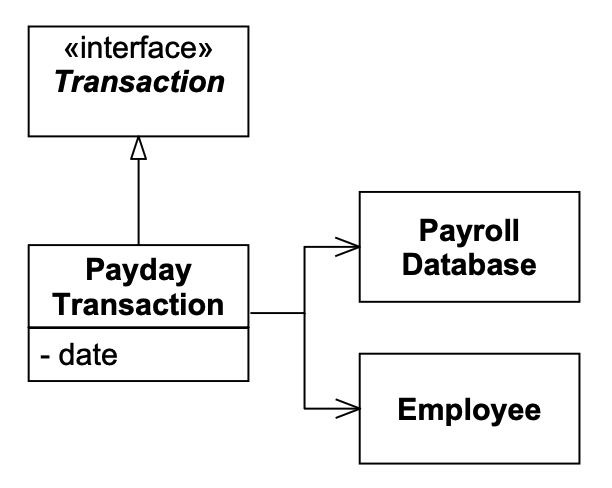<br/>
*Fig 19-29 PaydayTransaction 的静态模型*

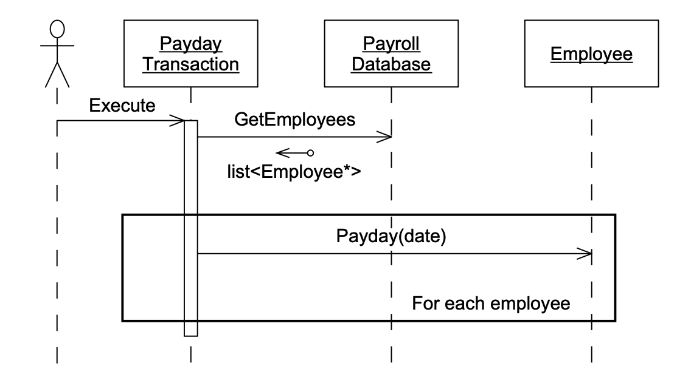<br/>
*Fig 19-30 PaydayTransaction 的动态模型*

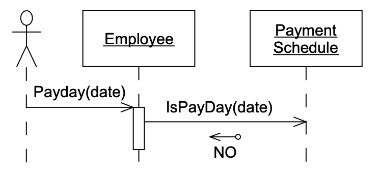<br/>
*Fig 19-31 动态模型场景：“今天不是发薪日。”*

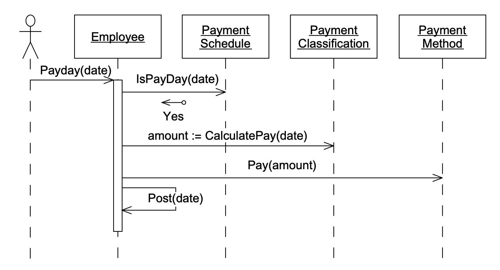<br/>
*Fig 19-32 动态模型场景：“今天是发薪日。”*

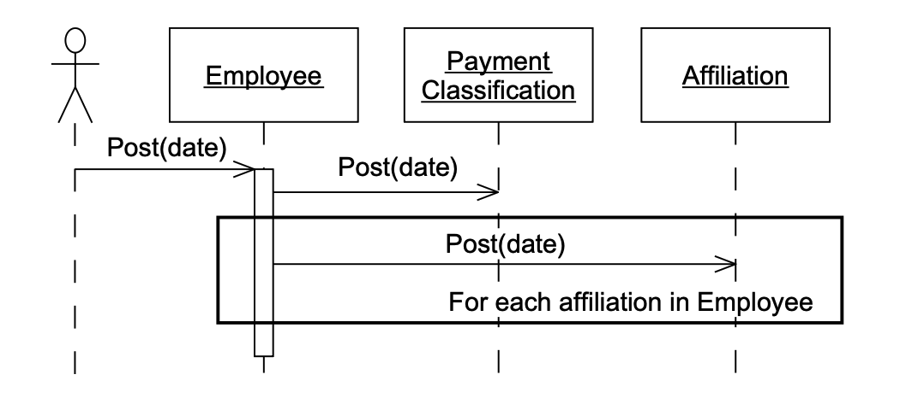<br/>
*Fig 19-33 动态模型场景：记录支付*

Fig 19-32 和 Fig 19-33 中描述的算法引入了过账（posting）的概念。
在计算出正确的支付金额并发送给 Employee 之后，支付被过账；
也就是说，支付涉及的记录会被更新。
因此，我们可以将 CalculatePay 方法定义为从上次过账到指定日期的薪资计算。

### 我们是否希望开发人员做出业务决策？

这个过账的概念从何而来？
在用户故事或用例中当然没有提到。
碰巧，这是我为了解决我察觉到的一个问题而编造出来的。
我担心 Payday 方法可能会用同一个日期、或者同一计薪周期内的日期被多次调用，所以我希望确保员工不会被重复发薪。
这是我主动做的，没有询问我的客户。
这看起来是正确的事情。

实际上，我做出了一个业务决策。
我决定多次运行薪资程序会产生不同的结果。
我应该向我的客户或项目经理询问此事，因为他们可能有非常不同的想法。

在与客户核实后，我发现过账的想法违背了他的意图。³
客户希望能够运行薪资系统，然后审核工资支票。
如果任何支票有误，客户希望更正薪资信息并再次运行薪资程序。
他们告诉我，我永远不应考虑当前支付周期之外日期的考勤卡或销售凭条。

³ 好吧，我就是那个客户。

所以，我们必须放弃过账方案。
这在当时看起来是个好主意，但这不是客户想要的。

### 支付固定月薪员工

Listing 19-36 中有两个测试用例。
它们测试固定月薪员工是否被正确支付。
第一个测试用例确保员工在当月的最后一天被支付。
第二个测试用例确保如果不是当月的最后一天，员工不会被支付。

Listing 19-36 PayrollTest::TestPaySingleSalariedEmployee & co.

```cpp
void PayrollTest::TestPaySingleSalariedEmployee()
{
    cerr << "TestPaySingleSalariedEmployee" << endl;
    int empId = 1;
    AddSalariedEmployee t(empId, "Bob", "Home", 1000.00);
    t.Execute();

    Date payDate(11,30,2001);
    PaydayTransaction pt(payDate);
    pt.Execute();

    Paycheck* pc = pt.GetPaycheck(empId);
    assert(pc);
    assert(pc->GetPayDate() == payDate);
    assertEquals(1000.00, pc->GetGrossPay(), .001);
    assert("Hold" == pc->GetField("Disposition"));
    assertEquals(0.0, pc->GetDeductions(), .001);
    assertEquals(1000.00, pc->GetNetPay(), .001);
}

void PayrollTest::TestPaySingleSalariedEmployeeOnWrongDate()
{
    cerr << "TestPaySingleSalariedEmployeeWrongDate" << endl;
    int empId = 1;
    AddSalariedEmployee t(empId, "Bob", "Home", 1000.00);
    t.Execute();

    Date payDate(11,29,2001);
    PaydayTransaction pt(payDate);
    pt.Execute();

    Paycheck* pc = pt.GetPaycheck(empId);
    assert(pc == 0);
}
```

还记得在 Listing 19-13 中，当我实现 TimeCard 类时，我使用了一个 long 整数来表示日期吗？
现在，我需要一个真正的 Date 类。
这两个测试用例不会通过，除非我能判断支付日期是否为当月的最后一天。

结果，我大约 10 年前为所教的一门 C++ 课程编写了一个 Date 类。
所以我翻遍了档案，在我闲置的一台旧 sparcstation 上找到了它。⁴
我把它移到了我的开发环境中，并在几分钟内设法使其编译通过。
这让我感到惊讶，因为我是在 Linux 上编写它的，但现在却在 Windows 2000 上使用它。
有几个小 bug 需要修复，我还必须用 STL string 类替换我自己开发的 string 类，但最终工作量很小。

⁴ 最初的 oma.com。
这是一台我从一家公司以 6000 美元购买的工作站，该公司曾为某个项目购买了它，但后来取消了该项目。
在 1994 年，那真是笔好买卖。
这台机器至今仍在 Object Mentor 网络上安静运行，这证明了它的构造有多精良。

Listing 19-37 显示了 PaydayTransaction 的 Execute() 函数。
它遍历数据库中的所有 Employee 对象。
它询问每个员工此事务上的日期是否为它的发薪日。
如果是，则为该员工创建一个新的 Paycheck 并告诉员工填写其字段。

Listing 19-37 PaydayTransaction::Execute()

```cpp
void PaydayTransaction::Execute()
{
    list<int> empIds;
    GpayrollDatabase.GetAllEmployeeIds(empIds);
    list<int>::iterator i = empIds.begin();
    for (; i != empIds.end(); i++) {
        int empId = *i;
        if (Employee* e = GpayrollDatabase.GetEmployee(empId)) {
            if (e->IsPayDate(itsPayDate)) {
                Paycheck* pc = new Paycheck(itsPayDate);
                itsPaychecks[empId] = pc;
                e->Payday(*pc);
            }
        }
    }
}
```

Listing 19-38 显示了 `MonthlySchedule.cpp` 的一个片段。
注意，它实现了 `IsPayDate`，只有当参数日期是当月的最后一天时才返回 `true`。
这个算法说明了为什么我需要 `Date` 类。
如果没有一个好的 `Date` 类，做这类简单的日期计算是非常困难的。

Listing 19-38 MonthlySchedule.cpp (片段)

```cpp
namespace
{
    bool IsLastDayOfMonth(const Date& date)
    {
        int m1 = date.GetMonth();
        int m2 = (date+1).GetMonth();
        return (m1 != m2);
    }
}

bool MonthlySchedule::IsPayDate(const Date& payDate) const
{
    return IsLastDayOfMonth(payDate);
}
```

Listing 19-39 显示了 `Employee::PayDay()` 的实现。
这个函数是计算和分发所有员工工资的通用算法。
注意其中大量使用了 STRATEGY 模式。
所有详细计算都委托给包含的策略类：`itsClassification`、`itsAffiliation` 和 `itsPaymentMethod`。

Listing 19-39 Employee::PayDay()

```cpp
void Employee::Payday(Paycheck& pc)
{
    double grossPay = itsClassification->CalculatePay(pc);
    double deductions = itsAffiliation->CalculateDeductions(pc);
    double netPay = grossPay - deductions;
    pc.SetGrossPay(grossPay);
    pc.SetDeductions(deductions);
    pc.SetNetPay(netPay);
    itsPaymentMethod->Pay(pc);
}
```

### 支付小时工

支付小时工是测试优先设计的渐进式方法的一个好例子。
我从非常简单的测试用例开始，逐步过渡到更复杂的用例。
我将在下面展示测试用例，然后展示由它们产生的生产代码。

Listing 19-40 展示了最简单的情况。
我们向数据库添加一个小时工，然后支付他。
由于没有任何考勤卡，我们期望工资为零。
辅助函数 `ValidateHourlyPaycheck` 代表了后来进行的重构。
最初，那段代码只是埋在测试函数内部。
这个测试用例在没有对代码其余部分进行任何更改的情况下通过了。

Listing 19-40 TestPaySingleHourlyEmployeeNoTimeCards

```cpp
void PayrollTest::TestPaySingleHourlyEmployeeNoTimeCards()
{
    cerr << "TestPaySingleHourlyEmployeeNoTimeCards" << endl;
    int empId = 2;
    AddHourlyEmployee t(empId, "Bill", "Home", 15.25);
    t.Execute();

    Date payDate(11,9,2001); // Friday
    PaydayTransaction pt(payDate);
    pt.Execute();

    ValidateHourlyPaycheck(pt, empId, payDate, 0.0);
}

void PayrollTest::ValidateHourlyPaycheck(PaydayTransaction& pt,
                                         int empid,
                                         const Date& payDate,
                                         double pay)
{
    Paycheck* pc = pt.GetPaycheck(empid);
    assert(pc);
    assert(pc->GetPayDate() == payDate);
    assertEquals(pay, pc->GetGrossPay(), .001);
    assert("Hold" == pc->GetField("Disposition"));
    assertEquals(0.0, pc->GetDeductions(), .001);
    assertEquals(pay, pc->GetNetPay(), .001);
}
```

Listing 19-41 显示了两个测试用例。
第一个测试我们能否在添加单个考勤卡后支付员工。
第二个测试我们能否为超过8小时的卡支付加班费。
当然，我不是同时编写这两个测试用例的。
相反，我先写了第一个并使其工作，然后才写第二个。

Listing 19-41 Test...OneTimeCard

```cpp
void PayrollTest::TestPaySingleHourlyEmployeeOneTimeCard()
{
    cerr << "TestPaySingleHourlyEmployeeOneTimeCard" << endl;
    int empId = 2;
    AddHourlyEmployee t(empId, "Bill", "Home", 15.25);
    t.Execute();

    Date payDate(11,9,2001); // Friday
    TimeCardTransaction tc(payDate, 2.0, empId);
    tc.Execute();

    PaydayTransaction pt(payDate);
    pt.Execute();

    ValidateHourlyPaycheck(pt, empId, payDate, 30.5);
}

void PayrollTest::TestPaySingleHourlyEmployeeOvertimeOneTimeCard()
{
    cerr << "TestPaySingleHourlyEmployeeOvertimeOneTimeCard" << endl;
    int empId = 2;
    AddHourlyEmployee t(empId, "Bill", "Home", 15.25);
    t.Execute();

    Date payDate(11,9,2001); // Friday
    TimeCardTransaction tc(payDate, 9.0, empId);
    tc.Execute();

    PaydayTransaction pt(payDate);
    pt.Execute();

    ValidateHourlyPaycheck(pt, empId, payDate, (8 + 1.5) * 15.25);
}
```

使第一个测试用例工作只是需要改变 `HourlyClassification::CalculatePay`，循环遍历员工的考勤卡，累加小时数，并乘以工资率。
使第二个测试工作迫使我重构函数，以计算正常工时和加班工时。

Listing 19-42 中的测试用例确保我们不会在不是周五的日期支付小时工。

Listing 19-42 TestPaySingleHourlyEmployeeOnWrongDate

```cpp
void PayrollTest::TestPaySingleHourlyEmployeeOnWrongDate()
{
    cerr << "TestPaySingleHourlyEmployeeOnWrongDate" << endl;
    int empId = 2;
    AddHourlyEmployee t(empId, "Bill", "Home", 15.25);
    t.Execute();

    Date payDate(11,8,2001); // Thursday
    TimeCardTransaction tc(payDate, 9.0, empId);
    tc.Execute();

    PaydayTransaction pt(payDate);
    pt.Execute();

    Paycheck* pc = pt.GetPaycheck(empId);
    assert(pc == 0);
}
```

**清单19-43** 是一个测试用例，确保我们能够计算拥有多张考勤卡的员工的工资。

**清单19-43**
TestPaySingleHourlyEmployeeTwoTimeCards
```cpp
void PayrollTest::TestPaySingleHourlyEmployeeTwoTimeCards()
{
    cerr << "TestPaySingleHourlyEmployeeTwoTimeCards" << endl;
    int empId = 2;
    AddHourlyEmployee t(empId, "Bill", "Home", 15.25);
    t.Execute();

    Date payDate(11,9,2001); // Friday
    TimeCardTransaction tc(payDate, 2.0, empId);
    tc.Execute();
    TimeCardTransaction tc2(Date(11,8,2001), 5.0, empId);
    tc2.Execute();

    PaydayTransaction pt(payDate);
    pt.Execute();

    ValidateHourlyPaycheck(pt, empId, payDate, 7 * 15.25);
}
```

最后，Listing 19-44 中的测试用例证明我们只会为当前支付周期内的考勤卡支付员工工资。来自其他支付周期的考勤卡将被忽略。

Listing 19-44 TestPaySingleHourlyEmployeeWithTimeCardsSpanningTwoPayPeriods

```cpp
void PayrollTest::
TestPaySingleHourlyEmployeeWithTimeCardsSpanningTwoPayPeriods()
{
    cerr << "TestPaySingleHourlyEmployeeWithTimeCards"
         "SpanningTwoPayPeriods" << endl;
    int empId = 2;
    AddHourlyEmployee t(empId, "Bill", "Home", 15.25);
    t.Execute();

    Date payDate(11,9,2001); // Friday
    Date dateInPreviousPayPeriod(11,2,2001);

    TimeCardTransaction tc(payDate, 2.0, empId);
    tc.Execute();
    TimeCardTransaction tc2(dateInPreviousPayPeriod, 5.0, empId);
    tc2.Execute();

    PaydayTransaction pt(payDate);
    pt.Execute();

    ValidateHourlyPaycheck(pt, empId, payDate, 2 * 15.25);
}
```

使这一切工作的代码是逐步增长的，一次一个测试用例。
你在下面的代码中看到的结构是随着测试用例逐步演进的。
Listing 19-45 显示了 HourlyClassification.cpp 的相应片段。
我们简单地遍历考勤卡。
对于每张考勤卡，我们检查它是否在当前支付周期内。
如果是，则计算它所代表的工资。

Listing 19-45 HourlyClassification.cpp（片段）

```cpp
double HourlyClassification::CalculatePay(Paycheck& pc) const
{
    double totalPay = 0;
    Date payPeriod = pc.GetPayDate();
    map<Date, TimeCard*>::const_iterator i;
    for (i = itsTimeCards.begin(); i != itsTimeCards.end(); i++) {
        TimeCard * tc = (*i).second;
        if (IsInPayPeriod(tc, payPeriod))
            totalPay += CalculatePayForTimeCard(tc);
    }
    return totalPay;
}

bool HourlyClassification::IsInPayPeriod(TimeCard* tc, const Date& payPeriod) const
{
    Date payPeriodEndDate = payPeriod;
    Date payPeriodStartDate = payPeriod - 5;
    Date timeCardDate = tc->GetDate();
    return (timeCardDate >= payPeriodStartDate) &&
           (timeCardDate <= payPeriodEndDate);
}

double HourlyClassification::CalculatePayForTimeCard(TimeCard* tc) const
{
    double hours = tc->GetHours();
    double overtime = max(0.0, hours - 8.0);
    double straightTime = hours - overtime;
    return straightTime * itsRate + overtime * itsRate * 1.5;
}
```

Listing 19-46 显示 WeeklySchedule 只在周五支付。

Listing 19-46 WeeklySchedule::IsPayDate

```cpp
bool WeeklySchedule::IsPayDate(const Date& theDate) const
{
    return theDate.GetDayOfWeek() == Date::friday;
}
```

我将计算佣金制员工工资的任务留给你。
应该不会有大的意外。
作为一个稍微有趣点的练习，允许在周末登记考勤卡，并正确计算加班费。

### 支付周期：一个设计问题

现在是时候实现工会会费和服务费了。
我正在考虑一个测试用例，它将添加一个固定月薪员工，将其转换为工会会员，然后支付该员工并确保会费已从其工资中扣除。
我已经在 Listing 19-47 中编写了这段代码。

Listing 19-47 PayrollTest::TestSalariedUnionMemberDues

```cpp
void PayrollTest::TestSalariedUnionMemberDues()
{
    cerr << "TestSalariedUnionMemberDues" << endl;
    int empId = 1;
    AddSalariedEmployee t(empId, "Bob", "Home", 1000.00);
    t.Execute();

    int memberId = 7734;
    ChangeMemberTransaction cmt(empId, memberId, 9.42);
    cmt.Execute();

    Date payDate(11,30,2001);
    PaydayTransaction pt(payDate);
    pt.Execute();

    ValidatePaycheck(pt, empId, payDate, 1000.0 - ??? );
}
```

注意测试用例最后一行中的 `???`。
我应该在那里放什么？
用户故事告诉我工会会费是按周收取的，但固定月薪员工是按月支付的。
每个月有多少周？
我应该简单地将会费乘以四吗？
那不太准确。
我要问客户他想要什么。⁵

⁵ 于是 Bob 又对自己说话了。去 www.google.com/groups 查找 “Schizophrenic Robert Martin”。

客户告诉我工会会费是在每个周五累计的。
所以我需要做的是计算支付周期中的周五数量，然后乘以每周会费。
2001 年 11 月有五个周五 —— 也就是这个测试用例所写的月份。
所以我可以适当地修改测试用例。

计算支付周期中的周五数量意味着我需要知道支付周期的开始和结束日期。
我之前在 Listing 19-45 的 `IsInPayPeriod` 函数中做过这个计算（你可能也为 `CommissionedClassification` 写了类似的一个）。
这个函数被 `HourlyClassification` 对象的 `CalculatePay` 函数用来确保只统计支付周期内的考勤卡。
现在似乎 `UnionAffiliation` 对象也必须调用这个函数。

但是等等！
这个函数在 `HourlyClassification` 类中做什么？
我们已经确定支付调度和支付分类之间的关联是偶然的。
确定支付周期的函数应该在 `PaymentSchedule` 类中，而不是在 `PaymentClassification` 类中！

有趣的是，我们的 UML 图没有帮助我们捕捉到这个问题。
这个问题只有在我开始思考 `UnionAffiliation` 的测试用例时才浮现出来。
这又是一个例子，说明编码反馈对任何设计都是多么必要。
图表可能有用，但在没有代码反馈的情况下依赖它们是有风险的。

那么我们如何将支付周期从 `PaymentSchedule` 层次结构转移到 `PaymentClassification` 和 `Affiliation` 层次结构中呢？
这些层次结构彼此并不了解。
我们可以将支付周期的日期放入 `Paycheck` 对象中。
目前，`Paycheck` 只有支付周期的结束日期。
我们也应该能够在那里获得开始日期。

Listing 19-48 显示了对 `PaydayTransaction::Execute()` 所做的更改。
注意，当 `Paycheck` 被创建时，它被传递了支付周期的开始和结束日期。
如果你提前看 Listing 19-55，你会看到是 `PaymentSchedule` 计算了这两个日期。
对 `Paycheck` 的更改应该是显而易见的。

Listing 19-48 PaydayTransaction::Execute()

```cpp
void PaydayTransaction::Execute()
{
    list<int> empIds;
    GpayrollDatabase.GetAllEmployeeIds(empIds);
    list<int>::iterator i = empIds.begin();
    for (; i != empIds.end(); i++) {
        int empId = *i;
        if (Employee* e = GpayrollDatabase.GetEmployee(empId)) {
            if (e->IsPayDate(itsPayDate)) {
                Paycheck* pc =
                    new Paycheck(e->GetPayPeriodStartDate(itsPayDate), itsPayDate);
                itsPaychecks[empId] = pc;
                e->Payday(*pc);
            }
        }
    }
}
```

在 `HourlyClassification` 和 `CommissionedClassification` 中确定 `TimeCard` 和 `SalesReceipt` 是否在支付周期内的两个函数已被合并并移动到基类 `PaymentClassification` 中。
（见 Listing 19-49。）

Listing 19-49 PaymentClassification::IsInPayPeriod(...)

```cpp
bool PaymentClassification::
IsInPayPeriod(const Date& theDate, const Paycheck& pc) const
{
    Date payPeriodEndDate = pc.GetPayPeriodEndDate();
    Date payPeriodStartDate = pc.GetPayPeriodStartDate();
    return (theDate >= payPeriodStartDate)
        && (theDate <= payPeriodEndDate);
}
```

现在我们可以计算 `UnionAffiliation::CalculateDeductions` 中的工会会费。
Listing 19-50 中的代码显示了这是如何完成的。
定义支付周期的两个日期从 `Paycheck` 中提取，并传递给一个实用函数，该函数计算它们之间的周五数量。
然后将这个数量乘以每周会费率，计算出支付周期的会费。

Listing 19-50 UnionAffiliation::CalculateDeductions()

```cpp
namespace
{
    int NumberOfFridaysInPayPeriod(const Date& payPeriodStart,
                                   const Date& payPeriodEnd)
    {
        int fridays = 0;
        for (Date day = payPeriodStart; day <= payPeriodEnd; day++)
        {
            if (day.GetDayOfWeek() == Date::friday)
                fridays++;
        }
        return fridays;
    }
}

double UnionAffiliation::
CalculateDeductions(Paycheck& pc) const
{
    double totalDues = 0;
    int fridays =
        NumberOfFridaysInPayPeriod(pc.GetPayPeriodStartDate(),
                                   pc.GetPayPeriodEndDate());
    totalDues = itsDues * fridays;
    return totalDues;
}
```

最后两个测试用例与工会服务费有关。
第一个测试用例如 Listing 19-51 所示。
它确保我们正确地扣除服务费。

Listing 19-51 PayrollTest::TestHourlyUnionMemberServiceCharge

```cpp
void PayrollTest::TestHourlyUnionMemberServiceCharge()
{
    cerr << "TestHourlyUnionMemberServiceCharge" << endl;
    int empId = 1;
    AddHourlyEmployee t(empId, "Bill", "Home", 15.24);
    t.Execute();

    int memberId = 7734;
    ChangeMemberTransaction cmt(empId, memberId, 9.42);
    cmt.Execute();

    Date payDate(11,9,2001);
    ServiceChargeTransaction sct(memberId, payDate, 19.42);
    sct.Execute();

    TimeCardTransaction tct(payDate, 8.0, empId);
    tct.Execute();

    PaydayTransaction pt(payDate);
    pt.Execute();

    Paycheck* pc = pt.GetPaycheck(empId);
    assert(pc);
    assert(pc->GetPayPeriodEndDate() == payDate);
    assertEquals(8 * 15.24, pc->GetGrossPay(), .001);
    assert("Hold" == pc->GetField("Disposition"));
    assertEquals(9.42 + 19.42, pc->GetDeductions(), .001);
    assertEquals((8 * 15.24) - (9.42 + 19.42), pc->GetNetPay(), .001);
}
```

第二个测试用例给我带来了一些问题。
你可以在 Listing 19-52 中看到它。
这个测试用例确保当前支付周期之外的日期的服务费不会被扣除。

Listing 19-52 PayrollTest::TestServiceChargesSpanningMultiplePayPeriods

```cpp
void PayrollTest::
TestServiceChargesSpanningMultiplePayPeriods()
{
    cerr << "TestServiceChargesSpanningMultiplePayPeriods" << endl;
    int empId = 1;
    AddHourlyEmployee t(empId, "Bill", "Home", 15.24);
    t.Execute();

    int memberId = 7734;
    ChangeMemberTransaction cmt(empId, memberId, 9.42);
    cmt.Execute();

    Date earlyDate(11,2,2001); // previous Friday
    Date payDate(11,9,2001);
    Date lateDate(11,16,2001); // next Friday

    ServiceChargeTransaction sct(memberId, payDate, 19.42);
    sct.Execute();
    ServiceChargeTransaction sctEarly(memberId, earlyDate, 100.00);
    sctEarly.Execute();
    ServiceChargeTransaction sctLate(memberId, lateDate, 200.00);
    sctLate.Execute();

    TimeCardTransaction tct(payDate, 8.0, empId);
    tct.Execute();

    PaydayTransaction pt(payDate);
    pt.Execute();

    Paycheck* pc = pt.GetPaycheck(empId);
    assert(pc);
    assert(pc->GetPayPeriodEndDate() == payDate);
    assertEquals(8 * 15.24, pc->GetGrossPay(), .001);
    assert("Hold" == pc->GetField("Disposition"));
    assertEquals(9.42 + 19.42, pc->GetDeductions(), .001);
    assertEquals((8 * 15.24) - (9.42 + 19.42), pc->GetNetPay(), .001);
}
```

为了实现这一点，我希望 `UnionAffiliation::CalculateDeductions` 调用 `IsInPayPeriod`。
不幸的是，我们刚刚把 `IsInPayPeriod` 放在了 `PaymentClassification` 类中（见 Listing 19-49）。
当需要调用它的正是 `PaymentClassification` 的派生类时，把它放在那里是方便的。
但现在其他类也需要它。
所以我把这个函数移到了 `Date` 类中。
毕竟，这个函数只是判断给定日期是否在另外两个给定日期之间（见 Listing 19-53 ）。

Listing 19-53 Date::IsBetween

```cpp
static bool IsBetween(const Date& theDate,
                      const Date& startDate,
                      const Date& endDate)
{
    return (theDate >= startDate) && (theDate <= endDate);
}
```

现在，我们终于可以完成 `UnionAffiliation::CalculateDeductions` 函数了。
我把它留给你作为练习。

Listing 19-54 和 19-55 显示了 Employee 类的实现。

Listing 19-54 Employee.h

```cpp
#ifndef EMPLOYEE_H
#define EMPLOYEE_H

#include <string>

class PaymentSchedule;
class PaymentClassification;
class PaymentMethod;
class Affiliation;
class Paycheck;
class Date;

class Employee
{
public:
    virtual ~Employee();
    Employee(int empid, string name, string address);

    void SetName(string name);
    void SetAddress(string address);
    void SetClassification(PaymentClassification*);
    void SetMethod(PaymentMethod*);
    void SetSchedule(PaymentSchedule*);
    void SetAffiliation(Affiliation*);

    int GetEmpid() const { return itsEmpid; }
    string GetName() const { return itsName; }
    string GetAddress() const { return itsAddress; }
    PaymentMethod* GetMethod() { return itsPaymentMethod; }
    PaymentClassification* GetClassification() { return itsClassification; }
    PaymentSchedule* GetSchedule() { return itsSchedule; }
    Affiliation* GetAffiliation() { return itsAffiliation; }

    void Payday(Paycheck&);
    bool IsPayDate(const Date& payDate) const;
    Date GetPayPeriodStartDate(const Date& payPeriodEndDate) const;

private:
    int itsEmpid;
    string itsName;
    string itsAddress;
    PaymentClassification* itsClassification;
    PaymentSchedule* itsSchedule;
    PaymentMethod* itsPaymentMethod;
    Affiliation* itsAffiliation;
};

#endif
```

Listing 19-55 Employee.cpp

```cpp
#include "Employee.h"
#include "NoAffiliation.h"
#include "PaymentClassification.h"
#include "PaymentSchedule.h"
#include "PaymentMethod.h"
#include "Paycheck.h"

Employee::~Employee()
{
    delete itsClassification;
    delete itsSchedule;
    delete itsPaymentMethod;
}

Employee::Employee(int empid, string name, string address)
    : itsEmpid(empid)
    , itsName(name)
    , itsAddress(address)
    , itsAffiliation(new NoAffiliation())
    , itsClassification(0)
    , itsSchedule(0)
    , itsPaymentMethod(0)
{
}

void Employee::SetName(string name)
{
    itsName = name;
}

void Employee::SetAddress(string address)
{
    itsAddress = address;
}

void Employee::SetClassification(PaymentClassification* pc)
{
    delete itsClassification;
    itsClassification = pc;
}

void Employee::SetSchedule(PaymentSchedule* ps)
{
    delete itsSchedule;
    itsSchedule = ps;
}

void Employee::SetMethod(PaymentMethod* pm)
{
    delete itsPaymentMethod;
    itsPaymentMethod = pm;
}

void Employee::SetAffiliation(Affiliation* af)
{
    delete itsAffiliation;
    itsAffiliation = af;
}

bool Employee::IsPayDate(const Date& payDate) const
{
    return itsSchedule->IsPayDate(payDate);
}

Date Employee::GetPayPeriodStartDate(const Date& payPeriodEndDate) const
{
    return itsSchedule->GetPayPeriodStartDate(payPeriodEndDate);
}

void Employee::Payday(Paycheck& pc)
{
    Date payDate = pc.GetPayPeriodEndDate();
    double grossPay = itsClassification->CalculatePay(pc);
    double deductions = itsAffiliation->CalculateDeductions(pc);
    double netPay = grossPay - deductions;
    pc.SetGrossPay(grossPay);
    pc.SetDeductions(deductions);
    pc.SetNetPay(netPay);
    itsPaymentMethod->Pay(pc);
}
```

## 主程序

主薪资程序现在可以表示为一个循环，该循环从输入源解析事务然后执行它们。
Fig 19-34 和 Fig 19-35 描述了主程序的静态结构和动态行为。
概念很简单：`PayrollApplication` 在一个循环中，交替从 `TransactionSource` 请求事务，
然后告诉这些 `Transaction` 对象执行 `Execute`。
注意，这与 Fig 19-1 中的图不同，它代表了我们的思维向更抽象机制的转变。

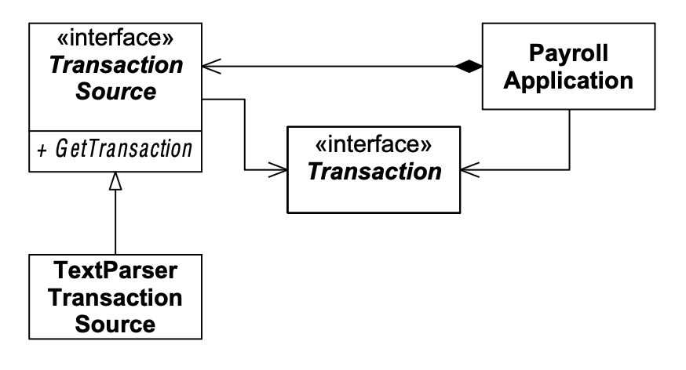<br/>
*Fig 19-34 主程序的静态模型*

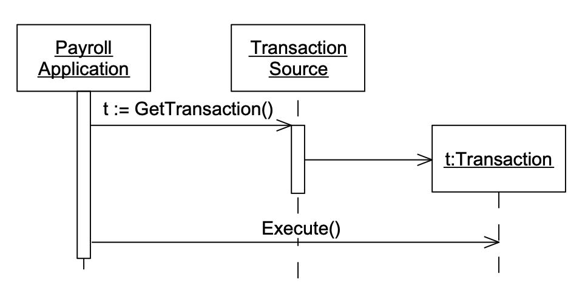<br/>
*Fig 19-35 主程序的动态模型*

`TransactionSource` 是一个抽象类，我们可以用多种方式实现它。
静态图显示了一个名为 `TextParserTransactionSource` 的派生类，它读取传入的文本流，并按照用例中的描述解析出事务。
然后该对象创建适当的 `Transaction` 对象并将它们发送给 `PayrollApplication`。

`TransactionSource` 中接口与实现的分离使得事务源可以是抽象的；例如，我们可以轻松地将 `PayrollApplication` 连接到 `GUITransactionSource` 或 `RemoteTransactionSource`。

## 数据库

现在这个迭代已经被分析、设计并（大部分）实现了，我们可以考虑数据库的角色了。
`PayrollDatabase` 类显然封装了与持久化相关的内容。
`PayrollDatabase` 中包含的对象必须比应用程序的任何特定运行都存活得更久。
这应该如何实现？
显然，测试用例使用的临时机制对于真实系统是不够的。
我们有几种选择。

我们可以使用面向对象数据库管理系统（OODBMS）来实现 `PayrollDatabase`。
这将允许实际对象驻留在数据库的永久存储中。
作为设计师，我们几乎不需要做更多的工作，因为 OODBMS 不会给我们的设计增加太多新东西。
OODBMS 产品的一大优点是它们对应用程序的对象模型几乎没有影响。
就设计而言，数据库几乎不存在。⁶

⁶ 这是乐观的。
在像 Payroll 这样的简单应用程序中，使用 OODBMS 对程序的设计影响很小。
随着应用程序变得越来越复杂，OODBMS 对应用程序的影响会增加。
尽管如此，其影响仍远小于 RDBMS 的影响。

另一种选择是使用简单的纯文本文件来记录数据。
在初始化时，`PayrollDatabase` 对象可以读取该文件并在内存中构建必要的对象。
在程序结束时，`PayrollDatabase` 对象可以写入新版本的文本文件。
当然，对于拥有数十万员工的公司，或希望对其薪资数据库进行实时并发访问的公司，这种选择是不够的。
然而，对于较小的公司来说可能已经足够，并且它肯定可以用作测试应用程序其余类的机制，而无需投入大型数据库系统。

还有一种选择是将关系数据库管理系统（RDBMS）整合到 `PayrollDatabase` 对象中。
然后 `PayrollDatabase` 对象的实现将对 RDBMS 进行适当的查询，以在内存中临时创建必要的对象。

关键是，就应用程序而言，数据库只是管理存储的机制。
它们通常不应被视为设计和实现的主要因素。
正如我们在这里展示的，它们可以留到最后作为细节处理。⁷
通过这样做，我们为实现所需的持久化和创建测试应用程序其余部分的机制保留了许多有趣的选择。
我们也不会将自己束缚在任何特定的数据库技术或产品上。
我们可以根据设计的其余部分自由选择所需的数据库，并且我们保留了未来根据需要更改或替换该数据库产品的自由。

⁷ 有时数据库的性质是应用程序的需求之一。
RDBMS 提供了强大的查询和报告系统，这些可能被列为应用程序需求。
然而，即使这类需求是明确的，设计者仍应将应用程序设计与数据库设计解耦。
应用程序设计不应依赖于任何特定类型的数据库。

## 薪资设计总结

在大约 50 个图表和 3300 行代码中，我们展示了薪资应用程序一个迭代的设计和实现。
该设计使用了大量的抽象和多态。
结果是，设计的大部分对薪资政策的变更保持了封闭。
例如，应用程序可以被修改以处理按季度支付、基于正常薪资和奖金计划的员工。
这一更改需要添加到设计中，但现有的设计和代码几乎不需要更改。

在这个过程中，我们很少考虑自己是在进行分析、设计还是实现。
相反，我们专注于清晰性和封闭性问题。
我们尽可能寻找底层抽象。
结果是我们为薪资应用程序建立了一个良好的起始设计，并且我们有了一组与整个问题领域相关的核心类。

### 历史

本章中的图源自于我在 1995 年出版的《Designing Object-Oriented C++ Applications using the Booch Method》一书相应章节中的 Booch 图。
这些图创建于 1994 年。
在创建它们的同时，我也编写了一些实现它们的代码，以确保这些图有意义。
然而，我没有编写出这里所展示的那么多代码。
因此，这些图没有从代码和测试中获得足够的反馈。
这种反馈的缺乏是显而易见的。

我按照此处呈现的顺序编写了本章。
在每种情况下，测试用例都在生产代码之前编写。
在许多情况下，这些测试是逐步创建的，随着生产代码的演进而演进。
生产代码的编写是为了符合这些图，只要这是合理的。
有几个情况下这并不合理，因此我更改了代码的设计。

其中一个最早发生这种情况是在第 219 页，当时我决定不在 Employee 对象中使用多个 Affiliation 实例。
另一个是在第 229 页，当时我发现我没有在 ChangeMemberTransaction 中考虑记录员工的工会会员资格。

这是正常的。
当你在没有反馈的情况下设计时，你必然会犯错误。
正是测试用例和运行代码所施加的反馈为我们发现了这些错误。

### 资源

你可以在 Prentice Hall 网站上或 www.objectmentor.com/PPP 找到此代码的最终版本。

## 参考文献

1. Jacobson, Ivar. *Object-Oriented Software Engineering, A Use-Case-Driven Approach*. Wokingham, UK: Addison–Wesley, 1992.
