# 20 包设计原则

 

> “好包装。”
> 
——Anthony

随着软件应用程序的规模和复杂性增长，它们需要某种高层次的组织。
类虽然是组织小型应用程序的一个非常方便的单元，但对于大型应用程序来说，它们的粒度太细，不能作为唯一的组织单元。
需要比类 “更大” 的东西来帮助组织大型应用程序。
这个东西被称为包（package）。

本章概述了六个原则。
<ins>前三个是包的内聚性原则，帮助我们分配类到包中。
后三个原则控制包的耦合，帮助我们确定包之间应该如何相互关联。
最后两个原则还描述了一组依赖管理（DM）度量标准，允许开发者度量和表征其设计的依赖结构。</ins>

## 使用包进行设计？

在 UML 中，包可以用作类组的容器。
通过将类分组到包中，我们可以在更高的抽象层次上推理设计。
我们还可以使用包来管理软件的开发和分发。
目标是根据某些标准划分应用程序中的类，然后将这些分区中的类分配到包中。

但类之间通常存在对其他类的依赖关系，而这些依赖关系常常会跨越包的边界。
因此，包之间将存在依赖关系。
包之间的关系表达了应用程序的高层组织，并且它们需要被管理。

这就引出了一系列问题：

1. 将类分配到包的原则是什么？
2. 什么设计原则管理包之间的关系？
3. 包应该先于类设计（自顶向下）？还是类先于包设计（自底向上）？
4. 包在物理上如何表示？在 C++ 中？在 Java 中？在开发环境中？
5. 一旦创建，我们将把这些包用于什么目的？

本章介绍了六个设计原则，它们管理包的创建、相互关系和使用。
前三个原则管理类到包的分配。
后三个原则管理包之间的相互关系。

## 粒度：包内聚性原则

包内聚性的三个原则帮助开发人员决定如何将类划分到包中。
它们依赖于这样一个事实：至少已经发现了部分类及其相互关系。
因此，这些原则采用 “自底向上” 的划分视角。

### 复用-发布等价原则（REP）

> 复用的粒度就是发布的粒度。

当你计划复用某个类库的作者的作品时，你期望得到什么？
当然，你希望有良好的文档、可工作的代码、定义良好的接口等等。
但你还想要其他东西。

首先，为了使复用这个人的代码值得你花费时间，你希望作者保证为你维护它。
毕竟，如果你必须自己维护它，你将不得不投入大量的时间 —— 这些时间可能更好地用于为自己设计一个更小更好的包。

其次，你希望作者提前通知你他对代码的接口和功能所做的任何更改。
但通知还不够。
作者必须给你选择拒绝使用任何新版本的权利。
毕竟，他可能在你处于紧张的进度压力时引入一个新版本，或者他可能对代码做出与你的系统完全不兼容的更改。

在两种情况下，如果你决定拒绝他的版本，作者必须保证在一段时间内支持你使用旧版本。
也许这段时间短至三个月或长达一年；这是你们俩需要协商的事情。
但他不能就这样放弃你，拒绝支持你。
如果他不同意支持你使用他的旧版本，那么你可能需要认真考虑是否要使用他的代码，并受制于他反复无常的更改。

这个问题主要是政治性的。
它涉及到如果其他人要复用代码，必须提供的文书和支持工作。
但这些政治和文书问题对软件的打包结构有着深远的影响。
为了提供复用者所需的保证，作者必须将其软件组织成可复用的包，然后用版本号来跟踪这些包。

REP 指出，复用的粒度（即包）不能小于发布的粒度。
我们复用的任何东西也必须被发布和跟踪。
一个开发人员简单地编写一个类然后声称它是可复用的，这是不现实的。
<ins>可复用性只有在建立了一个跟踪系统之后才能实现，该系统提供潜在的复用者所需的通知、安全和保证的支持</ins>。

REP 为我们如何将设计划分为包提供了第一个提示。
由于可复用性必须基于包，可复用的包必须包含可复用的类。
因此，至少有些包应该包含可复用的类集。

一个政治力量会影响我们软件的划分，这似乎令人不安，但软件不是一个数学上纯粹的存在，可以按照数学上纯粹的规则来构建。
软件是一种支持人类事业的人类产物。
软件由人类创建和使用。
如果软件要被复用，那么它必须以人类认为便于该目的的方式进行划分。

那么这告诉我们关于包内部结构的什么呢？
必须从潜在复用者的角度考虑内部内容。
如果一个包包含应该被复用的软件，那么它不应该也包含不为复用而设计的软件。
包中的所有类要么都是可复用的，
要么都不是。

可复用性不是唯一的标准；我们还必须考虑复用者是谁。
当然，容器类库是可复用的，金融框架也是可复用的。
但我们不希望它们成为同一个包的一部分。
有很多人想复用容器类库，但对金融框架不感兴趣。
因此，我们希望包中的所有类都能被同一受众复用。
我们不希望一个受众发现一个包包含一些他需要的类，而另一些则完全不适合他。

### 共同复用原则（CRP）

> 一个包中的类被一起复用。如果你复用了包中的一个类，你就复用了它们全部。

这个原则帮助我们决定哪些类应该被放入一个包中。
它指出，倾向于被一起复用的类属于同一个包。

类很少被单独复用。
通常，可复用的类与作为可复用抽象一部分的其他类协作。
CRP 指出，这些类应该一起放在同一个包中。
在这样的包中，我们期望看到彼此之间有许多依赖关系的类。

一个简单的例子是容器类及其相关的迭代器。
这些类被一起复用，因为它们彼此紧密耦合。
因此，它们应该放在同一个包中。

但 CRP 告诉我们的不仅仅是哪些类应该放在一起形成包。
它还告诉我们哪些类不应该放在包中。
当一个包使用另一个包时，包之间就创建了一个依赖关系。
可能是使用包只使用了被使用包中的一个类。
然而，这并不会削弱依赖关系。
使用包仍然依赖被使用包。
每次被使用包发布时，使用包必须被重新验证和重新发布。
即使被使用包是因为使用包不关心的类的变更而发布，这仍然是事实。

此外，包通常以共享库、DLL、JAR 等物理形式存在。
如果被使用的包以 JAR 形式发布，那么使用代码就依赖于整个 JAR。
对该 JAR 的任何修改 ——即使修改的是使用代码不关心的类—— 仍然会导致新版本 JAR 的发布。
新的 JAR 仍然必须被重新分发，使用代码仍然必须被重新验证。

因此，我想确保当我依赖一个包时，我依赖该包中的每个类。
换句话说，我想确保我放入包中的类是密不可分的，不可能依赖其中一些而不依赖另一些。
否则，我将重新验证和重新分发超出必要的内容，并浪费大量精力。

因此，CRP 更多地告诉我们哪些类不应该在一起，而不是哪些类应该在一起。
CRP 指出，彼此之间没有通过类关系紧密绑定的类不应在同一个包中。

### 共同封闭原则（CCP）

> 一个包中的类应该针对相同类型的变更一起封闭。影响包的变更会影响该包中的所有类，而不会影响其他包。

这是单一职责原则针对包的重新表述。
正如 SRP 所说，一个类不应该有多个变更原因，这个原则指出，一个包也不应该有多个变更原因。

在大多数应用中，可维护性比可复用性更重要。
如果应用中的代码必须变更，你更希望变更集中在一个包中，而不是分散在多个包中。
如果变更集中到单个包中，那么我们只需要发布那一个变更的包。
不依赖该变更包的其他包不需要被重新验证或重新发布。

CCP 促使我们将可能因相同原因而变更的所有类聚集在一起。
如果两个类在物理上或概念上紧密绑定，以至于它们总是同时变更，那么它们应该属于同一个包。
这最小化了与发布、重新验证和重新分发软件相关的工作量。

这个原则与开闭原则（OCP）密切相关。
因为这个原则处理的是 OCP 意义上的 “封闭”。
OCP 指出，类应该对修改封闭，对扩展开放。
但正如我们所学，100% 的封闭是不可达的。
封闭必须是战略性的。
我们设计系统使其对我们所经历的最常见的变更类型保持封闭。

CCP 通过将对某些类型变更开放的类分组到同一个包中，放大了这一点。
因此，当需求变更到来时，该变更有很大的机会被限制在最少数量的包中。

### 包内聚性总结

过去，我们对内聚性的看法比最后三个原则所暗示的要简单得多。
我们曾经认为内聚性只是一个模块执行一个且仅一个功能的属性。
然而，三个包内聚性原则描述了更丰富的内聚性类型。
在选择要分组到包的类时，我们必须考虑涉及可复用性和可开发性的对立力量。
平衡这些力量与应用的需求并非易事。
而且，这种平衡几乎总是动态的。
也就是说，今天适用的划分可能明年就不适用了。
因此，包的组成很可能会随着项目焦点从可开发性转向可复用性而随时间推移而变动和演进。

## 稳定性：包耦合原则

接下来的三个原则涉及包之间的关系。
在这里，我们将再次遇到可开发性与逻辑设计之间的紧张关系。
影响包结构架构的力量是技术的、政治的和易变的。

### 无环依赖原则（ADP）

 

> 在包依赖图中不允许出现循环。

你是否曾经工作了一整天，让一些东西工作起来，然后回家，结果第二天早上到公司却发现你的东西不再工作了？
为什么它不工作？
因为有人比你留得更晚，改变了你所依赖的东西！
我称之为 “第二天早上综合症”。

第二天早上综合症发生在许多开发人员修改相同源文件的开发环境中。
在只有少数开发人员的相对较小的项目中，这不是太大的问题。
但随着项目和开发团队规模的增长，第二天早上可能会变得相当可怕。
在无纪律的团队中，连续几周无法构建一个稳定版本的项目并不罕见。
相反，每个人都在不断修改他们的代码，试图使其与其他人所做的最后更改保持一致。

在过去的几十年里，针对这个问题已经发展出两种解决方案。
两种方案都来自电信行业。
第一种是 “每周构建”，第二种是 ADP。

### 每周构建

每周构建在中等规模项目中很常见。
它的工作方式是这样的：所有开发人员在一周的前四天互不理会。
他们都在代码的私有副本上工作，不担心彼此集成。
然后在周五，他们集成所有的更改并构建系统。

这有一个绝妙的优势，允许开发人员在五天中的四天生活在隔离的世界中。
当然，缺点是周五要付出巨大的集成代价。

不幸的是，随着项目增长，在周五完成集成变得不太可行。
集成负担不断增长，直到开始溢出到周六。
几个这样的周六足以让开发人员相信集成实际上应该在周四开始。
于是集成的开始慢慢向周中移动。

随着开发与集成的占空比下降，团队的效率也在下降。
最终这会变得非常令人沮丧，以至于开发人员或项目经理宣布应该将计划改为双周构建。
这在一段时间内有效，但集成时间继续随项目规模增长。
这最终导致一场危机。
为了保持效率，构建计划必须不断延长。
然而延长构建计划会增加项目风险。
集成和测试变得越来越困难，团队失去了快速反馈的好处。

### 消除依赖循环

这个问题的解决方案是将开发环境划分为可发布的包。
包成为工作单元，可以由一个开发人员或一个开发团队签出。
当开发人员使一个包工作时，他们将其发布供其他开发人员使用。
他们给它一个版本号，并将其移动到一个供其他团队使用的目录中。
然后他们继续在自己的私有区域中修改他们的包。
其他所有人都使用已发布的版本。

随着包的新版本发布，其他团队可以决定是否立即采用新版本。
如果他们决定不采用，他们只需继续使用旧版本。
一旦他们决定准备好，他们就开始使用新版本。

因此，没有一个团队受制于其他团队。
对一个包的更改不需要立即影响其他团队。
每个团队都可以自行决定何时使其包适应他们所使用包的新版本。
而且，集成以小的增量进行。不存在所有开发人员必须聚在一起集成他们所做一切的单一时间点。

这是一个非常简单合理的过程，并且被广泛使用。
然而，要使它工作，你必须管理包的依赖结构。
不能有循环。
如果依赖结构中有循环，那么第二天早上综合症就无法避免。

考虑 Fig 20-1 中的包图。
这里我们看到了一个相当典型的包结构，组装成一个应用程序。
这个应用程序的功能对于这个例子来说并不重要。
重要的是包的依赖结构。
注意，这个结构是一个有向图。
包是节点，依赖关系是有向边。

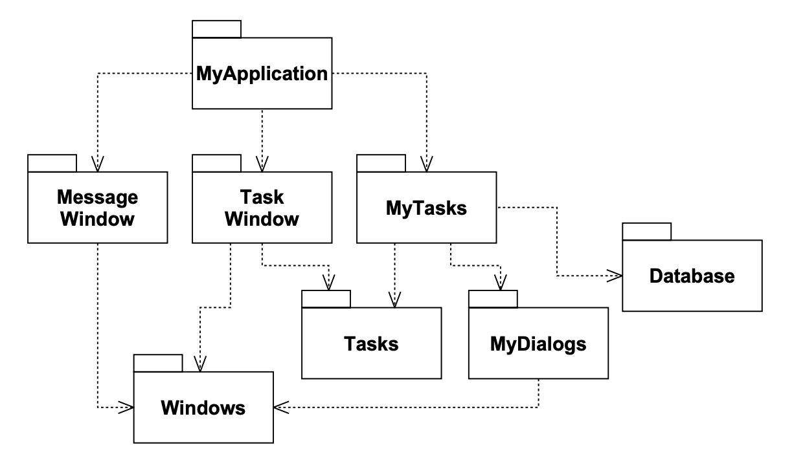 
*Fig 20-1 包结构是一个有向无环图*

现在再注意一件事。
无论你从哪个包开始，都不可能沿着依赖关系走回到那个包。
这个结构没有循环。
它是一个有向无环图（DAG）。

当负责 `MyDialogs` 的团队发布他们的新版本包时，很容易找出谁受影响；你只需沿着依赖箭头反向追溯。
因此，`MyTasks` 和 `MyApplication` 都将受到影响。
目前正在处理这些包的开发人员将不得不决定何时集成 `MyDialogs` 的新版本。

还要注意，当 `MyDialogs` 发布时，它对系统中的许多其他包完全没有影响。
它们不知道 `MyDialogs`，也不关心它何时变化。这很好。
这意味着发布 `MyDialogs` 的影响相对较小。

当处理 `MyDialogs` 包的开发人员想要运行该包的测试时，他们所需要做的就是将他们版本的 `MyDialogs` 与他们当前正在使用的 `Windows` 包版本一起编译和链接。
系统中其他包都不需要参与。
这很好；这意味着处理 `MyDialogs` 的开发人员设置测试的工作相对较少，并且他们需要考虑的变量相对较少。

当需要发布整个系统时，是从下往上进行的。
首先 `Windows` 包被编译、测试和发布。
接下来是 `MessageWindow` 和 `MyDialogs`。
接着是 `Task`，然后是 `TaskWindow` 和 `Database`。
`MyTasks` 接下来，最后是 `MyApplication`。
这个过程非常清晰且易于处理。
我们知道如何构建系统，因为我们理解其各部分之间的依赖关系。

### 包依赖图中循环的影响

假设一个新的需求迫使我们改变 `MyDialogs` 中的一个类，使其使用 `MyApplication` 中的一个类。
这创建了一个依赖循环，如 Fig 20-2 所示。

这个循环立即产生了一些问题。
例如，处理 `MyTasks` 包的开发人员知道，为了发布，他们必须与 `Task`、`MyDialogs`、`Database` 和 `Windows` 兼容。
然而，有了这个循环，他们现在还必须与 `MyApplication`、`TaskWindow` 和 `MessageWindow` 兼容。
也就是说，`MyTasks` 现在依赖于系统中的所有其他包。
这使得 `MyTasks` 非常难以发布。
`MyDialogs` 也遭遇同样的命运。
事实上，这个循环迫使 `MyApplication`、`MyTasks` 和 `MyDialogs` 总是同时发布。
它们实际上已经变成了一个大包。
而在这些包中工作的所有开发人员将再次经历第二天早上综合症。

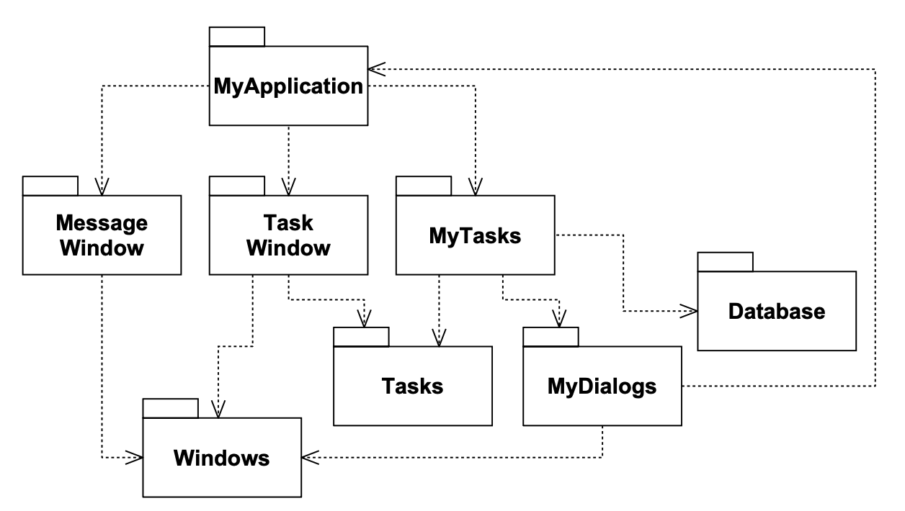 
*Fig 20-2 带有循环的包图*

他们将互相妨碍，因为他们都必须使用彼此完全相同版本的包。

但这只是问题的一部分。
考虑当我们想要测试 `MyDialogs` 包时会发生什么。
我们发现必须链接系统中的所有其他包，包括 `Database` 包。
这意味着仅仅为了测试 `MyDialogs`，我们就必须进行完整的构建。
这是不可容忍的。

如果你曾经想知道为什么仅仅为了对一个类进行简单的单元测试，就必须链接这么多不同的库和那么多其他人的东西，很可能是因为依赖图中存在循环。
这样的循环使得隔离模块变得非常困难。
单元测试和发布变得非常困难且容易出错。
而且，在 C++ 中，编译时间随模块数量呈几何级数增长。

此外，当依赖图中存在循环时，很难确定构建包的顺序。
事实上，可能没有正确的顺序。
这可能导致像 Java 这样的语言中出现一些非常棘手的问题，
因为它们从编译的二进制文件中读取声明。

### 打破循环

总是有可能打破包之间的循环，并将依赖图恢复为 DAG。
有两种主要机制：

1. 应用依赖倒置原则（DIP）。
在 Fig 20-3 的情况下，我们可以创建一个抽象基类，包含 `MyDialogs` 需要的接口。
然后我们可以将该抽象基类放入 `MyDialogs` 中，并在 `MyApplication` 中继承它。
这反转了 `MyDialogs` 和 `MyApplication` 之间的依赖关系，从而打破了循环。（见 Fig 20-3。） 
再次注意，我们根据客户端而非服务器来命名接口。这是 “接口属于客户端” 规则的又一个应用。

2. 创建一个新包，`MyDialogs` 和 `MyApplication` 都依赖它。
将两者共同依赖的类移动到该新包中。（见 Fig 20-4。）

### “抖动”

第二种解决方案意味着包结构在需求变化的存在下是易变的。
实际上，随着应用程序的增长，包依赖结构会抖动和增长。
因此，必须始终监控依赖结构中的循环。
当循环出现时，必须以某种方式打破它们。
有时这意味着创建新的包，使依赖结构增长。

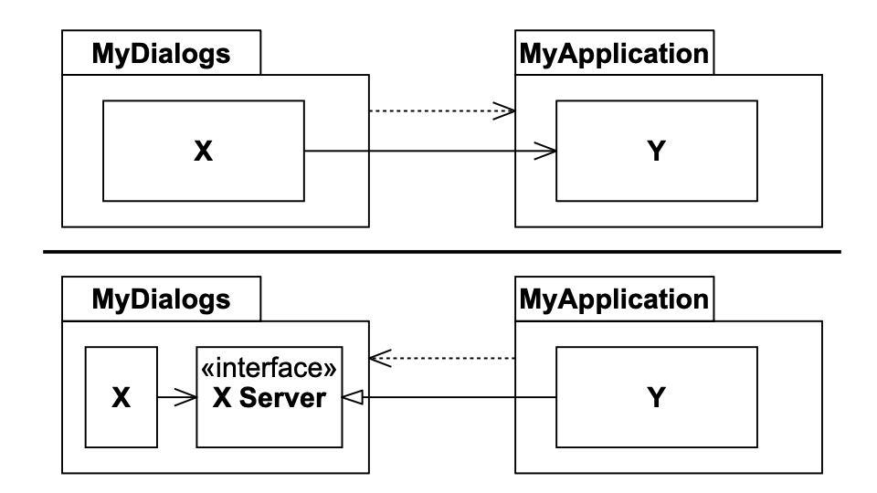 
*Fig 20-3 使用依赖倒置打破循环*

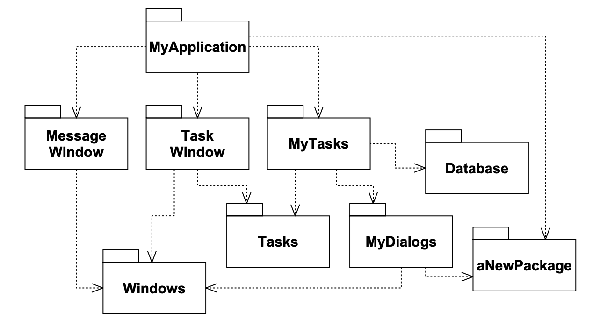 
*Fig 20-4 使用新包打破循环*

## 自顶向下设计

<ins>我们到目前为止讨论的问题导致了一个不可避免的结论：包结构不能从自顶向下设计。</ins>
这意味着它不是系统最先设计的事物之一。
事实上，它似乎是随着系统的增长和变化而演进的。

你可能会觉得这与直觉相反。
我们期望大粒度的分解，如包，也是高层的功能分解。
当我们看到像包依赖结构这样的大粒度分组时，我们觉得包应该以某种方式表示系统的功能。
然而，这似乎不是包依赖图的一个属性。

<ins>事实上，包依赖图与描述应用程序的功能几乎没有关系。
相反，它们是应用程序可构建性的地图。</ins>
这就是为什么它们不是在项目开始时设计的。
那时没有软件要构建，因此不需要构建地图。
但是随着实现和设计早期阶段积累越来越多的类，管理依赖关系的需求也在增长，以便项目可以在没有第二天早上综合症的情况下开发。
而且，我们希望尽可能将变更本地化，因此我们开始关注 SRP 和 CCP，并将可能一起变更的类放在一起。

随着应用程序继续增长，我们开始关注创建可复用的元素。
因此，CRP 开始决定包的组成。
最后，当循环出现时，应用 ADP，包依赖图开始抖动和增长。

如果我们试图在设计任何类之前设计包依赖结构，我们很可能会惨败。
我们对共同封闭知之甚少，我们不知道任何可复用的元素，而且我们几乎肯定会创建产生依赖循环的包。
因此，包依赖结构随着系统的逻辑设计而增长和演进。

## 稳定依赖原则（SDP）

> 沿着稳定性的方向依赖。

设计不能完全静态。
如果要维护设计，一定的易变性是必要的。
我们通过遵循共同封闭原则（CCP）来实现这一点。
使用这个原则，我们创建对某些类型变更敏感的包。
这些包被设计为易变的。
我们预期它们会改变。

任何我们预期易变的包都不应该被难以更改的包所依赖！
否则易变的包也会变得难以更改。

软件的悖论在于，你设计为易于更改的模块，可能因为别人简单地在其上挂了一个依赖而变得难以更改。
你的模块中不需要改变一行源代码，然而你的模块却突然变得难以更改了。
通过遵循 SDP，我们确保那些旨在易于更改的模块不会被那些比它们更难更改的模块所依赖。

### 稳定性

把一枚硬币侧立起来。在那个位置上它是稳定的吗？
你可能会说它不是。
然而，除非受到干扰，它会在这个位置上保持很长时间。
因此，稳定性与变更频率没有直接关系。
硬币没有变化，但很难认为它是稳定的。

韦伯斯特词典说，如果某物 “不容易被移动”，它就是稳定的。¹
<ins>稳定性与进行更改所需的工作量有关。</ins>
硬币不稳定，因为把它推倒只需要很少的功。
另一方面，桌子非常稳定，因为把它翻过来需要相当大的努力。

¹ Webster's Third New International Dictionary。

这与软件有什么关系？
有很多因素使软件包难以更改：它的大小、复杂度、清晰度等。
我们将忽略所有这些因素，专注于不同的东西。
使软件包难以更改的一种确定方法是让许多其他软件包依赖它。
一个有很多传入依赖的包是非常稳定的，因为要与所有依赖包协调任何更改都需要大量的工作。

Fig 20-5 显示了 X，一个稳定的包。
这个包有三个包依赖于它；因此，它有三个不改变的好理由。
我们说它对那三个包负有责任。
另一方面，X 不依赖任何东西，所以没有外部影响使其改变。
我们说它是独立的。

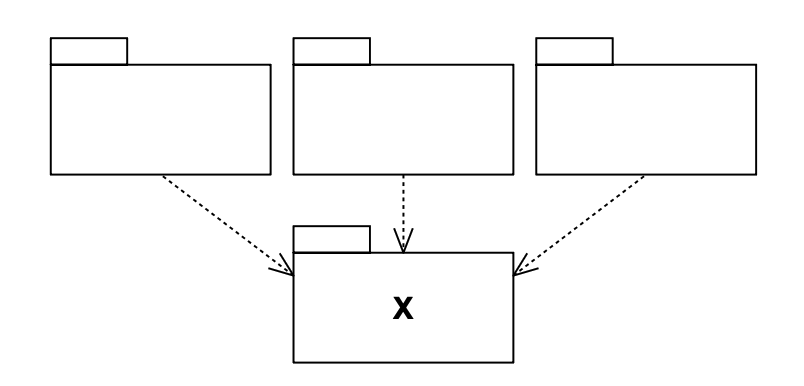 
*Fig 20-5 X：一个稳定的包*

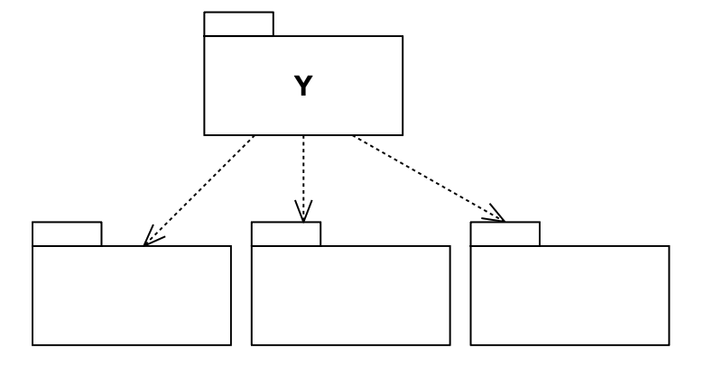 
*Fig 20-6 Y：一个不稳定的包*

另一方面，Fig 20-6 显示了一个非常不稳定的包。
Y 没有其他包依赖它；我们说它是无责任性的。
Y 也有三个它所依赖的包，所以变化可能来自三个外部来源。我们说 Y 是有依赖性的。

### 稳定性度量

我们如何衡量一个包的稳定性？
一种方法是计算进入和离开该包的依赖关系数量。
这些计数将允许我们计算包的位置稳定性。

- **Ca（传入耦合）**：此包外部依赖于此包内部类的类的数量。
- **Ce（传出耦合）**：此包内部依赖于此包外部类的类的数量。
- **I（不稳定性）**：I = Ce / (Ca + Ce)

该度量的范围为 [0,1]。
I = 0 表示最大稳定包。
I = 1表示最大不稳定包。

`Ca` 和 `Ce` 度量是通过计算所讨论包外部依赖于所讨论包内部类的类的数量来计算的。
考虑 Fig 20-7 中的示例。

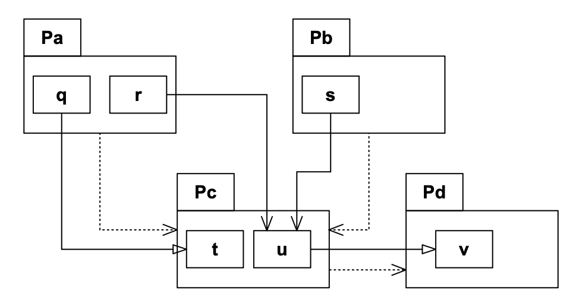 
*Fig 20-7 计算Ca、Ce和I*

包之间的虚线箭头表示包依赖关系。
这些包的类之间的关系显示了这些依赖关系实际上是如何实现的。
有继承和关联关系。

现在，假设我们要计算包 `Pc` 的稳定性。
我们发现有三个类在 `Pc` 外部依赖于 `Pc` 内部的类。
因此 `Ca = 3`。
此外，`Pc` 内部的类依赖于一个在 `Pc` 外部的类。
因此，`Ce = 1`，`I = 1/4`。

在 C++ 中，这些依赖通常由 `#include` 语句表示。
实际上，当你将源代码组织为每个源文件中有一个类时，`I` 度量最容易计算。
在 Java 中，`I` 度量可以通过计算 `import` 语句和限定名称来得到。

当 `I` 度量为1时，意味着没有其他包依赖于这个包（`Ca = 0`）；并且这个包确实依赖于其他包（`Ce > 0`）。
这是一个包可能达到的最不稳定状态；它既是无责任性的又是有依赖性的。
它缺乏依赖者，因此没有理由不改变，而它所依赖的包可能给它充分的理由去改变。

另一方面，当 `I` 度量为零时，意味着这个包被其他包依赖（`Ca > 0`），但它本身不依赖于任何其他包（`Ce = 0`）。
它既是有责任性的又是独立的。
这样的包尽可能稳定。
它的依赖者使它难以改变，并且它没有可能迫使它改变的依赖关系。

SDP 指出，一个包的 `I` 度量应该大于它所依赖的包的 `I` 度量（即，`I` 度量应沿着依赖方向递减）。

### 并非所有包都应该是稳定的

如果系统中所有的包都最大稳定，系统将不可更改。
这不是一个理想的情况。实际上，我们希望设计包结构，使一些包不稳定，一些包稳定。
Fig 20-8 显示了一个三包系统的理想配置。

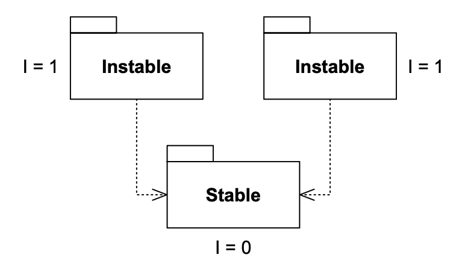 
*Fig 20-8 理想的包配置*

可变的包在顶部，依赖底部的稳定包。
把不稳定的包放在图表的顶部是一个有用的约定，因为任何向上指的箭头都违反了 SDP。

Fig 20-9 显示了 SDP 如何被违反。
`Flexible` 是一个我们预期易于更改的包。
我们希望 `Flexible` 是不稳定的。
然而，某个在名为 `Stable` 的包中工作的开发人员在 `Flexible` 上挂了一个依赖。
这违反了SDP，因为 `Stable` 的 `I` 度量远低于 `Flexible` 的 `I` 度量。
结果，`Flexible` 将不再易于更改。
对 `Flexible` 的更改将迫使我们处理 `Stable` 及其所有依赖者。

为了解决这个问题，我们必须以某种方式打破 `Stable` 对 `Flexible` 的依赖。
为什么存在这个依赖？
假设 `Flexible` 中有一个类 `C`，`Stable` 中的另一个类 `U` 需要使用它（见 Fig 20-10 ）。

我们可以通过应用 DIP 来修复这个问题。
我们创建一个名为 `IU` 的接口类，并将其放在名为 `UInterface` 的包中。
我们确保该接口声明 `U` 需要使用的所有方法。
然后我们让 `C` 继承自该接口（见 Fig 20-11）。
这打破了 `Stable` 对 `Flexible` 的依赖，并强制两个包都依赖于 `UInterface`。
`UInterface` 非常稳定（`I = 0`），而 `Flexible` 保留了其必要的不稳定性（`I = 1`）。
所有依赖现在都朝着 `I` 减小的方向流动。

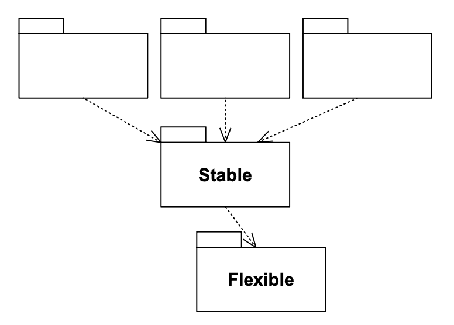 
*Fig 20-9 违反 SDP*

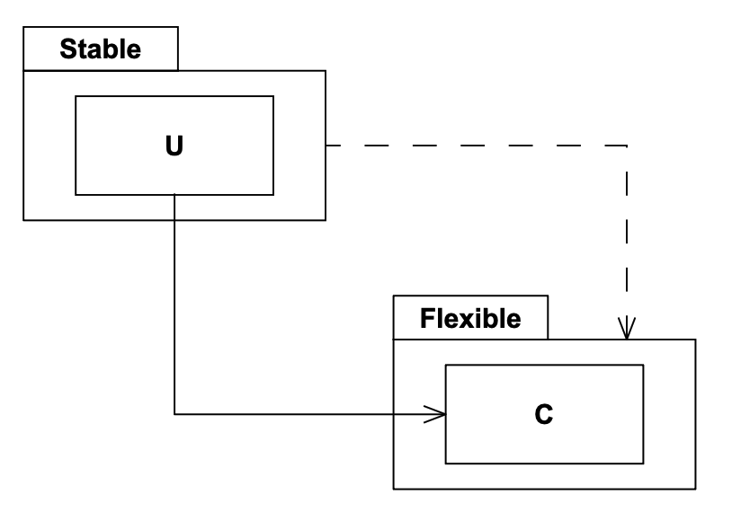 
*Fig 20-10 不良依赖的原因*

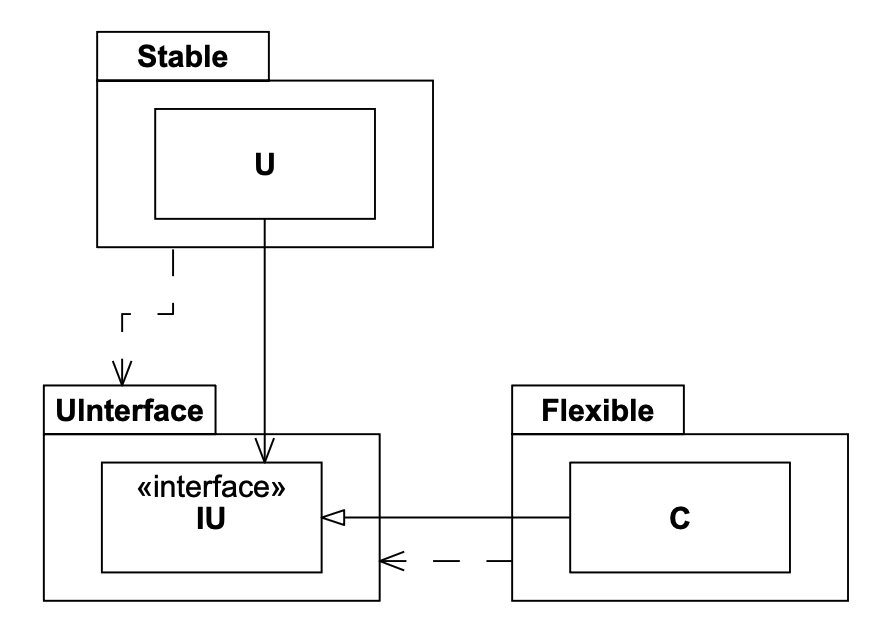 
*Fig 20-11 使用 DIP 修复稳定性违反*

### 我们把高层设计放在哪里？

系统中的某些软件不应该经常改变。
这些软件代表了高层架构和设计决策。
我们不希望这些架构决策是可变的。
因此，封装系统高层设计的软件应该放在稳定的包中（`I = 0`）。
不稳定的包（`I = 1`）应该只包含可能改变的软件。

然而，如果高层设计被放置在稳定的包中，那么代表该设计的源代码将难以更改。
这可能使设计不灵活。一个最大稳定（`I = 0`）的包如何能够足够灵活以承受变化？
答案在于 OCP。
这个原则告诉我们，创建足够灵活以允许扩展而无需修改的类是可能的，也是可取的。
什么类型的类符合这个原则？
抽象类。

## 稳定抽象原则（SAP）

> 一个包应该像它稳定那样抽象。

这个原则确立了稳定性和抽象性之间的关系。
它指出，一个稳定的包也应该是抽象的，这样它的稳定性才不会阻止它被扩展。
另一方面，它指出，一个不稳定的包应该是具体的，因为它内部的具体代码可以很容易地被更改。

因此，如果一个包要是稳定的，它也应该由抽象类组成，以便它可以被扩展。
可扩展的稳定包是灵活的，不会过度约束设计。

SAP 和 SDP 结合起来相当于针对包的 DIP。
这是因为 SDP 说依赖应该沿着稳定性的方向运行，而 SAP 说稳定性意味着抽象。
因此，依赖沿着抽象的方向运行。

然而，DIP 是一个处理类的原则。
对于类，没有灰色地带。
一个类要么是抽象的，要么不是。SDP 和 SAP 的结合处理的是包，并允许一个包部分抽象、部分稳定。

### 度量抽象性

`A` 度量是衡量包抽象性的指标。
它的值简单地是包中抽象类与包中类总数的比率。

- `Nc`：包中的类数。
- `Na`：包中的抽象类数。记住，抽象类是一个具有至少一个纯接口且不能被实例化的类。
- `A`：抽象性。`A = Na / Nc`

`A` 度量的范围从 0 到 1。
0 意味着包中根本没有抽象类。
值为 1 意味着包中只包含抽象类。

### 主序列

我们现在可以定义稳定性（I）和抽象性（A）之间的关系了。
我们可以创建一个以 A 为纵轴、I 为横轴的图。
如果我们在这张图上标出两种 “好的” 包，我们会发现最大稳定且抽象的包位于左上角（0,1）。
最大不稳定且具体的包位于右下角（1,0）。（见 Fig 20-12。）

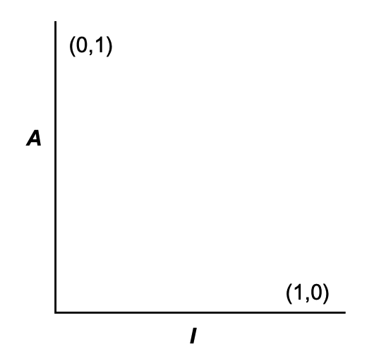 
*Fig 20-12 A-I 图*

并非所有包都能落入这两个位置之一。
包有不同程度的抽象性和稳定性。
例如，一个抽象类从另一个抽象类派生是很常见的。
派生类是一个有依赖关系的抽象类。
因此，虽然它是最大抽象的，但它不会是最大稳定的。
它的依赖会降低其稳定性。

由于我们不能强制所有包都位于（0,1）或（1,0），我们必须假设 A/I 图上存在一个点的轨迹，它定义了包的合理位置。
我们可以通过找到包不应该在的区域（即排除区）来推断这个轨迹是什么。
（见 Fig 20-13。）

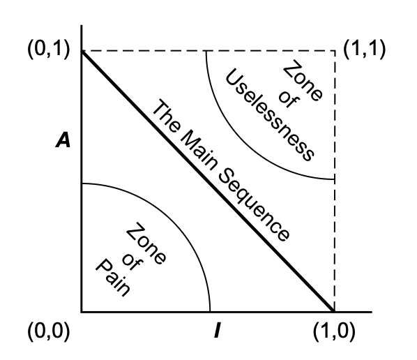 
*Fig 20-13 排除区*

考虑位于（0,0）区域的包。
这是一个高度稳定且具体的包。
这样的包是不可取的，因为它是僵化的。
它不能因为不抽象而被扩展。
而且由于其稳定性，它非常难以更改。
因此，我们通常不期望看到设计良好的包位于（0,0）附近。（0,0）周围的区域是一个排除区，称为 *痛苦区* 。

需要注意的是，确实存在包落在痛苦区的情况。
例如，数据库 schemas。
数据库 schemas 是出了名的易变、极其具体且被高度依赖。
这是 OO 应用程序和数据库之间的接口如此困难、schema 更新通常令人痛苦的原因之一。

另一个位于（0,0）的包示例是持有具体实用库的包。
尽管这样的包具有 I 度量为 1，但实际上可能是非易变的。
例如，考虑一个 “字符串” 包。
即使其中的所有类都是具体的，它也是非易变的。
这样的包在（0,0）区域是无害的，因为它们不太可能被更改。
实际上，我们可以考虑图的第三个轴是易变性。
如果是这样，Fig 20-13 中的图显示了易变性 = 1 的平面。

考虑靠近（1,1）的包。
这个位置是不可取的，因为它是最大抽象的，但没有依赖者。
这样的包是无用的。
因此，这被称为 *无用区* 。

很明显，我们希望易变的包尽可能远离两个排除区。
与每个区域距离最大的点的轨迹是连接（1,0）和（0,1）的线。
这条线被称为 *主序列* 。 ²

² “主序列” 这个名称的采用，源于我对天文学和 HR 图的兴趣。

一个位于主序列上的包，其稳定性不会 “过于抽象”，其抽象性也不会 “过于不稳定”。
它既不是无用的，也不是特别痛苦的。
它被依赖的程度与其抽象性一致，它依赖他人的程度与其具体性一致。

显然，包最理想的位置是主序列的两个端点之一。
然而，根据我的经验，项目中只有不到一半的包能具有这样理想的特征。
那些其他包如果位于主序列上或靠近主序列，就具有最佳特征。

### **距主序列的距离**

这引出了我们的最后一个度量指标。
如果希望包位于主序列上或靠近它，我们可以创建一个度量指标来衡量一个包离这个理想位置有多远。

- **D——距离**
- D = |A + I - 1| / √2

该度量的范围是 [0, ~0.707] 。

- **D′——归一化距离**
- D′ = |A + I - 1|

这个度量比 D 更方便，因为它的范围是 [0,1]。
0 表示包直接位于主序列上。
1 表示包离主序列尽可能远。

有了这个度量，可以分析一个设计整体上对主序列的符合程度。
可以计算每个包的 D 度量。
任何 D 值不接近零的包都可以被重新检查和重构。
事实上，这种分析对于帮助作者定义更可维护、对变更更不敏感的包有很大的帮助。

设计的统计分析也是可能的。
可以计算设计中所有包的 D 度量的均值和方差。
一个符合要求的设计预期具有接近零的均值和方差。
方差可用于建立 “控制限”，以识别与其他所有包相比 “异常” 的包。（见 Fig 20-14。）

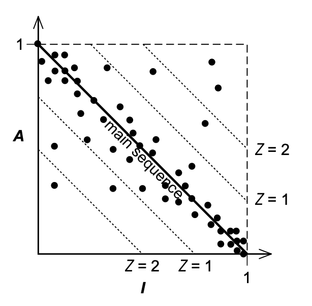 
*Fig 20-14 包 D 分数的散点图*

在这个散点图中³，我们看到大部分包沿着主序列分布，但其中一些包距离均值超过一个标准差（Z = 1）。
这些异常的包值得关注。
由于某种原因，它们要么是非常抽象但依赖者很少，要么是非常具体但依赖者很多。

³ 非基于真实数据。

另一种使用度量的方法是绘制每个包的 D′ 度量随时间变化的图。
Fig 20-15 显示了这样一个图表的模拟。
你可以看到，在过去几个版本中，一些奇怪的依赖关系逐渐渗透到了 Payroll 包中。
该图显示了一个在 D′ = 0.1 的控制阈值。
R 2.1 点已超过此控制限，因此值得花时间找出为什么这个包离主序列这么远。

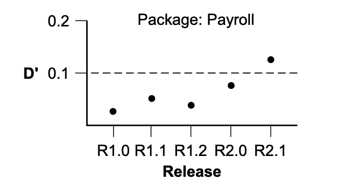 
*Fig 20-15 单个包 D′ 分数的时间图*

## 结论

本章描述的依赖管理度量衡量了一个设计与我认为是 “良好” 模式的依赖和抽象模式的一致性。
经验表明，某些依赖是好的，而另一些是坏的。
这个模式反映了这种经验。
然而，度量不是上帝；它只是对任意标准的测量。
当然，本章中选择的标准可能只适用于某些应用程序，而不适用于其他应用程序。
也可能存在更好的度量指标来测量设计的质量。
