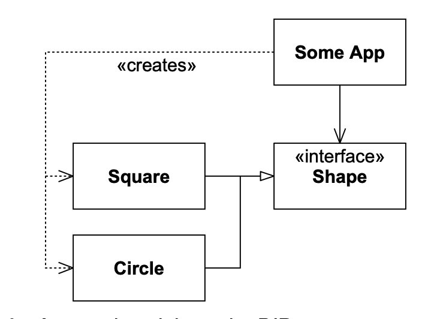
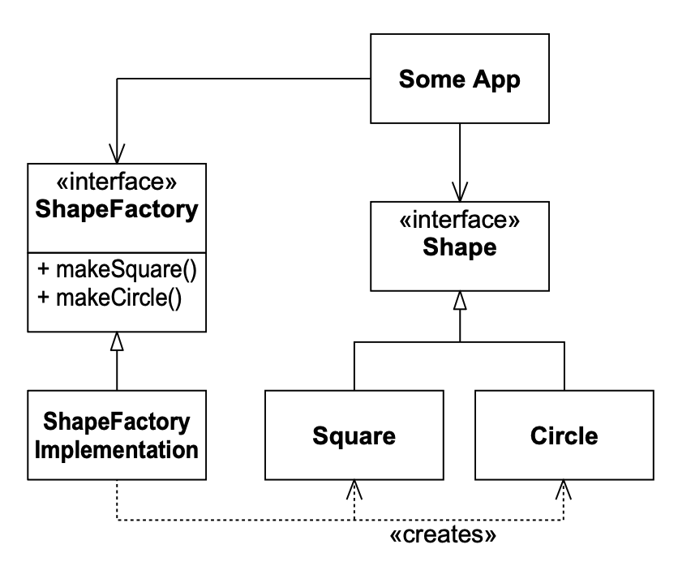
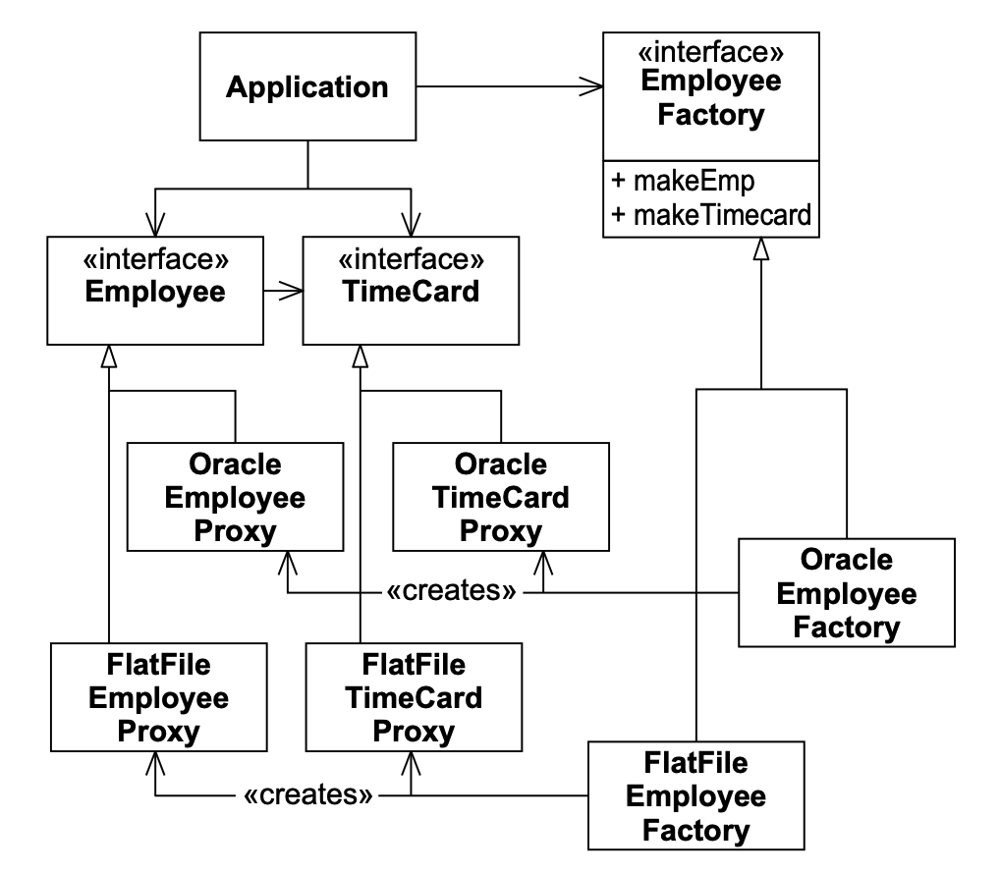
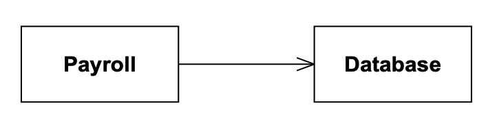
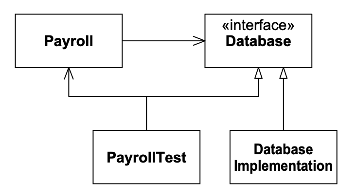
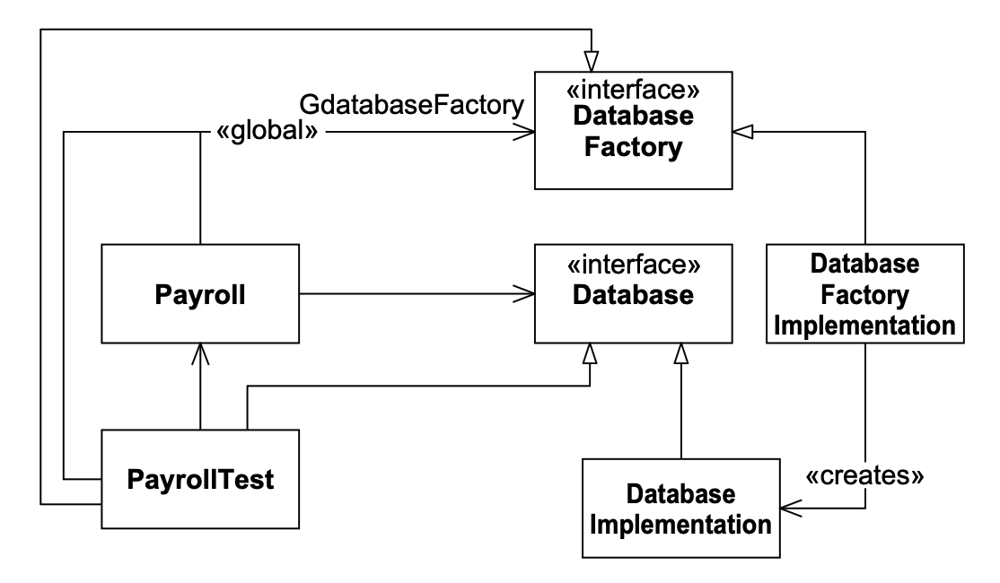

# 21 FACTORY

<center></center><br/>

> “建造工厂的人建造了一座圣殿……”
> <p align="right">——Calvin Coolidge (1872–1933)</p>

依赖倒置原则（DIP）¹ 告诉我们，我们应该倾向于依赖抽象类，并避免依赖具体类，尤其是当这些类易变时。
因此，以下代码片段违反了这一原则：

¹ “DIP：依赖倒置原则”，[第 127 页](../ch11/0.md) 。

```java
Circle c = new Circle(origin, 1);
```

`Circle` 是一个具体类。
因此，那些创建 `Circle` 实例的模块必须违反 DIP。

实际上，任何使用 `new` 关键字的代码行都违反了 DIP。

有时违反 DIP 基本无害。²
具体类越可能变化，依赖它就越可能导致麻烦。
但如果具体类不是易变的，那么依赖它就不值得担心。

² 这个覆盖面相当不错。

例如，创建 `String` 的实例并不会让我困扰。
依赖于 `String` 非常安全，因为 `String` 不太可能很快发生变化。

另一方面，当我们正在积极开发应用程序时，有许多具体类是非常易变的。
依赖它们是有问题的。
我们更愿意依赖抽象接口来屏蔽大多数变更。

FACTORY 模式允许我们在仅依赖抽象接口的同时创建具体对象的实例。
因此，在那些具体类高度易变的积极开发期间，它会非常有帮助。

Fig 21-1 显示了有问题的场景。
我们有一个名为 `SomeApp` 的类，它依赖于 `Shape` 接口。
`SomeApp` 仅通过 `Shape` 接口使用 `Shape` 的实例。
它不使用 `Square` 或 `Circle` 的任何特定方法。
不幸的是，`SomeApp` 也创建了 `Square` 和 `Circle` 的实例，因此必须依赖具体类。

<br/>
*Fig 21-1 违反 DIP 以创建具体类的应用程序*

我们可以通过将 FACTORY 模式应用于 `SomeApp` 来解决这个问题，如 Fig 21-2 所示。
这里我们看到 `ShapeFactory` 接口。
该接口有两个方法：`makeSquare` 和 `makeCircle`。
`makeSquare` 方法返回一个 `Square` 的实例，`makeCircle` 方法返回一个 `Circle` 的实例。
然而，两个函数的返回类型都是 `Shape`。

<br/>
*Fig 21-2 Shape Factory*

Listing 21-1 显示了 `ShapeFactory` 代码的样子，Listing 21-2显示了 `ShapeFactoryImplementation`。

Listing 21-1 ShapeFactory.java

```java
public interface ShapeFactory
{
    public Shape makeCircle();
    public Shape makeSquare();
}
```

Listing 21-2 ShapeFactoryImplementation.java

```java
public class ShapeFactoryImplementation implements ShapeFactory
{
    public Shape makeCircle()
    {
        return new Circle();
    }

    public Shape makeSquare()
    {
        return new Square();
    }
}
```

注意，这完全解决了依赖具体类的问题。
应用程序代码不再依赖于 `Circle` 或 `Square`，但仍然能够创建它们的实例。
它通过 `Shape` 接口操作这些实例，并且从不调用 `Square` 或 `Circle` 特有的方法。

依赖具体类的问题被转移了。
必须有人创建 `ShapeFactoryImplementation`，但除此之外没有人需要创建 `Square` 或 `Circle`。
`ShapeFactoryImplementation` 很可能由 `main` 或附加到 `main` 的初始化函数创建。

## 依赖循环

敏锐的读者会意识到，这种形式的 FACTORY 模式存在问题。
`ShapeFactory` 类为每个 `Shape` 的派生类都提供了一个方法。
这导致了一个依赖循环，使得向 `Shape` 添加新的派生类变得困难。
每当我们添加一个新的 `Shape` 派生类时，我们都必须向 `ShapeFactory` 接口添加一个新方法。
在大多数情况下，这意味着我们必须重新编译和重新部署所有 `ShapeFactory` 的使用者。³

³ 同样，这在 Java 中并不一定是必需的。你可能可以不重新编译和重新部署更改过的接口的客户端，但这是一件有风险的事情。

我们可以通过牺牲一点类型安全来消除这个依赖循环。
我们可以只给 `ShapeFactory` 一个接受 `String` 参数的 `make` 函数，而不是为每个 `Shape` 派生类提供一个方法。
例如，请看 Listing 21-3。
这种技术要求 `ShapeFactoryImplementation` 在传入参数上使用 `if/else` 链来选择要实例化的 `Shape` 的派生类。
如 Listing 21-4 和 21-5 所示。

Listing 21-3 创建圆的代码片段

```java
public void testCreateCircle() throws Exception
{
    Shape s = factory.make("Circle");
    assert(s instanceof Circle);
}
```

Listing 21-4 ShapeFactory.java

```java
public interface ShapeFactory
{
    public Shape make(String shapeName) throws Exception;
}
```

Listing 21-5 ShapeFactoryImplementation.java

```java
public class ShapeFactoryImplementation implements ShapeFactory
{
    public Shape make(String shapeName) throws Exception
    {
        if (shapeName.equals("Circle"))
            return new Circle();
        else if (shapeName.equals("Square"))
            return new Square();
        else
            throw new Exception(
                "ShapeFactory cannot create " + shapeName);
    }
}
```

有人可能会争辩说这是危险的，因为拼写错误的调用者将得到运行时错误而不是编译时错误。
这是真的。
然而，如果你编写适当数量的单元测试并应用测试驱动开发，那么你会在它们成为问题之前很久就捕获这些运行时错误。

## 可替换的工厂

使用工厂的一大好处是能够替换工厂的一个实现为另一个。
通过这种方式，你可以在应用程序中替换对象族。

例如，设想一个应用程序必须适应许多不同的数据库实现。
在我们的例子中，假设用户可以使用平面文件，也可以购买 Oracle™ 适配器。
我们可以使用 PROXY ⁴ 模式将应用程序与数据库实现隔离。
我们也可以使用工厂来实例化这些代理。
Fig 21-3 显示了该结构。

⁴ 我们将在 [第 327 页](../ch26/0.md) 稍后学习 PROXY 。现在，你只需要知道 PROXY 是一个知道如何从特定种类的数据库中读取特定对象的类。

注意，`EmployeeFactory` 有两种实现。
一种创建与平面文件一起工作的代理，另一种创建与 Oracle™ 一起工作的代理。
还要注意，应用程序不知道也不关心正在使用哪一个。

<br/>
*Fig 21-3 可替换的工厂*

## 使用工厂进行测试夹具

在编写单元测试时，我们经常希望独立于其使用的模块来测试模块的行为。
例如，我们可能有一个使用数据库的薪资应用程序（见 Fig 21-4）。
我们可能希望在不使用数据库的情况下测试 `Payroll` 模块的功能。

我们可以通过使用数据库的抽象接口来实现这一点。
这个抽象接口的一个实现使用真实数据库。
另一个实现是编写测试代码来模拟数据库的行为，并检查数据库调用是否正确执行。
Fig 21-5 显示了该结构。
`PayrollTest` 模块通过调用 `PayrollModule` 来测试它。
它还实现了 `Database` 接口，以便它可以拦截 `Payroll` 对数据库的调用。
这使得 `PayrollTest` 能够确保 `Payroll` 行为正确。
它还允许 `PayrollTest` 模拟各种数据库故障和问题，而这些通常很难创建。
这是一种有时被称为欺骗 (spoofing) 的技术。

<br/>
*Fig 21-4 Payroll 使用 Database*

<br/>
*Fig 21-5 PayrollTest 欺骗 Database*

然而，`Payroll` 如何获取它用作 `Database` 的 `PayrollTest` 实例呢？
当然，`Payroll` 不会去创建 `PayrollTest`。
同样清楚的是，`Payroll` 必须通过某种方式获得对它将使用的 `Database` 实现的引用。

在某些情况下，`PayrollTest` 将 `Database` 引用传递给 `Payroll` 是完全自然的。
在其他情况下，`PayrollTest` 可能必须设置一个全局变量来引用 `Database`。
在另一些情况下，`Payroll` 可能完全期望自己创建 `Database` 实例。
在最后一种情况下，我们可以通过向 `Payroll` 传递一个备用的工厂来使用 Factory 欺骗 `Payroll`，使其创建测试版本的 `Database`。

Fig 21-6 显示了一个可能的结构。
`Payroll` 模块通过一个名为 `GdatabaseFactory` 的全局变量（或全局类中的静态变量）获取工厂。
`PayrollTest` 模块实现了 `DatabaseFactory`，并将自身的引用设置到该 `GdatabaseFactory` 中。
当 `Payroll` 使用该工厂创建一个 `Database` 时，`PayrollTest` 模块拦截该调用并传回自身的引用。
因此，`Payroll` 被说服它已经创建了 `PayrollDatabase`，而 `PayrollTest` 模块可以完全欺骗 `Payroll` 模块并拦截所有数据库调用。

<br/>
*Fig 21-6 欺骗 Factory*

## 使用工厂有多重要？

对 DIP 的严格解释会坚持为系统中每个易变类使用工厂。
而且，FACTORY 模式的力量是诱人的。
这两个因素有时会诱使开发人员默认使用工厂。
这是我不推荐的一种极端做法。

我不会一开始就使用工厂。
只有当需求变得足够强烈时，我才会将它们放入系统。
例如，如果必须使用 PROXY 模式，那么很可能必须使用工厂来创建持久对象。
或者，如果在单元测试中，我遇到了必须欺骗对象的创建者的情形，那么我可能会使用工厂。
但我不会一开始就假设工厂是必要的。

<ins>工厂是一种复杂性，通常可以避免，特别是在演进设计的早期阶段</ins>。
当它们被默认使用时，会显著增加扩展设计的难度。
为了创建一个新类，可能需要创建多达四个新类。
这四个是代表新类及其工厂的两个接口类，以及实现这些接口的两个具体类。

## 结论

工厂是强大的工具。
它们在符合 DIP 方面有很大帮助。
它们允许高层策略模块创建类的实例，而不依赖于这些类的具体实现。
它们还使得为一组类交换完全不同的实现族成为可能。
然而，工厂是一种通常可以避免的复杂性。
默认使用它们很少是最佳行动方案。

## 参考文献

1. Gamma, et al. *Design Patterns*. Reading, MA: Addison–Wesley, 1995.
