# 22 薪资案例研究（第二部分）

 

> “经验法则：如果你认为某件事聪明而复杂，当心 —— 它很可能只是自我放纵。”
> 
——Donald A. Norman, 1990

> 
（《The Design of Everyday Things》，Donald A. Norman，Doubleday，1990）

我们已经对薪资问题做了大量的分析、设计和实现。
然而，我们仍有许多决定要做。
首先，一直在处理这个问题的程序员人数是 —— 一个（我）。
当前开发环境的结构与此一致。
所有程序文件都位于一个目录中。
根本不存在任何更高层次的结构。
没有包，没有子系统，除了整个应用程序之外没有可发布的单元。
这在未来是行不通的。

我们必须假设，随着这个程序的增长，参与开发的人数也会增加。
为了让多个开发人员方便，我们将不得不把源代码划分成包，以便于签出、修改和测试。

薪资应用程序目前由 3280 行代码组成，分为大约 50 个不同的类和 100 个不同的源文件。
虽然这不算很大的数量，但它确实代表了一种组织负担。
我们应该如何管理这些源文件？

类似地，我们应该如何划分实现工作，以便开发顺利进行，程序员不会互相妨碍？
我们希望将类划分为方便个人或团队签出和维持的组。

## 包结构与表示法

Fig 22-1 显示了薪资应用程序的一个可能的包结构。
我们稍后会讨论这个结构的适当性。
现在，我们只关注这种结构如何被记录和使用。

关于 UML 包的表示法描述，请参见第 481 页。
按照惯例，包图绘制时依赖关系指向下方。
顶部的包是被依赖的。
底部的包是被依赖的。

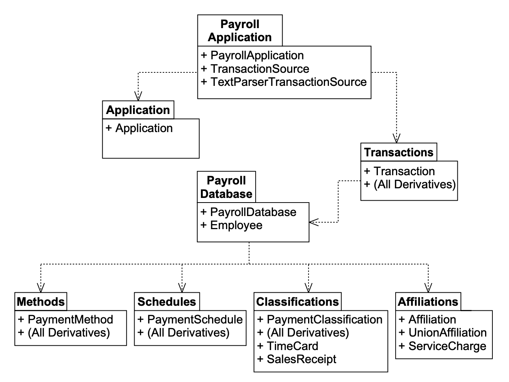 
*Fig 22-1 可能的薪资包图*

Fig 22-1 将薪资应用程序划分为八个包。
`PayrollApplication` 包包含 `PayrollApplication` 类和 `TransactionSource` 及 `TextParserTransactionSource` 类。
`Transactions` 包包含完整的 `Transaction` 类层次结构。
其他包的组成可以通过仔细检查图来明确。

依赖关系也应该是清楚的。
`PayrollApplication` 包依赖于 `Transactions` 包，因为 `PayrollApplication` 类调用了 `Transaction::Execute` 方法。
`Transactions` 包依赖于 `PayrollDatabase` 包，因为 `Transaction` 的许多派生类都直接与 `PayrollDatabase` 类通信。
其他依赖关系也同样合理。

我使用了什么标准将这些类分组到包中？
我只是把看起来应该放在一起的类放到了同一个包中。
正如我们在 [第 20 章](../ch20/0.md) 中学到的，这可能不是一个好主意。

考虑如果我们对 `Classifications` 包进行更改会发生什么。
这个更改将迫使 `EmployeeDatabase` 包重新编译和重新测试，这是应该的。
但它也会迫使 `Transactions` 包重新编译和重新测试。
当然，`ChangeClassificationTransaction` 及其来自 [Fig 19-3](../ch19/0.md) 的三个派生类应该被重新编译和重新测试，但为什么其他类也要被重新编译和重新测试呢？

从技术上讲，那些其他事务不需要重新编译和重新测试。
然而，如果它们是 `Transactions` 包的一部分，并且如果这个包为了应对 `Classifications` 包的更改而将被重新发布，那么不重新编译和重新测试整个包可能被认为是不负责任的。
即使不是所有事务都被重新编译和重新测试，包本身也必须被重新发布和重新部署，然后它的所有客户端至少需要重新验证，很可能需要重新编译。

`Transactions` 包中的类不共享相同的封闭性。
每个类都对自己的特定更改敏感。
`ServiceChargeTransaction` 对 `ServiceCharge` 类的更改开放，而 `TimeCardTransaction` 对 `TimeCard` 类的更改开放。
事实上，如 Fig 22-1 所示，`Transactions` 包的某些部分依赖于软件的其他几乎所有部分。
因此，这个包的发布率非常高。
每当下面的任何部分发生更改时，`Transactions` 包都必须被重新验证和重新发布。

`PayrollApplication` 包更加敏感：对系统任何部分的任何更改都会影响这个包，所以它的发布率一定是巨大的。
你可能会认为这是不可避免的 —— 随着在包依赖层次结构中爬得越高，发布率必然增加。
然而，幸运的是，事实并非如此，避免这种症状是 OOD 的主要目标之一。

## 应用共同封闭原则（CCP）

考虑 Fig 22-2。
该图根据封闭性 (closure) 将薪资应用程序的类分组在一起。
例如，`PayrollApplication` 包包含 `PayrollApplication` 和 `TransactionSource` 类。
这两个类都依赖于抽象类 `Transaction`，而 `Transaction` 位于 `PayrollDomain` 包中。
注意，`TextParserTransactionSource` 类在另一个包中，它依赖于抽象类 `PayrollApplication`。
这创建了一个倒置的结构，其中细节依赖一般性 (generalities)，而一般性是独立的。
这符合 DIP。

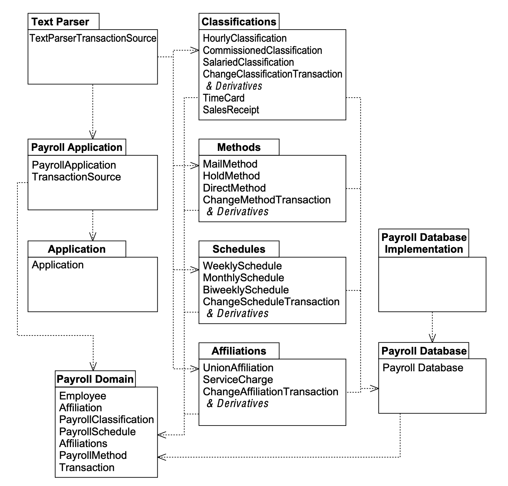 
*Fig 22-2 薪资应用程序的封闭包层次结构*

一般性和独立性最引人注目的例子是 `PayrollDomain` 包。
这个包包含整个系统的本质，却不依赖于任何东西！
仔细检查这个包。
它包含 `Employee`、`PaymentClassification`、`PaymentMethod`、`PaymentSchedule`、`Affiliation` 和 `Transaction`。
这个包包含了我们模型中所有主要的抽象，却没有依赖关系。
为什么？因为它包含的几乎所有类都是抽象的。

考虑 `Classifications` 包，它包含 `PaymentClassification` 的三个派生类。
它还包含 `ChangeClassificationTransaction` 类及其三个派生类，以及 `TimeCard` 和 `SalesReceipt`。
注意，对这九个类所做的任何更改都是隔离的；除了 `TextParser` 之外，没有其他包受到影响！
这种隔离也适用于 `Methods` 包、`Schedules` 包和 `Affiliations` 包。
这是相当多的隔离。

注意，大部分可执行代码都在依赖者很少或没有依赖者的包中。
由于几乎没有任何东西依赖它们，我们称它们为无责任性的。
这些包中的代码非常灵活；它们可以在不影响项目许多其他部分的情况下被更改。
还要注意，系统中最大一般性的包包含最少的可执行代码。
这些包被大量依赖，但不依赖任何东西。
由于许多包依赖它们，我们称它们为有责任性的，而由于它们不依赖任何东西，我们称它们为独立的。
因此，有责任性的代码量（即更改会影响大量其他代码的代码）非常少。
而且，那少量的有责任性的代码也是独立的，这意味着没有其他模块会引发它改变。
这种倒置的结构 ——底部是高度独立且负责任的普遍性，顶部是高度不负责任且依赖的细节—— 是面向对象设计的标志。

将 Fig 22-1 与 Fig 22-2 对比。
注意，Fig 22-1 底部的细节是独立的且高度负责的。
这是细节的错误位置！
细节应该依赖于系统的主要架构决策，而不应被依赖。
还要注意，一般性 ——定义系统架构的包—— 是不负责任且高度依赖的。
因此，定义架构决策的包依赖于包含实现细节的包，并因此受其约束。
这违反了 SAP。
如果架构约束细节，那就更好了！

## 应用复用-发布等价原则（REP）

薪资应用程序的哪些部分可以被复用？
如果我们公司的另一个部门想复用我们的薪资系统，但他们有一套完全不同的政策，他们就不能复用 `Classifications`、`Methods`、`Schedules` 或 `Affiliations` 。
然而，他们可以复用 `PayrollDomain`、`PayrollApplication`、`Application`、`PayrollDatabase`，以及可能 `PDImplementation`。
另一方面，如果另一个部门想编写分析当前员工数据库的软件，他们可以复用 `PayrollDomain`、`Classifications`、`Methods`、`Schedules`、`Affiliations`、`PayrollDatabase` 和 `PDImplementation`。
在每种情况下，复用的粒度都是一个包。

很少会单独复用包中的单个类（如果有的话）。
原因很简单：包中的类应该是内聚的。
这意味着它们相互依赖，不能轻易或合理地分离。
例如，在不使用 `PaymentMethod` 类的情况下使用 `Employee` 类是没有意义的。
事实上，为了这样做，你必须修改 `Employee` 类，使其不包含 `PaymentMethod` 类。
当然，我们不支持那种迫使我们修改被复用组件的复用方式。
因此，复用的粒度是包。
这给了我们另一个内聚标准，用于在尝试将类分组到包时采用：类不仅应该被一起封闭，它们还应该根据 REP 被一起复用。

重新考虑 Fig 22-1 中我们原始的包图。
我们可能希望复用的包，如 `Transactions` 或 `PayrollDatabase`，并不容易复用，因为它们附带了许多额外的包袱。
`PayrollApplication` 包是严重依赖的（它依赖于一切）。
如果我们想创建一个使用不同调度、方法、会员资格和分类策略的新薪资应用程序，我们将无法整体使用这个包。
相反，我们将不得不从 `PayrollApplication`、`Transactions`、`Methods`、`Schedules`、`Classifications` 和 `Affiliations` 中单独取出类。
通过这种方式拆分包，我们破坏了它们的发布结构。
我们不能说 `PayrollApplication` 的 3.2 版本是可复用的。

Fig 22-1 违反了 CRP。
因此，接受了我们各个包的可复用片段后，复用者将面临一个困难的管理问题：他将无法依赖我们的发布结构。
`Methods` 的新发布会影响他，因为他正在复用 `PaymentMethod` 类。
大多数时候，更改会针对他没有复用的类，但他仍然必须跟踪我们的新版本号，并且很可能重新编译和重新测试他的代码。

这可能很难管理，以至于复用者最可能的策略是复制可复用组件，并将该副本与我们的分开演进。
这不是复用。
这两段代码将变得不同，并需要独立支持，实际上使支持负担加倍。

Fig 22-2 中的结构没有表现出这些问题。
该结构中的包更容易复用。
`PayrollDomain` 不会附带太多包袱。
它可以独立于 `PaymentMethod`、`PaymentClassification`、`PaymentSchedule` 等的任何派生类进行复用。

敏锐的读者会注意到，Fig 22-2 中的包图并不完全符合 CRP。
具体来说，`PayrollDomain` 中的类并没有形成最小的可复用单元。
`Transaction` 类不需要与包中的其余类一起复用。
我们可以设计许多访问 `Employee` 及其字段的应用程序，但从不使用 `Transaction`。

这提示我们更改包图，如 Fig 22-3 所示。
这将事务与它们操作的元素分离开来。
例如，`MethodTransactions` 包中的类操作 `Methods` 包中的类。
我们将 `Transaction` 类移动到一个名为 `TransactionApplication` 的新包中，该包还包含 `TransactionSource` 和一个名为 `TransactionApplication` 的类。
这三个组成一个可复用单元。
`PayrollApplication` 类现在变成了大统一者。
它包含主程序，以及 `TransactionApplication` 的一个名为 `PayrollApplication` 的派生类，它将 `TextParserTransactionSource` 连接到 `TransactionApplication`。

这些操作给设计又增加了一层抽象。`TransactionApplication` 包现在可以被任何从 `TransactionSource` 获取 `Transaction` 然后执行它们的应用程序复用。
`PayrollApplication` 包不再可复用，因为它是极端依赖的。
然而，`TransactionApplication` 包取代了它的位置，并且更加一般化。
现在我们可以在没有任何 `Transaction` 的情况下复用 `PayrollDomain` 包。

<ins>这无疑提高了项目的可复用性和可维护性，但代价是增加了五个额外的包和一个更复杂的依赖架构。
权衡的价值取决于我们可能期望的复用类型以及我们期望应用程序演进的速率。</ins>
如果应用程序保持非常稳定，并且很少有客户端复用，那么这个更改就过头了。
另一方面，如果许多应用程序将复用这个结构，或者我们期望应用程序经历许多变化，那么新结构就更优越 —— 这是一个判断决定；它应该由数据驱动，而不是推测。
<ins>最好从简单开始，并根据需要增长包结构。
如果有必要，包结构总是可以变得更精细。</ins>

## 耦合与封装

正如类之间的耦合由 Java 和 C++ 中的封装边界管理一样，包之间的耦合也可以通过 UML 的导出修饰符来管理。

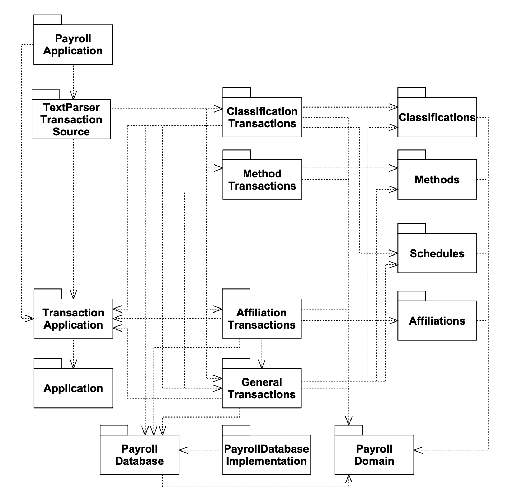 
*Fig 22-3 更新后的薪资包图*

如果一个包中的类要被另一个包使用，该类必须被导出 (export) 。
在 UML 中，类默认被导出 (export)，但我们可以修饰包以表示某些类不应被导出。
Fig 22-4（`Classifications` 包的放大图）显示，`PaymentClassification` 的三个派生类被导出，但 `TimeCard` 和 `SalesReceipt` 未被导出。
这意味着其他包将无法使用 `TimeCard` 和 `SalesReceipt`；它们是 `Classifications` 包的私有类。

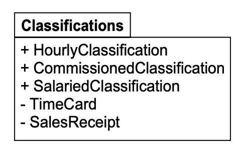 
*Fig 22-4 Classifications 包中的私有类*

我们可能希望隐藏包中的某些类，以防止传入耦合。
`Classifications` 是一个非常详细的包，包含几个支付政策的实现。
为了保持这个包在主序列上，我们希望限制其传入耦合，因此我们隐藏其他包不需要知道的类。

`TimeCard` 和 `SalesReceipt` 是很好的私有类选择。
它们是计算员工薪资机制的实现细节。
我们希望保持自由修改这些细节的权利，因此我们需要防止其他任何人依赖于它们的结构。

快速浏览 Fig 19-7 至 Fig 19-10 以及 Listing 19-15（[第 213 至 217 页](../ch19/0.md) ）可知，`TimeCardTransaction` 和 `SalesReceiptTransaction` 类已经依赖于 `TimeCard` 和 `SalesReceipt`。
然而，如 Fig 22-5 和 Fig 22-6 所示，我们可以轻松解决这个问题。

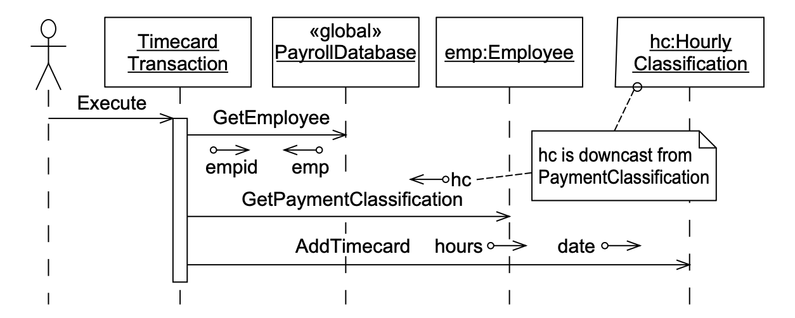 
*Fig 22-5 修订 TimeCardTransaction 以保护 TimeCard 的私有性*

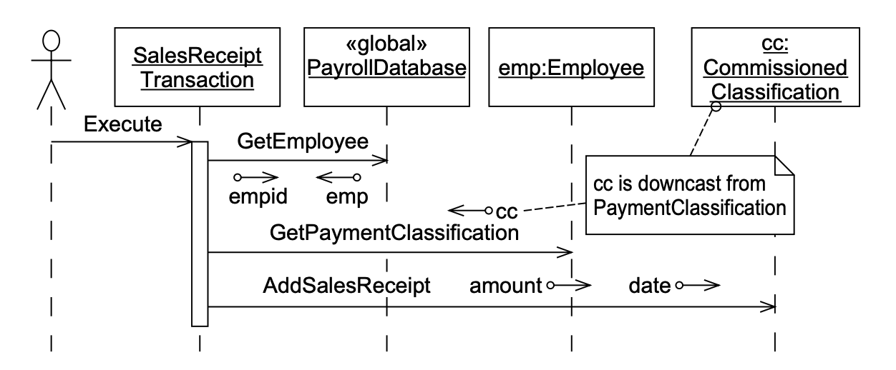 
*Fig 22-6 修订 SalesReceiptTransaction 以保护 SalesReceipt 的私有性*

## 度量指标

如 [第 20 章](../ch20/0.md) 所示，我们可以用一些简单的度量指标来量化内聚性、耦合性、稳定性、一般性以及距主序列的符合度等属性。
但为什么我们要这样做呢？
套用 Tom DeMarco 的话：你无法管理你无法控制的东西，而你无法控制你不测量的东西。¹ 要成为有效的软件工程师或软件经理，我们必须能够控制软件开发实践。
然而，如果我们不测量它，我们就永远无法获得那种控制。

通过应用下面描述的启发式方法，并计算关于我们面向对象设计的一些基本度量指标，我们可以开始将这些度量指标与软件及其开发团队的测量绩效相关联。
我们收集的度量指标越多，我们就拥有越多的信息，最终我们就能施加越多的控制。

自 1994 年以来，下面的度量指标已成功应用于多个项目。
有几种自动工具可以为你计算它们，而且手动计算也不难。
编写一个简单的 shell、python 或 ruby 脚本来遍历你的源文件并计算它们也不难。²

¹ [DeMarco82]，第3页。
² 有关 shell 脚本示例，你可以从 www.objectmentor.com 的免费软件区下载 depend.sh，或者查看 www.clarkware.com 上的 JDepend。

- **（H）关系内聚性**。
包内聚性的一个方面可以表示为每个类的内部关系平均数量。
设 R 为包内部（即不连接到包外部类）的类关系数量。
设 N 为包中的类数量。
公式中额外的 1 是为了防止当 N = 1 时 H = 0。
它表示包与其所有类之间的关系。

\[
H = \frac{R + 1}{N}
\]

- **（Ca）传入耦合** 可以计算为来自其他包的依赖于主题包内部类的类的数量。
这些依赖关系是类关系，如继承和关联。

- **（Ce）传出耦合** 可以计算为主题包中的类所依赖的其他包中的类的数量。
同样，这些依赖关系是类关系。

- **（A）抽象性或一般性** 可以计算为包中抽象类（或接口）的数量与包中类（和接口）总数之比。³ 该度量范围从 0 到 1。

\[
A = \frac{\text{抽象类数量}}{\text{类总数}}
\]

- **（I）不稳定性** 可以计算为传出耦合与总耦合之比。该度量范围也从 0 到 1。

\[
I = \frac{Ce}{Ce + Ca}
\]

- **（D）距主序列的距离**。主序列理想化为直线 \( A + I = 1 \)。D 的公式计算任何特定包距主序列的距离。其范围从约 0.7 到 0；⁴ 越接近 0 越好。

\[
D = \frac{|A + I - 1|}{\sqrt{2}}
\]

- **（D′）距主序列的归一化距离**。
该度量将 D 度量归一化到范围 [0,1]。它可能更方便计算和解释。值为 0 表示一个包与主序列重合。值为 1 表示一个包尽可能远离主序列。

\[
D' = |A + I - 1|
\]

在 Java 中，接口算作抽象类。
实际范围是 0 到 √2/2，但为了方便，通常归一化到 0 到 1。

³ 有人可能认为，`A` 更好的计算公式是包中纯虚函数与成员函数总数之比。
然而，我发现这个公式会过度削弱抽象性度量。
即使一个纯虚函数也会使一个类成为抽象类，而这种抽象的力量比该类可能有几十个具体函数这一事实更重要，尤其是在遵循 DIP 的情况下。

⁴ 不可能在 `A` 对 `I` 的图上绘制单位正方形之外的任何包。
这是因为 `A` 和 `I` 都不能超过 1。
主序列从 (0,1) 到 (1,0) 平分这个正方形。
正方形内离主序列最远的点是两个角 (0,0) 和 (1,1)。它们到主序列的距离为：
\[
\frac{\sqrt{2}}{2} = 0.70710678\ldots
\]

## 将度量指标应用于薪资应用程序

Tab 22-1 显示了薪资模型中的类如何分配到包中。
Fig 22-7 显示了薪资应用程序的包图，并计算了所有度量指标。
Tab 22-2 显示了每个包计算出的所有度量指标。

Fig 22-7 中的每个包依赖关系都附有两个数字。
最接近依赖者包的数字表示该包中依赖被依赖者包的类的数量。
最接近被依赖者包的数字表示依赖者包所依赖的该包中的类的数量。

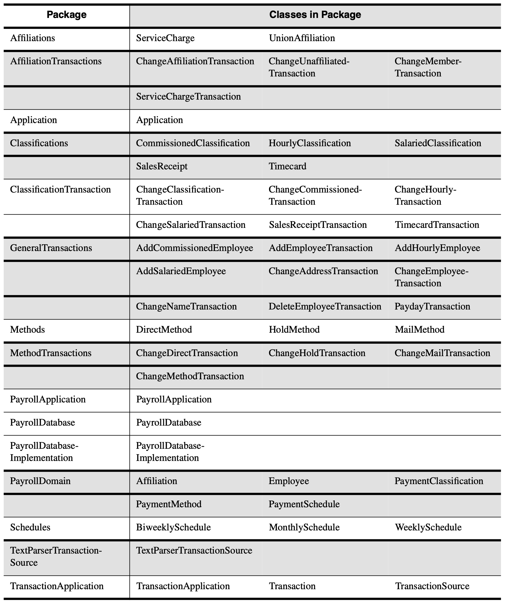 
*Tab 22-1*

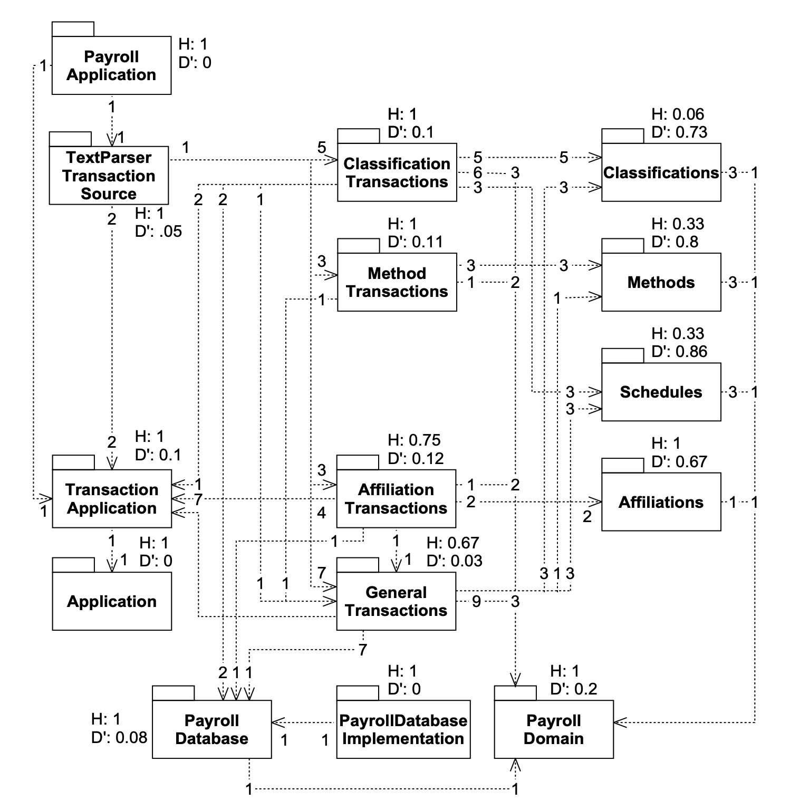 
*Fig 22-7 带有度量指标的包图*

Fig 22-7 中的每个包都附有适用于它的度量指标。
其中许多度量指标令人鼓舞。
例如，`PayrollApplication`、`PayrollDomain` 和 `PayrollDatabase` 具有较高的关系内聚性，并且位于主序列上或接近主序列。
然而，`Classifications`、`Methods` 和 `Schedules` 包显示出总体较差的关系内聚性，并且几乎尽可能远离主序列！

这些数字告诉我们，类到包的划分是薄弱的。
如果我们找不到改进这些数字的方法，那么开发环境将对变更敏感，这可能导致不必要的重新发布和重新测试。
具体来说，我们有像 `ClassificationTransactions` 这样的低抽象包，严重依赖于像 `Classifications` 这样的其他低抽象包。
低抽象的类包含大部分详细代码，因此很可能发生变更，这将强制重新发布依赖它们的包。
因此，`ClassificationTransactions` 包的发布率将非常高，因为它既受自身高变更率的影响，也受 `Classifications` 变更率的影响。
我们应尽可能限制开发环境对变更的敏感性。

显然，如果我们只有两三个开发人员，他们就能 “在脑中” 管理开发环境，为此目的而将包保持在主序列上的需求就不会很大。
然而，开发人员越多，保持开发环境健康就越困难。
而且，与即使一次重新测试和重新发布所需的工作相比，获得这些度量指标所需的工作量是最小的。⁵ 因此，计算这些度量指标的工作是短期损失还是收益，是一个判断问题。

⁵ 我花了大约两个小时手动编译统计数据并计算薪资示例的度量指标。
如果我使用了其中一个常见的工具，那几乎不会花任何时间。

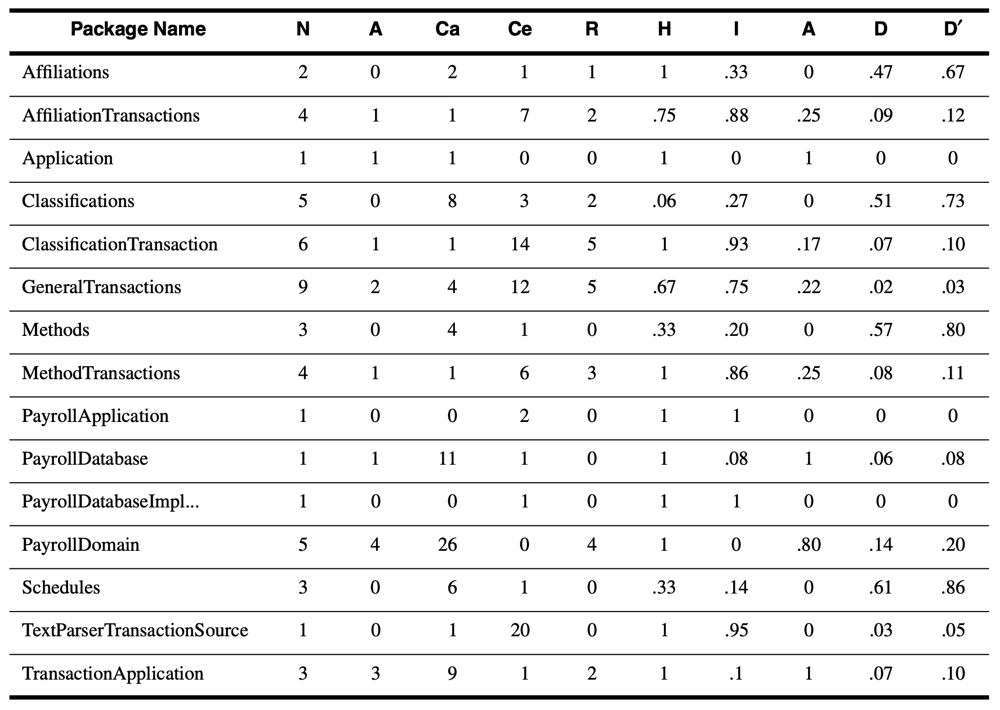 
*Tab 22-2*

## 对象工厂

`Classifications` 和 `ClassificationTransactions` 被大量依赖，是因为它们内部的类必须被实例化。
例如，`TextParserTransactionSource` 类必须能够创建 `AddHourlyEmployeeTransaction` 对象；
因此，从 `TextParserTransactionSource` 包到 `ClassificationTransactions` 包存在传入耦合。
同时，`ChangeHourlyTransaction` 类必须能够创建 `HourlyClassification` 对象，
因此从 `ClassificationTransactions` 包到 `Classifications` 包存在传入耦合。

几乎对这些包中对象的每一次其他使用都是通过它们的抽象接口进行的。
如果不是因为需要创建每个具体对象，这些包上的传入耦合就不会存在。
例如，如果 `TextParserTransactionSource` 不需要创建不同的事务，它就不会依赖包含事务实现的四个包。

这个问题可以通过使用 FACTORY 模式来显著缓解。
每个包提供一个对象工厂，负责创建该包内的所有公共对象。

### TransactionImplementation 的对象工厂

Fig 22-8 展示了如何为 `TransactionImplementation` 包构建一个对象工厂。
`TransactionFactory` 包包含抽象基类，它定义了代表具体事务对象构造函数的纯虚函数。
`TransactionImplementation` 包包含 `TransactionFactory` 类的具体派生类，并使用所有具体事务来创建它们。

`TransactionFactory` 类有一个声明为 `TransactionFactory` 指针的静态成员。
该成员必须由主程序初始化，以指向一个具体的 `TransactionFactoryImplementation` 对象的实例。

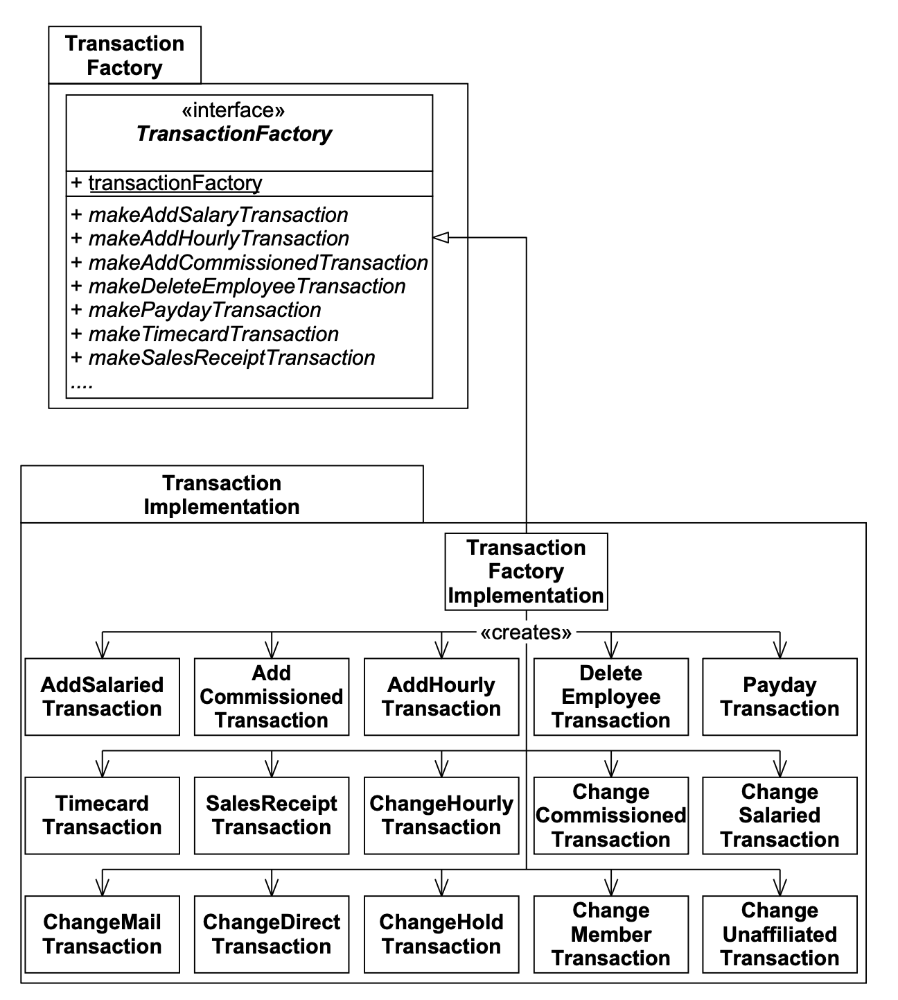 
*Fig 22-8 Transactions 的对象工厂*

### 初始化工厂

为了使用对象工厂创建对象，抽象对象工厂的静态成员必须被初始化为指向相应的具体工厂。
这必须在任何用户尝试使用该工厂之前完成。
通常，最好的位置是主程序，这意味着主程序依赖于所有工厂和所有具体包。
因此，每个具体包至少有一个来自主程序的传入耦合。
这将迫使具体包稍微偏离主序列，但这是不可避免的。⁶
这意味着每当我们更改任何具体包时，我们都必须重新发布主程序。
当然，无论如何，我们可能都应该为每次更改重新发布主程序，因为它无论如何都需要被测试。

⁶ 作为实际解决方案，我通常忽略来自主程序的耦合。

Fig 22-9 和 22-10 显示了主程序与对象工厂相关的静态和动态结构。

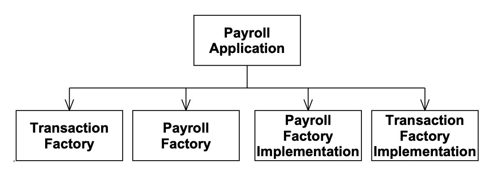 
*Fig 22-9 主程序和对象工厂的静态结构*

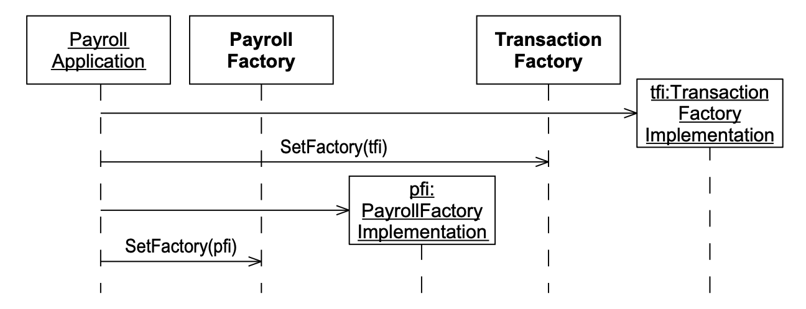 
*Fig 22-10 主程序和对象工厂的动态结构*

### 重新思考内聚边界

我们在 Fig 22-1 中最初将 `Classifications`、`Methods`、`Schedules` 和 `Affiliations` 分开。
当时，这似乎是一个合理的划分。
毕竟，其他用户可能想复用我们的调度类而不复用我们的会员资格类。
在我们把事务拆分到它们自己的包中后，这种划分被保留了下来，创建了一个双重层次结构。
也许这样太过分了。
Fig 22-7 中的图非常纠结。

如果手动管理，一个纠结的包图会使发布管理变得困难。
尽管包图可以很好地与自动化项目规划工具配合使用，但我们大多数人并没有这种奢侈。
因此，我们需要尽可能保持包图简单。

在我看来，事务划分比功能划分更重要。
因此，我们将把事务合并到一个 `TransactionImplementation` 包中，如 Fig 22-11 所示。
我们还将把 `Classifications`、`Schedules`、`Methods` 和 `Affiliations` 包合并到一个 `PayrollImplementation` 包中。

## **最终包结构**

 

Tab 22-3 显示了类到包的最后分配。
Tab 22-4 包含度量指标电子表格。
Fig 22-11 显示了最终的包结构，它使用对象工厂将具体包带到主序列附近。

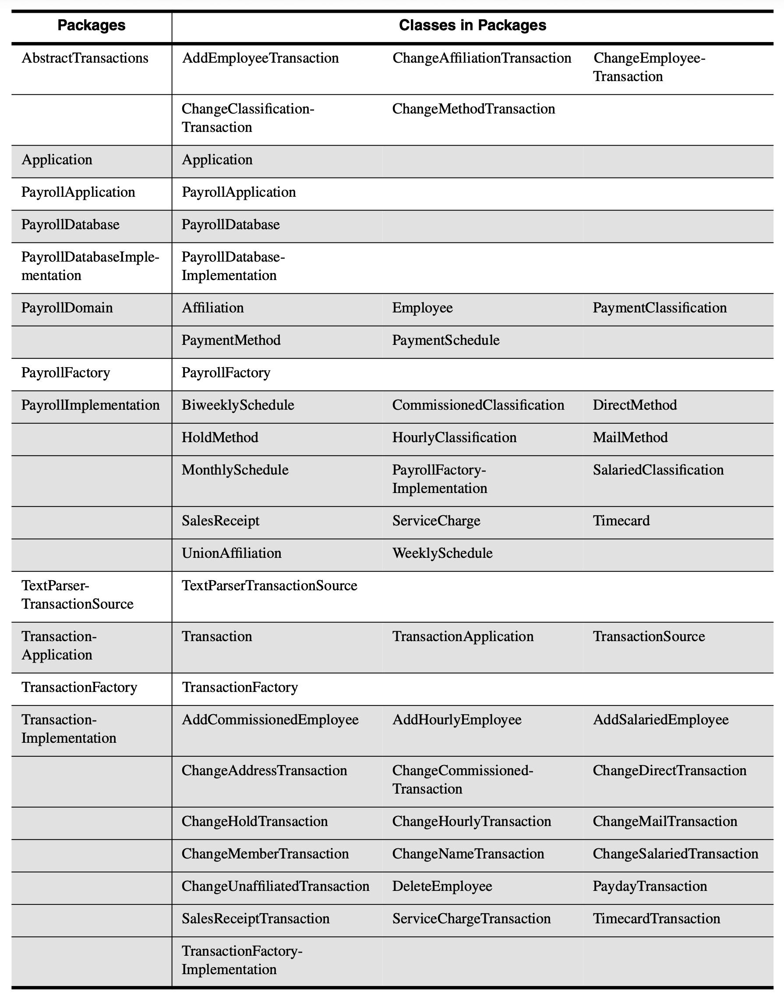 
*Tab 22-3*

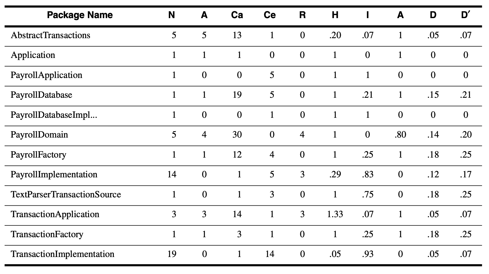 
*Tab 22-4*

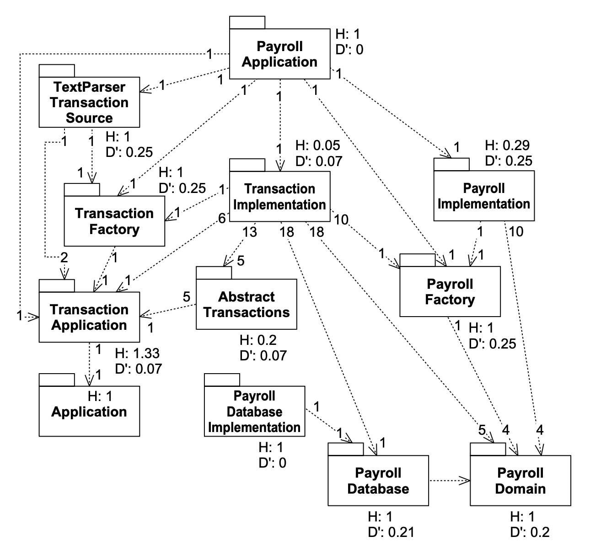 
*Fig 22-11 最终薪资包结构*

该图上的度量指标令人振奋。
关系内聚性都非常高（部分归功于具体工厂与它们所创建的对象之间的关系），并且没有显著偏离主序列。
因此，我们包之间的耦合对于健康的开发环境是合适的。
我们的抽象包是封闭的、可复用的，并且被大量依赖，同时它们自己的依赖关系很少。
我们的具体包根据复用性进行隔离，大量依赖抽象包，并且自身不被大量依赖。

## 结论

管理包结构的需要是程序规模和开发团队规模的函数。
即使是小团队也需要划分源代码，以便他们能够互不干扰。
如果没有某种划分结构，大型程序可能会变成不透明的源文件堆。

## 参考文献

1. Benjamin/Cummings. *Object-Oriented Analysis and Design with Applications*, 2d ed., 1994.
2. DeMarco, Tom. *Controlling Software Projects*. Yourdon Press, 1982.
