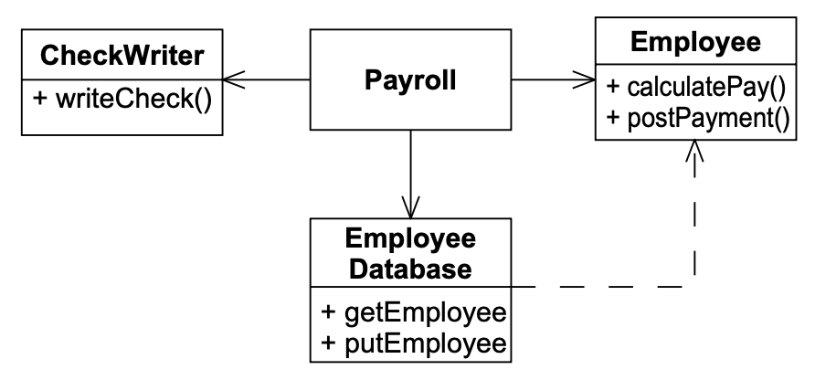
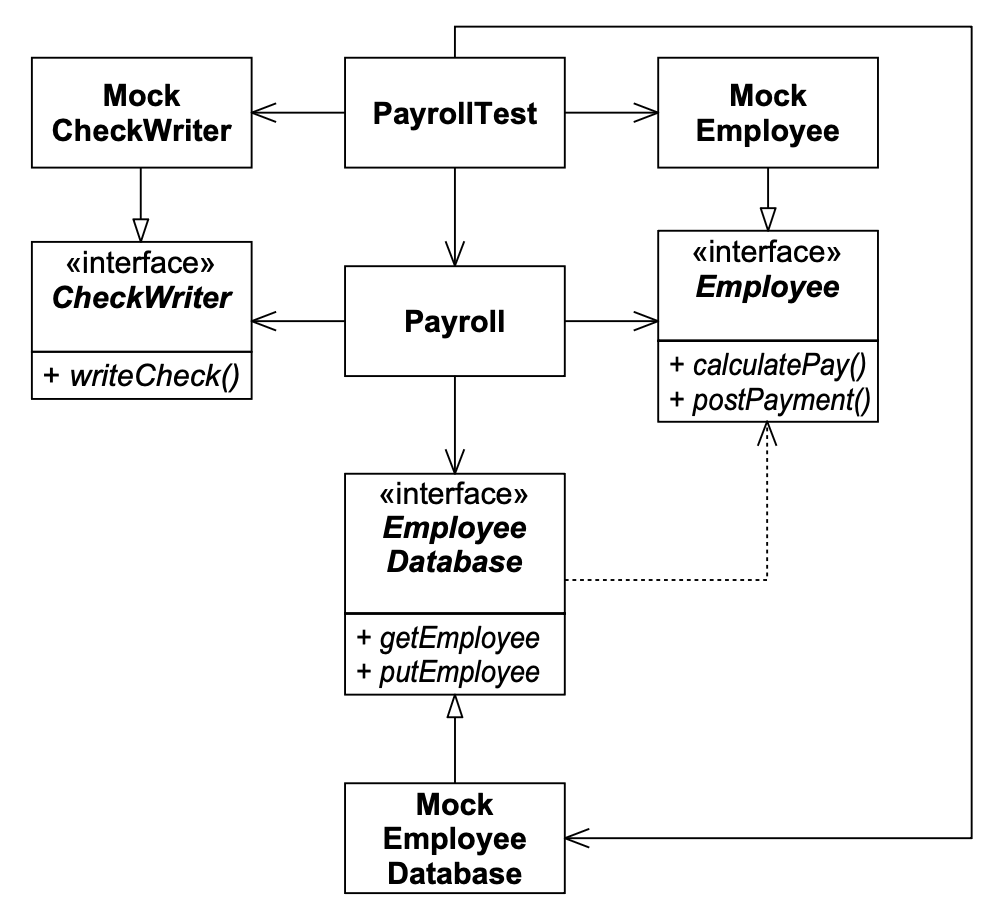

# 4 测试

<center></center><br/>

> 火是黄金的试金石；逆境，是强者的试金石。
>
> <p align="right">——Seneca（约公元前 3 年–公元 65 年）</p>

编写单元测试的行为，与其说是验证，不如说是一种设计行为。
它也更像是一种文档化行为，而非验证。
编写单元测试的行为会关闭数量惊人的反馈回路，其中与功能验证相关的反馈回路反而是最不重要的。

## 测试驱动开发

如果我们在设计程序之前先设计测试会怎样？
如果在我们的程序中没有某个函数，而导致某个测试失败，我们就拒绝实现这个函数，会怎样？
如果除非有一个测试因为某行代码的缺失而失败，否则我们拒绝向程序中添加哪怕一行代码，会怎样？
如果我们通过首先编写一个断言该功能存在的失败测试，然后使测试通过，来逐步向程序中添加功能，会怎样？
这会对我们正在编写的软件设计产生什么影响？
我们从存在如此全面的测试套件中能获得什么好处？

第一个也是最明显的效果是，程序的每一个功能都有测试来验证其操作。
这个测试套件充当了后续开发的保障。
它会在我们无意中破坏某些现有功能时告诉我们。
我们可以向程序添加功能，或者改变程序的结构，而不必担心在此过程中破坏重要的东西。
测试告诉我们程序仍在正常运行。
因此，我们可以更自由地进行更改和改进我们的程序。

<ins>一个更重要但不太明显的效果是，首先编写测试的行为迫使我们进入一个不同的视角。
我们必须从该程序的调用者的角度来审视我们即将编写的程序。
因此，我们立即关注程序的接口以及它的功能。
通过首先编写测试，我们将软件设计为方便调用</ins>。

<ins>更重要的是，通过首先编写测试，我们迫使自己将程序设计为可测试的</ins>。
将程序设计为可调用和可测试是极其重要的。
为了可调用和可测试，软件必须与其环境解耦。
因此，首先编写测试的行为迫使我们解耦软件！

首先编写测试的另一个重要效果是，测试作为一种宝贵的文档形式。
如果你想知道如何调用一个函数或创建一个对象，有一个测试会展示给你。
测试充当了一套示例，帮助其他程序员弄清楚如何使用代码。
这种文档是可编译和可执行的。
它将保持最新。
它不会说谎。

### 一个测试优先设计的例子

我最近为了好玩编写了一个版本的 Hunt the Wumpus。
这个程序是一个简单的冒险游戏，玩家在洞穴中移动，试图在 Wumpus 吃掉他之前杀死它。
洞穴是一组通过通道相互连接的房间。
每个房间可能有向北、南、东、西的通道。
玩家通过告诉计算机朝哪个方向移动来移动。

我为这个程序编写的第一个测试之一是 Listing 4-1中 的 `testMove`。
这个函数创建了一个新的 `WumpusGame`，通过一条向东的通道连接房间 4 和房间 5，将玩家放在房间 4 中，发出向东移动的命令，然后断言玩家应该在房间 5 中。

Listing 4-1

```java
public void testMove()
{
    WumpusGame g = new WumpusGame();
    g.connect(4,5,"E");
    g.setPlayerRoom(4);
    g.east();
    assertEquals(5, g.getPlayerRoom());
}
```

所有这些代码都是在 `WumpusGame` 的任何部分被编写之前编写的。
我采纳了 Ward Cunningham 的建议，按照我想要的方式编写了测试。
我相信我可以通过编写符合测试所暗示结构的代码来使测试通过。
这被称为 *意图编程 (intentional programming)* 。
你在实现之前在一个测试中陈述你的意图，使你的意图尽可能简单和可读。
你相信这种简单性和清晰性指向了程序的一个好结构。

通过意图编程立即引出了一个有趣的设计决策。
测试没有使用 `Room` 类。
将一个房间连接到另一个房间的动作传达了我的意图。
我似乎不需要一个 `Room` 类来促进这种通信。
相反，我可以只使用整数来表示房间。

这对你来说可能看起来违反直觉。
毕竟，这个程序可能在你看来完全是关于房间的；在房间之间移动；找出房间包含什么；等等。
由于缺乏 `Room` 类，我的意图所暗示的设计是有缺陷的吗？

我可以争辩说，连接的概念比房间的概念更核心于 Wumpus 游戏。
我可以争辩说，这个初始测试指出了一种解决问题的好方法。
事实上，我认为情况确实如此，但这并不是我要表达的观点。
关键是测试在非常早期的阶段就阐明了一个核心设计问题。
*优先编写测试的行为是在设计决策之间进行辨别的行为*。

注意，测试告诉你程序是如何工作的。
我们大多数人从这简单的规范中就能轻松编写出 `WumpusGame` 的四个命名方法。
我们也可以毫不费力地命名和编写其他三个方向命令。
如果后来我们想知道如何连接两个房间或在某个特定方向上移动，这个测试会毫不含糊地向我们展示如何做。
这个测试充当了一个可编译、可执行的文档，描述了程序。

### 测试隔离

在生产代码之前编写测试的行为，往往会暴露出软件中应当被解耦的区域。
例如，Fig 4-1 显示了一个薪资应用程序的简单 UML 图 ¹ 。
`Payroll` 类使用 `EmployeeDatabase` 类来获取一个 `Employee` 对象。
它要求 `Employee` 计算其薪资。
然后它将这笔薪资传递给 `CheckWriter` 对象以生成一张支票。
最后，它将这笔支付记录过账到 `Employee` 对象，并将该对象写回数据库。

<br/>
*Fig 4-1 耦合的薪资模型*

假设我们还没有编写任何这些代码。
到目前为止，这个图只是在一次快速设计会议之后留在白板上的。²
现在，我们需要编写测试来指定 `Payroll` 对象的行为。
编写这些测试有几个相关的问题。
首先，我们使用什么数据库？`Payroll` 需要从某种数据库中读取。
我们必须先编写一个功能完整的数据库，然后才能测试 `Payroll` 类吗？
我们向其中加载什么数据？
其次，我们如何验证适当的支票已被打印？
我们无法编写一个自动测试来查看打印机上的支票并验证其金额！

这些问题的解决方案是使用 *模拟对象（MOCK OBJECT）* 模式。³
我们可以在 `Payroll` 的所有协作者之间插入接口，并创建实现这些接口的测试桩。

¹ 如果你不了解 UML，有两个附录对其进行了非常详细的描述。参见附录 A 和 B，从第 467 页开始。<br/>
² [Jeffries2001]。<br/>
³ [Mackinnon2000]。

Fig 4-2 显示了这种结构。
`Payroll` 类现在使用接口与 `EmployeeDatabase`、`CheckWriter` 和 `Employee` 进行通信。
已经创建了三个实现这些接口的模拟对象。
`PayrollTest` 对象查询这些模拟对象，以查看 `Payroll` 对象是否正确管理它们。

Listing 4-2 显示了测试的意图。
它创建了适当的模拟对象，将它们传递给 `Payroll` 对象，告诉 `Payroll` 对象支付所有员工，
然后要求模拟对象验证所有支票是否正确开具以及所有支付是否正确过账。

<br/>
*Fig 4-2 使用模拟对象进行测试的解耦薪资系统*

Listing 4-2 TestPayroll

```java
public void testPayroll()
{
    MockEmployeeDatabase db = new MockEmployeeDatabase();
    MockCheckWriter w = new MockCheckWriter();
    Payroll p = new Payroll(db, w);
    p.payEmployees();
    assert(w.checksWereWrittenCorrectly());
    assert(db.paymentsWerePostedCorrectly());
}
```

当然，这个测试所检查的只是 `Payroll` 是否用正确的数据调用了所有正确的函数。
它实际上并没有检查支票是否被开具。
它实际上并没有检查一个真实的数据库是否被正确更新。
相反，它检查的是 `Payroll` 类在被隔离的情况下是否按预期行事。

你可能会想知道 `MockEmployee` 是做什么用的。
看起来使用真正的 `Employee` 类而不是模拟似乎是可行的。
如果真是这样，那么我会毫不犹豫地使用它。
在这种情况下，我假设 `Employee` 类比检查 `Payroll` 功能所需的要复杂。

### 偶然的解耦

`Payroll` 的解耦是一件好事。
它允许我们为测试和应用程序扩展的目的，换入不同的数据库和支票写入器。
我认为有趣的是，这种解耦是由测试的需求驱动的。
显然，隔离被测模块的需求迫使我们以有利于程序整体结构的方式进行解耦。
在代码之前编写测试改进了我们的设计。

本书的很大一部分是关于管理依赖关系的设计原则。
这些原则为你提供了一些解耦类和包的原则和技术。
你会发现，如果你将这些原则作为单元测试策略的一部分来实践，它们将最有益。
正是单元测试将为解耦提供大部分的动力和方向。

## 验收测试

<br/>

单元测试是必要的，但作为验证工具是不够的。
单元测试验证系统的小元素按预期工作，但它们不验证系统作为一个整体是否正常工作。
单元测试是 *白盒测试* ⁴，验证系统的各个机制。

验收测试是 *黑盒测试* ⁵，验证客户需求是否得到满足。

⁴ 一种知道并依赖于被测模块内部结构的测试。<br/>
⁵ 一种不知道也不依赖于被测模块内部结构的测试。

验收测试由不了解系统内部机制的人员编写。
它们可以由客户直接编写，或由附属于客户的一些技术人员（可能是 QA ）编写。
验收测试是程序，因此是可执行的。
然而，它们通常是用为应用的客户创建的特定脚本语言编写的。

验收测试是一个功能的最终文档。
一旦客户编写了验收测试来验证一个功能是否正确，程序员就可以阅读这些验收测试来真正理解这个功能。
因此，正如单元测试作为系统内部的编译和可执行文档一样，验收测试作为系统功能的编译和可执行文档。

此外，首先编写验收测试的行为对系统的架构有着深远的影响。
为了使系统可测试，它必须在高级架构层面上被解耦。
例如，用户界面（UI）必须与业务规则解耦，这样验收测试就可以在不通过 UI 的情况下访问那些业务规则。

在项目的早期迭代中，很容易倾向于手动进行验收测试。
这是不可取的，因为它剥夺了那些早期迭代中由自动化验收测试需求所施加的解耦压力。
当你开始第一次迭代时，完全知道你必须要自动化验收测试，你会做出非常不同的架构权衡。
而且，正如单元测试驱动你在小范围内做出卓越的设计决策，验收测试驱动你在宏观范围内做出卓越的架构决策。

创建一个验收测试框架可能看起来是一项艰巨的任务。
然而，如果你只取一个迭代的功能，并且只创建那个框架中为那几个验收测试所必需的部分，你会发现编写它并不那么难。
你也会发现付出的努力是值得的。

### 验收测试示例

再次考虑薪资应用程序。
在我们的第一次迭代中，我们必须能够向数据库中添加和删除员工。
我们还必须能够为当前数据库中的员工创建薪资支票。
幸运的是，我们只需要处理受薪员工。
其他类型的员工被推迟到以后的迭代中。

我们还没有编写任何代码，也还没有投入任何设计。
这是开始思考验收测试的最佳时机。
再一次，意图编程是一个有用的工具。
我们应该按照我们认为应该出现的方式来编写验收测试，然后我们可以围绕那个结构来构建脚本语言和薪资系统。

我希望验收测试方便编写且易于更改。
我希望它们被放在配置管理工具中并保存，以便我随时可以运行它们。
因此，验收测试应该以简单的文本文件形式编写是有道理的。

下面是一个验收测试脚本的示例：

```
AddEmp 1429 "Robert Martin" 3215.88
Payday
Verify Paycheck EmpId 1429 GrossPay 3215.88
```

在这个示例中，我们将员工编号 1429 添加到数据库中。
他的名字是 “Robert Martin”，他的月薪是 3215.88 美元。
接下来，我们告诉系统今天是发薪日，它需要支付所有员工。
最后，我们验证是否生成了员工 1429 的薪资支票，其 `GrossPay` 字段为 3215.88 美元。

显然，这种脚本对客户来说非常容易编写。
此外，向这种脚本添加新功能也很容易。
然而，想一想这对系统结构意味着什么。

脚本的前两行是薪资应用程序的功能。
我们可以称这些行为薪资事务。
这是薪资用户期望的功能。
然而，`Verify` 行不是薪资用户期望的事务。
这一行是一个特定于验收测试的指令。

因此，我们的验收测试框架将不得不解析这个文本文件，将薪资事务与验收测试指令分开。
它必须将薪资事务发送到薪资应用程序，然后使用验收测试指令查询薪资应用程序以验证数据。

这已经给薪资程序带来了架构上的压力。
薪资程序将不得不直接接受来自用户的输入，以及来自验收测试框架的输入。
我们希望尽可能早地将这两条输入路径汇合在一起。
因此，看起来薪资程序将需要一个事务处理器，它可以处理来自多个来源的 `AddEmp` 和 `Payday` 形式的事务。
我们需要找到这些事务的某种通用形式，以便将专用代码的数量保持在最低限度。

一种解决方案是以 XML 格式将事务馈送到薪资应用程序。
验收测试框架当然可以生成 XML，而且薪资系统的 UI 似乎也可以生成 XML。
因此，我们可能会看到如下所示的事务：

```xml
<AddEmp PayType=Salaried>
    <EmpId>1429</EmpId>
    <Name>Robert Martin</Name>
    <Salary>3215.88</Salary>
</AddEmp>
```

这些事务可能通过子程序调用、套接字甚至批处理输入文件进入薪资应用程序。
实际上，在开发过程中，从一种方式切换到另一种方式将是一件微不足道的事情。
因此，在早期的迭代中，我们可以决定从文件读取事务，在很久以后再迁移到 API 或套接字。

验收测试框架如何调用 `Verify` 指令？
显然，它必须有某种方式来访问薪资应用程序产生的数据。
再一次，我们不希望验收测试框架试图去读取打印支票上的文字，但我们可以做次优的事情。

我们可以让薪资应用程序以 XML 格式生成其薪资支票。
然后验收测试框架可以捕获这个 XML 并查询其中的适当数据。
从 XML 打印支票的最后一步可能足够简单，可以通过手动验收测试来处理。

因此，薪资应用程序可以创建一个包含所有薪资支票的 XML 文档。
它可能看起来像这样：

```xml
<Paycheck>
    <EmpId>1429</EmpId>
    <Name>Robert Martin</Name>
    <GrossPay>3215.88</GrossPay>
</Paycheck>
```

显然，当提供这个 XML 时，验收测试框架可以执行 `Verify` 指令。

再一次，我们可以通过套接字、API 或文件输出 XML。
对于初始迭代，使用文件可能是最简单的。
因此，薪资应用程序将开始其生命周期，从文件读取 XML 事务，并将 XML 薪资支票输出到文件。
验收测试框架将读取文本形式的事务，将它们翻译成 XML 并写入文件。
然后它将调用薪资程序。
最后，它将从薪资程序读取输出 XML 并调用 `Verify` 指令。

### 偶然的架构

注意验收测试给薪资系统的架构带来的压力。
正是我们首先考虑测试这一事实，使我们很快想到了 XML 输入和输出的概念。
这种架构将事务源与薪资应用程序解耦了。
它还将薪资支票打印机制与薪资应用程序解耦了。
这些都是很好的架构决策。

## 结论

运行一套测试越简单，这些测试就会被越频繁地运行。
测试被运行得越频繁，与这些测试的任何偏差就会被越快发现。
如果我们能每天多次运行所有测试，那么系统就永远不会被破坏超过几分钟。
这是一个合理的目标。
我们根本不允许系统倒退。
一旦它达到一定的工作水平，它就永远不会退回到更低的水平。

然而，验证只是编写测试的好处之一。
单元测试和验收测试都是文档的一种形式。
这种文档是可编译和可执行的；因此，它是准确和可靠的。
而且，这些测试是用明确的语言编写的，并使其对受众可读。
程序员可以阅读单元测试，因为它们是用他们的编程语言编写的。
客户可以阅读验收测试，因为它们是用他们自己设计的语言编写的。

所有这些测试可能最重要的好处是它对架构和设计的影响。
为了使一个模块或应用程序可测试，它也必须被解耦。
它越可测试，它就越解耦。
考虑全面的验收测试和单元测试的行为对软件的结构有着极其积极的影响。

## 参考书目

1. Mackinnon, Tim, Steve Freeman, and Philip Craig. Endo-Testing: Unit Testing with Mock Objects. Extreme Programming Examined. Addison–Wesley, 2001.
2. Jeffries, Ron, et al., Extreme Programming Installed. Upper Saddle River, NJ: Addison–Wesley, 2001.
