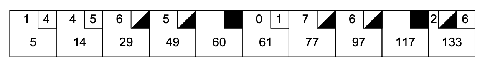
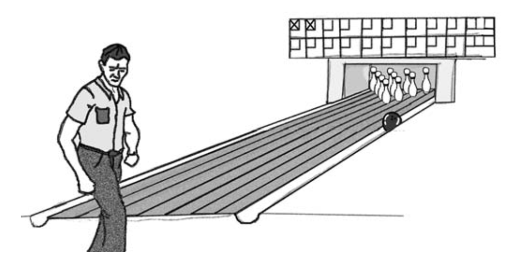
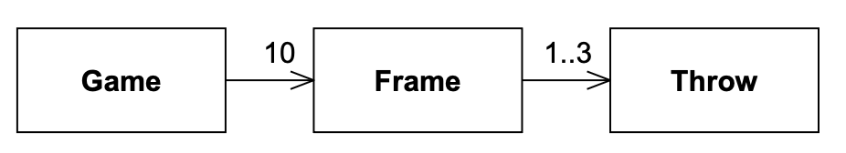
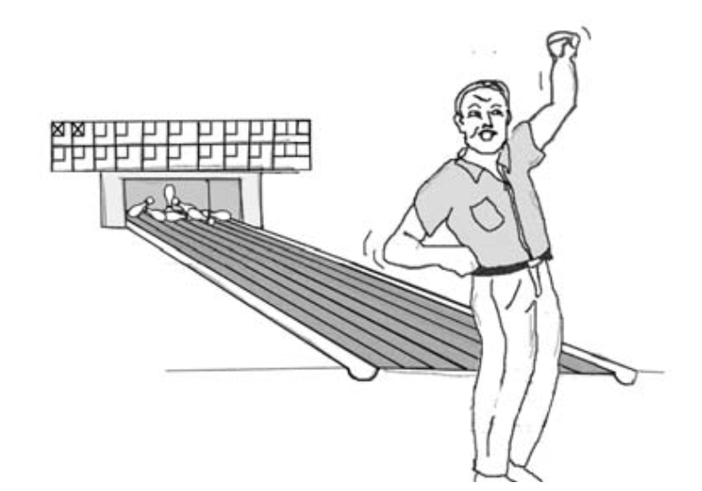
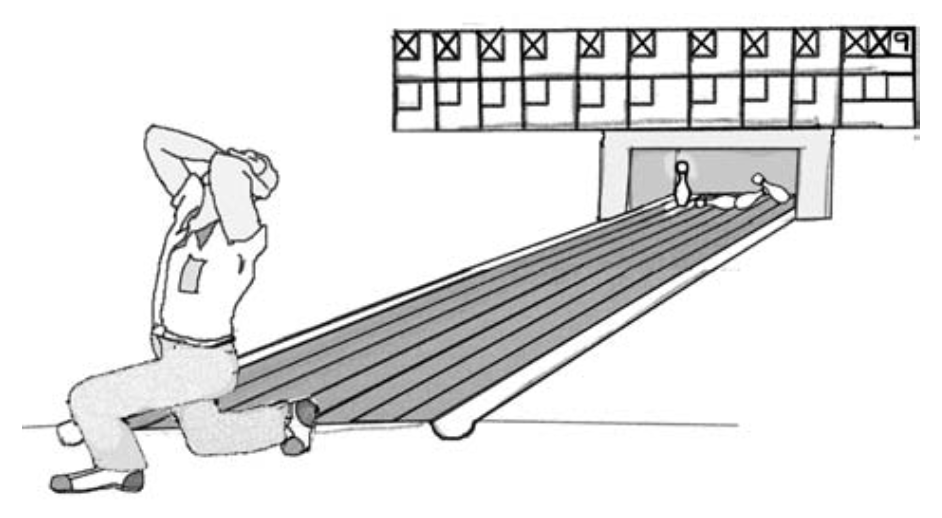

# 6 编程片段

<center></center><br/>

> 设计和编程是人类的活动；忘记这一点，一切尽失。
> <p align="right">——Bjarne Stroustrup, 1991</p>

为了展示 XP 的编程实践，Bob Koss (RSK) 和 Bob Martin (RCM) 将结对编写一个简单的应用程序，
而你则像墙上的苍蝇一样观看。
我们将使用测试驱动开发和大量的重构来创建我们的应用程序。
以下是对两位 Bob 在 2000 年末于某酒店房间实际进行的一次编程片段的相当忠实的再现。

在这样做的时候，我们犯了很多错误。
有些错误在代码中，有些在逻辑中，有些在设计上，还有一些在需求上。
在你阅读时，你将看到我们在所有这些领域中挣扎，识别并处理我们的错误和误解。
这个过程是混乱的 —— 就像所有人类过程一样。
结果……结果是，令人惊讶的是，这样一个混乱的过程竟然能产生秩序。

该程序计算一场保龄球比赛的分数，所以了解规则会有所帮助。
如果你不了解保龄球规则，请查看旁边的侧边栏。

## 保龄球游戏

RCM：你愿意帮我写一个计算保龄球分数的小应用程序吗？

RSK：（心里想：“结对编程的 XP 实践说，当被请求帮助时，我不能说 ‘不’。
我想当是你老板在请求时，这一点尤其正确。”）当然，Bob，我很乐意帮忙。

RCM：好的，太好了！我想做的是一个记录保龄球联赛的应用程序。
它需要记录所有比赛，确定球队排名，确定每场周赛的胜者和败者，并准确计算每场比赛的分数。

RSK：酷。我以前是一个相当不错的保龄球手。
这会很有趣。
你一口气说了几个用户故事，你想从哪一个开始？

RCM：让我们从计算单场比赛的分数开始。

RSK：好的。
这意味着什么？这个故事的输入和输出是什么？

RCM：在我看来，输入只是一系列的投球。
一个投球只是一个整数，表示球击倒的瓶数。
输出只是每格的分数。

RSK：我假设你在这个练习中扮演客户，那么你希望输入和输出采用什么形式？

RCM：是的，我是客户。
我们需要一个函数来调用以添加投球，以及另一个函数来获取分数。
类似于：

```java
throwBall(6);
throwBall(3);
assertEquals(9, getScore());
```

RSK：好的，我们需要一些测试数据。
让我画一张计分卡的草图（见 Fig 6-1 ）。

<br/>
*Fig 6-1 典型的保龄球计分卡*

RCM：那个家伙相当不稳定。

RSK：或者是喝醉了，但它可以作为一个不错的验收测试。

<br/>

RCM：我们还需要其他的测试数据，但稍后再处理。
我们应该如何开始？
我们要为系统做一个设计吗？

RSK：我不介意画一个 UML 图，展示从计分卡中可能看到的问题域概念。
这会给我们一些候选对象，我们可以在代码中进一步探索它们。

RCM：（戴上他强大的对象设计师帽子）好的，显然一个 `Game` 对象由十个 `Frame` 的序列组成。
每个`Frame`对象包含一次、两次或三次投球。

RSK：英雄所见略同。这正是我在想的。让我快速画出来（见 Fig 6-2 ）。

<br/>
*Fig 6-2 保龄球计分卡的UML图*

RSK：好吧，选一个类……随便哪个类。
我们从依赖链的末端开始，向后工作如何？
那样会使测试更容易。

RCM：当然，为什么不呢。
让我们为 `Throw` 类创建一个测试用例。

RSK：（开始打字）

```java
//TestThrow.java---------------------------------
import junit.framework.*;

public class TestThrow extends TestCase
{
    public TestThrow(String name)
    {
        super(name);
    }
    // public void test????
}
```

RSK：你知道 `Throw` 对象的行为应该是什么吗？

RCM：它保存玩家击倒的瓶数。

RSK：好的，你刚才说了，简而言之，它实际上什么也不做。
也许我们应该稍后再来处理它，专注于一个真正有行为的对象，而不是一个仅仅是数据存储的对象。

RCM：嗯。你的意思是 `Throw` 类可能实际上并不存在？

RSK：好吧，如果它没有任何行为，它能有多重要？
我还不知道它是否存在。
我只是觉得如果我们处理一个方法不仅仅是 setter 和 getter 的对象，会更有生产力。
但如果你想驱动……（把键盘滑向 RCM ）。

RCM：好吧，让我们沿着依赖链向上到 `Frame`，看看是否有我们可以编写的测试用例，迫使我们完成 `Throw`。（把键盘推回 RSK。）

RSK：（心里在想 RCM 是不是在引导我走一条死胡同来教育我，还是他真的同意我的看法。）
好的，新文件，新的测试用例。

```java
//TestFrame.java------------------------------------
import junit.framework.*;

public class TestFrame extends TestCase
{
    public TestFrame( String name )
    {
        super( name );
    }
    //public void test???
}
```

RCM：好的，这是我们第二次输入那段代码了。
现在，你能想到任何有趣的 `Frame` 测试用例吗？

RSK：一个 `Frame` 可能会提供它的分数、每次投球的瓶数，以及是否出现 strike 或 spare……

RCM：好的，让我看看代码。

RSK：（输入）

```java
//TestFrame.java---------------------------------
import junit.framework.*;

public class TestFrame extends TestCase
{
    public TestFrame( String name )
    {
        super( name );
    }

    public void testScoreNoThrows()
    {
        Frame f = new Frame();
        assertEquals( 0, f.getScore() );
    }
}
```

```java
//Frame.java---------------------------------------
public class Frame
{
    public int getScore()
    {
        return 0;
    }
}
```

RCM：好的，测试通过了，但 `getScore` 是一个非常愚蠢的函数。
如果我们向 `Frame` 添加一次投球，它就会失败。
所以让我们编写一个添加一些投球然后检查分数的测试用例。

```java
//TestFrame.java---------------------------------
public void testAddOneThrow()
{
    Frame f = new Frame();
    f.add(5);
    assertEquals(5, f.getScore());
}
```

RCM：这无法编译。`Frame` 中没有 `add` 方法。

RSK：我敢打赌，如果你定义这个方法，它就能编译了 ;-)

```java
//Frame.java---------------------------------------
public class Frame
{
    public int getScore()
    {
        return 0;
    }

    public void add(Throw t)
    {
    }
}
```

RCM：（自言自语）这无法编译，因为我们还没有写 `Throw` 类。

RSK：跟我聊聊，Bob。
测试传的是一个整数，而方法期望一个 `Throw` 对象。
你不能两者兼得。
在我们再次走 `Throw` 这条路之前，你能描述它的行为吗？

RCM：哇！我甚至没注意到我写了 `f.add(5)`。
我应该写 `f.add(new Throw(5))`，但那丑得要命。
我真正想写的是 `f.add(5)`。

RSK：不管丑不丑，让我们暂时把审美放在一边。
你能描述 `Throw` 对象的任何行为吗 —— 二进制回答，Bob？

RCM：101101011010100101。
我不知道 `Throw` 中是否有什么行为。
我开始认为 `Throw` 只是一个 `int`。
然而，我们现在不需要考虑这个问题，因为我们可以让 `Frame.add` 接受一个 `int`。

RSK：那么我认为我们应该这样做，仅因为它简单。
当我们感到痛苦时，我们可以做更复杂的事情。

RCM：同意。

```java
//Frame.java---------------------------------------
public class Frame
{
    public int getScore()
    {
        return 0;
    }

    public void add(int pins)
    {
    }
}
```

RCM：好的，这编译通过了，但测试失败。现在，让我们让测试通过。

```java
//Frame.java---------------------------------------
public class Frame
{
    public int getScore()
    {
        return itsScore;
    }

    public void add(int pins)
    {
        itsScore += pins;
    }

    private int itsScore = 0;
}
```

RCM：这编译通过，测试也通过了，但它明显过于简单了。下一个测试用例是什么？

RSK：我们能先休息一下吗？

------------------------------休息----------------------------

RCM：好多了。

RSK：`Frame.add` 是一个脆弱的函数。
如果你用 `11` 调用它怎么办？

RCM：如果发生这种情况，它可以抛出一个异常。
但是，谁会调用它？
这将是一个成千上万人使用的应用程序框架，我们必须防止这种情况，还是只由你一个人使用？
如果是后者，只要不要用 `11` 调用它就行了（轻笑）。

RSK：好观点，系统中其余的测试会捕获无效参数。
如果我们遇到麻烦，我们可以稍后再添加检查。

RCM：所以，`add` 函数目前不处理 strike 或 spare。
让我们编写一个测试用例来表达这一点。

RSK：嗯……如果我们调用 `add(10)` 来表示一个 strike，`getScore()` 应该返回什么？
我不知道如何写断言，所以也许我们在问错误的问题。或者我们在向错误的对象问正确的问题。

RCM：当你调用 `add(10)`，或调用 `add(3)` 后跟 `add(7)` 时，在 `Frame` 上调用 `getScore` 是毫无意义的。
`Frame` 必须查看后面的 `Frame` 实例来计算其分数。
如果那些后面的 `Frame` 实例不存在，那么它必须返回一些丑陋的东西，比如 `-1`。
我不想返回 `-1`。

RSK：是的，我也讨厌 `-1` 的想法。
你引入了 `Frame` 知道其他 `Frame` 的概念。
谁持有这些不同的 `Frame` 对象？

RCM：`Game` 对象。

RSK：所以 `Game` 依赖于 `Frame`；而 `Frame` 又反过来依赖于 `Game`。
我讨厌那样。

RCM：`Frame` 不必依赖于 `Game`，它们可以排列在一个链表中。
每个 `Frame` 可以持有指向前一个和下一个 `Frame` 的指针。
为了从 `Frame` 获取分数，`Frame` 可以向后查看前一个 `Frame` 的分数，并向前查看它需要的任何 spare 或 strike 的投球。

RSK：好吧，我感觉有点蠢，因为我无法想象这一点。
给我看一些代码。

RCM：对。所以我们需要先有一个测试用例。

RSK：针对 `Game` 还是另一个针对 `Frame` 的测试？

RCM：我认为我们需要一个针对 `Game` 的，因为 `Game` 会构建 `Frame` 并将它们相互连接起来。

RSK：你是想停止我们在 `Frame` 上的工作，做一个心理上的长跳转到 `Game`，还是只想有一个 `MockGame` 对象，只做我们需要让 `Frame` 工作的事情？

RCM：不，让我们停止 `Frame` 的工作，开始处理 `Game`。
`Game` 中的测试用例应该证明我们需要 `Frame` 的链表。

RSK：（输入）

```java
//TestGame.java------------------------------------------
import junit.framework.*;

public class TestGame extends TestCase
{
    public TestGame(String name)
    {
        super(name);
    }

    public void testOneThrow()
    {
        Game g = new Game();
        g.add(5);
        assertEquals(5, g.score());
    }
}
```

RCM：看起来合理吗？

RSK：当然，但我仍然在寻找这个 `Frame` 列表的证据。

RCM：我也是。
让我们继续遵循这些测试用例，看看它们会引向哪里。

```java
//Game.java----------------------------------
public class Game
{
    public int score()
    {
        return 0;
    }

    public void add(int pins)
    {
    }
}
```

RCM：好的，这编译通过了，但测试失败。现在让我们让它通过。

```java
//Game.java----------------------------------
public class Game
{
    public int score()
    {
        return itsScore;
    }

    public void add(int pins)
    {
        itsScore += pins;
    }

    private int itsScore = 0;
}
```

RCM：这通过了。好的。

RSK：我不能不同意，但我仍然在寻找这个需要 `Frame` 对象链表的伟大证据。
那才是我们最初转向 `Game` 的原因。

RCM：是的，这也是我在寻找的。
我完全期望一旦我们开始注入 spare 和 strike 的测试用例，我们就必须构建 `Frame` 并将它们连接在一个链表中。
但我不想在代码迫使我们之前就构建它。

RSK：好观点。
让我们在 `Game` 上以小步继续。
另一个测试怎么样：测试两次投球但没有 spare？

RCM：好的，那现在应该能通过。让我们试试。

```java
//TestGame.java------------------------------------------
public void testTwoThrowsNoMark()
{
    Game g = new Game();
    g.add(5);
    g.add(4);
    assertEquals(9, g.score());
}
```

RCM：是的，那个通过了。现在让我们试试没有标记 (mark) 的四次投球。

RSK：那也会通过的。
我没想到这个。我们可以继续添加投球，甚至根本不需要 `Frame`。但我们还没有处理 spare 或 strike。也许那才是我们必须构建一个的时候。

RCM：那正是我指望的。然而，考虑这个测试用例：

```java
//TestGame.java------------------------------------------
public void testFourThrowsNoMark()
{
    Game g = new Game();
    g.add(5);
    g.add(4);
    g.add(7);
    g.add(2);
    assertEquals(18, g.score());
    assertEquals(9, g.scoreForFrame(1));
    assertEquals(18, g.scoreForFrame(2));
}
```

RCM：这看起来合理吗？

RSK：当然合理。
我忘了我们还必须能够显示每格的分数。
啊，我们的计分卡草图刚才被用作我的健怡可乐杯垫。
是的，这就是我忘记的原因。

RCM：（叹气）好的，首先让我们通过在 `Game` 中添加 `scoreForFrame` 方法使这个测试用例失败。

```java
//Game.java----------------------------------
public int scoreForFrame(int frame)
{
    return 0;
}
```

RCM：好的，这编译通过并失败了。现在，我们如何让它通过？

RSK：我们可以开始创建 `Frame` 对象，但这是让测试通过的最简单方法吗？

RCM：不，实际上，我们可以只在 `Game` 中创建一个整数数组。
每次调用 `add` 都会将一个新的整数追加到数组上。
每次调用 `scoreForFrame` 只需向前遍历数组并计算分数。

```java
//Game.java----------------------------------
public class Game
{
    public int score()
    {
        return itsScore;
    }

    public void add(int pins)
    {
        itsThrows[itsCurrentThrow++] = pins;
        itsScore += pins;
    }

    public int scoreForFrame(int frame)
    {
        int score = 0;
        for ( int ball = 0;
              frame > 0 && (ball < itsCurrentThrow);
              ball+=2, frame--)
        {
            score += itsThrows[ball] + itsThrows[ball+1];
        }
        return score;
    }

    private int itsScore = 0;
    private int[] itsThrows = new int[21];
    private int itsCurrentThrow = 0;
}
```

RCM：（对自己非常满意）好了，这能工作。

RSK：为什么是魔法数字 21？

RCM：那是一场比赛中可能的最大投球次数。

RSK：哎呀。
让我猜猜，在你年轻时是一个 Unix 黑客，并以能用一条没人能破译的语句编写整个应用程序而自豪？

RCM：`scoreForFrame()` 需要重构以更具可读性。
但在我们考虑重构之前，让我问另一个问题。
`Game` 是这个方法的最佳位置吗？
在我看来，`Game` 违反了单一职责原则。¹ 
它接受投球，并且它知道如何为每格计分。
你觉得一个 `Scorer` 对象怎么样？

¹ 参见 [第 95 页](../ch8/0.md) 的 “SRP：单一职责原则”。

RCM：（做了一个粗鲁的摇摆手势）我不知道这些函数现在应该住在哪里；
现在我感兴趣的是让计分功能工作起来。
一旦我们全部把它弄到位，然后我们可以争论 SRP 的价值。

然而，我明白你关于 Unix 黑客风格的观点；让我们试着简化那个循环。

```java
public int scoreForFrame(int theFrame)
{
    int ball = 0;
    int score=0;
    for (int currentFrame = 0;
         currentFrame < theFrame;
         currentFrame++)
    {
        score += itsThrows[ball++] + itsThrows[ball++];
    }
    return score;
}
```

RCM：那好了一点，但 `score +=` 表达式中有副作用。
它们在这里不重要，因为两个加数表达式的求值顺序无关紧要。
（或者真的无关紧要？是否有可能在任一数组操作之前完成两个自增？）

RSK：我想我们可以做一个实验来验证是否有任何副作用，但那个函数对于 spare 和 strike 是行不通的。
我们应该继续尝试让它更具可读性，还是应该进一步推进它的功能？

RCM：实验可能只对某些编译器有意义。
其他编译器可能使用不同的求值顺序。
我不知道这是否是一个问题，但让我们消除潜在的顺序依赖性，然后继续推进更多的测试用例。

```java
public int scoreForFrame(int theFrame)
{
    int ball = 0;
    int score=0;
    for (int currentFrame = 0;
         currentFrame < theFrame;
         currentFrame++)
    {
        int firstThrow = itsThrows[ball++];
        int secondThrow = itsThrows[ball++];
        score += firstThrow + secondThrow;
    }
    return score;
}
```

RCM：好的，下一个测试用例。
让我们尝试一个 spare。

RCM：我厌倦了写这个。
让我们重构测试，把游戏的创建放在 `setUp` 函数中。

```java
//TestGame.java------------------------------------------
import junit.framework.*;

public class TestGame extends TestCase
{
    public TestGame(String name)
    {
        super(name);
    }

    private Game g;

    public void setUp()
    {
        g = new Game();
    }

    public void testOneThrow()
    {
        g.add(5);
        assertEquals(5, g.score());
    }

    public void testTwoThrowsNoMark()
    {
        g.add(5);
        g.add(4);
        assertEquals(9, g.score());
    }

    public void testFourThrowsNoMark()
    {
        g.add(5);
        g.add(4);
        g.add(7);
        g.add(2);
        assertEquals(18, g.score());
        assertEquals(9, g.scoreForFrame(1));
        assertEquals(18, g.scoreForFrame(2));
    }

    public void testSimpleSpare()
    {
        // 待实现
    }
}
```

RCM：这样好多了，现在让我们编写 spare 测试用例。

```java
public void testSimpleSpare()
{
    g.add(3);
    g.add(7);
    g.add(3);
    assertEquals(13, g.scoreForFrame(1));
}
```

RCM：我来驱动。

RSK：好的，那个测试用例失败了。
现在我们需要让它通过。

```java
public int scoreForFrame(int theFrame)
{
    int ball = 0;
    int score=0;
    for (int currentFrame = 0;
         currentFrame < theFrame;
         currentFrame++)
    {
        int firstThrow = itsThrows[ball++];
        int secondThrow = itsThrows[ball++];
        int frameScore = firstThrow + secondThrow;
        // spare 需要下一格的第一次投球
        if ( frameScore == 10 )
            score += frameScore + itsThrows[ball++];
        else
            score += frameScore;
    }
    return score;
}
```

RSK：Yee-HA！这有效！

RCM：（抓住键盘）好的，但我认为 `frameScore == 10` 情况中的 `ball` 自增不应该在那里。
这里有一个测试用例证明我的观点。

```java
public void testSimpleFrameAfterSpare()
{
    g.add(3);
    g.add(7);
    g.add(3);
    g.add(2);
    assertEquals(13, g.scoreForFrame(1));
    assertEquals(18, g.score());
}
```

RCM：哈！看，这失败了。现在如果我们去掉那个讨厌的多余自增……

```java
if ( frameScore == 10 )
    score += frameScore + itsThrows[ball];
```

<br/>

RCM：呃……它还是失败……会不会是 `score` 方法错了？
我通过修改测试用例使用 `scoreForFrame(2)` 来测试一下。

```java
public void testSimpleFrameAfterSpare()
{
    g.add(3);
    g.add(7);
    g.add(3);
    g.add(2);
    assertEquals(13, g.scoreForFrame(1));
    assertEquals(18, g.scoreForFrame(2));
}
```

RCM：嗯……那个通过了。
`score` 方法一定是有问题的。
让我们看看它。

```java
public int score()
{
    return itsScore;
}

public void add(int pins)
{
    itsThrows[itsCurrentThrow++] = pins;
    itsScore += pins;
}
```

RCM：是的，那是错的。
`score` 方法只是返回了所有瓶数的总和，而不是正确的分数。
我们需要 `score` 做的是用当前帧调用 `scoreForFrame()`。

RSK：我们不知道当前帧是什么。
让我们把这个消息添加到我们目前的每个测试中，当然，一次一个。

RCM：好。

```java
//TestGame.java------------------------------------------
public void testOneThrow()
{
    g.add(5);
    assertEquals(5, g.score());
    assertEquals(1, g.getCurrentFrame());
}
```

```java
//Game.java----------------------------------
public int getCurrentFrame()
{
    return 1;
}
```

RCM：好的，那能工作。但它很愚蠢。让我们做下一个测试用例。

```java
public void testTwoThrowsNoMark()
{
    g.add(5);
    g.add(4);
    assertEquals(9, g.score());
    assertEquals(1, g.getCurrentFrame());
}
```

RCM：那个没什么意思，让我们试试下一个。

```java
public void testFourThrowsNoMark()
{
    g.add(5);
    g.add(4);
    g.add(7);
    g.add(2);
    assertEquals(18, g.score());
    assertEquals(9, g.scoreForFrame(1));
    assertEquals(18, g.scoreForFrame(2));
    assertEquals(2, g.getCurrentFrame());
}
```

RCM：这个失败了。现在让我们让它通过。

RSK：我认为算法很简单。
只需将投球数除以二，因为每格有两次投球。
除非我们有 strike……但我们还没有 strike，所以这里也忽略它们。

RCM：（胡乱地加一减一直到它工作）²

² Dave Thomas 和 Andy Hunt 称此为 “巧合编程”。

```java
public int getCurrentFrame()
{
    return 1 + (itsCurrentThrow-1)/2;
}
```

RCM：这不太令人满意。

RSK：如果我们不每次都计算呢？
如果我们每次投球后调整一个 `currentFrame` 成员变量呢？

RCM：好的，让我们试试。

```java
//Game.java----------------------------------
public int getCurrentFrame()
{
    return itsCurrentFrame;
}

public void add(int pins)
{
    itsThrows[itsCurrentThrow++] = pins;
    itsScore += pins;
    if (firstThrow == true)
    {
        firstThrow = false;
        itsCurrentFrame++;
    }
    else
    {
        firstThrow = true;
    }
}

private int itsCurrentFrame = 0;
private boolean firstThrow = true;
```

RCM：好的，这能工作。
但它也意味着当前帧是最后一次投球所在的帧，而不是下一次投球将要进入的帧。
只要我们记住这一点，就没问题。

RSK：我没有那么好的记忆力，所以让我们让它更具可读性。
但在我们进一步摆弄它之前，让我们把那段代码从 `add()` 中提取出来，放到一个名为 `adjustCurrentFrame()` 或类似名称的私有成员函数中。

RCM：好的，听起来不错。

```java
public void add(int pins)
{
    itsThrows[itsCurrentThrow++] = pins;
    itsScore += pins;
    adjustCurrentFrame();
}

private void adjustCurrentFrame()
{
    if (firstThrow == true)
    {
        firstThrow = false;
        itsCurrentFrame++;
    }
    else
    {
        firstThrow = true;
    }
}
```

RCM：现在让我们改变变量和函数名称，使其更清晰。
我们应该把 `itsCurrentFrame` 叫什么？

RSK：我有点喜欢那个名字。
不过我认为我们没有在正确的地方增加它。
在我看来，当前帧是我正在投球的帧号。
所以它应该在一帧中的最后一次投球之后立即增加。

RCM：我同意。
让我们修改测试用例以反映这一点，然后我们修复 `adjustCurrentFrame`。

```java
//TestGame.java------------------------------------------
public void testTwoThrowsNoMark()
{
    g.add(5);
    g.add(4);
    assertEquals(9, g.score());
    assertEquals(2, g.getCurrentFrame());
}

public void testFourThrowsNoMark()
{
    g.add(5);
    g.add(4);
    g.add(7);
    g.add(2);
    assertEquals(18, g.score());
    assertEquals(9, g.scoreForFrame(1));
    assertEquals(18, g.scoreForFrame(2));
    assertEquals(3, g.getCurrentFrame());
}
```

```java
//Game.java------------------------------------------
private void adjustCurrentFrame()
{
    if (firstThrow == true)
    {
        firstThrow = false;
    }
    else
    {
        firstThrow = true;
        itsCurrentFrame++;
    }
}

private int itsCurrentFrame = 1;
```

RCM：好的，那能工作。现在让我们在两个 spare 用例中测试 `getCurrentFrame`。

```java
public void testSimpleSpare()
{
    g.add(3);
    g.add(7);
    g.add(3);
    assertEquals(13, g.scoreForFrame(1));
    assertEquals(2, g.getCurrentFrame());
}

public void testSimpleFrameAfterSpare()
{
    g.add(3);
    g.add(7);
    g.add(3);
    g.add(2);
    assertEquals(13, g.scoreForFrame(1));
    assertEquals(18, g.scoreForFrame(2));
    assertEquals(3, g.getCurrentFrame());
}
```

RCM：这能工作。
现在，回到原始问题。
我们需要 `score` 能工作。
我们现在可以编写 `score` 来调用 `scoreForFrame(getCurrentFrame()-1)`。

```java
public void testSimpleFrameAfterSpare()
{
    g.add(3);
    g.add(7);
    g.add(3);
    g.add(2);
    assertEquals(13, g.scoreForFrame(1));
    assertEquals(18, g.scoreForFrame(2));
    assertEquals(18, g.score());
    assertEquals(3, g.getCurrentFrame());
}
```

```java
//Game.java----------------------------------
public int score()
{
    return scoreForFrame(getCurrentFrame()-1);
}
```

RCM：这导致 `testOneThrow` 测试用例失败。让我们看看它。

```java
public void testOneThrow()
{
    g.add(5);
    assertEquals(5, g.score());
    assertEquals(1, g.getCurrentFrame());
}
```

只有一次投球时，第一帧是不完整的。
`score` 方法调用了 `scoreForFrame(0)`。这很糟糕。

RSK：也许吧，也许不是。
我们为谁编写这个程序，谁会调用 `score()`？
假设它不会在不完整的帧上被调用，是否合理？

RCM：是的，但这让我很困扰。
为了解决这个问题，我们必须从 `testOneThrow` 测试用例中移除 `score`。
这是我们想做的吗？

RSK：我们可以。
我们甚至可以完全删除 `testOneThrow` 测试用例。
它被用来让我们逐步达到感兴趣的测试用例。
现在它还有用吗？
我们在所有其他测试用例中仍然有覆盖。

RCM：是的，我明白你的意思。
好的，删掉它。
（编辑代码，运行测试，得到绿色条）啊，这样好多了。

现在，我们最好处理 strike 测试用例。
毕竟，我们想看到所有那些 `Frame` 对象被构建成一个链表，不是吗？（窃笑）

<br/>

```java
public void testSimpleStrike()
{
    g.add(10);
    g.add(3);
    g.add(6);
    assertEquals(19, g.scoreForFrame(1));
    assertEquals(28, g.score());
    assertEquals(3, g.getCurrentFrame());
}
```

RCM：好的，这编译通过并按预期失败。
现在我们需要让它通过。

```java
//Game.java----------------------------------
public class Game
{
    public void add(int pins)
    {
        itsThrows[itsCurrentThrow++] = pins;
        itsScore += pins;
        adjustCurrentFrame(pins);
    }

    private void adjustCurrentFrame(int pins)
    {
        if (firstThrow == true)
        {
            if (pins == 10) // strike
                itsCurrentFrame++;
            else
                firstThrow = false;
        }
        else
        {
            firstThrow = true;
            itsCurrentFrame++;
        }
    }

    public int scoreForFrame(int theFrame)
    {
        int ball = 0;
        int score = 0;
        for (int currentFrame = 0;
             currentFrame < theFrame;
             currentFrame++)
        {
            int firstThrow = itsThrows[ball++];
            if (firstThrow == 10)
            {
                score += 10 + itsThrows[ball] + itsThrows[ball + 1];
            }
            else
            {
                int secondThrow = itsThrows[ball++];
                int frameScore = firstThrow + secondThrow;
                // spare needs next frames first throw
                if (frameScore == 10)
                    score += frameScore + itsThrows[ball];
                else
                    score += frameScore;
            }
        }
        return score;
    }

    private int itsScore = 0;
    private int[] itsThrows = new int[21];
    private int itsCurrentThrow = 0;
    private int itsCurrentFrame = 1;
    private boolean firstThrow = true;
}
```

RCM：好的，那并不太难。让我们看看它能否计算一场完美比赛。

<br/>

```java
public void testPerfectGame()
{
    for (int i=0; i<12; i++)
    {
        g.add(10);
    }
    assertEquals(300, g.score());
    assertEquals(10, g.getCurrentFrame());
}
```

RCM：呃，它说分数是 330。为什么会这样？

RSK：因为当前帧一直递增到了 12。

RCM：哦！我们需要把它限制在 10。

```java
private void adjustCurrentFrame(int pins)
{
    if (firstThrow == true)
    {
        if (pins == 10) // strike
            itsCurrentFrame++;
        else
            firstThrow = false;
    }
    else
    {
        firstThrow = true;
        itsCurrentFrame++;
    }
    itsCurrentFrame = Math.min(10, itsCurrentFrame);
}
```

RCM：该死，现在它说分数是 270。发生了什么？

RSK：Bob，`score` 函数从 `getCurrentFrame` 中减去了 1，所以它给你的是第 9 帧的分数，而不是第 10 帧。

RCM：什么？你的意思是说我应该把当前帧限制在 11 而不是 10？
我来试试。

```java
itsCurrentFrame = Math.min(11, itsCurrentFrame);
```

RCM：好的，现在它得到了正确的分数，但失败了，因为当前帧是 11 而不是 10。
哎呀！这个当前帧的事情真让人头疼。
我们希望当前帧是玩家正在投球的帧，但在游戏结束时那意味着什么？

RSK：也许我们应该回到当前帧是最后一次投球所在帧的想法。

RCM：或者也许我们需要提出一个 “最后完成的帧” 的概念？
毕竟，在任何时间点的游戏分数就是最后完成的帧的分数。

RSK：一个完成的帧是一个你可以写入分数的帧，对吗？

RCM：是的，一个有 spare 的帧在下一球后完成。
一个有 strike 的帧在接下来的两球后完成。
没有标记的帧在帧的第二球后完成。

RSK：等等……我们正在努力让 `score()` 方法工作，对吗？
我们只需要强制 `score()` 在游戏完成时调用 `scoreForFrame(10)`。

RCM：我们怎么知道游戏是否完成？

RSK：如果 `adjustCurrentFrame` 曾经试图将 `itsCurrentFrame` 递增超过第 10 帧，那么游戏就完成了。

RCM：等等。
你所说的是，如果 `getCurrentFrame` 返回 11，游戏就完成了。
这就是代码现在的工作方式！

RSK：嗯。你的意思是我们应该修改测试用例以匹配代码？

```java
public void testPerfectGame()
{
    for (int i=0; i<12; i++)
    {
        g.add(10);
    }
    assertEquals(300, g.score());
    assertEquals(11, g.getCurrentFrame());
}
```

RCM：好吧，这能工作。我想这并不比 `getMonth` 对一月返回 0 更糟糕。但我仍然对此感到不安。

RSK：也许稍后我们会想到什么。现在，我想我看到了一个 bug。我可以吗？（抓住键盘）

```java
public void testEndOfArray()
{
    for (int i=0; i<9; i++)
    {
        g.add(0);
        g.add(0);
    }
    g.add(2);
    g.add(8); // 第10帧 spare
    g.add(10); // 数组最后位置上的 strike
    assertEquals(20, g.score());
}
```

RCM：嗯，没有失败。我以为既然数组的第 21 个位置是一个 strike，计分器会尝试将第 22 和 23 个位置加到分数中。
但我猜不会。

RSK：嗯，你还在想着那个计分器对象，是吧。
无论如何，我明白你想说什么，但既然 `score` 永远不会用大于 10 的数字调用 `scoreForFrame`，最后一个 strike 实际上不会被算作 strike。
它只是被算作一个 10 来完成最后一个 spare。
我们永远不会超出数组的末尾。

RCM：好的，让我们把我们原来的计分卡输入到程序中。

```java
public void testSampleGame()
{
    g.add(1);
    g.add(4);
    g.add(4);
    g.add(5);
    g.add(6);
    g.add(4);
    g.add(5);
    g.add(5);
    g.add(10);
    g.add(0);
    g.add(1);
    g.add(7);
    g.add(3);
    g.add(6);
    g.add(4);
    g.add(10);
    g.add(2);
    g.add(8);
    g.add(6);
    assertEquals(133, g.score());
}
```

RSK：好吧，这能工作。你还能想到其他测试用例吗？

RCM：是的，让我们测试更多的边界条件 —— 比如那个可怜的倒霉蛋投了 11 个 strike 然后最后投了 9 个？

<br/>

```java
public void testHeartBreak()
{
    for (int i=0; i<11; i++)
        g.add(10);
    g.add(9);
    assertEquals(299, g.score());
}
```

RCM：这能工作。好的，第 10 帧的 spare 怎么样？

```java
public void testTenthFrameSpare()
{
    for (int i=0; i<9; i++)
        g.add(10);
    g.add(9);
    g.add(1);
    g.add(1);
    assertEquals(270, g.score());
}
```

RCM：（高兴地盯着绿色条）这也能工作。我想不出更多了，你能吗？

RSK：不，我想我们已经覆盖了所有。此外，我真的想重构这一团乱。我仍然在某个地方看到那个 scorer 对象。

RCM：好的，那么，`scoreForFrame` 函数相当混乱。让我们看看它。

```java
public int scoreForFrame(int theFrame)
{
    int ball = 0;
    int score = 0;
    for (int currentFrame = 0;
         currentFrame < theFrame;
         currentFrame++)
    {
        int firstThrow = itsThrows[ball++];
        if (firstThrow == 10)
        {
            score += 10 + itsThrows[ball] + itsThrows[ball + 1];
        }
        else
        {
            int secondThrow = itsThrows[ball++];
            int frameScore = firstThrow + secondThrow;
            // spare needs next frames first throw
            if (frameScore == 10)
                score += frameScore + itsThrows[ball];
            else
                score += frameScore;
        }
    }
    return score;
}
```

RCM：我真的很想把那个 `else` 子句的主体提取到一个名为 `handleSecondThrow` 的单独函数中，
但我不能，因为它使用了 `ball`、`firstThrow` 和 `secondThrow` 局部变量。

RSK：我们可以把这些局部变量变成成员变量。

RCM：是的，这有点强化了你的观点，即我们能够把计分逻辑提取到它自己的 scorer 对象中。
好的，让我们试试看。

RSK：（抓住键盘）

```java
private void adjustCurrentFrame(int pins)
{
    if (firstThrowInFrame == true)
    {
        if (pins == 10) // strike
            itsCurrentFrame++;
        else
            firstThrowInFrame = false;
    }
    else
    {
        firstThrowInFrame = true;
        itsCurrentFrame++;
    }
    itsCurrentFrame = Math.min(11, itsCurrentFrame);
}

public int scoreForFrame(int theFrame)
{
    ball = 0;
    int score = 0;
    for (int currentFrame = 0;
         currentFrame < theFrame;
         currentFrame++)
    {
        firstThrow = itsThrows[ball++];
        if (firstThrow == 10)
        {
            score += 10 + itsThrows[ball] + itsThrows[ball + 1];
        }
        else
        {
            secondThrow = itsThrows[ball++];
            int frameScore = firstThrow + secondThrow;
            // spare needs next frames first throw
            if (frameScore == 10)
                score += frameScore + itsThrows[ball];
            else
                score += frameScore;
        }
    }
    return score;
}

private int ball;
private int firstThrow;
private int secondThrow;
private int itsScore = 0;
private int[] itsThrows = new int[21];
private int itsCurrentThrow = 0;
private int itsCurrentFrame = 1;
private boolean firstThrowInFrame = true;
```

RSK：我没想到会有名称冲突。
我们已经有一个名为 `firstThrow` 的实例变量了。
但 `firstThrowInFrame` 是更好的命名。
总之，现在这能工作。
所以我们可以把 `else` 子句提取到它自己的函数中。

```java
public int scoreForFrame(int theFrame)
{
    ball = 0;
    int score = 0;
    for (int currentFrame = 0;
         currentFrame < theFrame;
         currentFrame++)
    {
        firstThrow = itsThrows[ball++];
        if (firstThrow == 10)
        {
            score += 10 + itsThrows[ball] + itsThrows[ball + 1];
        }
        else
        {
            score += handleSecondThrow();
        }
    }
    return score;
}

private int handleSecondThrow()
{
    int score = 0;
    secondThrow = itsThrows[ball++];
    int frameScore = firstThrow + secondThrow;
    // spare needs next frames first throw
    if (frameScore == 10)
        score += frameScore + itsThrows[ball];
    else
        score += frameScore;
    return score;
}
```

RCM：看看 `scoreForFrame` 的结构！用伪代码表示，它看起来像这样：

```
if strike
    score += 10 + nextTwoBalls();
else
    handleSecondThrow。
```

如果我们改成这样呢：

```
if strike
    score += 10 + nextTwoBalls();
else if spare
    score += 10 + nextBall();
else
    score += twoBallsInFrame()
```

天哪！这基本上就是保龄球计分的规则，不是吗？
好的，让我们看看能否在真正的函数中得到那种结构。
首先，让我们改变 `ball` 变量递增的方式，以便三种情况可以独立地操作它。

```java
public int scoreForFrame(int theFrame)
{
    ball = 0;
    int score = 0;
    for (int currentFrame = 0;
         currentFrame < theFrame;
         currentFrame++)
    {
        firstThrow = itsThrows[ball];
        if (firstThrow == 10)
        {
            ball++;
            score += 10 + itsThrows[ball] + itsThrows[ball + 1];
        }
        else
        {
            score += handleSecondThrow();
        }
    }
    return score;
}

private int handleSecondThrow()
{
    int score = 0;
    secondThrow = itsThrows[ball + 1];
    int frameScore = firstThrow + secondThrow;
    // spare needs next frames first throw
    if (frameScore == 10)
    {
        ball += 2;
        score += frameScore + itsThrows[ball];
    }
    else
    {
        ball += 2;
        score += frameScore;
    }
    return score;
}
```

RCM：（抓住键盘）好的，现在让我们去掉 `firstThrow` 和 `secondThrow` 变量，用适当的函数替换它们。

```java
public int scoreForFrame(int theFrame)
{
    ball = 0;
    int score = 0;
    for (int currentFrame = 0;
         currentFrame < theFrame;
         currentFrame++)
    {
        firstThrow = itsThrows[ball];
        if (strike())
        {
            ball++;
            score += 10 + nextTwoBalls();
        }
        else
        {
            score += handleSecondThrow();
        }
    }
    return score;
}

private boolean strike()
{
    return itsThrows[ball] == 10;
}

private int nextTwoBalls()
{
    return itsThrows[ball] + itsThrows[ball + 1];
}
```

RCM：这一步能工作，让我们继续。

```java
private int handleSecondThrow()
{
    int score = 0;
    secondThrow = itsThrows[ball + 1];
    int frameScore = firstThrow + secondThrow;
    // spare needs next frames first throw
    if (spare())
    {
        ball += 2;
        score += 10 + nextBall();
    }
    else
    {
        ball += 2;
        score += frameScore;
    }
    return score;
}

private boolean spare()
{
    return (itsThrows[ball] + itsThrows[ball + 1]) == 10;
}

private int nextBall()
{
    return itsThrows[ball];
}
```

RCM：好的，那也能工作。现在让我们处理 `frameScore`。

```java
private int handleSecondThrow()
{
    int score = 0;
    secondThrow = itsThrows[ball + 1];
    int frameScore = firstThrow + secondThrow;
    // spare needs next frames first throw
    if (spare())
    {
        ball += 2;
        score += 10 + nextBall();
    }
    else
    {
        score += twoBallsInFrame();
        ball += 2;
    }
    return score;
}

private int twoBallsInFrame()
{
    return itsThrows[ball] + itsThrows[ball + 1];
}
```

RSK：Bob，你没有以一致的方式递增 `ball`。
在 spare 和 strike 的情况下，你在计算分数之前递增。
在 `twoBallsInFrame` 的情况下，你在计算分数之后递增。
而且代码依赖于这个顺序！怎么回事？

RCM：抱歉，我应该解释一下。
我计划把递增移到 `strike`、`spare` 和 `twoBallsInFrame` 中。
这样，它们会从 `scoreForFrame` 函数中消失，该函数看起来就会像我们的伪代码一样。

RSK：好吧，我再信任你几步，但记住，我在看着。

RCM：好的，现在既然没有人再使用 `firstThrow`、`secondThrow` 和 `frameScore` 了，我们可以去掉它们。

```java
public int scoreForFrame(int theFrame)
{
    ball = 0;
    int score = 0;
    for (int currentFrame = 0;
         currentFrame < theFrame;
         currentFrame++)
    {
        if (strike())
        {
            ball++;
            score += 10 + nextTwoBalls();
        }
        else
        {
            score += handleSecondThrow();
        }
    }
    return score;
}

private int handleSecondThrow()
{
    int score = 0;
    // spare needs next frames first throw
    if (spare())
    {
        ball += 2;
        score += 10 + nextBall();
    }
    else
    {
        score += twoBallsInFrame();
        ball += 2;
    }
    return score;
}
```

（他眼中的火花是绿色条的倒影。）现在，既然唯一耦合三种情况的变量是 `ball`，而且 `ball` 在每种情况下都是独立处理的，我们可以将三种情况合并在一起。

```java
public int scoreForFrame(int theFrame)
{
    ball = 0;
    int score = 0;
    for (int currentFrame = 0;
         currentFrame < theFrame;
         currentFrame++)
    {
        if (strike())
        {
            ball++;
            score += 10 + nextTwoBalls();
        }
        else if (spare())
        {
            ball += 2;
            score += 10 + nextBall();
        }
        else
        {
            score += twoBallsInFrame();
            ball += 2;
        }
    }
    return score;
}
```

RCM：好的，现在我们可以使递增一致，并重命名函数以使其更明确。（抓住键盘）

```java
public int scoreForFrame(int theFrame)
{
    ball = 0;
    int score = 0;
    for (int currentFrame = 0;
         currentFrame < theFrame;
         currentFrame++)
    {
        if (strike())
        {
            score += 10 + nextTwoBallsForStrike();
            ball++;
        }
        else if (spare())
        {
            score += 10 + nextBallForSpare();
            ball += 2;
        }
        else
        {
            score += twoBallsInFrame();
            ball += 2;
        }
    }
    return score;
}

private int nextBallForSpare()
{
    return itsThrows[ball + 2];
}

private int nextTwoBallsForStrike()
{
    return itsThrows[ball + 1] + itsThrows[ball + 2];
}
```

RCM：看看那个 `scoreForFrame` 函数！这几乎是以最简洁的方式陈述了保龄球的规则。

RSK：但是，Bob，Frame 对象的链表怎么了？（窃笑，窃笑）

RCM：（叹气）我们被图表式过度设计的恶魔所困扰。
天哪，在餐巾纸背面画的三个小盒子 ——Game、Frame 和 Throw—— 还是太复杂了，而且完全错了。

RSK：我们从 `Throw` 类开始就犯了个错误。
我们应该从 `Game` 类开始！

RCM：确实！所以，下次让我们尝试从最高层开始，向下工作。

RSK：（倒吸一口气）自顶向下设计！？！？！？

RCM：更正，自顶向下、测试优先的设计。
坦白说，我不知道这是不是一个好规则。
这只是在这种情况下对我们有帮助的方法。
所以下次，我要试试看会发生什么。

RSK：好的，好吧。
无论如何，我们还有一些重构要做。
`ball` 变量只是 `scoreForFrame` 及其辅助函数的私有迭代器。
它们都应该被移到一个不同的对象中。

RCM：哦，是的，你的 Scorer 对象。
你毕竟是对的。让我们来做。

RSK：（抓住键盘，通过几个小步骤，穿插测试，创建了……）

```java
//Game.java----------------------------------
public class Game
{
    public int score()
    {
        return scoreForFrame(getCurrentFrame() - 1);
    }

    public int getCurrentFrame()
    {
        return itsCurrentFrame;
    }

    public void add(int pins)
    {
        itsScorer.addThrow(pins);
        itsScore += pins;
        adjustCurrentFrame(pins);
    }

    private void adjustCurrentFrame(int pins)
    {
        if (firstThrowInFrame == true)
        {
            if (pins == 10) // strike
                itsCurrentFrame++;
            else
                firstThrowInFrame = false;
        }
        else
        {
            firstThrowInFrame = true;
            itsCurrentFrame++;
        }
        itsCurrentFrame = Math.min(11, itsCurrentFrame);
    }

    public int scoreForFrame(int theFrame)
    {
        return itsScorer.scoreForFrame(theFrame);
    }

    private int itsScore = 0;
    private int itsCurrentFrame = 1;
    private boolean firstThrowInFrame = true;
    private Scorer itsScorer = new Scorer();
}
```

```java
//Scorer.java-----------------------------------
public class Scorer
{
    public void addThrow(int pins)
    {
        itsThrows[itsCurrentThrow++] = pins;
    }

    public int scoreForFrame(int theFrame)
    {
        ball = 0;
        int score = 0;
        for (int currentFrame = 0;
             currentFrame < theFrame;
             currentFrame++)
        {
            if (strike())
            {
                score += 10 + nextTwoBallsForStrike();
                ball++;
            }
            else if (spare())
            {
                score += 10 + nextBallForSpare();
                ball += 2;
            }
            else
            {
                score += twoBallsInFrame();
                ball += 2;
            }
        }
        return score;
    }

    private boolean strike()
    {
        return itsThrows[ball] == 10;
    }

    private boolean spare()
    {
        return (itsThrows[ball] + itsThrows[ball + 1]) == 10;
    }

    private int nextTwoBallsForStrike()
    {
        return itsThrows[ball + 1] + itsThrows[ball + 2];
    }

    private int nextBallForSpare()
    {
        return itsThrows[ball + 2];
    }

    private int twoBallsInFrame()
    {
        return itsThrows[ball] + itsThrows[ball + 1];
    }

    private int ball;
    private int[] itsThrows = new int[21];
    private int itsCurrentThrow = 0;
}
```

RSK：好多了。现在，`Game` 只负责跟踪帧，而 `Scorer` 只负责计算分数。单一职责原则真厉害！

RCM：随便吧。但它确实更好了。你注意到 `itsScore` 变量不再使用了吗？

RSK：哈！你说得对。让我们干掉它。（开心地开始删除东西）

```java
public void add(int pins)
{
    itsScorer.addThrow(pins);
    adjustCurrentFrame(pins);
}
```

RCM：不错。现在，我们应该清理 `adjustCurrentFrame` 的东西吗？

RSK：好的，让我们看看它。

```java
private void adjustCurrentFrame(int pins)
{
    if (firstThrowInFrame == true)
    {
        if (pins == 10) // strike
            itsCurrentFrame++;
        else
            firstThrowInFrame = false;
    }
    else
    {
        firstThrowInFrame = true;
        itsCurrentFrame++;
    }
    itsCurrentFrame = Math.min(11, itsCurrentFrame);
}
```

RCM：好的，首先让我们把递增提取到一个单独的函数中，该函数也将帧限制为 11。（呃……我还是不喜欢那个 11。）

RSK：Bob，11 意味着游戏结束。

RCM：是的。呃……（抓住键盘，做了几个更改，穿插测试）

```java
private void adjustCurrentFrame(int pins)
{
    if (firstThrowInFrame == true)
    {
        if (pins == 10) // strike
            advanceFrame();
        else
            firstThrowInFrame = false;
    }
    else
    {
        firstThrowInFrame = true;
        advanceFrame();
    }
}

private void advanceFrame()
{
    itsCurrentFrame = Math.min(11, itsCurrentFrame + 1);
}
```

RCM：好的，那好了一点。现在让我们把 strike 的情况拆分成它自己的函数。（做了几个小步骤，每一步之间都运行测试）

```java
private void adjustCurrentFrame(int pins)
{
    if (firstThrowInFrame == true)
    {
        if (adjustFrameForStrike(pins) == false)
            firstThrowInFrame = false;
    }
    else
    {
        firstThrowInFrame = true;
        advanceFrame();
    }
}

private boolean adjustFrameForStrike(int pins)
{
    if (pins == 10)
    {
        advanceFrame();
        return true;
    }
    return false;
}
```

RCM：那相当不错。现在，关于那个 11。

RSK：你真的那么讨厌它，是吧。

RCM：是的，看看 `score()` 函数：

```java
public int score()
{
    return scoreForFrame(getCurrentFrame() - 1);
}
```

那个 `-1` 很奇怪。这是唯一真正使用 `getCurrentFrame` 的地方，而我们却需要调整它返回的值。

RSK：该死的，你说得对。我们在这一点上反复了多少次了？

RCM：太多了。但事实就在那里。代码希望 `itsCurrentFrame` 代表最后一次投球所在的帧，而不是我们即将投球的帧。

RSK：哎呀，那会破坏很多测试用例。

RCM：实际上，我认为我们应该从所有测试用例中移除 `getCurrentFrame`，并移除 `getCurrentFrame` 函数本身。没有人真正使用它。

RSK：好的，我明白你的意思。我来做。这就像让一匹跛脚的马结束痛苦。（抓住键盘）

```java
//Game.java----------------------------------
public int score()
{
    return scoreForFrame(itsCurrentFrame);
}

private void advanceFrame()
{
    itsCurrentFrame = Math.min(10, itsCurrentFrame + 1);
}
```

RCM：哦，天哪。你是说我们之前一直在为那个纠结。我们所做的只是把限制从 11 改成 10，并去掉 `-1`。天哪！

RSK：是的，Uncle Bob，真的不值得我们给予它那么多的焦虑。

RCM：我讨厌 `adjustFrameForStrike()` 中的副作用。我想去掉它。你觉得这样怎么样？

```java
private void adjustCurrentFrame(int pins)
{
    if ((firstThrowInFrame && pins == 10) ||
        (!firstThrowInFrame))
        advanceFrame();
    else
        firstThrowInFrame = false;
}
```

RSK：我喜欢这个想法，而且它通过了测试，但我讨厌那个长长的 `if` 语句。这样怎么样？

```java
private void adjustCurrentFrame(int pins)
{
    if (strike(pins) || !firstThrowInFrame)
        advanceFrame();
    else
        firstThrowInFrame = false;
}

private boolean strike(int pins)
{
    return (firstThrowInFrame && pins == 10);
}
```

RCM：是的，那很漂亮。我们甚至可以更进一步。

```java
private void adjustCurrentFrame(int pins)
{
    if (lastBallInFrame(pins))
        advanceFrame();
    else
        firstThrowInFrame = false;
}

private boolean lastBallInFrame(int pins)
{
    return strike(pins) || !firstThrowInFrame;
}
```

RSK：漂亮！

RCM：好的，看起来我们完成了。让我们通读整个程序，看看它是否尽可能简单且富有表达力。

```java
//Game.java----------------------------------
public class Game
{
    public int score()
    {
        return scoreForFrame(itsCurrentFrame);
    }

    public void add(int pins)
    {
        itsScorer.addThrow(pins);
        adjustCurrentFrame(pins);
    }

    private void adjustCurrentFrame(int pins)
    {
        if (lastBallInFrame(pins))
            advanceFrame();
        else
            firstThrowInFrame = false;
    }

    private boolean lastBallInFrame(int pins)
    {
        return strike(pins) || !firstThrowInFrame;
    }

    private boolean strike(int pins)
    {
        return (firstThrowInFrame && pins == 10);
    }

    private void advanceFrame()
    {
        itsCurrentFrame = Math.min(10, itsCurrentFrame + 1);
    }

    public int scoreForFrame(int theFrame)
    {
        return itsScorer.scoreForFrame(theFrame);
    }

    private int itsCurrentFrame = 0;
    private boolean firstThrowInFrame = true;
    private Scorer itsScorer = new Scorer();
}
```

```java
//Scorer.java----------------------------------
public class Scorer
{
    public void addThrow(int pins)
    {
        itsThrows[itsCurrentThrow++] = pins;
    }

    public int scoreForFrame(int theFrame)
    {
        ball = 0;
        int score = 0;
        for (int currentFrame = 0;
             currentFrame < theFrame;
             currentFrame++)
        {
            if (strike())
            {
                score += 10 + nextTwoBallsForStrike();
                ball++;
            }
            else if (spare())
            {
                score += 10 + nextBallForSpare();
                ball += 2;
            }
            else
            {
                score += twoBallsInFrame();
                ball += 2;
            }
        }
        return score;
    }

    private boolean strike()
    {
        return itsThrows[ball] == 10;
    }

    private boolean spare()
    {
        return (itsThrows[ball] + itsThrows[ball + 1]) == 10;
    }

    private int nextTwoBallsForStrike()
    {
        return itsThrows[ball + 1] + itsThrows[ball + 2];
    }

    private int nextBallForSpare()
    {
        return itsThrows[ball + 2];
    }

    private int twoBallsInFrame()
    {
        return itsThrows[ball] + itsThrows[ball + 1];
    }

    private int ball;
    private int[] itsThrows = new int[21];
    private int itsCurrentThrow = 0;
}
```

RCM：好的，看起来相当不错。我想不出还有什么要做的了。

RSK：是的，很漂亮。让我们也检查一下测试，确保万无一失。

```java
//TestGame.java------------------------------------------
import junit.framework.*;

public class TestGame extends TestCase
{
    public TestGame(String name)
    {
        super(name);
    }

    private Game g;

    public void setUp()
    {
        g = new Game();
    }

    public void testTwoThrowsNoMark()
    {
        g.add(5);
        g.add(4);
        assertEquals(9, g.score());
    }

    public void testFourThrowsNoMark()
    {
        g.add(5);
        g.add(4);
        g.add(7);
        g.add(2);
        assertEquals(18, g.score());
        assertEquals(9, g.scoreForFrame(1));
        assertEquals(18, g.scoreForFrame(2));
    }

    public void testSimpleSpare()
    {
        g.add(3);
        g.add(7);
        g.add(3);
        assertEquals(13, g.scoreForFrame(1));
    }

    public void testSimpleFrameAfterSpare()
    {
        g.add(3);
        g.add(7);
        g.add(3);
        g.add(2);
        assertEquals(13, g.scoreForFrame(1));
        assertEquals(18, g.scoreForFrame(2));
        assertEquals(18, g.score());
    }

    public void testSimpleStrike()
    {
        g.add(10);
        g.add(3);
        g.add(6);
        assertEquals(19, g.scoreForFrame(1));
        assertEquals(28, g.score());
    }

    public void testPerfectGame()
    {
        for (int i = 0; i < 12; i++)
        {
            g.add(10);
        }
        assertEquals(300, g.score());
    }

    public void testEndOfArray()
    {
        for (int i = 0; i < 9; i++)
        {
            g.add(0);
            g.add(0);
        }
        g.add(2);
        g.add(8); // 第10帧 spare
        g.add(10); // 数组最后位置上的 strike
        assertEquals(20, g.score());
    }

    public void testSampleGame()
    {
        g.add(1);
        g.add(4);
        g.add(4);
        g.add(5);
        g.add(6);
        g.add(4);
        g.add(5);
        g.add(5);
        g.add(10);
        g.add(0);
        g.add(1);
        g.add(7);
        g.add(3);
        g.add(6);
        g.add(4);
        g.add(10);
        g.add(2);
        g.add(8);
        g.add(6);
        assertEquals(133, g.score());
    }

    public void testHeartBreak()
    {
        for (int i = 0; i < 11; i++)
            g.add(10);
        g.add(9);
        assertEquals(299, g.score());
    }

    public void testTenthFrameSpare()
    {
        for (int i = 0; i < 9; i++)
            g.add(10);
        g.add(9);
        g.add(1);
        g.add(1);
        assertEquals(270, g.score());
    }
}
```

RSK：这基本上覆盖了所有情况。你还能想到更多有意义的测试用例吗？

RCM：不，我认为就是这些了。目前这些测试中没有一个是我觉得可以放心删除的。

RSK：那么我们完成了。

RCM：我同意。非常感谢你的帮助。

RSK：不客气，很有趣。

## 结论

写完这一章后，我将其发布在 Object Mentor 网站上。³
许多人阅读并给出了他们的评论。
有些人感到不安，因为其中几乎没有面向对象的设计。
我觉得这种反应很有趣。
我们必须在每个应用程序和每个程序中都进行面向对象设计吗？
在这里，程序根本不需要太多面向对象设计。
`Scorer` 类实际上是唯一对 OO 的让步，即使那也只是简单的划分，而非真正的面向对象设计。

³ http://www.objectmentor.com

其他人认为确实应该有一个 `Frame` 类。
有一个人甚至创建了一个包含 `Frame` 类的程序版本。
它比上面看到的要大得多，也复杂得多。

有些人觉得我们对 UML 不公平。
毕竟，我们在开始之前没有做完整的设计。
餐巾纸背面那张滑稽的小 UML 图（ Fig 6-2 ）并不是一个完整的设计。
它没有包含时序图。
我觉得这个论点相当奇怪。
在我看来，为 Fig 6-2 添加时序图似乎不太可能让我们放弃`Throw`和`Frame`类。
事实上，我认为这会让我们更加坚信这些类是必要的。

我是在说图表不合适吗？
当然不是。
嗯，实际上，在某种程度上是的。
对于这个程序，图表一点帮助也没有。
事实上，它们分散了注意力。
如果我们遵循了它们，我们最终会得到一个比实际需要复杂得多的程序。
你可能会争辩说我们也会得到一个更可维护的程序，但我不同意。
我们刚刚完成的程序容易理解，因此也容易维护。
其中没有管理不当的依赖关系使其变得僵化或脆弱。

<ins>所以，是的，图表有时可能不合适。
它们什么时候不合适？
当你没有代码来验证它们，并且打算遵循它们来创建它们的时候。
画图来探索想法并没有错。
然而，在产生了图表之后，你不应该假设这是任务的最佳设计。
你可能会发现，最佳设计将在你采取微小步骤、先编写测试的过程中逐步演进</ins>。

## 保龄球规则概述

> 保龄球是一种将哈密瓜大小的球沿狭窄球道投向十个木瓶的游戏。目标是每投尽量击倒尽可能多的木瓶。
>
> 游戏共进行十格。每格开始时，十个木瓶全部重新摆放。然后选手有两次尝试机会将他们全部击倒。
>
> 如果选手在第一次尝试时击倒所有木瓶，称为 “strike”（全中），该格结束。
>
> 如果选手在第一次投球未能击倒所有木瓶，但在第二次投球中成功，称为 “spare”（补中）。
>
> 每格的第二次投球后，即使仍有木瓶站立，该格也结束。
>
> strike 格计分方式为：前格分数加十，再加上接下来两球的击倒数。
>
> spare 格计分方式为：前格分数加十，再加上接下来一球的击倒数。
>
> 否则，一格计分为：前格分数加上该格两球击倒的瓶数。
>
> 如果在第十格投出 strike，则选手可以再投两球，以完成该 strike 的计分。
>
> 同样，如果在第十格投出 spare，则选手可以再投一球，以完成该 spare 的计分。
>
> 因此，第十格可能有三球而非两球。
>
> <br/>
>
> 上述计分卡显示的是一场典型但相当糟糕的比赛。
>
> 在第一格中，选手第一球击倒 1 个瓶，第二球又击倒 4 个瓶。因此，该格分数为 5 分。
>
> 在第二格中，选手第一球击倒 4 个瓶，第二球又击倒 5 个瓶。该格共 9 个瓶，加上前一格分数，总计 14 分。
>
> 在第三格中，选手第一球击倒 6 个瓶，第二球击倒剩余瓶，形成 spare（补中）。
该格的分数要等到下一球滚出后才能计算。
>
> 在第四格中，选手第一球击倒 5 个瓶。
这让我们可以完成第三格 spare（补中）的计分。
第三格的分数为：第三格 10 分，加上第二格分数 14 分，再加上第四格第一球的 5 分，总共 29 分。
第四格最后一球为 spare。
>
>第五格为 strike（全中）。这让我们可以完成第四格的计分：29 + 10 + 10 = 49分。
>
> 第六格表现不佳。
第一球滚入沟中，未能击倒任何瓶子。
第二球只击倒 1 个瓶。第五格 strike 的计分为：49 + 10 + 0 + 1 = 60 分。
>
> 其余的计分你大概可以自己推算出来。
