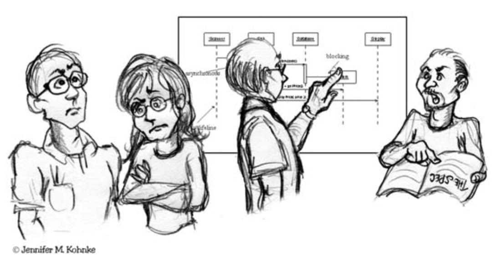
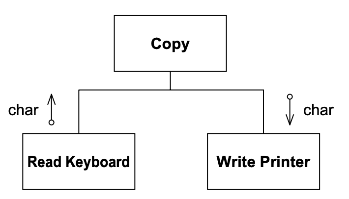

# 7 什么是敏捷设计？

<center></center><br/>

> “在回顾了我所理解的软件开发生命周期后，我得出的结论是，唯一似乎真正满足工程设计标准的软件文档是源代码清单。”
> <p align="right">——Jack Reeves</p>

1992 年，Jack Reeves 在《C++ Journal》上发表了一篇开创性的文章，题为 “什么是软件设计？” ¹
在这篇文章中，Reeves 认为软件系统的设计主要由其源代码来记录。
表示源代码的图表是设计的辅助，而不是设计本身。
事实证明，Jack 的文章是敏捷开发的先驱。

¹ [Reeves92] 这是一篇伟大的论文。我强烈建议你阅读它。我已将其包含在本书的附录D中。

在接下来的页面中，我们将经常谈论 “设计”。
你不应该将其理解为独立于代码的一组 UML 图。
一组 UML 图可能代表设计的一部分，但它不是设计。
软件项目的设计是一个抽象概念。
它与程序的整体形状和结构有关，也与每个模块、类和方法的详细形状和结构有关。
它可以通过许多不同的媒介来表示，但它的最终体现是源代码。
最终，源代码就是设计。

## 软件出了什么问题？

如果你幸运的话，你会以清晰的画面开始一个项目，明确你想要系统成为什么样子。
系统的设计是你脑海中一个至关重要的形象。
如果你更幸运的话，那个设计的清晰性会延续到第一个版本。

然后，出了问题。
软件开始像一块坏肉一样腐烂。
随着时间的推移，腐烂蔓延和生长。
丑陋的溃烂疮疤和肿块在代码中积累，使其越来越难以维护。

最终，即使是进行最简单的更改所需的工作量也变得如此繁重，以至于开发人员和一线经理都呼吁重新设计。

这种重新设计很少成功。
尽管设计人员开始时怀着良好的意图，但他们发现自己正在射击一个移动的目标。
旧系统继续发展和变化，新设计必须跟上。
在它达到第一个版本之前，疣和溃疡就在新设计中积累。

## 设计坏味 —— 腐烂软件的臭味

当软件开始表现出以下任何气味时，你就知道它在腐烂：

1. **僵化性 (Rigidity)** —— 系统难以改变，因为每次更改都会迫使对系统的其他部分进行许多其他更改。
2. **脆弱性 (Fragility)** —— 更改导致系统在与被更改部分没有概念联系的区域中断。
3. **不可移动性 (Immobility)** —— 很难将系统分解为可以在其他系统中复用的组件。
4. **粘滞性 (Viscosity)** —— 做正确的事比做错误的事更难。
5. **不必要的复杂性 (Needless Complexity)** —— 设计包含没有直接好处的基础设施。
6. **不必要的重复 (Needless Repetition)** —— 设计包含可以在单一抽象下统一的重复结构。
7. **晦涩性 (Opacity)** —— 难以阅读和理解。它不能很好地表达其意图。

**僵化性**。
僵化性是软件难以改变的趋势，即使是简单的方式。
如果单一更改导致依赖模块中一系列后续更改，则设计是僵化的。
必须更改的模块越多，设计就越僵化。

大多数开发人员都曾以某种方式面对过这种情况。
他们被要求进行看似简单的更改。
他们审视更改，并对所需工作做出合理的估算。
但稍后，当他们进行更改时，他们发现更改有他们未曾预料到的影响。
他们发现自己在大段代码中追逐更改，修改的模块比他们最初估算的多得多。
最终，更改花费的时间远长于最初的估算。
当被问及为什么他们的估算如此糟糕时，他们重复了传统的软件开发人员的哀叹：“它比我想象的要复杂得多！”

**脆弱性**。
脆弱性是程序在单一更改时在许多地方搞坏 (break) 的趋势。
通常，新问题出现在与被更改区域没有概念联系的区域。
修复那些问题会导致更多问题，开发团队开始看起来像一只追逐自己尾巴的狗。

随着模块脆弱性的增加，更改引入意外问题的可能性接近确定性。
这看起来很荒谬，但这种模块并不少见。
这些是不断需要修复的模块 —— 那些从未脱离错误列表的模块，那些开发人员知道需要重新设计的模块（但没有人愿意面对重新设计它们的幽灵），
那些你修复得越多就越糟糕的模块。

**不可移动性**。
当一个设计包含可能在其他系统中有用的部分，但将这些部分从原始系统中分离出来的努力和风险太大时，它就是不可移动的。
这是一个不幸但非常常见的情况。

**粘滞性**。
粘滞性有两种形式：软件的粘滞性和环境的粘滞性。

当面临更改时，开发人员通常会找到不止一种进行更改的方法。
有些方法保留了设计；其他的则没有（即，它们是 hack）。
当保留设计的方法比 hack 更难使用时，设计的粘滞性就很高。
做错误的事很容易，但做正确的事很难。
我们希望设计我们的软件，使得保留设计的更改易于进行。

环境的粘滞性在开发环境缓慢且低效时出现。
例如，如果编译时间很长，开发人员将倾向于进行不强制大范围重新编译的更改，即使这些更改不能保留设计。
如果源代码控制系统需要数小时才能签入几个文件，那么开发人员将倾向于进行需要尽可能少签入的更改，无论设计是否被保留。

在这两种情况下，一个粘滞的项目都是一个软件设计难以保留的项目。
我们希望创建系统和项目环境，使得保留设计变得容易。

**不必要的复杂性**。
当一个设计包含当前无用的元素时，它就包含了不必要的复杂性。
这经常发生在开发者预见需求变化，并在软件中放入处理那些潜在变化的设施时。
起初，这看起来可能是一件好事。
毕竟，为未来的变化做准备应该能保持我们的代码灵活，并防止以后的噩梦般的更改。

不幸的是，效果往往是相反的。
通过为太多意外情况做准备，设计变得充斥着从未被使用的构造。
其中一些准备可能会得到回报，但更多则不会。
与此同时，设计承载着这些未使用的设计元素的重量。
这使软件变得复杂且难以理解。

**不必要的重复**。
剪切和粘贴可能是有用的文本编辑操作，但它们可能是灾难性的代码编辑操作。
很多时候，软件系统是建立在几十个或几百个重复的代码元素之上的。
它发生在如下情形：

Ralph 需要编写一些代码来对 arvadent 进行 fravle 操作。
他在代码的其他部分寻找他认为可能发生了其他 arvadent fravling 的地方，并找到了一段合适的代码。
他将那段代码剪切粘贴到他的模块中，并做了适当的修改。

Ralph 不知道的是，他用鼠标刮起来的代码是 Todd 放在那里的，而 Todd 是从 Lilly 编写的一个模块中刮出来的。
Lilly 是第一个对 arvadent 进行 fravle 操作的人，但她意识到对 arvadent 进行 fravle 操作与对 garnatosh 进行 fravle 操作非常相似。
她在某个地方找到了一些对 garnatosh 进行 fravle 操作的代码，将其剪切粘贴到她的模块中，并根据需要进行修改。

当相同的代码以稍微不同的形式一遍又一遍地出现时，开发人员就缺少了一个抽象。
找到所有的重复并通过适当的抽象来消除它可能不是他们的优先事项，但这将大大有助于使系统更容易理解和维护。

当系统中有冗余代码时，更改系统的任务可能会变得艰巨。
在这种重复单元中发现的 bug 必须在每个重复中修复。
然而，由于每个重复与其他重复略有不同，修复并不总是相同的。

**晦涩性**。
晦涩性是模块难以理解的趋势。
代码可以以清晰和富有表现力的方式编写，也可以以晦涩和复杂的方式编写。
随着时间的推移而演变的代码往往会随着年龄的增长变得越来越晦涩。
为了将晦涩性降到最低，需要不断努力保持代码清晰和富有表现力。

当开发者第一次编写一个模块时，代码对他们来说可能看起来很清晰。
那是因为他们已经沉浸在其中，并在深入的层次上理解它。
后来，当那种亲密感消退后，他们可能会回到那个模块，并想知道他们怎么能写出那么糟糕的东西。
为了防止这种情况，开发者需要站在读者的角度，并做出协调一致的努力来重构他们的代码，以便他们的读者能够理解它。
他们也需要让其他人审查他们的代码。

### 是什么刺激软件腐烂？

<ins>在非敏捷环境中，设计退化是因为需求以初始设计没有预料到的方式变化</ins>。
通常，这些变化需要快速进行，并且可能由不熟悉原始设计理念的开发者进行。
因此，尽管对设计的更改有效，但它在某种程度上违反了原始设计。
渐渐地，随着变化的继续，这些违规积累起来，设计开始散发臭味。

然而，我们不能将设计的退化归咎于需求的漂移。
我们作为软件开发人员，完全知道需求是会变化的。
事实上，我们中的大多数人都意识到需求是项目中最易变的元素。
如果我们的设计由于不断变化的需求而失败，那是我们的设计和实践出了错。
我们必须以某种方式找到一种方法来使我们的设计能够抵御这种变化，并采用实践来保护它们免于腐烂。

### 敏捷团队不允许软件腐烂

敏捷团队在变化中茁壮成长。
团队前期投入很少；因此，他们不会执着于一个老化的初始设计。
相反，他们保持系统的设计尽可能干净和简单，并用大量的单元测试和验收测试来支持它。
这使设计保持灵活且易于更改。
团队利用这种灵活性来持续改进设计，以便每次迭代结束时，系统的设计都尽可能适合该迭代的需求。

## “Copy” 程序

观察一个设计的腐烂可能有助于说明上述观点。
假设你的老板在周一早上早早地来找你，要求你编写一个程序，将字符从键盘复制到打印机。
你在脑海中快速做一些心算练习，得出结论这将少于十行代码。
设计和编码时间应该远少于一个小时。
考虑到跨职能小组会议、质量教育会议、每日小组进度会议以及现场当前的三个危机，这个程序应该花你大约一周的时间来完成 —— 如果你加班的话。
然而，你总是把你的估算乘以三。

“三周，” 你告诉你的老板。
他哼了一声走开了，留下你去做你的任务。

**初始设计**。
在过程评审会议开始之前，你有一点时间，所以你决定为这个程序规划一个设计。
使用结构化设计，你得到了 Fig 7-1 中的结构图。

<br/>
*Fig 7-1 复制程序结构图*

应用程序中有三个模块或子程序。
`Copy` 模块调用其他两个。
复制程序从 `Read Keyboard` 模块获取字符，并将它们路由到 `Write Printer` 模块。

你看着你的设计，觉得它很好。
你笑了，然后离开你的办公室去参加那个评审。
至少你可以在那里睡一会儿。

周二，你提前一点进来，以便完成 `Copy` 程序。
不幸的是，现场的一个危机在一夜之间升温了，你必须去实验室帮助调试一个问题。
在你的午休时间，你终于在下午 3 点吃上饭，你设法输入了 `Copy` 程序的代码。
结果是 Listing 7-1 。

Listing 7-1 Copy 程序

```cpp
void Copy()
{
    int c;
    while ((c=RdKbd()) != EOF)
        WrtPrt(c);
}
```

你刚设法保存了编辑，就意识到你已经迟到一个质量会议了。
你知道这是一个重要的会议；他们将讨论零缺陷的重要性。
所以你狼吞虎咽地吃下你的 Twinkies 和可乐，然后去开会了。

周三，你又早来了，这次似乎一切正常。
所以你调出 `Copy` 程序的源代码并开始编译。
瞧，它第一次就编译通过了，没有错误！
这也是一件好事，因为你的老板叫你参加一个关于节约激光打印机碳粉的非预定会议。

周四，在电话上与北卡罗来纳州落基山的一名服务技术人员花了四个小时，引导他完成系统一个更晦涩组件中的远程调试和错误记录命令后，你抓起一个 Ho Ho，然后测试你的 `Copy` 程序。
它第一次就工作了！
也是一件好事，因为你的新合作学生刚刚从服务器上删除了主源代码目录，你必须去找最新的备份磁带并恢复它。
当然，最后一次完整备份是在三个月前，你必须在它之上恢复九十四次增量备份。

周五，完全没有安排。
也是一件好事，因为花了一整天的时间才成功地将 `Copy` 程序加载到你的源代码控制系统中。

当然，这个程序取得了巨大的成功，并在你的整个公司部署。
你作为王牌程序员的声誉再次得到确认，你沉浸在你成就的荣耀中。
幸运的话，你今年可能实际上会生产三十行代码！

**需求在变化**。
几个月后，你的老板来找你，说有时候他们希望 `Copy` 程序能够从纸带读取器读取。
你咬牙切齿，翻了个白眼。
你想知道为什么人们总是在改变需求。
你的程序不是为纸带读取器设计的！
你警告你的老板，像这样的变化将破坏你设计的优雅性。

尽管如此，你的老板很坚持。
他说用户确实需要时不时地从纸带读取器读取字符。

所以，你叹了口气，计划你的修改。
你想给 `Copy` 函数添加一个布尔参数。
如果为真，那么你将从纸带读取器读取；如果为假，你将像以前一样从键盘读取。
不幸的是，现在有很多其他程序使用 `Copy` 程序，你不能改变接口。改变接口将导致数周数周的重新编译和重新测试。
光是系统测试工程师就会绞死你，更不用说配置控制组的七个人了。
而且过程警察将大肆强制对每个调用 `Copy` 的模块进行各种代码审查！

不，改变接口是不可能的。
但是，你如何让 `Copy` 程序知道它必须从纸带读取器读取呢？
你当然会使用全局变量！
你还会使用 C 语言家族最好和最有用的特性，`?:` 运算符！
Listing 7-2 显示了结果。

Listing 7-2 Copy 程序的第一次修改

```cpp
bool ptFlag = false;
// remember to reset this flag
void Copy()
{
    int c;
    while ((c=(ptFlag ? RdPt() : RdKbd())) != EOF)
        WrtPrt(c);
}
```

想要从纸带读取器读取的 `Copy` 调用者必须首先将 `ptFlag` 设置为 `true`。
然后他们可以调用 `Copy`，它将愉快地从纸带读取器读取。
一旦 `Copy` 返回，调用者必须重置 `ptFlag`，否则下一个调用者可能会错误地从纸带读取器而不是键盘读取。
为了提醒程序员他们重置这个标志的责任，你添加了一个适当的注释。

再一次，你发布了你的软件，获得了好评。
它比以往任何时候都更成功，成群渴望的程序员都在等待使用它的机会。
生活是美好的。

**得寸进尺……** 
几周后，你的老板（尽管在几个月内进行了三次全公司重组，他仍然是你的老板）告诉你，客户有时希望 `Copy` 程序输出到纸带打孔机。

客户！他们总是在破坏你的设计。
如果没有客户，编写软件会容易得多。

你告诉你的老板，这些持续的变化对你的设计的优雅性产生了深刻的负面影响。
你警告他，如果变化以这种可怕的速度继续下去，软件在年底前将变得无法维护。
你的老板心知肚明地点了点头，然后还是告诉你进行更改。

这个设计变化与前一个类似。
我们只需要另一个全局变量和另一个 `?:` 运算符！
Listing 7-3 显示了你的努力的成果。

清单7-3
```cpp
bool ptFlag = false;
bool punchFlag = false;
// remember to reset these flags

void Copy()
{
    int c;
    while ((c=(ptFlag ? RdPt() : RdKbd())) != EOF)
        punchFlag ? WrtPunch(c) : WrtPrt(c);
}
```

你特别自豪的是你记得修改了注释。
然而，你担心你的程序结构开始坍塌。
对输入设备的任何更多更改肯定会迫使你完全重构 while 循环条件。
也许是时候掸掉你简历上的灰尘了……

**预期变化**。
我将让你自己判断上述内容中有多少是讽刺性的夸张。
这个故事的重点是展示一个程序的设计在变化面前会如何迅速退化。
`Copy` 程序的原始设计简单而优雅。
然而，仅仅经过两次更改，它就开始显示出僵化性、脆弱性、不可移动性、复杂性、冗余性和晦涩性的迹象。
这种趋势肯定会继续下去，程序将变得一团糟。

我们可以坐下来，把这归咎于变化。
我们可以抱怨程序是根据原始规格设计的，而后续的规格更改导致设计退化。
然而，这忽略了软件开发中最突出的事实之一：需求总是在变化的！

记住，在大多数软件项目中，最易变的东西是需求。
需求持续处于变化状态。
这是我们作为开发人员必须接受的事实！
我们生活在一个需求不断变化的世界里，我们的工作是确保我们的软件能够经受住那些变化。
如果我们的软件设计因为需求变化而退化，那么我们就没有在敏捷开发。

### Copy 示例的敏捷设计

一个敏捷开发可能以完全相同的方式开始，使用 Listing 7-1 中的代码。²
当老板要求敏捷开发人员使程序从纸带读取器读取时，他们会通过改变设计使其能够抵抗那种变化来回应。
结果可能类似于 Listing 7-4 。

² 实际上，测试驱动开发的实践很可能会迫使设计足够灵活，以在不需要更改的情况下承受老板的需求。
然而，在这个例子中，我们将忽略这一点。

Listing 7-4 Copy 的敏捷版本2

```cpp
class Reader
{
public:
    virtual int read() = 0;
};

class KeyboardReader : public Reader
{
public:
    virtual int read() {return RdKbd();}
};

KeyboardReader GdefaultReader;

void Copy(Reader& reader = GdefaultReader)
{
    int c;
    while ((c=reader.read()) != EOF)
        WrtPrt(c);
}
```

与其试图修补设计以使新需求工作，团队抓住机会改进设计，使其能够抵抗未来那种变化。
从现在开始，每当老板要求一种新的输入设备时，团队将能够以不会导致 `Copy` 程序退化的方式做出回应。

团队遵循了开闭原则（OCP），我们将在 [第 9 章](../ch9/0.md) 中读到。
这个原则指导我们设计模块，使它们可以在不修改的情况下被扩展。
这正是团队所做的。
老板要求的每一种新输入设备都可以在不需要修改 `Copy` 程序的情况下提供。

然而，请注意，团队在第一次设计模块时并没有试图预测程序将如何变化。
相反，他们以尽可能简单的方式编写它。
只有当需求最终确实发生变化时，他们才改变模块的设计，使其能够抵抗那种变化。

有人可能会争辩说，他们只做了一半的工作。
当他们在保护自己免受不同输入设备的影响时，他们本可以同时保护自己免受不同输出设备的影响。
然而，团队真的不知道输出设备是否会改变。
现在增加额外的保护将是服务于当前没有目的的工作。
很明显，如果需要这种保护，以后将很容易添加。
所以，真的没有理由现在添加它。

### 敏捷开发人员怎么知道该做什么？

上面例子中的敏捷开发人员构建了一个抽象类来保护他们免受输入设备变化的影响。
他们怎么知道该怎么做？
这与面向对象设计的基本原则之一有关。

`Copy` 程序的初始设计是不灵活的，因为它的依赖方向。
再看 Fig 7-1 。
注意 `Copy` 模块直接依赖于 `KeyboardReader` 和 `PrinterWriter`。
`Copy` 模块在这个应用程序中是一个高层模块。
它设定了应用程序的策略。
它知道如何复制字符。
不幸的是，它也被依赖于键盘和打印机的低层细节。
因此，当低层细节改变时，高层策略受到影响。

一旦不灵活性暴露出来，敏捷开发人员就知道 `Copy` 模块到输入设备的依赖关系需要被反转 ³，
这样 `Copy` 将不再依赖于输入设备。
然后他们使用 STRATEGY ⁴ 模式来创建所需的依赖反转。

³ 参见第11章中的依赖反转原则（DIP）。<br/>
⁴ 我们将在第14章中了解 STRATEGY 模式。

所以，简而言之，敏捷开发人员知道该做什么，因为

1. 他们通过遵循敏捷实践检测到了问题；
2. 他们通过应用设计原则诊断了问题；以及
3. 他们通过应用适当的设计模式解决了问题。

软件开发这三个方面之间的相互作用就是设计的行为。

## 保持设计尽可能好

敏捷开发者致力于保持设计尽可能合适和整洁。
这不是随意或暂时的承诺。
敏捷开发者不是每隔几周 “清理” 一次设计。
相反，他们每天、每小时、甚至每分钟都尽可能保持软件干净、简单和富有表现力。
他们从不说，“我们以后回去修复那个。”
他们从不允许腐烂开始。

敏捷开发者对软件设计的态度与外科医生对无菌程序的态度相同。
无菌程序使手术成为可能。
没有它，感染的风险将太高而无法容忍。
敏捷开发者对他们的设计也有同样的感觉。
让哪怕最微小的腐烂开始的危险也太高，无法容忍。

设计必须保持整洁，既然源代码是设计最重要的表达，它也必须保持整洁。
专业精神要求我们，作为软件开发人员，不能容忍代码腐烂。

## 结论

那么，什么是敏捷设计？
敏捷设计是一个过程，而不是一个事件。
它是原则、模式和实践的持续应用，以改善软件的结构和可读性。
它是致力于在任何时候都保持系统设计尽可能简单、干净和富有表现力。

在接下来的章节中，我们将研究软件设计的原则和模式。
当你阅读它们时，记住一个敏捷开发者不会将这些原则和模式应用到一个大的、预先的设计上。
相反，它们从一次迭代应用到下一次迭代，以保持代码及其所体现的设计整洁。

## 参考书目

1. Reeves, Jack. What Is Software Design? C++ Journal, Vol. 2, No. 2. 1992. Available at http://www.bleading-edge.com/Publications/C++Journal/Cpjour2.htm .


