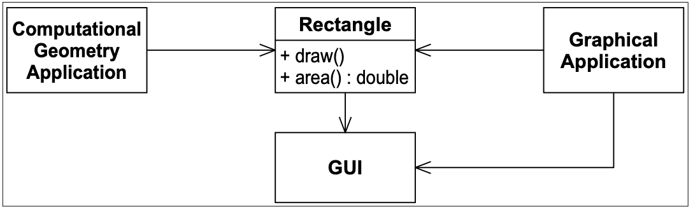
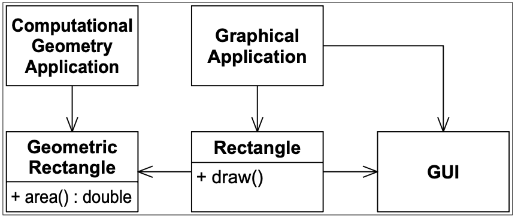
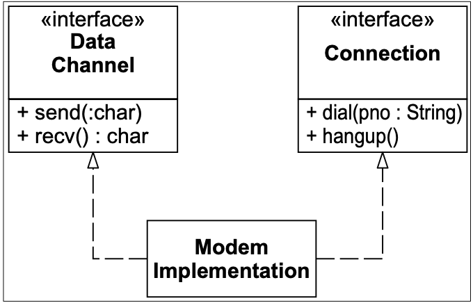
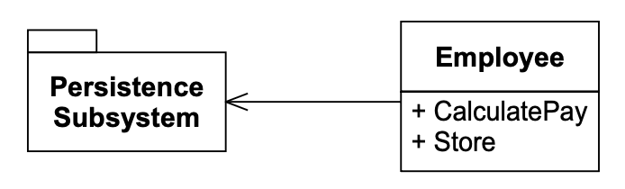

# 8 SRP：单一职责原则

<center></center><br/>

> 除了佛陀本人，无人有权承担泄露秘教秘密的责任……
> <p align="right">——E. Cobham Brewer 1810–1897.</p>
> <p align="right">《成语与寓言词典》，1898年。</p>

这一原则在 Tom DeMarco ¹ 和 Meilir Page-Jones ² 的著作中有所描述。
他们称之为 *内聚性 (cohesion)* 。
他们将内聚性定义为模块元素的功能相关性。
在本章中，我们将稍微转变这一含义，将内聚性与导致模块或类发生变化的驱动力联系起来。

## SRP：单一职责原则

> 一个类应该只有一个改变的理由。

回顾 [第 6 章](#todo) 中的保龄球游戏。
在其大部分开发过程中，`Game` 类处理着两个独立的职责。
它既负责跟踪当前轮次，又负责计算得分。
最终，RCM 和 RSK 将这两个职责分离到两个类中。
`Game` 保留了跟踪轮次的职责，而 `Scorer` 获得了计算得分的职责。（见 [第 78 页](#todo) 。）

¹ [DeMarco79]，第310页。<br/>
² [Page-Jones88]，第6章，第82页。

将这两个职责分离到不同的类中为什么重要？
因为 *每个职责都是一个变化轴* 。
当需求发生变化时，这种变化将通过类中职责的变化体现出来。
如果一个类承担了不止一个职责，那么它就会有不止一个改变的理由。

如果一个类有多个职责，那么这些职责就变得耦合了。
对一个职责的更改可能会损害或阻碍该类满足其他职责的能力。
这种耦合会导致脆弱的设计，在变更时会以意想不到的方式被破坏。

例如，考虑 Fig 8-1 中的设计。
`Rectangle` 类显示了两个方法。
一个在屏幕上绘制矩形，另一个计算矩形的面积。

<br/>
*Fig 8-1 多个职责*

两个不同的应用程序使用了 `Rectangle` 类。
一个应用程序执行计算几何。
它使用 `Rectangle` 来辅助几何形状的数学计算。
它从不将矩形绘制到屏幕上。
另一个应用程序本质上是图形化的。
它可能也会做一些计算几何，但它肯定会在屏幕上绘制矩形。

这个设计违反了单一职责原则（SRP）。
`Rectangle` 类有两个职责。
第一个职责是提供矩形几何的数学模型。
第二个职责是在图形用户界面上渲染矩形。

这种对 SRP 的违例会导致几个严重的问题。
首先，我们必须在计算几何应用程序中包含 GUI。
如果这是一个 C++ 应用程序，GUI 就必须被链接进去，消耗链接时间、编译时间和内存占用。
在一个 Java 应用程序中，GUI 的 `.class` 文件必须被部署到目标平台上。

其次，如果 `GraphicalApplication` 的某些更改导致 `Rectangle` 因某种原因发生更改，
那么该更改可能会迫使我们重新构建、重新测试和重新部署 `ComputationalGeometryApplication`。
如果我们忘记这样做，该应用程序可能会以不可预测的方式出现问题。

一个更好的设计是将这两个职责分离到两个完全不同的类中，如 Fig 8-2 所示。
这个设计将 `Rectangle` 的计算部分移到了 `GeometricRectangle` 类中。
现在，对矩形渲染方式的更改不会影响到 `ComputationalGeometryApplication`。

<br/>
*Fig 8-2 分离的职责*

### 什么是职责？

在 SRP 的上下文中，我们将职责定义为 “改变的理由”。
如果你能想到不止一个修改类的动机，那么这个类就有不止一个职责。
这有时很难看出来。
我们习惯于将职责视为一组。
例如，考虑 Listing 8-1 中的 `Modem` 接口。
我们大多数人都同意这个接口看起来完全合理。
它声明的四个函数肯定是属于一个调制解调器的函数。

Listing 8-1<br/>
Modem.java -- SRP 违规

```java
interface Modem
{
    public void dial(String pno);
    public void hangup();
    public void send(char c);
    public char recv();
}
```

然而，这里展示了两个职责。
第一个职责是 *连接管理* 。
第二个职责是 *数据通信* 。
`dial` 和 `hangup` 函数管理调制解调器的连接，而 `send` 和 `recv` 函数则负责通信数据。

<ins>这两个职责应该被分离吗？
这取决于应用程序的变化方式。
如果应用程序的变化方式影响了连接函数的签名，那么设计就会有 *僵化性 (rigidity)* 的坏味，因为调用 `send` 和 `recv` 的类将不得不比我们希望的更频繁地重新编译和重新部署</ins>。
在这种情况下，这两个职责应该像 Fig 8-3 所示的那样分离。
这可以防止客户端应用程序将这两个职责耦合在一起。

<br/>
*Fig 8-3 分离的 Modem 接口*

另一方面，如果应用程序的变化方式不会导致这两个职责在不同时间发生变化，那么就没有必要将它们分离。
事实上，分离它们会带来 *不必要的复杂性* 的坏味。

这里有一个推论。
一个变化轴只有在变化实际发生时才是变化轴。
如果没有症状，那么应用 SRP 或其他任何原则都是不明智的。

### 分离耦合的职责

请注意，在 Fig 8-3 中，我仍然将两个职责耦合在 `ModemImplementation` 类中。
这并不理想，但可能是必要的。
通常，由于硬件或操作系统的细节原因，我们不得不将我们宁愿不耦合的东西耦合在一起。
然而，通过分离它们的接口，我们已经在与应用程序其余部分相关的方面将这些概念解耦了。

我们可以将 `ModemImplementation` 类视为一个权宜之计，或者一个瑕疵；然而，请注意所有依赖关系都流走了。
没有人需要依赖这个类。
除了 `main` 之外，没有人需要知道它的存在。
因此，我们把丑陋的部分放在了篱笆后面。
它的丑陋不必泄漏出来，污染应用程序的其余部分。

### 持久化

Fig 8-4 展示了一个常见的 SRP 违规。
`Employee` 类包含了业务规则和持久化控制。
这两个职责几乎不应该被混合。
业务规则倾向于频繁变化，虽然持久化可能不会那么频繁地变化，但它变化的理由完全不同。
将业务规则与持久化子系统绑定在一起，是在自找麻烦。

<br/>
*Fig 8-4 耦合的持久化*

幸运的是，正如我们在 [第 4 章](#todo) 中所看到的，测试驱动开发的实践通常会在设计开始出现坏味之前，就迫使这两个职责被分离。
然而，在测试没有强制分离，并且 *僵化性* 和 *脆弱性* 的坏味变得强烈的情况下，应该使用 `FACADE` 或 `PROXY` 模式重构设计，以分离这两个职责。

## 结论

SRP 是最简单的原则之一，也是最难正确应用的原则之一。
将职责合并在一起是我们自然而然会做的事情。
发现并分离那些职责，正是软件设计的核心内容。
实际上，我们接下来将要讨论的其余原则，都会以这样或那样的方式回到这个问题上。

## 参考书目

1. DeMarco, Tom.《Structured Analysis and System Specification》。Yourdon Press 计算系列。Englewood Cliff, NJ：1979 年。
2. Page-Jones, Meilir.《The Practical Guide to Structured Systems Design》，第二版。Englewood Cliff, NJ：Yourdon Press 计算系列，1988 年。
