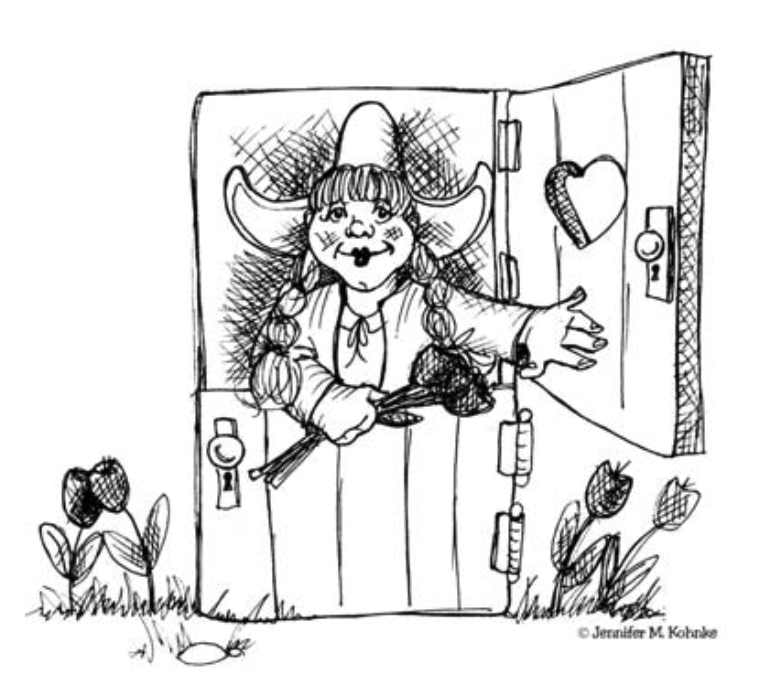
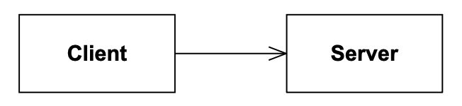
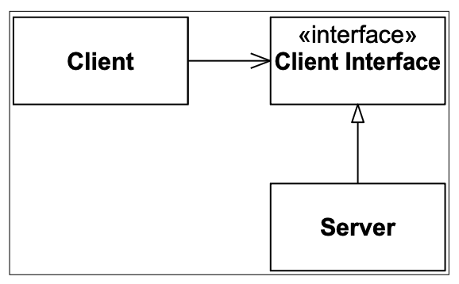
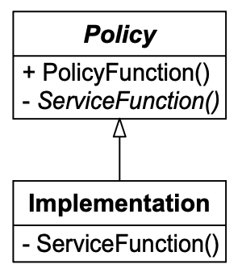
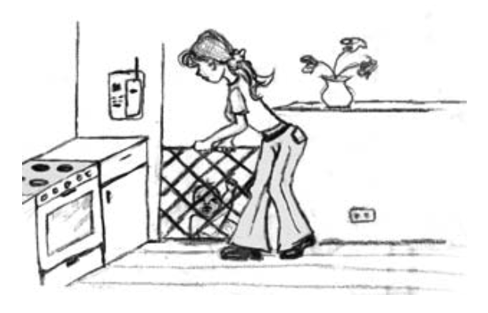

# 9 OCP：开闭原则

<center></center><br/>

> **荷兰门**——（名词）一种在水平方向上一分为二的门，因此任一部分都可以打开或关闭。
> <p align="right">——《美国传统英语词典》第四版：2000年。</p>

正如 Ivar Jacobson 所说，“所有系统在其生命周期中都会发生变化。在开发预期寿命长于第一版的系统时，必须牢记这一点。” ¹
我们如何创建在面对变化时稳定且比第一版更持久的系统？
Bertrand Meyer 早在 1988 年就为我们提供了指导，当时他创造了现在著名的 *开闭原则* 。²

¹ [Jacobson92]，第21页。<br/>
² [Meyer97]，第57页。

## OCP：开闭原则

> 软件实体（类、模块、函数等）应该对扩展开放，但对修改关闭。

当对程序的一个单一更改导致对依赖模块的一系列更改时，设计就有了 *僵化性 (rigidity)* 的坏味。
OCP 建议我们重构系统，以便将来那种类型的更改不会导致更多的修改。
如果 OCP 应用得当，那么将来那种类型的更改是通过 *添加新代码* 来实现的，而不是通过更改已经工作的旧代码。

这看起来可能像陈词滥调 ——一个无法实现的黄金理想—— 但实际上有一些相对简单和有效的策略可以接近那个理想。

## 描述

符合开闭原则的模块有两个主要属性。
它们是：

1. “对扩展开放。”
这意味着模块的行为可以被扩展。
随着应用程序需求的变化，我们能够用满足这些变化的新行为来扩展模块。
换句话说，我们能够改变模块做什么。

2. “对修改关闭。”
扩展模块的行为不会导致该模块的源代码或二进制代码发生改变。
模块的二进制可执行版本，无论是在可链接库、DLL 还是 Java .jar 中，都保持不变。

这两个属性似乎相互矛盾。
扩展模块行为的正常方式是对该模块的源代码进行更改。
一个不能被更改的模块通常被认为具有固定行为。

一个模块的行为如何在不改变其源代码的情况下被修改？
我们如何在不改变模块的情况下改变模块做什么？

## 抽象是关键

在 C++、Java 或任何其他面向对象编程语言（OOPL）³ 中，有可能创建既固定又能代表无限组可能行为的抽象。
这些抽象是抽象基类，而无限组可能的行为则由所有可能的派生类来表示。

³ 面向对象编程语言。

一个模块可以操作一个抽象。
这样的模块可以对修改关闭，因为它依赖于一个固定的抽象。
然而，该模块的行为可以通过创建抽象的新派生类来扩展。

Fig 9-1 显示了一个不符合 OCP 的简单设计。
`Client` 和 `Server` 类都是具体的。
`Client` 类使用 `Server` 类。
如果我们希望一个 `Client` 对象使用一个不同的服务器对象，那么 `Client` 类必须被更改以命名新的服务器类。

<br/>
*Fig 9-1 Client 不是开闭的*

Fig 9-2 显示了相应的符合 OCP 的设计。
在这种情况下，`ClientInterface` 类是一个带有抽象成员函数的抽象类。
`Client` 类使用这个抽象；然而，`Client` 类的对象将使用派生类 `Server` 的对象。
如果我们希望 `Client` 对象使用一个不同的服务器类，那么可以创建一个 `ClientInterface` 类的新派生类。
`Client` 类可以保持不变。

`Client` 有一些需要完成的工作，它可以根据 `ClientInterface` 所呈现的抽象接口来描述那项工作。
`ClientInterface` 的子类型可以以任何他们选择的方式来实现该接口。
因此，通过创建 `ClientInterface` 的新子类型，`Client` 中指定的行为可以被扩展和修改。

<br/>
*Fig 9-2 STRATEGY 模式：Client 既是开放的又是封闭的*

你可能想知道为什么我给 `ClientInterface` 起了这样的名字。
为什么我不叫它 `AbstractServer`？
原因，正如我们稍后将看到的，是抽象类与其客户端的关系比与实现它们的类的关系更紧密。

Fig 9-3 显示了另一种结构。
`Policy` 类有一组具体的公共函数，实现了某种策略。
类似于 Fig 9-2 中 `Client` 的函数。
和之前一样，那些策略函数根据一些抽象接口描述了一些需要完成的工作。
然而，在这种情况下，抽象接口是 `Policy` 类本身的一部分。
在 C++ 中，它们将是纯虚函数，在 Java 中它们是抽象方法。
这些函数在 `Policy` 的子类型中实现。
因此，通过创建 `Policy` 类的新派生类，`Policy` 中指定的行为可以被扩展或修改。

<br/>
*Fig 9-3 模板方法模式：基类是开放且封闭的*

这两种模式是满足 OCP 的最常见方式。
它们代表了通用功能与该功能的详细实现之间的清晰分离。

## Shape 应用程序

下面的示例已在许多关于 OOD 的书籍中展示过。
这是臭名昭著的 “Shape” 示例。
它通常被用来展示多态是如何工作的。
然而，这次我们将用它来阐明 OCP。

我们有一个应用程序，它必须能够在标准 GUI 上绘制圆形和正方形。
圆形和正方形必须以特定的顺序绘制。
将以适当的顺序创建一个圆形和正方形的列表，程序必须按该顺序遍历列表并绘制每个圆形或正方形。

### 违反 OCP

在 C 语言中，使用不符合 OCP 的过程式技术，我们可能会像 Listing 9-1 所示的那样解决这个问题。
这里我们看到一组数据结构，它们具有相同的第一个元素，但除此之外是不同的。
每个数据结构的第一个元素是一个类型码，用于标识该数据结构是圆形还是正方形。
函数 `DrawAllShapes` 遍历一个指向这些数据结构的指针数组，检查类型码，然后调用适当的函数（`DrawCircle` 或 `DrawSquare`）。

清单9-1
正方形/圆形问题的过程式解决方案

--shape.h---------------------------------------
```c
enum ShapeType {circle, square};

struct Shape
{
    ShapeType itsType;
};
```

--circle.h---------------------------------------
```c
struct Circle
{
    ShapeType itsType;
    double itsRadius;
    Point itsCenter;
};

void DrawCircle(struct Circle*);
```

--square.h---------------------------------------
```c
struct Square
{
    ShapeType itsType;
    double itsSide;
    Point itsTopLeft;
};

void DrawSquare(struct Square*);
```

--drawAllShapes.cc-------------------------------
```c
typedef struct Shape *ShapePointer;

void DrawAllShapes(ShapePointer list[], int n)
{
    int i;
    for (i=0; i<n; i++)
    {
        struct Shape* s = list[i];
        switch (s->itsType)
        {
            case square:
                DrawSquare((struct Square*)s);
                break;
            case circle:
                DrawCircle((struct Circle*)s);
                break;
        }
    }
}
```

函数 `DrawAllShapes` 不符合 OCP，因为它不能对新类型的形状关闭。
如果我想扩展这个函数以能够绘制包含三角形的形状列表，我将不得不修改这个函数。
实际上，对于我需要绘制的任何新类型的形状，我都将不得不修改这个函数。

当然，这个程序只是一个简单的示例。
在现实生活中，`DrawAllShapes` 函数中的 `switch` 语句将在整个应用程序的各种函数中一遍又一遍地重复，每一个做的事情都稍有不同。
可能会有拖拽形状、拉伸形状、移动形状、删除形状等的函数。
向这样的应用程序添加一个新形状意味着要寻找所有存在这种 `switch` 语句（或 `if/else` 链）的地方，并将新形状添加到每一个中。

而且，所有 `switch` 语句和 `if/else` 链不太可能都像 `DrawAllShapes` 中的那个那样结构良好。
更可能的是，`if` 语句的谓词会与逻辑运算符组合，或者 `switch` 语句的 `case` 子句会被合并，以 “简化” 局部的决策制定。
在一些病态的情况下，可能会有一些函数对 `Square` 所做的与对 `Circle` 所做的完全相同。
这样的函数甚至不会有 `switch/case` 语句或 `if/else` 链。
因此，找到和理解所有需要添加新形状的地方可能并非易事。

另外，考虑一下必须进行的那种更改。
我们将不得不向 `ShapeType` 枚举添加一个新成员。
由于所有不同的形状都依赖于这个枚举的声明，我们将不得不重新编译它们。⁴
而且我们也必须重新编译所有依赖于 `Shape` 的模块。

⁴ 对枚举的更改可能导致用于保存该枚举的变量的大小发生变化。
因此，如果你决定你并不真的需要重新编译其他形状声明，必须格外小心。

因此，我们不仅必须更改所有 `switch/case` 语句或 `if/else` 链的源代码，
而且我们还必须（通过重新编译）更改所有使用任何 `Shape` 数据结构的模块的二进制文件。
更改二进制文件意味着任何 DLL、共享库或其他类型的二进制组件都必须被重新部署。
向应用程序添加一个新形状的简单行为会导致对许多源模块和更多二进制模块及二进制组件的一系列后续更改。
显然，添加一个新形状的影响非常大。

**糟糕的设计。**
让我们再次回顾一下。Listing 9-1 中的解决方案是 *僵化的* ，因为添加 `Triangle` 会导致 `Shape`、`Square`、`Circle` 和 `DrawAllShapes` 被重新编译和重新部署。
它是 *脆弱的* ，因为会有许多其他的 `switch/case` 或 `if/else` 语句，它们既难以找到又难以解读。
它是 *不可移动的* ，因为任何试图在另一个程序中复用 `DrawAllShapes` 的人都被迫带上 `Square` 和 `Circle`，即使那个新程序不需要它们。
因此，Listing 9-1 展示了许多糟糕设计的坏味。

<br/>

### 符合 OCP

Listing 9-2 显示了解决正方形/圆形问题并符合 OCP 的代码。
在这种情况下，我们编写了一个名为 `Shape` 的抽象类。
这个抽象类有一个名为 `Draw` 的单一抽象方法。
`Circle` 和 `Square` 都是 `Shape` 类的派生类。

Listing 9-2
正方形/圆形问题的 OOD 解决方案。

```cpp
class Shape
{
public:
    virtual void Draw() const = 0;
};

class Square : public Shape
{
public:
    virtual void Draw() const;
};

class Circle : public Shape
{
public:
    virtual void Draw() const;
};

void DrawAllShapes(vector<Shape*>& list)
{
    vector<Shape*>::iterator i;
    for (i=list.begin(); i != list.end(); i++)
        (*i)->Draw();
}
```

注意，如果我们想扩展 Listing 9-2 中 `DrawAllShapes` 函数的行为以绘制一种新形状，我们只需要添加一个 `Shape` 类的新派生类。
`DrawAllShapes` 函数不需要改变。
因此 `DrawAllShapes` 符合 OCP。
它的行为可以在不修改它的情况下被扩展。

实际上，添加一个 `Triangle` 类对这里显示的任何模块完全没有影响。
显然，系统的某些部分必须改变以处理 `Triangle` 类，但这里显示的所有代码都对这种变化免疫。

在一个真实的应用程序中，`Shape` 类会有更多的方法。
然而，向应用程序添加一个新形状仍然相当简单，因为所需要的只是创建新的派生类并实现其所有函数。
不需要在整个应用程序中搜索需要更改的地方。
这个解决方案不是 *脆弱的* 。

这个解决方案也不是 *僵化的* 。
没有现有的源模块需要被修改，并且除了一个例外，没有现有的二进制模块需要被重新构建。
实际创建 `Shape` 新派生类实例的模块必须被修改。
通常，这要么由 `main` 完成，在 `main` 调用的某个函数中完成，要么在 `main` 创建的某个对象的方法中完成。⁵

⁵ 这样的对象被称为工厂，我们将在 [第 21 章](../ch21/0.md) 第 269 页更多地讨论它们。

最后，这个解决方案不是 *不可移动的* 。
`DrawAllShapes` 可以被任何应用程序复用，而不需要带上 `Square` 或 `Circle`。
因此，这个解决方案不表现出前面提到的糟糕设计的任何属性。

这个程序符合 OCP。
它通过添加新代码而不是更改现有代码来改变。
因此，它不会经历不符合程序所表现出的那种级联更改。
唯一需要的更改是添加新模块以及允许新对象被实例化的与 `main` 相关的更改。

### 好吧，我撒谎了

前面的例子简直是蓝天白云和苹果派！
考虑一下，如果我们决定所有 `Circle` 应该在所有 `Square` 之前绘制，Listing 9-2 中的 `DrawAllShapes` 函数会发生什么。
`DrawAllShapes` 函数对这种变化不是封闭的。
为了实现这种变化，我们将不得不进入 `DrawAllShapes`，并先扫描列表寻找 `Circle`，然后再扫描一次寻找 `Square`。

### 预见与 “自然” 结构

如果我们预见到了这种变化，那么我们可以发明一种抽象来保护我们免受其影响。
我们在 Listing 9-2 中选择的抽象对这种变化来说更像是障碍而不是帮助。
你可能会对此感到惊讶。
毕竟，还有什么比一个 `Shape` 基类加上 `Square` 和 `Circle` 派生类更自然的呢？
为什么那个自然模型不是最好的选择？
显然，答案是在排序比形状类型更重要的系统中，该模型并不自然。

<ins>这引出了一个令人不安的结论。
一般来说，无论一个模块多么 “封闭”，总会有某种变化是它没有对其封闭的。
*没有一种模型对所有上下文都是自然的！*</ins>

<br/>

<ins>由于封闭不可能是完全的，它必须是 *战略性的* 。
也就是说，设计者必须选择他的设计要对哪种变化关闭。
他必须猜测最可能发生的变化类型，然后构建抽象来保护自己免受那些变化的影响</ins>。

这需要一定的预见性，这种预见性来源于经验。
有经验的设计者希望他对用户和行业足够了解，以判断不同类型变化的可能性。
然后他针对最可能的变化应用 OCP。

这并不容易。
它相当于对应用程序可能随时间遭受的变化类型做出有根据的猜测。
当开发者猜对了，他们就赢了。
当他们猜错了，他们就输了。
而且他们在很多时候肯定会猜错。

此外，符合 OCP 是昂贵的。
创建适当的抽象需要开发时间和精力。
那些抽象也会增加软件设计的复杂性。
开发者能承受的抽象量是有限度的。
显然，我们希望将 OCP 的应用限制在那些可能的变化上。

<ins>我们如何知道哪些变化是可能的？
我们做适当的研究，问适当的问题，并利用我们的经验和常识。
*在所有这些之后，我们等待变化发生！*</ins>

### 放置 “钩子”

我们如何保护自己免受变化的影响？
在上个世纪，我们有一句谚语。
我们会为那些我们认为可能发生的变化 “放置钩子”。
我们觉得这会使我们的软件变得灵活。

然而，我们放置的钩子常常是错误的。
更糟糕的是，它们带有不必要的复杂性，即使没有被使用，也必须被支持和维护。
这不是一件好事。
我们不想用大量不必要的抽象来加载设计。
相反，我们常常等到我们真正需要抽象时，才把它放进去。

**骗我一次……**
有一句古老的谚语：“骗我一次，是你的错。骗我两次，是我的错。”
这是在软件设计中的一种强有力的态度。
为了不让我们的软件加载不必要的复杂性，我们可以允许自己被骗一次。
这意味着我们最初编写代码时预期它不会改变。
当变化发生时，我们实现那些能保护我们免受未来同类变化影响的抽象。
简而言之，我们承受第一颗子弹，然后确保我们免受那支枪射出的任何更多子弹的伤害。

**刺激变化。**
如果我们决定承受第一颗子弹，那么让子弹尽早且频繁地飞来是对我们有利的。
我们希望在开发路径走得太远之前，知道哪些类型的变化是可能发生的。
我们等待发现哪些类型的变化是可能的时间越长，创建适当抽象就越困难。

因此，我们需要 *刺激变化* 。
我们通过我们在 [第 2 章](../ch2/0.md) 中讨论的几种方法来实现这一点。

- 我们首先编写测试。
测试是系统的一种使用方式。
通过首先编写测试，我们迫使系统变得可测试。
因此，可测试性的变化不会在以后让我们感到惊讶。
我们将已经构建了使系统可测试的抽象。
我们很可能会发现，这些抽象中的许多将在以后保护我们免受其他类型变化的影响。

- 我们使用非常短的周期进行开发 —— 以天而不是以周为单位。

- 我们在基础设施之前开发特性，并经常向利益相关者展示那些特性。

- 我们首先开发最重要的特性。

- 我们尽早且经常地发布软件。
我们尽可能快且尽可能频繁地将它提供给客户和用户。

### 使用抽象获得明确的封闭

好的，我们已经承受了第一颗子弹。
用户希望我们在任何 `Square` 之前绘制所有 `Circle`。
现在我们要保护自己免受未来那种类型变化的影响。

我们如何使 `DrawAllShapes` 函数对绘制顺序的变化关闭？
记住，封闭是基于抽象的。
因此，为了使 `DrawAllShapes` 对顺序封闭，我们需要某种 “顺序抽象”。
这种抽象将提供一个抽象接口，通过它可以表达任何可能的顺序策略。

一个顺序策略意味着，给定任意两个对象，能够发现哪一个应该先绘制。
我们可以定义一个名为 `Precedes` 的 `Shape` 抽象方法。
这个函数接受另一个 `Shape` 作为参数并返回一个 `bool` 结果。
如果接收消息的 `Shape` 对象应该在被作为参数传递的 `Shape` 对象之前绘制，则结果为 `true`。

在 C++ 中，这个函数可以由一个重载的 `operator<` 函数来表示。
Listing 9-3 显示了带有顺序方法的 `Shape` 类可能的样子。

现在我们已经有了确定两个 `Shape` 对象相对顺序的方法，我们可以对它们进行排序，然后按顺序绘制它们。
Listing 9-4 显示了执行此操作的 C++ 代码。

Listing 9-3 带有顺序方法的 Shape

```cpp
class Shape
{
public:
    virtual void Draw() const = 0;
    virtual bool Precedes(const Shape&) const = 0;
    bool operator<(const Shape& s) {return Precedes(s);}
};
```

Listing 9-4 带有顺序的 DrawAllShapes
```cpp
template <typename P>
class Lessp // utility for sorting containers of pointers.
{
public:
    bool operator()(const P p, const P q) {return (*p) < (*q);}
};

void DrawAllShapes(vector<Shape*>& list)
{
    vector<Shape*> orderedList = list;
    sort(orderedList.begin(),
         orderedList.end(),
         Lessp<Shape*>());
    vector<Shape*>::const_iterator i;
    for (i=orderedList.begin(); i != orderedList.end(); i++)
        (*i)->Draw();
}
```

这给了我们一种排序 `Shape` 对象并按适当顺序绘制它们的方法。
但我们仍然没有一个像样的顺序抽象。
目前，各个 `Shape` 对象将不得不覆盖 `Precedes` 方法以指定顺序。
这将如何工作？
我们会在 `Circle::Precedes` 中编写什么样的代码来确保 `Circle` 在 `Square` 之前绘制？
考虑 Listing 9-5。

Listing 9-5 排序一个 Circle

```cpp
bool Circle::Precedes(const Shape& s) const
{
    if (dynamic_cast<const Square*>(&s))
        return true;
    else
        return false;
}
```

应该非常清楚的是，这个函数，以及它在 `Shape` 其他派生类中的所有同类函数，都不符合 OCP。
没有办法使它们对新派生类 `Shape` 关闭。
每次创建一个新的 `Shape` 派生类时，所有 `Precedes()` 函数都将需要被更改。⁶

⁶ 使用 [第 29 章](../ch29/0.md) 中描述的 *ACYCLIC VISITOR* 模式可以解决这个问题。
现在展示那个解决方案有点早了。
我会在 [第 29 章](../ch29/0.md) 结束时提醒你回到这里。

当然，如果从未创建新的 `Shape` 派生类，这无关紧要。
另一方面，如果它们被频繁创建，这种设计将导致大量的波动。
再说一次，我们会承受第一颗子弹。

### 使用 “数据驱动” 方法实现封闭

如果我们必须使 `Shape` 的派生类彼此不知道，我们可以使用一种表驱动的方法。
Listing 9-6 显示了一种可能性。

Listing 9-6 表驱动的类型排序机制

```cpp
#include <typeinfo>
#include <string>
#include <iostream>
using namespace std;

class Shape
{
public:
    virtual void Draw() const = 0;
    bool Precedes(const Shape&) const;
    bool operator<(const Shape& s) const
        {return Precedes(s);}
private:
    static const char* typeOrderTable[];
};

const char* Shape::typeOrderTable[] =
{
    typeid(Circle).name(),
    typeid(Square).name(),
    0
};

// This function searches a table for the class names.
// The table defines the order in which the
// shapes are to be drawn. Shapes that are not
// found always precede shapes that are found.
//
bool Shape::Precedes(const Shape& s) const
{
    const char* thisType = typeid(*this).name();
    const char* argType = typeid(s).name();
    bool done = false;
    int thisOrd = -1;
    int argOrd = -1;
    for (int i=0; !done; i++)
    {
        const char* tableEntry = typeOrderTable[i];
        if (tableEntry != 0)
        {
            if (strcmp(tableEntry, thisType) == 0)
                thisOrd = i;
            if (strcmp(tableEntry, argType) == 0)
                argOrd = i;
            if ((argOrd >= 0) && (thisOrd >= 0))
                done = true;
        }
        else // table entry == 0
            done = true;
    }
    return thisOrd < argOrd;
}
```

通过采用这种方法，我们成功地将 `DrawAllShapes` 函数对一般的排序问题封闭了，
并且将每个 `Shape` 派生类对新 `Shape` 派生类的创建或按类型重新排序 `Shape` 对象的策略变化封闭了（例如，更改顺序以使 `Square` 先被绘制）。

唯一没有对各种 `Shape` 的顺序封闭的是表本身。
那个表可以被放在它自己的模块中，与所有其他模块分开，这样对它的更改不会影响任何其他模块。
实际上，在 C++ 中，我们可以在链接时选择使用哪个表。

## 结论

在许多方面，OCP 是面向对象设计的核心。
符合这一原则是获得面向对象技术所声称的最大好处（即灵活性、可复用性和可维护性）的原因。
然而，符合这一原则不仅仅是使用面向对象编程语言就能实现的。
对应用程序的每个部分都进行疯狂的抽象也不是一个好主意。
相反，它要求开发者致力于仅将抽象应用于程序中那些频繁变化的部分。
抵制过早的抽象与抽象本身一样重要。

## 参考书目

1. Jacobson, Ivar, et al. Object-Oriented Software Engineering. Reading, MA: Addison–Wesley, 1992.
2. Meyer, Bertrand. Object-Oriented Software Construction, 2d ed. Upper Saddle River, NJ: Prentice Hall, 1997.
