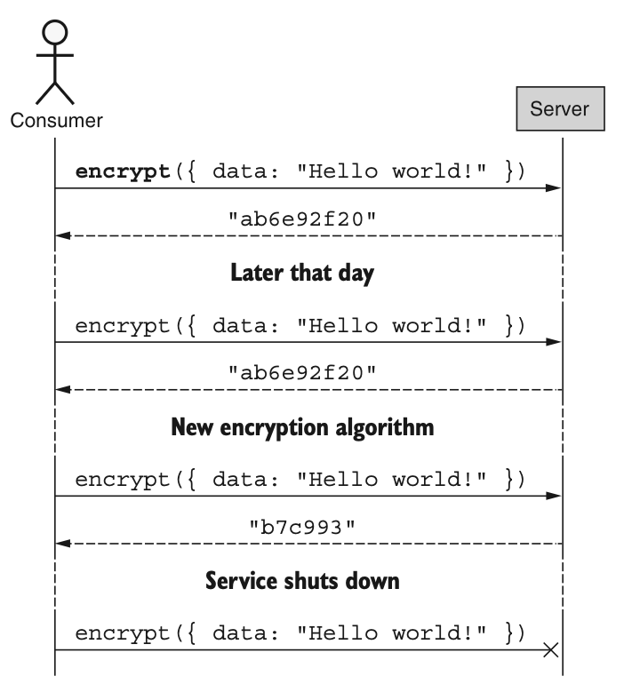
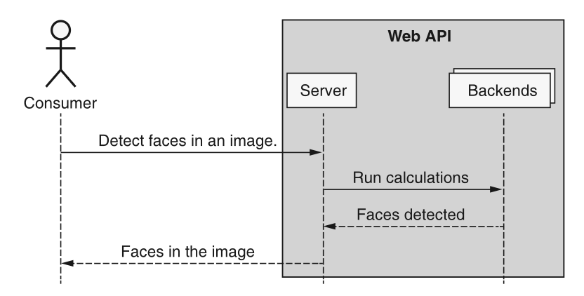
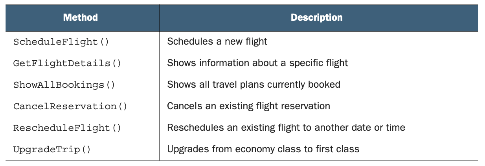
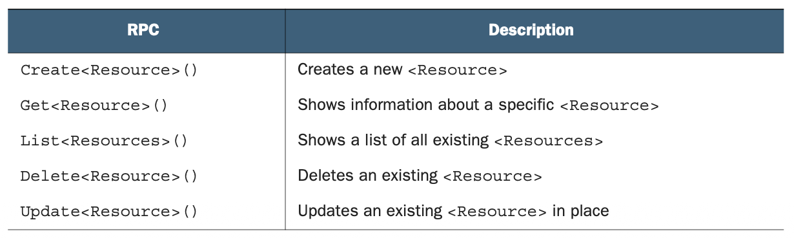
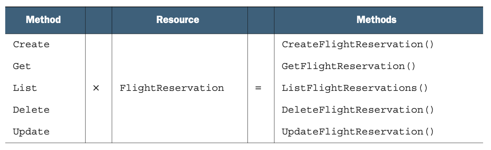
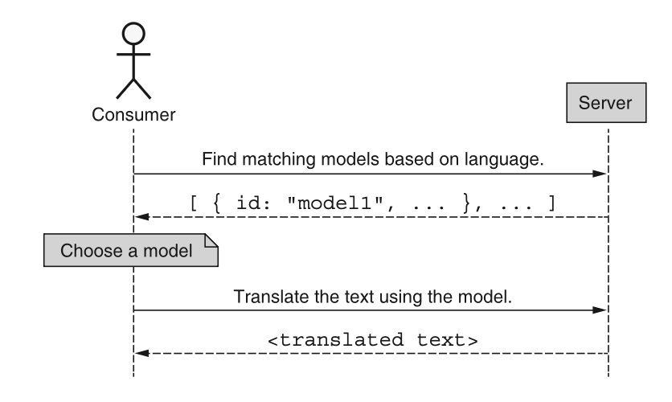

# 第 1 章 API 简介

<div style="background:#f7f5e6; padding:24px; border-radius:4px; color:#405a73;">

**本章内容**
- 什么是接口？
- 什么是 API？
- 什么是面向资源？
- 什么使 API 变得 “好”？

</div><br/>

当你拿起这本书时，很可能你已经对 API 的高层概念有所了解。
此外，你可能已经知道 API 代表应用程序编程接口（Application Programming Interface），因此本章的重点将更详细地介绍这些基础知识实际意味着什么，以及它们为何重要。
让我们从仔细研究 API 这个概念开始。

<a id="what"></a>
## 1.1 什么是 Web API？

API 定义了计算机系统之间交互的方式。
由于极少有系统是独立存在的，因此 API 无处不在，这并不令人惊讶。
我们可以在语言包管理器提供的库中找到 API（例如，一个提供像 `encrypt(input: string): string` 这样方法的加密库），并且从技术上讲，我们自己所编写的代码中也有 API，即使它从未打算供其他人使用。
但有一种特殊类型的 API，它被构建为通过网络暴露，并供许多不同的人远程使用，而正是这些类型是本书关注的重点，通常被称为 “Web API”。

<ins>Web API 在很多方面都很有趣，但这一类最有趣的方面可以说是这样一个事实：构建 API 的人拥有如此多的控制权，而使用 Web API 的人则相对较少。
当我们使用一个库时，我们处理的是库本身的本地副本，这意味着构建 API 的人可以随时做任何他们想做的事，而不会伤害用户。
Web API 则不同，因为没有副本。
相反，当 Web API 的构建者做出更改时，这些更改无论用户是否要求，都会被强加给用户。</ins>

例如，想象一个允许你加密数据的 Web API 调用。
如果负责这个 API 的团队决定在加密你的数据时使用不同的算法，你在这件事上实际上没有选择的余地。
当调用加密方法时，你的数据将使用最新的算法进行加密。
在一个更极端的例子中，该团队可能决定完全关闭该 API 并忽略你的请求。
到那时，你的应用程序将突然停止工作，而你对此无能为力。
这两种场景如图 1.1 所示。

*图 1.1 展示了在使用 Web API 时，消费者可能面临的体验* <br/>
<br/>

然而，Web API 对消费者的缺点，往往正是构建 API 的人的主要优势：他们能够保持对 API 的完全控制。
例如，如果加密 API 使用了一种超级秘密的新算法，构建该算法的团队很可能不想仅仅以库的形式将该代码分发给全世界。
相反，他们可能更倾向于使用 Web API，这将允许他们在不透露其宝贵知识产权的情况下，暴露超级秘密算法的功能。
在其他情况下，一个系统可能需要非凡的计算能力，如果将其部署为库并在家用计算机或笔记本电脑上运行，这将花费太长时间。
在这些情况下，例如许多机器学习 API，构建 Web API 允许你暴露强大的功能，同时对消费者隐藏计算需求，如图 1.2 所示。

*图 1.2 展示了一个隐藏所需计算能力的 Web API 示例* <br/>
<br/>

现在我们已经理解了什么是 API（特别是 Web API），这就引出了一个问题：它们为什么重要？

<a id="why"></a>
## 1.2 为什么 API 很重要？

专为人类使用而设计和构建软件并不少见，这从根本上来说并没有错。
然而，在过去几年中，我们看到越来越多的关注点转向自动化，我们的目标是构建能够完成我们人类所做的事情，而且速度更快的计算机程序。
不幸的是，正是在这一点上，“仅限人类使用” 的软件就成了一个问题。

当我们专门为人类使用而设计某些东西时，我们的交互涉及鼠标和键盘，我们倾向于将系统的布局和视觉方面与原始数据和功能方面混为一谈。
这是一个问题，因为很难向计算机解释如何与图形界面交互。
而这个问题会变得更糟，因为更改程序的视觉方面可能还需要我们重新教计算机如何与这个新的图形界面交互。
实际上，虽然这些变化对我们来说可能仅仅是外观上的，但对计算机来说却是完全无法识别的。
换句话说，对计算机来说，不存在 “仅外观变化” 这样的事情。

<ins>API 是专门为计算机设计的接口，具有易于计算机使用的特性。</ins>
例如，这些接口没有视觉方面，因此无需担心表面的变化。
而且这些接口通常仅以 “兼容” 的方式演进（参见 [第 24 章](ch24.md) ），因此面对新的变化，也无需重新教计算机任何东西。
<ins>简而言之，API 提供了一种方式，以安全且稳定的方式来表达计算机交互所需的语言。</ins>

但这并不仅限于简单的自动化。
<ins>API 还开启了组合的可能性，这使我们能够将功能像乐高积木一样对待，以新颖的方式将各个部分组装在一起，构建出比各部分总和更大的东西。</ins>
为了完成这个循环，这些 API 的新组合同样可以加入可重用构建块的行列，从而实现更复杂、更非凡的未来项目。

但这引出了一个重要的问题：我们如何确保我们构建的 API 能像乐高积木一样组合在一起呢？
让我们从研究一种为此目的的策略开始，这种方法称为面向资源。

<a id="resource"></a>
## 1.3 什么是面向资源的 API？

如今存在的许多 Web API 在某种程度上有点像仆人：你让它们做某事，它们就去执行。
例如，如果我们想要家乡的天气，我们可能会命令 Web API 像仆人一样执行 `predictWeather(postalCode=10011)`。
<ins>这种通过调用预先配置的子程序或方法来命令另一台计算机的风格，通常被称为进行 “远程过程调用”（RPC），因为我们实际上是在调用一个库函数（或过程），让其在一台可能位于遥远地方的计算机上执行。
这类 API 的关键方面在于其主要关注点是被执行的操作。</ins>
也就是说，我们考虑的是计算天气（`predictWeather(postalCode=...)`）、加密数据（`encrypt(data=...)`）或发送电子邮件（`sendEmail(to=...)`），每一步都强调 “做” 某件事。

那么，为什么并非所有 API 都是面向 RPC 的呢？
其中一个主要原因与 “状态性” 的概念有关，即 API 调用可以是 “有状态的” 或 “无状态的”。
当 API 调用能够独立于所有其他 API 请求进行，而无需任何额外的上下文或数据时，它被认为是无状态的。
例如，预测天气的 Web API 调用仅涉及一个独立的输入（邮政编码），因此被认为是无状态的。
另一方面，一个存储用户最喜欢的城市并为这些城市提供天气预报的 Web API，虽然没有运行时输入，但要求用户已经存储了他们感兴趣的城市。
因此，这种涉及其他先前请求或先前存储数据的 API 请求，将被认为是有状态的。
<ins>事实证明，RPC 风格的 API 适用于无状态功能，但当我们引入有状态的 API 方法时，它们往往就不太适用了。</ins>

**注意** ：如果你恰好熟悉 REST，现在也许是指出本节并非专门讨论 REST 和 RESTful API 的好时机，而是更一般地讨论强调 “资源” 的 API（正如大多数 RESTful API 所做的那样）。
换句话说，尽管与 REST 主题有很多重叠，但本节的范围比 REST 更广泛一些。

为了理解其中的原因，让我们考虑一个预订航空公司机票的有状态 API 示例。
在表 1.1 中，我们可以看到用于处理航空旅行计划的 RPC 列表，涵盖了诸如安排新预订、查看现有预订以及取消不需要的行程等操作。

*表 1.1 示例航班预订 API 的方法摘要* <br/>
<br/>

这些 RPC 每一个都相当具有描述性，但无法避免的是，我们需要记住这些 API 方法，而每一种方法都与其他方法有细微差别。
例如，有时一个方法谈论的是 “航班”（例如 `RescheduleFlight()`），而其他时候则操作的是 “预订”（例如 `CancelReservation()`）。
我们还必须记住所使用的动作的众多同义形式中的哪一个。
例如，我们需要记住查看所有预订的方式是 `ShowFlights()`、`ShowAllFlights()`、`ListFlights()` 还是 `ListAllFlights()`（在这个例子中是 `ShowAllFlights()`）。
但我们可以做些什么来解决这个问题呢？答案就是标准化。

<ins>面向资源的方法旨在通过在两个方面为设计 API 提供一组标准的构建模块来帮助解决这个问题。</ins>

* <ins>首先，面向资源的 API 依赖于 “资源” 的概念，这些资源是我们存储和交互的关键概念，从而标准化了 API 所管理的 “事物”。</ins>
* <ins>其次，面向资源的 API 不使用我们所能想到的任何动作的任意 RPC 名称，而是将动作限制在一个小的标准集合（见表 1.2）中，这些标准动作适用于每个资源，从而在 API 中形成有用的操作。</ins>

换个角度来看，面向资源的 API 实际上只是 RPC 风格 API 的一种特殊类型，其中每个 RPC 都遵循一个清晰且标准化的模式：`<标准方法><资源>()`。

*表 1.2 标准方法及其含义摘要* <br/>
<br/>

如果我们采用这种特殊的、受限的 RPC 路线，这意味着我们不再使用表 1.1 中所示的各种不同的 RPC 方法，而是可以提出一个单一的资源（例如 `FlightReservation`），并通过一组标准方法获得等效的功能，如表 1.3 所示。

*表 1.3 应用于航班资源的标准方法摘要* <br/>
<br/>

<ins>标准化显然更有组织性，但这是否意味着所有面向资源的 API 都严格优于面向 RPC 的 API 呢？
实际上，并非如此。
在某些场景下，面向 RPC 的 API 可能是更合适的选择（特别是在 API 方法是无状态的情况下）。
然而，在许多其他情况下，面向资源的 API 对于用户来说更容易学习、理解和记忆。</ins>
这是因为面向资源的 API 提供的标准化使得你很容易将你已经知道的知识（例如，一组标准方法）与你能够轻松学习的新知识（例如，一个新资源的名称）结合起来，从而立即开始与 API 交互。
用更数字化的说法，如果你熟悉，比如说，五个标准方法，那么由于可靠模式的力量，学习一个新资源实际上等同于学习五个新的 RPC。

显然，需要注意的是，并非每个 API 都是相同的，以 “需要学习的内容” 清单的大小来定义 API 的复杂性是有些粗略的。
<ins>另一方面，这里有一个重要的原则在起作用：模式的力量。
学习可组合的部分，并将它们按照既定模式组合成更复杂的事物，似乎比每次都按照自定义设计学习预先构建好的复杂事物更容易。
由于面向资源的 API 利用了经过实战检验的设计模式的力量，它们通常更容易学习，因此比它们面向 RPC 的对应物 “更好”。</ins>
但这引出了一个重要的问题：这里所说的 “更好” 是什么意思？
我们如何知道一个 API 是 “好的”？
“好” 到底意味着什么？

<a id="good"></a>
## 1.4 什么使 API 变得 “好”？

在我们探讨使 API 变得 “好” 的几个不同方面之前，我们首先需要深入探讨为什么我们一开始要有 API。
<ins>换句话说，构建 API 的首要目的是什么？
这通常归结为两个简单的原因：</ins>

1. <ins>我们拥有某些用户想要的功能。</ins>
2. <ins>这些用户希望以编程方式使用该功能。</ins>

例如，我们可能有一个在将文本从一种语言翻译成另一种语言方面非常出色的系统。
世界上可能有很多人想要这种能力，但仅有这一点还不够。
毕竟，我们可以推出一个翻译移动应用程序来暴露这个出色的翻译系统，而不是 API。
要使 API 的存在变得合理，想要此功能的人还必须想要编写一个使用它的程序。

鉴于这两个标准，这在思考 API 的理想品质时会将我们引向何方？

### 1.4.1 操作性

从最重要的部分开始，无论最终接口看起来如何，整个系统必须是可操作的。
换句话说，它必须做用户真正想要的事情。
如果这是一个旨在将文本从一种语言翻译成另一种语言的系统，它必须实际能够做到这一点。
此外，大多数系统可能有许多非功能性需求。
例如，如果我们的系统将文本从一种语言翻译成另一种语言，可能会有与延迟（例如，翻译任务应该花费几毫秒，而不是几天）或准确性（例如，翻译不应产生误导）相关的非功能性需求。
正是这两个方面共同构成了我们所说的系统的操作方面。

### 1.4.2 表达性

如果一个系统能够做某事很重要，那么该系统的接口允许用户清晰简单地表达他们想要做的事情也同样重要。
换句话说，如果系统将文本从一种语言翻译成另一种语言，API 应该被设计成有一种清晰简单的方式来实现这一点。
在这种情况下，它可能是一个名为 `TranslateText()` 的 RPC。
这类事情听起来可能很明显，但实际上可能比看起来更复杂。

这种隐藏复杂性的一个例子是，API 已经支持某些功能，但由于我们方面的疏忽，我们没有意识到用户想要它，因此没有构建一种表达性强的方式让用户访问该功能。
这样的情况往往表现为变通方法，即用户做不寻常的事情来访问隐藏的功能。
例如，如果一个 API 提供了将文本从一种语言翻译成另一种语言的能力，那么用户有可能强制该 API 充当语言检测器，即使他们并不真正对翻译任何内容感兴趣，如清单 1.1 所示。
正如你可能想象的那样，如果用户有一个名为 `DetectLanguage()` 的 RPC，而不是通过大量 API 调用来猜测语言，那会好得多。

*清单 1.1 仅使用 `TranslateText` API 方法检测语言的功能*

```typescript
function detectLanguage(inputText: string): string {
    // 这里假设所讨论的API定义了一个TranslateText方法，
    // 该方法接收输入文本与目标翻译语言两个参数
    const supportedLanguages: string[] = ['en', 'es', ...];

    for (let language of supportedLanguages) {
        let translatedText = TranslateApi.TranslateText({
            text: inputText,
            targetLanguage: language
        });
        // 如果翻译后的文本和输入文本完全相同，说明二者为同一种语言
        if (translatedText === inputText) {
            return language;
        }
    }
    // 如果找不到和输入文本一致的翻译结果，则返回null，代表无法识别输入文本的语言
    return null;
}
```

正如这个例子所示，那些支持某些功能但未能让用户轻松访问这些功能的 API 就不算很好。
另一方面，具有表达性的 API 则为用户提供了清晰指定他们想要什么（例如，翻译文本）甚至希望如何实现（例如，“在 150 毫秒内，准确率达到 95%” ）的能力。

### 1.4.3 简单性

与任何系统的可用性相关的最重要因素之一是简单性。
虽然人们很容易认为简单就是减少 API 中事物的数量（例如 RPC、资源等），但遗憾的是，情况往往并非如此。
例如，一个 API 可以依赖一个单一的 `ExecuteAction()` 方法来处理所有功能；然而，这并没有真正简化任何事情。
相反，它将复杂性从一个地方（许多不同的 RPC）转移到了另一个地方（单个 RPC 中的大量配置）。

那么，一个简单的 API 究竟是什么样子的呢？

<ins>API 不应试图过度减少 RPC 的数量，而应致力于以最直接的方式暴露用户想要的功能，使 API 尽可能简单，但不要过于简单。</ins>
例如，想象一个翻译 API 想要增加检测某些输入文本语言的能力。
我们可以通过在翻译响应中返回检测到的源语言来实现这一点；然而，这仍然将功能隐藏在一个为其他目的设计的方法中，使其变得模糊不清。
相反，创建一个专为此目的设计的新方法，如 `DetectLanguage()`，会更有意义。
（请注意，我们在翻译内容时也可能会包含检测到的语言，但那是完全不同的目的。）

<ins>关于简单性的另一个常见观点采用了关于 “常见情况” 的古老格言（“让常见情况快速运行”），但侧重于可用性，同时为边缘情况留出空间。
这句话可以重新表述为 “让常见情况变得出色，让高级情况成为可能”。
这意味着，每当你为了高级用户的利益而添加可能使 API 复杂化的东西时，最好将这种复杂性充分隐藏起来，使其不被那些只对常见情况感兴趣的普通用户所见。
这保持了更频繁的场景的简单易用，同时仍然为那些需要高级功能的人提供了支持。</ins>

例如，让我们想象一下，我们的翻译 API 包含了在翻译文本时使用的机器学习模型的概念，其中我们不指定目标语言，而是根据目标语言选择一个模型，并使用该模型作为 “翻译引擎”。
虽然这种功能为用户提供了更大的灵活性和控制力，但它也复杂得多，新的常见情况如图 1.3 所示。

*图 1.3 选择模型后翻译文本* <br/>
<br/>

正如我们所见，我们实际上使翻译文本变得更加困难，以换取对更高级功能的支持。
为了更清楚地看到这一点，请将清单 1.2 中显示的代码与调用 `TranslateText("Hello world", "es")` 的简单性进行对比。

*清单 1.2 选择模型后翻译文本*

```typescript
function translateText(inputText: string, targetLanguage: string): string {
    // 由于需要选择模型，首先需要获知输入文本的源语言。
    // 这里我们依赖API提供的假想DetectLanguage()方法来完成语言识别
    let sourceLanguage = TranslateAPI.DetectLanguage(inputText);

    // 当同时获知源语言与目标语言后，就可以从API返回的候选模型中挑选匹配的模型
    let model = TranslateApi.ListModels({
        filter: `sourceLanguage:${sourceLanguage} targetLanguage:${targetLanguage}`,
    })[0];

    // 现在已经集齐全部所需入参，可以回到最初目标：将文本翻译为目标语言
    return TranslateApi.TranslateText({
        text: inputText,
        modelId: model.id
    });
}
```

我们如何设计这个 API，使其尽可能简单，但不过于简单，同时让常见情况出色，高级情况成为可能？
由于常见情况涉及不真正关心特定模型的用户，我们可以通过设计 API 来实现这一点，使其接受 `targetLanguage` 或 `modelId`。
高级情况仍然有效（事实上，清单 1.2 中显示的代码将继续工作），但常见情况将看起来简单得多，仅依赖于一个 `targetLanguage` 参数（并期望 `modelId` 参数保持未定义）。

*清单 1.3 将文本翻译成目标语言（常见情况）*

```typescript
function translateText(inputText: string,
                      targetLanguage: string,
                      modelId?: string): string {
  return TranslateApi.TranslateText({
    text: inputText,
    targetLanguage: targetLanguage,
    modelId: modelId,
  });
}
```

现在我们已经对简单性如何成为 “好” API 的一个重要属性有了一些背景了解，让我们来看最后一部分：可预测性。

### 1.4.4 可预测性

虽然生活中的惊喜有时可能很有趣，但有一个地方并不适合出现惊喜，那就是 API，无论是在接口定义还是底层行为中。
这有点像关于投资的古老格言：“如果它令人兴奋，那你就做错了。”
那么我们所说的 “不令人惊讶的” API 是什么意思呢？

<ins>不令人惊讶的 API 依赖于应用于 API 表面定义和行为的重复模式。
例如，如果一个翻译文本的 API 有一个 `TranslateText()` 方法，该方法将输入内容作为一个名为 `text` 的字段来接收，那么当我们添加一个 `DetectLanguage()` 方法时，输入内容也应该被称为 `text`（而不是 `inputText`、`content` 或 `textContent`）。
虽然这现在看起来可能很明显，但请记住，许多 API 是由多个团队构建的，而在面临一组选项时选择如何命名字段往往是任意的。</ins>
这意味着当两个不同的人分别负责这两个不同的字段时，他们很有可能会做出不同的任意选择。
当这种情况发生时，我们最终会得到一个不一致（因此令人惊讶）的 API。

尽管这种不一致性看起来可能微不足道，但事实证明，这类问题远比它们看起来要重要得多。
这是因为，API 的用户实际上很少会通过通读所有 API 文档来学习每一个细节。
相反，用户只会读足够的内容来完成他们想做的事情。
这意味着，如果某人了解到一个字段在某个请求消息中被称为 `text`，他们几乎肯定会假设它在另一个消息中也被命名为相同的方式，实际上是利用他们已经学到的知识，对尚未学习的内容进行有根据的猜测。
如果这个过程失败了（例如，因为另一个消息将该字段命名为 `inputText`），他们的生产力就会撞上一堵墙，他们不得不停止手头的工作，去弄清楚为什么他们的假设失败了。

<ins>显而易见的结论是，依赖于重复的、可预测的模式（例如，一致地命名字段）的 API 更容易、更快地学习，因此也更好。</ins>
类似的好处也来自于更复杂的模式，例如我们在探索面向资源的 API 时看到的标准操作。
这引出了本书的全部目的：使用众所周知的、明确定义的、清晰的并且（希望是）简单的模式构建的 API，将产生可预测且易于学习的 API，这应该会带来整体上 “更好” 的 API。
现在我们已经对 API 以及什么使它们变得好有了很好的理解，让我们开始思考在设计它们时可以遵循的更高级别的模式。

<a id="summary"></a>
## 本章小结

- 接口是定义两个系统应如何交互的契约。
- API 是特殊类型的接口，用于定义两个计算机系统如何交互，并有多种形式，例如可下载的库和 Web API。
- Web API 的特殊之处在于它们通过网络暴露功能，隐藏了该功能所需的特定实现或计算要求。
- 面向资源的 API 是一种设计 API 的方式，它通过依赖于一组标准操作（称为方法）来处理一组有限的事物（称为资源），从而降低复杂性。
- 什么使 API 变得 “好” 有点模糊，但通常好的 API 是可操作的、具有表达性的、简单的和可预测的。
