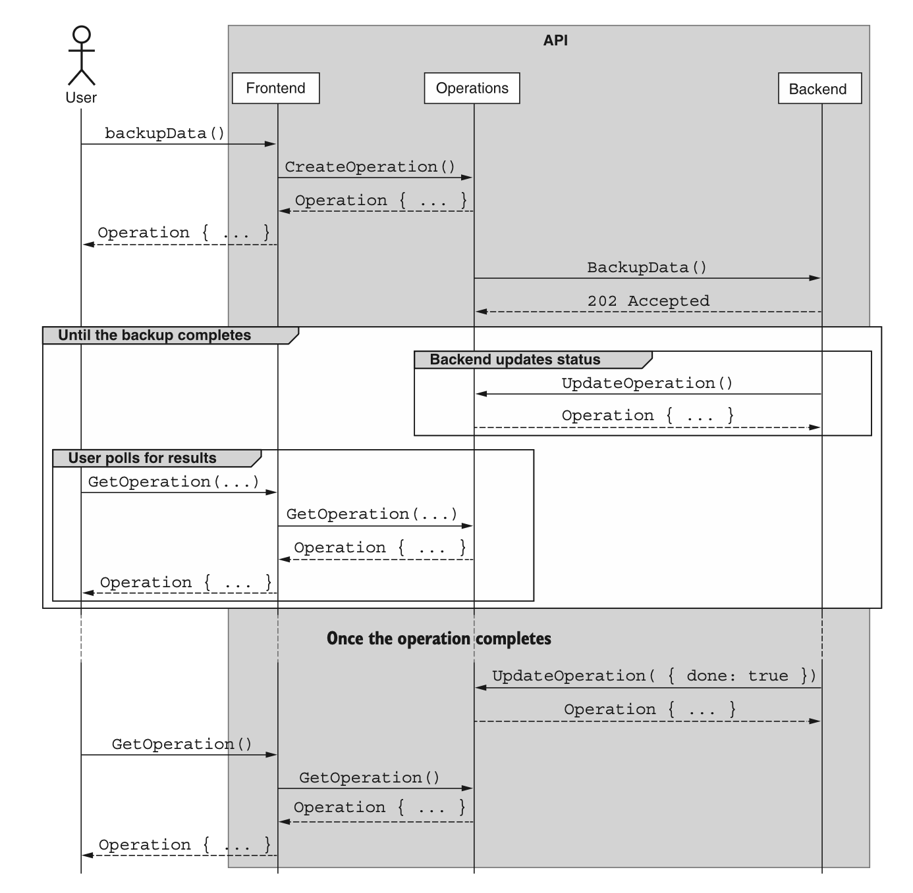

# 第 10 章 长时间运行的操作

<div style="background:#f7f5e6; padding:24px; border-radius:4px; color:#405a73;">

**本章内容**
- 如何对非即时响应的 API 调用使用长时间运行的操作
- 存储关于操作进度的元数据
- 操作在资源层次结构中的位置
- 通过轮询和阻塞方式查找操作状态（包括错误结果）
- 与正在运行的操作进行交互（例如暂停、恢复和取消）
</div><br/>

在大多数情况下，传入请求可以快速处理，在收到请求后的几百毫秒内生成响应。
在响应需要明显更长的时间的情况下，使用相同的 API 结构并要求用户 “再等久一点” 的默认行为并不是一个很优雅的选择。
在本章中，我们将探讨如何使用长时间运行的操作，作为一种允许 API 方法以异步方式运行的方法，
并确保较慢的 API 方法（包括我们在 [第 7 章](ch7.md) 中看到的标准方法）在执行后台实际工作的同时，能够提供快速且一致的反馈。

<a id="motivation"></a>
## 10.1 动机

到目前为止，我们探讨的所有 API 方法都是即时且同步的。
服务收到请求后，立即执行一些工作，并发回响应。
这种特定的行为方式实际上被硬编码到了 API 设计中，因为返回类型是结果本身，而不是某个 “稍后返回结果” 的承诺。

到目前为止，这种设计一直有效，因为所讨论的大多数行为都相对简单，例如查找数据库行并返回结果。
但当工作变得更加复杂、更耗费资源时，会发生什么？
这可能是一些相对次要的事情（例如连接到外部服务），也可能涉及一些繁重的数据处理（例如处理许多 GB 或 TB 级的数据）。
无论是少量还是大量的工作，有一点是明确的：用同一套 API 设计同时适配稳定快速的操作和潜在极慢的操作，很可能无法很好地工作。

如果我们对 API 不做任何改变，而方法只是需要更长时间，那么我们最终会陷入一个相当可怕的境地。
通常，当我们编写向 API 发送请求的代码时，我们遵循熟悉的 “编写、编译、测试” 开发周期。
如果 API 请求耗时很长，我们可能会认为代码有问题，终止进程，添加一些打印语句（或启动调试器），然后再次运行代码（参见清单 10.1）。
如果我们看到它确实卡在了 API 调用上，我们可能会再次经历这个周期，这次调整一些参数以确保我们没有犯低级错误。
只有在它继续卡在 API 调用上之后，我们才会注意到文档中有一句话提到该请求可能需要一段时间，我们应该等待它返回。

*清单 10.1 添加打印语句以监控代码进度*

```javascript
function main() {
  let client = ChatRoomApiClient();
  let chatRoomName = generateChatRoomName();
  // 我们添加一些 console.log() 语句，用来确认问题出在 CreateChatRoom 方法耗时较长
  console.log(`Generated name ${chatRoomName}`);
  // 或许出于某些原因，创建聊天室资源需要耗费一段时间
  let chatRoom = client.CreateChatRoom({
    name: chatRoomName
  });
  console.log(`Created ChatRoom ${chatRoom.id}`);
}

main();
```

此时，我们可能对问题所在更有信心了（毕竟，现在我们很确定问题不在我们的代码中），但我们应该期待等待响应多长时间呢？
多长时间才算足够长？
我们如何知道何时等待时间过长，值得更详细地调查问题？
我们如何看到这项工作的进度？
如果我们想要取消正在进行的工作呢？
我们当前在本地终止运行进程的策略，并不能告知服务器它现在正在做的所有工作都将被浪费掉。
如果能有一种方法，让 API 知道它应该停止做所有这些工作，因为我们不再对结果感兴趣，那将非常有用。

<ins>不幸的是，我们目前看到的 API 设计根本无法满足我们的需求。
而期望现有的模式来处理这些长时间运行的 API 调用，也有点不合理。
这就引出了显而易见的问题：我们该怎么办？
本设计模式的目标就是回答这个问题。</ins>

<a id="overview"></a>
## 10.2 概述

这个问题并非 Web API 所独有。
事实上，它在本地程序执行的工作中更为常见。
我们想要做一些可能需要一段时间的事情，但如果可能的话，我们也希望程序在等待这个慢速函数的同时，能继续执行其他工作。
这实际上是一个非常普遍的问题，许多现代编程语言已经创建了相应的结构来处理这种异步行为，并使其易于在程序中管理。
它们在不同语言中的名称各不相同（Python 中称为 Futures，JavaScript 中称为 Promises），但其目标很简单：启动一些工作，但不一定阻塞等待它。
相反，返回一个代表其占位符的对象。
然后，执行工作，并允许该占位符最终要么 resolve（成功并返回结果），要么 reject（抛出错误）。
为了处理这些不同的场景，用户可以在占位符上注册回调函数，以异步方式处理结果，或者等待结果返回，阻塞代码执行，直到该占位符被 resolve 或 reject（实际上将异步工作变为同步工作）。

*清单 10.2 等待 Promise 并附加回调* <a id="example-10-2"></a>

```typescript
async function factor(value: number): Promise<number[]> {
  // ...
}

async function waitOnPromise() {
  // 在这里我们可以 await 等待结果。它要么返回结果，要么抛出错误。
  let factors = await factor(...);

  let promise = factor(...);
  let otherFactors = await promise;
}

function promiseCallback() {
  // 在这里我们可以给 Promise 挂载回调函数，同时处理成功返回的结果以及拒绝产生的错误。
  let promiseForFactors = factor(...);
  promiseForFactors.then( (factors: number[]) => {
    // ...
  }).catch( (err) => {
    // ...
  });
}
```

本模式的目标是设计一种与 Web API 的 Promise 或 Future 等价的东西，我们称之为长时间运行的操作（LRO）。
这些 API Promise 主要侧重于提供一个工具来跟踪 API 在后台所做的工作，并且应该支持类似的交互模式，例如等待（阻塞）结果、检查状态，或异步接收结果通知。
在许多情况下，这些 LRO 还提供暂停、恢复或取消正在进行的操作的能力，但正如我们将看到的，这将取决于具体情况。
LRO 及其在系统中流转的示例，如图 10.1 所示。

*图 10.1 备份数据的 LRO 生命周期* <br/>
<br/>

<ins>虽然 LRO 与 Promise 有许多相似之处，但也有许多很大的不同。
首先，由于 LRO 负责跟踪另一个 Web API 方法所完成的工作，LRO 只是这些各种方法的一种新的返回类型。</ins>
与编程语言中的 Promise（可以显式创建以在后台执行任意代码）不同，很少有理由显式创建一个 LRO。

*清单 10.3 返回 LRO 的标准 create 方法* <a id="example-10-3"></a>

```typescript
abstract class ChatRoomApi {
  @post("/chatRooms")
  // 并不直接返回 ChatRoom 资源，标准 create 方法返回一个 LRO ，该操作最终会生成 ChatRoom 资源
  CreateChatRoom(req: CreateChatRoomRequest):
    Operation<ChatRoom, CreateChatRoomMetadata>;
}
```

<ins>另一个重要的区别在于这些 LRO 的持久性。
Promise 是短暂的，只存在于创建它们的代码的运行进程的上下文中，而 LRO 根据定义是一个远程概念，存在于 API 服务器的远程执行环境中并运行。
因此，它们需要被视为适当的 API 资源，在 API 中以它们自己的标识符进行持久化。
换句话说，这些 LRO 即使在创建它们的进程早已被丢弃之后，仍将存在</ins>。

<ins>此外，与仅返回特定类型结果的 Promise 不同，LRO 将用于跟踪操作本身的进度和其他元数据。</ins>
因此，LRO 还必须提供某种 schema 来存储这些操作元数据。
这可能类似于操作进度、操作开始或完成的时间，或作为操作一部分正在执行的当前操作。

<ins>最后，由于这些 LRO 可以存在任意长的时间，并且不会随着发起进程的死亡而消失，我们很容易失去对 Operation 资源的控制。
由于我们不能总是确保我们拥有每个 LRO 标识符的持久记录，我们还需要一种发现 API 所知道的 LRO 的方法。
为此，我们将依赖一个 API 服务，该服务提供一些用于查找我们创建的 LRO 的标准方法，例如 ListOperations()。</ins>

现在我们已经对 LRO 应该如何工作有了基本的概念，让我们更深入地了解 LRO 的细节，以及我们如何将这一概念集成到 Web API 中。

<a id="implementation"></a>
## 10.3 实现

为了增加对依赖 LRO 的异步 API 调用的支持，我们需要做两件事。
首先，我们必须定义这些 Operation 资源的样子。
这将包括允许对 LRO 的结果类型（例如，最终将返回的资源）以及我们可能想要存储的关于操作的任何元数据的接口（例如，进度指示器和关于 LRO 本身的其他信息）进行某种形式的泛型参数化。

其次，由于 LRO 存在于与其创建环境不同的环境中（API 服务与客户端代码），我们需要一种在 API 中发现和管理这些 LRO 的方法。
这意味着我们需要定义几个与 LRO 交互的 API 方法，主要是标准的 list 方法、标准的 get 方法，以及可能还有用于暂停、恢复和取消操作的自定义方法。
让我们从定义 LRO 的样子开始。

### 10.3.1 LRO 长什么样？

要理解 LRO 接口应该长什么样，我们需要考虑我们想用这个资源做什么。
<ins>首先，由于它是一个资源，我们需要能够与之交互，这就需要有一个必需的 identifier 字段。
其次，这些 LRO 的主要目标是最终返回一个结果。
这意味着我们显然需要一种表示该结果的方式</ins>。

然而，我们也必须考虑出现错误且操作未能成功完成的情况。
此外，我们必须考虑到有些操作根本不会产生结果，而是仅仅通过没有错误来表示成功。
为了处理所有这些情况，我们可以使用一个可选的 result 字段，它可以是 OperationError 接口（包含 code 数字、message 文本和附加 details），或者是一个参数化的结果类型。
对于这最后一点，我们可以依赖 TypeScript 的泛型，接受一个输入的泛型类型 ResultT。

此外，我们必须考虑 LRO 状态的一些概念。
在许多语言中，Promise 有三种可能的状态：pending（待处理）、resolved（成功完成）或 rejected（以错误结果完成）。
虽然我们可能能够通过 result 字段是否存在来推断 LRO 的状态，但当最终结果本身为空时，这可能会出错。
为了帮助解决这个问题，Operation 资源应该有一个单独的布尔标志来指示 LRO 是否已完成。
为避免任何表明该字段表示操作成功或失败的暗示（例如，complete 可能表示资源已成功完成），我们将其简称为 Boolean 标志 done。

最后，我们必须考虑到，在获得结果之前，这些 LRO 可能需要提供关于正在执行的工作的元数据。
例如，也许我们想向用户提供进度指示器或剩余时间估计值。
我们可以接受一个接口作为此元数据的泛型参数（称为 MetadataT），而不是简单地为此元数据公开一个无模式的值。

<a id="example-10-4"></a>
*清单 10.4 Operation 和 OperationError 接口的定义*

```typescript
interface Operation<ResultT, MetadataT> {
  id: string;
  // 依靠 done 字段标识该操作是否仍在执行中
  done: boolean;
  // 使用 ResultT 和 MetadataT 泛型来定义结果类型的接口以及 LRO 存储的元数据
  result?: ResultT | OperationError;
  metadata?: MetadataT;
}

interface OperationError {
  code: string;
  message: string;
  details?: any;
}
```

值得一提的是，并不严格要求 ResultT 必须是 API 资源。
在某些情况下，这可能是一个空值，例如当某些工作除了 “工作已完成” 之外没有真正需要报告的结果时。
它也可能是某种短暂的值，例如 TranslationResult 接口，该接口可能包含将文本从一种语言翻译成另一种语言的请求结果。
此外，如果从来没有值得存储在 LRO 上的元数据，则此类型显然可以设置为 null，从而有效地完全消除该字段。

现在我们有了这个 LRO 类型，我们必须实际使用它。
为此，我们只需将其作为 API 方法的结果返回。
例如，正如我们在 [清单 10.3](#example-10-3) 中看到的，我们可以通过返回类型 `Operation<ChatRoom, CreateChatRoomMetadata>`
而不是像我们在 [第 7 章](ch7.md) 中学到的仅仅返回 ChatRoom，来使标准 create 方法异步化。
然而，在底层，我们需要创建和存储这个 Operation 资源，这就引出了一个关于 LRO 在资源层次结构中位置的有趣问题。

### 10.3.2 资源层次结构

由于异步方法创建的 LRO 必须持久化在某处，这就引出了一个重要且显而易见的问题：这些 LRO 究竟应该位于资源层次结构中的哪个位置？
我们有两个明显的选择。
首先，我们可以将操作的集合存储在 LRO 所操作的特定资源之下。
或者，我们可以将操作存储为顶级集合，与它们可能涉及的资源分开。

在 LRO 被用于使标准方法异步化的情况下（如 [清单 10.3](#example-10-3) 所示），这可能是完全合理的。
然而，尽管这个选项可能很有诱惑力，但它会带来相当多的问题。
首先，如果操作不一定是围绕资源为中心的，该怎么办？
如果相反，操作是更短暂的事情，例如将一些音频转录为文本呢？
其次，如果我们将这些集合分散到各种资源中（例如 `chatRooms/1/operations/2` 与 `chatRooms/2/operations/3` 相比），这会阻止我们轻松查询系统中所有操作的列表。

<ins>由于所有这些原因，使用集中式的顶级 Operation 资源集合（例如 `/operations/1` ）要好得多。
通过这种集中式的资源布局，正如我们将在后面的章节中看到的，除了每次简单寻址单个 LRO 之外，我们还能够发现系统中其他 LRO。</ins>

现在我们已经知道了这些 LRO 资源将位于何处，让我们看看在实际中我们如何实际使用它们。

<a id="resolution"></a>
### 10.3.3 结果获取

到目前为止，我们已经注意到，API 方法可以通过简单地更改返回类型来快速变为异步。
从即时结果到最终将返回结果的 LRO 的这种转变，确实是处理此类问题的一种快速简便的方法；
然而，我们实际上还没有说任何关于我们如何处理返回给我们的这个 Operation 资源的内容。
换句话说，一旦我们得到这个 LRO 资源，我们到底应该用它做什么？
我们如何获得最终结果？

在大多数编程语言中，Promise 可以以两种状态之一结束：rejected 或 resolved。
这种解析行为，即 Promise 成功完成并以返回最终值结束，可以说是 Promise（或者在我们的例子中是操作）最重要的部分。
那么我们如何获得这个结果呢？
正如我们在 [清单 10.2](#example-10-2) 中看到的，有很多方法可以做到这一点。
然而，为了将这些本地解析 Promise 的方式适应到 Web API 的世界，我们需要做一些调整。

在下面的几节中，我们将看看确定 LRO 最终结果的两种不同方式，从轮询结果开始。

#### 轮询

确定 LRO 是否仍在运行或已完成的最直接方法是简单地向服务询问 LRO。
换句话说，我们可以一遍又一遍地持续请求 LRO 资源，直到其 done 字段被设置为 true。
事实上，许多依赖 LRO 之类东西的客户端库，会在底层执行此检查，要么在请求之间使用标准的等待时间，要么使用某种形式的指数退避，在每次请求之间增加更多时间。

*清单 10.5 轮询 LRO 的更新，直到它完成*

```typescript
async function createChatRoomAndWait(): Promise<ChatRoom> {
  let operation: Operation<ChatRoom, CreateChatRoomMetadata>;
  // CreateChatRoom 方法不会直接返回聊天室，而是返回一个 Operation，
  // 代表最终会解析为 ChatRoom（或者 OperationError）的承诺
  operation = CreateChatRoom({
    resource: { title: "Cool Chat" }
  });

  // 只要操作的 done 字段仍为 false，就持续循环
  while (!operation.done) {
    // 在每一轮循环中，我们重新请求操作的全部信息
    operation = GetOperation<ChatRoom, CreateChatRoomMetadata>({
      id: operation.id
    });
    // 等待一段时间，给 API 服务端留出时间执行更多工作
    await new Promise( (resolve) => {
      setTimeout(resolve, 1000)
    });
  }
  // 最后返回操作结果
  return operation.result as ChatRoom;
}
```

在这种情况下，我们只需要存在在响应中返回 Operation 资源的方法（在本例中为 CreateChatRoom），然后需要参数化的 GetOperation 方法来检索 LRO 的状态。

*清单 10.6 LRO 的标准 get 方法的定义*

```typescript
abstract class ChatRoomApi {
  @post("/chatRooms")
  CreateChatRoom(req: CreateChatRoomRequest):
    Operation<ChatRoom, CreateChatRoomMetadata>;

  @get("/{id=operations/*}")
  // 该方法做了参数化处理，以保证返回类型正确。此方法适用于所有操作类型，而不仅仅是 CreateChatRoom 方法。
  GetOperation<ResultT, MetadataT>(req: GetOperationRequest):
    Operation<ResultT, MetadataT>;
}

interface GetOperationRequest {
  id: string;
}
```

这种行为的明显缺点是，几乎肯定会有一长串请求，它们的结果只是我们再次尝试，这可能被认为是浪费精力（客户端和 API 服务器上的网络流量和计算时间）。
这显然有点不方便，但它是最容易理解的，确保我们能及时（根据我们自己定义的 “及时” ）听到结果，并将请求结果的责任留给了客户端，而客户端最了解他们对结果感兴趣的时间范围。

至此，让我们继续讨论找出 LRO 结果的另一个选项：等待。

#### 等待

轮询 LRO 的更新将控制权交到了客户端手中。
换句话说，客户端决定检查操作的频率，并且可以出于任何原因决定停止检查，例如不再对操作的结果感兴趣。
轮询的一个缺点是，我们不太可能立即知道操作的结果。
我们总是可以通过减少请求操作更新之间的等待时间来越来越接近立即发现结果，但这会导致越来越多的请求完全没有更新。
本质上，轮询在获得更新之前的最大延迟与浪费的时间和资源量之间存在内在的权衡。

解决这个问题的一种方法是依赖与 API 服务的长连接，该连接仅在操作完成后关闭。
换句话说，我们向 API 服务发出请求，要求保持连接打开，并且仅在操作的 done 字段被设置为 true 时才响应。
这种阻塞式请求确保在 API 服务知道操作完成的那一刻，我们就会收到有关该操作结果的通知。
而且，即使服务器端的实现实际上可能依赖轮询，API 服务器内部的轮询也比从远程客户端向 API 服务器轮询要简单得多。

这个选项的缺点是，现在 API 服务器负责管理所有这些连接，并确保在操作完成时向请求发出响应（这可能需要相当长的时间）。
这可能会变得相当复杂，但最终结果是 API 用户的交互模式非常简单。

为了实现这一点，我们需要添加一个新的自定义方法：wait。
这个方法看起来几乎与 GetOperation 参数化方法相同，但它不是立即返回状态，而是等待直到操作被解析或拒绝。

*清单 10.7 LRO 的自定义 wait 方法的定义*

```typescript
abstract class ChatRoomApi {
  // 这里使用 HTTP GET 方法，因为该操作应当具备幂等性
  @get("/{id=operations/*}:wait")
  WaitOperation<ResultT, MetadataT>(req: WaitOperationRequest):
    Operation<ResultT, MetadataT>;
}

interface WaitOperationRequest {
  id: string;
}
```

值得注意的是，由于 WaitOperation 和 GetOperation 之间的输入和返回类型相同，在 GetOperation 方法上添加一个简单的标志来指示是否等待可能更容易。
虽然这当然是更高效的空间利用，但这意味着单个布尔标志可以有意义地改变 API 方法的底层行为，这通常是一个非常糟糕的主意。
此外，通过使用单独的方法，我们可以轻松地监控和强制执行服务级别目标，例如预期的响应时间。
如果我们使用一个标志来指示是否应该等待解析，那么将因为被等待而变慢的 API 调用与因为基础设施问题而变慢的即时 GetOperation 方法区分开来将非常困难。

这在客户端代码中如何工作？
简而言之，客户端可以简单地等待 API 调用的响应。
换句话说，这个方法实际上是在让任何异步 API 调用表现得像同步调用一样。
使用 WaitOperation 方法，我们的 createChatRoomAndWait() 函数变得简单得多。

*清单 10.8 使用 WaitOperation 自定义方法的客户端代码*

```typescript
function createChatRoomAndWait(): Promise<ChatRoom> {
  let operation: Operation<ChatRoom, CreateChatRoomMetadata>;
  // 我们可以使用标准 create 方法，拿到创建 ChatRoom 资源的操作承诺
  operation = CreateChatRoom({
    resource: { title: "Cool Chat" }
  });

  // 不再使用循环，我们可以直接等待该操作的结果
  operation = WaitOperation({ id: operation.id });
  // 假设没有发生错误，WaitOperation 方法返回结果时，就可以拿到最终数据
  return operation.result as ChatRoom;
}
```

虽然这当然会导致简单直接的同步客户端代码，但等待响应充满了潜在的问题。
如果连接因某种原因丢失（例如，客户端可能是可能失去信号的移动设备），我们就会回到起点，不得不进行轮询（这是一种由外部环境而非定时事件驱动的不同类型的轮询）。

现在我们已经了解了如何检索 LRO 的结果，让我们来看看（希望是）不太常见的情况，即结果不成功，我们反而需要处理错误。

### 10.3.4 错误处理

在大多数 Web API 中，错误以 HTTP 错误码和消息的形式表现出来。
例如，我们可能会收到一个 404 Not Found 错误，表明未找到资源；
或者一个 403 Forbidden 错误，表明我们无权访问某个资源。
当响应是即时且同步的时候，这工作得很好，但在 LRO 的异步世界中，我们如何处理这个问题呢？

虽然简单地在 LRO 失败时传递错误响应确实很有诱惑力，但这可能会带来一些严重的问题。
例如，如果对 GetOperation 的响应产生了底层操作的错误，我们如何区分作为操作结果的 500 Internal Server Error 和实际上只是处理 GetOperation 方法的代码故障所导致的相同错误？
显然，这意味着我们需要一个替代方案。

正如我们之前所看到的，我们处理这个问题的方式是允许一个结果（类型为所指示的 ResultT）或一个 OperationError 类型，后者包括机器可读的 code、供人类阅读的友好 description，以及用于存储附加错误详细信息的任意 details 结构。
这意味着 GetOperation 方法只应在检索 Operation 资源时确实发生错误的情况下抛出异常（通过返回 HTTP 错误）。
如果 Operation 资源被成功检索到，则错误响应只是 LRO 结果的一部分。
然后由客户端代码决定是抛出客户端异常还是以其他方式处理错误结果。
例如，我们可以调整 createChatRoomAndWait() 函数来处理可能的错误结果。

*清单 10.9 检查错误或返回结果*

```typescript
function isOperationError(result: any): result is OperationError {
  // 首先定义一个类型检查函数，用来判断返回结果是否为错误
  const err = result as OperationError;
  return err.code !== undefined && err.message !== undefined;
}

function createChatRoomAndWait(): Promise<ChatRoom> {
  let operation: Operation<ChatRoom, CreateChatRoomMetadata>;
  operation = CreateChatRoom( { resource: { title: "Cool Chat" } });
  operation = WaitOperation({ id: operation.id });
  // 接下来我们可以检查结果，根据操作成功与否执行不同逻辑
  if (isOperationError(operation.result)) {
    // ...
  } else {
    return operation.result as ChatRoom;
  }
}
```

<ins>在我们继续之前，值得强调的是错误码值唯一、具体且面向机器而非人类消费是多么重要。
当不提供错误码（或错误码重叠，或面向人类而非计算机）时，我们就会陷入一种可怕的境地：API 用户可能开始依赖消息内容来弄清楚出了什么问题。
这本身不是问题（毕竟，错误消息的存在就是为了帮助用户弄清楚出了什么问题）；
然而，每当 API 用户觉得有必要编写任何依赖该错误消息内容的代码时，它就已经突然成为 API 的一部分了。
这意味着当我们更改错误消息时（比如修复一个拼写错误），我们可能会无意中导致以前正常工作的代码出错。
正如我们将在 [第 24 章](ch24.md) 中学到的，应不惜一切代价避免这种情况，而最好的方法就是让错误码在代码中比错误消息本身更有用。</ins>

在用户不仅需要知道错误类型，还需要一些关于错误的附加信息的情况下，details 字段是放置这些结构化、机器可读信息的完美位置。
虽然这些附加信息并非严格禁止出现在错误消息中，但它在错误详情中要有用得多，而且肯定是必需的。
一般来说，如果错误消息缺失了，我们不应该丢失任何无法在 API 文档中查到的信息。

至此，让我们深入探讨 LRO 下一个有趣但可选的方面：监控进度。

### 10.3.5 监控进度

到目前为止，我们一直将操作视为要么已完成，要么未完成，但我们实际上并没有太多关注这两种状态之间的中间状态。
那么，我们如何监视 LRO 的进度呢？
这正是 Operation 资源的 metadata 字段发挥作用的地方。

正如我们在 [清单 10.4](#example-10-4) 中所看到的，Operation 资源接受两个字段的两种类型。
第一个是结果类型，第二个是分配给 metadata 字段的 MetadataT。
正是这个特殊的接口，我们可以用它来存储关于 LRO 本身而非结果的信息。
这可以是简单的信息，例如工作开始的时间戳，或者在本例中，是有关正在执行的工作的进度、预计完成剩余时间，或已处理的字节数。

虽然进度通常意味着 “完成百分比”，但并没有硬性要求必须如此。
在许多场景中，百分比可能有用，但预计完成时间更有用，或者也许是以实际单位衡量的进度，例如已处理的记录数。
此外，并不能保证我们会有有意义的百分比值 —— 而且我们都知道，完成百分比开始倒退是多么令人沮丧！
幸运的是，我们可以为 metadata 字段使用任何我们想要的接口。
清单 10.10 展示了一个分析 ChatRoom 资源对话历史以获取某些语言统计信息的示例，使用到目前为止已分析和计数的消息数量作为进度指示器。

*清单 10.10 带有元数据类型的 AnalyzeMessages 自定义方法的定义*

```typescript
abstract class ChatRoomApi {
  @post("/{parent=chatRooms/*}/messages:analyze")
  AnalyzeMessages(req: AnalyzeMessagesRequest):
    Operation<MessageAnalysis, AnalyzeMessagesMetadata>;
}

interface AnalyzeMessagesRequest {
  parent: string;
}

interface MessageAnalysis {
  // 该方法返回的结果不是资源，而是一个分析接口，展示每位用户文本的阅读等级等信息
  chatRoom: string;
  messageCount: number;
  participantCount: number;
  userGradeLevels: map<string, number>;
}

interface AnalyzeMessagesMetadata {
  // 该元数据接口通过已处理和已统计的消息数量来判断进度
  chatRoom: string;
  messagesProcessed: number;
  messagesCounted: number;
}
```

我们实际如何使用它呢？
在 [第 10.3.3 节](#resolution) 中，我们看到了如何使用轮询来持续检查 LRO，以期它已经完成。
以同样的方式，我们可以使用 GetOperation 方法来检索存储在 AnalyzeMessagesMetadata 接口中的进度信息。

*清单 10.11 使用元数据接口展示进度*

```typescript
async function analyzeMessagesWithProgress(): Promise<MessageAnalysis> {
  let operation: Operation<MessageAnalysis, AnalyzeMessagesMetadata>;
  operation = AnalyzeMessages({ parent: 'chatRooms/1' });

  while (!operation.done) {
    operation = GetOperation<MessageAnalysis, AnalyzeMessagesMetadata>({
      id: operation.id
    });
    // 首先，我们从当前状态的操作中获取元数据
    let metadata = result.metadata as
        AnalyzeMessagesMetadata;
    // 接着在控制台打印一行日志，实时更新消息处理与统计的进度
    console.log(
      `Processed ${metadata.messagesProcessed} of ` +
      `${metadata.messagesCounted} messages counted...`);
    await new Promise( (resolve) => setTimeout(resolve, 1000) );
  }

  return operation.result as MessageAnalysis;
}
```

现在我们已经知道了如何检查操作的进度，我们可以开始探索与操作交互的其他方式。
例如，如果操作的进度比我们预期的慢得多呢？
也许我们犯了一个错误？
我们如何取消该操作？

### 10.3.6 取消操作

到目前为止，我们与 LRO 的所有交互都假设一旦启动，操作就会继续执行其工作，直到它们成功解析或以错误拒绝。
但如果我们不想等待操作完成呢？

我们可能想要这样做的原因有很多。拼写错误和 “大脑短路”（精神上的拼写错误）发生的频率远比我们愿意承认的要高。
像这样的情况会导致我们编写创建 LRO 的代码时使用了错误的数据、错误的输出目标，有时甚至完全是错误的方法！
如果所有这些情况都是本地运行的 Promise，我们只需终止进程并停止执行。
然而，由于我们处理的是远程执行环境，我们需要一种方式来请求等效的操作。
为了实现这一点，我们可以使用一个自定义方法：CancelOperation。

*清单 10.12 自定义 cancel 方法的定义*

```typescript
abstract class ChatRoomApi {
  @post("/{id=operations/*}:cancel")
  // 该自定义方法会在操作终止后，返回已完全取消的操作资源
  CancelOperation<ResultT, MetadataT>(req: CancelOperationRequest):
    Operation<ResultT, MetadataT>;
}

interface CancelOperationRequest {
  id: string;
}
```

就像 GetOperation 方法一样，CancelOperation 方法将返回参数化的 Operation 资源，并且该资源的 done 字段将被设置为 true
（回想一下，选择 done 正是因为它不暗示操作的真正完成或成功）。
为了确保结果始终被视为已完成，此方法应阻塞，直到操作完全取消，然后才返回结果。
有些情况下这可能需要一段时间（也许需要联系其他几个子系统）；
然而，等待响应仍然是合理的，就像 [第 10.3.3 节](#resolution) 中的 WaitOperation 方法一样。

<ins>同样重要的是，如果可能的话，应移除因 LRO 执行而产生的任何中间工作产物或其他输出。
毕竟，取消 LRO 的目标是最终得到一个看起来好像该操作从未被启动过的系统。
在无法在取消操作后进行清理的情况下，我们应确保用户自行进行清理所需的所有信息都存在于操作的 metadata 字段中。</ins>
例如，如果操作在存储系统中创建了几个文件，但由于某种原因无法在取消操作之前删除，则 metadata 必须包含对这些中间数据的引用，以便用户可以自行删除这些文件。

最后，虽然如果所有 LRO 类型都能够被取消那当然很好，但不应该有硬性要求整个 API 都必须如此。
原因很简单：操作往往在目的、复杂性以及是否能够被取消的固有特性上各不相同。
通常，取消某些操作是有意义的，而其他操作则根本不遵循这种模式。
我们绝不应该为对用户没有好处的 LRO 添加取消支持。

至此，让我们看看另一种与取消性质相似但不太永久的交互类型：暂停和恢复。

### 10.3.7 暂停和恢复操作

现在我们已经打开了以有意义的方式改变操作行为的交互大门（例如取消其工作），我们可以开始研究 LRO 的另一个重要方面：暂停正在进行的工作并在稍后恢复的能力。
虽然我们可以依赖与刚刚了解的 CancelOperation 方法类似的自定义方法，但在考虑这种场景时，还有更多需要考虑的地方。

最重要的是，如果一个操作被暂停了，我们当然需要一种方式来表明它已被暂停。
不幸的是，Operation 资源上的 done 字段在这里并不太适用。
暂停的操作并未完成，因此我们不能仅仅将该字段重新用于我们的目的。
这给我们留下了两个选择：向 Operation 接口添加一个新字段（paused 或类似名称），或者依赖操作的元数据。

虽然向 Operation 接口添加一个新字段既好又简单，但这会带来它自己的问题：不能保证每个操作都能够被暂停和恢复。
在某些情况下这可能是有意义的，但在其他情况下，这些 LRO 是全有或全无的事情，用户尝试暂停操作并不会获得真正的好处。
例如，试着暂停一个在火箭升空后发射火箭的 API。
这根本说不通！

<ins>简而言之，这给我们留下了不那么优雅但更好的解决方案：依赖元数据来处理这种状态。
这意味着有一条重要的规则：要使一个操作能够被暂停和恢复，元数据类型（MetadataT）必须有一个名为 “paused” 的布尔字段。</ins>

*清单 10.13 向元数据接口添加 paused 字段*

```typescript
interface AnalyzeMessagesMetadata {
  chatRoom: string;
  paused: boolean; // 为了支持操作的暂停与恢复，该元数据接口必须包含paused布尔字段
  messagesProcessed: number;
  messagesCounted: number;
}
```

暂停和恢复方法（PauseOperation 和 ResumeOperation）与我们之前了解到的其他以操作为中心的资源基本相同。
它们接受 Operation 资源的标识符，以及在操作上将返回的类型（ResultT 和 MetadataT）的参数。
而且就像 CancelOperation 方法一样，这些方法应仅在操作已成功暂停或恢复后才返回。

*清单 10.14 自定义 pause 和 resume 方法的定义*

```typescript
abstract class ChatRoomApi {
  @post("/{id=operations/*}:pause")
  // 这些自定义方法返回已暂停（或已恢复）的操作
  PauseOperation<ResultT, MetadataT>(req: PauseOperationRequest):
    Operation<ResultT, MetadataT>;

  @post("/{id=operations/*}:resume")
  ResumeOperation<ResultT, MetadataT>(req: ResumeOperationRequest):
    Operation<ResultT, MetadataT>;
}

interface PauseOperationRequest {
  id: string;
}

interface ResumeOperationRequest {
  id: string;
}
```

暂停或恢复底层工作的实际过程留作 API 的实现细节。
虽然探索在各种不同 API 中暂停和恢复工作的所有不同机制会很有趣，但这里最需要说的是，我们只应在既有意义又可能的情况下支持这些方法。
这意味着，如果我们想要支持暂停一个例如将数据从一个地方复制到另一个地方的 API 方法，我们必须存储执行复制的进程的指针，并确保我们可以终止该进程，同时还要可能清理复制数据过程中造成的混乱。
不过，其余的细节则留给实际的 API 设计者。

### 10.3.8 探索操作

LRO 的一个独特之处在于，创建 API Promise 的代码与执行 Promise 并完成所有工作的环境是分开的。
这意味着如果发起工作的代码在 Promise 完成之前以某种方式崩溃了，我们可能会陷入相当困难的境地。
除非我们持久化操作 ID，以便稍后可以恢复轮询循环，否则当本地执行环境中的进程死亡时，指向执行我们所请求工作的操作的指针将与其他所有状态一起丢失。

这种场景凸显了一个相当大的疏忽：我们可以在给定 Operation 资源标识符的情况下检索有关单个 Operation 资源的信息，但我们无法发现正在进行的工作或检查 API 系统的状态和历史。
<ins>幸运的是，这是一个很容易补救的问题。
为了填补这个空白，我们只需为 API 中的 Operation 资源集合定义一个标准 list 方法。</ins>

此方法应像其他标准 list 方法一样运作，但至关重要的是，我们至少支持某种形式的过滤。
否则，当试图提出诸如 “哪些 Operation 资源目前仍未完成？” 之类的问题时，可能会变得困难。
此外，过滤还必须支持查询资源上的元数据。
否则，我们就无法回答其他问题，例如 “哪些操作被暂停了？”

*清单 10.15 LRO 的标准 list 方法的定义*

```typescript
abstract class ChatRoomApi {
  @get("/operations")
  // 该方法遵循标准list方法，同时支持参数化
  ListOperations<ResultT, MetadataT>(req:
    ListOperationsRequest):
    ListOperationsResponse<ResultT, MetadataT>;
}

interface ListOperationsRequest {
  filter: string; // 后续我们会介绍如何实现分页
}

interface ListOperationsResponse<ResultT, MetadataT> {
  results: Operation<ResultT, MetadataT>[];
}
```

这个简单的 API 方法允许我们回答关于操作的所有可能问题，特别是在我们不巧没有提前获得标识符的情况下。
请注意，该操作确实接受结果类型和元数据类型的参数，但这不应禁止查询所有操作的能力，无论涉及何种类型。
我们可能会使用 TypeScript 的 any 关键字来做到这一点；
然而，将由调用者检查结果以确定具体类型（在大多数情况下，结果的标识符将包含资源类型）。

可以想象，过滤所有这些资源相当强大，但一旦这些操作完成，我们就必须考虑将这些记录保留多久。
在下一节中，我们将探讨这些 LRO 记录的持久性标准。

### 10.3.9 持久性

虽然这些 LRO 确实是资源（具体来说是 Operation 资源），但它们与我们自己定义的资源有些不同。
首先，它们不是被显式创建的，而是由于系统中的其他行为而存在的
（例如，请求对数据进行分析可能会导致创建一个 Operation 资源来跟踪正在进行的工作）。
这种隐式创建与我们通常使资源存在的方式（通常使用标准 create 方法）有根本性的不同。

但更重要的是，这些资源会很快从极其重要变为过时新闻。
例如，任何作为标准方法（例如 CreateChatRoom）结果的 LRO 在处理时非常重要，但一旦完成就几乎没用了。
原因是结果本身就是操作的永久记录输出，因此跟踪该资源创建的过程在那之后就不再特别有价值了。

这意味着我们必须解决一个令人困惑的问题：我们是将 LRO 像任何其他资源一样对待并永久持久化它们？
还是它们与其他更传统的资源有着略微不同的持久性策略？
如果它们确实有不同的持久性策略，那么正确的策略是什么？

事实证明，有相当多的不同选项，每个选项都有自己的优点和缺点。
<ins>最容易管理且实现最快的是将 Operation 资源像任何其他资源一样对待并永久保留。
一般来说，大多数 API 应该依赖这种方法，除非这会给系统带来不必要的负担（通常是在你每天创建数百万个 Operation 资源时）。</ins>

如果 API 的交互模式使这种永久存储方法特别浪费，那么下一个最佳选择是依赖滚动窗口，
根据 Operation 资源上的 expireTime 字段中定义的完成时间戳（而非创建时间戳）来清除 Operation 资源。
<ins>简而言之，如果资源的存续时间超过了比如 30 天，就应该永久删除它。</ins>

*清单 10.16 向 Operation 接口添加过期字段*

```typescript
interface Operation<ResultT, MetadataT> {
  id: string;
  done: boolean;
  expireTime: Date; // 我们可以使用过期时间来标识该资源何时会从系统中删除
  result?: ResultT | OperationError;
  metadata?: MetadataT;
}
```

还有更多复杂且功能丰富的选项
（例如，当操作所绑定的资源被删除时删除操作，或者在一段时间后将操作归档，然后在归档另一个时间窗口后删除它们），
但应避免使用这些选项。
归根结底，它们会由于混淆和复杂的清除算法而带来更多困难。
相反，依赖简单的过期时间对每个人来说都容易遵循，并且关于最终结果也是明确的。

<ins>最重要的是要记住，资源的过期时间不应取决于操作的底层结果类型。
换句话说，代表创建资源工作的操作应与代表分析数据工作的操作在相同的时间后过期。</ins>
如果我们对不同类型操作使用不同的过期时间，可能会导致更多混淆，结果会以看似不可预测的方式消失。

### 10.3.10 最终 API 定义

将所有内容整合在一起，清单 10.17 展示了与 LRO 相关的所有这些方法及接口的完整 API 定义。

*清单 10.17 最终 API 定义*

```typescript
abstract class ChatRoomApi {
  @post("/{parent=chatRooms/*}/messages:analyze")
  AnalyzeMessages(req: AnalyzeMessagesRequest):
    Operation<MessageAnalysis, AnalyzeMessagesMetadata>;

  @get("/{id=operations/*}")
  GetOperation<ResultT, MetadataT>(req: GetOperationRequest):
    Operation<ResultT, MetadataT>;

  @get("/operations")
  ListOperations<ResultT, MetadataT>(req: ListOperationsRequest):
    ListOperationsResponse<ResultT, MetadataT>;

  @get("/{id=operations/*}:wait")
  WaitOperation<ResultT, MetadataT>(req: WaitOperationRequest):
    Operation<ResultT, MetadataT>;

  @post("/{id=operations/*}:cancel")
  CancelOperation<ResultT, MetadataT>(req: CancelOperationRequest):
    Operation<ResultT, MetadataT>;

  @post("/{id=operations/*}:pause")
  PauseOperation<ResultT, MetadataT>(req: PauseOperationRequest):
    Operation<ResultT, MetadataT>;

  @post("/{id=operations/*}:resume")
  ResumeOperation<ResultT, MetadataT>(req: ResumeOperationRequest):
    Operation<ResultT, MetadataT>;
}

interface Operation<ResultT, MetadataT> {
  id: string;
  done: boolean;
  expireTime: Date;
  result?: ResultT | OperationError;
  metadata?: MetadataT;
}

interface OperationError {
  code: string;
  message: string;
  details?: any;
}

interface GetOperationRequest {
  id: string;
}

interface ListOperationsRequest {
  filter: string;
}

interface ListOperationsResponse<ResultT, MetadataT> {
  results: Operation<ResultT, MetadataT>[];
}

interface WaitOperationRequest {
  id: string;
}

interface CancelOperationRequest {
  id: string;
}

interface PauseOperationRequest {
  id: string;
}

interface ResumeOperationRequest {
  id: string;
}

interface AnalyzeMessagesRequest {
  parent: string;
}

interface MessageAnalysis {
  chatRoom: string;
  messageCount: number;
  participantCount: number;
  userGradeLevels: map<string, number>;
}

interface AnalyzeMessagesMetadata {
  chatRoom: string;
  paused: boolean;
  messagesProcessed: number;
  messagesCounted: number;
}
```

<a id="trade-offs"></a>
## 10.4 权衡

显然，处理可能耗时较长的 API 调用有很多种方式。
例如，最简单的方式之一也恰好是对客户端来说最容易管理的：让请求按其需要的时间执行即可。
这些更简单选项的权衡之处在于，它们不太适合分布式架构（例如，一个微服务发起工作，另一个微服务监控其进度）。

另一个权衡是，实际上要监控一个一直挂起直到完成的 API 调用的进度可能会变得有点复杂。
虽然 API 可以随时间推送数据，但如果连接因任何原因中断（也许是进程崩溃、网络连接中断等），我们就失去了继续监控该进度的能力。
而且，如果我们决定实现某种机制，在这种网络故障后恢复监控进度，那么我们构建的东西很可能就会开始类似于 LRO 的概念。

LRO 一开始也可能有点难以理解。
它们是复杂、泛型、参数化的资源，不是被显式创建的，而是由于请求了其他工作而存在的。
这无疑打破了我们迄今为止所学到的资源创建模式。
此外，当涉及到 “可重运行作业” 和 LRO 的概念时，常常会产生混淆，我们将在 [第 11 章](ch11.md) 中更详细地讨论这一点。

简而言之，虽然这种设计模式一开始可能难以掌握，但随着时间的推移，API Promise 的概念会变得易于被 API 用户理解。
而且这种模式本身几乎没有施加任何实际限制 —— 毕竟，如果用户需要并期望同步版本的各类 API 方法，没有什么能阻止我们保留它们。

<a id="exercises"></a>
## 10.5 练习

1. 为什么操作资源应保留为顶级资源，而不是嵌套在它们所操作的资源之下？

2. 为什么让 LRO 过期是有意义的？

3. 如果用户正在等待操作解析，而该操作通过自定义 cancel 方法被中止，结果应该是什么？

4. 在跟踪 LRO 的进度时，使用单个字段来存储完成百分比是否合理？为什么是或为什么不是？

<a id="summary"></a>
## 本章小节

- LRO 是 Web API 的 Promise 或 Future，充当跟踪 API 服务在后台所做工作的工具。

- LRO 是参数化接口，返回特定的结果类型（例如，操作产生的资源）和用于存储操作本身进度信息的元数据类型。

- LRO 在一段时间后解析为结果或错误，用户通过定期轮询状态更新或在等待时被通知结果来发现这一点。

- LRO 可以由 API 自行决定暂停、恢复或取消，并依赖自定义方法来执行这些操作。

- LRO 应持久化到存储中，但通常应在某个标准时间段后过期，例如 30 天。
