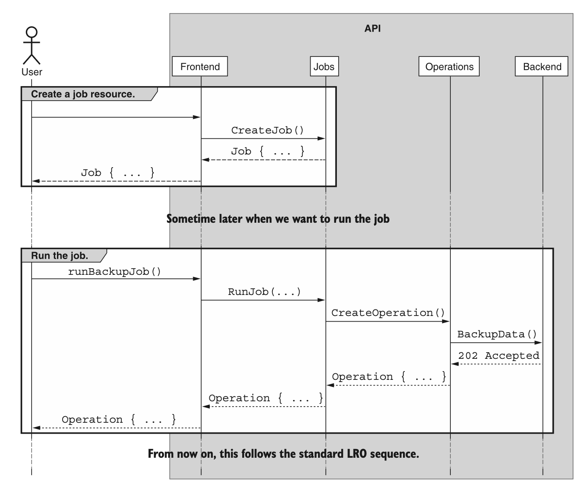
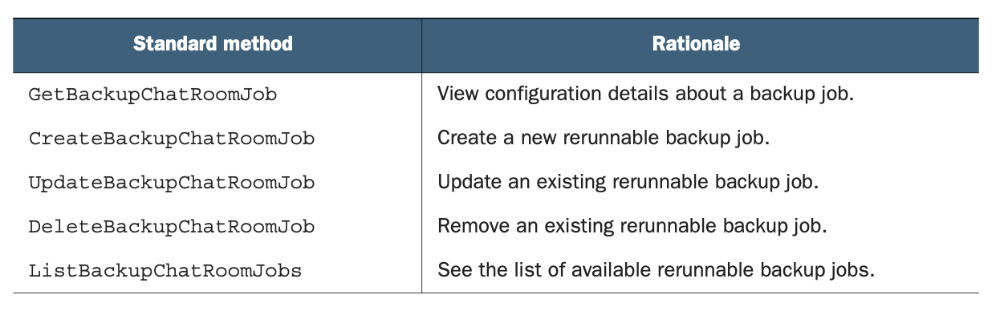
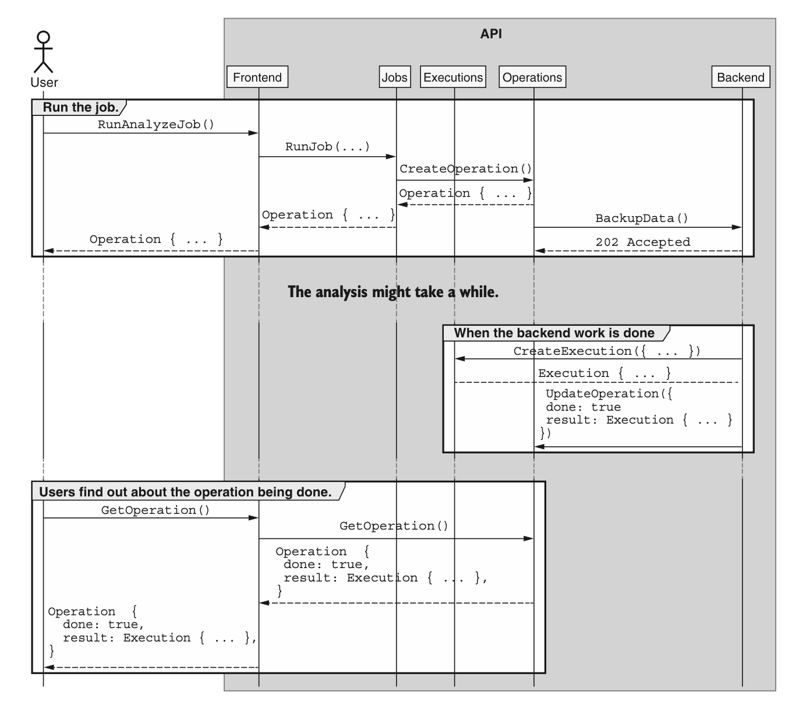
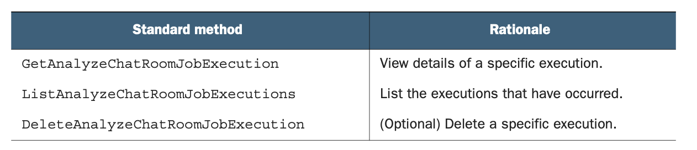

# 第 11 章 可重运行作业

<div style="background:#f7f5e6; padding:24px; border-radius:4px; color:#405a73;">

**本章内容**
- 什么是可重运行 job
- 可重运行 job 与长时间运行的操作有何不同
- 如何将可重运行 job 表示为资源
- 相比返回 LRO 的自定义方法，支持可重运行 job 的好处
- 如何使用 job 执行资源来表示 job 结果
</div><br/>

在许多情况下，API 需要公开一些可重复运行的可定制功能；
然而，我们并不总是希望每次需要运行该功能时都必须提供其所有细节。
此外，我们可能希望能够按照由 API 服务器拥有和维护的时间表来执行这部分可配置的工作，而不是由客户端调用。
在本模式中，我们将探讨一种标准，用于定义可配置且可重运行的特定工作单元，这些工作单元可能由 API 中具有不同访问级别的用户来执行。我们还提供了一种用于存储每次执行输出的模式。

<a id="motivation"></a>
## 11.1 动机

正如我们在 [第 10 章](ch10.md) 中所学，有时我们会在 API 中遇到不能或不应立即返回的方法。
具备处理异步执行的能力显然非常有价值；
然而，它仍然要求客户端通过调用 API 方法来在某个地方触发调用。
对于只打算按需运行的方法来说，这没问题，但有三种场景仅靠一个返回 LRO 的方法并不能完全解决，值得考虑。

<ins>首先，对于典型的异步运行的自定义方法，每次调用都要求调用者提供该方法所需的所有相关配置。</ins>
当方法不需要太多配置时，这可能简单直接，但随着配置参数的数量随时间增加，每次调用时都会提供相当多的信息。
这使得源代码控制变得更加重要，因为追查存储在 Jim 笔记本电脑上某处的配置参数错误可能会带来各种挑战。
能够将这些配置参数存储在 API 本身中，可能是一个非常有用的功能。

<ins>其次，对于按需调用方法的模型，我们将两组权限混为一谈：运行方法的权限和选择该方法调用参数的权限。</ins>
这通常不是什么大问题，但同样，随着配置参数的复杂性随时间不断增长，我们可能希望将职责分为两组：能够配置方法应如何调用的人，以及能够调用该方法的人。
当 API 用户开始将开发人员和运维人员区分为具有不同职责和权限的不同团队时，这一点变得尤为重要。
正如你可能猜到的，要强制执行诸如 “用户 A 只能使用这些确切的配置参数调用此方法” 之类的权限是很困难的。

<ins>最后，虽然按需运行方法已经让我们走了很远，但很有可能最终我们会希望能够按照某种周期性时间表自动调用方法。</ins>
虽然当然可以设置一个客户端设备来按特定时间表进行这些各种 API 调用（例如，使用一个根据 crontab 中的定义运行脚本的服务器），但这会引入一个新的、可能容易出错的子系统来负责这项工作的成功。
相反，如果我们能在 API 本身中配置调度，以便服务可以在没有外部参与的情况下为我们调用方法，那会简单得多。

<ins>我们或许应该为可配置 job 定义一个标准，使其能够存储各种配置参数，并根据需要（可能按时间表）重新运行。</ins>

<a id="overview"></a>
## 11.2 概述

为了解决这三种场景，我们可以依赖一个简单但强大的概念：作业 (job)。
 job 是一种特殊类型的资源，它将按需版本的 API 方法分解为两部分。
当我们调用典型的 API 方法时，我们提供要完成工作的配置，该方法立即使用该配置执行工作。
<ins>对于 job ，这些变成了两个不同的功能部分。
首先，我们创建一个包含应完成工作配置的 job 。
然后，稍后我们可以通过在 Job 资源上调用一个名为 “run” 的自定义方法来执行实际工作。</ins>
图 11.1 展示了一个概述我们如何使用 job 的 API 调用序列示例。

*图 11.1 与 Job 资源的交互*
<br/>

通过将工作拆分为两个独立的组件，我们为解决 [第 11.1 节](#motivation) 中描述的所有三种用例奠定了基础。
首先，随着配置参数数量的增长，无需担心，因为我们只需要管理它们一次：在创建 job 资源时。
从那时起，我们在调用 run 方法时不带任何参数。
其次，由于这是两个不同的 API 方法，我们可以控制谁有权访问哪一个。
很容易说某个特定用户可以有权执行预配置的 job ，但不允许创建或修改 job 。
最后，这为将来在 API 中处理调度提供了一种简单的方法。
我们可以简单地请求在特定时间表上调用一个不带任何参数的单个 API 方法，而不是使用一个接受大量参数的复杂调度系统。

描述我们想要从 job 中获得什么要容易得多，而深入了解这些神奇 job 如何工作的细节则要复杂得多。
在下一节中，我们将深入探讨 job 的细节，以及使其按预期运行所涉及的各种标准方法和自定义方法。

<a id="implementation"></a>
## 11.3 实现

为了支持这些可重运行 job ，我们需要实现两个关键组件：一个 Job 资源定义（以及所有相关的标准方法）和一个实际执行 job 预期工作的自定义 run 方法。
让我们从定义 Job 资源的样子开始。

### 11.3.1 作业资源

Job 从根本上来说就像我们在 API 中处理的任何其他资源一样。
与其他资源一样，唯一真正必需的字段是唯一标识符，正如我们在 [第 6 章](ch6.md) 中所学，理想情况下应由 API 服务来选择。
然而，这种资源的基本目标是存储一堆配置参数，用于原本会成为返回 LRO 的方法的请求消息中的内容。

以我们聊天室 API 中的备份方法为例。
支持此功能的按需方式是定义一个自定义方法，用于触发对 ChatRoom 资源及其所有消息的备份。
与备份应如何创建相关的所有参数（例如，数据应存放在哪里，以及应如何压缩或加密）都将在请求消息中。

*清单 11.1 按需自定义备份方法*

```typescript
abstract class ChatRoomApi {
  @post("/{id=chatRooms/*}:backup")
  // 作为按需异步方法，我们返回一个 LRO，带有标准响应接口结果类型
  BackupChatRoom(req: BackupChatRoomRequest):
    Operation<BackupChatRoomResponse, BackupChatRoomMetadata>;
}

interface BackupChatRoomRequest {
  id: string; // 该标识符指向正在备份的聊天室资源
  destination: string;
  compressionFormat: string; // 这些代表备份操作的不同配置参数
  encryptionKey: string;
}

interface BackupChatRoomResponse {
  destination: string; // 该响应仅用于指向备份数据在外部存储系统中的存放位置
}

interface BackupChatRoomMetadata {
  messagesCounted: number;
  messagesProcessed: number;
  bytesWritten: number;
}
```

正如我们将在 [第 23 章](ch23.md) 中学到的，这个方法当然会起作用，并返回备份位置作为结果。
然而，正如我们在 [第 11.1 节](#motivation) 中所讨论的，这可能会带来各种问题。
也许我们希望管理员能够触发备份操作，但我们不希望他们选择加密密钥，或以任何超出时间安排的重要方式配置操作的细节。
或者，也许我们希望有一个调度服务负责触发备份，但我们希望能够单独配置重复行为，这意味着调度服务只应触发备份，而将所有配置方面留给其他人。

我们可以很容易地将这个按需 API 方法转变为可重运行的 job 资源：只需将原本会在请求消息中提供的内容移到 BackupChatRoomJob 资源上，并将这些字段视为可配置字段。

*清单 11.2 用于备份聊天数据的 Job 资源*

```typescript
interface BackupChatRoomJob {
  id: string;
  chatRoom: string; // 注意这个新资源带有标识符，我们将请求中的标识符字段重命名为chatRoom，作为待备份资源的引用
  destination: string;
  compressionFormat: string; // 请求消息中的所有其他字段也应当存在于BackupChatRoomJob资源中
}
```

由于我们现在处理的是资源，而不是返回 LRO 的按需 API 方法，我们需要支持通常的标准方法集合。
我们将在最终的 API 定义中详细讨论这些内容（参见 [第 11.3.4 节](#final-api-definition) ），但表 11.1 总结了我们应实现的标准方法及其理由。

*表 11.1 标准方法及每种方法的理由* <br/>
<br/>

<ins>正如我们在 [第 7 章](ch7.md) 中看到的，在某些场景下，某些方法可能会从 API 服务中省略。</ins>
在这种情况下，这些 BackupChatRoomJob 资源有可能被视为不可变的。
换句话说，这些资源被创建后就不再修改的情况并不罕见。
相反，用户可能会删除现有资源并创建一个新资源，以避免任何潜在的并发问题（例如，如果 job 在我们更新它时正在运行）。
在这种情况下，省略标准 update 方法当然是可以接受的。

<ins>此外，虽然按需方法返回了一个长时间运行的操作（因为它可能有大量工作要执行），但这些标准方法应该是即时且同步的。</ins>
这是因为我们已经从这些方法中去除了实际工作，让它们专注于配置。
在下一节中，我们将看看如何实际触发作资源本身来执行我们通过这些标准方法配置的工作。

### 11.3.2 自定义 run 方法

假设我们已经创建并预配置了一个 Job 资源，下一步就是实际执行该 job ，以便执行我们所配置的工作。
为此，每个 Job 资源都应有一个自定义的 run 方法，负责执行底层工作。
这个 run 方法不应接受任何其他参数（毕竟，我们要确保所有相关配置都作为 Job 资源的一部分被持久化），并且应返回一个 LRO，如 [第 10 章](ch10.md) 所述，最终解析为类似我们按需自定义方法的响应消息。

*清单 11.3 可重运行备份 job 的自定义 run 方法*

```typescript
abstract class ChatRoomApi {
  @post("/{id=backupChatRoomJobs/*}:run") // 这个自定义run方法遵循第9章讨论的标准
  RunBackupChatRoomJob(req: RunBackupChatRoomJobRequest):
    Operation<RunBackupChatRoomJobResponse,
      RunBackupChatRoomJobMetadata>; // 由于存在较多工作要处理，我们可以直接返回一个 LRO
}

interface RunBackupChatRoomJobRequest {
  id: string; // 关键在于运行时不能传入额外的配置信息
}

interface RunBackupChatRoomJobResponse {
  destination: string; // 字段名做了重命名，但使用与按需自定义方法相同的字段
}

interface RunBackupChatRoomJobMetadata {
  messagesCounted: number;
  messagesProcessed: number;
  bytesWritten: number;
}
```

如你所见，虽然大多数字段保持不变，但有几个消息名称略有改动，以适应这个新结构。
例如，我们不再使用 BackupChatRoomResponse 消息，而是使用 RunBackupChatRoomJobResponse。
<ins>同样至关重要的是要指出，RunBackupChatRoomJobRequest 只接受一个输入：要运行的 Job 资源的标识符。
与 job 执行本身相关的任何其他信息都应存储在资源上，绝不在执行时提供。</ins>

同样需要注意的是，虽然这个示例有一个明确的输出，即说明备份数据目标位置的响应（也许是 s3:///backup-2020-01-01.bz2 ），但许多其他可重运行 job 可能不遵循同样的模式。
有些可能通过修改其他现有资源（例如 BatchArchiveChatRoomsJob）或创建新资源（例如我们将在 [第 23 章](ch23.md) 中看到的 ImportChatRoomsJob）来执行工作。
还有一些可能具有完全短暂的输出，产生某种并非设计为永久存储的分析结果。
不幸的是，这些情况可能会带来一个问题，原因很重要：LRO 资源的保留并非一成不变（参见 [第 13.3.10 节](ch13.md#todo)）。
那么我们能做什么呢？

### 11.3.3 作业执行资源

在某些情况下，可重运行 job 的结果对 API 没有任何持久性影响。
这意味着调用 job 的自定义 run 方法除了创建 LRO 资源之外，不会向 API 写入任何实际数据；
不更新现有资源，不创建新资源，不向外部数据存储系统写入数据，什么都没有！

虽然这本身没有任何问题，但它导致了一个重要的依赖关系。
突然之间，此 job 所做工作的持久性取决于 API 对 LRO 的持久性策略是什么。
而且，正如我们在 [第 13.3.10 节](ch13.md#todo) 中指出的，这个策略相当宽泛。
虽然它鼓励永久持久化且永不删除任何记录，但没有什么能阻止 API 让 Operation 资源在一段时间后过期并消失。

由于我们可能希望这些 job 输出的持久性策略不同于系统中所有 LRO 的持久性策略，我们有两个选择。
第一个是改变我们保留 LRO 资源多长时间的策略，以符合我们对这种特定类型 job 的期望。
第二个是让不同的操作在不同的时间后过期（例如，大多数操作在 30 天后过期，但特定类型 job 的操作永久保留）。
虽然第一个是合理的，尽管可能有些过度，但第二个会导致不一致和不可预测性，最终意味着我们的 API 将更加令人困惑且可用性更低。
那么我们还能做什么呢？

<ins>第三种选择是依赖一种子资源集合，其行为有点像 Operation 资源，称为执行。
每个 Execution 资源将代表可在这些不同 job 资源上调用的自定义 run 方法的输出，与 LRO 不同，它们可以有自己的（通常是永久的）持久性策略。</ins>

例如，考虑一个分析方法，它检查聊天室并得出句子复杂度评分、消息整体情感评分，以及聊天中是否存在辱骂性语言的评分。
由于我们希望定期运行此分析，我们希望将此功能作为可重运行 job 实例提供，但显然此分析 job 的结果不是现有资源或外部数据源。
相反，我们必须定义一个 Execution 资源来表示分析 job 单次运行的输出。

*清单 11.4 用于分析聊天数据的 Execution 资源示例*

```typescript
interface AnalyzeChatRoomJobExecution {
    // 由于这是一个独立资源，它需要自身的唯一标识符。
    id: string;
    // 为了明确本次执行所使用的配置，我们存储AnalyzeChatRoomJob资源的快照。
    job: AnalyzeChatRoomJob;
    // 所有分析结果信息都保存在Execution资源中。
    sentenceComplexity: number;
    sentiment: number;
    abuseScore: number;
}
```

现在，对自定义 run 方法的调用仍会创建一个 Operation 资源来跟踪正在执行的 job 的工作，
但一旦完成，API 不会返回一个用于立即消费的短暂输出接口（例如包含 sentiment 字段的东西），
而是会创建一个 AnalyzeChatRoomJobExecution 资源，并且 LRO 将返回对该资源的引用。
这有点像是异步标准 create 方法最终会在 LRO 解析时返回所创建资源的方式。

*清单 11.5 使用 Execution 资源的自定义 run 方法的定义*

```typescript
abstract class ChatRoomApi {
    // 分析任务的标准create方法
    @post("/analyzeChatRoomJobs")
    CreateAnalyzeChatRoomJob(req: CreateAnalyzeChatRoomJob):
        AnalyzeChatRoomJob;

    // 注意：我们返回一个Operation资源，其结果类型为Execution资源
    @post("/{id=analyzeChatRoomJobs/*}:run")
    RunAnalyzeChatRoomJob(req: RunAnalyzeChatRoomJobRequest):
        Operation<AnalyzeChatRoomJobExecution, RunAnalyzeChatRoomJobMetadata>;
}
```

如你所见，自定义 run 方法几乎与我们之前的备份示例相同，但结果是一个 Execution 资源，而不是短暂的响应接口。
为了更清楚地看到这一点，图 11.2 展示了运行 job 的过程以及在 API 底层应该发生什么。

*图 11.2 与具有 Execution 结果的 Job 资源的交互* 

<br/>

最后，由于这些执行是真正的资源，我们必须实现一些标准方法才能使它们有用。
在这种情况下，这些资源是不可变的，因此我们不需要实现标准 update 方法；
然而，它们也仅由内部流程创建（从不由最终用户创建）。
因此，我们也不应实现标准 create 方法。
表 11.2 总结了我们需要的执行标准方法及其背后的理由。

*表 11.2 标准方法及每种方法的理由摘要*

<br/>

最后一个问题是关于资源布局：这些执行应该位于资源层次结构中的哪个位置？
与处理 API 中所有资源的 LRO 不同，执行是针对单一 job 类型设计和确定作用域的。
此外，由于我们想要提出的最常见问题之一是 “此特定 job 发生了哪些执行？”，因此将这些执行限定在该 job 的上下文中是很有意义的。
换句话说，我们期望从执行中获得的行为表明，这些资源的最佳位置是作为 job 资源本身的子级。

<a id="final-api-definition"></a>
### 11.3.4 最终 API 定义

对于最终的 API 定义，清单 11.6 展示了用于分析聊天室消息的所有 API 方法和接口。
在这个实例中，输出依赖一个 execution 资源来永久存储结果。

*清单 11.6 最终 API 定义*

```typescript
abstract class ChatRoomApi {
  @post("/analyzeChatRoomJobs")
  CreateAnalyzeChatRoomJob(req: CreateAnalyzeChatRoomJobRequest):
    AnalyzeChatRoomJob;

  @get("/analyzeChatRoomJobs")
  ListAnalyzeChatRoomJobs(req: ListAnalyzeChatRoomJobsRequest):
    ListAnalyzeChatRoomJobsResponse;

  @get("/{id=analyzeChatRoomJobs/*}")
  GetAnalyzeChatRoomJob(req: GetAnalyzeChatRoomJobRequest):
    AnalyzeChatRoomJob;

  @patch("/{resource.id=analyzeChatRoomJobs/*}")
  UpdateAnalyzeChatRoomJob(req: UpdateAnalyzeChatRoomJobRequest):
    AnalyzeChatRoomJob;

  @post("/{id=analyzeChatRoomJobs/*}:run")
  RunAnalyzeChatRoomJob(req: RunAnalyzeChatRoomJobRequest):
    Operation<AnalyzeChatRoomJobExecution, RunAnalyzeChatRoomJobMetadata>;

  @get("/{parent=analyzeChatRoomJobs/*}/executions")
  ListAnalyzeChatRoomJobExecutions(req: ListAnalyzeChatRoomJobExecutionsRequest):
    ListAnalyzeChatRoomJobExecutionsResponse;

  @get("/{id=analyzeChatRoomJobs/*/executions/*}")
  GetAnalyzeChatRoomExecution(req: GetAnalyzeChatRoomExecutionRequest):
    AnalyzeChatRoomExecution;
}

interface AnalyzeChatRoomJob {
  id: string;
  chatRoom: string;
  destination: string;
  compressionFormat: string;
}

interface AnalyzeChatRoomJobExecution {
  id: string;
  job: AnalyzeChatRoomJob;
  sentenceComplexity: number;
  sentiment: number;
  abuseScore: number;
}

interface CreateAnalyzeChatRoomJobRequest {
  resource: AnalyzeChatRoomJob;
}

interface ListAnalyzeChatRoomJobsRequest {
  filter: string;
}

interface ListAnalyzeChatRoomJobsResponse {
  results: AnalyzeChatRoomJob[];
}

interface GetAnalyzeChatRoomJobRequest {
  id: string;
}

interface UpdateAnalyzeChatRoomJobRequest {
  resource: AnalyzeChatRoomJob;
  fieldMask: string;
}

interface RunAnalyzeChatRoomJobRequest {
  id: string;
}

interface RunAnalyzeChatRoomJobMetadata {
  messagesProcessed: number;
  messagesCounted: number;
}

interface ListAnalyzeChatRoomJobExecutionsRequest {
  parent: string;
  filter: string;
}

interface ListAnalyzeChatRoomJobExecutionsResponse {
  results: AnalyzeChatRoomJobExecution[];
}

interface GetAnalyzeChatRoomJobRequest {
  id: string;
}
```

<a id="trade-offs"></a>
## 11.4 权衡

正如我们所见，可重运行作业是一个非常有用的概念，但它们是解决该问题集的众多方案之一。
例如，如果我们担心配置与执行自定义方法的权限问题，我们可以实现一个更高级的权限系统，检查请求并验证给定用户不仅能调用特定的 API 方法，还能使用特定的参数集或参数范围调用该方法。
这当然对每个参与者来说工作量要大得多，但它比将方法拆分为两部分（配置和运行）是一个更细粒度的选项。

当涉及到执行资源时，我们当然有一个替代方案，就是简单地永久保留 Operation 资源作为输出的引用。
唯一的缺点是，需要筛选 Operation 资源列表以检索与感兴趣的 Job 资源相关的那些资源，但这确实是一个替代方案。

<a id="exercises"></a>
## 11.5 练习

1. 可重运行作业如何使区分执行操作的权限和配置该操作的权限成为可能？

2. 如果运行作业导致创建了新资源，结果应该是执行资源还是新创建的资源？

3. 为什么执行资源绝不应被显式创建？

<a id="summary"></a>
## 本章小节

- 可重运行作业是一种很好的方式，可以将能够配置任务的用户与能够执行同一任务的用户隔离开来。

- 作业是首先被创建和配置的资源。
之后，这些作业可以使用自定义 run 方法执行。

- 当作业不操作或创建现有资源时，Job 资源运行的结果通常是一个 Execution 资源。

- Execution 资源类似于只读资源，可以被列出和检索，但不能被显式更新或创建。
