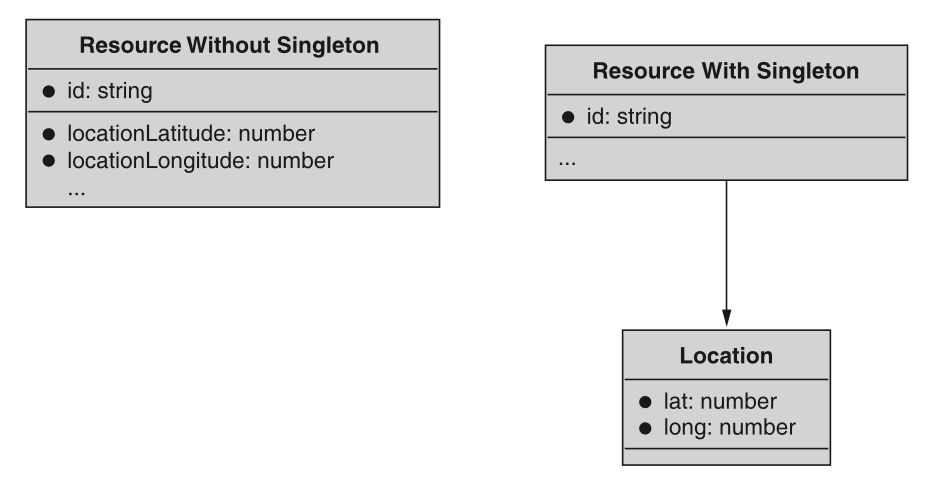
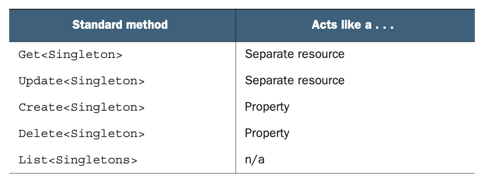
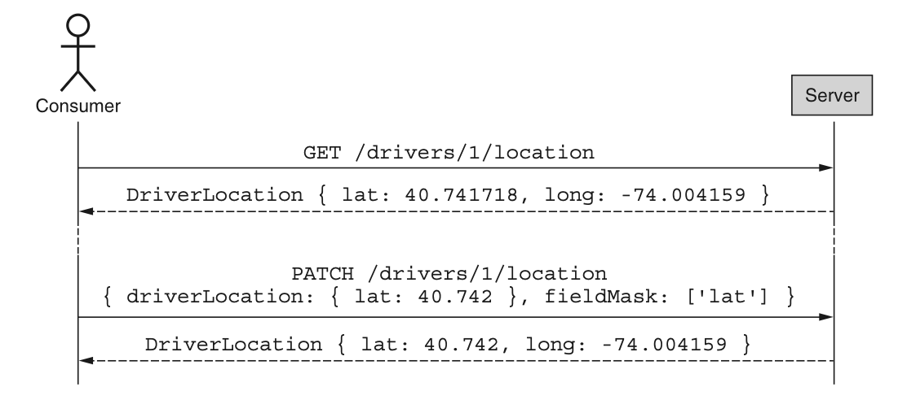
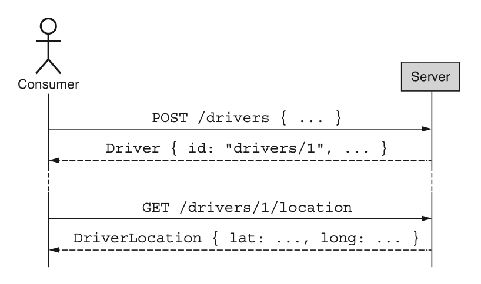
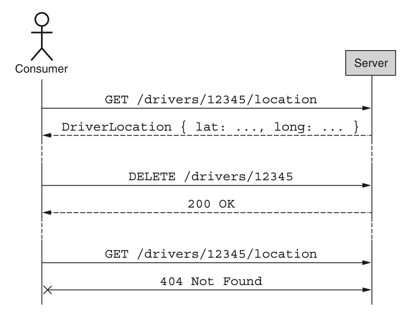
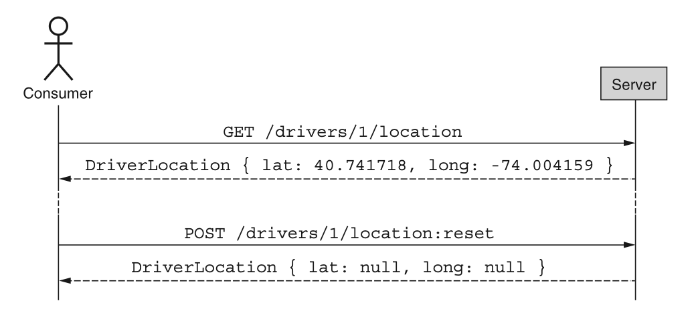

# 第 12 章 单例子资源

<div style="background:#f7f5e6; padding:24px; border-radius:4px; color:#405a73;">

**本章内容**
- 什么是单例子资源
- 为什么以及何时应将数据拆分到单例子资源中
- 标准方法如何与子资源交互
- 单例子资源在资源层次结构中的位置
</div><br/>

在本模式中，我们将探讨一种组织相关但独立数据的方式，方法是将数据从资源上的一组属性移动为该资源的单例子级。
<ins>此模式处理以下场景：特定的数据集合可能独立于父级发生变化、具有不同的安全要求，或者可能太大而无法直接作为资源的一部分存储。</ins>

<a id="motivation"></a>
## 12.1 动机

在构建 API 时，我们有时会遇到这样的情况：资源中的某些组成部分显然应作为资源上的属性，但由于某种原因，该组成部分作为常规属性并不实际。
换句话说，根据 API 设计最佳实践，该组成部分绝对最适合作为属性，但在这种情况下遵循这些最佳实践并不切实际，最终会给 API 使用者带来更差的体验。
例如，如果有一个表示共享文档的资源，它可能还需要存储访问控制列表（ACL），该列表决定谁有权访问该文档以及以何种身份访问。
正如你可能想象的，这个 ACL 列表可能会变得非常庞大（数百甚至数千条访问规则），并且每次我们浏览文档列表时（例如，使用 ListDocuments 方法）都检索整个 ACL，往往会浪费带宽和计算资源。
此外，在大多数场景下，ACL 的细节甚至不是我们感兴趣的。
我们只在非常特定的场景下才关心 ACL。

<ins>显而易见的答案是像这样分离组成部分，但这引出了两个不可避免的问题。
首先，我们如何决定某样东西是否值得以某种方式拆分？
其次，一旦我们决定某样东西应该与主资源分离，我们如何实现这种分离？</ins>

让我们先关注第一个问题，探讨一些我们可能想要将组成部分从父资源移到单独子资源的原因。
之后，我们可以深入探讨如何使用单例子资源模式来实现这种分离。

### 12.1.1 为什么我们应该使用单例子资源？

将组件与通常拥有该组件的资源分离有许多潜在原因。
其中一些原因是显而易见的（例如，组件比资源本身大好几倍），但其他原因则更为微妙。让我们探讨一些将组件与父资源分离的常见原因。

#### 大小或复杂性

<ins>通常，单个组件在与资源本身相比时可能会变得特别大。</ins>
如果一个组件可能变得比资源所有其他部分加起来还要大，那么将该组件与资源分离可能是有意义的。
例如，如果你有一个存储大型二进制对象（如亚马逊的 S3）的 API，将二进制数据本身与对象的元数据一起存储是不常见的。
在这种情况下，你会将两者分开：GetObject 或 GetObjectMetadata 可能返回存储在数据库中的对象元数据，但明确不包括二进制数据本身。
相反，二进制数据将通过一个完全不同的 RPC（如 GetObjectData）单独检索。

#### 安全性

<ins>通常，资源中的某些部分与其名义上所属的资源具有非常不同的访问限制。</ins>
在这种情况下，实际上可能严格要求将此信息与原本所属的资源完全分开。
例如，你可能有一个表示公司员工数据的 API，但附加到每个员工的薪酬信息很可能比员工的昵称、家乡和电话号码等更常见的信息受到更严格的限制。
因此，最合理的做法可能是将这些信息分开，要么作为一个完全独立的资源，要么使用此处描述的单例子资源模式。

#### 易变性

<ins>除了大小和安全方面的考虑之外，通常还存在某些资源的特定组件具有不寻常访问模式的场景。</ins>
特别是，如果某个组件的更新频率远高于资源上的其他组件，将它们放在一起可能会导致大量的写入争用，最终可能导致写入冲突，在极端情况下甚至导致数据丢失。
例如，假设有一个拼车 API，其中有一个 Driver 资源。
当司机的汽车行驶时，我们会希望尽可能频繁地更新资源的位置信息，以显示最新位置和司机的移动情况。
另一方面，更通用的元数据，例如车牌，可能不会频繁更改，也许根本不会更改。
因此，将频繁变化的位置信息与其他元数据分开是有意义的，这样更新就可以独立进行。

<ins>显然这不是一个详尽的列表，因为将组件与资源分离的原因有很多，但这些类别是最常见的一些场景。</ins>
现在我们已经了解了一些可能拆分事物的一般原因，让我们更详细地看看如何使用单例子资源模式在 API 中对此分离进行建模。

<a id="overview"></a>
## 12.2 概述

由于我们的目标是将资源的某个组件从简单属性移动为某种独立实体，我们可以采用的一种策略是设计一个接口，使所讨论的组件成为完整资源与资源上简单属性之间的某种混合体。
本质上，我们可以创建一种既具有完整资源的某些特征和行为，又具有简单资源属性的某些特征和行为的东西。

为了实现这一点，我们需要定义单例子资源的概念，它具有一些独特的属性和交互方法（图 12.1）。
这个单例子资源将充当简单属性和完整资源之间的某种混合体，这意味着我们将对资源的一些预期施加限制，并增加一些能力来增强我们对资源属性的预期。

现在我们已经理解了这种模式如何工作的高层概念，让我们更具体地看看这些单例子资源应该如何表现。

*图 12.1 子资源* <br/>
<br/>

<a id="implementation"></a>
## 12.3 实现

一旦我们决定应该将某些内容从简单的资源属性拆分为单独的单例子资源，我们就需要弄清楚与这些子资源交互的接口究竟是什么样的。
如表 12.1 所示，如果我们通过查看之前学到的标准方法集来考虑与单例子资源的交互，
那么很明显，某些方法呈现出常规资源的行为，而另一些则呈现出简单资源属性的行为。

<a id="tab-12-1"></a>
*表 12.1 单例子资源的摘要行为*  <br/>
<br/>

### 12.3.1 标准方法

#### GET 和 UPDATE

如表 12.1 所示，检索（get）和修改（update）标准方法的行为与它们在任何其他资源上的行为完全一样。
这意味着单例子资源像常规资源一样可以通过标识符唯一寻址，并且可以以传统方式通过部分替换属性（例如，通过 PATCH HTTP 动词）进行修改。
为了完全清晰，下面的序列图（参见图 12.2）展示了我们如何检索和修改单例子资源。

*图 12.2 与单例子资源交互的摘要* <br/>
<br/>

最终，这意味着我们为单例子资源定义的 get 和 update 方法与常规资源的方法完全相同。
重要的是要记住，寻址单例子资源是通过唯一标识符完成的，而不是使用父资源的标识符。
换句话说，GetDriverLocation 像任何其他检索方法一样接受唯一标识符（例如 `drivers/1/location`），而不是像我们在 list 方法中看到的那样接受父标识符。

#### **CREATE**

继续 [表 12.1](#tab-12-1)，我们可以看到 create 方法更像一个属性。
这意味着单例子资源仅因其父级存在而存在。
换句话说，就像不需要在资源上显式创建属性（例如 `Driver.licensePlate` 属性）一样，也不需要显式创建 `DriverLocation` 资源。
相反，它必须在父资源存在时随之存在。

这也意味着，与单例子资源交互不需要任何显式的初始化。
这并不是说父资源创建后永远不需要更新子资源的属性；而是说，不应该有一个需要执行的特定初始化方法才能开始更新子资源本身。
图 12.3 展示了父资源创建单例子资源的一次交互示例。

*图 12.3 创建父资源会导致创建单例子资源。* <br/>
<br/>

这就引出了一个显而易见的问题：我们如何在创建父资源时准确地初始化存储在单例子资源中的数据？
换句话说，有没有办法在创建 Driver 资源时同时初始化 DriverLocation 信息？
简单的答案是否定的。

将某些东西分离为子资源的全部意义在于以某种方式将其与父资源隔离开来。
这可能是为了应对 [第 12.1 节](#motivation) 中讨论的任何主题（例如易变性），但这种分离的后果是子资源通常与父资源分开。
<ins>虽然父资源的创建意味着子资源的存在，但对子资源中存储的信息的任何更改都需要单独进行，因为两者最终是完全独立的资源。</ins>
换句话说，在单个 CreateDriver 方法中创建 Driver 并设置 DriverLocation 子资源中的信息，并不比通过单个 CreateDriver 调用创建两个独立的 Driver 资源更可行。

<ins>这意味着为单例子资源选择合理的默认值很重要，这样即使它们被隐式初始化，也可能有用。</ins>

#### **DELETE**

<ins>正如创建父资源会导致创建单例子资源一样，删除该父资源也必须删除该单例子资源。</ins>
换句话说，有点类似于关系数据库允许基于外键约束进行级联删除，父资源的删除会向下级联到任何附加的单例子资源。
本质上，这意味着在删除方面，单例子资源的行为更像属性，而不是独立资源。
为了演示这一点，图 12.4 展示了一个级联删除的示例交互。

*图 12.4 单例子资源随父资源一起被删除。* <br/>
<br/>

**警告** 如果级联删除会令人意外，或者不符合典型消费者的预期，这通常是一个好迹象，表明单例子资源模式不太适合该用例。

这涵盖了标准删除操作，但它也引出了关于非标准删除的一些重要问题，
例如：“当删除父资源不是即时的，而是使用 LRO（参见 [第 10 章](ch10.md) ）或依赖软删除模式（ [第 25 章](ch25.md) ）时，我们该怎么办？”
由于删除会导致子资源主要像属性一样行事，而不是像独立资源，我们可以将这种非标准行为一并转移过来。
这意味着已被标记为删除的父资源在父资源删除完成之前仍然存在。
同样，如果删除父资源可能需要一段时间，因此依赖 LRO 来跟踪该删除的进度，那么子资源只能在删除父资源的操作完成后才会被删除。

### 12.3.2 重置

在某些情况下，可能需要将单例子资源本身恢复为一组合理的默认值，特别是当父资源首次创建时所设置的那些值。
在这种情况下，API 应支持一个 reset 方法，该方法会将这些值原子性地设置为其原始默认值，就像单例子资源刚刚随着父资源的创建而存在一样。
图 12.5 展示了一个重置子资源的示例交互。

*图 12.5 如果实现了重置单例子资源，则必须恢复合理的默认值。* <br/>
<br/>

### 12.3.3 层级结构

现在我们已经了解了如何与单例子资源交互，澄清这些单例与其父级之间层级关系的一些重要细节是很重要的。

#### 必需的父级

顾名思义，子资源应从属于某个父资源。
<ins>这意味着单例子资源应始终有一个父资源，并且不应附加在 API 层级结构的根级别。
原因是全局单例在功能上等同于全局共享锁，即单个资源实例在 API 的所有潜在消费者之间共享。
正如你可能想象的，在 API 的所有潜在消费者之间共享全局状态会引入显著的写入争用，将所有写入流量集中到单个资源上。</ins>

#### 完整资源父级

另一个需要考虑的常见边缘情况是，单例子资源是否可以拥有自己的单例子资源。
简而言之，如果一个单例子资源充当其他单例的父级，那么这些单例应改为成为该父资源本身的同级。
<ins>简单地说，让一个单例充当另一个单例的父级确实没有任何附加价值。</ins>

### 12.3.4 最终 API 定义

综合本实现中的所有细节，我们可以为示例服务定义 API，其中我们有 Driver 资源，这些资源拥有 DriverLocation 单例子资源。最终的 API 定义如清单 12.1 所示。

*清单 12.1 使用单例子资源模式的最终 API 定义*

```typescript
abstract class RideSharingApi {
  static version = "v1";
  static title = "Ride Sharing API";

  @get("/drivers")
  ListDrivers(req: ListDriversRequest): ListDriversResponse;

  @post("/drivers")
  CreateDriver(req: CreateDriverRequest): Driver;

  @get("/{id=drivers/*}")
  GetDriver(req: GetDriverRequest): Driver;

  @patch("/{resource.id=drivers/*}")
  UpdateDriver(req: UpdateDriverRequest): Driver;

  @delete("/{id=drivers/*}")
  DeleteDriver(req: DeleteDriverRequest): void;

  @get("/{id=drivers/*/location}")
  GetDriverLocation(req: GetDriverLocationRequest): DriverLocation;

  @patch("/{resource.id=drivers/*/location}")
  UpdateDriverLocation(req: UpdateDriverLocationRequest): DriverLocation;
}

interface Driver {
  id: string;
  name: string;
  licensePlate: string;
  // 注意：司机的位置并未作为 location 属性设置。它被拆分为一个单例子资源。
}

interface DriverLocation {
  // 记住：DriverLocation 资源的唯一标识符完全依赖于 Driver 资源的标识符。
  // 换句话说，一个名为 drivers/1 的 Driver，会拥有一个名为 drivers/1/location 的 DriverLocation。
  id: string;
  lat: number;
  long: number;
  updateTime: Date;
}

interface GetDriverRequest {
  id: string;
}

interface UpdateDriverRequest {
  resource: Driver;
  fieldMask: FieldMask;
}

interface ListDriversRequest {
  maxPageSize: number;
  pageToken: string;
}

interface ListDriversResponse {
  results: Driver[];
  nextPageToken: string;
}

interface CreateDriver {
  driver: Driver;
}

interface DeleteDriverRequest {
  id: string;
}

interface GetDriverLocationRequest {
  id: string;
}

interface UpdateDriverLocationRequest {
  resource: DriverLocation;
  fieldMask: FieldMask;
}
```

<a id="trade-offs"></a>
## 12.4 权衡

正如我们在实现此模式时所了解到的，使用这种设计会带来一些权衡，特别是我们会失去一些东西。
让我们更深入地探讨这些，从父资源和子资源的原子性开始。

### 12.4.1 原子性

在使用单例子资源模式时，我们看到子资源具有属性的一些特征和资源的一些特征，
特别是创建行为像属性（我们从不创建单例子资源；它只是存在），而其他行为更像实际资源（我们直接更新资源，而不是通过寻址其父资源）。
这样做的一个副作用是，我们不再有办法同时与资源和子资源进行交互。
换句话说，我们无法同时以原子方式与父资源和子资源进行交互。

尽管这当然是一个限制（毕竟，当 DriverLocation 信息是 Driver 资源上的属性时，我们可以在创建 Driver 资源的同时指定特定的位置），但这个限制是刻意设计的。
我们将子资源与父资源分离的主要目标是隔离这组特定信息，也许是因为它很大，也许是因为它有非常特定的安全要求。
换句话说，这种权衡更多是一种特性，即使它可能意味着某些以前容易做到的常见操作不再可能。

### 12.4.2 恰好一个子资源

依赖单例子资源模式的另一个重要权衡是，子资源只能有一个。
这意味着，与可以包含许多相同类型子资源的传统子集合不同，一旦我们采用了这种模式，这个特定子资源就只能有一个实例。

<a id="exercises"></a>
## 12.5 练习

1. 属性数据需要变得多大，才有必要将其拆分到单独的单例子资源中？
在做决定时需要考虑哪些因素？

2. 为什么单例子资源只支持两种标准方法（get 和 update）？

3. 为什么单例子资源支持自定义的 reset 方法，而不是重新利用标准 delete 方法来达到相同的目的？

4. 为什么单例子资源不能在资源层次结构中作为其他单例子资源的子级？

<a id="summary"></a>
## 本章小节

- 单例子资源是属性和资源之间的混合体，用于存储资源固有但位于单独隔离位置的数据。

- 由于多种原因，数据可能会从资源中分离到单例子资源中，例如大小、复杂性、单独的安全要求，或不同的访问模式及其导致的易变性。

- 单例子资源支持标准 get 和 update 方法，但它们永远不应被创建或删除，因此不应支持标准 create 或 delete 方法。

- 单例子资源通常还应支持自定义的 reset 方法，该方法将资源的属性恢复为其默认状态。

- 单例子资源应附加到父资源，并且该父资源本身不应是另一个单例子资源。

