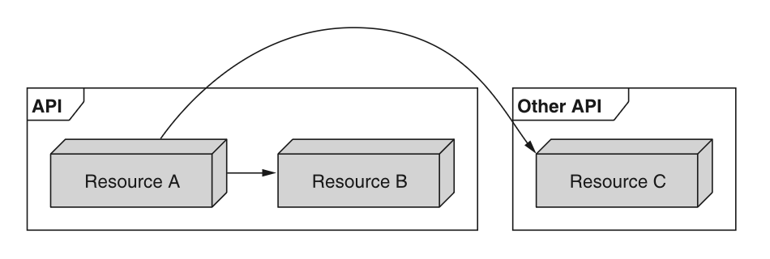
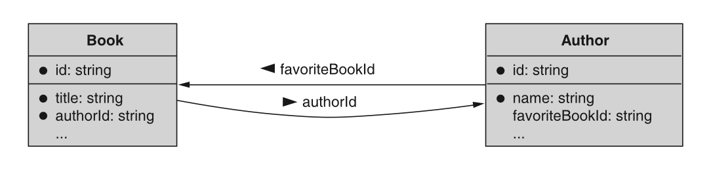

# 第 13 章 交叉引用

<div style="background:#f7f5e6; padding:24px; border-radius:4px; color:#405a73;">

**本章内容**
- 在引用其他资源时，名称字段应使用什么
- 引用字段应如何处理引用完整性问题
- 字段应在何时以及为何存储资源数据的副本
</div><br/>

在任何具有多种资源类型的 API 中，很可能需要资源相互指向。
虽然这种引用资源的方式看起来可能很简单，但许多行为细节都留待解释，这意味着存在不一致的可能性。
本模式旨在阐明这些引用应如何定义，更重要的是，它们应如何表现。

<a id="motivation"></a>
## 13.1 动机

资源很少存在于真空中。
因此，必须有一种方式让资源相互引用。
这些引用范围从本地（例如，同一 API 中的其他资源）到全局（例如，存在于更广泛互联网上其他地方的资源），也可能介于两者之间（例如，同一提供商提供的不同 API 中的资源）（图 13.1）。

*图 13.1 资源可以指向同一 API 或外部 API 中的其他资源。* <br/>
<br/>

虽然简单地通过唯一标识符来引用这些资源看起来可能很明显，但行为方面在很大程度上留给了实现者去决定。
<ins>因此，我们需要为引用资源以及支撑这些引用的行为模式定义一套指导原则。</ins>
例如，你是否应该被允许删除正在被指向的东西，还是应该禁止这样做？
如果允许，鉴于它所指向的资源已经消失，是否应该对该值进行任何后处理（例如将其重置为零值）？
还是应该保留无效指针不动？

简而言之，虽然引用资源背后的一般概念相当简单，但细节可能相当复杂。

<a id="overview"></a>
## 13.2 概述

正如你可能预期的，交叉引用模式依赖于一个资源上的引用属性指向另一个资源，使用字段名来暗示资源类型。
此引用使用表示为字符串值的唯一标识符（参见 [第 6 章](ch6.md) ），
因为它随后可以引用同一 API 中的资源、同一提供商的不同 API 中的资源，或作为标准 URI 存在于互联网上其他地方的完全独立的资源。

此外，此引用与其指向的资源完全解耦。
这允许在操作资源时具有最大的灵活性，防止循环引用将资源锁定在存在状态中，并且在单个资源被成千上万个其他资源引用时能够扩展。
然而，这也意味着消费者必须预期指针可能已过时，并且在所引用的底层资源已被移动或删除的情况下可能无效。

<a id="implementation"></a>
## 13.3 实现

此模式有几个重要方面。
在本节中，我们将更详细地探讨关于一个资源应如何引用另一个资源所必须回答的各种问题。
让我们从一个引用示例以及我们应如何命名字段来引用另一个资源开始。

### 13.3.1 引用字段名称

虽然所使用的唯一标识符可能传达被引用资源的类型和目的，但更安全的选择是使用字段名称来传达这两个方面。
例如，如果我们有一个 Book 资源引用一个 Author 资源，我们应该将存储引用的字段命名为 authorId，以传达它是 Author 资源的唯一标识符。

*清单 13.1 Author 和 Book 资源的定义*

```typescript
interface Book {
  id: string;
  // 我们使用字符串字段存储对作者资源的引用，该字段保存作者的唯一标识符。
  authorId: string;
  title: string;
  // 为简洁起见，省略其他额外字段。
  // ...
}

interface Author {
  // 作者资源的唯一标识符，该值会出现在authorId字段中。
  id: string;
  name: string;
}
```

<ins>大多数情况下，我们将引用的资源是静态类型，这意味着我们可能指向不同的 Author 资源，但所讨论的资源类型始终是 author。
然而，在某些情况下，我们指向的资源类型可能因情况而异，我们称之为动态资源类型引用。</ins>

例如，我们可能想要存储作者和书籍的变更历史。
<ins>这意味着我们不仅需要能够指向许多不同的资源，还需要能够指向许多不同的资源类型。
为此，我们应该依赖一个额外的 type 字段，用于指定所请求的目标资源的类型。</ins>

*清单 13.2 带有动态资源类型的 ChangeLogEntry 资源示例*

```typescript
interface ChangeLogEntry {
  id: string;
  targetId: string; // 目标资源的唯一标识符（例如：作者ID）
  targetType: string; // 目标资源的类型（例如：api.mycompany.com/Author）
  // ... // 此处用于存储目标资源本次变更的更多详细信息
}
```

现在我们已经了解了如何定义引用字段，让我们更深入地研究行为的一个重要方面，称为数据完整性。

### 13.3.2 数据完整性

由于我们使用简单的字符串值从一个资源指向另一个资源，我们必须担心这种数据类型所提供的自由度：没有类型级别的验证。
例如，假设以下关于某些书籍和作者资源的事件顺序。

*清单 13.3 删除被书籍引用的作者* <br/>

```typescript
author = CreateAuthor({ name: "Michelle Obama" });
// 这里我们先创建一位作者，再创建一本引用该作者的图书。
book = CreateBook({
  title: "Becoming",
  authorId: author.id
});
// 在这之后，我们从API中删除该作者资源。
DeleteAuthor({ id: author.id });
```

此时，我们就有了所谓的悬空指针（有时称为孤儿记录），即书籍资源指向了一个不再存在的作者。
在这种情况下应该发生什么？有几种选择：

1. 我们可以禁止删除该作者并抛出错误。
2. 我们可以允许删除该作者，但将 authorId 字段设置为零值。
3. 我们可以允许删除该作者，并在运行时处理这个错误的指针。

如果我们选择禁止删除该作者（或者就此而言，禁止删除任何仍有书籍注册在系统中的作者），我们就有可能给 API 消费者带来严重的不便，他们可能需要删除数百或数千本书才能删除一个作者。
此外，如果我们有两个相互指向的资源，我们将永远无法删除其中任何一个。
例如，考虑如果每个 Author 资源都有一个额外的字段用于他们最喜欢的书，并且（出于自私）一位作者将自己的书列为最喜欢的，如图 13.2 所示。
在这种场景下，我们永远无法删除这本书，因为作者将其列为最喜欢的。
我们也永远无法删除该作者，因为仍有书籍指向该作者。

*图 13.2 两个资源之间可能存在循环引用。* <br/>
<br/>

如果我们选择通过将作者指针重置为零值来允许删除，我们就避免了这种循环引用问题；
然而，由于单次调用，我们可能不得不更新数量可能很大的资源。
例如，想象一位特别多产的作者写了数百甚至数千本书。
在这种情况下，删除单个作者资源实际上会涉及更新数千条记录。
这不仅可能需要一段时间，而且系统可能无法以原子方式完成这件事。
如果无法原子性地完成，那么我们就有可能留下悬空指针，而我们的全部目的正是避免任何无效引用。

<ins>这些问题给我们留下了第三个选择：简单地要求 API 消费者预期引用字段可能无效，或者可能指向已被删除的资源。
虽然这可能不方便，但它为消费者提供了最一致的行为，并具有清晰简单的预期：应检查引用。</ins>
它也不违反标准方法施加的任何约束，例如删除是原子性的且不包含副作用。

现在我们已经探讨了在底层数据发生变化时引用应如何表现，让我们看看一个关于引用与缓存值的常见担忧。

### 13.3.3 值 vs. 引用

到目前为止，我们一直假设应使用字符串标识符引用来引用 API 中的其他资源，但这显然不是唯一的选择。
<ins>相反，在考虑如何引用 API 中其他位置的内容时，首要问题之一是存储指向其他资源的简单指针，还是存储资源本身的缓存副本。
在许多编程语言中，这就是按引用传递与按值传递的区别，前者传递内存中某物的指针，后者传递所讨论数据的副本。</ins>

<ins>这里的区别因素在于，通过依赖引用，我们始终可以确保手头的数据是新鲜且最新的。
另一方面，每当涉及副本时，我们就必须关注自上次检索以来手头的数据是否已发生变化。</ins>
反过来说，存储对资源的引用只意味着任何使用 API 的人必须发出第二次请求来检索该位置的数据。
当我们将其与手头直接拥有数据副本相比时，仅仅便利性似乎就很有诱惑力。
例如，为了检索某本书的给定作者的姓名，我们需要进行两次独立的 API 调用。

*清单 13.4 通过两次 API 调用检索书籍作者的姓名*

```typescript
// 这里我们通过一个随机的唯一标识符获取一本书。
book = GetBook({
  "id": "books/1234"
});
// 若要查看作者姓名，我们需要发起一次独立的API调用。
authorName = GetAuthor({ id: book.authorId }).name;
```

这两次调用虽然简单，但仍然是我们替代设计中所需调用次数的两倍，在替代设计中，我们在检索书籍时会返回完整的 Author 资源。

*清单 13.5 重新定义 Book 和 Author 资源以使用值*

```typescript
interface Book {
  id: string;
  title: string;
  author: Author;
  // 这里存储的是完整的作者资源对象，而不是对作者的引用。
}

interface Author {
  id: string;
  name: string;
}
```

虽然我们现在无需第二次 API 调用即可立即访问书籍的作者信息，但我们必须决定如何在服务器端填充这些数据。
我们可以在每次 GetBook 请求时从数据库中与书籍信息一起检索作者信息（例如，使用 SQL JOIN 语句），或者我们可以在书籍资源中存储作者信息的缓存副本。
前者会给数据库带来更多负载，但保证在请求时所有信息都是新鲜的，而后者将避免这个问题，但会引入数据一致性问题，我们现在必须想出一种策略来保持这个作者信息缓存的新鲜和最新。

此外，我们现在需要处理这样一个事实：每次 Author 资源增长时，GetBook 响应的大小都会增长。
如果我们在书籍的其他方面也遵循这种策略（例如，如果我们开始存储给定书籍的出版商信息），那么大小可能会继续进一步增长，可能变得失控。

最后，当期望消费者修改 Book 资源时，这种模式可能会引起混淆。
他们可以通过更新 Book 资源本身来更新作者的姓名吗？
他们如何更新作者？

*清单 13.6 带有注释的示例代码片段*

```typescript
author = CreateAuthor({ name: "Michelle Robinson" });
// 创建图书需要使用一种特殊语法，我们仅设置作者的ID字段，其余字段由系统自动填充。
book = CreateBook({
  title: "Becoming",
  author: { id: author.id }
});

// 这样做合法吗？我们能否通过更新图书来修改作者的姓名？
UpdateBook({
  id: book.id,
  author: { name: "Michelle Obama" }
});
```

<ins>由于所有这些潜在问题和棘手问题，通常最好只使用引用，然后依赖 GraphQL 之类的东西将这些各种引用拼接在一起。
这允许 API 消费者运行单个查询并获取关于给定资源以及该资源所引用资源的所有（且恰好所有）他们想要的信息，避免膨胀并消除缓存任何信息的需要。</ins>

### 13.3.4 最终 API 定义

我们可以看到最终的接口集，它们说明了如何正确地从一种资源引用另一种资源。

清单 13.7 最终 API 定义

```typescript
interface Book {
  id: string;
  authorId: string;
  title: string;
}

interface Author {
  id: string;
  name: string;
}

interface ChangeLogEntry {
  id: string;
  targetId: string;
  targetType: string;
  description: string;
}
```

<a id="trade-offs"></a>
## 13.4 权衡

如前所述，我们依赖引用的主要权衡是，我们要么需要多次 API 调用来获取相关信息，要么使用像 GraphQL 这样的东西来检索我们感兴趣的所有信息。

<a id="exercises"></a>
## 13.5 练习

1. 什么时候存储外部资源数据的副本而不是引用是有意义的？

2. 为什么在 API 系统中维护引用完整性是难以为继的？

3. 一个 API 声称要确保引用在整个 API 中保持最新。
后来，随着系统增长，他们决定放弃这一规则。
为什么这样做是危险的？

<a id="summary"></a>
## 本章小节

- 存储引用的字段通常应是字符串字段（即标识符的类型），并应以 “ID” 后缀结尾（例如 authorId）。
保存外部资源数据副本的字段显然应省略此后缀。

- 引用通常不应期望在资源的整个生命周期内得到维护。
如果其他资源被删除，引用可能会变得无效。

- 资源数据可以内联存储在引用资源中。
随着被引用的数据随时间变化，此资源数据可能会变得过时。
