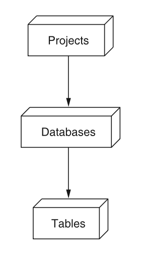
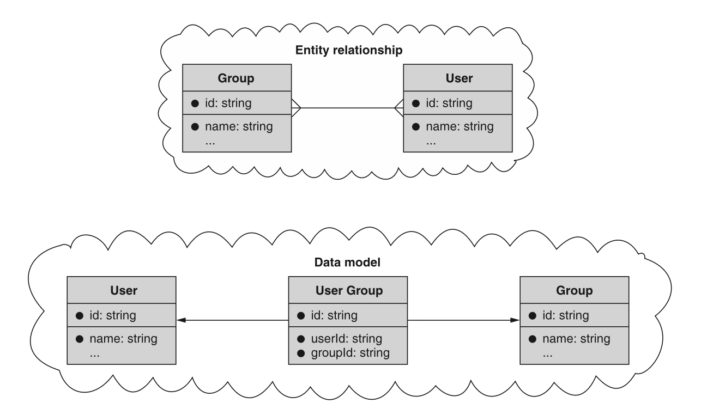
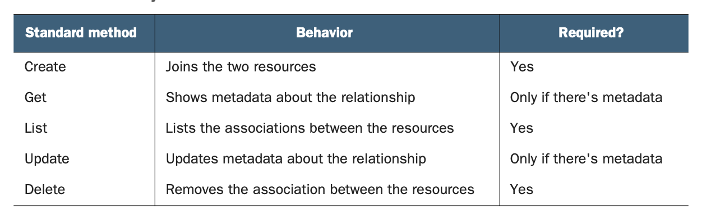
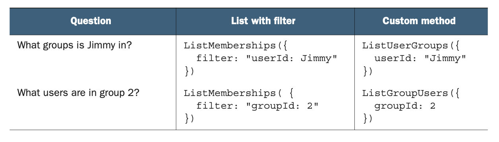
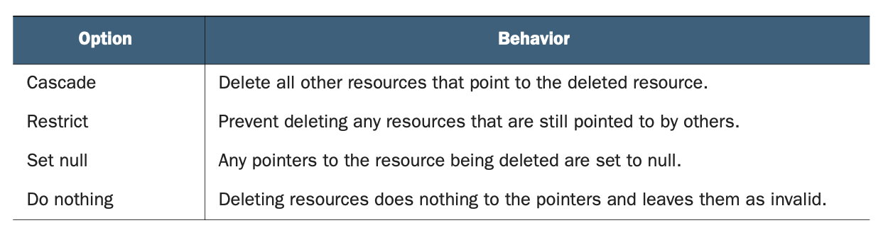

# 第 14 章 关联资源

<div style="background:#f7f5e6; padding:24px; border-radius:4px; color:#405a73;">

**本章内容**
- 如何使用关联资源处理多对多关系
- 关联资源应选择什么名称
- 如何为关联资源支持标准方法
- 处理引用完整性的策略
</div><br/>

在本章中，我们将探讨一种模式，即使用单独的关联资源来表示两个资源之间的连接，从而对两个资源之间的多对多关系进行建模。
此模式允许消费者显式地寻址两个资源之间的单个关系，以及存储和管理关于该关系的额外元数据。

<a id="motivation"></a>
## 14.1 动机

大多数时候，我们在 API 中定义的资源之间的关系会简单而明显，
因为它们往往本质上是单向的，充当从一个资源到另一个资源的指针或引用（例如，数据库 1 属于项目 1），如图 14.1 所示。
当一种资源类型以这种方式引用另一种资源时，我们说它们具有一对多关系。
虽然这些类型的关系在设计 API 时通常易于管理（通常只是一个引用其他资源的属性），但有时所需的关系更为复杂，因此更难以在易于使用的 API 中表达。

*图 14.1 资源之间的单向或层级关系* <br/>
<br/>

这些更复杂的关系中最常见的类型之一是多对多关系，其中资源类型相互关联，而不仅仅是一个指向另一个。
例如，假设我们需要跟踪人员（用户）以及他们所属的各种组（组）。
这些用户可能是许多不同组的成员，而且显然，组由许多不同的用户作为成员组成。
此外，我们可能想要跟踪关于关系本身的一些特定信息。
例如，也许我们想要存储用户加入组的确切时间，或者他们可能在组中担任的特定角色。

虽然这些多对多关系在大多数关系数据库中具有标准的规范表示形式（依赖于连接表或链接表，其中包含负责跟踪两种类型实例之间关联的行），但在 API 中如何暴露这一概念并不总是清晰的。
<ins>本模式的目标是概述一种具体方式，我们可以将这些连接表中的行作为单独的关联资源来公开，这些资源表示 API 中两个资源之间的关联。</ins>

<a id="overview"></a>
## 14.2 概述

如前所述，存储多对多关系最常见的方式，特别是在关系数据库中，是使用连接表，其中的行表示两个资源之间的关系。
例如，我们可能有一个 User 资源表、另一个 Group 资源表，然后是一个将这两个资源映射在一起的表（例如 UserGroup 资源），如图 14.2 所示。
因此，通过 API 呈现这些资源及其关系的一种显而易见的方式就是将所有表作为资源公开。
在这种场景下，数据库 schema 实际上与 API 表面一一对应，因此我们将定义一个由三个资源组成的 API：User、Group 和 UserGroup（映射或关联资源）。

*图 14.2 使用连接表存储多对多关系* <br/>
<br/>

这就引出了一个显而易见的问题：这如何工作？
在高层次上，我们可以依赖关联资源来完成大部分繁重的工作。
由于关系由实际的资源表示，因此它像任何其他资源一样被创建和删除。
在此示例中，创建 UserGroup 资源表示某人加入了一个组，删除一个则表示某人离开了一个组。
此外，我们始终可以通过使用其标识符检索特定关联（例如 GetUserGroup），并且可以通过基于其父级检索集合来列出所有关联（例如 ListUserGroups）。
要仅查看特定关联（例如，属于单个组或单个用户的关联），我们可以在列出时应用过滤器。

<ins>最后，使用关联资源最强大的方面是能够存储关于关系本身的元数据。
例如，与其仅仅存储某个用户已加入特定组，我们可以存储额外信息，例如他们何时加入或他们可能拥有什么角色（例如管理员）。
这是检索 UserGroup 资源有意义的主要原因：我们可能想要了解关于关系本身的更多细节。</ins>

### 14.2.1 关联别名方法

有时关联资源具有被一个或两个关联资源拥有的感觉。
换句话说，将一个组视为包含一个用户列表似乎很自然。
同样，将一个用户视为许多不同组的成员似乎也很自然。
此外，在这两种情况下，向我们的 API 提出这两个问题都很自然，例如，“这个用户是哪些组的成员？” 和 “这个组里有哪些用户？”

虽然我们已经注意到，我们可以简单地发出一个带有适当过滤器的请求来列出关联，但在面向资源的 API 中，消费者通常希望能够以更直接的方式思考关系，
<ins>因此，为这些类型的常见问题提供方便的别名有时是有意义的。
为了表达关联资源的这种自然对齐，我们可以选择性地在每个被关联的资源下别名一个子集合，以便我们可以使用单个未过滤的请求来提出这些问题。
我们将在后面更详细地探讨这一点，但就目前而言，只需说明这里的策略是依赖别名来提供询问关于多对多关系的常见问题的便利性即可。</ins>

<a id="implementation"></a>
## 14.3 实现

现在我们已经理解了此模式的高层策略，让我们更仔细地看看它如何工作的细节以及我们如何实现它。
让我们从命名开始。

### 14.3.1 关联资源的命名

<ins>在我们做任何其他事情之前，我们首先必须为关联资源选择一个名称。</ins>
在某些情况下，根据应用程序本身的上下文，这可能是显而易见的。
例如，在一个允许学生注册课程的学校 API 中，关联资源可能被称为 CourseRegistration 或 CourseEnrollment。
其他时候，名称可能更难找到。
例如，在同一个 API 中，存储教师（以及助教、实验室助理等）列表之间的关联在技术上不是注册或登记，因此我们只能寻找替代方案。
处理这个问题的一个常见选择是使用类似 Membership 或 Association 的名称，并加上一些修饰词来至少澄清两个被连接资源中的一个（例如 CourseMembership）。
在某些情况下，比如用户加入组或俱乐部，我们可能只称之为 Membership，不加额外的修饰词，但这在上下文中应该始终合理。

一旦我们有了资源的名称，我们就可以开始研究如何实现与其交互的各种方式。

### 14.3.2 标准方法行为

<ins>对于每个关联资源，我们至少需要实现一些标准方法。</ins>
如表 14.1 所示，我们当然需要 create 和 delete 标准方法，
而在关联资源持有元数据的常见场景中（即当我们关心关于关系的额外信息时），我们需要 get 和 update 标准方法。
最后，我们需要 list 方法来浏览各种成员关系。
所有这些方法都应完全符合标准方法，鉴于成员关系像任何其他资源一样表示，这应该很容易。

*表 14.1 关联资源上标准方法的摘要* <br/>
<br/>

<ins>在我们继续之前，重要的是要注意其他资源的标准方法实现中可能不存在的一个额外要求：唯一性约束。</ins>

### 14.3.3 唯一性

<ins>与大多数资源不同，关联资源往往有一个我们必须应用的重要唯一性约束：应该只有一个关联资源表示被关联的两个资源。</ins>
换句话说，我们通常希望确保一个用户只在一个组中成为一次成员。
为了强制执行这一点，在创建关联资源时，API 上有一个新的验证要求。

通常，仅当待创建资源使用已存在的标识符时，我们才返回资源冲突错误（HTTP状态码409 Conflict）。
但关联资源有其特殊性：两个关联资源是否本质不同，取决于被关联的两个实体是否不同。
简单来说，如代码清单 14.1 中的示例，尝试将同一用户两次加入同一个分组的操作应当失败，因为该操作正在创建存在冲突的资源。

*清单 14.1 关联相同数据导致冲突错误*

```typescript
let membershipData = { userId: "Jimmy", groupId: "2" };
// 首先我们将Jimmy加入2号群组，本次操作应当成功。
let membership1 = CreateMembership(membershipData);
// Jimmy已经是2号群组的成员，因此该请求应当失败，返回409冲突HTTP错误。
let membership2 = CreateMembership(membershipData);
```

接下来，让我们看看更新关联资源可能与我们在过去看到的略有不同之处。

### 14.3.4 只读字段

<ins>虽然关于关系的元数据可能会不时变化，但被关联的资源在资源的生命周期内不应改变。
换句话说，当我们有一个表示用户加入组的资源时，我们不应该能够更改它，使这个相同的资源表示另一个用户加入该组（或同一用户加入不同的组）。
相反，在那种场景下，我们应该简单地删除旧的关联资源，并创建一个单独的关联资源来表示新的用户-组关联。</ins>

这就引出了一个问题：当消费者尝试进行此类更改时，应该导致错误还是静默失败？
<ins>在这种情况下，两个交叉引用字段（user 和 group 字段）应被视为仅输出字段，因此在更新请求期间指定时应被忽略。</ins>

*清单 14.2 在更新时忽略只读字段*

```typescript
// 此处，我们将Jimmy以管理员角色加入2号群组。
let membership1 = CreateMembership({
  userId: "Jimmy",
  groupId: "2",
  role: "admin"
});

// 当我们尝试将用户改为Sally、角色改为普通用户时，只有角色会被更新。
// 该操作只会把Jimmy在2号群组的身份改为普通用户，对Sally不会产生任何效果。
UpdateMembership({
  id: membership1.id,
  userId: "Sally",
  role: "user"
});
```

现在我们已经了解了标准方法以及它们应如何与关联资源一起工作，让我们看看我们可能实现的一些可选便利方法，以覆盖常见的消费者场景。

### 14.3.5 关联别名方法

正如我们之前所讨论的，我们可能想要提出的最常见问题之一是哪些资源与哪些其他资源相关联。
例如，我们想快速问：“Jimmy 是哪些组的成员？” 或 “组 2 中有哪些成员？”
虽然使用应用于 ListMembershipsRequest 的特定过滤器完全可行，但我们可以通过提供回答这两个特定问题的别名方法来简化这些常见查询。

*清单 14.3 使用过滤器列出关联*

```typescript
// 这里我们构造一个ListMembershipsRequest，仅返回2号群组的成员关系。
memberships = ListMemberships({ filter: "groupId: 2" });
// 要获取2号群组内的用户，我们只需从每条成员关系中取出user字段。
usersInGroup2 = memberships.map(
  (membership) => membership.user
);

// 这里我们构造一个ListMembershipsRequest，仅返回用户为Jimmy的成员关系。
memberships = ListMemberships({
  filter: "userId: Jimmy"
});
// 要查看Jimmy所属的群组，我们只需从每条成员关系中取出group字段。
jimmysGroups = memberships.map(
  (membership) => membership.groupId
);
```

虽然这当然有效，但为这些用例专门创建方法可能是有意义的。
我们可以通过创建别名方法来做到这一点，这些方法为我们想要执行的查询提供一个隐含的（且必需的）过滤器参数。
在由 Membership 关联资源连接的 User 和 Group 资源的示例中，我们可能有两个别名，如表 14.2 所示。

*表 14.2 关联资源常见查询的别名* <br/>
<br/>

<ins>命名可能有点令人困惑，所以请记住，名称的第一个（单数）部分是拥有资源，第二个（复数）部分是被列出的内容。</ins>
因此，当我们列出 UserGroups 时，我们查看的是给定用户的组；而当我们列出 GroupUsers 时，我们查看的是给定组的用户。

### 14.3.6 引用完整性

<ins>正如我们在 [第 13 章](ch13.md) 中所看到的，API 中的引用完整性指的是，当我们引用另一个资源时，我们需要考虑该引用是否有效。</ins>
例如，如果我们删除一个仍被其他资源指向的资源，会发生什么？
更具体地说，如果我们有一个将两个资源绑定在一起的关联资源，我们如何处理删除其中一个被关联资源的请求？

在这样的场景中，我们有几个不同的选择，由大多数现代关系数据库提供并标准化，总结在表 14.3 中。

*表 14.3 引用完整性行为摘要* <br/>
<br/>

虽然选择这些选项中的每一个都有很多理由，但在处理关联资源的情况下，API 通常应选择要么在其他资源仍指向该资源时限制删除，要么简单地什么都不做，允许关联资源的引用变为无效。
如果我们改为选择级联或将指针设置为 null，我们就有可能触发大量的写入来将值设置为 null（例如，有 100 亿个资源指向被删除的资源），
或者引发删除的雪崩（例如，如果一次删除触发另一次删除，后者又触发另一次删除，如此往复）。
<ins>简而言之，这意味着如果我们试图删除一个有关联资源引用它的资源，我们应该要么返回前置条件失败错误（HTTP 代码 412），
要么简单地删除该资源，并将关联资源留作悬空指针，由消费者稍后处理。</ins>

### 14.3.7 最终 API 定义

最后，是时候看一个完整的示例了，该示例为 User、Group 和 Membership 资源的关联资源定义 API。

清单 14.4 使用关联资源的最终 API 定义

```typescript
abstract class GroupApi {
  static version = "v1";
  static title = "Group API";

  // ... Other methods left out for brevity.

  @post("/memberships")
  CreateMembership(req: CreateMembershipRequest): Membership;

  @get("/{id=memberships/*}")
  GetMembership(req: GetMembershipRequest): Membership;

  @patch("/{resource.id=memberships/*}")
  UpdateMembership(req: UpdateMembershipRequest): Membership;

  @delete("/{id=memberships/*}")
  DeleteMembership(req: DeleteMembershipRequest): void;

  @get("/memberships")
  ListMemberships(req: ListMembershipsRequest): ListMembershipsResponse;

  // Optional aliasing for listing users in a group
  @get("/{groupId=groups/*}/users")
  ListGroupUsers(req: ListGroupUsersRequest): ListGroupUsersResponse;

  // Optional aliasing for listing the groups a user is a member of
  @get("/{userId=users/*}/groups")
  ListUserGroups(req: ListUserGroupsRequest): ListUserGroupsResponse;
}

interface Group {
  id: string;
  userCount: number;
  // ...
  // 注意我们不在此处内联用户列表。
  // 要查看群组的成员，我们只需通过过滤单个群组列出成员关系，或者使用别名子集合(ListGroupUsers)。
}

interface User {
  id: string;
  emailAddress: string;
  // ...
  // 注意我们不在此处内联群组列表。
  // 要查看用户所属的群组，我们只需通过过滤单个用户列出成员关系，或者使用别名子集合(ListUserGroups)。
}

// 这里我们将关联用户与群组的资源命名为“Membership”。
interface Membership {
  id: string;
  // 此处存储对用户和群组的引用，而不是资源的完整副本。
  groupId: string;
  userId: string;
  // 其余字段是关于该关联的额外元数据。
  role: string;
  expireTime: DateTime;
}

interface ListMembershipsRequest {
  parent: string;
  maxPageSize: number;
  pageToken: string;
}

interface ListMembershipsResponse {
  results: Membership[];
  nextPageToken: string;
}

interface CreateMembershipRequest {
  // 注意这里没有parent字段，因为Membership资源是顶级资源。
  resource: Membership;
}

interface GetMembershipRequest {
  id: string;
}

interface UpdateMembershipRequest {
  resource: Membership;
  fieldMask: FieldMask;
}

interface DeleteMembershipRequest {
  id: string;
}

// Optional from here on.

interface ListUserGroupsRequest {
  userId: string;
  maxPageSize: number;
  pageToken: string;
}

interface ListUserGroupsResponse {
  results: Group[];
  nextPageToken: string;
}

interface ListGroupUsersRequest {
  groupId: string;
  maxPageSize: number;
  pageToken: string;
}

interface ListGroupUsersResponse {
  results: User[];
  nextPageToken: string;
}
```

现在我们已经了解了这三个选项各自如何工作，让我们暂停一下，看看使用此模式时我们会失去什么。

<a id="trade-offs"></a>
## 14.4 权衡

当使用关联资源来表示多对多关系时，你可以获得最大的自由度来设计关于该关系如何工作的所有细节，但它也有一些缺点。

### 14.4.1 复杂性

<ins>作为换取极高灵活性的代价，我们付出了接口稍微复杂的代价，有时可能感觉不太直观</ins>。
例如，当我们想要一个用户加入一个组时，我们使用标准 create 方法来创建一个新的成员关系，而不是调用一个 JoinGroup 方法。

此外，我们还有一个额外的关联资源需要考虑，这意味着 API 表面更大，因为 API 现在每种关联都有一个额外的资源，以及多达七个额外的方法需要考虑（五个标准方法和两个可选的别名方法）。
通常这些方法易于学习和理解，因此值得额外的认知负担；然而，值得指出的是，需要学习的东西确实更多了。

### 14.4.2 关联的分离

<ins>当使用关联资源时，即使我们可以提供别名方法来更容易地询问关于资源关系的问题，我们仍然将两个资源之间的关联视为与每个资源的信息分开。</ins>
例如，组的描述和组的成员列表都被认为是关于组的信息；
然而，我们以两种非常不同的方式检索它们。
获取组描述将使用 GetGroup() 方法，而查找组的所有成员可能使用 ListGroupUsers() 别名方法。

正如我们所了解的，这是有充分理由的（用户列表可能会变得非常大），但这确实意味着这两件事是分开的，尽管它们都与所讨论组的本质密切相关。

<a id="exercises"></a>
## 14.5 练习

1. 设计一个 API，用于关联用户与他们可能已加入的聊天室，并存储角色和他们加入的时间。

2. 在聊天应用中，用户可能会多次离开并加入同一个房间。
你将如何对 API 建模，以便在确保用户不能同时在同一聊天室中有多个存在的同时，保留该历史记录？

<a id="summary"></a>
## 本章小节

- 多对多关系是指两个资源各自拥有许多对方的情况。
例如，一个用户可能是许多组的成员，而一个组有许多用户作为成员。

- 我们可以使用关联资源作为在 API 中对资源之间的多对多关系进行建模的一种方式。

- 关联资源是表示两个资源之间关系的最灵活的方式。

- 我们可以使用这些关联资源来存储关于两个资源之间关系的额外元数据。
