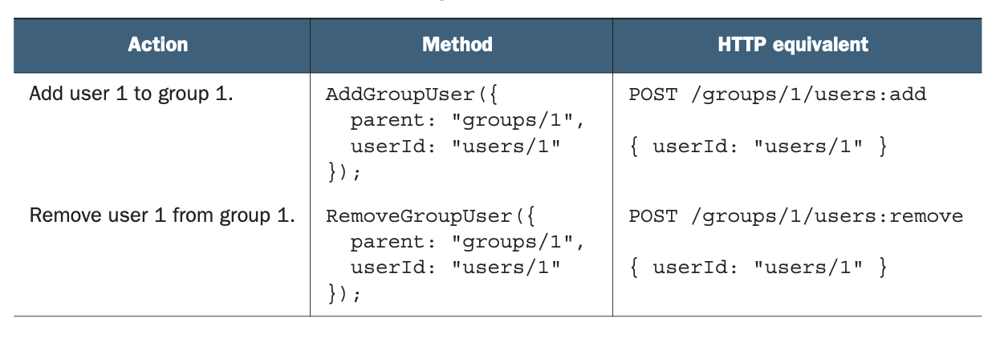
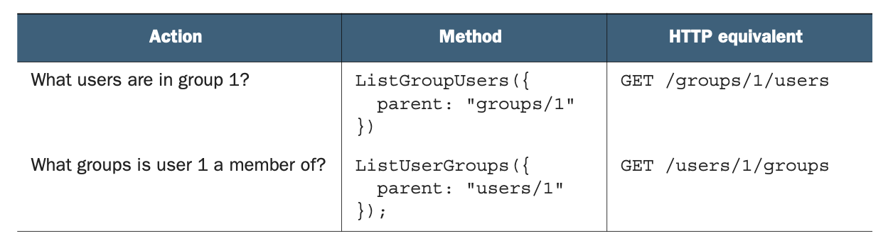

# 第 15 章 添加和移除自定义方法

<div style="background:#f7f5e6; padding:24px; border-radius:4px; color:#405a73;">

**本章内容**
- 如何隐式管理多对多关系
- 隐式关联而非显式关联的优缺点
- 如何使用自定义方法将资源关联在一起
- 处理关联资源的数据完整性问题
</div><br/>

在本章中，我们将探讨一种用于建模多对多关系的替代模式，它依赖自定义的 add 和 remove 方法来关联（和解除关联）两个资源。
此模式允许消费者管理多对多关系，而无需将第三个关联资源作为必要要求引入。

<a id="motivation"></a>
## 15.1 动机

正如我们在 [第 14 章](ch14.md) 中所学，有时我们需要跟踪资源之间的关系，有时这些关系可能很复杂。
特别是，我们经常必须处理两个资源都可以拥有许多对方的情况，这称为多对多关系。

<ins>虽然关联资源模式提供了一种非常灵活且有用的方式来建模这种类型的关系，
但值得问一问，如果我们能够接受一些限制，是否可能有更简单的方法来做到这一点。</ins>
换句话说，在某些限制下，我们能否使 API 更简单、更直观？
如果可以，具体的限制是什么？
本模式探讨了关联资源模式的一种更简单的替代方案。

<a id="overview"></a>
## 15.2 概述

正如你可能猜到的，在 API 中表示和操作多对多关系当然有更简单的方式，但它们带有一些限制。
在这个特定的模式中，我们将研究一种隐藏表示这些关系的各个资源，并使用自定义方法来创建和删除关联的方式。
让我们先总结这些方法，然后探讨依赖此设计模式时出现的具体限制。

<ins>在最基本的层面上，我们通过完全对消费者隐藏关联资源来简化 API，而是使用 add 和 remove 自定义方法来管理关系。</ins>
这些方法充当快捷方式，用于创建和删除所讨论的两个资源之间的关联，并隐藏关于该关系的所有细节，除了它存在（或不存在）这一事实。
在用户可以成为多个组的成员（而组显然包含多个用户）的经典示例中，这意味着我们可以简单地使用这些方法来表示用户加入（add）或离开（remove）给定的组。

<ins>为了采用此模式，让我们看看需要考虑的一些限制。
首先，由于我们只存储两个资源相关联这一简单事实，我们将无法存储关于关系本身的任何元数据。</ins>
这意味着，例如，如果我们使用此模式来管理作为组成员的用户，我们无法存储关于成员关系的详细信息，
例如用户加入组的日期或用户在给定组中可能扮演的任何特定角色。

<ins>其次，由于我们将使用自定义方法来添加和移除资源之间的关联，我们必须考虑其中一个资源是管理资源 (managing resource) —— 有点像一个是另一个的父级。</ins>
更具体地说，我们必须选择是将用户添加到组，还是将组添加到用户。
如果是前者，那么用户资源是被传递的资源，组资源管理关系。
如果是后者，那么用户管理关系，而组是被传递的资源。
<ins>用实际代码来思考（在本例中，以面向对象编程风格），管理资源就是那些附加了 add 和 remove 方法的资源。</ins>

*清单 15.1 选择管理资源时两种替代方案的代码片段*

```typescript
group.addUser(userId);
// 当由群组维护该关联关系时，我们向指定群组添加用户。

user.addGroup(groupId);
// 当由用户维护该关联关系时，我们向指定用户添加群组。
```

有时管理资源的选择是显而易见的，但其他时候可能更微妙，两种选择都有意义。
<ins>在某些情况下，两者作为管理资源都不太直观，但归根结底，使用此模式要求我们选择一个单一的管理资源。</ins>
假设我们能够接受这两个限制，让我们看看这个特定模式必须如何工作的细节。

<a id="implementation"></a>
## 15.3 实现

<ins>一旦我们确定了管理资源，我们就可以定义 add 和 remove 自定义方法。
方法的全名应遵循 Add<管理资源><关联资源> 的形式（remove 同理）。</ins>
例如，如果我们有可以添加到组或从组中移除的用户，那么用户就是关联资源，组是管理资源。
这意味着方法名将是 AddGroupUser 和 RemoveGroupUser。

这些方法应接受一个请求，其中包含父资源（在本例中为管理资源）以及要添加或移除的资源的标识符。
请注意，我们仅使用标识符，而不是完整资源。
这是因为其他信息将是多余的，并且如果消费者被误导以为他们有能力在关联两个资源的同时更新其中一个资源，可能会产生误导。
add 和 remove 方法及其 HTTP 等价形式的摘要如表 15.1 所示。

*表 15.1 add 和 remove 方法摘要* <br/>
<br/>

### 15.3.1 列出关联资源

<ins>为了列出各种关联，我们将依赖自定义的 list 标准方法，它们看起来就像我们在关联资源方法中讨论的别名方法。</ins>
这些方法简单地列出各种关联资源，并对结果提供分页和过滤。
由于我们有两种方式来查看关系（例如，我们可能想查看哪些用户是给定组的成员，以及给定用户是哪些组的成员），因此每个场景都需要两个不同的方法。

这些方法遵循与 add 和 remove 方法相似的命名约定，名称中包含两个资源。
使用我们的用户和组示例，我们提供两个不同的方法来列出给定条件下的各种用户和组：ListGroupUsers 提供属于给定组的用户列表，ListUserGroups 提供给定用户是其成员的组列表。
就像其他自定义方法一样，这些方法遵循类似的 HTTP 映射命名约定，但依赖一个隐式子集合，总结在表 15.2 中。

*表 15.2 list 方法摘要* <br/>
<br/>

### 15.3.2 数据完整性

当我们遇到重复数据的问题时，会出现一个常见问题。
例如，如果我们尝试将同一个用户添加到组两次会怎样？
另一方面，如果我们尝试从用户当前并非其成员的组中移除该用户，又会怎样？

正如我们在 [第 7 章](ch7.md) 中所看到的，这些情况下的行为将非常类似于删除一个不存在的资源以及创建一个重复（因此冲突）的资源。
这意味着，如果我们尝试将同一个用户两次添加到同一个组，我们的 API 应响应一个冲突错误（例如 409 Conflict）；
如果我们尝试从用户并非其成员的组中移除该用户，我们应返回一个表示假设失败的错误（例如 412 Precondition Failed），以表明我们无法执行所请求的操作。

这意味着，如果消费者只关心确保用户是（或不是）给定组的成员，他们可以简单地将这些错误情况视为其工作已经完成。
换句话说，如果我们只是想确保 Jimmy 是组 2 的成员，成功的结果或冲突错误都是有效的结果，因为两者都表明 Jimmy 当前是我们所期望的该组成员。
响应代码的差异仅仅传达了我们是否是负责将该用户添加到组的一方，但两者都表明该用户现在是该组的成员。

### 15.3.3 最终 API 定义

清单 15.2 展示了使用相同的用户和组示例实现此模式的完整示例。
如你所见，这比依赖关联资源要简短和简单得多；
然而，我们缺少存储关于用户属于组这一关系的元数据的能力。

*清单 15.2 使用 add/remove 模式的最终 API 定义*

```typescript
abstract class GroupApi {
  static version = "v1";
  static title = "Group API";

  @get("{id=users/*}")
  GetUser(req: GetUserRequest): User;

  // 为简洁起见，我们将省略用户与群组资源的所有其他标准方法
  // ...

  @get("{id=groups/*}")
  GetGroup(req: GetGroupRequest): Group;

  // 为简洁起见，我们将省略用户与群组资源的所有其他标准方法
  // ...

  @post("{parent=groups/*}/users:add")
  // 我们使用 AddGroupUser 和 RemoveGroupUser 来管理用户与群组的关联关系
  AddGroupUser(req: AddGroupUserRequest): void;

  @post("{parent=groups/*}/users:remove")
  // 我们使用 AddGroupUser 和 RemoveGroupUser 来管理用户与群组的关联关系
  RemoveGroupUser(req: RemoveGroupUserRequest): void;

  @get("{parent=groups/*}/users")
  // 要查看指定群组内有哪些用户，我们使用隐式子集合映射到 ListGroupUsers 方法
  ListGroupUsers(req: ListGroupUsersRequest): ListGroupUsersResponse;

  @get("{parent=users/*}/groups")
  // 要查看用户所属的群组，我们采用相同思路并创建 ListUserGroups 方法
  ListUserGroups(req: ListUserGroupsRequest): ListUserGroupsResponse;
}

interface Group {
  id: string;
  userCount: number;

  // 注意我们不在此处内联用户列表，因为列表可能很长。如需查看用户列表，改用 ListGroupUsers。
  // ...
}

interface User {
  id: string;
  emailAddress: string;
}

interface ListUserGroupsRequest {
  parent: string;
  maxPageSize?: number;
  pageToken?: string;
  filter?: string;
}

interface ListUserGroupsResponse {
  results: Group[];
  nextPageToken: string;
}

interface ListGroupUsersRequest {
  parent: string;
  maxPageSize?: number;
  pageToken?: string;
  filter?: string
}

interface ListGroupUsersResponse {
  results: User[];
  nextPageToken: string;
}

interface AddGroupUserRequest {
  parent: string;
  userId: string;
}

interface RemoveGroupUserRequest {
  parent: string;
  userId: string;
}
```

<a id="trade-offs"></a>
## 15.4 权衡

正如我们在本章开头所指出的，此模式的主要目标是提供管理多对多关系的能力，而无需承担完整关联资源的复杂性。
作为这种简化的交换，我们以功能限制的形式做出了一些权衡。

### 15.4.1 非互惠关系

与关联资源不同，使用 add 和 remove 自定义方法要求我们选择其中一个资源作为管理资源，另一个作为被管理资源。
换句话说，我们需要决定哪个资源是被添加到另一个资源（以及从另一个资源中移除）的资源。
在许多情况下，这种非互惠性是方便且显而易见的，但其他时候可能看起来违反直觉。

### 15.4.2 关系元数据

通过使用自定义的 add 和 remove 方法而不是关联资源，我们放弃了存储关于关系本身的元数据的能力。
这意味着我们除了关系存在（或不存在）之外，无法存储任何其他信息。
换句话说，我们无法跟踪关系是何时创建的，也无法跟踪任何特定于关系的信息，而必须将其放在其他地方。

<a id="exercises"></a>
## 15.5 练习

1. 什么时候你会选择使用自定义的 add 和 remove 方法，而不是关联资源，来建模两个资源之间的多对多关系？

2. 当将 Recipe 资源与 Ingredient 资源关联时，哪个是管理资源，哪个是关联资源？

3. 用于列出构成特定食谱的 Ingredient 资源的方法应该叫什么？

4. 当使用自定义 add 方法添加重复资源时，结果应该是什么？

<a id="summary"></a>
## 本章小节

- 对于关联资源过于重量级的场景（例如，不需要任何额外的面向关系的元数据），使用 add 和 remove 自定义方法可能是管理多对多关系的更简单方式。

- add 和 remove 自定义方法允许将关联资源（即从属资源）添加到某个管理资源的关联中，或从中移除。

- 列出关联资源可以使用元资源上的标准 list 方法来执行。
