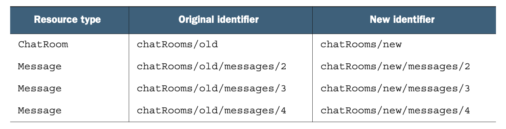

# 第 17 章 复制和移动

<div style="background:#f7f5e6; padding:24px; border-radius:4px; color:#405a73;">

**本章内容**
- 如何使用 copy 和 move 自定义方法在 API 中重新排列资源
- 为复制和移动操作选择正确的标识符（或标识符策略）
- 在复制或移动父资源时如何处理子资源和其他资源
- 处理被复制或移动资源的外部数据引用
- 这些新的自定义方法应期望什么样的原子性级别
</div><br/>

虽然很少资源被认为是不可变的，但我们通常可以安全地假设资源的某些属性不会在我们不知情的情况下发生变化。
特别是，资源的唯一标识符就是这些属性之一。
但如果我们想要重命名一个资源呢？
我们如何安全地做到这一点？
此外，如果我们想要将一个资源从一个父资源移动到另一个父资源呢？
或者复制一个资源？
我们将探讨这些操作的一种安全稳定的方法，涵盖 API 中资源的复制（复制）和移动（更改唯一标识符或更改父级）。

<a id="motivation"></a>
## 17.1 动机

在一个理想的世界里，资源之间的层级关系被完美设计并且永远不可变。
更重要的是，在这个神奇的世界里，API 的用户从不犯错误，也不会在错误的位置创建资源。
而且他们肯定不会在太晚的时候才意识到自己犯了错误。
在这个世界里，永远不应该需要重命名或重新定位 API 中的资源，
因为我们作为 API 设计者，以及我们的客户作为 API 消费者，从不在资源布局和层级中犯任何错误。

这就是我们在 [第 6 章](ch6.md) 中探讨并在 [第 6.3.6 节](ch6.md#hierarchy-and-uniqueness-scope
) 中详细讨论的世界。
不幸的是，这个世界并不是我们目前所处的世界，因此我们必须考虑这样一种可能性：
总有一天 API 的用户需要能够将资源移动到层级中的另一个父级，或更改资源的 ID。

更复杂的是，可能存在用户需要复制资源的场景，可能是复制到层级中的其他位置。
虽然这两个场景乍一看似乎都很直接，但像 API 设计中的大多数主题一样，它们会让我们陷入一个充满需要回答的问题的兔子洞。
<ins>本模式的目标是确保 API 消费者能够以安全、稳定且（大多数情况下）简单的方式在整个资源层级中重命名和复制资源。</ins>

<a id="overview"></a>
## 17.2 概述

由于我们不能使用标准 update 方法来移动或复制资源，我们只剩下一个显而易见的次优选择：自定义方法。
幸运的是，这些 copy 和 move 自定义方法如何工作的高层概念很简单。
与大多数 API 设计问题一样，细节决定成败，例如复制 ChatRoom 资源以及在不同的 ChatRoom 父资源之间移动 Message 资源。

*清单 17.1 使用自定义方法的 move 和 copy 示例*

```typescript
// 这两个自定义方法都使用POST HTTP动词，目标是我们想要复制或移动的特定资源。
// 对于这两个自定义方法，响应始终是新移动或新复制后的资源。
abstract class ChatRoomApi {
  @post("/{id=chatRooms/*/messages/*}:move")
  MoveMessage(req: MoveMessageRequest): Message;

  @post("/{id=chatRooms/*}:copy")
  CopyChatRoom(req: CopyChatRoomRequest): ChatRoom;
}
```

这里没有展示那些相当多重要且微妙的问题。
<ins>首先，当你复制或移动资源时，是你选择唯一标识符，还是像创建新资源一样由服务自行选择？
跨父级操作（你可能希望使用与之前相同的标识符，只是属于不同的父级）与在同一父级内操作（你大概只是希望能够更改标识符）之间是否有区别？</ins>

<ins>其次，当你复制一个 ChatRoom 资源时，属于该 ChatRoom 的所有 Message 资源也会被复制吗？</ins>
如果有大型附件呢？那些额外数据会被复制吗？
问题还不止于此。
我们仍然需要弄清楚如何确保正在被移动（或复制）的资源当前没有被其他用户交互，如何处理旧标识符，以及任何继承的元数据（如访问控制策略）。

简而言之，虽然这个模式只依赖一个特定的自定义方法，但我们离简单地定义方法并宣布完成还差得很远。
在下一节中，我们将深入探讨所有这些问题，以便最终得到一个能确保安全稳定的资源复制（和移动）的 API 表面。

<a id="implementation"></a>
## 17.3 实现

正如我们在 [第 17.2 节](#overview) 中所看到的，我们可以依赖自定义方法来在 API 的层级结构中复制和移动资源。
我们还没有讨论的是这些自定义方法的一些重要细微差别，以及它们实际上应该如何工作。
让我们从显而易见的问题开始：我们应该如何确定新移动或复制的资源的标识符？

### 17.3.1 标识符

<ins>正如我们在 [第 6 章](ch6.md) 中所学，通常最好让 API 服务本身为资源选择唯一标识符。
这意味着当我们创建新资源时，我们可能指定父资源标识符，但新创建的资源最终会有一个完全不受我们控制的标识符。</ins>
这是有充分理由的：当我们选择如何标识自己的资源时，我们往往做得很差。
同样的场景也出现在复制和移动资源时。
从某种意义上说，这两者都有点像创建一个看起来与现有资源完全相同的新资源，然后（在移动的情况下）删除原始资源。

但即使新创建的资源具有 API 服务选择的标识符，它应该是什么呢？
事实证明，最方便的选择取决于我们的意图。
如果我们试图重命名一个资源，使其具有新的标识符但仍存在于资源层级中的同一位置，那么我们选择新标识符可能相当重要。
如果 API 允许用户指定标识符，情况尤其如此，因为我们很可能将资源从某个有意义的名称重命名为另一个有意义的名称
（例如，从类似 `databases/database-prod` 重命名为 `databases/database-prod-old`）。
另一方面，如果我们试图将某个东西从层级中的一个位置移动到另一个位置，那么新资源具有相同的标识符但属于新的父级，
实际上可能是更好的场景（例如，从现有标识符 `chatRooms/1234/messages/abcd` 移动到 `chatRooms/5678/messages/abcd`，注意 `messages/abcd` 的共性）。
由于这些场景差异很大，让我们分别看看每一个。

#### 复制

为重复资源选择标识符实际上相当直接。无论你是将资源复制到相同还是不同的父级，copy 方法的行为都应与标准 create 方法相同。这意味着，如果你的 API 选择了用户指定的标识符，那么 copy 方法也应允许用户为新创建的资源指定目标标识符。如果它只支持服务生成的标识符，它就不应破例，仅为了资源复制而允许用户指定的标识符。（如果它这样做了，这就会成为一个漏洞，任何人都可以通过简单地创建资源然后将资源复制到实际预期目标来选择自己的标识符。）

这样做的结果是，复制资源的请求将同时接受目标父级（如果资源类型有父级），以及（如果允许用户指定的标识符）目标 ID。

*清单 17.2 copy 请求接口*

```typescript
interface CopyChatRoomRequest {
  id: string; // 我们始终需要知道待复制资源的ID。
  destinationId: string; // 该字段为可选字段。仅当API支持用户自定义标识符时才需要提供。
}

interface CopyMessageRequest {
  id: string; // 我们始终需要知道待复制资源的ID。
  destinationParent: string; // 当资源在层级结构中存在父级时，我们需要指定新复制出来的资源存放位置。
  destinationId: string; // 该字段为可选字段。仅当API支持用户自定义标识符时才需要提供。
}
```

这可能会导致一些令人惊讶的结果。
例如，如果 API 不支持用户选择的标识符，那么复制任何顶级资源的请求只接受一个参数：要复制的资源的 ID。
在另一种情况下，我们可能想要将资源复制到同一个父级中。
在这种情况下，destinationParent 字段将与 id 字段所指向资源的父级相同。

此外，即使在 API 支持用户选择的标识符的情况下，我们在复制资源时也可能想要依赖自动生成的 ID。
为此，我们只需将 destinationId 字段留空，并允许以此方式向服务表达：“我希望你为我选择目标标识符。”

<ins>最后，当支持用户指定的标识符时，目标父级内的目标 ID 可能已经被占用。
在这种情况下，为了确保资源成功复制，可能很容易退回到服务器生成的标识符。
然而，应避免这样做，因为它打破了用户对新资源目标的假设。
相反，服务应返回相当于 409 Conflict HTTP 错误，并中止复制操作。</ins>

#### 移动

<ins>当涉及到移动资源时，我们实际上有两种微妙不同的场景。
一方面，用户可能最关心将资源重新定位到资源层级中的另一个父级，例如将 Message 资源从一个 ChatRoom 移动到另一个。
另一方面，用户可能想要重命名资源，此时资源在技术上被移动到同一个父级，但具有不同的目标 ID。
我们也有可能想要同时做这两件事（重新定位和重命名）。</ins>

<ins>使事情更加复杂的是，我们必须记住，只有在 API 支持用户选择的标识符时，重命名资源才有意义。</ins>

为了处理这些场景，可能很容易再次使用两个单独的字段，如 [清单 17.2](#example-17-2) 中那样，即一个目标父级和一个目标标识符。
不过，在这种情况下，我们始终知道最终的标识符是什么（与 copy 方法相比，我们可能依赖服务器生成的标识符）。
该 ID 要么与原始资源相同，只是父级不同，要么是我们选择的完全新的 ID。
因此，我们可以使用单个 destinationId 字段，并根据是否支持用户选择的标识符对该字段的值施加一些约束。
如果支持，那么任何完整的标识符都是可接受的。
如果不支持，那么唯一有效的新标识符是那些仅更改 ID 的父级部分并保持其余部分不变的标识符。

所有这些引导我们得到一个只接受两个字段的 move 请求结构：被移动资源的标识符，以及重新定位完成后资源的预期目标。

*清单 17.3 move 请求接口*

```typescript
// ChatRoom 资源没有层级父级，因此该方法仅在API支持用户自定义标识符时才有意义。
interface MoveChatRoomRequest {
  id: string; // 我们始终需要知道待移动资源的ID。
  destinationId: string;
}

interface MoveMessageRequest {
  id: string; // 我们始终需要知道待移动资源的ID。
  destinationId: string; // Message 资源存在父级，我们可以通过修改目标ID，将资源移动至不同的父级下。
}
```

如你所见，对于顶级资源（那些没有父级的资源），整个 move 方法只有在 API 支持用户指定的标识符时才有意义。
这与 copy 方法形成鲜明对比，后者在这种情况下仍然有意义。
问题主要在于移动实现了两个目标：将资源重新定位到不同的父级和重命名资源。
后者只有在支持用户指定的标识符时才有意义。
前者只有在资源有父级时才有意义。
在这两者都不适用的情况下，move 方法变得完全无关紧要，根本不应实现。

现在我们已经对复制和移动资源的请求的形状和结构有了概念，让我们继续前进，看看如何处理更复杂的场景。

### 17.3.2 子资源

到目前为止，我们一直在这样一种条件下工作：我们打算移动或复制的每个资源都是完全自包含的。
本质上，我们的一个重大假设是，资源本身没有任何需要在单条记录之外复制的附加信息。
这个假设当然让我们的工作稍微容易了一些，但不幸的是，它不一定是一个安全的假设。
<ins>相反，我们必须假设还会有与需要移动或复制的资源相关联的附加数据。</ins>
我们如何处理这个问题？
我们甚至应该费心处理这些额外数据吗？

简短的回答是：是的。
简单地说，外部数据和关联资源（例如子资源）很少是没有目的地存在的。
因此，复制或移动资源而不包含这些关联数据，很可能会导致一个令人惊讶的结果：新目标资源的行为与源资源不同。
由于优秀 API 的关键目标之一是可预测性，确保新复制或移动的资源在尽可能多的方面与源资源完全相同就变得尤为重要。
我们如何做到这一点？

<ins>首先，无论是复制还是移动，所有子资源都必须包含在内。</ins>
例如，这意味着如果我们复制或移动一个 ChatRoom 资源，所有 Message 子资源也必须使用新的父级 ID 进行复制或移动。
显然，这比更新单行要多得多的工作。
此外，更新的数量取决于子资源的数量，这意味着，正如你所料，复制一个子资源较少的资源比复制一个具有大量子资源的类似资源要快得多。
表 17.1 显示了移动或复制操作前后资源标识符的示例。

*表 17.1 移动（或复制）ChatRoom 资源后的新旧标识符* <br/>
<br/>

<ins>虽然我们在复制方面的问题到此为止，但不幸的是，当资源被移动时情况并非如此。
相反，在我们完成所有 ID 的更新后，我们实际上创建了一个全新的问题：以前指向这些资源的任何其他地方现在都有了失效链接，尽管资源仍然存在！</ins>
在下一节中，我们将探讨如何处理这些引用，包括内部引用和外部引用。
