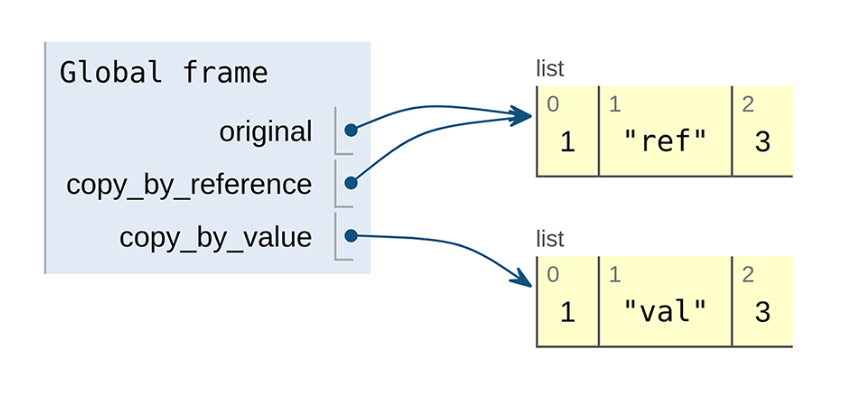

# 第 17 章 复制和移动

<div style="background:#f7f5e6; padding:24px; border-radius:4px; color:#405a73;">

**本章内容**
- 如何使用 copy 和 move 自定义方法在 API 中重新排列资源
- 为复制和移动操作选择正确的标识符（或标识符策略）
- 在复制或移动父资源时如何处理子资源和其他资源
- 处理被复制或移动资源的外部数据引用
- 这些新的自定义方法应期望什么样的原子性级别
</div><br/>

虽然很少资源被认为是不可变的，但我们通常可以安全地假设资源的某些属性不会在我们不知情的情况下发生变化。
特别是，资源的唯一标识符就是这些属性之一。
但如果我们想要重命名一个资源呢？
我们如何安全地做到这一点？
此外，如果我们想要将一个资源从一个父资源移动到另一个父资源呢？
或者复制一个资源？
我们将探讨这些操作的一种安全稳定的方法，涵盖 API 中资源的复制（复制）和移动（更改唯一标识符或更改父级）。

<a id="motivation"></a>
## 17.1 动机

在一个理想的世界里，资源之间的层级关系被完美设计并且永远不可变。
更重要的是，在这个神奇的世界里，API 的用户从不犯错误，也不会在错误的位置创建资源。
而且他们肯定不会在太晚的时候才意识到自己犯了错误。
在这个世界里，永远不应该需要重命名或重新定位 API 中的资源，
因为我们作为 API 设计者，以及我们的客户作为 API 消费者，从不在资源布局和层级中犯任何错误。

这就是我们在 [第 6 章](ch6.md) 中探讨并在 [第 6.3.6 节](ch6.md#hierarchy-and-uniqueness-scope
) 中详细讨论的世界。
不幸的是，这个世界并不是我们目前所处的世界，因此我们必须考虑这样一种可能性：
总有一天 API 的用户需要能够将资源移动到层级中的另一个父级，或更改资源的 ID。

更复杂的是，可能存在用户需要复制资源的场景，可能是复制到层级中的其他位置。
虽然这两个场景乍一看似乎都很直接，但像 API 设计中的大多数主题一样，它们会让我们陷入一个充满需要回答的问题的兔子洞。
<ins>本模式的目标是确保 API 消费者能够以安全、稳定且（大多数情况下）简单的方式在整个资源层级中重命名和复制资源。</ins>

<a id="overview"></a>
## 17.2 概述

由于我们不能使用标准 update 方法来移动或复制资源，我们只剩下一个显而易见的次优选择：自定义方法。
幸运的是，这些 copy 和 move 自定义方法如何工作的高层概念很简单。
与大多数 API 设计问题一样，细节决定成败，例如复制 ChatRoom 资源以及在不同的 ChatRoom 父资源之间移动 Message 资源。

*清单 17.1 使用自定义方法的 move 和 copy 示例*

```typescript
// 这两个自定义方法都使用POST HTTP动词，目标是我们想要复制或移动的特定资源。
// 对于这两个自定义方法，响应始终是新移动或新复制后的资源。
abstract class ChatRoomApi {
  @post("/{id=chatRooms/*/messages/*}:move")
  MoveMessage(req: MoveMessageRequest): Message;

  @post("/{id=chatRooms/*}:copy")
  CopyChatRoom(req: CopyChatRoomRequest): ChatRoom;
}
```

这里没有展示那些相当多重要且微妙的问题。
<ins>首先，当你复制或移动资源时，是你选择唯一标识符，还是像创建新资源一样由服务自行选择？
跨父级操作（你可能希望使用与之前相同的标识符，只是属于不同的父级）与在同一父级内操作（你大概只是希望能够更改标识符）之间是否有区别？</ins>

<ins>其次，当你复制一个 ChatRoom 资源时，属于该 ChatRoom 的所有 Message 资源也会被复制吗？</ins>
如果有大型附件呢？那些额外数据会被复制吗？
问题还不止于此。
我们仍然需要弄清楚如何确保正在被移动（或复制）的资源当前没有被其他用户交互，如何处理旧标识符，以及任何继承的元数据（如访问控制策略）。

简而言之，虽然这个模式只依赖一个特定的自定义方法，但我们离简单地定义方法并宣布完成还差得很远。
在下一节中，我们将深入探讨所有这些问题，以便最终得到一个能确保安全稳定的资源复制（和移动）的 API 表面。

<a id="implementation"></a>
## 17.3 实现

正如我们在 [第 17.2 节](#overview) 中所看到的，我们可以依赖自定义方法来在 API 的层级结构中复制和移动资源。
我们还没有讨论的是这些自定义方法的一些重要细微差别，以及它们实际上应该如何工作。
让我们从显而易见的问题开始：我们应该如何确定新移动或复制的资源的标识符？

### 17.3.1 标识符

<ins>正如我们在 [第 6 章](ch6.md) 中所学，通常最好让 API 服务本身为资源选择唯一标识符。
这意味着当我们创建新资源时，我们可能指定父资源标识符，但新创建的资源最终会有一个完全不受我们控制的标识符。</ins>
这是有充分理由的：当我们选择如何标识自己的资源时，我们往往做得很差。
同样的场景也出现在复制和移动资源时。
从某种意义上说，这两者都有点像创建一个看起来与现有资源完全相同的新资源，然后（在移动的情况下）删除原始资源。

但即使新创建的资源具有 API 服务选择的标识符，它应该是什么呢？
事实证明，最方便的选择取决于我们的意图。
如果我们试图重命名一个资源，使其具有新的标识符但仍存在于资源层级中的同一位置，那么我们选择新标识符可能相当重要。
如果 API 允许用户指定标识符，情况尤其如此，因为我们很可能将资源从某个有意义的名称重命名为另一个有意义的名称
（例如，从类似 `databases/database-prod` 重命名为 `databases/database-prod-old`）。
另一方面，如果我们试图将某个东西从层级中的一个位置移动到另一个位置，那么新资源具有相同的标识符但属于新的父级，
实际上可能是更好的场景（例如，从现有标识符 `chatRooms/1234/messages/abcd` 移动到 `chatRooms/5678/messages/abcd`，注意 `messages/abcd` 的共性）。
由于这些场景差异很大，让我们分别看看每一个。

#### 复制

为重复资源选择标识符实际上相当直接。无论你是将资源复制到相同还是不同的父级，copy 方法的行为都应与标准 create 方法相同。这意味着，如果你的 API 选择了用户指定的标识符，那么 copy 方法也应允许用户为新创建的资源指定目标标识符。如果它只支持服务生成的标识符，它就不应破例，仅为了资源复制而允许用户指定的标识符。（如果它这样做了，这就会成为一个漏洞，任何人都可以通过简单地创建资源然后将资源复制到实际预期目标来选择自己的标识符。）

这样做的结果是，复制资源的请求将同时接受目标父级（如果资源类型有父级），以及（如果允许用户指定的标识符）目标 ID。

*清单 17.2 copy 请求接口*

```typescript
interface CopyChatRoomRequest {
  id: string; // 我们始终需要知道待复制资源的ID。
  destinationId: string; // 该字段为可选字段。仅当API支持用户自定义标识符时才需要提供。
}

interface CopyMessageRequest {
  id: string; // 我们始终需要知道待复制资源的ID。
  destinationParent: string; // 当资源在层级结构中存在父级时，我们需要指定新复制出来的资源存放位置。
  destinationId: string; // 该字段为可选字段。仅当API支持用户自定义标识符时才需要提供。
}
```

这可能会导致一些令人惊讶的结果。
例如，如果 API 不支持用户选择的标识符，那么复制任何顶级资源的请求只接受一个参数：要复制的资源的 ID。
在另一种情况下，我们可能想要将资源复制到同一个父级中。
在这种情况下，destinationParent 字段将与 id 字段所指向资源的父级相同。

此外，即使在 API 支持用户选择的标识符的情况下，我们在复制资源时也可能想要依赖自动生成的 ID。
为此，我们只需将 destinationId 字段留空，并允许以此方式向服务表达：“我希望你为我选择目标标识符。”

<ins>最后，当支持用户指定的标识符时，目标父级内的目标 ID 可能已经被占用。
在这种情况下，为了确保资源成功复制，可能很容易退回到服务器生成的标识符。
然而，应避免这样做，因为它打破了用户对新资源目标的假设。
相反，服务应返回相当于 409 Conflict HTTP 错误，并中止复制操作。</ins>

#### 移动

<ins>当涉及到移动资源时，我们实际上有两种微妙不同的场景。
一方面，用户可能最关心将资源重新定位到资源层级中的另一个父级，例如将 Message 资源从一个 ChatRoom 移动到另一个。
另一方面，用户可能想要重命名资源，此时资源在技术上被移动到同一个父级，但具有不同的目标 ID。
我们也有可能想要同时做这两件事（重新定位和重命名）。</ins>

<ins>使事情更加复杂的是，我们必须记住，只有在 API 支持用户选择的标识符时，重命名资源才有意义。</ins>

为了处理这些场景，可能很容易再次使用两个单独的字段，如 [清单 17.2](#example-17-2) 中那样，即一个目标父级和一个目标标识符。
不过，在这种情况下，我们始终知道最终的标识符是什么（与 copy 方法相比，我们可能依赖服务器生成的标识符）。
该 ID 要么与原始资源相同，只是父级不同，要么是我们选择的完全新的 ID。
因此，我们可以使用单个 destinationId 字段，并根据是否支持用户选择的标识符对该字段的值施加一些约束。
如果支持，那么任何完整的标识符都是可接受的。
如果不支持，那么唯一有效的新标识符是那些仅更改 ID 的父级部分并保持其余部分不变的标识符。

所有这些引导我们得到一个只接受两个字段的 move 请求结构：被移动资源的标识符，以及重新定位完成后资源的预期目标。

*清单 17.3 move 请求接口*

```typescript
// ChatRoom 资源没有层级父级，因此该方法仅在API支持用户自定义标识符时才有意义。
interface MoveChatRoomRequest {
  id: string; // 我们始终需要知道待移动资源的ID。
  destinationId: string;
}

interface MoveMessageRequest {
  id: string; // 我们始终需要知道待移动资源的ID。
  destinationId: string; // Message 资源存在父级，我们可以通过修改目标ID，将资源移动至不同的父级下。
}
```

如你所见，对于顶级资源（那些没有父级的资源），整个 move 方法只有在 API 支持用户指定的标识符时才有意义。
这与 copy 方法形成鲜明对比，后者在这种情况下仍然有意义。
问题主要在于移动实现了两个目标：将资源重新定位到不同的父级和重命名资源。
后者只有在支持用户指定的标识符时才有意义。
前者只有在资源有父级时才有意义。
在这两者都不适用的情况下，move 方法变得完全无关紧要，根本不应实现。

现在我们已经对复制和移动资源的请求的形状和结构有了概念，让我们继续前进，看看如何处理更复杂的场景。

### 17.3.2 子资源

到目前为止，我们一直在这样一种条件下工作：我们打算移动或复制的每个资源都是完全自包含的。
本质上，我们的一个重大假设是，资源本身没有任何需要在单条记录之外复制的附加信息。
这个假设当然让我们的工作稍微容易了一些，但不幸的是，它不一定是一个安全的假设。
<ins>相反，我们必须假设还会有与需要移动或复制的资源相关联的附加数据。</ins>
我们如何处理这个问题？
我们甚至应该费心处理这些额外数据吗？

简短的回答是：是的。
简单地说，外部数据和关联资源（例如子资源）很少是没有目的地存在的。
因此，复制或移动资源而不包含这些关联数据，很可能会导致一个令人惊讶的结果：新目标资源的行为与源资源不同。
由于优秀 API 的关键目标之一是可预测性，确保新复制或移动的资源在尽可能多的方面与源资源完全相同就变得尤为重要。
我们如何做到这一点？

<ins>首先，无论是复制还是移动，所有子资源都必须包含在内。</ins>
例如，这意味着如果我们复制或移动一个 ChatRoom 资源，所有 Message 子资源也必须使用新的父级 ID 进行复制或移动。
显然，这比更新单行要多得多的工作。
此外，更新的数量取决于子资源的数量，这意味着，正如你所料，复制一个子资源较少的资源比复制一个具有大量子资源的类似资源要快得多。
表 17.1 显示了移动或复制操作前后资源标识符的示例。

*表 17.1 移动（或复制）ChatRoom 资源后的新旧标识符* <br/>
<br/>

<ins>虽然我们在复制方面的问题到此为止，但不幸的是，当资源被移动时情况并非如此。
相反，在我们完成所有 ID 的更新后，我们实际上创建了一个全新的问题：以前指向这些资源的任何其他地方现在都有了失效链接，尽管资源仍然存在！</ins>
在下一节中，我们将探讨如何处理这些引用，包括内部引用和外部引用。

### 17.3.3 关联资源

虽然我们已经决定所有子资源都必须与目标资源一起复制或移动，但到目前为止我们还没有谈到相关资源。
例如，假设我们的聊天 API 支持通过 MessageReviewReport 资源来举报或标记可能不当的消息。
这个资源有点像是被标记为不当并应由支持团队审查的消息的支持工单。
这个资源不一定是 Message 资源（甚至 ChatRoom 资源）的子资源，但它确实引用了它所针对的 Message 资源。

*清单 17.4 引用 Message 资源的 MessageReviewReport 资源*

```typescript
interface MessageReviewReport {
  id: string;
  messageId: string; // 该字段保存消息资源的ID，作为引用
  reason: string;
}
```

这个资源的存在（以及它的 messageId 字段是对 Message 资源的引用这一事实）引出了几个显而易见的问题。
首先，当你复制一条 Message 时，是否也应该复制所有引用原始消息的 MessageReviewReport 资源？
其次，如果一条 Message 资源被移动了，是否也应该更新所有引用新移动资源的 MessageReviewReport 资源？
当我们想起复制和移动 Message 资源可能并非专门由于针对该 Message 资源的最终用户请求，而可能是针对父 ChatRoom 资源的请求的级联结果时，这些问题就变得更加复杂了！

在所有这些场景中，没有单一的正确做法，这应该不足为奇，但让我们从简单的开始，比如相关资源应如何响应资源被移动的情况。

#### 引用完整性

在许多关系数据库系统中，有一种方法可以配置系统，使得当某些数据库行发生变化时，这些变化可以级联并更新数据库中其他位置的行。
这是一个非常有价值（尽管资源密集）的特性，它确保你永远不会因为试图解引用一个新近失效的指针而遭遇数据库层面的段错误 (segmentation fault)。
当涉及到在 API 内部移动资源时，我们理想情况下也希望达到同样的结果。

不幸的是，这正是伴随 move 自定义方法而来的那些非常困难的事情之一。
<ins>我们不仅需要跟踪所有引用被移动目标资源的资源，还需要跟踪随父资源一起移动的子资源，并确保任何引用这些子资源的其他资源也被更新。
可以想象，这极其复杂，也是重命名或重新定位资源被劝阻的众多原因之一！</ins>

例如，遵循这一指导原则意味着，如果我们移动一个被 MessageReviewReport 引用的 Message 资源，我们还需要更新那个 MessageReviewReport。
此外，如果我们移动了作为这条带有 MessageReviewReport 的 Message 的父资源的 ChatRoom 资源，我们也必须做同样的事情，因为 Message 会因作为 ChatRoom 的子资源而被移动。

现在让我们简要看看在 copy 自定义方法方面我们应该如何处理相关资源。

#### 相关资源复制

虽然移动资源确实给相关资源带来了相当大的麻烦，但复制资源是否也是如此呢？
事实证明，它也会带来麻烦，但完全是另一种类型的麻烦。
我们没有一个棘手的技术问题要处理，而是有一个艰难的设计决策。
<ins>原因很简单：是否将相关资源与目标资源一起复制，在很大程度上取决于具体情况。</ins>

例如，MessageReviewReport 资源当然很重要，需要保留，但如果我们复制一条 Message 资源，我们不会想要完全照原样复制该报告。
相反，也许更有意义的是允许一个 MessageReviewReport 引用多条 Message 资源，而不是复制该报告，我们可以简单地将新复制的 Message 资源添加到被引用的列表中。

其他资源则根本不应被复制。
例如，当我们复制一个 ChatRoom 资源时，我们绝不应复制该资源中列为成员的 User 资源。
<ins>归根结底，关键在于有些资源与目标一起复制是有意义的，而另一些则根本不会。</ins>
这是一个远不那么复杂的技术问题，而在很大程度上取决于 API 的预期行为。

现在我们已经涵盖了在这些新的自定义方法面前维护引用完整性的细节，让我们探讨一下当我们将其扩展至涵盖我们无法控制的外部引用时，情况会是什么样。

#### 外部引用

虽然 API 中对资源的大多数引用都存在于同一 API 的其他资源中，但并非总是如此。
在许多场景中，资源会从互联网各处被引用，特别是与存储文件或其他非结构化数据相关的任何内容。
鉴于本章的全部内容都是关于移动资源和打破来自各处的外部引用，这带来了一个相当明显的问题。
例如，假设我们有一个跟踪文件的存储系统。
这些 File 资源显然能够在互联网上各处共享，这意味着我们会有大量对这些资源的引用遍布各处！
我们能做什么呢？

*清单 17.5 File 资源很可能在 API 外部被引用*

```typescript
abstract class FileApi {
  @post("/files")
  CreateFile(req: CreateFileRequest): File;

  @get("/{id=files/*}") // 这些URI可用于从API外部引用指定的File资源
  GetFile(req: GetFileRequest): File;
}

interface File {
  id: string;
  content: Uint8Array;
}
```

重要的是要记住，互联网并不完全是引用完整性的完美体现。
我们大多数人总是遇到 HTTP 404 Not Found 错误，因此将 API 内部的引用完整性要求扩展到整个互联网是不太公平的。
<ins>当我们向世界提供一个 Web 资源时，我们很少真正打算签署一份终身合同，承诺在永恒的未来继续以完全相同的字节和完全相同的名称提供该资源。
相反，我们通常提供资源，直到它不再有意义为止。
关键在于，提供给开放互联网的资源往往是尽力而为的，很少附带终身保证。</ins>

在这种情况下，我们的示例 File 资源最好归类在同一套指导原则之下：它会一直存在，直到它碰巧被移动。
这可能是明天由于美国司法部的紧急请求，也可能是明年因为存储该文件的成本不再合理。
<ins>关键在于，我们应该一开始就承认外部引用完整性不是 API 的关键目标，并专注于更重要的手头问题。</ins>

### 17.3.4 外部数据

到目前为止，我们复制或移动的所有资源都是那种你会存储在关系数据库或控制平面 (control plane ) 数据中的类型。
那么，当我们想要复制或移动一个恰好指向原始字节块的资源时，比如清单 17.5 中的 File 资源，该怎么办？
我们是否也应该复制底层存储中的那些字节？

<ins>这实际上是计算机科学中一个研究得很充分的问题，并且在许多编程语言中表现为变量按值复制与按引用复制的问题。</ins>
当一个变量按值复制时，所有底层数据都会被复制，新复制的变量与旧变量完全分离。当一个变量按引用复制时，底层数据留在原处，并创建一个恰好指向原始数据的新变量。
在这种情况下，改变一个变量的数据也会导致另一个变量的数据被更新。

*清单 17.6 按引用复制与按值复制的伪代码*

```typescript
let original = [1, 2, 3];
// 首先我们将原始列表复制两次，一次按值复制，一次按引用复制
let copy_by_reference = copyByReference(original);
let copy_by_value = copyByValue(original);

// 接着我们更新两个副本各自的元素（结果见图17.1）
copy_by_reference[1] = 'ref';
copy_by_value[1] = 'val';
```

清单 17.6 展示了一些伪代码示例，它执行两次复制（一次按值，另一次按引用），然后更新结果数据。
最终值随后展示在图 17.1 中。
如你所见，尽管有三个变量，但只有两个列表，并且对 copy_by_reference 变量的更改在原始列表中也可见。

*图 17.1 按引用复制与按值复制的可视化* <br/>
<br/>

<ins>当移动指向这类外部数据的资源时，答案很简单：不要动底层数据。</ins>
这意味着，虽然我们可能会重新定位资源记录本身，但数据应保持不变。
例如，重命名一个 File 资源应改变该资源的归属，但底层字节不应被移动到任何其他地方。

当复制资源时，答案很清楚，但恰好有点更复杂。
<ins>一般来说，对于这类外部数据，最好的解决方案是先从仅按引用复制开始。
之后，如果数据恰好发生变化，我们应该复制所有底层数据并应用更改，因为当我们可能可以仅通过按引用复制来解决问题时，复制一大堆字节可能是浪费的。
然而，我们当然不能让重复资源上的更改表现为原始资源上的更改，因此一旦即将进行更改，我们就必须进行完整复制。</ins>

这种策略称为写时复制 (copy on write)，在存储系统中相当常见，许多存储系统会在底层为你完成繁重的工作。
换句话说，你可能可以只调用存储系统的 copy() 函数，而它会在数据 later altered 时正确处理所有语义，以执行真正的按值复制。


### 17.3.5 继承的元数据

在许多 API 中，存在一些策略或元数据，由子资源从父资源继承。
例如，让我们想象一个场景：我们想要控制不同聊天室中消息的长度。
这个长度限制可能因房间而异，因此它会是设置在 ChatRoom 资源上的一个属性，最终应用于 Message 子资源。

*清单 17.7 带有子资源继承条件的 ChatRoom 资源*

```typescript
interface ChatRoom {
  id: string;
  // ...
  messageLengthLimit: number; // 该设置会被子级消息资源继承，用于限制消息内容的长度
}
```

这一切都很好，但当 Message 资源从一个 ChatRoom 资源复制到另一个 ChatRoom 资源时，就会变得更加令人困惑。
最常见的潜在问题是，当这些不同的继承限制恰好发生冲突时，
例如一条恰好满足其当前 ChatRoom 资源长度要求的 Message 被复制到另一个具有更严格要求的 ChatRoom 中，而该资源当前的状态并不满足这些要求。
换句话说，如果我们想要将一条包含 140 个字符的 Message 资源复制到一个只允许 100 个字符消息的 ChatRoom 中，会发生什么？

一种选择是，可以说，简单地允许该资源打破规则，尽管超出了长度限制，仍然存在于该 ChatRoom 资源中。
虽然这在技术上可行，但它会引入进一步的复杂性，因为该资源上的标准更新方法可能会开始失败，直到该资源被修改以符合父资源的规则。
通常，这会使目标资源实际上变得不可变，给那些想要更改资源其他方面而不修改内容长度的人带来困惑和挫败感。

另一种选择是截断或以其他方式修改传入的资源，使其符合目标父资源的规则。
虽然这在技术上也是可以接受的，但对于那些不了解目标资源要求的用户来说，可能会感到意外。
特别是，在这些你会永久销毁数据的情况下，这种 “强制适应” 的解决方案由于不可预测而违反了良好 API 的最佳实践。
这类解决方案的不可逆性也是应当避免它的另一个原因。

一个更好的选择是，由于违反了这些规则，直接拒绝传入的资源并中止复制或移动操作。
这确保用户有能力决定如何使操作成功，无论是更改存储在 ChatRoom 资源中的长度要求，还是在尝试复制或移动数据之前截断或删除任何违规的 Message 资源。

这也适用于因资源是实际目标的子资源或相关资源而触发复制的情况。
<ins>在这些场景中，由于来自新目标父资源的任何继承元数据而导致的任何类型的验证检查失败或问题，都应导致整个操作失败，并为阻碍该操作的所有失败提供清晰的原因。
然后，用户能够检查结果，并决定是放弃当前任务，还是在修复所报告的问题后重试该操作。</ins>

### 17.3.6 原子性

正如我们在本章中所看到的，copy 和 move 这两个方法的关键要点应该是：它们可能比表面上看起来要复杂得多、也资源密集得多。
虽然在某些情况下它们可能相当无害（例如，复制一个没有相关资源或子资源的资源），但其他情况下可能涉及复制和更新 API 中成百上千的其他资源。
这带来了一个相当大的问题，因为这些复制或移动操作很少会在没有其他人使用 API 并修改底层资源时发生。
在面对易变数据集时，我们如何确保这些操作成功完成？
此外，重要的是，如果在此过程中遇到错误，我们能够撤销已完成的工作。

简而言之，我们要确保 move 和 copy 操作都在事务的上下文中发生。

有趣的是，在数据存储层方面，copy 和 move 操作往往以相当不同的方式工作。
在 copy 操作的情况下，我们主要会进行查询以读取数据，然后基于这些条目在存储系统中创建新条目。
另一方面，在 move 操作的情况下，我们主要会更新存储系统中的现有条目，就地修改标识符以便将资源从一个位置移动到另一个位置，并更新那些可能引用新修改资源的现有资源。
虽然两者的理想解决方案相同，但遇到的问题略有不同，因此，我们分开处理这两个问题更有意义。

**复制**

在复制一个资源（及其子资源和相关资源）的情况下，我们在原子性方面的关注点是数据一致性。
换句话说，我们要确保最终在新目标中获得的数据与我们在发起复制操作时存在的数据完全相同，这通常被称为数据的快照。
如果你的 API 构建在支持时间点快照或此类事务的存储系统之上，那么这个问题就简单得多。
你可以在读取源数据之前简单地指定快照时间戳或修订标识符，然后将其复制到新位置，或者在一个单一的数据库事务中执行整个操作。
然后，如果在此期间发生了任何变化，那是完全可以接受的。

如果你没有这种便利，还有另外两个选择。
首先，你可以简单地承认这是不可能的，任何被复制的数据将更像是一段时间内的数据涂抹，而不是来自单一时间点的一致快照。
这当然很不方便，并且可能具有潜在的迷惑性，尤其是在极其易变的数据集下；
然而，鉴于技术约束和正常运行时间要求，这可能是唯一可用的选择。

其次，我们可以在 API 层面（通过禁用所有修改数据的 API 调用）或数据库层面（阻止对数据的所有更新）锁定数据以进行写入。
虽然并不总是可行，但这种方法算是确保这些操作期间一致性的 “大锤 (sledgehammer)” 选项，因为它将确保数据与复制操作发生时完全一致，特别是因为数据在操作期间被锁定并禁止所有更改。

一般来说，当然不建议采用这个选项，因为它基本上提供了一种攻击你的 API 服务的简单方法：只需发送大量复制操作。
<ins>因此，如果你的存储系统不支持时间点快照或事务语义，这是又一个不鼓励在 API 中支持复制资源的理由。</ins>

**移动**

与复制数据不同，移动数据更多地依赖于更新资源，因此我们有略微不同的关注点。
乍一看，似乎我们真的没有任何重大问题，但事实证明数据一致性仍然是一个问题。
为了理解原因，让我们想象我们有一个 MessageReviewReport 指向我们刚刚移动的 Message。
在这种情况下，我们需要更新 MessageReviewReport 以指向 Message 资源的新位置。
但是，如果在此期间有人将 MessageReviewReport 更新为指向不同的消息呢？
一般来说，我们需要确保自我们上次评估相关资源是否需要更新以指向新移动的资源以来，它们没有被更改。

为此，我们有与复制操作类似的选择。
首先，最好的选择是使用一致快照或数据库事务来确保所做的工作在一致的数据视图上进行。
如果那不可能，那么我们可以锁定数据库或 API 以进行写入，以确保在移动操作期间数据保持一致。
正如我们之前指出的，这通常是一种危险的策略，但它可能是一种必要的恶。

最后，我们可以简单地忽略这个问题并寄希望于最好的结果。
与复制操作不同，忽略移动操作的问题会导致比简单的时间数据涂抹更糟糕的结果。
如果我们不在移动期间尝试获得一致的数据视图，我们实际上会冒着撤销先前由其他更新提交的更改的风险。
例如，如果一个 MessageReviewReport 被标记为由于移动而需要更新，并且在此期间有人修改了该资源的目标，那么移动操作很可能会覆盖该更新，就好像它从未被接收过一样。
虽然这对所有 API 来说可能不是灾难性的，但这当然是不好的做法，如果可能的话应该避免。

### 17.3.7 最终 API 定义

正如我们所看到的，API 定义本身远没有该 API 的行为那么复杂，尤其是在处理继承的元数据、子资源、关联资源以及与引用完整性相关的其他方面时。
然而，为了总结我们到目前为止所探讨的一切，清单 17.8 展示了一个最终的 API 定义，它支持复制 ChatRoom 资源（并支持用户指定的标识符）以及在父资源之间移动 Message 资源。

*清单 17.8 最终 API 定义*

```typescript
abstract class ChatRoomApi {
@post("/{id=chatRooms/*}:copy")
CopyChatRoom(req: CopyChatRoomRequest): ChatRoom;
@post("/{id=chatRooms/*/messages/*}:move")
MoveMessage(req: MoveMessageRequest): Message;
}

interface ChatRoom {
id: string;
title: string;
// ...
}

interface Message {
id: string;
content: string;
// ...
}

interface CopyChatRoomRequest {
id: string;
destinationParent: string;
}

interface MoveMessage {
id: string;
destinationId: string;
}
```

<a id="trade-offs"></a>
## 17.4 权衡

希望在看到支持 move 和 copy 操作有多么复杂之后，你的第一个想法是：只要有可能，就应该避免这两个操作。
虽然这些操作乍看起来似乎很简单，但事实证明，其行为要求和限制可能极其难以正确实现。
更糟糕的是，后果可能相当严重，导致数据丢失或损坏。

话虽如此，copy 和 move 并不同样复杂，在 API 中也不具有同等地位。
在许多情况下，复制资源实际上可能是一项关键功能。
另一方面，移动资源往往只有在出现错误或资源布局不佳时才变得必要。
因此，虽然即使布局最好的 API 也可能在支持 copy 方法方面发现很大的价值，但在决定实现 move 方法之前，最好重新评估资源布局。
通常，事实证明，跨父资源移动资源（或重命名资源）的需求，是由选择不当的资源标识符，或者在本应是引用关系的地方依赖父子关系所导致的。

最后，重要的是要注意，虽然本章中详细说明的 move 和 copy 操作行为的复杂性可能既繁重又难以实现，但在这里偷工减料，远更有可能在日后导致严重的后果。

<a id="exercises"></a>
## 17.5 练习

1. 复制一个资源时，是否也应该复制所有子资源？
那些引用被复制资源的资源呢？

2. 我们如何在 API 边界之外维护引用完整性？
我们应该做出这种保证吗？

3. 在复制或移动数据时，我们如何确保结果数据是预期的真正副本，而不是数据在被其他人通过 API 修改时形成的数据涂抹？

4. 想象我们将一个资源从一个父资源移动到另一个父资源，但这两个父资源具有不同的安全性和访问控制策略。
应该将哪个策略应用于被移动的资源，旧的还是新的？

<a id="summary"></a>
## 本章小节

- 尽管我们很想要求资源的永久性，但用户很可能需要在 API 中复制或重新定位资源。

- 与其依赖标准方法（update 和 create）来重新定位或复制资源，我们应该改用自定义的 move 和 copy 方法。

- Copy 和 move 操作也应包括对子资源的相同操作；然而，这种行为应根据具体情况逐一考虑，并且对已移动资源的引用应保持最新。

- 当资源指向外部数据时，API 方法应明确被复制的资源是按引用复制还是按值复制（或写时复制）。

- 鉴于底层存储系统的限制，copy 和 move 自定义方法应尽可能合理地保持原子性。
