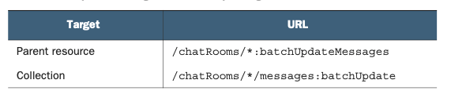

# 第 18 章 批量操作

<div style="background:#f7f5e6; padding:24px; border-radius:4px; color:#405a73;">

**本章内容**
- 批量操作及其与执行一系列标准方法的区别
- 为什么批量操作应该是原子的
- 批量请求方法如何提升公共字段以避免重复
- 对每种批量标准方法（get、delete、create 和 update）的探索
</div><br/>

这个模式提供了指导原则，使 API 用户能够批量操作多个资源，而无需进行单独的 API 调用。
这些所谓的批量操作行为类似于标准方法（在 [第 7 章](ch7.md) 中讨论），但它们避免了多次 API 调用来回交互的必要性。
最终结果是提供了一组方法，允许通过单次 API 调用而不是每个资源一次调用来检索、更新或删除一组资源。

<a id="motivation"></a>
## 18.1 动机

到目前为止，我们探讨的大多数设计模式和指南都侧重于与单个资源进行交互。
事实上，我们在 [第 8 章](ch8.md) 中更进一步，探讨了如何以更细的粒度进行操作，专注于寻址单个资源上的各个字段。
虽然到目前为止这已被证明相当有用，但它在另一端留下了一个空白。
如果我们想要更广泛地操作，同时跨多个资源呢？

在典型的数据库系统中，我们解决这个问题的方式是使用事务。
这意味着，如果我们想要同时操作数据库中的多个不同行，我们只需开始一个事务，像平常一样操作（但在事务的上下文中），然后提交事务。
根据数据库的锁定功能和底层数据的易变性，事务可能会成功或失败，但这里的关键要点是这种原子性。
事务内部包含的操作要么全部失败，要么全部成功；
不会出现部分成功的情况，即某些操作成功执行而其他操作没有。

<ins>不幸的是（或者并非如此，取决于你和谁交谈），大多数 Web API 并不提供这种通用的事务功能 —— 除非该 API 是用于事务性存储服务的。
原因很简单：提供这种能力极其复杂。
然而，这并没有消除 Web API 中对类事务语义的需求。</ins>
一个常见的场景是，API 用户想要更新两个独立的资源，但确实需要这两个独立的 API 请求要么都成功，要么都失败。
例如，假设我们有一个可以启用或禁用的 ChatRoom 日志配置资源。
我们不希望在使用它之前启用它，但也不希望在它启用之前将其称为默认日志配置。
这种 “第 22 条军规” 式的情况是事务性语义存在的主要原因之一，因为如果没有它们，我们唯一的选择就是尝试尽可能接近地执行这两个独立操作（启用配置并将其分配为默认值）。

<ins>显然这是不够的，但这引出了一个大问题：我们能做什么？
我们如何在不构建像大多数关系数据库那样的整个事务系统的情况下，跨多个 API 请求获得某种形式的原子性或事务性语义？</ins>

<a id="overview"></a>
## 18.2 概述

虽然开发一个完全成熟的通用事务设计模式可能很有趣，但这肯定有点过度了。
那么我们能做什么，才能让我们的时间获得最大的价值呢？
换句话说，我们可以削减哪些部分来减少所需的工作量，同时仍然提供对多个资源进行原子操作的支持？

在这个设计模式中，我们将探讨如何通过指定几个自定义方法来提供这些事务性语义的有限版本，这些方法类似于我们在 [第 7 章](ch7.md) 中看到的标准方法，允许对称为批次的任意资源组进行原子操作。
这些方法的命名将与标准方法非常相似（例如 BatchDeleteMessages），但会根据在批次上执行的标准方法而实现差别较大。

*清单 18.1 批量 Delete 方法示例*

```typescript
abstract class ChatRoomApi {
  @post("/{parent=chatRooms/*}/messages:batchDelete")
  BatchDeleteMessages(req: BatchDeleteMessagesRequest): void;
}
```

与大多数此类提议一样，在我们开始工作之前，它会引出相当多的问题。
例如，我们应该为这些方法中的每一个使用什么 HTTP 方法？
它是否应该始终是自定义方法所要求的 POST（参见 [第 9 章](ch9.md) ）？
还是应该与每个标准方法的 HTTP 方法相匹配（例如，BatchGetMessages 使用 GET，BatchDeleteMessages 使用 DELETE）？
还是取决于方法？

那么我们的原子性要求要达到什么程度呢？
如果我尝试使用 BatchGetMessages 检索一批 Message 资源，而其中一个资源已经被删除，我是否真的必须让整个操作失败？
还是可以跳过它并返回那些当时仍然存在的资源？
跨多个父资源操作资源呢？
换句话说，是否应该能够从多个 ChatRoom 中删除 Message 资源？

在这个模式中，我们将探讨如何定义这些批量方法、它们如何工作，
以及我们在 API 中构建此功能时不可避免地会遇到的所有这些奇怪的边缘情况。

<a id="implementation"></a>
## 18.3 实现

正如我们刚刚在第 18.2 节中学到的，我们将依赖特殊命名的自定义方法来支持这些批量操作。
这些方法只是标准方法的批量版本，只有一个例外：标准 list 方法没有批量版本。
这就产生了以下批量自定义方法：

- `BatchGet<Resources>()`
- `BatchCreate<Resources>()`
- `BatchUpdate<Resources>()`
- `BatchDelete<Resources>()`

虽然我们将在后续章节中逐一探讨每个方法的细节，但有必要先了解每个方法共有的一些方面，首先是最重要的一点：原子性。

<a id="atomicity"></a>
### 18.3.1 原子性

当我们说一组操作是原子性的，意思是这些操作彼此之间不可分割。
到目前为止，我们讨论过的所有操作本身都被视为原子性的。
毕竟，标准 create 方法不可能部分失败。
资源要么被创建，要么没有被创建，不存在中间状态。
遗憾的是，我们设计标准方法时让它们各自具备原子性的方式，并不能集体地提供同样的保证。
这些批量操作的目标，就是将同样的原子性原则扩展到对多个资源执行的方法，而不仅仅是对单个资源。

实现这一目标意味着，即使可能有些不便，操作也必须是原子性的。
例如，假设我们尝试使用 BatchGetMessages 方法检索一批 Message 资源。
如果检索其中哪怕一个资源就导致错误，那么整个请求都必须导致错误。
无论是 5 个中有 1 个出错，还是 10,000 个中有 1 个出错，都必须如此。

这样做的原因有两点。
首先，在许多情况下（例如批量更新资源），原子性正是该操作的核心意义所在。
我们明确希望确保要么所有更改都被应用，要么一个都不应用。
虽然批量检索的情况并不完全如此（对于可能不存在的项，我们或许可以接受返回 null 值），但这引出了第二个原因。
如果我们必须支持部分成功，那么管理结果的接口可能会变得相当复杂和繁琐。
相反，通过确保要么完全成功、要么返回单个错误，接口始终面向完全成功，并简单地返回批中涉及的资源列表。

<ins>因此，我们将在这一模式中探讨的所有批量方法都始终是完全原子性的。
响应消息将被设计成只能完全成功或完全失败；永远不会存在中间状态。</ins>

### 18.3.2 对集合的操作

正如我们在 [第 9.3.2 节](ch9.md#resources-vs-collection) 中学到的，当涉及与集合交互的自定义方法时，对于方法的 URL 格式，我们有两种不同的选择。
我们可以直接以父资源为目标，并让自定义方法名包含它所交互的资源；
或者我们可以将自定义动作部分保留为动词，并对集合本身进行操作。
这两种选择总结在表 18.1 中。

*表 18.1 批量方法的目标选项及对应 URL*
<br/>

[第 9 章](ch9.md ) 所指出的内容在今天仍然适用。
每当我们处理一个包含多个同类型资源的集合时，几乎总是更好的做法是对集合本身进行操作。
这对于我们将详细讨论的所有批量方法都成立：它们都将以集合为目标，因此 URL 以 `:batch<Method>` 结尾。

### 18.3.3 结果的顺序

<ins>当我们对一组任意的资源进行操作时，我们需要以某种请求的形式发送它们。
在某些情况下，这可能只是一个唯一标识符的列表（例如，在检索或删除资源时），
但在其他情况下，则需要是资源本身（例如，在创建或更新资源时）。
然而，在所有这些情况下，保持资源的顺序将变得越来越重要。</ins>

为什么保持顺序很重要，最明显的例子是：当我们批量创建新资源，并且不由我们自己选择标识符，而是让服务来选择时。
由于我们没有预先安排好的方式来标识这些新创建的资源，最简单的方法就是使用它们在请求中提供的资源zh中重复字段的索引。
如果我们不保持顺序，就必须在提供的资源和批量创建返回的资源之间进行深度比较，以将创建的项与其服务器分配的标识符匹配起来。

*清单 18.2 用于匹配请求资源的示例代码*

```typescript
let chatRoom1 = ChatRoom({ title: "Chat 1", description: "Chat 1" });
let chatRoom2 = ChatRoom({ title: "Chat 2", description: "Chat 2"});

let results = BatchCreateChatRooms({ resources: [chatRoom1, chatRoom2] });

// 在我们知晓顺序的情况下，可以轻松地将结果与请求操作关联起来。
chatRoom1 = results.resources[0];
chatRoom2 = results.resources[1];

for (let resource of results.resources) {
  // 当我们不知道返回顺序时，必须对资源的所有字段（ID字段除外）做完整相等性比较，以此确保拿到正确的资源。
  if (deepCompare(chatRoom1, resource))
    chatRoom1 = resource;
  else if (deepCompare(chatRoom2, resource))
    chatRoom2 = resource;
}
```

<ins>因此，一个重要的要求是：当批量方法返回批中涉及的资源时，它们必须按照提供时的相同顺序返回。</ins>

<a id="common-fields"></a>
### 18.3.4 公共字段

在批量操作方面，我们有两种主要策略可供选择。
第一种更简单的方案是将批量请求视为一组普通的单资源请求的列表。
第二种方案稍复杂一些，但可以通过将与请求相关的字段提取 (hoist) 出来并简单地重复这些字段来减少重复。

*清单 18.3 提升字段与依赖重复请求的策略*

```typescript
interface GetMessageRequest {
  id: string;
}

interface BatchGetMessagesRequest {
  // 这里我们只是使用 GetMessageRequest 接口构成一个列表。
  requests: GetMessageRequest[];
}

interface BatchGetMessagesRequest {
  // 这里我们提取出相关字段（id），将其嵌入为批量查询用的ID列表。
  ids: string[];
}
```

事实证明，我们需要根据具体方法同时依赖这两种策略，
因为更简单的策略（提供请求列表）更适合需要大量自定义的情况（例如，如果我们需要创建可能具有不同父资源的资源），
而将字段从请求中提取出来的策略则更适合检索或删除资源等更简单的操作，因为这些操作不需要额外的信息。

此外，这些策略并不一定是互斥的。
在某些情况下，我们实际上会在提升某些值的同时，仍然依赖使用请求列表的策略来传达重要信息。
一个很好的例子是批量更新资源，此时我们会依赖一个重复的更新请求列表，同时提取 parent 字段以及可能的字段掩码，以处理部分批量更新。

虽然这种策略组合听起来很棒，但它引出了一个重要问题：当提取的字段与任何单个请求上设置的字段不同时，会发生什么？
换句话说，如果我们有一个提取的 parent 字段设置为 ChatRoom 1，而其中一个待创建资源的 parent 字段设置为 ChatRoom 2，那会怎样？
简短的回答遵循快速且非部分失败的哲学：API 应该直接抛出错误并拒绝该请求。
虽然将资源对提取字段的重新定义视为更具体的覆盖可能很诱人，但这里的代码中很可能存在语义错误，而处理资源组时绝对不是尝试推断用户意图的时候。
相反，如果用户打算在多个资源之间改变提取字段的值，他们应该将提取字段留空或将其设置为通配符值，我们将在下一节中讨论这一点。

<a id="operating-cross-parents"></a>
### 18.3.5 跨父资源操作

依赖单个请求列表而非将字段向上提取到批量请求中，最常见的原因之一是要操作可能同时属于多个不同父资源的多个资源。
例如，清单 18.4 展示了一种定义示例 BatchCreateMessages 方法的方案，它支持跨多个不同父资源创建资源，但采用了一种不寻常（且不正确）的方式。

*清单 18.4 在批量方法中支持多父资源创建的错误方式*

```typescript
interface Message {
  id: string;
  title: string;
  description: string;
}

interface CreateMessageRequest {
  parent: string;
  resource: Message;
  // 我们需要一个父资源列表，这些消息资源将归属到对应的父资源下。
}

interface BatchCreateMessageRequest {
  parents: string[];
  resources: Message[];
  // 这里我们将消息资源从 CreateMessageRequest 接口中提取出来。
}
```

如你所见，它依赖于一个待创建资源的列表，但我们还需要知道每个资源的父资源。
由于该字段不存在于资源本身上，我们现在需要一种方式来跟踪每个资源的父资源。
在这里，我们通过使用第二个父资源列表来实现这一点。
虽然这在技术上可行，但由于严格依赖于维护两个列表的顺序，使用起来可能相当笨拙。
我们该如何处理这种跨父资源的批量操作呢？

<ins>简单的答案是依赖父资源的通配符值，并允许父资源本身在请求列表中变化。
在这种情况下，我们将连字符（-）标准化为通配符，表示 “跨多个父资源”。</ins>

*清单 18.5 创建两个具有不同父资源的资源的 HTTP 请求*

```http
// 我们使用通配符短横线字符，表示多个父资源将在请求体中定义。
POST /chatRooms/-/messages:batchCreate HTTP/1.1
Content-Type: application/json
{
  "requests": [
    {
      // 我们在请求列表中定义实际的父资源，用来创建资源。
      "parent": "chatRooms/1",
      "resource": { ... }
    },
    {
      // 我们在请求列表中定义实际的父资源，用来创建资源。
      "parent": "chatRooms/2",
      "resource": { ... }
    }
  ]
}
```

同样的机制应适用于所有其他可能需要跨属于多个父资源的资源进行操作的批量方法。
然而，就像提取字段一样，这也引出了关于值冲突的问题：如果在 URL 中指定了单个父资源，但某些请求级别的父资源字段发生冲突，该怎么办？

在这种情况下，API 的行为应与 [第 18.3.4 节](#common-fields) 中定义的完全一致：如果存在冲突，我们应拒绝该请求为无效，并等待用户通过另一次 API 调用进行澄清。
原因与之前所述完全相同：用户的意图不明确，而操作一组（可能很大的）资源时绝对不是猜测这些意图的时候。

至此，我们终于可以进入精彩的部分：精确定义这些方法是什么样子，以及每个方法应如何工作。
让我们从最简单的方法之一开始：批量获取。

<a id="batch-delete"></a>
### 18.3.6 批量获取

批量获取方法的目标是通过提供一组唯一标识符，从 API 中检索一组资源。
由于这类似于标准 get 方法，并且是幂等的，批量获取将依赖 HTTP GET 方法进行传输。
然而，这带来了一个问题：GET 方法通常没有请求体。
结果是，标识符列表像我们在 [第 8 章](ch8.md) 中看到的字段掩码那样，在查询字符串中提供。

*清单 18.6 批量获取方法示例*

```typescript
abstract class ChatRoomApi {
  @get("/chatrooms:batchGet")
  BatchGetChatRooms(req: BatchGetChatRoomsRequest):
    BatchGetChatRoomsResponse;

  @get("/{parent=chatRooms/*}/messages:batchGet")
  BatchGetMessages(req: BatchGetMessagesRequest):
    BatchGetMessagesResponse;
}

// 由于聊天室资源没有父级，批量获取请求不需要提供指定父资源的位置。
interface BatchGetChatRoomsRequest {
  // 所有批量获取请求都需要指定待检索的ID列表。
  ids: string[];
}

interface BatchGetChatRoomsResponse {
  // 响应结果始终包含资源列表，资源顺序与请求传入的ID顺序完全一致。
  resources: ChatRoom[];
}

interface BatchGetMessagesRequest {
  // 由于 Message 资源存在父级，请求中需要提供位置来指定父资源（或使用通配符）。
  parent: string;
  // 所有批量获取请求都需要指定待检索的ID列表。
  ids: string[];
}

interface BatchGetMessagesResponse {
  // 响应结果始终包含资源列表，资源顺序与请求传入的ID顺序完全一致。
  resources: Message[];
}
```

如你所见，除非这组资源是没有父资源的顶级资源，否则我们需要在请求消息中为 parent 值指定一些内容。
如果我们打算将检索限制为全部来自同一个父资源，那么答案很明确：使用父资源标识符本身。
相反，如果我们希望提供跨多个不同父资源检索资源的能力，则应像我们在 [第 18.3.5 节](#operating-cross-parents) 中看到的那样，依赖连字符作为通配符值。

虽然总是允许跨父资源检索可能很诱人，但请仔细思考这对用例是否有意义。
也许所有数据现在都在单个数据库中，但将来存储系统可能会扩展并将数据分布到许多不同的地方。
由于父资源是分布键的明显选择，而分布式存储在单个分布键范围之外查询会变得昂贵或困难，因此提供跨父资源检索资源的能力可能会变得异常昂贵或无法查询。
在这些情况下，唯一的选择将是禁止父资源使用通配符，而这几乎肯定是一个破坏性变更（参见 [第 24 章](ch24.md) ）。
并且请记住，正如我们在 [第 18.3.5 节](#operating-cross-parents) 中看到的，如果列表中提供的 ID 与显式指定的父资源（即任何不是通配符的父资源值）冲突，则该请求应被拒绝为无效。

接下来，正如我们在 [第 18.3.1 节](#atomicity) 中学到的，这个方法必须是完全原子性的，即使这很不方便。
这意味着即使 100 个 ID 中只有 1 个因任何原因无效（例如，它不存在或请求用户无权访问它），整个请求也必须完全失败。
在你寻求不那么严格保证的情况下，最好依赖标准 list 方法并应用过滤器来匹配一组可能的标识符之一（有关更多信息，请参见 [第 22 章](ch22.md) ）。

此外，正如我们在 [第 18.3.4 节](#common-fields) 中学到的，如果需要支持资源的部分读取（例如只获取每个指定 ID 资源中的某一个字段），可以像处理父字段一样，将字段掩码提取到请求顶层。
这一个字段掩码会作用于所有被读取的资源。
不应该使用字段掩码列表，为每个资源单独设置不同的字段掩码。

*清单 18.7 在批量获取请求中添加对部分检索的支持*

```typescript
interface BatchGetMessagesRequest {
  parent: string;
  ids: string[];
  // 为支持部分字段检索，批量请求应包含一个统一的字段掩码，该掩码将应用于所有被检索的资源。
  fieldMask: FieldMask;
}
```

<ins>最后，值得注意的是，尽管此请求的响应可能会变得相当大，但批量方法不应实现分页（参见 [第 21 章](ch21.md) ）。
相反，批量方法应定义并记录可检索资源数量的上限。</ins>
这个限制可能因每个单独资源的大小而异，但通常应选择为尽量减小响应过大而导致 API 服务器性能下降或 API 客户端响应大小难以处理的可能性。

### 18.3.7 批量删除

与批量获取操作类似，批量删除也基于标识符列表进行操作，尽管最终目标截然不同。
它的任务不是检索所有这些资源，而是删除每一个资源。
此操作将依赖 HTTP POST 方法，遵循我们在 [第 9 章](ch9.md) 中探讨的自定义方法准则。
并且由于请求必须是原子性的 ——要么删除所有列出的资源，要么返回错误—— 最终返回类型为 void，表示空结果。

*清单 18.8 批量删除方法示例*

```typescript
abstract class ChatRoomApi {
  @post("/chatrooms:batchDelete")
  BatchDeleteChatRooms(req: BatchDeleteChatRoomsRequest): void;

  @post("/{parent=chatRooms/*}/messages:batchDelete")
  BatchDeleteMessages(req: BatchDeleteMessagesRequest): void;
}

interface BatchDeleteChatRoomsRequest {
  // 对于顶层资源，请求中不提供 parent 字段。
  // 和批量获取一样，批量删除操作接收标识符列表，而非资源本身。
  ids: string[];
}

interface BatchDeleteMessagesRequest {
  // Message 资源不属于顶层资源，因此我们需要一个字段存放父资源的值。
  parent: string;
  // 和批量获取一样，批量删除操作接收标识符列表，而非资源本身。
  ids: string[];
}
```

在大多数方面，此方法与我们刚刚在 [第 18.3.6 节](#batch-delete) 中讨论的批量获取方法非常相似。
例如，顶级资源可能没有 parent 字段，但其他资源有。
当指定了 parent 字段时，它必须与提供了 ID 的资源的父资源匹配，否则返回错误结果。
此外，正如批量获取操作的情况一样，通过为 parent 字段使用通配符，可以跨多个不同的父资源进行删除；
然而，由于分布式存储系统日后可能存在的问题，应仔细考虑这样做。

再次特别值得指出的一点是原子性：批量删除操作必须要么删除所有列出的资源，要么完全失败。
这意味着如果 100 个资源中有 1 个因任何原因无法删除，整个操作都必须失败。
这包括资源已被删除且不再存在的情况，而这原本正是该操作的意图。
其原因将在 [第 7 章](ch7.md) 中更详细地探讨，即我们需要对删除操作采取命令式观点，而不是声明式观点。
这意味着我们必须能够说，不仅仅是我们要删除的资源确实不再存在，而且它不再存在是由于执行了这个特定操作，而不是由于之前某个时间点的其他操作。

现在我们已经介绍了基于 ID 的操作，接下来让我们进入更复杂的场景，首先从批量创建操作开始。

### 18.3.8 批量创建

与所有其他批量操作一样，批量创建操作的目的是创建若干个之前不存在的资源 —— 并且以原子方式完成。
与我们已经探讨过的更简单的方法（批量获取和批量删除）不同，批量创建将依赖一种更复杂的策略：接受一个标准创建请求列表，同时搭配一个提取的 parent 字段。

*清单 18.9 批量创建方法示例*

```typescript
abstract class ChatRoomApi {
  @post("/chatrooms:batchCreate")
  BatchCreateChatRooms (req: BatchCreateChatRoomsRequest):
    BatchCreateChatRoomsResponse;

  @post("/{parent=chatRooms/*}/messages:batchCreate")
  BatchCreateMessages (req: BatchCreateMessagesRequest):
    BatchCreateMessagesResponse;
}

interface CreateChatRoomRequest {
  resource: ChatRoom;
}

interface CreateMessageRequest {
  parent: string;
  resource: Message;
}

interface BatchCreateChatRoomsRequest {
  // 不使用资源或ID列表，而是依靠一组标准创建请求构成的列表
  requests: CreateChatRoomRequest[];
}

interface BatchCreateMessagesRequest {
  // 当资源并非顶层资源时，我们同样需要传入父资源（父资源可以是通配符）
  parent: string;
  // 不使用资源或ID列表，而是依靠一组标准创建请求构成的列表
  requests: CreateMessageRequest[];
}

interface BatchCreateChatRoomsResponse {
  resources: ChatRoom[];
}

interface BatchCreateMessagesResponse {
  resources: Message[];
}
```

与其他批量方法类似，parent 字段仅对非顶级资源（在本例中为 ChatRoom 资源）相关，并且限制条件保持不变（即如果提供了非通配符的 parent，它必须与所有正在创建的资源保持一致）。
主要区别在于传入数据的形式。
在这种情况下，我们不是将字段从标准创建请求中提取出来并直接放入批量创建请求中，而是直接包含标准创建请求。

这看起来可能有些不寻常，但有一个相当重要的原因，而且与 parent 有关。
简而言之，我们希望提供以原子方式创建可能具有多个不同父资源的多个资源的能力。
遗憾的是，资源在被创建时，其 parent 通常并不作为字段直接存储在资源本身上。
相反，它通常是在标准创建请求中提供的，从而产生一个以父资源为根的标识符（例如 chatRooms/1/messages/2）。
这一限制意味着，如果我们想允许跨父资源创建资源，而又不要求客户端生成标识符，我们就需要同时提供资源本身及其预期的 parent，而这正是标准创建请求接口所做的。

与其他批量方法的另一个相似之处是顺序约束。
与其他方法一样，新创建资源的列表绝对必须与它们在批量请求中提供的顺序完全一致。
虽然这在大多数其他批量方法中很重要，但在批量创建的情况下更是如此，因为与其他情况不同，正在创建的资源的标识符可能尚不存在，这意味着如果返回的顺序与发送的顺序不同，可能很难发现所创建资源的新标识符。

最后，让我们以批量更新方法作为结束，它与批量创建方法非常相似。

### 18.3.9 批量更新

批量更新方法的目标是在一个原子操作中一起修改一组资源。
正如我们在批量创建方法中看到的那样，批量更新将依赖一个标准更新请求列表作为输入。
在这种情况下，区别在于需要请求列表而非资源列表的理由应该相当明显：部分更新。

在更新资源的情况下，我们可能希望控制要更新的特定字段，而且批量中不同资源需要更新的字段可能不同，这种情况相当常见。
因此，我们可以像设计批量创建方法时处理 parent 字段那样来处理字段掩码。
这意味着我们希望能够对正在更新的不同资源应用不同的字段掩码，同时也能够对所有正在更新的资源应用一个统一的字段掩码。
显然，这些不能冲突，这意味着如果批量请求设置了字段掩码，则各个请求上的字段掩码必须与之匹配或留空。

*清单 18.10 批量更新方法示例*

```typescript
abstract class ChatRoomApi {
  // 尽管标准更新方法使用HTTP PATCH方法，但这里我们依靠HTTP POST方法
  @post("/chatrooms:batchUpdate")
  BatchUpdateChatRooms (req: BatchUpdateChatRoomsRequest):
    BatchUpdateChatRoomsResponse;

  // 尽管标准更新方法使用HTTP PATCH方法，但这里我们依靠HTTP POST方法
  @post("/{parent=chatRooms/*}/messages:batchUpdate")
  BatchUpdateMessages (req: BatchUpdateMessagesRequest):
    BatchUpdateMessagesResponse;
}

interface UpdateChatRoomRequest {
  resource: ChatRoom;
  fieldMask: FieldMask;
}

interface UpdateMessageRequest {
  resource: Message;
  fieldMask: FieldMask;
}

interface BatchUpdateChatRoomsRequest {
  // 和批量创建方法一样，我们使用请求列表，而不是资源列表
  requests: UpdateChatRoomRequest[];
  // 如果所有资源的字段掩码都相同，我们可以将用于部分更新的字段掩码提升到批量请求层级
  fieldMask: FieldMask;
}

interface BatchUpdateMessagesRequest {
  parent: string;
  // 和批量创建方法一样，我们使用请求列表，而不是资源列表
  requests: UpdateMessageRequest[];
  // 如果所有资源的字段掩码都相同，我们可以将用于部分更新的字段掩码提升到批量请求层级
  fieldMask: FieldMask;
}

interface BatchUpdateChatRoomsResponse {
  resources: ChatRoom[];
}

interface BatchUpdateMessagesResponse {
  resources: Message[];
}

```

还值得一提的是，即使我们在标准更新方法中使用了 HTTP PATCH 方法，为了避免任何潜在冲突（以及违反任何标准），批量更新方法应像所有其他自定义方法一样使用 HTTP POST 方法。

### 18.3.10 最终 API 定义

至此，我们可以通过查看示例聊天室 API 中支持批量方法的最终 API 定义来收尾。
清单 18.11 展示了我们如何将所有这些批量方法组合在一起，以支持广泛的功能，通过单个 API 调用对可能很大的资源组进行操作。

*清单 18.11 最终 API 定义*

```typescript
abstract class ChatRoomApi {
  @post("/chatrooms:batchCreate")
  BatchCreateChatRooms(req: BatchCreateChatRoomsRequest):
    BatchCreateChatRoomsResponse;

  @post("/{parent=chatRooms/*}/messages:batchCreate")
  BatchCreateMessages(req: BatchCreateMessagesRequest):
    BatchCreateMessagesResponse;

  @get("/chatrooms:batchGet")
  BatchGetChatRooms(req: BatchGetChatRoomsRequest):
    BatchGetChatRoomsResponse;

  @get("/{parent=chatRooms/*}/messages:batchGet")
  BatchGetMessages(req: BatchGetMessagesRequest):
    BatchGetMessagesResponse;

  @post("/chatrooms:batchUpdate")
  BatchUpdateChatRooms(req: BatchUpdateChatRoomsRequest):
    BatchUpdateChatRoomsResponse;

  @post("/{parent=chatRooms/*}/messages:batchUpdate")
  BatchUpdateMessages(req: BatchUpdateMessagesRequest):
    BatchUpdateMessagesResponse;

  @post("/chatrooms:batchDelete")
  BatchDeleteChatRooms(req: BatchDeleteChatRoomsRequest): void;

  @post("/{parent=chatRooms/*}/messages:batchDelete")
  BatchDeleteMessages(req: BatchDeleteMessagesRequest): void;
}

interface CreateChatRoomRequest {
  resource: ChatRoom;
}

interface CreateMessageRequest {
  parent: string;
  resource: Message;
}

interface BatchCreateChatRoomsRequest {
  requests: CreateChatRoomRequest[];
}

interface BatchCreateMessagesRequest {
  parent: string;
  requests: CreateMessageRequest[];
}

interface BatchCreateChatRoomsResponse {
  resources: ChatRoom[];
}

interface BatchCreateMessagesResponse {
  resources: Message[];
}

interface BatchGetChatRoomsRequest {
  ids: string[];
}

interface BatchGetChatRoomsResponse {
  resources: ChatRoom[];
}

interface BatchGetMessagesRequest {
  parent: string;
  ids: string[];
}

interface BatchGetMessagesResponse {
  resources: Message[];
}

interface UpdateChatRoomRequest {
  resource: ChatRoom;
  fieldMask: FieldMask;
}

interface UpdateMessageRequest {
  resource: Message;
  fieldMask: FieldMask;
}

interface BatchUpdateChatRoomsRequest {
  parent: string;
  requests: UpdateChatRoomRequest[];
  fieldMask: FieldMask;
}

interface BatchUpdateMessagesRequest {
  requests: UpdateMessageRequest[];
  fieldMask: FieldMask;
}

interface BatchUpdateChatRoomsResponse {
  resources: ChatRoom[];
}

interface BatchUpdateMessagesResponse {
  resources: Message[];
}

interface BatchDeleteChatRoomsRequest {
  ids: string[];
}

interface BatchDeleteMessagesRequest {
  parent: string;
  ids: string[];
}
```

<a id="trade-offs"></a>
## 18.4 权衡

对于许多不同的批量方法，我们做出了不少非常具体的决策，这些决策对最终的 API 行为产生了相当重要的影响。
首先，所有这些方法都将原子性置于首位，即使这可能有些不便。
例如，如果我们尝试删除多个资源，而其中一个已经被删除，那么整个批量删除方法都将失败。
这是一个重要的权衡，目的是避免处理那种支持返回部分成功、部分失败结果的 API，而是专注于坚持大多数现代数据库系统中的事务语义行为。
虽然这可能会在常见场景中带来一些麻烦，但它确保了 API 方法尽可能一致和简单，同时仍然提供了重要的功能。

其次，尽管输入数据的格式可能存在一些不一致（有时是原始 ID；有时是标准请求接口），但这些方法的设计强调简洁性而非一致性。
例如，我们可以对所有批量方法都坚持使用标准请求的重复列表；
然而，其中一些方法（特别是批量获取和批量删除）仅仅为了提供标识符就会包含不必要的间接层级。
通过将这些值提升到批量请求中，我们以合理程度的不一致为代价，换来了更简洁的体验。

<a id="exercises"></a>
## 18.5 练习

1. 为什么批量方法的结果必须按特定顺序返回？
如果顺序错乱会发生什么？

2. 在批量更新请求中，如果请求上的 parent 字段与某个正在更新的资源上的 parent 字段不匹配，响应应该是什么？

3. 为什么批量请求必须是原子性的？
如果某些请求可以成功而其他请求可以失败，API 定义会是什么样子？

4. 为什么批量删除方法依赖 HTTP POST 动词而不是 HTTP DELETE 动词？

<a id="summary"></a>
## 本章小节

- 批量方法应按照 `Batch<Method><Resources>()` 的格式命名，并且应该是完全原子性的，要么执行批中的所有操作，要么一个都不执行。

- 对同一类型的多个资源进行操作的批量方法，通常应以集合为目标，而不是以父资源为目标（例如，使用 `POST /chatRooms/1234/messages:batchUpdate`，而不是 `POST /chatRooms/1234:batchUpdateMessages`）。

- 批量操作的结果应与最初发送的资源或请求的顺序相同。

- 使用通配符连字符来指示要在各个请求中定义的资源的多个父资源。
