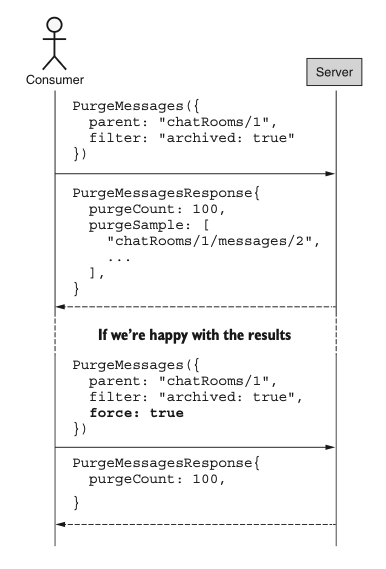

# 第 19 章 基于条件的删除

<div style="background:#f7f5e6; padding:24px; border-radius:4px; color:#405a73;">

**本章内容**
- 如何使用自定义 purge 方法删除匹配的资源
- 为什么自定义 purge 方法很危险，应尽可能避免
- 各种安全预防措施，以避免意外删除超出预期的数据
- 如何解决对匹配结果集一致性的担忧
</div><br/>

虽然我们在 [第 18 章](ch18.md) 中学到的批量操作提供了通过单次 API 调用删除多个资源的能力，但有一个隐含的要求：我们必须事先知道要删除的资源的唯一标识符。
然而，在许多场景中，我们并不那么关心删除特定的资源列表，而是更关心删除任何恰好匹配某一组条件的资源。
<ins>这种设计模式提供了一种机制，使我们能够安全且原子性地移除所有匹配特定条件的资源，而不是通过标识符列表来删除。</ins>

<a id="motivation"></a>
## 19.1 动机

从 [第 18 章](ch18.md) 可以明显看出，想要同时操作多个资源并不罕见。
更具体地说，我们可能想清除一组特定的资源。
然而，与其他批量操作相比，删除操作到目前为止是最直接的，执行操作不需要其他任何信息：给定一个 ID，移除该资源。

这是一个很棒的功能，但它要求我们已经确切知道想要删除哪些资源。
这意味着如果我们还不知道这些信息，就必须先进行调查。
例如，假设我们想删除所有被标记为已归档的 ChatRoom 资源。
要实现这一点，我们需要找出哪些资源具有这个特定设置，然后使用这些标识符通过批量删除方法来移除资源。

*清单 19.1 使用标准 list 方法和批量删除方法进行基于条件的删除*

```typescript
function deleteArchivedChatRooms(): void {
  // 首先我们必须找到所有已归档的资源
  const archivedRooms = ListChatRooms({
    filter: "archived: true"
  });
  // 拿到标识符之后，我们就可以删除全部资源
  return BatchDeleteChatRooms({
    ids: archivedRooms.map( (room) => room.id )
  });
}
```

遗憾的是，这种设计存在几个问题。
首先，也是最明显的，它至少需要两次独立的 API 调用。
更糟糕的是，正如我们将在 [第 21 章](ch21.md) 中学到的，列出资源不太可能是单个请求，而更可能涉及一长串重复请求来找到所有匹配的资源。
其次，也是最重要的，这两个方法拼接在一起会导致非原子性的结果。
换句话说，当我们收集完所有已归档资源的 ID 时，其中一些可能已经被取消归档了。
这意味着当我们在删除这些资源时，可能正在删除那些已经不再归档的资源！

由于这些重大问题，我们有必要提供一种替代方案，即提供一个单一方法，允许我们基于某组条件来删除资源，而不是仅基于标识符列表来删除。

<a id="overview"></a>
## 19.2 概述

这种模式引入了一个新自定义方法的概念：purge。
purge 方法的目的是接受一个可以执行的简单过滤器，并删除任何匹配该过滤条件的結果。
本质上，它是标准 list 方法与批量删除方法的结合。
然而，与将一个方法的输出管道传输到另一个方法的输入不同（如清单 19.1 所示），我们可以使用单次 API 调用来实现我们的目标。

虽然该方法及其目的很直接，但我们也必须考虑一个明显的担忧：这个方法很危险。
正如我们将在 [第 25 章](ch25.md) 中看到的，用户无法避免犯错，我们常常担心用户删除了数据之后又后悔。
在这种情况下，我们不是交给用户一个删除单个资源的工具（标准 delete），甚至不是交给他们一个删除大量资源的工具（批量 delete），而是现在把最大的工具交给了他们。
purge 方法允许用户在甚至不清楚自己正在删除的全部范围的情况下删除资源。
在适当的条件下（例如，一个匹配所有资源的过滤器），我们能够完全抹掉系统中存储的所有数据！

为了避免这种潜在的灾难性结果，我们将提供两个具体的杠杆，用户可以作为防护栏来依赖。
首先，我们将要求在实际删除任何内容之前，在请求上设置一个显式的布尔标志（force）。
其次，在该标志未设置的情况下（因此请求不会被执行），我们将提供一个方法来预览如果请求实际执行会发生什么。
这将包括将被删除的项数（purgeCount）以及恰好匹配结果列表的一些项的预览（purgeSample）。
在某些方面，这有点像在请求上有一个 validateOnly 字段（参见 [第 27 章](ch27.md) ），但默认值相反：除非显式请求，否则请求始终仅用于验证。

<a id="implementation"></a>
## 19.3 实现

为了了解这个方法如何工作，让我们从 purge 方法的典型流程开始。
如图 19.1 所示，流程始于一个提供要应用的过滤器的请求，但将 force 标志设置为 false（或未设置）。
由于这相当于一个验证请求，实际上不会删除任何资源，而是将 purgeSample 字段填充为将被删除的资源的标识符列表。
此外，purgeCount 字段将提供匹配该过滤器并因此将被请求删除的资源数量的估计值。

利用验证请求返回的这些新信息，我们可以再次确认 purgeSample 字段中返回的资源确实符合过滤器中表达的意图。
然后，如果我们决定继续删除包含的所有资源，我们可以再次发送相同的请求，这次将 force 标志设置为 true。
在响应中，只有 purgeCount 字段应被填充，表示通过执行请求删除的资源数量。

现在我们已经了解了整体流程，让我们深入探讨这些字段中每个字段的棘手细节，并探索它们如何协同工作，首先从 filter 字段开始。

<a id="filtering-results"></a>
### 19.3.1 过滤结果

正如你所预料的，filter 字段应完全按照标准 list 方法上的方式工作，正如我们将在 [第 22 章](ch22.md) 中看到的。
purge 方法的全部要点在于，它提供的功能几乎与标准 list 方法结合批量删除方法完全相同。
这意味着由 purge 方法指定并执行的过滤器，其行为应与将同一过滤器提供给标准 list 方法时完全相同。

*图 19.1 purge 方法的交互模式* <br/>
<br/>

一个不寻常且令人担忧的后果是，正如标准 list 方法上空的或未设置的过滤器返回 API 托管的所有资源一样，purge 方法也应具有相同的行为。
换句话说，我们处于一个非常棘手的情况：如果用户忘记指定过滤器（或者由于编码错误导致过滤器被设置为 undefined 或空字符串），该方法将匹配所有现有资源，并且在强制执行的情况下，删除所有资源。
虽然这当然很危险，但这正是将其他故障保护机制内置到此设计中的原因。

*清单 19.2 导致灾难性后果的小拼写错误*

```typescript
// 该方法接收一个过滤字符串，删除所有匹配该过滤条件的消息资源
function deleteMatchingMessages(filter: string): number {
  const result = PurgeMessages({
    parent: "chatRooms/1",
    // 不幸的是，这里有一处拼写错误（写成fliter而不是filter），
    // 会导致filter字段为undefined，从而总是匹配所有资源
    filter: fliter,
    force: true,
  });
  return result.purgeCount;
}
```

虽然阻止这类请求可能更安全，但不幸的现实是，用户确实有执行这类操作的需求，而且与标准 list 方法的一致性至关重要 —— 否则用户可能会开始认为过滤器在不同方法中的工作方式不同。
因此，例如，我们不能简单地拒绝缺少过滤器的请求。
话虽如此，正是这类场景推动了这样一个理念：默认情况下，purge 方法的行为就好像我们只是在请求预览。
在下一节中，我们将更详细地探讨这一点。

### 19.3.2 默认仅验证

正如我们将在 [第 27 章](ch27.md) 中学到的，我们可以依赖一个特殊的 validateOnly 标志，使 API 方法仅验证传入的请求，而不实际执行请求本身。
我们有意选择这个字段的名称，以推动默认值的设计，使得该方法在未明确要求相反操作时正常行为（关于此主题的更多讨论，请参见 [第 5.2 节](ch5.md#booleans) ）。

虽然这个默认值对于那些情况是合适的，但正如我们刚刚在 [第 19.3.1 节](#filtering-results) 中学到的，它对 purge 方法来说异常危险，因为它允许一个微小的错误导致从 API 中删除可能大量的数据。
如果我们完全依赖请求验证，忘记指定请求仅用于验证，将导致删除数据，而不是像我们希望的那样提供某种预览。

*清单 19.3 默认值错误导致的遗漏造成灾难性后果*

```typescript
PurgeMessages({
  parent: "chatRooms/1",
  filter: "...",
  // 如果我们依赖 validateOnly 标识，一旦完全省略该标识，就可能意外删除大量数据！
  // validateOnly: true
});
```

这是我们实际上希望方法默认被削弱，而不是相反的少数场景之一。
换句话说，如果某个字段被遗忘（也许用户没有正确阅读文档），默认行为应该对用户是安全的，而不会导致灾难性后果。

为了实现这一点，我们依赖一个名为 force 的字段，它的作用与 validateOnly 字段完全相同，但命名方式导致不同的默认行为。
由于这种差异，忘记设置此字段（或将其保留为 false）会导致完全安全的结果：根本不会删除任何数据。
除了不删除任何数据之外，我们实际上还能获得一个有用的预览，显示如果请求实际执行会得到什么结果。
这个预览由两个关键信息组成：匹配资源的数量以及这些匹配资源的样本集。
在下一节中，我们将首先了解这个结果计数是如何工作的。

### 19.3.3 结果计数

无论 purge 请求是要执行的还是仅用于验证的，一个非常有用的信息是恰好匹配所提供过滤器的资源数量。
为此，purge 响应应包含一个提供此信息的 purgeCount 字段。

不过有一个问题：虽然在实际执行的请求（force: true）中，该值应该是实际删除项数的精确计数，但当请求仅用于验证时，该值可以选择提供合理的估计值，而不是精确计数，因为在某些情况下，查找并统计所有可能匹配项可能会消耗大量计算资源。
而且由于我们并不会真正经历删除所有匹配项的过程，并且希望避免浪费计算能力，依赖估计值而非完全精确的计数并没有什么大不了的。
话虽如此，目标是尽可能贴近现实，因此估计值至少要在某种程度上反映现实，这一点很重要。

在依赖此字段的估计值时，需要考虑的一点是：低估可能会极具误导性，应尽可能避免。
要理解其中原因，请考虑这样一种场景：响应表明估计有 100 个资源匹配给定的过滤器。
这可能会让用户产生一种虚假的信心，认为 purge 方法不会删除那么多资源。
如果实际上匹配的资源数量接近 1,000，当真实结果出来时（显示 1,000 个资源已被删除，而估计值只有 100），用户首先会感到震惊，但当他们意识到如果估计值更贴近现实（比如 750 个匹配资源），他们本可以回头修改过滤器表达式时，他们会格外沮丧。

由于这个原因以及其他各种原因，查看给定过滤器的匹配资源数量当然是有用的信息（无论对于实际执行的请求还是验证请求），
但对于仅验证的请求，我们还可以提供更有用的数据：匹配并因此将被删除的资源的样本集。
在下一节中，我们将探讨如何最好地实现这一点。

### 19.3.4 结果样本集

正如我们所见，预览匹配所提供过滤器的资源数量是有用的，但当然并不完美。
事实上，即使计数是精确数字而非估计值，我们仍然必须承认这只是一个单一的指标，仅仅统计所有匹配的资源，而在许多情况下，这种类型的聚合实际上可能具有误导性。

例如，考虑 100 个项中有 50 个匹配某个过滤器的情况。
我们怎么知道我们即将删除的是正确的 50 个项？
也许我们本意是删除所有 50 个已归档资源，结果却即将删除所有 50 个未归档资源！
匹配项的计数通常有助于发现明显的问题，但当问题更微妙时就会失效。

为了解决这个问题，除了匹配资源的计数之外，我们还可以依赖验证响应，在一个名为 purgeSample 的字段中提供将被删除的项的样例子集。
该字段应包含匹配资源的标识符列表，然后可以对这些标识符进行抽查以验证准确性。
例如，我们可以检查返回的几个资源，确认它们确实被标记为已归档，而不是相反。

尽管这需要一些额外的工作，但仍然相当有用。
例如，在用户界面中，我们可以使用批量获取方法检索其中一些项，并将它们显示给用户进行验证，以确保预览中列出的资源看起来像是他们打算删除的资源。
如果用户认为这些资源看起来都没有问题，他们就可以通过将 force 设置为 true 重新发送请求来继续执行该请求。

但这引出了一个显而易见的问题：这个预览样本中应该有多少个项？
一般来说，由于目标是帮助发现过滤器表达式中的任何错误，样本大小必须足够大，以便用户能够注意到某些看起来不对劲的地方
（例如，如果某个不应该匹配的资源恰好出现在样本集中）。
<ins>因此，一个好的指导原则是：对于较大的数据集，至少提供 100 个项；而对于查询成本相对较低的较小数据集，则提供精确匹配。</ins>

### 19.3.5 一致性

最后一个需要担心的问题要棘手得多，至少值得在这里提一下：一致性。
如果我们发送一个仅用于验证的 purge 请求，当时只有少量资源将被删除，
但等到我们稍后发送实际执行请求时，数据已经发生了变化，导致更多资源匹配该过滤器，会发生什么？
换句话说，有没有办法保证验证期间返回的数据与稍后执行期间将被删除的数据一致？
遗憾的是，简短的回答是否定的。

即使我们有能力对特定时间点的数据快照执行查询，对过去出现的数据执行 purge 请求也不太可能产生期望的结果。
事实上，如果这种行为真的是意图所在，那么它已经由标准 list 请求和批量删除请求的组合所支持了。

此外，虽然在技术上我们可以在验证请求和实际执行请求之间数据发生变化时要求 purge 方法失败，
但在任何足够大、并发且易变的数据集上，该方法实际上将变得毫无用处。
而在 API 的世界中，这种情况并不罕见。

### 19.3.6 最终 API 定义

现在我们已经完全掌握了 purge 方法的工作原理，让我们看一个简短的方法示例，该方法用于删除所有满足过滤字符串中指定条件的 Message 资源。

*清单 19.4 最终 API 定义*

```typescript
abstract class ChatRoomApi {
  @post("/{parent=chatRooms/*}/messages:purge")
  PurgeMessages(req: PurgeMessagesRequest): PurgeMessagesResponse;
}

interface PurgeMessagesRequest {
  parent: string;
  filter: string;
  force?: boolean;
}

interface PurgeMessagesResponse {
  purgeCount: number;
  purgeSample: string[];
}
```

<a id="trade-offs"></a>
## 19.4 权衡

如果你还没有注意到，这是一个危险的方法。
它有点像把火箭筒交给 API 的使用者，让他们能够非常容易且非常快速地摧毁大量数据。
虽然设计的方法试图提供尽可能多的安全检查，但它仍然为用户可能错误地摧毁大量（如果不是全部）数据打开了大门。
因此，除非这是绝对必要的，否则通常最好避免在 API 中支持此功能。

<a id="exercises"></a>
## 19.5 练习

1. 为什么自定义 purge 方法应仅限于绝对必要的情况？

2. 为什么 purge 方法默认仅执行验证？

3. 如果过滤条件留空会发生什么？

4. 如果资源支持软删除，purge 方法对该资源的预期行为是什么？
它应该软删除资源吗？
还是彻底清除它们？

5. 返回受影响资源数量的目的是什么？
返回匹配资源样本集的目的又是什么？

<a id="summary"></a>
## 本章小节

- 自定义 purge 方法应用于删除匹配特定过滤条件集的多个资源，但仅在绝对必要时才应支持。

- 默认情况下，purge 请求应仅用于验证，而不是实际删除任何资源。

- 所有 purge 响应都应包含受影响资源数量的计数（以及匹配结果的样本集），但对于验证请求，这可能是估计值。

- purge 方法应遵循与标准 list 方法相同的一致性准则。
