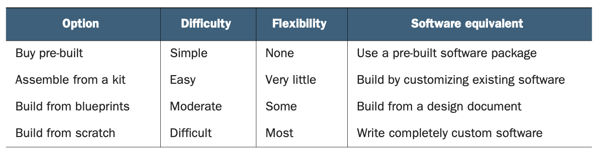
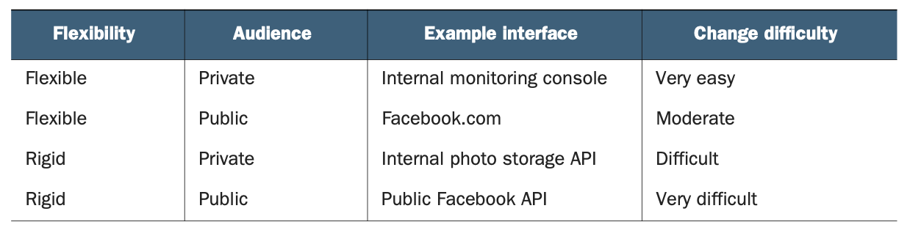
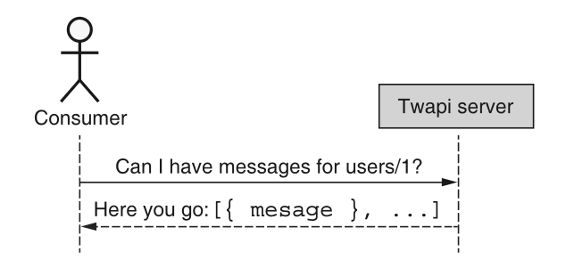
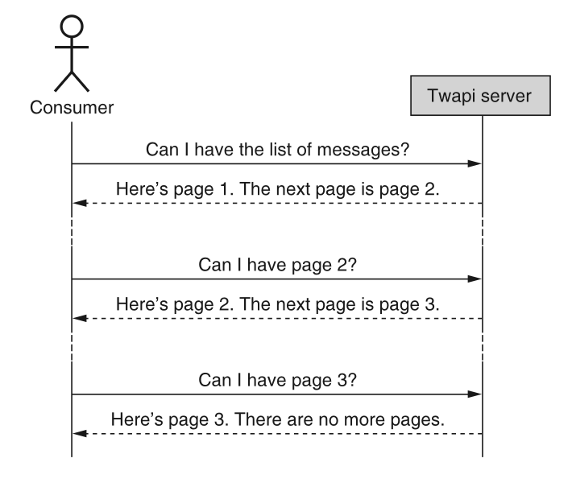

# 第 2 章 API 设计模式简介

<div style="background:#f7f5e6; padding:24px; border-radius:4px; color:#405a73;">

**本章内容**
- 什么是 API 设计模式
- 为什么 API 设计模式很重要
- API 设计模式的组成部分和结构
- 使用和不使用设计模式设计 API

</div><br/>

现在我们已经掌握了什么是 API 以及什么使它们 “好”，我们可以探索如何在构建 API 时应用不同的模式。
我们将从探讨什么是 API 设计模式、它们为什么重要以及它们将在后面的章节中如何被描述开始。
最后，我们将看一个 API 示例，看看使用预先构建的 API 设计模式如何节省大量时间和未来的麻烦。

<a id="what"></a>
## 2.1 什么是 API 设计模式？

在开始探索 API 设计模式之前，我们需要先做一些基础工作，从一个简单的问题开始：什么是设计模式？
如果我们注意到软件设计指的是为解决某个问题而编写的某些代码的结构或布局，那么软件设计模式就是当一种特定的设计可以被反复应用于许多类似的软件问题，只需进行微小的调整以适应不同场景时的情况。
这意味着模式不是我们用来解决单个问题的某个预构建库，而更像是一个用于解决结构相似问题的蓝图。

如果这看起来太抽象，让我们具体化一下，想象我们想在自家后院建一个棚子。
有几种不同的选择，从几百年前的做法到今天，多亏了像 Lowe's 和 Home Depot 这样的公司的魔力，我们可以有多种选择。
有很多选择，但常见的四种如下：

1. 购买一个预建好的棚子，直接放在后院。
2. 购买一个棚子套件（蓝图和材料），然后自己组装。
3. 购买一套棚子蓝图，根据需要修改设计，然后自己建造。
4. 从头开始设计和建造整个棚子。

如果我们将这些与软件中的等价物相比较，它们将范围从使用预先构建的现成软件包，一直到编写一个完全定制的系统来解决我们的问题。
在表 2.1 中，我们看到这些选项在列表中越往后就越困难，但也从一个选项到下一个选项增加了越来越多的灵活性。
换句话说，最不困难的灵活性最小，而最困难的灵活性最大。

*表 2.1 建造棚子的方式与构建软件的方式比较* <br/>
<br/>

软件工程师大多数时候倾向于选择 “从头构建” 的选项。
有时这是必要的，特别是在我们解决的问题是新的情况下。
其他时候，这种选择在成本效益分析中胜出，因为我们的问题恰好与现有方案有足够的不同，以至于无法依赖更容易的选项。
还有一些时候，我们知道恰好有一个库解决了我们的问题（或者足够接近），我们选择依赖别人已经解决了当前问题的事实。
事实证明，选择中间选项（定制现有软件或从设计文档构建）不太常见，但可能可以更频繁地使用，并取得很好的效果。
而这正是设计模式的用武之地。

<ins>在高层次上，设计模式是应用于软件的 “Build from blueprints” 选项。
就像棚子的蓝图包含尺寸、门窗位置和屋顶材料一样，设计模式也包含一些关于我们编写的代码的规范和细节。</ins>
在软件中，这通常意味着指定代码的高层布局，以及依赖于该布局来解决特定设计问题的细微之处。
然而，设计模式很少被设计成完全独立使用。
大多数情况下，设计模式关注的是特定的组件，而不是整个系统。
换句话说，蓝图关注的是单个方面（如屋顶形状）或组件（如窗户设计）的形状，而不是整个棚子。
乍一看，这似乎是一个缺点，但这仅仅是在目标恰好是建造一个棚子的情况下。
如果你试图建造某种像棚子但不完全是棚子的东西，那么拥有每个单独组件的蓝图意味着你可以将它们中的许多混合搭配，
精确地构建出你想要的东西，选择屋顶形状 A 和窗户设计 B。
这也适用于我们对设计模式的讨论，因为每种模式往往关注系统的一个单一组件或问题类型，通过组装许多预先设计的部件，帮助你精确地构建你想要的。

例如，如果你想向系统中添加调试日志记录，你很可能想要且只想要一种记录消息的方式。
有很多方法可以做到这一点（例如，使用一个共享的全局变量），但碰巧有一种旨在解决这个软件问题的设计模式。
这种模式在开创性的著作《设计模式》（Gamma 等，1994）中有所描述，被称为单例模式（singleton pattern），它确保只创建一个类的单个实例。
这个 “蓝图” 要求一个类具有私有构造函数和一个名为 `getInstance()` 的静态方法，该方法始终返回该类的单个实例（它仅在实例尚不存在时负责创建该单个实例）。
这个模式完全不是完整的（毕竟，拥有一个什么都不做的单例类有什么用呢？）；
然而，当您需要解决这个始终拥有某个类的单个实例的小型、独立的问题时，它是一个定义明确且经过充分测试的模式。

既然我们已经大致了解了软件设计模式是什么，我们就必须问一个问题：什么是 API 设计模式？
使用 [第 1 章](ch1.md) 中描述的 API 定义，API 设计模式就是一种应用于 API 而非一般所有软件的软件设计模式。
这意味着 API 设计模式，就像常规设计模式一样，只是设计和构建 API 方式的蓝图。
由于关注点在于接口而非实现，在大多数情况下，API 设计模式将专门关注接口，而不一定构建实现。
虽然大多数 API 设计模式通常对底层实现保持沉默，但有时它们会规定 API 行为的某些方面。
例如，一个 API 设计模式可能指定某个 RPC 可以是最终一致的，这意味着从该 RPC 返回的数据可能稍微过时（例如，可以从缓存中读取，而不是从权威存储系统中读取）。

我们将在后面的部分中更正式地解释我们计划如何记录 API 模式，但首先让我们快速了解一下为什么我们应该完全关注 API 设计模式。

<a id="why"></a>
## 2.2 为什么 API 设计模式很重要？

正如我们已经了解的，API 设计模式在构建 API 时非常有用，就像蓝图在建造棚子时一样：它们充当我们可以在项目中使用的预先设计好的构建块。
我们没有深入探讨的是，为什么我们首先需要这些预先设计的蓝图。
难道我们都足够聪明，可以构建出好的 API 吗？
难道我们不最了解自己的业务和技术问题吗？
虽然情况往往如此，但事实证明，我们用来构建设计良好的软件的一些技术，在构建 API 时并不那么有效。
更具体地说，敏捷开发过程特别提倡的迭代方法，在应用于 API 设计时很困难。
<ins>要理解其中的原因，我们必须审视软件系统的两个方面。
首先，我们必须探讨各种接口的灵活性（或刚性），然后我们必须理解接口的受众对我们的更改能力和整体设计迭代能力有什么影响。
让我们从灵活性开始。</ins>

正如我们在 [第 1 章](ch1.md) 中看到的，API 是一种特殊类型的接口，其主要是为了使计算系统能够相互交互。
<ins>虽然对系统的编程访问非常有价值，但它也更加脆弱和易碎，因为对接口的更改很容易导致使用该接口的人发生故障。</ins>
例如，更改 API 中字段的名称，会导致在名称更改发生之前用户编写的任何代码发生故障。
从 API 服务器的角度来看，旧代码正在使用一个不再存在的名称请求某些东西。
这与图形用户界面（GUI）等其他类型的接口有很大的不同，后者主要由人类而非计算机使用，因此对变化的适应性更强。
这意味着，即使一个变化可能令人沮丧或在美学上令人不快，但它通常不会导致我们完全无法使用该界面的灾难性故障。
例如，更改网页上按钮的颜色或位置可能很丑且不方便，但我们仍然可以弄清楚如何使用该界面完成我们需要做的事情。

<ins>我们通常将接口的这一特性称为 *灵活性* ：如果用户能轻松适配变更，这类接口就是灵活的；而只要微小改动（例如重命名字段）就会引发整体失效的接口，则是 *刚性的* 。</ins>
这一区分十分关键，因为能否进行大量迭代变更，很大程度上由接口的灵活性决定。
最重要的一点是，刚性接口会极大阻碍我们像其他软件项目那样，通过迭代打磨出优秀设计。
这意味着我们往往会被所有设计决策困住，无论决策好坏。
读到这里你可能会认为，API 的刚性意味着我们永远无法采用迭代开发流程，但事实并非总是如此 —— 这得益于接口的另一项重要特性： *可见性* 。

<ins>一般来说，我们可以将大多数接口分为两类：用户可以看到并与之交互的（在软件中通常称为前端）和用户不能看到的（通常称为后端）。</ins>
例如，当我们打开浏览器时，可以很容易地看到 Facebook 的图形用户界面；然而，我们无法看到 Facebook 如何存储我们的社交图谱和其他数据。
<ins>对于可见性这一方面，用更正式的术语来说，我们可以说前端（所有用户看到并与之交互的部分）通常被认为是公开的，而后端（只有较小的内部群体可见）被认为是私有的。
这种区分很重要，因为它部分地决定了我们对不同类型的接口进行更改的能力，特别是像 API 这样僵化的接口。</ins>

如果我们对公共接口进行更改，全世界都会看到它，并可能受到影响。
由于受众如此庞大，草率地做出更改可能会导致用户愤怒或不满。
虽然这当然适用于像 API 这样的僵化接口，但它也同样适用于灵活的接口。
例如，在 Facebook 的早期，大多数重大的功能或设计更改都会在几周内引起大学生们的愤怒。
但如果接口不是公共的呢？
对只属于某个私有内部群体成员的后端接口进行更改，会有大问题吗？
在这种情况下，受更改影响的用户数量要少得多，甚至可能仅限于同一团队或同一办公室的人，因此我们似乎重新获得了一些更改的自由。
这是个好消息，因为这意味着我们应该能够快速迭代，朝着理想的设计前进，并在此过程中应用敏捷原则。

那么，API 为何特殊？
<ins>事实是，当我们设计大量 API（这类 API 本身就具备刚性特征）并对外公开时，在上述两个特性上，我们面对的其实是最坏场景。
这意味着修改 API 的难度，远高于这两项特性其他任意组合下的变更难度（如表 2.2 所示）</ins>

*表 2.2 更改各种接口的难度* <br/>
<br/>

<ins>简单来说，这种 “两头都难” 的局面（既刚性又难以修改），使得可复用、经过验证的设计模式，在构建API时比在其他类型软件中更为重要。</ins>
大多数软件项目里，代码通常是私有且不可见的，但 API 中的设计决策完全暴露在外，展示给该服务的所有使用者。
由于这严重限制了我们对设计做增量优化的能力，
<ins>依托那些久经考验的现有模式就极具价值：争取一次就把设计做对，而不是像大多数软件那样，靠后续迭代逐步完善。</ins>

现在我们已经探讨了这些设计模式之所以重要的一些原因，让我们通过剖析一个 API 设计模式并探索其各个组成部分，来深入了解它。

<a id="anatomy"></a>
## 2.3 API 设计模式的组成部分

像软件设计中的大多数部分一样，API 设计模式由几个不同的组件构成，每个组件负责消费该模式本身的不同方面。
显然，主要的组件关注于模式本身如何工作，但还有其他组件针对消费设计模式的非技术方面。
这些方面包括：弄清楚对于一组给定问题是否存在某种模式、理解该模式是否适合你正在处理的问题，以及理解为什么模式以一种方式做事，而不是使用（可能更简单的）替代方案。

由于这个解剖课程可能会变得有点复杂，让我们想象一下，我们正在构建一个存储数据的服务，并且该服务的客户想要一个 API，以便他们可以从服务中获取数据。
我们将依靠这个示例场景来引导我们讨论接下来将要探索的每个模式组件，从开始的地方开始：名称。

### 2.3.1 名称和概要

<ins>目录中的每个设计模式都有一个名称，用于在目录中唯一标识该模式。</ins>
该名称将具有足够的描述性，以传达模式的功能，但又不至于太长，以至于在嘈杂的房间里不容易被喊出来。
例如，在描述一个解决我们导出数据示例场景的模式时，我们可以称之为 “导入、导出、备份、恢复、快照和回滚模式”，但可能最好命名为 “输入/输出模式” 或简称为 “IO 模式”。

虽然名称本身通常足以理解和识别模式，但有时它不够详细，无法充分解释模式所解决的问题。
为了确保对模式本身有简短而简单的介绍，在名称之后还会有一个模式的简短摘要，其中简要描述它旨在解决的问题。
例如，我们可能会说输入/输出模式 “提供了一种结构化的方式，将数据移入或移出各种不同的存储源和目标”。
简而言之，本节总体目标是让用户能够轻松快速地识别，是否有任何特定模式值得进一步研究，作为解决给定问题的潜在方案。

### 2.3.2 动机

<ins>由于 API 设计模式的目标是为某一类问题提供解决方案，因此一个好的起点是定义该模式旨在覆盖的问题空间。
本节旨在解释基本问题，以便轻松理解为什么我们首先需要为此建立一个模式。</ins>
这意味着我们首先需要一个详细的问题陈述，通常以用户为中心的客观形式出现。
以我们的数据导出示例为例，我们可能会有这样一个场景：用户 “希望将某些数据从服务导出到另一个外部存储系统”。

之后，我们必须更深入地挖掘用户想要完成的目标的细节。
例如，我们可能会发现用户需要将他们的数据导出到各种存储系统，而不仅仅是 Amazon 的 S3。
他们可能还需要对数据导出的方式施加进一步的约束，例如在传输之前是否压缩或加密。
这些要求将直接影响设计模式本身，因此阐明我们正在用这个特定模式解决的问题的细节非常重要。

接下来，一旦我们更充分地理解了用户目标，我们就需要探索在实际实现过程中可能出现边缘情况。
例如，我们应该了解当数据过大时系统应如何表现（以及多大才算过大，因为这些话对不同的人通常意味着不同的数字）。
我们还必须探索在失败场景中系统应如何反应。
例如，当导出作业失败时，我们应该描述是否应重试。
这些不寻常的场景可能比我们通常预期的要常见得多，即使我们可能不必立即决定如何应对每个场景，模式也必须注意这些空白，以便最终由实现来填补。

### 2.3.3 概述

<ins>现在我们已经接近有趣的部分了：解释设计模式推荐作为问题空间解决方案的内容。
在这一点上，我们不再关注定义问题，而是提供解决方案的高层描述。</ins>
这意味着我们可以开始探索我们将用来解决问题的策略以及我们将用来解决问题的方法。
例如，在我们的数据导出场景中，本节将概述各种组件及其职责，例如一个用于描述要导出数据细节的组件，另一个用于描述作为导出数据目标位置的存储系统的组件，还有一个用于描述在将数据发送到该目标位置之前应用的加密和压缩设置的组件。

在许多情况下，问题定义和解决方案需求列表将勾勒出解决方案的总体框架。
在这些情况下，概述的目标是明确地阐述该框架，而不是让它从问题描述中推断出来，无论解决方案看起来多么明显。
例如，如果我们正在定义一个用于搜索资源列表的模式，那么拥有一个查询参数似乎是显而易见的；
然而，其他方面（例如该参数的格式或搜索的一致性保证）可能不那么明显，值得进一步讨论。
毕竟，即使是显而易见的解决方案也可能有值得关注的细微影响，而且，正如他们所说，魔鬼往往在细节中。

其他时候，虽然问题定义明确，但可能没有一个单一的明显解决方案，而是有几个不同的选项，每个选项可能都有自己的权衡。
例如，在 API 中建模多对多关系有很多不同的方法，每种方法都有其不同的优点和缺点；
然而，重要的是 API 选择一种选项并一致地应用它。
在这种情况下，概述将讨论每个不同的选项以及推荐模式所采用的策略。
本节可能包含对所提到的其他可能选项的优点和缺点的简要讨论，但大部分讨论将留待模式描述末尾的权衡部分进行。

### 2.3.4 实现

<ins>我们已经到了每个设计模式最重要的部分：如何实现它。</ins>
在这一点上，我们应该彻底理解我们正在尝试解决的问题空间，并对我们用来解决它高层策略和方法有一个想法。
这部分最重要的将是定义为代码的接口定义，它解释了使用此模式解决问题的 API 会是什么样子。
API 定义将关注资源的结构以及与这些资源交互的各种特定方式。
这将包括各种内容，例如资源或请求上存在的字段、可能进入这些字段的数据的格式（例如 Base64 编码的字符串），以及资源之间的关系（例如层级关系）。

在许多情况下，API 表面和字段定义本身可能不足以解释 API 实际如何工作。
换句话说，虽然结构和字段列表可能看起来很清楚，但这些结构的行为和不同字段之间的交互可能更加复杂，而不是简单明显的。
在这些情况下，我们将需要对这些设计中的非显而易见方面进行更详细的讨论。
例如，在导出数据时，我们可能会指定一种方法，在将数据发送到存储服务的过程中，使用字符串字段来指定压缩算法来压缩数据。
在这种情况下，模式可能会讨论该字段的各种可能值（它可能使用与 `Accept-Encoding` HTTP 标头相同的格式）、
当提供无效选项时该怎么办（它可能会返回一个错误），以及当请求将该字段留空时意味着什么（它可能默认为 `gzip` 压缩）。

最后，本节将包括一个 API 定义示例，并附有注释，解释正确实现此模式的 API 应该是什么样子。
这将用代码定义，并附有解释各种字段行为的注释，并将依赖于一个特定示例场景来说明该模式要解决的问题。
本节几乎可以肯定是最长且最详细的。

### 2.3.5 权衡

<ins>在这一点上，我们理解了设计模式给了我们什么，但我们还没有讨论它带走了什么，这实际上非常重要。</ins>
直截了当地说，如果设计模式按设计实现，有些事情可能根本就做不到。
在这些情况下，非常重要的是要理解，为了获得依赖设计模式所带来的好处，必须做出哪些牺牲。
这里的可能性非常多样，从功能限制（例如，无法将数据直接作为下载内容通过 Web 浏览器导出给用户）到复杂性增加（例如，描述要将数据发送到哪里需要更多的输入），甚至到更技术性的方面，
如数据一致性（例如，你可能会看到可能有点过时的数据，但你无法确定），
因此讨论范围可以从简单的解释到对依赖特定设计模式时微妙限制的详细探讨。

此外，虽然给定的设计模式可能经常完美地适合问题空间，但肯定会有一些场景，它足够接近但并不完全完美。
在这些情况下，重要的是要理解，依赖处于这种独特位置的设计模式会产生什么后果：不是错误的模式，但也不是完全完美的模式。
本节将讨论这种轻微错位的后果。

现在我们已经更好地掌握了 API 设计模式将如何被构建和解释，让我们换个角度，看看这些模式在构建一个看似简单的 API 时能带来多大的不同。

<a id="case-study"></a>
## 2.4 案例研究：Twapi，一个类似 Twitter 的 API

如果你不熟悉 Twitter，可以把它想象成一个你可以与他人分享简短消息的地方 —— 就是这样。
想到整个业务都建立在每个人创建微小消息的基础上，这有点令人害怕，但显然这足以成就一家价值数十亿美元的科技公司。
这里没有提到的是，即使概念极其简单，其表面之下也隐藏着相当多的复杂性。
为了更好地理解这一点，让我们开始探索 Twitter 的 API 可能是什么样子，我们称之为 Twapi。

### 2.4.1 概述

使用 Twapi，我们的主要职责是允许人们发布新消息并查看其他人发布的消息。
从表面上看，这看起来很简单，但正如你可能猜到的，有一些隐藏的陷阱需要我们注意。
让我们首先假设我们有一个简单的 API 调用来创建一条 Twapi 消息。
之后，我们将看看这个 API 可能需要的两个额外操作：列出大量消息和将所有消息导出到不同的存储系统。

在我们开始之前，有两件重要的事情需要考虑。
首先，这将只是一个示例 API。
这意味着重点将放在我们定义接口的方式上，而不是实现实际如何工作。
用编程术语来说，这有点像说我们只讨论函数定义，而将函数体留待以后填充。
其次，这将是我们第一次尝试查看 API 定义。
如果你还没有浏览过 [关于本书](./book.md) 部分，现在可能是这样做的好时机，这样 TypeScript 风格的格式就不会太令人惊讶了。

现在这些已经说完了，让我们看看我们将如何列出一些 Twapi 消息。

### 2.4.2 列出消息

如果我们可以创建消息，那么我们想列出我们创建的消息似乎是相当合理的。
此外，我们还想查看我们朋友创建的消息，更进一步，我们可能想查看一个长长的消息列表，该列表是我们朋友的热门消息的优先级集合（有点像新闻提要）。
让我们首先定义一个简单的 API 方法来实现这一点，完全不依赖任何设计模式。

#### 不使用设计模式

从头开始，我们需要发送一个请求，要求列出一堆消息。
为此，我们需要知道我们想要谁的消息，我们称之为 “父级”。
作为响应，我们希望我们的 API 发回一个简单的消息列表。
这种交互在图 2.1 中概述。

*图 2.1 请求 Twapi 消息的简单流程* <br/>
<br/>

现在我们已经了解了列出这些消息所涉及的流程，让我们将其形式化为一个实际的 API 定义。

*清单 2.1 列出 Twapi 消息的示例 API*

```
// 首先，我们将API服务定义为一个抽象类。它本质上是一组以TypeScript函数形式定义的API方法集合
abstract class Twapi {
    // 使用TypeScript静态变量存储API的元数据，例如名称或版本号
    static version = "v1";
    static title = "Twapi API";

    // 借助特殊包装器函数，定义映射到此函数的HTTP方法(GET)与URL模板(/users/<user‑id>/messages)
    @get("/{parent=users/*}/messages")
    // ListMessages函数接收ListMessagesRequest入参，返回ListMessagesResponse响应
    ListMessages(req: ListMessagesRequest): ListMessagesResponse;
}

// ListMessagesRequest仅接收一个参数parent，代表待查询消息的所属主体
interface ListMessagesRequest {
    parent: string;
}

// ListMessagesResponse返回指定用户所拥有的消息简单列表
interface ListMessagesResponse {
    results: Message[];
}
```

如你所见，这个 API 定义非常简单。
它接受一个参数并返回匹配的消息列表。
但让我们想象一下，我们将其部署为 API，并考虑随着时间推移可能出现的一个最大问题：大量数据。

<ins>随着越来越多的人使用该服务，这个消息列表可能会变得相当长。
当响应开始包含数十或数百条消息时，这可能不是什么大问题，但当你开始达到数千、数十万甚至数百万条时呢？</ins>
一次携带 500,000 条消息的 HTTP 响应，每条消息最多 140 个字符，意味着这可能是高达 70 MB 的数据！
这对于普通的 API 用户来说似乎相当麻烦，更不用说单个 HTTP 请求会导致 Twapi 数据库服务器发送 70 MB 的数据了。

那么我们能做什么呢？
显而易见的答案是允许 API 将可能变得非常大的响应分成较小的部分，并允许用户一次请求一个数据块的所有消息。
为此，我们可以依赖分页模式（参见 [第 21 章](ch21.md) ）。

#### 分页模式

正如我们将在 [第 21 章](ch21.md) 中了解到的，分页模式是一种以更小、更易于管理的数据块（而非一次性发送整个列表）来检索长列表项的方式。
该模式依赖于请求和响应中的额外字段；然而，这些字段应该看起来相当简单。
该模式的一般流程如图 2.2 所示。

*图 2.2 使用分页模式检索 Twapi 消息的示例流程* <br/>
<br/>

以下是在实际 API 定义中的样子。

*清单 2.2 使用分页列出 Twapi 消息的示例 API*

```typescript
abstract class Twapi {
    static version = "v1";
    static title = "Twapi API";

    // 注意：此处方法定义保持不变，无需做修改
    @get("/{parent=users/*}/messages")
    ListMessages(req: ListMessagesRequest): ListMessagesResponse;
}

interface ListMessagesRequest {
    parent: string;
    // 传入分页令牌参数，用来明确我们要获取哪一块（哪一页）的数据
    pageToken: string;
    // 用来指定Twapi服务器单次返回消息的最大条数
    maxPageSize: number?;
}

interface ListMessagesResponse {
    results: Message[];
    // Twapi服务端返回的响应中携带该字段，用于拉取下一块消息数据
    nextPageToken: string;
}
```

#### 如果我们不一开始就使用模式会发生什么？

通过对 API 服务进行这些小的更改，我们实际上已经组合了一个 API 方法，它能够应对 Twapi 消息数量激增带来的压力，
但这留下了一个明显的问题没有回答：为什么我要从一开始就费心遵循这个模式？
为什么不在它成为问题之后再添加这些字段呢？
换句话说，我们为什么要费心去修复一个尚未损坏的东西呢？
正如我们将在后面探讨向后兼容性时了解到的，原因很简单，就是为了避免导致现有软件损坏。

在这种情况下，从我们更简单的原始设计（在单个响应中发回所有数据）更改为依赖分页模式（将数据分成更小的块），
看起来可能是一个无害的更改，但它实际上会导致任何先前存在的软件功能不正确。
在这种情况下，现有代码会期望单个响应包含所有请求的数据，而不是其中的一部分。
因此，有两个大问题。

首先，因为之前编写的软件期望所有数据都在单个请求中返回，它无法找到出现在后续页面上的数据。
因此，更改之前编写的代码实际上被切断了与除第一个数据块之外的所有数据的联系，这引出了第二个问题。

由于现有消费者不知道如何获取额外的数据块，他们就会得到这样的印象：尽管只得到了一小部分，但他们已经获得了所有数据。
这种误解可能导致非常难以检测的错误。
例如，试图计算某些数据平均值的消费者，最终可能会得到一个看起来可能准确的值，但实际上只是返回的第一个数据块的平均值。
显然，这很可能导致一个不正确的值，但不会产生明显的错误。
因此，这个错误可能会在相当长的时间内未被发现。

现在我们已经看了列出消息的例子，让我们探讨一下为什么我们可能想在导出数据时使用设计模式。

### 2.4.3 导出数据

在某个时间点，Twapi 服务的用户可能希望能够导出他们所有的消息。
与列出消息类似，我们首先必须考虑需要导出的数据量可能变得非常大（可能达到数百 MB）。
此外，与列出消息不同，我们应该考虑到，接收这些数据的目标端可能有许多不同的存储系统，理想情况下，我们应该有一种方法，能够在它们变得流行时集成新的系统。
更进一步，在导出数据之前，我们可能希望对数据应用许多不同的转换，例如加密、压缩，或根据需要匿名化其中的某些部分。
最后，所有这些都不太可能在同步方式下良好工作，这意味着我们需要一种方式来表示有一些未完成的工作（即实际的数据导出）正在后台运行，供消费者监控进度。

让我们首先为这个 API 提出一个简单的实现，并看看将来可能出现的各种问题。

#### 不使用设计模式

如前所述，我们有几个主要的关注点：大量数据、数据的最终目的地、数据的各种转换或配置（例如压缩或加密），最后是 API 的异步性质。
由于我们只是想为导出 Twapi 消息提供一个基本的 API，涵盖这些因素中大部分的最简单选项是触发生成一个压缩文件，以供将来下载。
简而言之，当有人向此 API 发出请求时，响应实际上并不包含数据本身。
相反，它包含一个指向将来某个时间点可以下载数据的指针。

*清单 2.3 导出消息的简单 API*

```typescript
abstract class Twapi {
    static version = "v1";
    static title = "Twapi API";

    // 映射的URI使用POST HTTP动词，同时使用特殊语法表示这是一个自定义动作，而非标准REST动作
    @post("/{parent=users/*}/messages:export")
    // 和前面示例一样，依靠ExportMessages函数接收请求并返回响应
    ExportMessages(req: ExportMessagesRequest): ExportMessagesResponse;
}

interface ExportMessagesRequest {
    // 待导出消息的父级用户。
    // 一次仅允许导出单个用户的数据，因此导出方法限定在单个父级（用户）范围内
    parent: string;
}

interface ExportMessagesResponse {
    // 包含所请求消息的压缩文件所在位置。
    // Twapi服务返回压缩文件的地址，后续可从文件服务器下载该文件，而非直接从此API服务获取
    exportDownloadUri: string;
}
```

<ins>这个 API 确实完成了主要任务（导出数据）和几个次要任务（异步检索），但遗漏了一些重要方面。</ins>
首先，我们无法定义有关所涉及数据的额外配置。
例如，我们没有机会选择压缩格式或在加密数据时使用的密钥和算法。
其次，我们无法选择数据的最终目的地。
相反，我们只是被告知以后可能会去哪里寻找它。
最后，如果我们更仔细地观察，就会发现接口的异步特性只有部分有用：虽然服务确实异步返回了一个我们可以下载数据的位置，
但我们无法监控导出操作的进度，也无法在我们不再对数据感兴趣时中止操作。

让我们看看是否可以通过使用我们设计模式目录中稍后定义的几个设计模式来改进这个设计，主要集中在导入/导出模式上。

#### 导入/导出模式

正如我们将在 [第 23 章](ch23.md) 中了解到的，导入/导出模式正是针对这样的问题：我们在 API 服务中有一些数据，消费者希望有一种方法将其取出（或放入）。
然而，与我们之前讨论的分页模式不同，这种模式将依赖于其他模式，例如长时间运行的操作模式（在 [第 10 章](ch10.md) 中讨论），来完成工作。
让我们从定义 API 开始，然后更仔细地看看每个部分如何协同工作。
和之前一样，请记住，我们不会深入探讨模式每个方面的所有细节，而是尝试给出相关部分的高层视图。

*清单 2.4 使用设计模式导出消息的 API*

```typescript
abstract class Twapi {
    static version = "v1";
    static title = "Twapi API";

    // 和前面示例不同，ExportMessages方法返回类型为长时运行操作，操作完成返回ExportMessagesResponse，
    // 通过ExportMessagesMetadata接口上报操作元数据
    @post("/{parent=users/*}/messages:export")
    ExportMessages(req: ExportMessagesRequest): 
                    Operation<ExportMessagesResponse, 
                    ExportMessagesMetadata>;
}

interface ExportMessagesRequest {
    // 待导出消息的父级用户。
    // 除parent（用户）之外，ExportMessagesRequest还接收一些针对输出数据的额外配置
    parent: string;
    outputConfig: MessageOutputConfig;
}

interface MessageOutputConfig {
    // 定义“目标位置”，代表操作完成后数据最终存放的位置
    destination: Destination;
    // 还可以通过独立配置对象调整数据的压缩与加密方式
    compressionConfig?: CompressionConfig;
    encryptionConfig?: EncryptionConfig;
}

interface ExportMessagesResponse {
    // 返回结果会回显将数据输出至目标位置时所使用的配置
    outputConfig: MessageOutputConfig;
}

interface ExportMessagesMetadata {
    // 0到100之间的整数代表该操作的进度。
    // ExportMessagesMetadata包含操作相关信息，例如百分比形式的进度
    progressPercent: number;
}
```

这个模式有什么好处呢？
首先，通过依赖一个封装的输出配置接口，我们能够在请求时接受各种参数，然后在我们的响应中重复使用相同的内容，作为给消费者的确认。
其次，在这个配置内部，我们能够定义几种不同的配置选项，我们将在清单 2.5 中更详细地查看这些选项。
最后，我们能够使用长时间运行操作的元数据信息来跟踪导出操作的进度，该信息将操作的进度存储为百分比（0% 表示 “未开始”，100% 表示 “完成”）。

话虽如此，你可能已经注意到，我们在之前的 API 定义中使用的一些构建块并未定义。
让我们准确定义它们的样子，同时提供一些示例配置。

*清单 2.5 配置目标和配置的接口*

```typescript
interface Destination {
  typeId: string;
}

// 和原始示例一样，这里我们可以定义文件输出目标，
// 将输出结果存放至文件服务器，供后续下载。
interface FileDestination extends Destination {
  // 上传的文件将托管在我们的服务器上。
  fileName: string;
}

// 除文件下载场景之外，
// 我们也可以指定将数据存储到亚马逊简单存储服务（S3）的指定位置。
interface AmazonS3Destination extends Destination {
  // 需要为AWS账号 1234‑5678‑1234
  // 授予存储桶与对象前缀的写入权限。
  uriPrefix: string;
}

interface CompressionConfig {
  typeId: string;
}

// 此处定义各类可用压缩选项，以及每个选项对应的配置参数。
interface GzipCompressionConfig {
  // 取值为1‑9之间的整数。
  compressionLevel: number;
}

// 我们既可以把全部加密配置项定义在同一个接口内，也可以沿用压缩配置所展示的子类扩展模式，
// 来适配不同加密方案。
interface EncryptionConfig {
  // 各类加密配置都可以写在此处，也可以像 CompressionConfig 那样做接口扩展。
}
```

在这里我们可以看到定义配置选项的各种方式，例如数据的目标位置或数据应如何压缩。
剩下的唯一事情是了解这个长时间运行的操作到底是如何工作的。
我们将在 [第 10 章](ch10.md) 中更详细地探讨这个模式，但就目前而言，让我们先抛出这些接口的一个简单 API 定义，以便我们至少对它们正在做什么有一个高层次的理解。

*清单 2.6 常见错误和长时间运行操作接口的定义*

```
// 我们需要一个基础组件来表达错误概念，
// 至少包含错误码与错误消息，还可以附带一个可选字段，携带更多错误详情。
interface OperationError {
  code: string;
  message: string;
  details?: any;
}

// 长时运行业务对象是类Promise的数据结构，
// 根据结果类型与元数据类型做参数化定义，与Java泛型的用法类似。
interface Operation<ResultT, MetadataT> {
  id: string;
  done: boolean;
  result?: ResultT | OperationError;
  metadata?: MetadataT;
}
```

与其他特定于导出消息的接口不同，这些接口（`Error` 和 `Operation`）更加通用，可以在整个 API 中共享。
换句话说，可以将它们看作是更常见的构建块，而不是特定于某个特定功能的。

#### 如果我们不一开始就使用模式会发生什么？

与我们之前的示例（模式驱动和非模式驱动的选项看起来非常接近）不同，在这个场景中，这两种选项在最终的 API 表面上存在显著差异。
因此，这个问题的答案很明确：如果你发现自己需要所提供的功能（不同的导出目标、独立的配置等），那么以非模式驱动的方式开始，将导致消费者的破坏性变更。
通过一开始就为这个问题采用模式驱动的方法，API 将随着新功能的需求而优雅地演进。

<a id="summary"></a>
## 本章小结

- API 设计模式有点像用于设计和构建 API 的可调整蓝图。

- API 设计模式之所以重要，是因为 API 通常非常 “刚性”，因此不易更改，所以设计模式有助于最大限度地减少对大型结构性更改的需求。

- 在本书中，API 设计模式将包含几个部分，包括名称和摘要、建议规则、动机、概述、实现，以及相对于定制替代方案，使用所提供模式的权衡。
