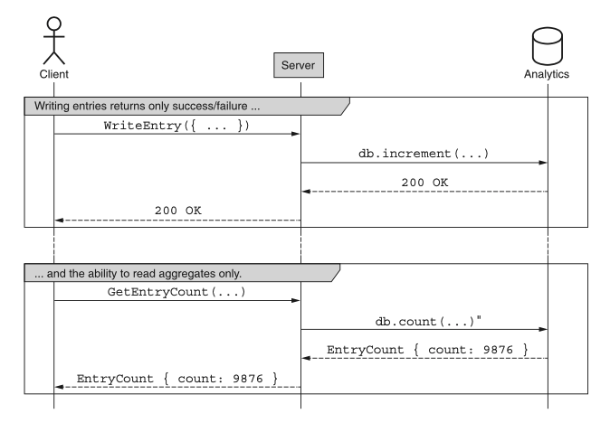
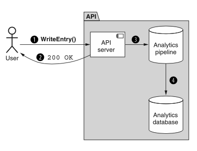

# 第 19 章 匿名写入

<div style="background:#f7f5e6; padding:24px; border-radius:4px; color:#405a73;">

**本章内容**
- 我们所说的匿名数据是什么意思
- 如何在不依赖创建资源的情况下将数据写入 API
- 如何解决写入数据的一致性问题
</div><br/>

到目前为止，向 API 写入任何新数据都涉及创建资源，包括其唯一标识符和 schemas。
遗憾的是，尽管我们可能希望这是创建数据的唯一方式，但有时它并不完全符合现实世界的情况。
确实，有些场景下数据需要被写入，但事后并不需要唯一标识，例如日志文件中的 entries 或将被聚合成统计数据的时序数据点。
<ins>在这种模式中，我们将探讨写入数据而非创建资源的理念，以及这个新概念如何仍然与我们现有的面向资源的设计原则相契合。</ins>

<a id="motivation"></a>
## 20.1 动机

到目前为止，在所有关于向 API 写入数据（无论是添加新数据还是更新现有数据）的讨论中，我们都是围绕资源来思考和工作的。
即使在那些我们可能对什么构成资源有所变通的情况下，例如 [第 12 章](ch12.md)，其基础始终是资源的概念。
这些资源一直作为单一的、可寻址的、唯一可识别的数据块，我们可以将其创建出来、对其进行操作、读取它，然后在用完后将其销毁，到目前为止它们一直很好地为我们服务。
然而，遗憾的是，它们并不一定足以涵盖现实世界中可能出现的所有方面和场景，因此在 API 设计领域需要考虑这些情况。

例如，考虑收集时序统计数据这样的场景。
存储这类统计数据的一个显而易见的方式是拥有一个 DataPoint 资源，并依赖标准 create 方法来记录传入的数据点。
但这有点像把每一粒米都单独包装并贴上标签，而不是直接买一袋 5 磅的米。
一般来说，对于这类系统，用户更关心的是聚合数据而非单个数据点。
换句话说，我们更可能是要求某个月数据点的平均值，而不是请求使用唯一标识符查看某个特定的单个数据点。
这种情况如此普遍，以至于许多分析数据处理系统、时序数据库或数据仓库（例如 Google 的 BigQuery `[ https://cloud.google.com/bigquery ]` 或 InfluxData 的 InfluxDB `[ https://www.influxdata.com/products/influxdb/ ]` ）甚至不支持为所存储的数据点提供唯一标识符！

这就引出了一个显而易见的问题：如果我们使用这些系统之一来存储分析数据，究竟应该如何将数据写入 API？
我们应该假装有一个唯一标识符（在数据库中存储一个特殊字段），然后像往常一样依赖标准 create 方法吗？
我们应该修改标准 create 方法，使其将数据插入数据库但不返回可寻址的资源作为结果，也许将 id 字段留空？
还是应该完全尝试其他方法？
<ins>这种模式探讨了一种替代方案，旨在标准化如何在我们通常面向资源的 API 中最好地处理这类非面向资源的数据。</ins>

<a id="overview"></a>
## 20.2 概述

这种模式通过引入一个名为 write 的特殊自定义方法来工作。与标准 create 方法类似，自定义 write 方法的任务是将新数据插入 API；
然而，它这样做的方式使得结果数据 entry 是匿名的（即数据没有唯一标识符）。
通常，这是因为结果数据不可寻址，并且事后无法被检索、更新或删除。

相反，这类数据不应通过检索单个记录来访问，而只应在聚合的基础上进行探索。
这意味着，与其允许用户像使用典型资源那样请求单个数据点，不如让他们基于这些数据点请求聚合值，例如 entries 总数或这些 entries 的平均值。
正如你可能猜到的，这种交互方式对于展示系统大量统计信息的仪表盘式 API 来说非常重要。

由于这些数据点与我们已习惯的资源具有如此不同的访问模式，几乎可以肯定，使用不同的术语来描述正在写入的数据是个好主意。
在这种情况下，我们不再称其为资源，而是使用术语 entry 来指代通过这个新的 write 方法插入 API 的数据点。

综合以上内容，写入 entries 并读取聚合数据（例如计数）的示例以序列图的形式展示在图 20.1 中。

*图 20.1 write 方法的事件序列* <br/>
<br/>

在下一节中，我们将探讨 write 方法更细微的细节以及我们如何着手实现它。

<a id="implementation"></a>
## 20.3 实现

虽然 write 方法在本质上与标准 create 方法非常相似，但确实有一些差异值得探讨。
<ins>首先，让我们看看该方法的返回类型。</ins>
标准 create 方法返回一个新创建的资源，而 write 方法并没有一个确切的资源可以返回。
事实上，write 方法涉及将数据添加到集合中（要么作为另一个匿名成员加入该组），要么以流式方式使用，以递增计数器或更新聚合值（例如移动平均值）。
这种行为正是该方法的特殊之处，但这也意味着除了成功结果或出错时的错误之外，我们没有什么有用的东西可以返回。
<ins>因此，write 方法应不返回任何内容，即 void。</ins>

<ins>下一个要回答的问题是如何传输数据载荷。</ins>
标准 create 方法依赖一个单一字段（resource）来接受要创建的资源值。
同样，与标准 create 方法不同，write 方法不处理资源，而是使用 entries 的概念。
幸运的是，这引出了一个显而易见且简单的结论：将 write 请求视为与 create 请求相同，但将字段从 resource 重命名为 entry。

*清单 20.1 write 请求示例*

```typescript
interface WriteChatRoomStatEntryRequest {
  parent: string;
  // 这里我们使用entry字段，而不是resource字段。
  entry: ChatRoomStatEntry;
}
```

最后，我们需要考虑 write 方法正确的 HTTP URL 绑定是什么。
例如，假设我们尝试写入关于某个 ChatRoom 资源的一些统计数据。
正如我们在 [第 9 章](ch9.md)，特别是 [第 9.3.2 节](ch9.md#resources-vs-collection
) 中学到的，通常最好以集合为目标，而不是以父资源为目标，这意味着 write 方法应避免使用类似 `/chatRooms/1:writeStatEntry` 的 URL，而应倾向于使用类似 `/chatRooms/1/statEntries:write` 的 URL。
虽然这可能是一个有争议的选择（因为 statEntries 并不是一个真正的资源集合），但事实是，我们将来能够通过其他几种方式与这个 entries 集合进行交互。
例如，我们可能能够使用批量 write 方法（ [第 18 章](ch18.md) ）一次添加多个 entries，或者使用 purge 方法（ [第 19 章](ch19.md) ）移除所有 entries。

现在我们已经很好地掌握了基础知识，接下来要讨论一个更复杂的话题：一致性。

### 20.3.1 一致性

一般来说，当我们向 API 插入数据时（例如通过标准 create 方法），我们希望能够立即看到该操作的结果。
换句话说，如果 API 表示我们创建某些数据的请求成功了，我们应该能够立即从 API 读回该数据。
事实上，这一点如此重要，以至于当我们遇到某个操作可能需要一段时间才能完成的情况时，我们会依赖长时间运行操作（ [第 10 章](ch10.md) ）之类的机制，来帮助提供更多关于数据何时会在系统中可用的信息。

由于 write 方法的行为有点像标准 create 方法，我们有一些重要的问题需要回答：它是否应该以同样的方式保持一致，即操作完成后数据立即可读？
如果不应该，我们是否应该依赖长时间运行操作来跟踪进度？
如果都不应该，我们该怎么做？

为了回答这些问题，我们首先必须提醒自己，write 方法的目标是允许不可寻址的数据被添加到系统中。
这意味着我们读取数据的方式与读取通过标准 create 方法添加的数据的方式非常不同。
事实上，由于我们几乎总是通过聚合来读取这类数据，因此很难 ——如果不是不可能的话—— 知道我们实际读取的是否是我们自己添加的数据，而不是其他人独立调用 write 方法添加的数据。
<ins>简而言之，这意味着让自己遵循所有数据在方法完成时都必须可读的标准，实际上并没有任何意义。
换句话说，write 方法立即返回（如图 20.2 所示）是完全可以的，即使数据对任何使用 API 的人还不可见。</ins>

*图 20.2 写入数据立即得到响应，而数据则进入分析管道。* <br/>
<br/>

这恰好与大多数涉及大规模分析系统的用例非常契合，因为这些系统往往依赖最终一致性以及数据处理管道中可能存在的长时间延迟。
如果我们必须等待所有计算完成才能返回结果，我们可能会遇到相当严重的请求延迟问题，使该方法变得远不那么有用。

不过，这引出了一个有趣的选择：如果我们想在数据可见之前就响应，但又无法轻松地同步做到这一点，那么使用 LRO（参见 [第 10 章](ch10.md) ）立即返回并允许用户等待结果变得可见，怎么样？
遗憾的是，这个想法有两个问题。
首先，通常不可能知道单个数据片段何时作为聚合统计信息的一部分被持久化。
这主要是因为单个 entry 不应包含任何唯一标识符，因此无法在分析管道中全程跟踪单个数据点。

其次，即使我们能够通过系统跟踪每个数据点，依赖 write 方法而非标准 create 方法的主要原因之一是，我们不想单独存储所有 entries。
相反，我们希望通过聚合数据来节省空间和计算时间。
如果我们随后决定每次调用 write 方法都应创建一个新的 Operation 资源，那么我们基本上是把问题从一个地方转移到了另一个地方，而没有真正节省任何空间或能源。

基于此，将 LRO 作为 write 方法的结果返回几乎肯定是一个坏主意。
如果重要的是要向用户传达他们的数据已被接受进入管道，但不应该期望它在相当长一段时间内可见，那么一个很好的替代方案是简单地返回 HTTP 202 Accepted 响应代码，而不是典型的 HTTP 200 OK 响应代码。
此外，如果担心提供给 write 方法的 entries 存在重复，请求去重模式（ [第 26 章](ch26.md) ）应该非常适合帮助避免这个问题。

至此，让我们看看如何应用这种模式并定义一个支持 write 方法的 API。

### 20.3.2 最终 API 定义

假设我们想开始收集一些关于聊天室的任意统计数据。
这可能包括用户打开特定聊天室的频率等内容，但我们希望为将来添加的数据点保留一些灵活性。
为此，我们可以设计一个 ChatRoomStatEntry 接口，它是一个简单的键值对，由字符串和标量值组成，之后我们可以对其进行聚合和分析。

此外，我们可能希望支持一次写入多个 ChatRoomStatEntry 资源。
为此，我们可以依赖批量 write 方法（关于批量方法的更多内容，请参见 [第 18 章](ch18.md) ）。

*清单 20.2 最终 API 定义*

```typescript
abstract class ChatRoomApi {
  // 正如我们在20.3.1节中学到的，这些面向集合的自定义方法，而不是父资源。
  @post("/{parent=chatRooms/*}/statEntries:write")
  // 这里不返回资源，而是无返回值。
  WriteChatRoomStatEntry(req: WriteChatRoomStatEntryRequest): void;

  // 正如我们在20.3.1节中学到的，这些面向集合的自定义方法，而不是父资源。
  @post("/{parent=chatRooms/*}/statEntries:batchWrite")
  // 同样，批量方法的返回结果也为空。
  // 这里不返回资源，而是无返回值。
  BatchWriteChatRoomStatEntry(req: BatchWriteChatRoomStatEntryRequest): void;
}

interface ChatRoomStatEntry {
  name: string;
  value: number | string | boolean | null;
}

interface WriteChatRoomStatEntryRequest {
  parent: string;
  entry: ChatRoomStatEntry;
}

interface BatchWriteChatRoomStatEntryRequest {
  parent: string;
  requests: WriteChatRoomStatEntryRequest[];
}
```

<a id="trade-offs"></a>
## 20.4 权衡

与我们迄今为止探讨的许多设计模式不同，这种模式的不同之处在于其用例非常独特。
事实上，这种用例几乎专门用于涉及分析数据的场景，而我们考虑过的几乎所有数据本质上都是事务性的。
因此，对于安全地将这类分析数据添加到 API 中，并没有太多替代方案。

正如我们所学到的，确实可以依赖标准 create 方法，将单个数据点视为完整的资源，每个资源都有自己的唯一标识符；
然而，这种设计不太可能与大多数分析存储和数据处理系统很好地配合。
此外，所存储的数据几乎肯定会迅速增长并变得难以管理。
因此，在 API 需要支持分析数据摄取以及更传统的面向资源设计的情况下，这很可能是最佳选择。

<a id="exercises"></a>
## 20.5 练习

1. 如果我们担心通过 write 方法摄取重复数据，避免这种情况的最佳策略是什么？

2. 为什么 write 方法不应返回响应体？
为什么 write 方法返回 LRO 资源是一个坏主意？

3. 如果我们想传达数据已被接收但尚未处理，有哪些可用选项？
对于大多数 API 来说，哪一个可能是最佳选择？

<a id="summary"></a>
## 本章小节

- 当数据需要被摄取到系统中时（例如分析数据 entries），我们应该依赖自定义 write 方法，而不是创建永远不会被单独寻址的资源。

- 通过 write 方法加载到 API 中的数据是单向的，之后无法从 API 中移除。

- write 方法（及其批量版本）除了结果状态码之外，不应返回任何响应。
它们根本不应返回资源 ——即使是 LRO 资源—— 除非在特殊情况下。

- write 方法处理的不是资源，而是 entries，它们与资源类似，但不可寻址，并且在许多情况下是短暂的。
