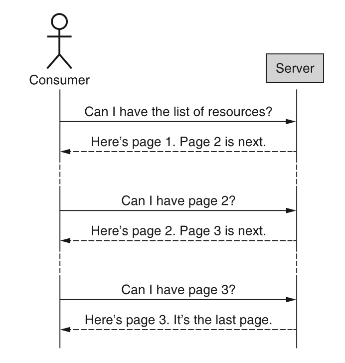
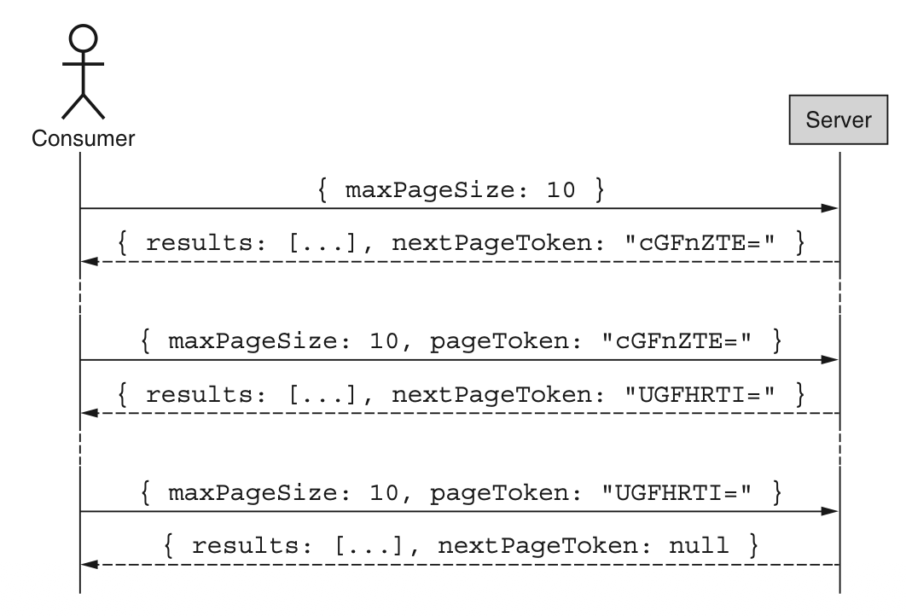
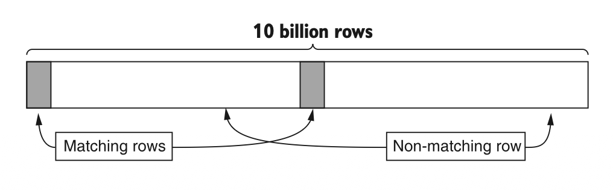
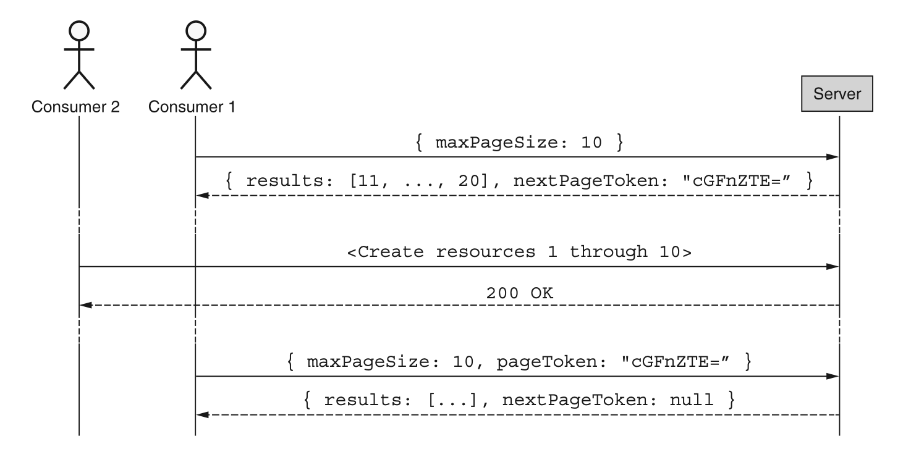
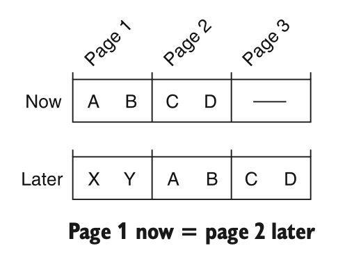
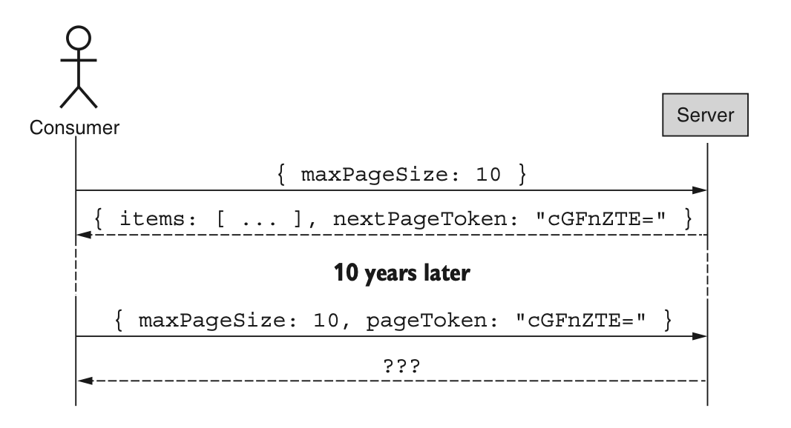
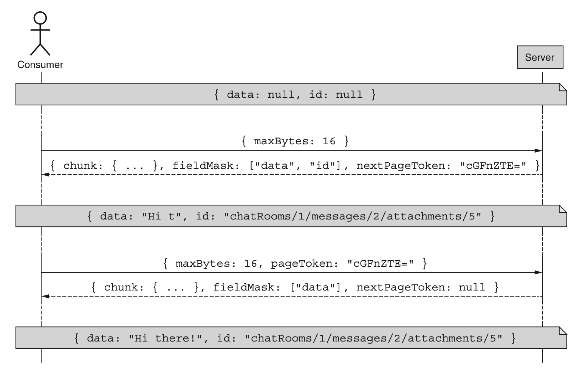
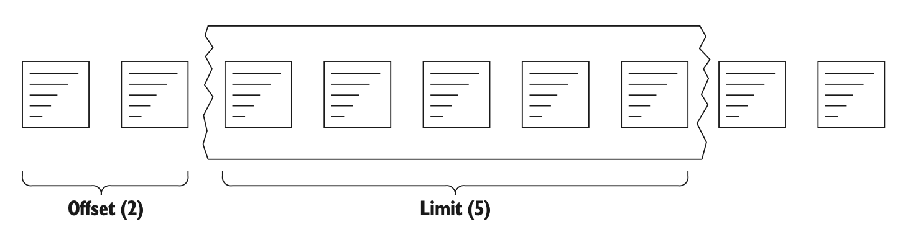

# 第 21 章 分页

<div style="background:#f7f5e6; padding:24px; border-radius:4px; color:#405a73;">

**本章内容**
- 分页如何让用户以小块数据的形式消费大型数据集
- 每页数据的具体大小
- API 服务应如何指示分页已完成
- 如何定义页令牌格式
- 如何在单个资源内对大型数据块进行分页
</div><br/>

在这种模式中，我们将探讨当资源数量或单个资源的大小对于单次 API 响应来说实在太大时，如何消费数据。
我们不是期望在单个响应接口中获取所有数据，而是进入一种来回往复的序列：每次请求一小块数据，不断迭代，直到没有更多数据可消费。
这种功能在许多 Web 界面中很常见，我们会前往结果的下一页，它对 API 同样重要。

<a id="motivation"></a>
## 21.1 动机

在典型的 API 中，消费者可能需要检索和浏览他们的资源。
随着这些资源在大小和数量上的增长，期望消费者在单个大块中读取数据变得越来越不合理。
例如，如果一个 API 通过 100 GB 的存储空间提供对 10 亿条数据条目的访问，期望消费者使用单个请求和响应来检索这些数据可能会极其缓慢，甚至技术上不可行。
我们怎样才能最好地暴露一个允许消费者与这些数据交互的接口？
换句话说，我们如何避免强迫消费者咬下超过他们能消化的量？
显而易见的答案是将数据分割成可管理的分区，并允许消费者与这些数据子集进行交互，
但这又引出了另一个问题：我们如何以及在哪里分割数据？

我们可能选择在任意两条记录之间划定分界线，但这并不总是足够的，特别是在单条记录本身可能增长到难以处理的大小的情况下（例如，一个 100 MB 的对象）。
在这种情况下，将数据分割成合理块的问题变得更加模糊，特别是如果该块是结构化数据（例如，数据库中的一行 10 MB 数据）。
我们应该在单条记录内的哪里分割数据？
我们应该为消费者提供多少对这些分割点的控制？

另一方面，有些场景下消费者实际上希望通过单个请求和响应交付数据库中的所有记录（例如，备份或导出所有数据）；
然而，这两种场景并不一定互斥，所以这并不改变我们仍然需要一种以合理大小的块与数据交互的方式这一事实。
对于这种常见场景，有一种模式在许多网站上已经变得非常普遍，并且很好地延续到了 API 中：分页。

<a id="overview"></a>
## 21.2 概述

分页一词来源于我们想要逐页浏览数据的想法，以块的形式消费数据记录，就像翻书一样。
这允许消费者一次请求一个块，API 响应相应的块，并附带一个指针，说明消费者如何检索下一个块。
图 21.1 是一个流程图，演示了消费者如何从 API 请求多页资源，直到没有更多资源为止。

为实现这一点，我们的分页模式将依赖游标的概念，使用不透明的页令牌 (page tokens) 来表达类似页码的松散等价物。
鉴于这种不透明性，API 同时响应结果块和下一个令牌将非常重要。
在处理大型单个资源时，同样的模式可以应用于每个资源，其中资源的内容可以通过多页数据构建起来。

*图 21.1 分页流程* <br/>
<br/>

<a id="implementation"></a>
## 21.3 实现

在高层次上，我们真正想要的是一种能够从上次中断的地方继续的方法，有效地查看可用数据的一个特定窗口。
为此，我们将依赖三个不同的字段来传达我们的意图：

1. pageToken，它表示一个不透明的标识符，仅对 API 服务器有意义，用于说明如何继续之前已开始的结果迭代
2. maxPageSize，它允许消费者表达希望给定响应中结果数量不超过某个特定数量的愿望
3. nextPageToken，API 服务器用它来传达消费者应如何通过附加请求来请求更多结果

为了更清楚地看到这一点，我们可以用这些字段替换图 21.2 中的一些文字。

*图 21.2 使用这些特定字段进行分页* <br/>
<br/>

如果我们将这种模式转换为 API 定义，最终会得到与标准 list 非常相似的东西，只是在请求中增加了 pageToken 和 maxPageSize，在响应中增加了 nextPageToken。

*清单 21.1 在标准 list 方法中进行分页的 API 规范*

```typescript
abstract class ChatRoomApi {
  @get("/chatRooms")
  ListChatRooms(req: ListChatRoomsRequest): ListChatRoomsResponse;
}

interface ListChatRoomsRequest {
  // 在标准列表方法的请求和响应中新增三个字段以支持分页
  pageToken: string;
  maxPageSize: number;
}

interface ListChatRoomsResponse {
  results: ChatRoom[];
  // 在标准列表方法的请求和响应中新增三个字段以支持分页
  nextPageToken: string;
}
```

这个定义本身并不那么有趣，但事实证明，这些字段中每一个都隐藏着一些有趣的秘密。
让我们首先探讨看起来无害的 maxPageSize 字段。

### 21.3.1 页大小

乍一看，设置所需页的大小（即应返回的结果数量）似乎相当无害，但事实证明，这里面的学问远不止于此。
让我们从字段本身的名称开始看：maxPageSize。

#### 最大值 vs. 精确值

首先，为什么我们使用最大值，而不是直接设置精确的大小？
换句话说，为什么我们返回最多 10 个结果，而不是恰好 10 个结果？
<ins>事实证明，在大多数情况下，API 服务器可能总是能够返回精确数量的结果；
然而，在许多更大规模的系统中，如果不付出显著的额外成本，这根本不可能实现。</ins>

例如，想象一个系统在表中存储了 100 亿行数据，由于大小限制，该表没有二级索引（二级索引会使查询这些数据更高效）。
再想象恰好有 11 个匹配行，其中 5 个在最开头，接着是 50 亿行，然后是剩余的 6 个，再后面是其余数据，如图 21.3 所示。
最后，假设我们的目标是在 200 毫秒内返回大多数响应（例如 99%）。

*图 21.3 匹配行可能分布得很广。* <br/>
<br/>

在这种场景下，当用户请求一页 10 个结果时，我们有两种选择。
一方面，我们可以返回恰好 10 个结果（因为有足够的结果填满这一页），但考虑到必须扫描约 50 亿行才能完全填满这一页，这个查询不太可能始终保持快速。
另一方面，我们也可以返回在搜索到特定截止时间（这里可能是 180 毫秒）后找到的那 5 个匹配行，然后在后续请求更多数据时从上次中断的地方继续。

<ins>鉴于这些限制，总是试图填满整页将使我们很难区分违反延迟目标和请求复杂度简单变化之间的差异。</ins>
换句话说，如果请求很慢（超过 200 毫秒），这可能是因为某些东西确实坏了，也可能是因为请求只是搜索了大量数据 —— 如果不做相当多的工作，我们将无法区分两者。
如果我们在时间限制内尽可能填满一页，我们或许常常能够返回恰好 10 个结果（也许是因为我们把它们放得很近），但在数据集变得极其庞大的情况下，我们不会把自己逼入死角。
因此，我们的接口契约最合理的做法是规定我们将返回最多 maxPageSize 个结果，而不是恰好那个数量。

#### 默认值

为任何可选字段确定合理的默认值很重要，这样消费者在将可选字段留空时就不会感到意外。
在这种情况下，为最大页大小选择默认值将取决于所返回资源的形状和大小。
<ins>例如，如果每个项都很小（例如，以字节而非千字节衡量），那么每页默认 100 个结果可能是有意义的。
如果每个项有几 KB，那么默认 10 或 25 个结果可能更有意义。
一般来说，推荐的默认页大小是 10 个结果。</ins>
最后，也可以要求消费者指定最大页大小；然而，这应保留给 API 服务器确实无法假定合理默认值的情况。

<ins>虽然选择默认最大页大小很重要，但更重要的是记录这个默认值，并在 API 的其余部分尽可能保持一致。</ins>
例如，如果没有充分理由，为这个字段使用各种不同的默认值通常是个坏主意。
如果消费者了解到你的 API 倾向于每页默认 10 个结果，而该 API 中其他地方却毫无充分理由地默认 50 个结果，那会非常令人沮丧。

#### 上限和下限

显然，负的页大小对 API 服务器来说毫无意义，因此应被拒绝，并指出请求无效。
但是，如果请求指定最大页大小为 30 亿，我们该怎么办？
幸运的是，我们之前依赖最大页大小而非精确页大小的设计意味着我们可以欣然接受这些值，返回我们的 API 服务器能够在某个设定时间内产生的合理数量的结果，并保持与 API 定义一致。

换句话说，虽然拒绝超过某个限制的页大小（例如，一页超过 1,000 个结果）当然是可以接受的，但将它们视为有效也完全没问题，因为我们总是可以返回比指定数量更少的结果，同时遵守与消费者的约定。
现在我们已经讨论了简单的部分，接下来让我们进入更复杂的部分之一：页令牌 (page tokens)。

### 21.3.2 页令牌

到目前为止，我们已经注意到页令牌应被用作游标，但我们还没有阐明这个令牌的行为。
让我们从页令牌工作方式中最简单但也常常令人困惑的一点开始：我们如何知道已经完成了。

#### 终止条件

由于无法强制消费者继续发起后续请求，分页在技术上可以由消费者在任何时候终止，只要消费者决定不再对更多结果感兴趣。
但服务器如何指示没有更多结果了呢？
在许多系统中，我们倾向于假设一旦得到一页未满的结果，我们就到了列表的末尾。
遗憾的是，这个假设并不适用于我们的页大小定义，因为页大小是最大值而非精确值。
因此，我们不能再依赖部分填满的结果页来指示分页已完成。
相反，我们将依赖空的页令牌来传达这一信息。

这对消费者来说可能会造成困惑，特别是当我们考虑到返回空结果列表同时附带非空页令牌是完全有效的时候！
毕竟，得到没有结果返回却被告知还有更多结果，似乎令人惊讶。
正如我们之前在决定跟踪最大页大小时所学到的，这种类型的响应发生在请求达到时间限制而没有找到任何结果，并且无法确定不会找到更多结果的时候。
换句话说，响应 `{results: [], nextPageToken: 'cGFnZTE='}` 是 API 在说：“我尽职尽责地搜索了长达 200 毫秒，但什么也没找到。你可以使用这个令牌从我中断的地方继续。”

#### 不透明性

到目前为止，我们已经讨论了如何使用页令牌来传达消费者是否应继续翻页浏览资源，但我们还没有谈论它的内容。
我们究竟在这个令牌中放什么？

简单地说，令牌本身的内容应该是 API 服务器在遍历结果列表时从中断处继续所需的任何东西。
这可能是抽象的东西，比如你代码中的序列化对象，或者更具体的东西，比如传递给关系数据库的 limit 和 offset。
例如，你可以简单地使用一个序列化的 JSON 对象，如 `eyJvZmZzZXQiOiAxMH0=`，它是 `{"offset": 10}` 的 Base64 编码。
但更重要的是，这个实现细节必须对消费者完全隐藏。
这似乎没有必要，但实际上这是一个非常重要的细节。

无论你在页令牌中放入什么，令牌的结构、格式或含义都应完全对消费者隐藏。
这意味着，我们不应该只对内容进行 Base64 编码，而应该实际加密内容，使令牌本身的内容对消费者完全无意义。
<ins>原因很简单：如果消费者能够辨别这个令牌的结构或含义，那么它就成了 API 表面的一部分，必须被视为 API 本身的一部分。
而由于使用页令牌的整个目的就是让我们能够在不改变面向消费者的 API 表面的情况下更改底层实现，暴露这些内容会妨碍我们利用这种灵活性。
本质上，如果我们允许消费者窥视这些页令牌的内部，我们就是在泄露实现细节，最终可能陷入一种无法在不破坏消费者的情况下更改实现的境地。</ins>

#### 格式

既然我们已经了解了令牌中可以放入什么内容，那么让令牌对消费者保持不透明这一理念就引出了一个问题：
为什么我们使用字符串类型来表示令牌？
为什么不使用数字或原始字节？

鉴于我们需要存储加密数据，使用像整数这样的数值显然行不通。
另一方面，原始字节通常是存储加密值的绝佳方式，但我们使用字符串主要是出于方便。
事实证明，这些令牌最终往往会出现在 URL 中（作为 GET HTTP 请求的参数）以及 JSON 对象中，而这两者都不能很好地处理原始字节。
因此，最常见的格式是使用经过 Base64 编码的加密值，以 UTF-8 序列化字符串的形式传递。

#### 一致性

到目前为止，我们关于数据分页的讨论都假设数据本身是静态的。
遗憾的是，情况很少如此。我们不应假设所涉及的数据是只读的，而是需要一种在数据不断变化（添加新结果、移除现有结果）的情况下进行分页的方法。
更复杂的是，不同的存储系统提供不同的查询功能，这意味着我们 API 的行为可能与用于存储数据的系统（例如 MySQL）紧密耦合。

正如你所预料的，这往往会导致令人沮丧的场景。
例如，想象一下每次两个结果地分页浏览数据，而在此期间，其他人恰好在列表开头添加了两个新资源（图 21.4）。
如果你使用的是偏移计数（你的下一个页令牌表示从第 3 项开始的偏移量），那么添加在列表开头的两个新创建的资源将导致你两次看到第 1 页。
这是因为现在的新第 2 页所具有的偏移量是从旧第 1 页的开头算起的。
此外，当对请求应用过滤器，并且结果被修改以使其加入或离开匹配组时，这种场景也会再次出现。
在这种情况下，消费者可能会对你的 API 能否交付所有匹配结果以及仅交付匹配结果失去信心。
我们该怎么办？

*图 21.4 如果在分页过程中添加了新数据，消费者可能会看到重复的结果。* <br/>
<br/>

遗憾的是，这个问题没有简单的答案。
如果你的数据库支持数据的时间点快照（例如 Google Cloud Spanner 或 CockroachDB），
那么在页令牌中编码这些信息可能是有意义的，这样你就可以保证强一致性的分页。
在许多情况下，数据库不允许强一致性结果，在这种情况下，唯一其他合理的选择是在 API 文档中注明，随着底层资源的添加、移除或修改，页面可能代表数据的 “涂抹 (smear)”（图 21.5）。
<ins>如前所述，避免依赖数字偏移量，而是使用最后看到的结果作为游标，这样你的下一个页令牌才能真正从上次中断的地方继续，这也是一个好主意。</ins>

*图 21.5 随着底层数据的变化，页码可能会随时间改变。* <br/>
<br/>

#### 生命周期

当我们考虑消费一个大型结果列表时，我们倾向于假设请求发生在某个相对较短的时间窗口内，通常以秒或分钟计。
但如果请求发生得慢得多呢（如图 21.6 所示）？
显然，请求一页数据然后在 10 年后请求下一页可能有点荒谬，但 24 小时后呢？
60 分钟后呢？
遗憾的是，我们很少记录页令牌的生命周期，这可能导致一些棘手的情况。

一般来说，API 选择不定义页令牌可能过期的限制。
由于分页浏览数据应该是幂等操作，遇到过期令牌的失败模式只需要重试即可。
这意味着这里的失败仅仅是一种不便。

*图 21.6 使用 10 年前的页令牌可能并不合理。* <br/>
<br/>

话虽如此，我们应该明确令牌应保持有效多长时间，以设定消费者对其分页操作的期望。
在一个经典的降低期望的案例中，通常最好根据你的用例将令牌过期时间设置得相对较短。
<ins>对于典型的 API，这可能是以分钟计（或最多以小时计），60 分钟的过期时间被大多数消费者认为很慷慨。</ins>

### 21.3.3 总数

最后，在分页浏览结果时，一个常见的问题是是否包含结果的总数，通常在显示类似 “第 10–20 条结果，共 184 条” 这样的用户界面元素时使用。
当这个总数相对较小时（例如所示的 184），这是一个容易显示的统计数据。
然而，当这个数字变得大得多时（例如 4,932,493,534），仅仅统计这些结果这一简单行为就可能变得计算量极大，以至于无法快速返回准确的计数。

到了那时，我们只能在以下两者之间选择：非常缓慢地提供准确计数，或者相对快速地提供一个作为最佳猜测的不准确计数。
这些选项都不是特别好，因此 API 通常不应提供总结果数，除非消费者有明确的需求（即没有这个计数他们就无法完成工作），或者这个计数永远不会大到落入这种境地。
如果由于某种原因你绝对必须包含总数，那么它应该是一个名为 totalResults 的整数字段，附加在响应中。

清单 21.2 包含结果总数的响应接口

```typescript
interface ListChatRoomsResponse {
  results: ChatRoom[];
  nextPageToken: string;
  // 使用 totalResults 字段来表示如果完成分页查询，总共会包含多少条结果
  totalResults: number;
}
```

现在我们已经完全了解了页令牌，接下来让我们看一个相对独特的场景：单个资源可能大到足以证明在单个资源内进行分页是合理的，而不是跨资源集合进行分页。

### 21.3.4 在资源内部分页

在某些场景中，单个资源可能变得相当大，甚至大到消费者希望能够对资源的内容进行分页浏览，通过多次请求逐步构建出完整资源。
在这些场景中，我们可以将同样的原则应用于单个资源，而不是资源集合，方法是将资源分解为任意大小的块，并使用延续令牌作为遍历这些块的游标。

*清单 21.3 对单个大型资源进行分页的 API 定义*

```typescript
abstract class ChatRoomApi {
  @get("/{id=chatRooms/*/messages/*/attachments/*}:read")
  ReadAttachment(req: ReadAttachmentRequest): ReadAttachmentResponse;
  // 自定义读取方法允许我们以较小的数据块读取单个资源
}

interface ReadAttachmentRequest {
  id: string;
  // 来自上一次响应的续传令牌。如果为空，表示请求资源的第一个数据块
  pageToken: string;
  // 单个数据块可返回的最大字节数。如果为空，则使用默认值（例如1024字节）
  maxBytes: number;
}

interface ReadAttachmentResponse {
  // 属于该资源的单个数据块
  chunk: Attachment;
  // 当前数据块中携带、需要追加到资源上的字段列表
  fieldMask: FieldMask;
  // 请求下一个资源数据块时使用的令牌。如果为空，则代表这是最后一个数据块
  nextPageToken: string;
}
```

在这种设计中，我们假设对单个资源的读取可以是强一致的，这意味着如果在我们分页浏览其数据时资源被修改，请求应被中止。
它还依赖于通过多次请求逐步构建资源的理念，其中每个响应包含要追加到目前已构建数据中的部分数据，如图 21.7 所示。
我们还依赖字段掩码来明确传达 ChatRoom 接口中哪些字段在给定块中有数据可供消费。

*图 21.7 对单个大型资源进行分页的示例流程* <br/>
<br/>

### 21.3.5 最终 API 定义

现在我们已经探讨了这种模式的所有细微之处，最终得到的 API 定义如清单 21.4 所示，涵盖了跨资源集合的分页以及单个资源内部的分页。

*清单 21.4 最终 API 定义*

```typescript
abstract class ChatRoomApi {
  @get("/chatRooms")
  ListChatRooms(req: ListChatRoomsRequest): ListChatRoomsResponse;

  @get("/{id=chatRooms/*/messages/*/attachments/*}:read")
  ReadAttachment(req: ReadAttachmentRequest): ReadAttachmentResponse;
}

interface ListChatRoomsRequest {
  pageToken: string;
  maxPageSize: number;
}

interface ListChatRoomsResponse {
  results: ChatRoom[];
  nextPageToken: string;
}

interface ReadAttachmentRequest {
  id: string;
  pageToken: string;
  maxBytes: number;
}

interface ReadAttachmentResponse {
  chunk: Attachment;
  fieldMask: FieldMask;
  nextPageToken: string;
}
```

<a id="trade-offs"></a>
## 21.4 权衡

现在我们已经看到了这种模式产生的 API，让我们看看我们失去了什么，首先从分页方向开始。

### 21.4.1 双向分页

这种模式显然无法做到的一件事是双向操作的能力。
换句话说，这种模式不允许你从当前位置向前翻页，查看之前已经看过的结果。
虽然这对于允许浏览结果的面向用户界面来说可能不方便，但对于程序化交互来说，它不太可能是一个真正必要的功能。

如果用户界面确实需要这种能力，一个不错的选择是使用 API 构建结果缓存，然后允许界面在该缓存中任意移动。
这还有一个额外的好处，就是避免分页一致性的问题。

### 21.4.2 任意窗口

同样，这种模式不提供在资源列表中导航到特定位置的能力。
换句话说，无法专门请求第 5 页，原因很简单：页码的概念根本不存在。
消费者不应依赖页码，而应使用过滤器和排序来导航到特定的匹配资源集。
同样，这往往是面向用户界面浏览所需的功能，而不是程序化交互的要求。

<a id="anti-patterns"></a>
## 21.5 反模式：偏移量与限制

为了完整起见，让我们简要地看一种简单（且相当常见）的、体现了这种模式精神的实现方式，但通常应避免使用。
鉴于大多数关系数据库支持 OFFSET 和 LIMIT 关键字，人们常常忍不住将其沿用到 API 中，作为在资源列表上暴露一个窗口的方式。
换句话说，不是请求某个块，而是通过请求从某个偏移量开始的数据并将结果大小限制在某个数量来选择特定的块，如图 21.8 所示。

*图 21.8 使用偏移量和限制定义窗口* <br/>
<br/>

当转换为 API 表面时，这会导致在请求中增加两个字段，都是整数，分别指定起始偏移量和限制。
下一个偏移量可以通过将结果数量加到之前请求的偏移量上来轻松计算（例如 `nextOffset = offset + results.length` ）。
此外，我们可以使用不完整的页面作为终止条件（例如 `hasMoreResults = (results.length != limit)` ）。

*清单 21.5 使用偏移量和限制的 API 表面*

```typescript
abstract class ChatRoomApi {
  @get("/chatRooms")
  ListChatRooms(req: ListChatRoomsRequest): ListChatRoomsResponse;
}

interface ListChatRoomsRequest {
  // 为支持资源分页查询，我们提供 offset 和 limit 参数
  offset: number;
  limit: number;
}

interface ListChatRoomsResponse {
  results: ChatRoom[];
}
```

当我们将其转换为底层数据库时，基本上没有什么工作要做：我们只需将提供的偏移量和限制参数
（例如 GET 请求到 https://example.org/chatRooms/5/messages?offset=30&limit=10 ）连同查询一起传递。

*清单 21.6 使用 SQL LIMIT 和 OFFSET 进行分页*

```sql
SELECT * FROM messages
WHERE chatRoomId = 5
OFFSET 30 -- OFFSET 修饰符用于指定页码（本例中偏移量30，每页10条，对应第4页）
LIMIT 10 -- LIMIT 修饰符用于指定页大小（本例为每页10条结果）
```

这种模式的根本问题在于它向 API 泄露了实现细节，因此无论底层存储系统是什么，这个 API 都必须继续支持偏移量和限制。
现在这似乎不是什么大问题，但随着存储系统变得更加复杂，使用限制和偏移量的实现可能并不总是可行。
例如，如果你的数据存储在最终一致性的分布式系统中，随着偏移量值的增加，找到偏移量的起始点实际上可能变得越来越昂贵。

这种模式还面临与一致性相关的问题。
在这个例子中，如果添加了一些新结果，它们可能导致响应返回在之前页面中已经看到过的结果。

<a id="exercises"></a>
## 21.6 练习

1. 为什么使用最大页大小而不是精确页大小很重要？

2. 如果请求中的页大小字段留空会发生什么？
如果是负数呢？如果是零呢？如果是一个巨大的数字呢？

3. 用户如何知道分页已经完成？

4. 某些资源类型的页令牌与其他资源类型的页令牌具有不同的过期时间，这是否合理？

5. 为什么页令牌对用户完全不透明很重要？有什么好的机制来强制实现这一点？

<a id="summary"></a>
## 本章小节

- 分页允许大型结果集合（或大型单个资源）通过三个特殊字段 ——maxPageSize、pageToken 和 nextPageToken—— 以一系列小块的形式被消费，而不是作为单个大型 API 响应。

- 如果还有更多页，响应将包含一个 nextPageToken 值，该值可以在后续请求的 pageToken 字段中提供，以获取下一页。

- 我们依赖最大页大小而非精确页大小，因为我们不知道完全填满一页需要多长时间，并且必须保留即使在结果页完全填充之前也能返回的能力。

- 当响应的下一页令牌没有值时，分页就完成了（而不是当 results 字段为空时）。
