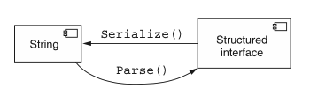
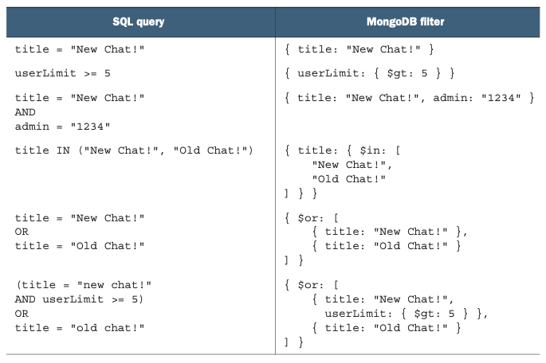

# 第 22 章 过滤

<div style="background:#f7f5e6; padding:24px; border-radius:4px; color:#405a73;">

**本章内容**
- 为什么标准 list 方法应支持过滤资源
- 如何将过滤器表达式作为标准 list 请求的一部分进行传达
- 过滤资源时的行为准则
- 过滤条件中应支持和不应支持的功能
</div><br/>

虽然标准 list 方法提供了一种遍历 API 中完整资源集的机制，但到目前为止，我们实际上还没有一种方式来表达只对其中一部分资源感兴趣。
这种模式将探讨使用标准 list 请求上的一个特殊字段，来过滤完整数据集，只返回匹配的结果集。
此外，我们还将深入了解如何构造这个特殊过滤字段的输入值。

<a id="motivation"></a>
## 22.1 动机

到目前为止，检索大量资源的典型方式一直相当直接：使用标准 list 方法。
同样，如果我们正在寻找特定资源并且恰好知道它的标识符，我们也有一个同样直接的工具可供使用：标准 get 方法。
但如果我们的目标介于两者之间呢？
如果我们想浏览恰好匹配某一组条件的资源呢？

我们既不是在寻找单个资源，也不是打算浏览所有资源，但我们确实对正在搜索的资源有一些想法。
我们该如何处理这种情况？

遗憾的是，到目前为止还没有一种好的方式来表达这种中间地带。
相反，我们在技术上能做的最好的事情就是基于标准 list 方法，并在资源返回时对资源列表应用一组过滤条件。

*清单 22.1 在客户端过滤资源的示例*

```typescript
async function ListMatchingChatRooms(title?: string):
  Promise<ChatRoom[]> {
  let results: ChatRoom[] = [];
  let response: ListChatRoomsResponse;
  // 只要还有下一页资源可以查看，就继续循环（首次迭代也会执行）
  while (response === undefined ||
      response.nextPageToken) {
    // 从API获取这一页的资源
    response = await ListChatRooms({
      pageToken: response.nextPageToken
    });
    // 遍历每一条资源，校验标题字段是否匹配
    for (let chatRoom of response.resources) {
      if (title === undefined ||
        chatRoom.title === title) {
        results.push(chatRoom);
      }
    }
  }
  return results;
}
```

如你所料，这种设计远非理想。
最明显的问题是，为了确定我们已经找到了所有匹配结果，客户端必须获取、遍历并针对 API 中存储的整个资源集评估过滤条件。
在存在无匹配的边缘情况下，这尤其令人沮丧，因为我们必须过滤所有资源，结果却发现没有一个满足过滤条件。
但仅从数据传输和消费的角度来看，这显然过于浪费。

我们该如何解决这个问题？

<a id="overview"></a>
## 22.2 概述

幸运的是，这个难题的解决方案相当明显。与其检索所有可用资源并过滤掉我们不感兴趣的那些，
不如反过来，把这一责任推给 API 服务器本身。
换句话说，我们所要做的就是向 API 服务器声明要匹配的条件，然后结果集将只包含匹配的资源。

*清单 22.2 标准 list 请求上的附加 filter 字段*

```typescript
interface ListChatRoomsRequest {
  // 这里暂时标记为any类型，因为我们尚未确定该字段的实现方式
  filter: any;
  // 这些字段和分页模式相关（第21章）
  maxPageSize: number;
  pageToken: string;
}
```

虽然这个设计概念可能显而易见，但实现本身要复杂一些。
在列出资源时，我们应该向服务器传达某种过滤条件，这说起来容易，但过滤数据实际上应该是什么样子呢？
它应该是一个类似于 SQL 查询的简单字符串吗？
还是一个更复杂的结构，用于匹配字段，比如 MongoDB 查询过滤文档？

一旦我们为传达查询选择了可接受的格式，我们就必须考虑应该支持什么功能。
例如，我们应该只允许匹配资源字段（例如，匹配 ChatRoom 资源的精确标题）吗？
还是应该进一步扩展支持通配符（例如，匹配标题中任意位置的关键字）？
甚至任意文本搜索，比如搜索查询（例如，出现在任何字段中的关键字）？

那查询并非专门存储在资源上的东西呢？
例如，我们是否应该允许基于字段的元数据进行查询，比如 ChatRoom 的成员数量？
这是否为查询扩展到相关资源打开了大门？
例如，过滤器是否应该提供一种方式，将 ChatRoom 结果限制为仅那些拥有名为 Joe 的成员的聊天室？
或者仅那些拥有名为 Joe 的成员，而该成员又是另一个拥有名为 Luca 的成员的 ChatRoom 的成员？
如果是这样，这种能力延伸得有多远？

正如这些例子所希望表明的那样，这可能会迅速变成一个非常深的洞穴，充满许多不同的曲折，
并非所有曲折都值得在过滤规范中支持。
这种模式的目标将是解决这些关键问题，特别是如何指定过滤器以及究竟什么功能值得支持。

<a id="implementation"></a>
## 22.3 实现

我们需要做的第一件事是决定如何最好地向 API 服务器传达代表用户意图的过滤器以执行。
换句话说，我们有很多不同的方式来表示相同的过滤意图，
但重要的是我们要确定一种单一的方式，并在支持过滤的标准 list 方法中一致地使用它。
哪种格式最好？

<a id="structure"></a>
### 22.3.1 结构

正如我们在 API 的序列化格式方面有很多不同的选择一样（例如 JSON `[https://www.json.org/json-en.html]` 与 protocol buffers `[https://developers.google.com/protocol-buffers]` 与 YAML `[https://yaml.org/]`），我们在列出资源时表示过滤器的方式同样有很多不同的选择。
一般来说，这些选择分为两个不同的类别：结构化和非结构化。

在非结构化这一端，我们有像 SQL 查询这样的东西，其中过滤器表示为一个字符串值，它恰好符合一种非常特定的语法。
然后这个字符串值由 API 服务器解析和评估，以确保只向用户返回匹配的资源。

*清单 22.3 用于过滤 ChatRoom 资源的 SQL 查询示例*

```sql
SELECT * FROM ChatRooms WHERE title = "New Chat!";
```

在结构化这一端，我们将部分责任从 API 服务器转移回客户端，实际上要求客户端预先将查询解析为一种特殊的 schema，
然后直接将这个复杂的接口发送给 API 服务器进行评估（对内容的解析需求很少或没有）。
虽然不如无处不在的 SQL 风格字符串值那么常见，但仍有许多系统，例如 MongoDB，依赖这些结构化接口进行过滤。

*清单 22.4 用于过滤 ChatRoom 资源的 MongoDB 结构化查询示例*

```typescript
db.chatRooms.find( { title: "New Chat!" } );
```

<ins>但这引出了一个根本性的问题：这两者中哪一个是正确的？
在我们深入讨论这两个选项的优缺点之前，重要的是要记住，这个决定在许多方面都是表面的。
换句话说，每个选项的最终结果可能看起来不同，但每个都应该能够完成相同的事情。</ins>
事实上，从一种格式转换到另一种格式应该是简单直接的，有点像从 JSON 序列化的资源翻译到 YAML 格式的资源一样容易。
然而，在这种情况下，转换依赖于序列化（从结构化表示转换为字符串时）和解析（反向转换时），有点像 Node.js 中的 `JSON.stringify()` 和 `JSON.parse()`，如图 22.1 所示。

*图 22.1 字符串查询与结构化查询之间的关系* <br/>
<br/>

由于这两个选项在功能上是等价的，在两者之间做出选择实际上就变成了一个关于可用性和未来灵活性的问题。
换句话说，既然两个选项都可以满足相同的功能需求，我们就必须问：哪个对客户端来说更容易使用，哪个能更好地经受时间的考验？

作为 API 设计者，我们在这种情况下的第一直觉几乎总是尝试一种可重用、灵活且简单的设计来表示过滤器。
虽然这是一个崇高的目标，但遗憾的是，即使是最好的设计，也会因为输入必须遵循结构化模式这一事实而遭受一些关键的缺点。

主要需要考虑的问题是，最终，这些过滤器与我们在任何编程语言中可能编写的任何其他代码没有什么不同。
过滤器本身当然比某些任意代码更受限制、更沙箱化，
但如果我们仔细观察我们在这里所做的事情，从根本上说，我们实际上只是在用用户提供的代码填充一个特定的函数定义。
这段代码随后可能会在资源数组上的 filter() 函数中使用，以确定哪些应包含、哪些应排除。

*清单 22.5 过滤表达式代码应如何被评估的示例*

```typescript
function resourceMatchesFilter(resource: Object): boolean {
  if (/* 用户提供的代码在这里！ */) {
    return true;
  } else {
    return false;
  }
}
```

<ins>为了理解为什么尝试为过滤定义一个结构化表示不太合理，让我们想象一下，我们不是接受一个可能充当清单 22.5 中 if 语句条件的小型过滤表达式，而是实际接受一个要评估的任意函数。</ins>
在这种情况下，我们正在评估用户提供的代码，为这种任意输入定义一个 schema 真的看起来是个好主意吗？
还是接受一些字节作为输入，并像大多数编译器那样做 ——对内容应用语法规则以验证它确实是有效的代码—— 更有意义？
我们仍然使用基于文本的文件来定义函数，而不是用某种结构化模式来表示我们的程序应该做什么，这是有原因的 —— 过滤器也不例外。
但故事并没有到此结束。
<ins>字符串过滤器还因其他几个原因而成为更好的选择。</ins>

<ins>首先，当使用字符串值时，语法规则完全由 API 服务器来强制执行和验证。</ins>
这意味着任何更改或改进（例如，新功能）都由 API 服务器本身管理，因此不需要客户端做出更改。
正如我们将在 [第 24 章](ch24.md) 中学到的，能够在不需要客户端做出任何更改或工作的情况下进行改进，可能是一个非常强大的工具。

<ins>其次，字符串查询通常为那些将使用 API 的人所熟知和理解，特别是如果他们曾经使用过某种 SQL 方言的关系数据库。</ins>
这意味着字符串查询对用户来说可能更容易立即理解，因为它依赖于他们已经熟悉的概念。

<ins>最后，这可能令人惊讶，但即使是最好的设计结构，随着过滤条件变得更加复杂，也往往会变得有点难以理解。</ins>
为了看到这在现实世界示例中如何体现，表 22.1 展示了各种不同的过滤条件如何表示为 SQL 中的字符串，与 MongoDB 中的结构化过滤对象相比。

*表 22.1 SQL 字符串查询与 MongoDB 过滤器结构的对比* <br/>
<br/>

如你所见，虽然两个选项都能够表达相同的布尔条件，但对于我们许多人来说，SQL 风格的字符串往往更容易理解和在脑海中处理。
这可能是因为这些字符串实际上看起来很像我们可能在典型编程语言中编写的布尔表达式。
换句话说，我们越来越依赖用户已经熟悉的东西，而不是期望并要求他们专门为我们的 API 学习新东西。

因此，虽然用于表示过滤条件的结构化接口当然可行，但它更可能导致 API 定义更加脆弱，随着时间的推移而受损。
此外，自定义结构化接口几乎总是伴随着更陡峭的学习曲线，而且与序列化字符串表示相比并没有太多好处。
<ins>因此，尽管尝试设计一个出色的结构来表示这些过滤器可能很诱人，但依赖一个能够随着服务本身演进和变化而增长的字符串字段几乎总是更安全。</ins>

现在我们已经论证了为什么非结构化值（例如字符串）是表示过滤器的更好选择，接下来让我们深入探讨我们应该为该字符串使用什么底层语法。

### 22.3.2 过滤器语法和行为

仅仅因为我们把字符串称为非结构化选项，并不意味着这些字符串值完全没有规则。
相反，字符串的非结构化性质指的是数据类型和模式，而不是值本身的格式，值本身必须符合一组特定的规则才能有效。
但这些规则是什么？
过滤器字符串的正确语法是什么？

虽然设计和规定一套完整的资源过滤语言可能很有趣，但这可能有点超出了本书的范围。
事实上，市面上有不少语言规范可以实现这一目标，例如 Common Expression Language（CEL；https://github.com/google/cel-spec/blob/master/doc/langdef.md ）、JSONQuery（ https://www.sitepen.com/blog/jsonquery-data-querying-beyond-jsonpath ）、RQL（ https://github.com/persvr/rql ）或 Google 的 Filtering 规范（ https://google.aip.dev/160 ）。
在某些（但并非所有）情况下，甚至可能有必要尝试依赖底层存储系统的查询能力，例如强制要求查询语法遵循相当于 SQL WHERE 子句的特定子集，并对允许的功能施加相当多的限制。

与其可能从头重新发明轮子，甚至规定某种 “正确” 的语法，不如让我们审视一些最有可能带来最佳结果的特征和限制，无论具体的实现和语法如何。

#### 执行时间

尽管过滤表达式应该只由简单的比较组成（例如 `title = "New Chat!"`），但事实证明，这些简单的比较实际上可能变得相当复杂。
如果你拿起一本关于各种数据库的 SQL 语法和功能的书，你会惊讶地发现这类简单语句可以变得多么复杂。
例如，如果我们将比较的右侧从字面值（例如特定字符串 `"New Chat!"`）改为另一个变量（例如 `title = description`），会怎样？
或者如果我们更进一步，涉及另一个资源（例如 `administrator.employer.name = "Apple"` 之类的东西），又会怎样？
我们在简单过滤条件和过于复杂而不适合我们的过滤语言的东西之间，应该在哪里划线？

在决定支持什么功能时，我们考虑的第一件事远比令人兴奋更实际：执行评估函数的运行时间。
这意味着我们必须回想本科计算机科学时代，被测验大 O 表示法并确定运行函数的最坏情况。
在这种情况下，我们关心的是是否存在给定的过滤器字符串可能导致评估函数异常缓慢或计算量极大。
举一个荒谬的例子，想象我们提供了一种方式，可以针对从月球上的服务器获取的数据进行过滤，或者需要全扫描一个非常大的数据库中的所有行。
显然，这会导致极其缓慢的过滤，从而导致整体体验很差。
幸运的是，有一个简单的策略可以确保评估函数的运行时间保持合理：限制可用的输入数据。

<ins>一个应遵循的通用准则是，过滤器应该只需要单个资源的上下文就能成功评估过滤条件。</ins>
这意味着，如果我们考虑过滤评估函数，它只接受两个输入参数：过滤器字符串本身，以及可能匹配或不匹配过滤条件的资源。
这意味着没有办法包含任何不属于该资源的额外数据（例如，从月球获取的数据）。

*清单 22.6 仅包含过滤器和潜在匹配项的评估函数*

```typescript
function evaluate(filter: string, resource: ChatRoom): boolean {
  // ...
}
```

相反，如果我们允许不止一个资源用于评估（如清单 22.7 所示），我们就会有相当多额外的问题需要回答。
例如，我们应该允许无限数量的额外资源用于比较，还是将数量限制为其他值（例如五个）？
我们如何将这些信息加载到上下文中？
我们应该允许不同类型的资源，还是将其限制为与被评估资源相同的类型？
我们还有更复杂的性能影响，例如是否预取或缓存可能用于评估的资源信息，以及有关资源新鲜度和数据一致性的新问题。

*清单 22.7 支持额外上下文的评估函数*

```typescript
function evaluate(filter: string, resource: ChatRoom, context: Object[]): boolean {
  // ...
}
```

虽然解决所有这些问题当然是可能的，但这样做所获得的价值不太可能值得付出努力。
换句话说，虽然扩大过滤表达式中可用于比较的变量范围有时可能很方便，但如果我们坚持过滤的真正目标 ——即基于关于目标资源本身的简单条件来限制结果——
这远不是最常见所需的东西。
因此，几乎总是最好的选择是完全避免回答这些问题。
相反，我们可以简单地要求过滤条件只接受两条信息作为输入：过滤表达式本身，以及一个可能匹配或不匹配该表达式的单个资源。

虽然这是一个好的开始，但它并没有解决所有潜在的担忧。
即使我们已经决定过滤语法应要求评估中只涉及单个资源，我们还没有说明该过滤表达式在评估期间实际上可能做什么。
例如，什么能阻止过滤表达式引用另一个资源，利用从起始资源到该资源的关系来做到这一点？
<ins>换一种说法，我们是否应该允许过滤表达式引用其他资源并从其他地方（例如数据库）检索这些资源以评估表达式？</ins>

<ins>答案是坚决的 “不”。</ins>
我们还要更进一步：过滤表达式通常根本不应该有能力与其他外部系统通信；
相反，它应该保持封闭，与外部世界隔离。
这意味着过滤表达式不应能够引用相关资源的数据，除非该数据已经嵌入在该资源中。
例如，如果我们想根据 ChatRoom 资源管理员的名称进行过滤，这应该只有在 administrator 字段直接嵌入该信息时才可能。
如果 administrator 字段是指向另一个资源的字符串标识符，那么期望系统解引用该字符串字段的过滤器应该失败（例如 `administrator.name = "Luca"`）。

如果过滤评估函数不是封闭的，并且能够与外部世界通信（例如，从数据库请求新资源数据），
我们将打开一个相当大的麻烦，导致更多问题，类似于我们刚刚讨论的那些。
例如，我们能在相关资源中导航多远？
如果某个字段中存储的数据实际上位于一个在检索信息时正常运行时间很差或延迟很高的系统中（例如，月球上的服务器），那该怎么办？
最终，保持函数隔离并能够仅依赖作为参数提供的数据，可以降低它导致异常漫长或计算昂贵的执行的可能性。
因此，通常最好保持过滤评估封闭并与其他服务隔离，所需的所有数据都已经存在于被评估的资源上。

#### 数组索引寻址

在过滤资源时，大多数情况下这些过滤条件基于特定字段（例如 `title = "New ChatRoom!"`），并且指定相关字段相当直接。
然而，有些情况下，指明哪个字段应用于比较会稍微复杂一些。
一个明显的例子是映射字段中的特定键。
这些可能很棘手，主要是因为它们可能包含保留字符，需要任何过滤语法都支持某种形式的转义，以便明确保留字符是作为操作符使用还是按字面意义理解。
但还有另一个重要问题，它不太关乎我们指定值的方式，而更多关乎这样做的含义：数组中的值。

当一个字段存储的是值数组而非单个值时，并且我们打算基于这些单独的值进行过滤时，我们就必须决定在过滤表达式中究竟如何寻址这些单独的值。
换句话说，我们如何基于数组字段中第一个匹配特定值的项来过滤资源？

虽然在许多语言中表达这类事情当然是可能的（例如 `tags[0] = "new"`），但由于隐含要求数组中项的顺序是静态的，这很少是一个好主意。
寻址数组中的单个项必然要求项保持严格的顺序。
这往往看起来简单，但在操作这些值时常常导致相当多的困惑，因为改变数组值中项的顺序实际上会导致一个完全不同的值，而不是一个略微增强的值。
例如，如果我们强制执行严格的排序规则，这是否意味着新值必须总是追加到数组末尾？
还是插入到开头？
还是基于指定索引添加？
这些问题可能看起来简单，但它们会累积起来，并迅速变得难以管理。

相反，用户实际上更可能想要测试数组中某个值（在任何位置）是否存在，而不是特定索引处的值。
因此，提供一种检查字段是否包含测试值的机制（例如 `tags: "new"` 或 `"new" in tags`）要比寻址数组中特定位置的项方便得多。
换句话说，通常最好将数组字段视为无序的或具有不确定顺序的，其中项从不在任何特定位置，而是要么存在于数组中，要么不存在。
当需要有序的项列表时，依赖一个特殊字段来指示相关项的优先级或顺序，并基于此进行过滤（例如 `item.position = 1 and item.title = "new"`）。

可能有人会争辩说过滤器只是读取数据，所以处理这个问题没什么大不了的 —— 毕竟，失败情况只是最终得到不同的过滤结果；并不是说我们会意外抹掉 API 中的所有数据。
这当然是真的，但一个好的 API 的关键目标之一是一致性和可预测性。
而微妙的排序要求导致假阴性（例如，我们期望某个资源匹配过滤器，但由于项的顺序而不匹配）可能比它们看起来更令人沮丧。
因此，通常最好抑制支持此功能的冲动，而只专注于支持测试数组中项是否存在。

#### 严格性

与任何我们可能定义的语法一样，自然会有一个问题：语法规则到底有多严格？
例如，在一些编程语言中有相当多的灵活性（例如 JavaScript 有时分号字符是可选的），而其他语言则异常严格（例如 C++ 在许多情况下）。
最终，这归结为解释器在处理某些输入时愿意做多少猜测。
那么显而易见的问题就变成了：过滤表达式应该有多严格？
它们应该灵活，在意图不明确时对用户的真实意图做大量猜测吗？
还是应该要求这些表达式严格，不对用户可能的意思做任何假设？
<ins>一般来说，最好的策略是避免做任何猜测，只在意图清晰明确时才允许灵活性。</ins>
例如，在指定字段掩码时，我们要求对包含空格或点等特殊字符的字符串使用转义和反引号字符，但在使用标准字母 A 到 Z 时则不需要。

通常，可能很诱人地允许过滤表达式有很大的灵活性，因为它们主要是读取数据。
换句话说，既然被误解的过滤表达式的失败场景并不会造成什么灾难性后果，为什么不在过程中允许更多猜测呢？
虽然这当然是真的，但这并不一定使它成为正确的选择。

首先，我们有 purge 自定义方法的明显案例，它接受一个匹配特定过滤器的项的过滤器（ [第 19 章](ch19.md) ）。
在这种情况下，失败场景确实是灾难性的，可能导致资源在本不应被删除时被删除（假阳性匹配），以及资源在本应被删除时被留下（假阴性不匹配）。
这种模式虽然通常不鼓励使用，但却受制于过滤表达式语法的严格性，而由于缺乏具体性而对用户意图的误解可能会非常有问题。

其次，值得注意的是，不匹配（无论是假阳性还是假阴性）在只读情况下可能不是灾难性的，但这并不会使它们不那么令人沮丧。
例如，想象我们尝试基于字段值过滤资源（例如，过滤 `title = "New"` 的 ChatRoom 资源），但不小心打错了字段名（例如，`“ttile”` 而不是 `“title”`）。
显然，过滤表达式无法弄清楚我们真正想要的是哪个字段，但我们必须问自己：“这个过滤器应该导致错误吗？”

一方面，我们可能会像对待字段掩码那样做，它会尝试检索这个命名奇怪的字段（ `“ttile”` ）的值，并返回一个缺失值（例如 JavaScript 中的 undefined）。
这显然不会与我们正在测试的值（New）匹配，结果将过滤掉所有可能的资源。
换句话说，这个检索的值将始终解析为 undefined，永远不会等于 New，所以我们实际上只是过滤掉了所有可能的结果。

另一个选项相当简单：当字段引用无效时抛出错误。
这将确保 API 服务本身能够准确指出拼写错误的位置（例如 `Error: Invalid field specification at position 0 ("ttile")` ），而不是经历在过滤表达式中寻找拼写错误的挫败感。
尽管我们都讨厌看到这类错误，但存在导致下游问题的微妙错误要令人沮丧得多。

同样的策略也适用于其他微妙的场景，例如为了正确比较而在类型之间强制转换值
（例如，将作为字符串的 1234 转换为作为数值的 1234，或反之亦然）。
宽松的解释可能只是为给定条件返回一个不匹配的结果，而在缺乏清晰度的情况下严格返回错误，对那些尝试过滤资源的人来说要有用得多。
例如，如果某个条件将数值字段与字符串值进行比较（例如 `userCount = "string"`），这个条件显然不可能评估为 true。
然而，与其简单地返回 false，过滤系统应该为这个明显错误的条件返回一个错误结果。

#### 自定义函数

最后，由于 API 总是有自己独特的一组需求，几乎可以保证有时用户需要围绕这些限制 “打破玻璃”，以处理基本过滤语法本身不支持的东西。
例如，虽然我们通常不希望提供在过滤表达式中执行资源密集型计算的能力，但可能有一个独特的案例，用户确实需要这种能力。
虽然我们不想打开闸门允许任意复杂的计算之类的东西，但我们确实需要一种方式来在狭小范围内允许这类操作。
这如何实现？

<ins>允许用户在独特情况下弯曲或打破规则的常见解决方案是依赖表达式中的特殊函数调用。
换句话说，我们不想通过修改原生语法来允许运行任意代码、连接外部数据源或进行花哨的数据操作，而是可以提供辅助函数，以良好控制的方式执行这些操作。</ins>

为了看看这可能如何工作，考虑在字符串上执行更高级匹配的例子，例如基于前缀或后缀匹配，而不是简单的精确匹配。
我们可以增强过滤语法来处理这个问题，也许通过支持通配符（例如 `title = "*(new)"`），但这会引入一大堆新问题（例如，现在我们需要转义字符来匹配字面星号字符）。
相反，我们可以使用一个特殊的 endsWith 函数调用，它会执行相同的行为（例如 `endsWith(title, "(new)")`）。
我们甚至可以提供一个更简单的实用函数来操作字符串，例如检索字符串子串的方法。
这可能导致前缀过滤看起来像 `substring(title, 0, 5) = "(new)"`。

而这些特殊函数不应仅限于简单的字符串操作。
如果 API 有对数据执行某种高级机器学习分析的方式，我们可能会将其作为特殊函数暴露出来。
例如，如果 User 资源有一个 profilePhoto 字段，并且我们有一个用于识别图像中事物（例如，人脸、地标或常见物体）的 API，就可以提供一个函数来检查其中某些事物的存在（例如 `imageContains(profilePhoto, "dog") = true`）。

在这种情况下要考虑的要点不是这些函数可能能够做什么，而是它们是打破基本语法规则的一种方式。
这样，过滤资源的语法保持简单直接，而 API 的使用者仍然有能力执行更高级的过滤，如果 API 认为这对相关用例至关重要的话。

### 22.3.3 最终 API 定义

在这种情况下，用于过滤资源的 API 定义相当简单，仅涉及更新标准 list 请求以包含一个 filter 字段。
然而，让这个字段采用字符串类型的决定是一个重要的决定。

*清单 22.8 最终 API 定义*

```typescript
abstract class ChatRoomApi {
  @get("/chatRooms")
  ListChatRooms(req: ListChatRoomsRequest): ListChatRoomsResponse;
}

interface ListChatRoomsRequest {
  filter: string;
  maxPageSize: number;
  pageToken: string;
}

interface ListChatRoomsResponse {
  results: ChatRoom[];
  nextPageToken: string;
}
```

<a id="trade-offs"></a>
## 22.4 权衡

最明显的权衡在于支持过滤与不支持过滤之间。
虽然在标准 list 请求中提供过滤资源的能力通常更耗费资源，但为用户带来的好处几乎肯定超过任何额外的短期成本。
此外，如果用户被迫通过获取所有资源来自己实现过滤，这些用户不仅浪费了自己的时间，还浪费了 API 的计算资源，以便检索和传输大量本可以提前过滤掉的信息。
因此，虽然在有些情况下过滤并非至关重要，但大多数资源的标准 list 方法都应支持该功能，特别是如果所获取的资源数量可能增长到足够大（例如，从几百到几千）。

此外，也许最大的权衡，正如 [第 22.3.1 节](#structure) 所讨论的，是在结构化过滤器和非结构化过滤字符串之间的选择。
虽然它们在技术上代表相同的东西，但使用字符串意味着随着时间推移对结构格式的更改更容易管理，而无需传达任何新的技术 API 规范（例如 Open API 规范文档）。
相反，使用字符串时，文档可以更新，新格式可以得到支持，而几乎不需要向用户传达其他内容。

<a id="exercises"></a>
## 22.5 练习

1. 使用结构化接口表示过滤条件的主要缺点是什么？

2. 为什么允许基于数组字段中值的位置进行过滤是个坏主意？

3. 如何处理可能存在也可能不存在的映射键？
在比较不存在的键时，你应该严格并抛出错误吗？
还是将它们视为缺失？

4. 想象一个用户想要基于字段的后缀过滤资源（例如，找出所有名字以 `“man”` 结尾的人）。
这在过滤字符串中可能如何表示？

<a id="summary"></a>
## 本章小节

- 在标准 list 方法上提供过滤意味着用户不需要获取所有数据就能找到他们感兴趣的条目。

- 过滤规范通常应是遵循特定语法的字符串（类似于 SQL 查询），而不是传达相同意图的结构化接口。

- 过滤字符串应只要求单个资源作为评估上下文，以避免执行时间无界增长。

- 过滤器不应提供一种基于重复字段（例如数组）中项的位置或索引来比较项的方式。

- 在过滤评估期间发现的错误应立即浮现，而不是隐藏或忽略。

- 如果基本比较不足以满足用户的意图，过滤器应提供一组文档化的函数，这些函数可以在过滤时被解释和执行。
